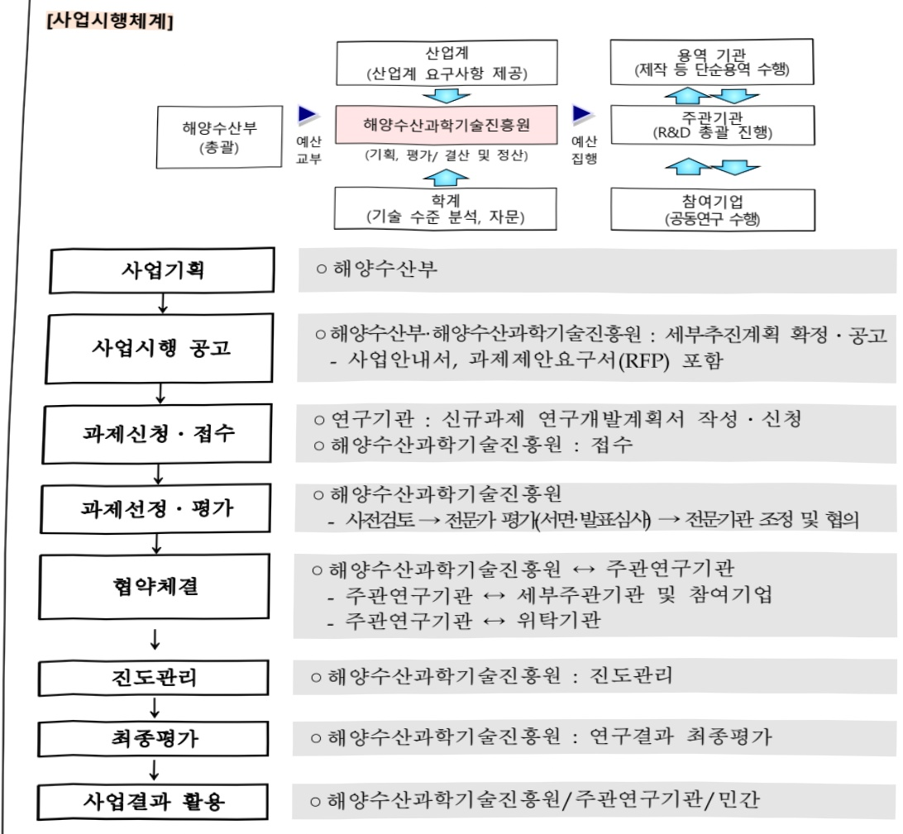

# 남극해 급격한 온난화 대응 남극 해빙 예측 기술 개발(R&D)

**해당 페이지**: PDF 4985 ~ 4991 쪽 해당

**부처**: 해양수산부
**분야**: 교통 및 물류
**회계유형**: 일반회계
**2026 확정예산**: 3360.0 백만원
**전년대비 증감률**: 29.2%
**AI 도메인**: 해양/수산

---

### 가.예산 총괄표

(단위: 백만원, %)

<table border=1 style='margin: auto; word-wrap: break-word;'><tr><td rowspan="2">사업명</td><td rowspan="2">2024년 결산</td><td colspan="2">2025년 예산</td><td colspan="2">2026년</td><td rowspan="2">중감(B-A)</td><td rowspan="2">(B-A)/A</td></tr><tr><td style='text-align: center; word-wrap: break-word;'>본예산(A)</td><td style='text-align: center; word-wrap: break-word;'>추경</td><td style='text-align: center; word-wrap: break-word;'>정부안</td><td style='text-align: center; word-wrap: break-word;'>확정(B)</td></tr><tr><td style='text-align: center; word-wrap: break-word;'>남극해 급격한 온난화 대응 남극 해빙 예측 기술 개발(R&amp;D)</td><td style='text-align: center; word-wrap: break-word;'></td><td style='text-align: center; word-wrap: break-word;'>2,600</td><td style='text-align: center; word-wrap: break-word;'>2,600</td><td style='text-align: center; word-wrap: break-word;'>3,360</td><td style='text-align: center; word-wrap: break-word;'>3,360</td><td style='text-align: center; word-wrap: break-word;'>760</td><td style='text-align: center; word-wrap: break-word;'>29.2</td></tr></table>

## □ 기능별(내역사업별), 목별 예산 내역

(단위:백만원)

<table border=1 style='margin: auto; word-wrap: break-word;'><tr><td rowspan="3"></td><td colspan="5">2024</td><td colspan="7">2025(2025.12월말)</td><td rowspan="3">2026예산</td></tr><tr><td rowspan="2">예산액(추정)</td><td rowspan="2">예산현액</td><td rowspan="2">집행액[실집행액]</td><td rowspan="2">이월액</td><td rowspan="2">불용액</td><td rowspan="2">본예산</td><td rowspan="2">예산현액</td><td rowspan="2">집행액[실집행액]</td><td colspan="2">전년도이월액제외</td><td rowspan="2">이월예상액</td><td rowspan="2">불용예상액</td></tr><tr><td style='text-align: center; word-wrap: break-word;'>예산현액</td><td style='text-align: center; word-wrap: break-word;'>집행액[실집행액]</td></tr><tr><td style='text-align: center; word-wrap: break-word;'>○ 기능별 분류(합계)</td><td style='text-align: center; word-wrap: break-word;'>-</td><td style='text-align: center; word-wrap: break-word;'>-</td><td style='text-align: center; word-wrap: break-word;'>-</td><td style='text-align: center; word-wrap: break-word;'>-</td><td style='text-align: center; word-wrap: break-word;'>-</td><td style='text-align: center; word-wrap: break-word;'>2,600</td><td style='text-align: center; word-wrap: break-word;'>2,600</td><td style='text-align: center; word-wrap: break-word;'>2,600[2,600]</td><td style='text-align: center; word-wrap: break-word;'>2,600</td><td style='text-align: center; word-wrap: break-word;'>2,600[2,600]</td><td style='text-align: center; word-wrap: break-word;'>-</td><td style='text-align: center; word-wrap: break-word;'>-</td><td style='text-align: center; word-wrap: break-word;'>3,360</td></tr><tr><td style='text-align: center; word-wrap: break-word;'>· 남극해 급격한 온난화 대응 남극해빙 예측 기술개발</td><td style='text-align: center; word-wrap: break-word;'>-</td><td style='text-align: center; word-wrap: break-word;'>-</td><td style='text-align: center; word-wrap: break-word;'>-</td><td style='text-align: center; word-wrap: break-word;'>-</td><td style='text-align: center; word-wrap: break-word;'>-</td><td style='text-align: center; word-wrap: break-word;'>2,600</td><td style='text-align: center; word-wrap: break-word;'>2,600[2,600]</td><td style='text-align: center; word-wrap: break-word;'>2,600[2,600]</td><td style='text-align: center; word-wrap: break-word;'>2,600[2,600]</td><td style='text-align: center; word-wrap: break-word;'>-</td><td style='text-align: center; word-wrap: break-word;'>-</td><td style='text-align: center; word-wrap: break-word;'>3,360</td><td style='text-align: center; word-wrap: break-word;'></td></tr><tr><td style='text-align: center; word-wrap: break-word;'>○ 비목별 분류(합계)</td><td style='text-align: center; word-wrap: break-word;'>-</td><td style='text-align: center; word-wrap: break-word;'>-</td><td style='text-align: center; word-wrap: break-word;'>-</td><td style='text-align: center; word-wrap: break-word;'>-</td><td style='text-align: center; word-wrap: break-word;'>-</td><td style='text-align: center; word-wrap: break-word;'>2,600</td><td style='text-align: center; word-wrap: break-word;'>2,600[2,600]</td><td style='text-align: center; word-wrap: break-word;'>2,600[2,600]</td><td style='text-align: center; word-wrap: break-word;'>2,600[2,600]</td><td style='text-align: center; word-wrap: break-word;'>-</td><td style='text-align: center; word-wrap: break-word;'>-</td><td style='text-align: center; word-wrap: break-word;'>3,360</td><td style='text-align: center; word-wrap: break-word;'></td></tr><tr><td style='text-align: center; word-wrap: break-word;'>· 연구개발활동비등(360-05)</td><td style='text-align: center; word-wrap: break-word;'>-</td><td style='text-align: center; word-wrap: break-word;'>-</td><td style='text-align: center; word-wrap: break-word;'>-</td><td style='text-align: center; word-wrap: break-word;'>-</td><td style='text-align: center; word-wrap: break-word;'>-</td><td style='text-align: center; word-wrap: break-word;'>2,600</td><td style='text-align: center; word-wrap: break-word;'>2,600[2,600]</td><td style='text-align: center; word-wrap: break-word;'>2,600[2,600]</td><td style='text-align: center; word-wrap: break-word;'>2,600[2,600]</td><td style='text-align: center; word-wrap: break-word;'>-</td><td style='text-align: center; word-wrap: break-word;'>-</td><td style='text-align: center; word-wrap: break-word;'>3,360</td><td style='text-align: center; word-wrap: break-word;'></td></tr><tr><td style='text-align: center; word-wrap: break-word;'>○ 기능비목별 분류(합계)</td><td style='text-align: center; word-wrap: break-word;'>-</td><td style='text-align: center; word-wrap: break-word;'>-</td><td style='text-align: center; word-wrap: break-word;'>-</td><td style='text-align: center; word-wrap: break-word;'>-</td><td style='text-align: center; word-wrap: break-word;'>-</td><td style='text-align: center; word-wrap: break-word;'>2,600</td><td style='text-align: center; word-wrap: break-word;'>2,600[2,600]</td><td style='text-align: center; word-wrap: break-word;'>2,600[2,600]</td><td style='text-align: center; word-wrap: break-word;'>2,600[2,600]</td><td style='text-align: center; word-wrap: break-word;'>-</td><td style='text-align: center; word-wrap: break-word;'>-</td><td style='text-align: center; word-wrap: break-word;'>3,360</td><td style='text-align: center; word-wrap: break-word;'></td></tr><tr><td style='text-align: center; word-wrap: break-word;'>· 남극해 급격한 온난화 대응 남극해빙 예측 기술개발-연구개발활동비등(360-05)</td><td style='text-align: center; word-wrap: break-word;'>-</td><td style='text-align: center; word-wrap: break-word;'>-</td><td style='text-align: center; word-wrap: break-word;'>-</td><td style='text-align: center; word-wrap: break-word;'>-</td><td style='text-align: center; word-wrap: break-word;'>-</td><td style='text-align: center; word-wrap: break-word;'>2,600</td><td style='text-align: center; word-wrap: break-word;'>2,600[2,600]</td><td style='text-align: center; word-wrap: break-word;'>2,600[2,600]</td><td style='text-align: center; word-wrap: break-word;'>2,600[2,600]</td><td style='text-align: center; word-wrap: break-word;'>-</td><td style='text-align: center; word-wrap: break-word;'>-</td><td style='text-align: center; word-wrap: break-word;'>3,360</td><td style='text-align: center; word-wrap: break-word;'></td></tr></table>

---

### 나. 사업설명자료

## 1 ) 사업목적·내용

- (남극해 급격한 온난화 대응 남극 해빙 예측기술 개발) 남극해 급격한 온난화에 따른

남극 해빙 융해 프로세스 규명 및 국제협력 기반 AI 적용 남극 해빙 장기 예측

시스템 개발과 계절 예측 자료 생산

## 2 ) 사업개요

## □ 사업근거 및 추진경위

① 법령상 근거 조항 적시

- 「해양수산과학기술육성법」 제8조 : 해양수산부 장관은 연도별·분야별 해양수산과학 기술 연구개발 과제를 추진

-「해양수산발전기본법」제17조 : 정부는 해양과학조사계획을 수립하고 해양에 대한

과학조사 및 관측 실시

- 「극지활동진흥법」제8조 : 국가는 극지 관련 연구개발 촉진 및 활성화를 위해 연구 개발사업 지원

- 남극활동 및 환경보호에 관한 법률 제21조 : 국제협력 촉진 위해 외국과 정보교환, 기술협력, 공동조사 · 연구 추진·지원

② 추진경위

- (기획연구) 남극해 급격한 온난화 대응 남극 해빙 예측 기술 개발 위한 기획연구 완료 (24.03)

- 세분화된 체계로 구성하여 각계 다양한 전문가 의견수렴

* 연구기획위원회(남극 해빙 관측/해빙 모델링 및 예측/AI기술 적용 3개 분과로 구성)에 20여 명 산·학·연

전문가 참여, 국제·국내 자문위원회 운영, 전문가 설문 및 경제성 평가 수행

- 해빙 예측·관측분야 선진 기관들로부터 협력방안 협의 협력의향서 접수

* 연구기획위원회(남극 해빙 관측/해빙 모델링 및 예측/AI기술 적용 3개 분과로 구성)에 20여 명 산학연

전문가 참여, 국제국내 자문위원회 운영, 전문가 설문 및 경제성 평가 수행

---

## □ 주요내용

① 사업규모

- 총사업비(해당되는 경우에만 기재) : 해당사항 없음

- 사업기간 : '25 ~ '30

- 최근 5년 간 투입된 사업비

<table border=1 style='margin: auto; word-wrap: break-word;'><tr><td style='text-align: center; word-wrap: break-word;'>연도</td><td style='text-align: center; word-wrap: break-word;'>2022</td><td style='text-align: center; word-wrap: break-word;'>2023</td><td style='text-align: center; word-wrap: break-word;'>2024</td><td style='text-align: center; word-wrap: break-word;'>2025</td><td style='text-align: center; word-wrap: break-word;'>2026</td></tr><tr><td style='text-align: center; word-wrap: break-word;'>사업비</td><td style='text-align: center; word-wrap: break-word;'>-</td><td style='text-align: center; word-wrap: break-word;'>-</td><td style='text-align: center; word-wrap: break-word;'>-</td><td style='text-align: center; word-wrap: break-word;'>2,600</td><td style='text-align: center; word-wrap: break-word;'>3,360</td></tr></table>

- 기타 : 해당사항 없음

② 사업추진체계

- 사업시행방법 : 출연

- 사업시행주체 : 해양수산부(전문기관 : 해양수산과학기술진흥원)

-사업 수혜자 : 대학, 기업, 출연연 등

- 보조, 융자, 출연, 출자 등의 경우 보조·융자 등 지원 비율 및 법적근거

<table border=1 style='margin: auto; word-wrap: break-word;'><tr><td style='text-align: center; word-wrap: break-word;'>내역사업명</td><td style='text-align: center; word-wrap: break-word;'>구분</td><td style='text-align: center; word-wrap: break-word;'>피보조·피출연 등 기관명</td><td style='text-align: center; word-wrap: break-word;'>지원 금액 (2026예산)</td><td style='text-align: center; word-wrap: break-word;'>지원 비율(%)</td><td style='text-align: center; word-wrap: break-word;'>보조율 법적근거 (해당 조항)</td></tr><tr><td style='text-align: center; word-wrap: break-word;'>남극해 급격한 온난화 대응 남극 해빙 예측 기술 개발</td><td style='text-align: center; word-wrap: break-word;'>출연</td><td style='text-align: center; word-wrap: break-word;'>해양수산 과학기술 진흥원</td><td style='text-align: center; word-wrap: break-word;'>3,360</td><td style='text-align: center; word-wrap: break-word;'>100</td><td style='text-align: center; word-wrap: break-word;'>해양수산과학기술육성법 제23조 (해양수산과학기술진흥원의 설립)</td></tr></table>

---

## 3 ) 2026년도 예산 산출 근거

① 남극해 급격한 온난화 대응 남극 해빙 예측 기술 개발

:(25)2,600백만원→(26요구)3,360백만원,+760백만원

- (요구) 남극해 급격한 온난화에 따른 남극 해빙 융해 프로세스 규명 및 국제협력 기반 AI 적용 남극 해빙 장기예측 시스템 개발과 계절예측 자료 생산을 위한 사업비 3,360백만원 요구

- (산출) (계속) 남극해 급격한 온난화 대응 남극 해빙 예측 기술개발 : 3,360백만원

°2025년도 추가경정예산 및 2026년도 예산 산출 세부내역 비교

<table border=1 style='margin: auto; word-wrap: break-word;'><tr><td colspan="2">2025년 제2회 추가경정예산</td><td colspan="2">2026년 예산</td></tr><tr><td style='text-align: center; word-wrap: break-word;'>예산</td><td style='text-align: center; word-wrap: break-word;'>산출내역</td><td style='text-align: center; word-wrap: break-word;'>예산</td><td style='text-align: center; word-wrap: break-word;'>산출내역</td></tr><tr><td rowspan="20">2,600 백만원</td><td style='text-align: center; word-wrap: break-word;'>○ 남극해 급격한 온난화 대응 남극 해빙 예측기술 개발 : 2,600 백만원</td><td rowspan="20">3,360 백만원</td><td style='text-align: center; word-wrap: break-word;'>○ 남극해 급격한 온난화 대응 남극 해빙 예측기술 개발 : 3,360 백만원</td></tr><tr><td style='text-align: center; word-wrap: break-word;'>● 남극 해빙 관측체계 구축 : 1,200백만원</td><td style='text-align: center; word-wrap: break-word;'>● 남극 해빙 관측체계 구축 : 1,660백만원</td></tr><tr><td style='text-align: center; word-wrap: break-word;'>- 첨단 현장 관측기술 기반 남극 해빙 관측체계 구축: 900백만원</td><td style='text-align: center; word-wrap: break-word;'>- 첨단 현장 관측기술 기반 남극 해빙 관측체계 구축: 1,300백만원</td></tr><tr><td style='text-align: center; word-wrap: break-word;'>- 해빙 위 관측장비 설치 및 관측: 400백만원</td><td style='text-align: center; word-wrap: break-word;'>- 해빙 위 관측장비 설치관측 및 UAV 활용 해빙 광역 직접관측: 600백만원</td></tr><tr><td style='text-align: center; word-wrap: break-word;'>- 테라노바만 폴리나 생성:소멸 과정 관측: 300백만원</td><td style='text-align: center; word-wrap: break-word;'>- 테라노바만 폴리나 생성:소멸 과정 관측: 400백만원</td></tr><tr><td style='text-align: center; word-wrap: break-word;'>- 아라온 기반 해빙 관측: 200백만원</td><td style='text-align: center; word-wrap: break-word;'>- 아라온 기반 해빙 관측: 300백만원</td></tr><tr><td style='text-align: center; word-wrap: break-word;'>- 급격한 남극 해빙 용융 프로세스 규명: 300백만원</td><td style='text-align: center; word-wrap: break-word;'>- 급격한 남극 해빙 용융 프로세스 규명: 360백만원</td></tr><tr><td style='text-align: center; word-wrap: break-word;'>- 테라노바만 3차원 해빙-대기-해양 구조 분석: 300백만원</td><td style='text-align: center; word-wrap: break-word;'>- 테라노바만 3차원 해빙-대기-해양 구조 분석: 360백만원</td></tr><tr><td style='text-align: center; word-wrap: break-word;'>● AI 기반 남극 해빙 계절예측 자료 생산: 1,400백만원</td><td style='text-align: center; word-wrap: break-word;'>● AI 기반 남극 해빙 계절예측 자료 생산: 1,400백만원</td></tr><tr><td style='text-align: center; word-wrap: break-word;'>- 최신 해빙모델 및 AI기술 기반 계절예측 자료 생산 체계 구축: 800백만원</td><td style='text-align: center; word-wrap: break-word;'>- 최신 해빙모델 및 AI기술 기반 계절예측 자료 생산 체계 구축: 700백만원</td></tr><tr><td style='text-align: center; word-wrap: break-word;'>- 해빙모델 기반 계절예측 자료 생산 체계 구축: 300백만원</td><td style='text-align: center; word-wrap: break-word;'>- 해빙모델 기반 계절예측 자료 생산 체계 구축: 300백만원</td></tr><tr><td style='text-align: center; word-wrap: break-word;'>- AI기술 기반 계절예측 자료 생산 체계 구축: 300백만원</td><td style='text-align: center; word-wrap: break-word;'>- AI기술 기반 계절예측 자료 생산 체계 구축: 300백만원</td></tr><tr><td style='text-align: center; word-wrap: break-word;'>- AI 기술 활용 남극 해빙 예측성 특성 분석: 200백만원</td><td style='text-align: center; word-wrap: break-word;'>- AI 기술 활용 남극 해빙 예측성 특성 분석: 200백만원</td></tr><tr><td style='text-align: center; word-wrap: break-word;'>- AI 기반 예측시스템 자료동화 기법 개발: 600백만원</td><td style='text-align: center; word-wrap: break-word;'>- AI 기반 예측시스템 자료동화 기법 개발: 700백만원</td></tr><tr><td style='text-align: center; word-wrap: break-word;'>- AI 기반 해빙 농도 위성관측 자료 품질개선 기술 개발: 250백만원</td><td style='text-align: center; word-wrap: break-word;'>- AI 기반 해빙 농도 위성관측 자료 품질개선 기술 개발: 350백만원</td></tr><tr><td style='text-align: center; word-wrap: break-word;'>- AI 기반 관측연산자 및 자료동화 체계 구축: 350백만원</td><td style='text-align: center; word-wrap: break-word;'>- AI 기반 관측연산자 및 자료동화 체계 구축: 350백만원</td></tr><tr><td style='text-align: center; word-wrap: break-word;'></td><td style='text-align: center; word-wrap: break-word;'>● 남극 해빙 모델 개선: 300백만원</td></tr><tr><td style='text-align: center; word-wrap: break-word;'></td><td style='text-align: center; word-wrap: break-word;'>- 남극 해빙 모델 개선: 300백만원</td></tr><tr><td style='text-align: center; word-wrap: break-word;'></td><td style='text-align: center; word-wrap: break-word;'>- 해빙모델 성능 비교평가 및 해빙모델 안정화: 200백만원</td></tr><tr><td style='text-align: center; word-wrap: break-word;'></td><td style='text-align: center; word-wrap: break-word;'>- 남극 고작빙 분포의 모델 재현·예측 성능 개선: 100백만원</td></tr></table>

---

## 4 ) 사업효과

□ 사업영향, 산출물 성과지표 등

① '21~'25년도 성과계획서 상 성과지표 및 최근 5년간 성과 달성도

<table border=1 style='margin: auto; word-wrap: break-word;'><tr><td style='text-align: center; word-wrap: break-word;'>성과지표</td><td style='text-align: center; word-wrap: break-word;'>구분</td><td style='text-align: center; word-wrap: break-word;'>2022</td><td style='text-align: center; word-wrap: break-word;'>2023</td><td style='text-align: center; word-wrap: break-word;'>2024</td><td style='text-align: center; word-wrap: break-word;'>2025</td><td style='text-align: center; word-wrap: break-word;'>2026</td><td style='text-align: center; word-wrap: break-word;'>2026 목표치산출근거</td><td style='text-align: center; word-wrap: break-word;'>측정산식(또는 측정방법)</td><td style='text-align: center; word-wrap: break-word;'>자료수집방법(또는 자료출처)</td></tr><tr><td rowspan="3">해양수산일자리창출수(명)</td><td style='text-align: center; word-wrap: break-word;'>목표</td><td style='text-align: center; word-wrap: break-word;'>-</td><td style='text-align: center; word-wrap: break-word;'>-</td><td style='text-align: center; word-wrap: break-word;'>-</td><td style='text-align: center; word-wrap: break-word;'>255</td><td style='text-align: center; word-wrap: break-word;'>261</td><td rowspan="3">-</td><td rowspan="3">해양수산창업투자지원사업수혜기업의 신규고용창출 수</td><td rowspan="3">해양수산과학기술진흥원(KIMST) 보고서</td></tr><tr><td style='text-align: center; word-wrap: break-word;'>실적</td><td style='text-align: center; word-wrap: break-word;'>-</td><td style='text-align: center; word-wrap: break-word;'>-</td><td style='text-align: center; word-wrap: break-word;'>-</td><td style='text-align: center; word-wrap: break-word;'>-</td><td style='text-align: center; word-wrap: break-word;'>-</td></tr><tr><td style='text-align: center; word-wrap: break-word;'>달성도</td><td style='text-align: center; word-wrap: break-word;'>-</td><td style='text-align: center; word-wrap: break-word;'>-</td><td style='text-align: center; word-wrap: break-word;'>-</td><td style='text-align: center; word-wrap: break-word;'>-</td><td style='text-align: center; word-wrap: break-word;'>-</td></tr></table>

② 성과지표 이외의 연도별 사업추진 경과 및 실적

<table border=1 style='margin: auto; word-wrap: break-word;'><tr><td style='text-align: center; word-wrap: break-word;'>2025</td><td style='text-align: center; word-wrap: break-word;'>• 신규과제 선정(&#x27;25.3.) 및 착수(&#x27;25.4.)</td></tr></table>

③ 향후(2026년도 이후) 기대효과

- (국내) 남극 해빙 현장관측 기술 확보 및 예측자료 자체 생산으로 지구시스템

메커니즘에 대한 이해 증진 및 국가 기후변화 대응기술력 제고와 해양재난 예측

정확도 향상에 기여

- (국외) 우리나라가 주도하는 국제협력연구 수행 및 유용한 남극 해빙 계절에 측

자료 전파를 통해 국제사회 영향력 확보

- 남극 탐사선 최적 항로 계획 수립 및 어선의 안전 조업에 기여, 선박 운항 탄소 발자국 및 인명과 경제적 손실 위험 저감하여 관련 산업 부흥에 기여

---

5) 타당성조사 및 예비타당성조사 시행여부 및 결과 요지 : 해당사항 없음

6) 총사업비 대상사업 여부 및 내역 : 해당사항 없음

## 7 ) 사업 집행절차

8) 각종 평가 : 해당사항 없음

다. 최근 4년간 결산내역 : 해당사항 없음

---

<table border=1 style='margin: auto; word-wrap: break-word;'><tr><td style='text-align: center; word-wrap: break-word;'>사 업 명</td></tr><tr><td style='text-align: center; word-wrap: break-word;'>(60) 머신러닝 기반 해저면 특성 분류 기술개발(R&amp;D) (2046-309)</td></tr></table>

□ 사업 코드 정보

<table border=1 style='margin: auto; word-wrap: break-word;'><tr><td style='text-align: center; word-wrap: break-word;'>구분</td><td style='text-align: center; word-wrap: break-word;'>회계</td><td style='text-align: center; word-wrap: break-word;'>소관</td><td style='text-align: center; word-wrap: break-word;'>실국(기관)</td><td style='text-align: center; word-wrap: break-word;'>계정</td><td style='text-align: center; word-wrap: break-word;'>분야</td><td style='text-align: center; word-wrap: break-word;'>부문</td></tr><tr><td style='text-align: center; word-wrap: break-word;'>코드</td><td style='text-align: center; word-wrap: break-word;'>11</td><td style='text-align: center; word-wrap: break-word;'>28</td><td rowspan="2">국립해양조사원</td><td rowspan="2">-</td><td style='text-align: center; word-wrap: break-word;'>120</td><td style='text-align: center; word-wrap: break-word;'>126</td></tr><tr><td style='text-align: center; word-wrap: break-word;'>명칭</td><td style='text-align: center; word-wrap: break-word;'>일반회계</td><td style='text-align: center; word-wrap: break-word;'>해양수산부</td><td style='text-align: center; word-wrap: break-word;'>교통 및 물류</td><td style='text-align: center; word-wrap: break-word;'>물류 등 기타</td></tr></table>

<table border=1 style='margin: auto; word-wrap: break-word;'><tr><td style='text-align: center; word-wrap: break-word;'>구분</td><td style='text-align: center; word-wrap: break-word;'>프로그램</td><td style='text-align: center; word-wrap: break-word;'>단위사업</td><td style='text-align: center; word-wrap: break-word;'>세부사업</td></tr><tr><td style='text-align: center; word-wrap: break-word;'>코드</td><td style='text-align: center; word-wrap: break-word;'>2000</td><td style='text-align: center; word-wrap: break-word;'>2046</td><td style='text-align: center; word-wrap: break-word;'>309</td></tr><tr><td style='text-align: center; word-wrap: break-word;'>명칭</td><td style='text-align: center; word-wrap: break-word;'>해양산업육성 및 영토관리</td><td style='text-align: center; word-wrap: break-word;'>해양수산산업진흥(R&amp;D)</td><td style='text-align: center; word-wrap: break-word;'>머신러닝 기반 해저면 특성 분류 기술개발(R&amp;D)</td></tr></table>

□ 사업 성격 (공통요구자료 Ⅱ-1 작성유의사항 4. 참조, 해당하는 사항에 “○” 표시)

<table border=1 style='margin: auto; word-wrap: break-word;'><tr><td style='text-align: center; word-wrap: break-word;'>신규</td><td style='text-align: center; word-wrap: break-word;'>계속</td><td style='text-align: center; word-wrap: break-word;'>완료</td><td style='text-align: center; word-wrap: break-word;'>예비타당성 실시여부</td><td style='text-align: center; word-wrap: break-word;'>총사업비 관리대상</td><td style='text-align: center; word-wrap: break-word;'>총액계상 예산사업</td><td style='text-align: center; word-wrap: break-word;'>사업소관 변경정보 2025예산 시 소관</td></tr><tr><td style='text-align: center; word-wrap: break-word;'></td><td style='text-align: center; word-wrap: break-word;'>☐</td><td style='text-align: center; word-wrap: break-word;'></td><td style='text-align: center; word-wrap: break-word;'></td><td style='text-align: center; word-wrap: break-word;'></td><td style='text-align: center; word-wrap: break-word;'></td><td style='text-align: center; word-wrap: break-word;'></td></tr></table>

□ 사업 지원 형태 및 지원을 (최소한 한 개는 반드시 선택하시오. 해당사항에 0 표시)

<table border=1 style='margin: auto; word-wrap: break-word;'><tr><td style='text-align: center; word-wrap: break-word;'>직접</td><td style='text-align: center; word-wrap: break-word;'>출자</td><td style='text-align: center; word-wrap: break-word;'>출연</td><td style='text-align: center; word-wrap: break-word;'>보조</td><td style='text-align: center; word-wrap: break-word;'>융자</td><td style='text-align: center; word-wrap: break-word;'>국고보조율(%)</td><td style='text-align: center; word-wrap: break-word;'>융자율(%)</td></tr><tr><td style='text-align: center; word-wrap: break-word;'></td><td style='text-align: center; word-wrap: break-word;'></td><td style='text-align: center; word-wrap: break-word;'>○</td><td style='text-align: center; word-wrap: break-word;'></td><td style='text-align: center; word-wrap: break-word;'></td><td style='text-align: center; word-wrap: break-word;'></td><td style='text-align: center; word-wrap: break-word;'></td></tr></table>

## □ 사업 담당자

<table border=1 style='margin: auto; word-wrap: break-word;'><tr><td style='text-align: center; word-wrap: break-word;'>사업명</td><td colspan="2">구분</td></tr><tr><td rowspan="2">머신러닝 기반 해저면 특성 분류 기술개발 (R&amp;D)</td><td style='text-align: center; word-wrap: break-word;'>소관부처</td><td style='text-align: center; word-wrap: break-word;'>실·국·과(팀)명 국립해양조사원 수로측량과</td></tr><tr><td style='text-align: center; word-wrap: break-word;'>사업시행주체</td><td style='text-align: center; word-wrap: break-word;'>해양수산과학기술진흥원 해양R&amp;D실</td></tr></table>

---

### 원본 PDF 크롭 이미지

