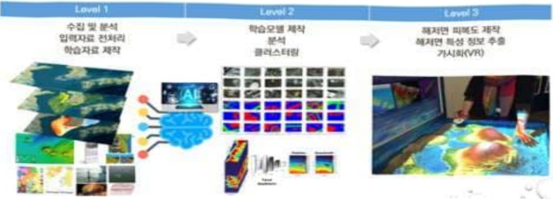
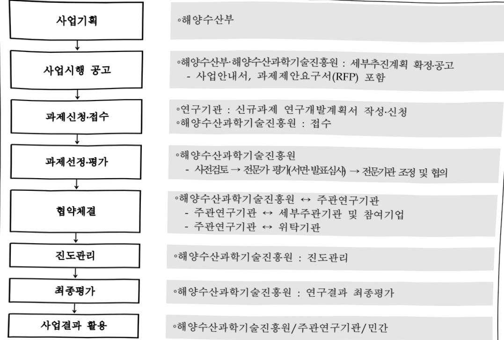

# 머신러닝 기반 해저면 특성 분류 기술개발(R&D)

**해당 페이지**: PDF 4992 ~ 5000 쪽 해당

**부처**: 해양수산부
**분야**: 교통 및 물류
**회계유형**: 일반회계
**2026 확정예산**: 3170.0 백만원
**전년대비 증감률**: None%
**AI 도메인**: 해양/수산

---

### 가. 예산 총괄표

(단위: 백만원, %)

<table border=1 style='margin: auto; word-wrap: break-word;'><tr><td rowspan="2">사업명</td><td rowspan="2">2024년 결산</td><td colspan="2">2025년 예산</td><td colspan="2">2026년</td><td rowspan="2">중감(B-A)</td><td rowspan="2">(B-A)/A</td></tr><tr><td style='text-align: center; word-wrap: break-word;'>본예산(A)</td><td style='text-align: center; word-wrap: break-word;'>추경</td><td style='text-align: center; word-wrap: break-word;'>정부안</td><td style='text-align: center; word-wrap: break-word;'>확정(B)</td></tr><tr><td style='text-align: center; word-wrap: break-word;'>머신러닝 기반 해저면 특성 분류 기술개발(R&amp;D)</td><td style='text-align: center; word-wrap: break-word;'>2,670</td><td style='text-align: center; word-wrap: break-word;'>3,170</td><td style='text-align: center; word-wrap: break-word;'>3,170</td><td style='text-align: center; word-wrap: break-word;'>3,170</td><td style='text-align: center; word-wrap: break-word;'>3,170</td><td style='text-align: center; word-wrap: break-word;'>-</td><td style='text-align: center; word-wrap: break-word;'>-</td></tr></table>

□ 기능별(내역사업별), 목별 예산 내역

(단위:백만원)

<table border=1 style='margin: auto; word-wrap: break-word;'><tr><td rowspan="3"></td><td colspan="5">2024</td><td colspan="7">2025(2025.12월말)</td><td rowspan="3">2026예산</td></tr><tr><td rowspan="2">예산액(추정)</td><td rowspan="2">예산현액</td><td rowspan="2">집행액[실집행액]</td><td rowspan="2">이월액</td><td rowspan="2">불용액</td><td rowspan="2">본예산</td><td rowspan="2">예산현액</td><td rowspan="2">집행액[실집행액]</td><td colspan="2">전년도이월액제외</td><td rowspan="2">이월예상액</td><td rowspan="2">불용예상액</td></tr><tr><td style='text-align: center; word-wrap: break-word;'>예산현액</td><td style='text-align: center; word-wrap: break-word;'>집행액[실집행액]</td></tr><tr><td style='text-align: center; word-wrap: break-word;'>○ 기능별 분류(합계)</td><td style='text-align: center; word-wrap: break-word;'>2,670</td><td style='text-align: center; word-wrap: break-word;'>2,670</td><td style='text-align: center; word-wrap: break-word;'>2,670[2,670]</td><td style='text-align: center; word-wrap: break-word;'>-</td><td style='text-align: center; word-wrap: break-word;'>-</td><td style='text-align: center; word-wrap: break-word;'>3,170</td><td style='text-align: center; word-wrap: break-word;'>3,170[3,170]</td><td style='text-align: center; word-wrap: break-word;'>3,170[3,170]</td><td style='text-align: center; word-wrap: break-word;'>3,170[3,170]</td><td style='text-align: center; word-wrap: break-word;'>3,170[3,170]</td><td style='text-align: center; word-wrap: break-word;'>-</td><td style='text-align: center; word-wrap: break-word;'>-</td><td style='text-align: center; word-wrap: break-word;'>3,170</td></tr><tr><td rowspan="2">· 머신타닝 기반 해저면 특성 분류 기술개발· 광역해양생태계 변동요인 대응 관리를 위한 AI기반 해양생태계 진단 예측 기술개발</td><td style='text-align: center; word-wrap: break-word;'>2,170</td><td style='text-align: center; word-wrap: break-word;'>2,170</td><td style='text-align: center; word-wrap: break-word;'>2,170[2,170]</td><td style='text-align: center; word-wrap: break-word;'>-</td><td style='text-align: center; word-wrap: break-word;'>-</td><td style='text-align: center; word-wrap: break-word;'>3,170</td><td style='text-align: center; word-wrap: break-word;'>3,170[3,170]</td><td style='text-align: center; word-wrap: break-word;'>3,170[3,170]</td><td style='text-align: center; word-wrap: break-word;'>3,170[3,170]</td><td style='text-align: center; word-wrap: break-word;'>-</td><td style='text-align: center; word-wrap: break-word;'>-</td><td style='text-align: center; word-wrap: break-word;'>3,170</td><td style='text-align: center; word-wrap: break-word;'>-</td></tr><tr><td style='text-align: center; word-wrap: break-word;'>500</td><td style='text-align: center; word-wrap: break-word;'>500</td><td style='text-align: center; word-wrap: break-word;'>500[500]</td><td style='text-align: center; word-wrap: break-word;'>-</td><td style='text-align: center; word-wrap: break-word;'>-</td><td style='text-align: center; word-wrap: break-word;'>-</td><td style='text-align: center; word-wrap: break-word;'>-</td><td style='text-align: center; word-wrap: break-word;'>-</td><td style='text-align: center; word-wrap: break-word;'>-</td><td style='text-align: center; word-wrap: break-word;'>-</td><td style='text-align: center; word-wrap: break-word;'>-</td><td style='text-align: center; word-wrap: break-word;'>-</td><td style='text-align: center; word-wrap: break-word;'>-</td></tr><tr><td style='text-align: center; word-wrap: break-word;'>○ 비목별 분류(합계)</td><td style='text-align: center; word-wrap: break-word;'>2,670</td><td style='text-align: center; word-wrap: break-word;'>2,670</td><td style='text-align: center; word-wrap: break-word;'>2,670[2,670]</td><td style='text-align: center; word-wrap: break-word;'>-</td><td style='text-align: center; word-wrap: break-word;'>-</td><td style='text-align: center; word-wrap: break-word;'>3,170</td><td style='text-align: center; word-wrap: break-word;'>3,170[3,170]</td><td style='text-align: center; word-wrap: break-word;'>3,170[3,170]</td><td style='text-align: center; word-wrap: break-word;'>3,170[3,170]</td><td style='text-align: center; word-wrap: break-word;'>-</td><td style='text-align: center; word-wrap: break-word;'>-</td><td style='text-align: center; word-wrap: break-word;'>3,170</td><td style='text-align: center; word-wrap: break-word;'>-</td></tr><tr><td style='text-align: center; word-wrap: break-word;'>· 연구개 발활동비 등(360-05)</td><td style='text-align: center; word-wrap: break-word;'>2,670</td><td style='text-align: center; word-wrap: break-word;'>2,670</td><td style='text-align: center; word-wrap: break-word;'>2,670[2,670]</td><td style='text-align: center; word-wrap: break-word;'>-</td><td style='text-align: center; word-wrap: break-word;'>-</td><td style='text-align: center; word-wrap: break-word;'>3,170</td><td style='text-align: center; word-wrap: break-word;'>3,170[3,170]</td><td style='text-align: center; word-wrap: break-word;'>3,170[3,170]</td><td style='text-align: center; word-wrap: break-word;'>3,170[3,170]</td><td style='text-align: center; word-wrap: break-word;'>-</td><td style='text-align: center; word-wrap: break-word;'>-</td><td style='text-align: center; word-wrap: break-word;'>3,170</td><td style='text-align: center; word-wrap: break-word;'>-</td></tr><tr><td style='text-align: center; word-wrap: break-word;'>○ 기능비목별 분류(합계)</td><td style='text-align: center; word-wrap: break-word;'>2,670</td><td style='text-align: center; word-wrap: break-word;'>2,670</td><td style='text-align: center; word-wrap: break-word;'>2,670[2,670]</td><td style='text-align: center; word-wrap: break-word;'>-</td><td style='text-align: center; word-wrap: break-word;'>-</td><td style='text-align: center; word-wrap: break-word;'>3,170</td><td style='text-align: center; word-wrap: break-word;'>3,170[3,170]</td><td style='text-align: center; word-wrap: break-word;'>3,170[3,170]</td><td style='text-align: center; word-wrap: break-word;'>3,170[3,170]</td><td style='text-align: center; word-wrap: break-word;'>-</td><td style='text-align: center; word-wrap: break-word;'>-</td><td style='text-align: center; word-wrap: break-word;'>3,170</td><td style='text-align: center; word-wrap: break-word;'>-</td></tr><tr><td rowspan="3">· 머신타닝 기반 해저면 특성 분류 기술개발· 연구개 발활동비 등(360-05)· 광역해양생태계 변동요인 대응 관리를 위한 AI기반 해양생태계 진단 예측 기술개발· 연구개 발활동비 등(360-05)</td><td style='text-align: center; word-wrap: break-word;'>2,170</td><td style='text-align: center; word-wrap: break-word;'>2,170</td><td style='text-align: center; word-wrap: break-word;'>2,170[2,170]</td><td style='text-align: center; word-wrap: break-word;'>-</td><td style='text-align: center; word-wrap: break-word;'>-</td><td style='text-align: center; word-wrap: break-word;'>3,170</td><td style='text-align: center; word-wrap: break-word;'>3,170[3,170]</td><td style='text-align: center; word-wrap: break-word;'>3,170[3,170]</td><td style='text-align: center; word-wrap: break-word;'>3,170[3,170]</td><td style='text-align: center; word-wrap: break-word;'>-</td><td style='text-align: center; word-wrap: break-word;'>-</td><td style='text-align: center; word-wrap: break-word;'>3,170</td><td style='text-align: center; word-wrap: break-word;'>-</td></tr><tr><td style='text-align: center; word-wrap: break-word;'>500</td><td style='text-align: center; word-wrap: break-word;'>500</td><td style='text-align: center; word-wrap: break-word;'>500[500]</td><td style='text-align: center; word-wrap: break-word;'>-</td><td style='text-align: center; word-wrap: break-word;'>-</td><td style='text-align: center; word-wrap: break-word;'>-</td><td style='text-align: center; word-wrap: break-word;'>-</td><td style='text-align: center; word-wrap: break-word;'>-</td><td style='text-align: center; word-wrap: break-word;'>-</td><td style='text-align: center; word-wrap: break-word;'>-</td><td style='text-align: center; word-wrap: break-word;'>-</td><td style='text-align: center; word-wrap: break-word;'>-</td><td style='text-align: center; word-wrap: break-word;'>-</td></tr><tr><td style='text-align: center; word-wrap: break-word;'>500</td><td style='text-align: center; word-wrap: break-word;'>500</td><td style='text-align: center; word-wrap: break-word;'>500[500]</td><td style='text-align: center; word-wrap: break-word;'>-</td><td style='text-align: center; word-wrap: break-word;'>-</td><td style='text-align: center; word-wrap: break-word;'>-</td><td style='text-align: center; word-wrap: break-word;'>-</td><td style='text-align: center; word-wrap: break-word;'>-</td><td style='text-align: center; word-wrap: break-word;'>-</td><td style='text-align: center; word-wrap: break-word;'>-</td><td style='text-align: center; word-wrap: break-word;'>-</td><td style='text-align: center; word-wrap: break-word;'>-</td><td style='text-align: center; word-wrap: break-word;'>-</td></tr></table>

---

### 나. 사업설명자료

## 1 ) 사업목적·내용

- (머신러닝 기반 해저면 특성 분류 기술개발)

- 머신러닝 및 AI 기술 기반의 해양공간계획을 위한 해저면 특성 분류·피복 정보 생산 및 광역생태계 정보 진단·예측 기술개발

- (머신러닝 기반 해저면 특성 분류 기술개발)

- 머신러닝 기법을 적용하여 지속 가능한 해양공간의 합리적 활용 및 보전에 필요한

초정밀 해저면 특성 분류 및 피복정보 생성 기술개발

## 2 ) 사업개요

## □ 사업근거 및 추진경위

① 법령상 근거 및 조항 적시

- 해양수산과학기술육성법 제8조(연구개발사업등의 추진)

- 해양수산발전기본법 제17조(해양과학조사 및 기술개발 등)

- 해양수산발전기본법 제28조의2(해양수산분야 신산업 개발의 지원)

- 해양조사와 해양정보 활용에 관한 법률 제12조(연구 · 개발 등의 추진)

- 해양공간계획법 제4조(국가 등의 책무), 해양환경보전법 제15조(해양환경의 중합적 공간관리)

- 해양생태계법 제4조(국가 등의 책무) 및 같은 법 9조의2(해양생태축의 설정)

② 추진경위 - 사업 시작년도, 추진배경, 부처별 중점과제, 대통령 공약사항 등

<해양이용 생태적 이용 필요성 증대 >

0 해양공간계획법(19.4월 시행)에 따라 해양의 생태적·문화적·경제적 가치가 공존하는 이용·개발을 기본원칙으로 강조

추진경위

- 선점식 해양개발을 지양하고, 해양공간의 통합적·참여적 관리를 위한 생태 과학적

기초정보로서 해저면 특성 정보의 중요성 증가

ㅇ 해양공간과 자원을 통합관리하기 위한 평가 및 분석기술 필요성 증대

→우리나라 관할해역에 전반에 대한 해저면 특성 정보의 수요·필요성 증가

- 해저면 특성 정보는 수심, (특이)지형 뿐만아니라 해저면 상부, 천부의 저질·피복, 생태 서식지 및 해저면 하부 지층의 수평·수직적 상태에 대한 정보로 해상 시설물 건설, 연근해 양식, CO₂ 지중저장 연구개발, 석유가스자원 탐사 및 개발에 필요한 기초 정보

---

*해저면 피복 분류: 자연상태 해저면의 물리적인 상태를 분류한 것을 의미

* 해저면 피복도: 물리적인 상태를 일정한 기준에 따라 분류하고, 해저면 특성 정보를 지도로 표현한 주제도

## < 해저탐사의 효율성 및 경제성 획기적 제고 >

기존 해저면 특성 정보 취득방법은 피스톤코어, 드릴링 등 높은 단가와 긴 시간이 소요되어 관할해역 전반에 고밀도 자료 획득에 한계가 있으며 고중량의 탐사장비를 해저에 낙하 후 회수하는 기간 안전사고 위험 내포

→ 기존의 수심측량 등 음파를 이용한 탐사장비 관측자료에 머신러닝 기반의 자동저질

분류 기법을 적용함으로써 수심측량과 동시에 해저 저질 등 해저면 특성 정보를

획득하는 것이 가능하며 조사의 경제성 비약적 제고

- 국립해양조사원, 지질자원연구원 등이 수행한 기존 측량·탐사에 적용하는 경우 단기간에 고밀도·고해상도의 해저면 특성 정보 추출 가능

## < 경제성 분석 >

0 현재 퇴적물 시료 정점당 채취 및 분석에는 약 24만원의 비용 발생 및 해양 안전사고 위험 내포.

국립해양조사원의 경우, 연간 5,000~40,000km² 면적(관할해역 43.8만km²)에 대해 1,500~2,000개(단위 셀(6km²)당 3~5개)의 퇴적물 시료를 취득하고 있음

- 본 연구를 성공적으로 수행하여 멀티빔 음향시스템을 이용한 저질정보 생산 시 기존 대비 최대 800배(단위 셀 당 2,400개)의 저질정보를 생산할 수 있으며, 그 가치는 5조 원이상 이를 것으로 예상함

## < 추진 경과 >

(선행연구) 3D 해저 정밀영상화를 위한 복합 탄성파탐사 및 실규모 고분해능 처리기술 개발('20~, '24, 과기부)연구를 수행하여 고밀도·고해상 해저면 특성 정보를 생성하기 위한 기반 기술인 고분해능 처리기술을 개발

---

°(기획 경과) 신규 R&D 필요성에 대한 수요조사 실시의견 수렴('19.07)

- 전문가 의견수렴 및 기획연구 수행('19.11.~, 한국지질자원연구원, 마린리서치(주) 등)

- 민간 기업 참여의향서 수렴('21.3, 8개 기관)

* 정부 정책 및 국정과제에 기자재 국산화의 중요성이 강조되고 있으며, '19년 봄일 화이트리스트 제외 조치에 따라 해양수산 분야에서도 기자재 분야에서도 국산화의 중요성이 부각('19.7)

°(협약체결)'22.4월(한국지질자원연구원(주관기관))

°(단계평가) '23.12월(평가결과: 보통)

□ 주요내용

① 사업규모

- 총사업비(해당되는 경우에만 기재) : 해당 없음

- 사업기간 : '22~'26년

- 최근 5년 간 투입된 사업비(예산액기준, 추경편성한 연도에는 추경포함)

<table border=1 style='margin: auto; word-wrap: break-word;'><tr><td style='text-align: center; word-wrap: break-word;'>$ H_{2}O $</td><td style='text-align: center; word-wrap: break-word;'>2022</td><td style='text-align: center; word-wrap: break-word;'>2023</td><td style='text-align: center; word-wrap: break-word;'>2024</td><td style='text-align: center; word-wrap: break-word;'>2025</td><td style='text-align: center; word-wrap: break-word;'>2026</td></tr><tr><td style='text-align: center; word-wrap: break-word;'>사업비</td><td style='text-align: center; word-wrap: break-word;'>2,325</td><td style='text-align: center; word-wrap: break-word;'>4,500</td><td style='text-align: center; word-wrap: break-word;'>2,670</td><td style='text-align: center; word-wrap: break-word;'>3,170</td><td style='text-align: center; word-wrap: break-word;'>3,170</td></tr></table>

- 기타: 2개 내역사업, 2개 과제

## ② 사업추진체계

- 사업시행방법 : 출연(국고지원 100%)

- 사업시행주체 : 해양수산부(전문기관: 해양수산과학기술진흥원)

- 사업 수혜자 : 대학, 출연연, 기업 등

- 보조, 융자, 출연, 출자 등의 경우 보조·융자 등 지원 비율 및 법적근거

<table border=1 style='margin: auto; word-wrap: break-word;'><tr><td style='text-align: center; word-wrap: break-word;'>내역사업명</td><td style='text-align: center; word-wrap: break-word;'>구분</td><td style='text-align: center; word-wrap: break-word;'>피보조·피출연 등 기판명</td><td style='text-align: center; word-wrap: break-word;'>지원 금액 (2026예산)</td><td style='text-align: center; word-wrap: break-word;'>지원 비율(%)</td><td style='text-align: center; word-wrap: break-word;'>보조율 법적근거 (해당 조항)</td></tr><tr><td style='text-align: center; word-wrap: break-word;'>머신러닝 기반 해저면 특성 분류 기술개발</td><td style='text-align: center; word-wrap: break-word;'>출연</td><td style='text-align: center; word-wrap: break-word;'>해양수산 과학기술 진흥원</td><td style='text-align: center; word-wrap: break-word;'>3,170</td><td style='text-align: center; word-wrap: break-word;'>100</td><td style='text-align: center; word-wrap: break-word;'>「해양수산과학기술육성법」 제23조 (해양수산과학기술진흥원 설립)</td></tr></table>

---

## 3 ) 2026년도 예산 산출 근거

☐ 머신러닝 기반 해저면 특성 분류 기술개발 : (2025 본예산) 3,170백만원 → (2026 예산) 3,170백만원, 전년동

① 머신러닝 기반 해저면 특성 분류 기술개발

:(2025 본예산) 3,170백만원 → (2026 요구) 3,170백만원, 전년동

- (요구) 연차별 계획'에 따른 음향이상대 다중탐사자료 확보 및 저질 판독을 위한 정보 가공·표준화, '26년 마지막 연차에 따른 학습모델 확장 및 검증 등을 감안, 필요 소요 예산 전년동 요구

* (23) 동해 남부 연안, (24) 동해 북부 연안, (25) 동해 중부 연안, (26) 음향이상대

- (산출) 3.170백만원 = 1개(과제 수) × 3.170백만원 × 12/12개월

0 2025년도 예산 및 2026년도 예산 산출 세부내역 비교

<table border=1 style='margin: auto; word-wrap: break-word;'><tr><td colspan="2">2025년 분예산</td><td colspan="2">2026년 예산</td></tr><tr><td style='text-align: center; word-wrap: break-word;'>예산</td><td style='text-align: center; word-wrap: break-word;'>산출내역</td><td style='text-align: center; word-wrap: break-word;'>예산</td><td style='text-align: center; word-wrap: break-word;'>산출내역</td></tr><tr><td style='text-align: center; word-wrap: break-word;'>3,170</td><td style='text-align: center; word-wrap: break-word;'>○ 연구개발 활동비(360-05): 3,170백만원  가. 머신러닝 학습 데이터셋 개발: 1,410백만원  - 현장 다중탐사 취득·처리·DB 구축  • 동부중부 전해역 270km²: 1,120백만원  • 저주파 MB 50km²: 290백만원  나. 머신러닝 학습모델 제작기술 개발: 540백만원  • 다중탐사자료 분해능 향상 및 저질판득 모델 고도화: 340백만원  • 다중탐사자료 용함해석 모델개발: 200백만원  다. 해저면 피복정보 가시화 및 해양공간 특성정보 추출 기술개발: 1,220백만원  • 레거시 데이터 가공 및 표준화(동해중부 69센): 1,010백만원  • 레거시 성능검증(동해중부 12센): 70백만원  • 해저면 피복정보 가시화 물량품 입력프레임 설계구현: 140백만원</td><td style='text-align: center; word-wrap: break-word;'>3,170</td><td style='text-align: center; word-wrap: break-word;'>○ 연구개발 활동비(360-05): 3,170백만원  가. 머신러닝 학습 데이터셋 개발: 1,410백만원  - 현장 다중탐사 취득·처리·DB 구축  • 음향이상대 전해역 270km²: 1,120백만원  • 저주파 MB 50km²: 290백만원  나. 머신러닝 학습모델 제작기술 개발: 540백만원  • 학습모델 도메인 확장(모델 고도화 270km²): 340백만원  • 학습모델 활용 시스템 구축: 200백만원  다. 해저면 피복정보 가시화 및 해양공간 특성정보 추출 기술개발: 1,220백만원  • ARC&#x27; 자료 가공 및 표준화(음향이상대 69센): 1,010백만원  • 레거시 성능검증(음향이상대 12센): 70백만원  • 플랫폼 3D 가시화 구현 및 개선: 140백만원</td></tr></table>

* 입사각 응답 곡선(Angular Response Curve): 음파가 해저에 도달하는 입사각에 따라 반사 강도(Backscatter)가 어떻게 변하는지를 나타내어 퇴적물의 특성과 표면 거칠기를 분석하는 데 활용 가능

## 4 ) 사업효과

□ 사업영향, 산출물 성과지표 등

①2022~2026년도 성과계획서 상 성과지표 및 최근 5년간 성과 달성도

<table border=1 style='margin: auto; word-wrap: break-word;'><tr><td style='text-align: center; word-wrap: break-word;'>성과지표</td><td style='text-align: center; word-wrap: break-word;'>구분</td><td style='text-align: center; word-wrap: break-word;'>2022</td><td style='text-align: center; word-wrap: break-word;'>2023</td><td style='text-align: center; word-wrap: break-word;'>2024</td><td style='text-align: center; word-wrap: break-word;'>2025</td><td style='text-align: center; word-wrap: break-word;'>2026</td><td style='text-align: center; word-wrap: break-word;'>2026 목표치산출근거</td><td style='text-align: center; word-wrap: break-word;'>측정산식(또는 측정방법)</td><td style='text-align: center; word-wrap: break-word;'>자료수집방법(또는 자료출처)</td></tr><tr><td rowspan="3">해양수산일자리 창출 수(단위: 명)</td><td style='text-align: center; word-wrap: break-word;'>목표</td><td style='text-align: center; word-wrap: break-word;'>87</td><td style='text-align: center; word-wrap: break-word;'>160</td><td style='text-align: center; word-wrap: break-word;'>221</td><td style='text-align: center; word-wrap: break-word;'>255</td><td style='text-align: center; word-wrap: break-word;'>261</td><td rowspan="3">최근 3년 평균값을 기준으로 설정하고, 3개년 평균값 대비 15% 상향한 도전적 목표 제시</td><td rowspan="3">해양수산창업·투자, R&amp;D 지원사업 수혜기업의 신규 고용창출 수</td><td rowspan="3">해양수산과학 기술진흥원(KIMST) 보고서</td></tr><tr><td style='text-align: center; word-wrap: break-word;'>실적</td><td style='text-align: center; word-wrap: break-word;'>188</td><td style='text-align: center; word-wrap: break-word;'>252</td><td style='text-align: center; word-wrap: break-word;'>227</td><td style='text-align: center; word-wrap: break-word;'>-</td><td style='text-align: center; word-wrap: break-word;'>-</td></tr><tr><td style='text-align: center; word-wrap: break-word;'>달성도</td><td style='text-align: center; word-wrap: break-word;'>216</td><td style='text-align: center; word-wrap: break-word;'>157.5</td><td style='text-align: center; word-wrap: break-word;'>102.7</td><td style='text-align: center; word-wrap: break-word;'>-</td><td style='text-align: center; word-wrap: break-word;'>-</td></tr></table>

---

② 성과지표 이외의 연도별 사업추진 경과 및 실적

<table border=1 style='margin: auto; word-wrap: break-word;'><tr><td style='text-align: center; word-wrap: break-word;'>2022</td><td style='text-align: center; word-wrap: break-word;'>(1내역) 협약체결(&#x27;22.4.19)</td></tr><tr><td style='text-align: center; word-wrap: break-word;'>2023</td><td style='text-align: center; word-wrap: break-word;'>(1내역) 학습해역(동해 남부 연안) 다중탐사자료 확보 및 학습모델 기반 기술 확보 (2내역) 협약체결(&#x27;23.5.30)</td></tr><tr><td style='text-align: center; word-wrap: break-word;'>2024</td><td style='text-align: center; word-wrap: break-word;'>(1내역) 학습해역(동해 북부 연안) 다중탐사자료 확보 및 초기 학습모델 개발 (2내역) AI 기반 광역해양생태계 변동 진단·예측 모델 정확도 75% 달성</td></tr><tr><td style='text-align: center; word-wrap: break-word;'>2025</td><td style='text-align: center; word-wrap: break-word;'>(1내역) 학습해역(동해 중부 연안) 다중탐사자료 확보 해양저질 분류 학습모델 제작 및 분류 정확도 87% 달성</td></tr></table>

## ③ 향후(2026년도 이후) 기대효과

- (고밀도 해저면 특성 정보 제공) 고해상도의 해저면 특성 정보를 입체적으로 제공하여 해양공간계획 수립 등 해양이용 정책 수립 지원

- (해저자원 및 해양 조사기술 선진화) 머신러닝 기술을 해양조사 분야에 적용하여 4차 산업 대응 및 기술 사업화 추진

- (국방/안보/안전) 기회 소해, 잠수함전에 필수적인 고해상도 해저면 정보 제공을 통해 해양영토수호와 해양사고 예방 지원

- (탄소배출권/수산자원) 해저면 피복정보 제작으로 해양의 블루카본 면적 산정 등

탄소제로화와 과학적 수산자원 관리에 기여

- (해양공간) 해양생태계법에 따른 해양생태축 단위 관리체계 구현, 광역해양생태계

변동성을 고려한 지역단위 해양공간계획 수립 가능

- (해양이용) 대규모 해양이용압력(해상풍력 조성 등), 광역단위 해양오염 및 기후변화 영향 등에 대한 저서생태계 관점의 진단 · 예측 기술 확보

- (광역해양생태계) 국가차원의 광역해양생태계 변동 요인 대응 · 관리 즉시성 확보

5) 타당성조사 및 예비타당성조사 시행여부 및 결과 요지 : 해당없음

6) 총사업비 대상사업 여부 및 내역 : 해당없음

---

## 7 ) 사업 집행절차

<table border=1 style='margin: auto; word-wrap: break-word;'><tr><td style='text-align: center; word-wrap: break-word;'>부처</td><td style='text-align: center; word-wrap: break-word;'></td><td style='text-align: center; word-wrap: break-word;'>피출연·피보조기관</td><td style='text-align: center; word-wrap: break-word;'></td><td style='text-align: center; word-wrap: break-word;'>간접보조사업자·사업수행자</td></tr><tr><td style='text-align: center; word-wrap: break-word;'>국립해양조사원(3,170백만원)</td><td style='text-align: center; word-wrap: break-word;'>=&gt;(3,170백만원)</td><td style='text-align: center; word-wrap: break-word;'>해양수산과학기술진흥원(3,170백만원)</td><td style='text-align: center; word-wrap: break-word;'>=&gt;(3,170백만원)</td><td style='text-align: center; word-wrap: break-word;'>한국지질원연구원 외 4개 기관</td></tr></table>

## 8 ) 각종 평가

: 해당없음

---

### 다. 최근 4년간 결산내역

## 1 ) 결산표

☐ 부처 결산내역

(단위: 백만원, %)

<table border=1 style='margin: auto; word-wrap: break-word;'><tr><td style='text-align: center; word-wrap: break-word;'>闰五</td><td colspan="3">예산액</td><td style='text-align: center; word-wrap: break-word;'>전년도 이월액</td><td style='text-align: center; word-wrap: break-word;'>이·전용 등</td><td style='text-align: center; word-wrap: break-word;'>예비비</td><td style='text-align: center; word-wrap: break-word;'>예산 현액(B)</td><td style='text-align: center; word-wrap: break-word;'>집행액(C)</td><td style='text-align: center; word-wrap: break-word;'>집행률(C/A)</td><td style='text-align: center; word-wrap: break-word;'>집행률(C/B)</td><td style='text-align: center; word-wrap: break-word;'>다음연도 이월액</td><td style='text-align: center; word-wrap: break-word;'>불용액</td></tr><tr><td style='text-align: center; word-wrap: break-word;'>2022</td><td style='text-align: center; word-wrap: break-word;'>2,325</td><td style='text-align: center; word-wrap: break-word;'>-</td><td style='text-align: center; word-wrap: break-word;'>2,325</td><td style='text-align: center; word-wrap: break-word;'>-</td><td style='text-align: center; word-wrap: break-word;'>-</td><td style='text-align: center; word-wrap: break-word;'>-</td><td style='text-align: center; word-wrap: break-word;'>2,325</td><td style='text-align: center; word-wrap: break-word;'>2,325</td><td style='text-align: center; word-wrap: break-word;'>100</td><td style='text-align: center; word-wrap: break-word;'>100</td><td style='text-align: center; word-wrap: break-word;'>-</td><td style='text-align: center; word-wrap: break-word;'>-</td></tr><tr><td style='text-align: center; word-wrap: break-word;'>2023</td><td style='text-align: center; word-wrap: break-word;'>4,500</td><td style='text-align: center; word-wrap: break-word;'>-</td><td style='text-align: center; word-wrap: break-word;'>4,500</td><td style='text-align: center; word-wrap: break-word;'>-</td><td style='text-align: center; word-wrap: break-word;'>-</td><td style='text-align: center; word-wrap: break-word;'>-</td><td style='text-align: center; word-wrap: break-word;'>4,500</td><td style='text-align: center; word-wrap: break-word;'>4,500</td><td style='text-align: center; word-wrap: break-word;'>100</td><td style='text-align: center; word-wrap: break-word;'>100</td><td style='text-align: center; word-wrap: break-word;'>-</td><td style='text-align: center; word-wrap: break-word;'>-</td></tr><tr><td style='text-align: center; word-wrap: break-word;'>2024</td><td style='text-align: center; word-wrap: break-word;'>2,670</td><td style='text-align: center; word-wrap: break-word;'>-</td><td style='text-align: center; word-wrap: break-word;'>2,670</td><td style='text-align: center; word-wrap: break-word;'>-</td><td style='text-align: center; word-wrap: break-word;'>-</td><td style='text-align: center; word-wrap: break-word;'>-</td><td style='text-align: center; word-wrap: break-word;'>2,670</td><td style='text-align: center; word-wrap: break-word;'>2,670</td><td style='text-align: center; word-wrap: break-word;'>100</td><td style='text-align: center; word-wrap: break-word;'>100</td><td style='text-align: center; word-wrap: break-word;'>-</td><td style='text-align: center; word-wrap: break-word;'>-</td></tr><tr><td style='text-align: center; word-wrap: break-word;'>2025</td><td style='text-align: center; word-wrap: break-word;'>3,170</td><td style='text-align: center; word-wrap: break-word;'>-</td><td style='text-align: center; word-wrap: break-word;'>3,170</td><td style='text-align: center; word-wrap: break-word;'>-</td><td style='text-align: center; word-wrap: break-word;'>-</td><td style='text-align: center; word-wrap: break-word;'>-</td><td style='text-align: center; word-wrap: break-word;'>3,170</td><td style='text-align: center; word-wrap: break-word;'>3,170</td><td style='text-align: center; word-wrap: break-word;'>100</td><td style='text-align: center; word-wrap: break-word;'>100</td><td style='text-align: center; word-wrap: break-word;'>-</td><td style='text-align: center; word-wrap: break-word;'>-</td></tr></table>

□ 출연·보조사업 등 실집행내역

(단위: 백만원, %)

<table border=1 style='margin: auto; word-wrap: break-word;'><tr><td rowspan="3">구분</td><td colspan="3">부처</td><td colspan="6">사업시행주체(피출연·피보조 기관 등)</td></tr><tr><td colspan="2">예산액</td><td rowspan="2">집행액</td><td rowspan="2">교부액</td><td rowspan="2">전년도 이월액</td><td rowspan="2">교부 현액</td><td rowspan="2">집행액 (B)</td><td rowspan="2">이월액</td><td rowspan="2">불용액 (B/A)</td></tr><tr><td style='text-align: center; word-wrap: break-word;'>본예산</td><td style='text-align: center; word-wrap: break-word;'>추경(A)</td></tr><tr><td style='text-align: center; word-wrap: break-word;'>2022</td><td style='text-align: center; word-wrap: break-word;'>2,325</td><td style='text-align: center; word-wrap: break-word;'>2,325</td><td style='text-align: center; word-wrap: break-word;'>2,325</td><td style='text-align: center; word-wrap: break-word;'>2,325</td><td style='text-align: center; word-wrap: break-word;'>-</td><td style='text-align: center; word-wrap: break-word;'>2,325</td><td style='text-align: center; word-wrap: break-word;'>2,325</td><td style='text-align: center; word-wrap: break-word;'>-</td><td style='text-align: center; word-wrap: break-word;'>-</td></tr><tr><td style='text-align: center; word-wrap: break-word;'>2023</td><td style='text-align: center; word-wrap: break-word;'>4,500</td><td style='text-align: center; word-wrap: break-word;'>4,500</td><td style='text-align: center; word-wrap: break-word;'>4,500</td><td style='text-align: center; word-wrap: break-word;'>4,500</td><td style='text-align: center; word-wrap: break-word;'>-</td><td style='text-align: center; word-wrap: break-word;'>4,500</td><td style='text-align: center; word-wrap: break-word;'>4,500</td><td style='text-align: center; word-wrap: break-word;'>-</td><td style='text-align: center; word-wrap: break-word;'>-</td></tr><tr><td style='text-align: center; word-wrap: break-word;'>2024</td><td style='text-align: center; word-wrap: break-word;'>2,670</td><td style='text-align: center; word-wrap: break-word;'>2,670</td><td style='text-align: center; word-wrap: break-word;'>2,670</td><td style='text-align: center; word-wrap: break-word;'>2,670</td><td style='text-align: center; word-wrap: break-word;'>-</td><td style='text-align: center; word-wrap: break-word;'>2,670</td><td style='text-align: center; word-wrap: break-word;'>2,670</td><td style='text-align: center; word-wrap: break-word;'>-</td><td style='text-align: center; word-wrap: break-word;'>-</td></tr><tr><td style='text-align: center; word-wrap: break-word;'>2025.12월기준</td><td style='text-align: center; word-wrap: break-word;'>3,170</td><td style='text-align: center; word-wrap: break-word;'>3,170</td><td style='text-align: center; word-wrap: break-word;'>3,170</td><td style='text-align: center; word-wrap: break-word;'>3,170</td><td style='text-align: center; word-wrap: break-word;'>-</td><td style='text-align: center; word-wrap: break-word;'>3,170</td><td style='text-align: center; word-wrap: break-word;'>3,170</td><td style='text-align: center; word-wrap: break-word;'>-</td><td style='text-align: center; word-wrap: break-word;'>-</td></tr></table>

## 2 ) 주요 결산사항

2022~2025년 결산 주요 지적사항 및 시정요구사항 : 해당없음

2025년 이·전용 등 세부내역 : 해당없음

---

<table border=1 style='margin: auto; word-wrap: break-word;'><tr><td style='text-align: center; word-wrap: break-word;'>사 업 명</td></tr><tr><td style='text-align: center; word-wrap: break-word;'>(70) 민군경 AI기반해 양영 상융복합분석기술개발(R&amp;D) (2046-359)</td></tr></table>

□ 사업 코드 정보

<table border=1 style='margin: auto; word-wrap: break-word;'><tr><td style='text-align: center; word-wrap: break-word;'>구분</td><td style='text-align: center; word-wrap: break-word;'>회계</td><td style='text-align: center; word-wrap: break-word;'>소관</td><td style='text-align: center; word-wrap: break-word;'>실국(기관)</td><td style='text-align: center; word-wrap: break-word;'>계정</td><td style='text-align: center; word-wrap: break-word;'>분야</td><td style='text-align: center; word-wrap: break-word;'>부문</td></tr><tr><td style='text-align: center; word-wrap: break-word;'>코드</td><td style='text-align: center; word-wrap: break-word;'>11</td><td style='text-align: center; word-wrap: break-word;'>28</td><td rowspan="2">국립해양조사원</td><td rowspan="2"></td><td style='text-align: center; word-wrap: break-word;'>120</td><td style='text-align: center; word-wrap: break-word;'>126</td></tr><tr><td style='text-align: center; word-wrap: break-word;'>명칭</td><td style='text-align: center; word-wrap: break-word;'>일반회계</td><td style='text-align: center; word-wrap: break-word;'>해양수산부</td><td style='text-align: center; word-wrap: break-word;'>교통및물류</td><td style='text-align: center; word-wrap: break-word;'>물류등기타</td></tr></table>

<table border=1 style='margin: auto; word-wrap: break-word;'><tr><td style='text-align: center; word-wrap: break-word;'>구분</td><td style='text-align: center; word-wrap: break-word;'>프로그램</td><td style='text-align: center; word-wrap: break-word;'>단위사업</td><td style='text-align: center; word-wrap: break-word;'>세부사업</td></tr><tr><td style='text-align: center; word-wrap: break-word;'>코드</td><td style='text-align: center; word-wrap: break-word;'>2000</td><td style='text-align: center; word-wrap: break-word;'>2046</td><td style='text-align: center; word-wrap: break-word;'>359</td></tr><tr><td style='text-align: center; word-wrap: break-word;'>명칭</td><td style='text-align: center; word-wrap: break-word;'>해양산업육성및영토관리</td><td style='text-align: center; word-wrap: break-word;'>해양수산산업진흥(R&amp;D)</td><td style='text-align: center; word-wrap: break-word;'>민군경AI기반해양영상융복합분석기술개발(R&amp;D)</td></tr></table>

□ 사업 성격 (공통요구자료 Ⅱ-1 작성유의사항 4. 참조, 해당하는 사항에 “O” 표시)

<table border=1 style='margin: auto; word-wrap: break-word;'><tr><td rowspan="2">신규</td><td rowspan="2">계속</td><td rowspan="2">완료</td><td rowspan="2">예비타당성 실시여부</td><td rowspan="2">총사업비 관리대상</td><td rowspan="2">총액계상 예산사업</td><td style='text-align: center; word-wrap: break-word;'>사업소관 변경정보</td></tr><tr><td style='text-align: center; word-wrap: break-word;'>2025예산 시 소관</td></tr><tr><td style='text-align: center; word-wrap: break-word;'>○</td><td style='text-align: center; word-wrap: break-word;'></td><td style='text-align: center; word-wrap: break-word;'></td><td style='text-align: center; word-wrap: break-word;'></td><td style='text-align: center; word-wrap: break-word;'></td><td style='text-align: center; word-wrap: break-word;'></td><td style='text-align: center; word-wrap: break-word;'></td></tr></table>

□ 사업 지원 형태 및 지원을 (최소한 한 개는 반드시 선택하시오. 해당사항에 0 표시)

<table border=1 style='margin: auto; word-wrap: break-word;'><tr><td style='text-align: center; word-wrap: break-word;'>직접</td><td style='text-align: center; word-wrap: break-word;'>출자</td><td style='text-align: center; word-wrap: break-word;'>출연</td><td style='text-align: center; word-wrap: break-word;'>보조</td><td style='text-align: center; word-wrap: break-word;'>융자</td><td style='text-align: center; word-wrap: break-word;'>국고보조율(%)</td><td style='text-align: center; word-wrap: break-word;'>융자율(%)</td></tr><tr><td style='text-align: center; word-wrap: break-word;'></td><td style='text-align: center; word-wrap: break-word;'></td><td style='text-align: center; word-wrap: break-word;'>○</td><td style='text-align: center; word-wrap: break-word;'></td><td style='text-align: center; word-wrap: break-word;'></td><td style='text-align: center; word-wrap: break-word;'></td><td style='text-align: center; word-wrap: break-word;'></td></tr></table>

## □ 사업 담당자

<table border=1 style='margin: auto; word-wrap: break-word;'><tr><td style='text-align: center; word-wrap: break-word;'>사업명</td><td colspan="2">구분</td></tr><tr><td rowspan="3">민군경 AI기반 해양영상 융복합 분석기술개발 (R&amp;D)</td><td rowspan="2">소관부처</td><td style='text-align: center; word-wrap: break-word;'>실·국·과(팀)명 국립해양조사원</td></tr><tr><td style='text-align: center; word-wrap: break-word;'>해양예보과</td></tr><tr><td style='text-align: center; word-wrap: break-word;'>사업시행주체</td><td style='text-align: center; word-wrap: break-word;'>해양수산과학 기술진흥원 해양R&amp;D실</td></tr></table>

---

### 원본 PDF 크롭 이미지

