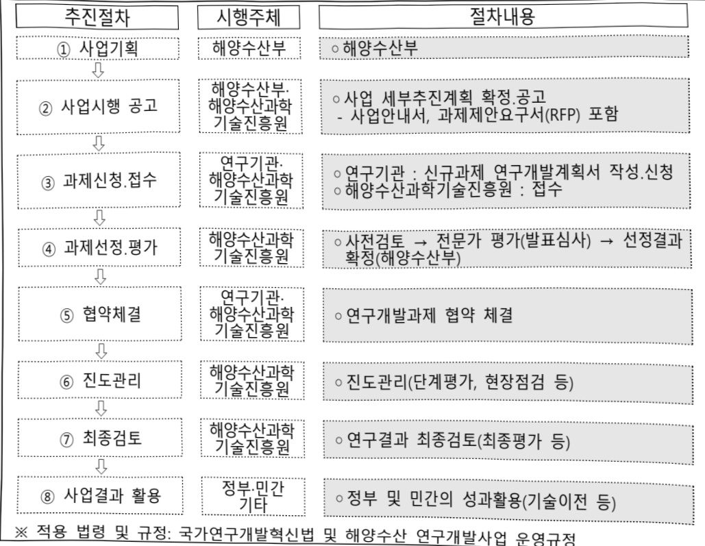

# 민군경 AI 기반 해양영상 융복합 분석기술 개발(R&D)

**해당 페이지**: PDF 5001 ~ 5009 쪽 해당

**부처**: 해양수산부
**분야**: 교통 및 물류
**회계유형**: 일반회계
**2026 확정예산**: 3500.0 백만원
**전년대비 증감률**: None%
**AI 도메인**: AI반도체, 피지컬AI/디바이스

---

### 가.예산 총괄표

(단위:백만원,%)

<table border=1 style='margin: auto; word-wrap: break-word;'><tr><td rowspan="2">사업명</td><td rowspan="2">2024년 결산</td><td colspan="2">2025년 예산</td><td colspan="2">2026년</td><td rowspan="2">증감(B-A)</td><td rowspan="2">(B-A)/A</td></tr><tr><td style='text-align: center; word-wrap: break-word;'>본예산(A)</td><td style='text-align: center; word-wrap: break-word;'>추경</td><td style='text-align: center; word-wrap: break-word;'>정부안</td><td style='text-align: center; word-wrap: break-word;'>확정(B)</td></tr><tr><td style='text-align: center; word-wrap: break-word;'>민군경 AI기반 해양영상 융복합 분석기술개발 (R&amp;D)</td><td style='text-align: center; word-wrap: break-word;'>-</td><td style='text-align: center; word-wrap: break-word;'>-</td><td style='text-align: center; word-wrap: break-word;'>-</td><td style='text-align: center; word-wrap: break-word;'>3,500</td><td style='text-align: center; word-wrap: break-word;'>3,500</td><td style='text-align: center; word-wrap: break-word;'>3,500</td><td style='text-align: center; word-wrap: break-word;'>순증</td></tr></table>

□ 기능별(내역사업별), 목별 예산 내역

(단위:백만원)

<table border=1 style='margin: auto; word-wrap: break-word;'><tr><td rowspan="3"></td><td colspan="5">2024</td><td colspan="7">2025(2025.12월말)</td><td rowspan="3">2026예산</td></tr><tr><td rowspan="2">예산액(추경)</td><td rowspan="2">예산현액</td><td rowspan="2">집행액[실집행액]</td><td rowspan="2">이월액</td><td rowspan="2">불용액</td><td rowspan="2">본예산</td><td rowspan="2">예산현액</td><td rowspan="2">집행액[실집행액]</td><td colspan="2">전년도 이월액제외</td><td rowspan="2">이월예상액</td><td rowspan="2">불용예상액</td></tr><tr><td style='text-align: center; word-wrap: break-word;'>예산현액</td><td style='text-align: center; word-wrap: break-word;'>집행액[실집행액]</td></tr><tr><td style='text-align: center; word-wrap: break-word;'>○ 기능별 분류(합계)</td><td style='text-align: center; word-wrap: break-word;'>-</td><td style='text-align: center; word-wrap: break-word;'>-</td><td style='text-align: center; word-wrap: break-word;'>-</td><td style='text-align: center; word-wrap: break-word;'>-</td><td style='text-align: center; word-wrap: break-word;'>-</td><td style='text-align: center; word-wrap: break-word;'>-</td><td style='text-align: center; word-wrap: break-word;'>-</td><td style='text-align: center; word-wrap: break-word;'>-</td><td style='text-align: center; word-wrap: break-word;'>-</td><td style='text-align: center; word-wrap: break-word;'>-</td><td style='text-align: center; word-wrap: break-word;'>-</td><td style='text-align: center; word-wrap: break-word;'>-</td><td style='text-align: center; word-wrap: break-word;'>3,500</td></tr><tr><td style='text-align: center; word-wrap: break-word;'>· 민군경 AI 기반해양영상 융복합분석기술개발</td><td style='text-align: center; word-wrap: break-word;'>-</td><td style='text-align: center; word-wrap: break-word;'>-</td><td style='text-align: center; word-wrap: break-word;'>-</td><td style='text-align: center; word-wrap: break-word;'>-</td><td style='text-align: center; word-wrap: break-word;'>-</td><td style='text-align: center; word-wrap: break-word;'>-</td><td style='text-align: center; word-wrap: break-word;'>-</td><td style='text-align: center; word-wrap: break-word;'>-</td><td style='text-align: center; word-wrap: break-word;'>-</td><td style='text-align: center; word-wrap: break-word;'>-</td><td style='text-align: center; word-wrap: break-word;'>-</td><td style='text-align: center; word-wrap: break-word;'>-</td><td style='text-align: center; word-wrap: break-word;'>3,500</td></tr><tr><td style='text-align: center; word-wrap: break-word;'>○ 비목별 분류(합계)</td><td style='text-align: center; word-wrap: break-word;'>-</td><td style='text-align: center; word-wrap: break-word;'>-</td><td style='text-align: center; word-wrap: break-word;'>-</td><td style='text-align: center; word-wrap: break-word;'>-</td><td style='text-align: center; word-wrap: break-word;'>-</td><td style='text-align: center; word-wrap: break-word;'>-</td><td style='text-align: center; word-wrap: break-word;'>-</td><td style='text-align: center; word-wrap: break-word;'>-</td><td style='text-align: center; word-wrap: break-word;'>-</td><td style='text-align: center; word-wrap: break-word;'>-</td><td style='text-align: center; word-wrap: break-word;'>-</td><td style='text-align: center; word-wrap: break-word;'>-</td><td style='text-align: center; word-wrap: break-word;'>3,500</td></tr><tr><td style='text-align: center; word-wrap: break-word;'>· 연구개발활동비등(360-05)</td><td style='text-align: center; word-wrap: break-word;'>-</td><td style='text-align: center; word-wrap: break-word;'>-</td><td style='text-align: center; word-wrap: break-word;'>-</td><td style='text-align: center; word-wrap: break-word;'>-</td><td style='text-align: center; word-wrap: break-word;'>-</td><td style='text-align: center; word-wrap: break-word;'>-</td><td style='text-align: center; word-wrap: break-word;'>-</td><td style='text-align: center; word-wrap: break-word;'>-</td><td style='text-align: center; word-wrap: break-word;'>-</td><td style='text-align: center; word-wrap: break-word;'>-</td><td style='text-align: center; word-wrap: break-word;'>-</td><td style='text-align: center; word-wrap: break-word;'>-</td><td style='text-align: center; word-wrap: break-word;'>3,500</td></tr><tr><td style='text-align: center; word-wrap: break-word;'>○ 기능비목별 분류(합계)</td><td style='text-align: center; word-wrap: break-word;'>-</td><td style='text-align: center; word-wrap: break-word;'>-</td><td style='text-align: center; word-wrap: break-word;'>-</td><td style='text-align: center; word-wrap: break-word;'>-</td><td style='text-align: center; word-wrap: break-word;'>-</td><td style='text-align: center; word-wrap: break-word;'>-</td><td style='text-align: center; word-wrap: break-word;'>-</td><td style='text-align: center; word-wrap: break-word;'>-</td><td style='text-align: center; word-wrap: break-word;'>-</td><td style='text-align: center; word-wrap: break-word;'>-</td><td style='text-align: center; word-wrap: break-word;'>-</td><td style='text-align: center; word-wrap: break-word;'>-</td><td style='text-align: center; word-wrap: break-word;'>3,500</td></tr><tr><td style='text-align: center; word-wrap: break-word;'>· 민군경 AI 기반해양영상 융복합분석기술개발</td><td style='text-align: center; word-wrap: break-word;'>-</td><td style='text-align: center; word-wrap: break-word;'>-</td><td style='text-align: center; word-wrap: break-word;'>-</td><td style='text-align: center; word-wrap: break-word;'>-</td><td style='text-align: center; word-wrap: break-word;'>-</td><td style='text-align: center; word-wrap: break-word;'>-</td><td style='text-align: center; word-wrap: break-word;'>-</td><td style='text-align: center; word-wrap: break-word;'>-</td><td style='text-align: center; word-wrap: break-word;'>-</td><td style='text-align: center; word-wrap: break-word;'>-</td><td style='text-align: center; word-wrap: break-word;'>-</td><td style='text-align: center; word-wrap: break-word;'>-</td><td style='text-align: center; word-wrap: break-word;'>3,500</td></tr><tr><td style='text-align: center; word-wrap: break-word;'>· 연구개발활동비등(360-05)</td><td style='text-align: center; word-wrap: break-word;'>-</td><td style='text-align: center; word-wrap: break-word;'>-</td><td style='text-align: center; word-wrap: break-word;'>-</td><td style='text-align: center; word-wrap: break-word;'>-</td><td style='text-align: center; word-wrap: break-word;'>-</td><td style='text-align: center; word-wrap: break-word;'>-</td><td style='text-align: center; word-wrap: break-word;'>-</td><td style='text-align: center; word-wrap: break-word;'>-</td><td style='text-align: center; word-wrap: break-word;'>-</td><td style='text-align: center; word-wrap: break-word;'>-</td><td style='text-align: center; word-wrap: break-word;'>-</td><td style='text-align: center; word-wrap: break-word;'>-</td><td style='text-align: center; word-wrap: break-word;'>3,500</td></tr></table>

---

### 나. 사업설명자료

## 1 ) 사업목적·내용

- (사업목적) 주변국의 무단 해양시설 설치, 공세적 해양활동에 대응해 해양주권

수호를 위해 최외곽 해역에서 체계적 감시·탐지 기술개발

- (사업내용) 해상물체의 자동탐지 및 식별을 위한 AI 알고리즘, 온디바이스 AI 기반 지능형 감시 및 해수부·해군·해경 플랫폼에 연계 가능 멀티모달 기술개발

## 2 ) 사업개요

## □ 사업근거 및 추진경위

(1) 법령상 근거 및 조항 적시

## - 「해양조사와 해양정보 활용에 관한 법률」 제14조(해양관측의 실시)

① 해양수산부장관은 기본계획 및 연도별 시행계획에 따라 조석·조류·해류·해양기상 등 해양의 특성 및 그 변화를 관찰·측정하고, 관련 정보를 수집하기 위한 해양관측을 실시하여야 한다.

② 해양수산부장관은 제1항에 따른 해양관측으로 얻은 정보를 체계적으로 수집 · 관리하고, 이에 관한 각종 통계를 생산 · 관리하여야 한다.

## - 제15조(국가해양관측망의 구축·운영 등)

① 해양수산부장관은 해양관측을 효율적으로 수행하기 위하여 국가해양관측망을 구축 · 운영할 수 있다.

② 해양수산부장관은 제1항에 따른 국가해양관측망의 구축·운영 업무를 관계 행정기관이나 그 밖에 해양관측 업무를 수행하는 기관과 협력하여 추진할 수 있다.

③ 해양수산부장관은 국가해양관측망의 구축·운영을 위하여 필요한 경우에는 관계

행정기관의 장에게 필요한 자료의 제출을 요청할 수 있다. 이 경우 요청을 받은

관계 행정기관의 장은 정당한 사유가 없으면 그 요청에 따라야 한다.

## - 제43조(해양정보의 품질관리)

① 해양수산부장관은 해양정보의 정확도를 확보하기 위하여 해양정보의 품질관리

에 필요한 시책을 추진하여야 한다.

② 제1항에 따른 품질관리의 대상, 범위, 기준 및 절차 등에 관한 사항은 해양수산부령으로 정한다.

## -「연안관리법」 제4조(국가 등의 책무)

① 국가 및 지방자치단체는 연안의 지속가능한 보전 · 이용 및 개발을 위하여 필요한 시책을 마련하여야 한다.

---

② 국가 및 지방자치단체는 연안관리의 기본이념에 대한 국민의 인식을 증진시키고 연안환경의 훼손을 방지하기 위하여 노력하여야 한다.

③ 국민은 아름답고 쾌적한 연안환경의 보전 및 개선, 지속가능한 이용을 위하여 국가 및 지방자치단체의 시책에 적극적으로 협력하여야 한다.

- 제34조의2(연안정보체계의 구축 및 관리 등)

① 해양수산부장관은 연안관리정책의 합리적인 수립과 집행을 위하여 다음 각 호의 사항이 포함된 연안정보체계를 구축하고 관리하여야 한다.

1. 연안의 지형(地形) · 지물(地物) 등의 위치 및 속성

2. 연안 이용 현황

3. 해안선 등에 대한 지리정보

4. 항만 · 어항 · 도로 · 산업 · 도시 · 해양수산자원 등에 대한 인문정보 · 사회정보

5. 제34조의6제1항에 따른 연안재해 위험평가

6. 제34조의7제2항에 따른 등록사항

- 제34조2(연구개발) 해양수산부장관은 연안관리의 효율적 추진, 연안침식의 예방

이나 피해경감 등에 필요한 연구개발을 실시하여야 한다.

-「해양과학조사법」제20조(해양과학조사의 장려)

① 정부는 다른 법률에 특별한 규정이 있는 경우를 제외하고는 대한민국 국민이 해양과학조사를 자유롭게 실시할 수 있도록 보장하고 적극 장려하여야 한다.

② 해양수산부장관은 해양과학기술의 진흥을 위하여 조사자료의 공개 및 제공이 원활히 이루어질 수 있도록 필요한 지원조치를 마련하여야 한다.

## -「해양수산발전기본법」제17조(해양과학조사 및 기술개발 등)

① 정부는 효율적인 해양관리를 위하여 대통령령으로 정하는 바에 따라 다음 각

호의 내용을 포함하는 해양과학조사계획을 수립하고, 이를 시행하여야 한다.

1. 해양과학조사에 관한 정부의 정책목표와 방향

2. 생태, 환경, 물리, 지질 등 해양과학조사의 조사항목과 조사항목별 조사방법에 관한 사항

3. 해양과학조사 결과에 대한 공동활용체계 구축 및 해양정보의 표준화에 관한 사항

4. 그 밖에 효율적인 해양과학조사를 위하여 필요한 사항

② 정부는 해양 및 해양수산자원의 합리적인 관리·보전 및 개발·이용을 위하여 해양에 대한 과학조사 및 관측을 실시하여야 하며, 이의 효율적인 수행을 위하여 국가해양관측망을 구축·운영할 수 있다.

---

③ 해양수산부장관은 해양과학기술을 향상하게 하고 해양과학기술의 실용화·산업화를 촉진하기 위하여 해양과학기술개발계획을 세우고, 이를 시행하여야 한다.

## -「민군기술협력사업촉진법」제7조(민·군기술개발사업의 추진)

① 정부는 민·군개발사업을 위하여 다음 각 호의 사항을 추진한다.

1. 민·군기술개발사업 연구개발과제(이하"기술개발과제"라 한다)의 발굴 및 선정

2. 기술개발과제를 연구하는 주관기관(이하 “주관연구기관”이라 한다) 및 연구책임자의 선정

3. 기술개발과제 연구 결과의 평가 및 실용화 지원

4. 그 밖에 민 · 군기술개발사업의 연구개발에 필요한 사항

② 관계중앙행정기관의 장은 다음 각 호의 어느 하나에 해당하는 기관이나 단체와 협약을 맺어 기술개발과제를 연구하게 할 수 있다. 이 경우 법인이 아닌 기관에 대하여는 그 기관이 속한 법인의 대표와 협약을 맺을 수 있다.

1. 국공립 연구기관

2.「특정연구기관 육성법」의 적용을 받는 특정연구기관

3. '산업기술연구조합 육성법' 에 따른 산업기술연구조합

4. 「과학기술분야 정부출연연구기관 등의 설립·운영 및 육성에 관한 법률」에 따라 설립된 정부출연연구기관 및 「산업기술혁신 촉진법」 제42조에 따른 전문생산기술연구소

5. 「기초연구진흥 및 기술개발지원에 관한 법률」 제14조의2제1항에 따라

인정받은 기업부설연구소

6. 「국방과학연구소법」에 따른 국방과학연구소

7. 「민법」이나 다른 법률에 따라 설립된 과학기술 분야의 비영리법인인 연구기관

8. 그 밖에 대통령령으로 정하는 과학기술 분야의 연구기관이나 단체

③ 주관연구기관과 연구책임자는 공개경쟁의 방법으로 선정한다. 다만, 기술 축적이나 국가안보상 특히 필요하다고 대통령령으로 정하는 기술개발과제의 경우에는 그러하지 아니하다.

④ 관계중앙행정기관의 장은 다른 법률에 따라 진행 중인 연구과제 중 기술개발

과제에 해당된다고 인정되는 연구과제는 대통령령으로 정하는 바에 따라 기술

개발과제로 전환할 수 있다.

⑤ 기술개발과제, 주관연구기관 및 연구책임자의 선정 기준·절차 등에 관하여 필요한 사항은 대통령령으로 정한다.

---

(2) 추진경위

- 해수부-해군-해경 과학기술혁신 프로젝트 추진계획 수립('22.5)

- 해수부-해군-해경-KIMST 공동협력 체계 구축을 위한 MOU 체결('22.7)

* 해양영토 수호 역량을 제고하기 위하여 해수부, 해군, 해경, KIMST간 해양영토 분야의 연구개발(R&D) 협력을 위한 업무 협약

- 해수부-해군-해경-KIMST 간 기획연구 실무협의회 가동('22.7~)

- 민군 활용 AI 기반 융복합 해양데이터 분석기술개발 및 보안플랫폼 구축사업 착수(24.4)

- 민군경 AI 기방 해양영상 융복합 분석기술개발사업 기획연구('24.10~'25.6)

□ 주요내용

① 사업규모

- 총사업비 : 해당없음

- 사업기간 : 2026 ~ 2029

- 최근 5년 간 투입된 사업비(예산액기준, 추경편성한 연도에는 추경포함)

<table border=1 style='margin: auto; word-wrap: break-word;'><tr><td style='text-align: center; word-wrap: break-word;'>연도</td><td style='text-align: center; word-wrap: break-word;'>2022</td><td style='text-align: center; word-wrap: break-word;'>2023</td><td style='text-align: center; word-wrap: break-word;'>2024</td><td style='text-align: center; word-wrap: break-word;'>2025</td><td style='text-align: center; word-wrap: break-word;'>2026</td></tr><tr><td style='text-align: center; word-wrap: break-word;'>사업비</td><td style='text-align: center; word-wrap: break-word;'>-</td><td style='text-align: center; word-wrap: break-word;'>-</td><td style='text-align: center; word-wrap: break-word;'>-</td><td style='text-align: center; word-wrap: break-word;'>-</td><td style='text-align: center; word-wrap: break-word;'>3,500</td></tr></table>

- 기타: 1개 내역사업, 1개 세부과제로 구성

② 사업추진체계

- 사업시행방법 : 출연

- 사업시행주체 : 해양수산과학기술진흥원

- 사업 수혜자 : 정부출연연구소, 대학, 민간기업 등

- 보조, 융자, 출연, 출자 등의 경우 보조·융자 등 지원 비율 및 법적근거

<table border=1 style='margin: auto; word-wrap: break-word;'><tr><td style='text-align: center; word-wrap: break-word;'>내역사업명</td><td style='text-align: center; word-wrap: break-word;'>구분</td><td style='text-align: center; word-wrap: break-word;'>피보조·피출연 등 기관명</td><td style='text-align: center; word-wrap: break-word;'>지원 금액 (2026예산)</td><td style='text-align: center; word-wrap: break-word;'>지원 비율(%)</td><td style='text-align: center; word-wrap: break-word;'>보조율 법적근거 (해당 조항)</td></tr><tr><td style='text-align: center; word-wrap: break-word;'>민군경 AI 기반 해양영상 융복합 분석기술개발</td><td style='text-align: center; word-wrap: break-word;'>출연</td><td style='text-align: center; word-wrap: break-word;'>해양수산 과학기술 진흥원</td><td style='text-align: center; word-wrap: break-word;'>3,500</td><td style='text-align: center; word-wrap: break-word;'>100</td><td style='text-align: center; word-wrap: break-word;'>「해양수산과학기술 육성법」 제23조 (해양수산과학기술진흥원 설립)</td></tr></table>

---

①민군경 AI기반 해양영상 융복합 분석기술 개발

: (2025 본예산) 0백만원 → (2026 요구) 3,500백만원, 순증

- (뇌구) 주변국의 무단 시설, 선박침입 등에 대응하기 위한 AI 기반 관할해역 감시탐지 기술 5종 개발 온디바이스 AI 프로토타입 설계 및 멀티모달 시스템 아키텍처 설계를 위한 연구개발비 3,500백만원 요구

- (산출) 신규 1과제 × 4,666.7백만원 × 9/12개월 = 3,500백만원

0 2025년도 예산 및 2026년도 예산 산출 세부내역 비교

<table border=1 style='margin: auto; word-wrap: break-word;'><tr><td colspan="2">2025년 본예산</td><td colspan="2">2026년 예산</td></tr><tr><td style='text-align: center; word-wrap: break-word;'>예산</td><td style='text-align: center; word-wrap: break-word;'>산줄내역</td><td style='text-align: center; word-wrap: break-word;'>예산</td><td style='text-align: center; word-wrap: break-word;'>산줄내역</td></tr><tr><td style='text-align: center; word-wrap: break-word;'>-</td><td style='text-align: center; word-wrap: break-word;'>-</td><td style='text-align: center; word-wrap: break-word;'>3,500</td><td style='text-align: center; word-wrap: break-word;'>○ 연구개발 활동비(360-05): 3,500백만원가. 해양객체 자동탐지 및 식별 AI 알고리즘 통합 및 고도화 개발: 2,100백만원• 기초연구 및 데이터셋 구축, 전처리 알고리즘 및 초기 AI 모델 개발• 플랫폼별 데이터셋 구축 및 전처리 기술 개발, 초기 객체 인식 모델 구현• 이상징후 관련 데이터 수집 및 기초 모델 구축, 전처리 및 초기 탐지 알고리즘 개발나. 온디바이스 AI 기반 지능형 감시기술 개발: 800백만원• 온디바이스 AI 관련 기술 조사, 하드웨어 및 소프트웨어 요구사항정의, 프로토타입 설계다. 민군경 응복합 보안플랫폼에 연계 가능한 멀티모달 기술개발: 600백만원• 센서 데이터 표준화 연구, 메타데이터 통합 방안 수립, 시스템 아키텍처 설계</td></tr></table>

## 4 ) 사업효과

□ 사업영향, 산출물 성과지표 등

① 2022~2026년도 성과계획서 상 성과지표 및 최근 5년간 성과 달성도

<table border=1 style='margin: auto; word-wrap: break-word;'><tr><td style='text-align: center; word-wrap: break-word;'>성과지표</td><td style='text-align: center; word-wrap: break-word;'>구분</td><td style='text-align: center; word-wrap: break-word;'>2022</td><td style='text-align: center; word-wrap: break-word;'>2023</td><td style='text-align: center; word-wrap: break-word;'>2024</td><td style='text-align: center; word-wrap: break-word;'>2025</td><td style='text-align: center; word-wrap: break-word;'>2026</td><td style='text-align: center; word-wrap: break-word;'>2026 목표치산출근거</td><td style='text-align: center; word-wrap: break-word;'>측정산식(또는 측정방법)</td><td style='text-align: center; word-wrap: break-word;'>자료수집방법(또는 자료출처)</td></tr><tr><td rowspan="3">해양수산일자리 창출 수(단위: 명)</td><td style='text-align: center; word-wrap: break-word;'>목표</td><td style='text-align: center; word-wrap: break-word;'>87</td><td style='text-align: center; word-wrap: break-word;'>160</td><td style='text-align: center; word-wrap: break-word;'>221</td><td style='text-align: center; word-wrap: break-word;'>255</td><td style='text-align: center; word-wrap: break-word;'>261</td><td rowspan="3">최근 3년 평균값을 기준으로 설정하고, 3개년 평균값 대비 15% 상향한 도전적 목표 제시</td><td rowspan="3">해양수산 창업·투자, R&amp;D 지원사업 수혜기업의 신규 고용창출 수</td><td rowspan="3">해양수산과학 기술진흥원(KIMST) 보고서</td></tr><tr><td style='text-align: center; word-wrap: break-word;'>실적</td><td style='text-align: center; word-wrap: break-word;'>188</td><td style='text-align: center; word-wrap: break-word;'>252</td><td style='text-align: center; word-wrap: break-word;'>227</td><td style='text-align: center; word-wrap: break-word;'>-</td><td style='text-align: center; word-wrap: break-word;'>-</td></tr><tr><td style='text-align: center; word-wrap: break-word;'>달성도</td><td style='text-align: center; word-wrap: break-word;'>216.1</td><td style='text-align: center; word-wrap: break-word;'>157.5</td><td style='text-align: center; word-wrap: break-word;'>102.7</td><td style='text-align: center; word-wrap: break-word;'>-</td><td style='text-align: center; word-wrap: break-word;'>-</td></tr></table>

※ 본 세부사업이 포함되어 있는 프로그램「해양산업육성및영토관리」의 성과지표임

---

② 성과지표 이외의 연도별 사업추진 경과 및 실적 : 해당없음

③ 향후(2026년도 이후) 기대효과 :

- 해양 환경에 적합한 해양영상 분석, 해양 물체 탐지, 식별 기술 확보로 해양수산

과학기술력 향상 및 경쟁력 강화

- 해수부의 해양재난 예방 및 해양탐사, 해군의 해상보안 업무, 해경의 해양안전

등에 활용하여 간접비용 감소 및 임무 효율화

* 투입예산 대비 약 174% 수준인 523억원 생산유발효과, 82.9% 수준인 124억 부가가치유발효과, 고용 122명

## 5 ) 타당성조사 및 예비타당성조사 시행여부 및 결과 요지 : 해당없음

## 6 ) 총사업비 대상사업 여부 및 내역 : 해당없음

## 7 ) 사업 집행절차

---

8) 각종 평가

해당없음

다. 최근 4년간 결산내역 : 해당없음

---

<table border=1 style='margin: auto; word-wrap: break-word;'><tr><td style='text-align: center; word-wrap: break-word;'>사 업 명</td></tr><tr><td style='text-align: center; word-wrap: break-word;'>(91) 생태계 기반 수산정책 지원기술 개발(R&amp;D) (3632-313)</td></tr></table>

## □ 사업 코드 정보

<table border=1 style='margin: auto; word-wrap: break-word;'><tr><td style='text-align: center; word-wrap: break-word;'>구분</td><td style='text-align: center; word-wrap: break-word;'>회계</td><td style='text-align: center; word-wrap: break-word;'>소관</td><td style='text-align: center; word-wrap: break-word;'>실국(기관)</td><td style='text-align: center; word-wrap: break-word;'>계정</td><td style='text-align: center; word-wrap: break-word;'>분야</td><td style='text-align: center; word-wrap: break-word;'>부문</td></tr><tr><td style='text-align: center; word-wrap: break-word;'>코드</td><td style='text-align: center; word-wrap: break-word;'>11</td><td style='text-align: center; word-wrap: break-word;'>28</td><td rowspan="2">국립수산과학원</td><td rowspan="2"></td><td style='text-align: center; word-wrap: break-word;'>100</td><td style='text-align: center; word-wrap: break-word;'>103</td></tr><tr><td style='text-align: center; word-wrap: break-word;'>명칭</td><td style='text-align: center; word-wrap: break-word;'>일반회계</td><td style='text-align: center; word-wrap: break-word;'>해양수산부</td><td style='text-align: center; word-wrap: break-word;'>농림수산</td><td style='text-align: center; word-wrap: break-word;'>수산·어촌</td></tr></table>

<table border=1 style='margin: auto; word-wrap: break-word;'><tr><td style='text-align: center; word-wrap: break-word;'>구분</td><td style='text-align: center; word-wrap: break-word;'>프로그램</td><td style='text-align: center; word-wrap: break-word;'>단위사업</td><td style='text-align: center; word-wrap: break-word;'>세부사업</td></tr><tr><td style='text-align: center; word-wrap: break-word;'>코드</td><td style='text-align: center; word-wrap: break-word;'>3600</td><td style='text-align: center; word-wrap: break-word;'>3632</td><td style='text-align: center; word-wrap: break-word;'>313</td></tr><tr><td style='text-align: center; word-wrap: break-word;'>명칭</td><td style='text-align: center; word-wrap: break-word;'>수산연구(국립수산과학원)</td><td style='text-align: center; word-wrap: break-word;'>수산과학연구</td><td style='text-align: center; word-wrap: break-word;'>생태계 기반 수산정책 지원 기술 개발(R&amp;D)</td></tr></table>

□ 사업 성격 (공통요구자료 Ⅱ-1 작성유의사항 4. 참조, 해당하는 사항에 “○” 표시)

<table border=1 style='margin: auto; word-wrap: break-word;'><tr><td rowspan="2">신규</td><td rowspan="2">계속</td><td rowspan="2">완료</td><td rowspan="2">예비타당성 실시여부</td><td rowspan="2">총사업비 관리대상</td><td rowspan="2">총액계상 예산사업</td><td style='text-align: center; word-wrap: break-word;'>사업소관 변경정보</td></tr><tr><td style='text-align: center; word-wrap: break-word;'>2025예산 시 소관</td></tr><tr><td style='text-align: center; word-wrap: break-word;'></td><td style='text-align: center; word-wrap: break-word;'>○</td><td style='text-align: center; word-wrap: break-word;'></td><td style='text-align: center; word-wrap: break-word;'></td><td style='text-align: center; word-wrap: break-word;'></td><td style='text-align: center; word-wrap: break-word;'></td><td style='text-align: center; word-wrap: break-word;'></td></tr></table>

□ 사업 지원 형태 및 지원을 (최소한 한 개는 반드시 선택하시오. 해당사항에 0 표시)

<table border=1 style='margin: auto; word-wrap: break-word;'><tr><td style='text-align: center; word-wrap: break-word;'>직접</td><td style='text-align: center; word-wrap: break-word;'>출자</td><td style='text-align: center; word-wrap: break-word;'>출연</td><td style='text-align: center; word-wrap: break-word;'>보조</td><td style='text-align: center; word-wrap: break-word;'>융자</td><td style='text-align: center; word-wrap: break-word;'>국고보조율(%)</td><td style='text-align: center; word-wrap: break-word;'>융자율(%)</td></tr><tr><td style='text-align: center; word-wrap: break-word;'>○</td><td style='text-align: center; word-wrap: break-word;'></td><td style='text-align: center; word-wrap: break-word;'></td><td style='text-align: center; word-wrap: break-word;'></td><td style='text-align: center; word-wrap: break-word;'></td><td style='text-align: center; word-wrap: break-word;'></td><td style='text-align: center; word-wrap: break-word;'></td></tr></table>

## □ 사업 담당자

<table border=1 style='margin: auto; word-wrap: break-word;'><tr><td style='text-align: center; word-wrap: break-word;'>사업명</td><td colspan="2">구분</td></tr><tr><td rowspan="4">생태계 구조변동 구명 및 평가기술 개발</td><td rowspan="3">소관부처</td><td style='text-align: center; word-wrap: break-word;'>실·국·과(팀)명</td></tr><tr><td style='text-align: center; word-wrap: break-word;'>국립수산과학원</td></tr><tr><td style='text-align: center; word-wrap: break-word;'>기후변화연구과</td></tr><tr><td style='text-align: center; word-wrap: break-word;'>사업시행주체</td><td style='text-align: center; word-wrap: break-word;'>직접수행</td></tr><tr><td rowspan="4">연근해 수산생태계 예측모델 고도화</td><td rowspan="3">소관부처</td><td style='text-align: center; word-wrap: break-word;'>실·국·과(팀)명</td></tr><tr><td style='text-align: center; word-wrap: break-word;'>국립수산과학원</td></tr><tr><td style='text-align: center; word-wrap: break-word;'>연근해자원과</td></tr><tr><td style='text-align: center; word-wrap: break-word;'>사업시행주체</td><td style='text-align: center; word-wrap: break-word;'>직접수행</td></tr></table>

---

### 원본 PDF 크롭 이미지

