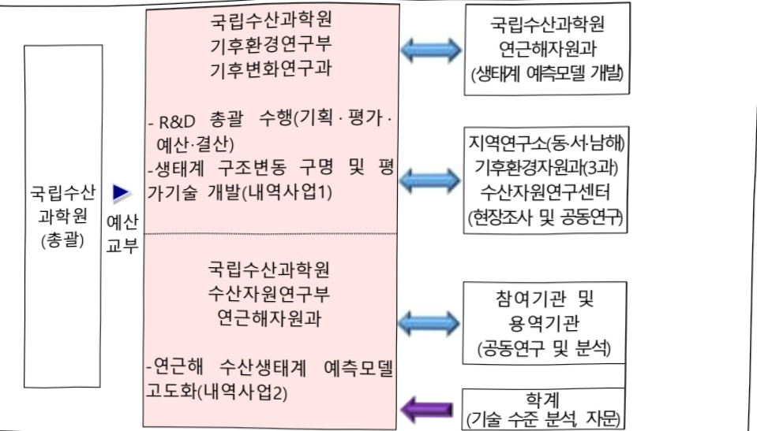

# 생태계기반수산정책지원기술개발(R&D)

**해당 페이지**: PDF 5010 ~ 5019 쪽 해당

**부처**: 해양수산부
**분야**: 농림수산
**회계유형**: 일반회계
**2026 확정예산**: 2700.0 백만원
**전년대비 증감률**: None%
**AI 도메인**: 해양/수산

---

### 가.예산 총괄표

(단위: 백만원, %)

<table border=1 style='margin: auto; word-wrap: break-word;'><tr><td rowspan="2">사업명</td><td rowspan="2">2024년 결산</td><td colspan="2">2025년 예산</td><td colspan="2">2026년</td><td rowspan="2">증감(B-A)</td><td rowspan="2">(B-A)/A</td></tr><tr><td style='text-align: center; word-wrap: break-word;'>본예산(A)</td><td style='text-align: center; word-wrap: break-word;'>추경</td><td style='text-align: center; word-wrap: break-word;'>정부안</td><td style='text-align: center; word-wrap: break-word;'>확정(B)</td></tr><tr><td style='text-align: center; word-wrap: break-word;'>생태계 기반 수산정책 지원 기술 개발(R&amp;D)</td><td style='text-align: center; word-wrap: break-word;'>1,889</td><td style='text-align: center; word-wrap: break-word;'>2,700</td><td style='text-align: center; word-wrap: break-word;'>-</td><td style='text-align: center; word-wrap: break-word;'>2,700</td><td style='text-align: center; word-wrap: break-word;'>2,700</td><td style='text-align: center; word-wrap: break-word;'>-</td><td style='text-align: center; word-wrap: break-word;'>-</td></tr></table>

□ 기능별(내역사업별), 목별 예산 내역

(단위:백만원)

<table border=1 style='margin: auto; word-wrap: break-word;'><tr><td rowspan="3"></td><td colspan="5">2024</td><td colspan="7">2025(2025.12월말)</td><td rowspan="3">2026예산</td></tr><tr><td rowspan="2">예산액(추정)</td><td rowspan="2">예산현액</td><td rowspan="2">집행액[실집행액]</td><td rowspan="2">이월액</td><td rowspan="2">불용액</td><td rowspan="2">본예산</td><td rowspan="2">예산현액</td><td rowspan="2">집행액[실집행액]</td><td colspan="2">전년도이월액제외</td><td rowspan="2">이월예상액</td><td rowspan="2">불용예상액</td></tr><tr><td style='text-align: center; word-wrap: break-word;'>예산현액</td><td style='text-align: center; word-wrap: break-word;'>집행액[실집행액]</td></tr><tr><td style='text-align: center; word-wrap: break-word;'>○ 기능별 분류(합계)</td><td style='text-align: center; word-wrap: break-word;'>1,920</td><td style='text-align: center; word-wrap: break-word;'>1,920</td><td style='text-align: center; word-wrap: break-word;'>1,889[1,889]</td><td style='text-align: center; word-wrap: break-word;'>-</td><td style='text-align: center; word-wrap: break-word;'>31</td><td style='text-align: center; word-wrap: break-word;'>2,700</td><td style='text-align: center; word-wrap: break-word;'>2,700</td><td style='text-align: center; word-wrap: break-word;'>2,634[2,634]</td><td style='text-align: center; word-wrap: break-word;'>-</td><td style='text-align: center; word-wrap: break-word;'>-</td><td style='text-align: center; word-wrap: break-word;'>-</td><td style='text-align: center; word-wrap: break-word;'>66</td><td style='text-align: center; word-wrap: break-word;'>2,700</td></tr><tr><td rowspan="2">·생태계 구조변동구명 및 평가기술 개발·연근해 수산생태계 예측모델 고도화</td><td style='text-align: center; word-wrap: break-word;'>1,200</td><td style='text-align: center; word-wrap: break-word;'>1,200</td><td style='text-align: center; word-wrap: break-word;'>1,181[1,181]</td><td style='text-align: center; word-wrap: break-word;'>-</td><td style='text-align: center; word-wrap: break-word;'>19</td><td style='text-align: center; word-wrap: break-word;'>1,800</td><td style='text-align: center; word-wrap: break-word;'>1,800</td><td style='text-align: center; word-wrap: break-word;'>1,755[1,755]</td><td style='text-align: center; word-wrap: break-word;'>-</td><td style='text-align: center; word-wrap: break-word;'>-</td><td style='text-align: center; word-wrap: break-word;'>-</td><td style='text-align: center; word-wrap: break-word;'>45</td><td style='text-align: center; word-wrap: break-word;'>1,800</td></tr><tr><td style='text-align: center; word-wrap: break-word;'>720</td><td style='text-align: center; word-wrap: break-word;'>720</td><td style='text-align: center; word-wrap: break-word;'>708[708]</td><td style='text-align: center; word-wrap: break-word;'>-</td><td style='text-align: center; word-wrap: break-word;'>12</td><td style='text-align: center; word-wrap: break-word;'>900</td><td style='text-align: center; word-wrap: break-word;'>900</td><td style='text-align: center; word-wrap: break-word;'>879[879]</td><td style='text-align: center; word-wrap: break-word;'>-</td><td style='text-align: center; word-wrap: break-word;'>-</td><td style='text-align: center; word-wrap: break-word;'>-</td><td style='text-align: center; word-wrap: break-word;'>21</td><td style='text-align: center; word-wrap: break-word;'>900</td></tr><tr><td style='text-align: center; word-wrap: break-word;'>○ 비목별 분류(합계)</td><td style='text-align: center; word-wrap: break-word;'>1,920</td><td style='text-align: center; word-wrap: break-word;'>1,920</td><td style='text-align: center; word-wrap: break-word;'>1,889[1,889]</td><td style='text-align: center; word-wrap: break-word;'>-</td><td style='text-align: center; word-wrap: break-word;'>31</td><td style='text-align: center; word-wrap: break-word;'>2,700</td><td style='text-align: center; word-wrap: break-word;'>2,700</td><td style='text-align: center; word-wrap: break-word;'>2,634[2,634]</td><td style='text-align: center; word-wrap: break-word;'>-</td><td style='text-align: center; word-wrap: break-word;'>-</td><td style='text-align: center; word-wrap: break-word;'>-</td><td style='text-align: center; word-wrap: break-word;'>66</td><td style='text-align: center; word-wrap: break-word;'>2,700</td></tr><tr><td rowspan="2">·시 협 연 구 비(210-13)·일 반 연 구 비(260-01)</td><td style='text-align: center; word-wrap: break-word;'>760</td><td style='text-align: center; word-wrap: break-word;'>760</td><td style='text-align: center; word-wrap: break-word;'>757[757]</td><td style='text-align: center; word-wrap: break-word;'>-</td><td style='text-align: center; word-wrap: break-word;'>3</td><td style='text-align: center; word-wrap: break-word;'>1,010</td><td style='text-align: center; word-wrap: break-word;'>1,010</td><td style='text-align: center; word-wrap: break-word;'>983[983]</td><td style='text-align: center; word-wrap: break-word;'>-</td><td style='text-align: center; word-wrap: break-word;'>-</td><td style='text-align: center; word-wrap: break-word;'>-</td><td style='text-align: center; word-wrap: break-word;'>27</td><td style='text-align: center; word-wrap: break-word;'>1,010</td></tr><tr><td style='text-align: center; word-wrap: break-word;'>1,160</td><td style='text-align: center; word-wrap: break-word;'>1,160</td><td style='text-align: center; word-wrap: break-word;'>1,132[1,132]</td><td style='text-align: center; word-wrap: break-word;'>-</td><td style='text-align: center; word-wrap: break-word;'>28</td><td style='text-align: center; word-wrap: break-word;'>1,690</td><td style='text-align: center; word-wrap: break-word;'>1,690</td><td style='text-align: center; word-wrap: break-word;'>1,651[1,651]</td><td style='text-align: center; word-wrap: break-word;'>-</td><td style='text-align: center; word-wrap: break-word;'>-</td><td style='text-align: center; word-wrap: break-word;'>-</td><td style='text-align: center; word-wrap: break-word;'>39</td><td style='text-align: center; word-wrap: break-word;'>1,690</td></tr></table>

### 나.사업설명자료

## 1 ) 사업목적·내용

- (목적) 지속가능한 수산자원 관리정책기술 체계 구축을 위한 핵심기술을 개발하여 기후변화, 남획 등 자연·인위적 변동요인에 대한 과학적 증거기반의 수산관리 정책 실현

- (목표) 우리나라 해역에 적합한 정확도 높은 수산자원 예측정보 생산 및 수산자원 관리정책 지원을 위한 도구 개발

---

(생태계 구조변동 구명 및 평가기술 개발) 과학적 증거기반 수산자원 관리 정책실현을 위한 현장관측 및 평가기술 개발을 위한 생태계 변동요인 과악

- (연근해 수산생태계 예측모델 고도화) 수산정책 지원기술 개발을 위한 수산생태계 예측모델시스템 고도화

## 2 ) 사업개요

## □ 사업근거 및 추진경위

① 법령상 근거 및 조항 적시

- 「해양수산발전 기본법」 제16조, 정부는 해양수산자원의 관리·보전과 개발·이용을 위한 필요시책을 마련하고, 이를 시행하여야 한다.

- 「해양수산발전 기본법」 제17조의1, 정부는 효율적인 해양관리를 위하여 대통령령으로 정하는 바에 따라 다음 각 호의 내용을 포함하는 해양과학조사계획을 수립하고, 이를 시행하여야 한다.

1. 해양과학조사에 관한 정부의 정책목표와 방향

2. 생태, 환경, 물리, 지질 등 해양과학조사의 조사항목과 조사항목별 조사방법에 관한 사항

3. 해양과학조사 결과에 대한 공동활용체계 구축 및 해양정보의 표준화에 관한 사항

4. 그 밖에 효율적인 해양과학조사를 위하여 필요한 사항

- 「해양수산발전 기본법」 제17조의2, 정부는 해양 및 해양수산자원의 합리적인 관리·보전 및 개발·이용을 위하여 해양에 대한 과학조사 및 관측을 실시하여야 하며, 이의 효율적인 수행을 위하여 국가해양관측망을 구축·운영할 수 있다.

-「해양수산발전 기본법」제17조의3, 해양수산부장관은 해양과학기술을 향상하게 하고 해양과학기술의 실용화·산업화를 촉진하기 위하여 해양과학기술개발계획을 세우고, 이를 시행하여야 한다.

-「해양수산발전 기본법」제28조의2, 정부는 해양수산분야의 신성장동력 창출 및 관련 산업의 육성을 위하여 필요한 시책을 마련하고, 이를 시행하여야 한다.

- 「수산자원관리법」 제5조의1, 해양수산부장관 또는 특별시장·광역시장·특별자치시장·도지사·특별자치도지사(이하 “시·도지사”라 한다)는 수산자원관리와 관련된 기술개발을 촉진하기 위하여 관련 연구기관·지도기관·대학 및 단체 등에 수산자원관리기술의 연구개발을 수행하게 할 수 있다.

- 「수산자원관리법」 제5조의2, 해양수산부장관 또는 시·도지사는 제1항에 따른 수산자원관리기술의 연구개발을 수행하는 데에 필요한 자금을 지원할 수 있다.

- 「기후위기 대응을 위한 탄소중립·녹색성장 기본법」 제37조의1, 정부는 대통령령으로 정하는 바에 따라 대기 중의 온실가스 농도 변화를 상시 측정·조사하고 기상현상에 대한 관측·예측·제공·활용 능력을 높이며 기후위기에 대한 감시·예측의 정확

---

도를 향상시키는 기상정보관리체계를 구축·운영하여야 한다.

- 「기후위기 대응을 위한 탄소중립·녹색성장 기본법」 제37조의2, 정부는 기후위기가 생태계, 생물다양성, 대기, 물환경, 보건, 농림·식품, 산림, 해양·수산, 산업, 방재 등에 미치는 영향과 취약성, 위험 및 사회적·경제적 파급효과를 조사·평가하는 기후위기적응정보관리체계를 구축·운영하여야 한다.

- 「기후위기 대응을 위한 탄소중립·녹색성장 기본법」 제37조의3, 정부는 제1항에 따른 기상정보관리체계 및 제2항에 따른 기후위기적응정보관리체계의 구축·운영을 위하여 조사·연구, 기술개발, 전문기관 지원, 국내외 협조체계 구축 등의 시책을 추진할 수 있다.

- 「기후위기 대응을 위한 탄소중립·녹색성장 기본법」 제37조의4, 제1항에 따른 기상정보관리체계 및 제2항에 따른 기후위기적응정보관리체계의 구축 · 운영, 제3항에 따른 시책 추진 등에 필요한 사항은 대통령령으로 정한다.

- 「지능정보화기본법」제14조의1, 국가기관등은 공공서비스의 지능정보화를 도모하고 국민 편의 증진 등을 위하여 행정, 보건, 사회복지, 교육, 문화, 환경, 교통, 물류, 과학기술, 재난안전, 치안, 국방, 에너지 등 소관 업무에 대한 지능정보화(이하 “공공지능정보화”라 한다)를 추진하여야 한다.

- 「지능정보화기본법」 제14조의2, 국가기관등은 공공지능정보화를 효율적으로 추진하기 위하여 필요한 방안을 마련하여야 한다.

- 「기후변화감시예측법」제5조의3, 해양수산부장관은 해양·극지의 환경 및 생태계를 감시하고 기후변화 감시 정보를 생산하기 위하여 「해양조사와 해양정보활용에 관한 법률」 제15조 제1항에 따른 국가해양관측망과 그 밖에 대통령령으로 정하는 관측망(이하 “해양·극지분야의 관측망”이라 한다)을 구축·운영하여야 한다.

-「기후변화감시예측법」제7조의2, 해양수산부장관은 해양·극지의 환경 및 생태계에 관한 기후·기후변화 감시 정보를 수집·분석·생산하여야 한다.

## ② 추진경위

- 전지구적 기후변화 및 남획 등으로 인한 연근해 어장의 변동성이 심화되고 있으며,

이에 능동적으로 대응하기 위해 연근해 수산자원의 관리 패러다임 변화가 시급

허 요구되어 해양수산부의 '23년도부터 R&D 과제로 추진

- '22년 연내 CPTPP가입에 따른 연근해 수산자원 관리 강화를 위한 생태학적 요인이 고려된 수산생태계를 파악·예측 가능한 빅데이터·인공지능 기반 시스템 마련 필수사업임·또한, 새정부 공약사항인 친환경 해양수산업 육성, 신해양강국 대도약의 확고한 해양영토 주권 수호를 위한 해양과학 조사 등 독도영유권 공고화와 관련 있음

- 이번 사업은 해양수산부의 중점과제인 장기계획(실행전략7 전통수산업의 미래 산업화, 수산업 경쟁력 강화), R&D로드맵(영역11 빅데이터활용 해양예보 기술개발,

---

수산자원 변동 예측), 수산자원관리 기본 계획(7개 중점분야 중 '과학적 수산자원 조사 및 평가체계 구축', '수산자원관리 정책 지원체계 개선' 등 2개 분야 연계), 중·장기 빅데이터 추진계획(15개 과제 중 '연안 생태계 변동예측', '어황 예측도 향상 등 2개 분야), 해양수산 스마트화 2.0의 빅데이터를 이용한 수산자원 예측·관리 기술 개발과 관련됨.

- 본 사업은 현 정무 수요 공약사항인 기후위기 대응 위한 지속가능한 수산업을 육성, 기후위기에 따른 수산업 육성 및 자원조사사업 추진, 어민 소득 증대로 어촌소멸 대응과 관련하여 국정과제 수산·해양 산업 혁신으로 어촌·연안을 기회의 땅으로 조성과 관련됨.

- 전 지구적 기후변화 및 남획 등으로 인한 연근해 어장의 변동성이 심화되고 있으며,

이에 능동적으로 대응하기 위해 연근해 수산자원의 관리 패러다임 변화가 시급

히 요구되어 해양수산부의 '18년도부터 R&D 사업로 추진 중인 생태계 기반 수산

자원 변동 예측기술 개발 사업의 고도화를 위한 이어달리기 사업임.

## □ 주요내용

① 사업규모

- 총사업비(해당되는 경우에만 기재) : 해당없음

- 사업기간 : 2023년~2027년

- 최근 5년 간 투입된 사업비(예산액기준, 추경편성한 연도에는 추경포함)

<table border=1 style='margin: auto; word-wrap: break-word;'><tr><td style='text-align: center; word-wrap: break-word;'>$ \underline{\text{笹}} $</td><td style='text-align: center; word-wrap: break-word;'>2022</td><td style='text-align: center; word-wrap: break-word;'>2023</td><td style='text-align: center; word-wrap: break-word;'>2024</td><td style='text-align: center; word-wrap: break-word;'>2025</td><td style='text-align: center; word-wrap: break-word;'>2026</td></tr><tr><td style='text-align: center; word-wrap: break-word;'>$ \underline{\text{사업비}} $</td><td style='text-align: center; word-wrap: break-word;'>-</td><td style='text-align: center; word-wrap: break-word;'>1,700</td><td style='text-align: center; word-wrap: break-word;'>1,920</td><td style='text-align: center; word-wrap: break-word;'>2,700</td><td style='text-align: center; word-wrap: break-word;'>2,700</td></tr></table>

-기타: 해당없음

② 사업추진체계

- 사업시행방법 : 직접수행

- 사업시행주체 : 국립수산과학원

- 사업 수혜자 : 수산정책개발자, 어업인, 연구자

- 보조, 융자, 출연, 출자 등의 경우 보조·융자 등 지원 비율 및 법적근거: 해당없음

---

## 3 ) 2026년도 예산 산출 근거

☐ 생태계기반 수산정책 지원기술 개발:(2025 본예산)2,700백만원→(2026 예산)2,700백만원,전년동

① 생태계 구조변동 구명 및 평가기술 개발 : (2025 본예산) 1,800백만원 → (2026 예산) 1,800백만원, 전년동 - (요구) 연근해 수산생태계 예측모델 고도화를 위한 관측 자료 확보 및 예측 기반 구축*을 위해, '25년과 동일 금액 요구

- (산출) 연근해 수산생태계 변동 프로세스 구명 1,570백만원, 지속가능성 확보를 위한 생태계 지표 개발 90

백만원, 저차해양생태계 예측을 위한 기반 구축 140백만원

②연근해 수산생태계 예측모델 고도화: (2025 본예산) 900백만원 → (2026 예산) 900백만원, 전년동

- (요구) 수산생태계 모델 고도화 및 관리정책 지원을 위한 요소기술 개발등에 대해 , '25년과 동일 금액 요구 - (산출) 생태계 예측모델 고도화(정확도, 재현성, 기능군 향상) 500백만원, 수산생태계 관리전략 평가기술 개발을 위한 250백만원, 수산자원 평가 시스템 구축 150백만원

2025년도 추가경정예산 및 2026년도 예산 산출 세부내역 비교

<table border=1 style='margin: auto; word-wrap: break-word;'><tr><td colspan="2">2025년 본예산</td><td colspan="2">2026년 예산</td></tr><tr><td style='text-align: center; word-wrap: break-word;'>예산</td><td style='text-align: center; word-wrap: break-word;'>산출내역</td><td style='text-align: center; word-wrap: break-word;'>예산</td><td style='text-align: center; word-wrap: break-word;'>산출내역</td></tr><tr><td style='text-align: center; word-wrap: break-word;'>2,700,000</td><td style='text-align: center; word-wrap: break-word;'>○ 시험연구비(210-13): 1,010,000천원가. 연근해 생태계 프로세스 구명(700,000천원)• 해역관측: 43,750천원×4개해역×4개절=700,000천원• 50개 정점 관측 수행나. 모델 고도화 및 정책 시뮬레이터 개발(220,000천원)• 시스템고도화 설계 및 모델 고도화: 110,000천원×2식=220,000천원다. 생태계 평가관리 지표 개발• 지표 개발: 90,000천원×1회=90,000천원○ 일반연구비(260-01): 1,690,000천원가. 연근해 기초생산력 파악(320,000천원)• 해역관측: 20,000원×4개해역×4개절=320,000천원나. 저자생태계 먹이망 및 영양단계 파악(550,000천원)• 해역관측: 34,375천원×4개해역×4개절=550,000천원다. 저자해양생태계 예측 테스트 베드 구축(140,000천원)• 해역관측: 140,000천원×1회=140,000천원라. 예측시스템 정확도 향상(500,000천원)• 예측모델 고도화: 500,000천원×1식=500,000천원마. 수산생태계 관리전략 마련(180,000천원)• 수산생태계 관리전략 마련: 180,000천원×1식=180,000천원</td><td style='text-align: center; word-wrap: break-word;'>2,700,000</td><td style='text-align: center; word-wrap: break-word;'>○ 시험연구비(210-13): 1,010,000천원가. 연근해 생태계 프로세스 구멍(700,000천원)• 해역관측: 43,750천원×4개해역×4개절=700,000천원• 50개 정점 관측 수행나. 모델 고도화 및 정책 시뮬레이터 개발(220,000천원)• 시스템 구현 및 생태계 관리 요소 기술 개발: 110,000천원×2식=220,000천원다. 생태계 평가관리 지표 개발• 지표 개발: 90,000천원×1회=90,000천원○ 일반연구비(260-01): 1,690,000천원가. 연근해 기초생산력 파악(320,000천원)• 해역관측: 20,000원×4개해역×4개절=320,000천원나. 저자생태계 먹이망 및 영양단계 파악(550,000천원)• 해역관측: 34,375천원×4개해역×4개절=550,000천원다. 저자해양생태계 예측 구현(140,000천원)• 해역관측: 140,000천원×1회=140,000천원라. 수산생태계 예측시스템 고도화(500,000천원)• 예측모델 고도화: 500,000천원×1식=500,000천원마. 수산생태계 관리전략 평가시스템 구축(180,000천원)• 수산생태계 관리전략 마련: 180,000천원×1식=180,000천원</td></tr></table>

---

## 4 ) 사업효과

□ 사업영향, 산출물 성과지표 등

① 2022~2026년도 성과계획서 상 성과지표 및 최근 5년간 성과 달성도

<table border=1 style='margin: auto; word-wrap: break-word;'><tr><td style='text-align: center; word-wrap: break-word;'>성과지표</td><td style='text-align: center; word-wrap: break-word;'>구분</td><td style='text-align: center; word-wrap: break-word;'>2022</td><td style='text-align: center; word-wrap: break-word;'>2023(신규)</td><td style='text-align: center; word-wrap: break-word;'>2024</td><td style='text-align: center; word-wrap: break-word;'>2025</td><td style='text-align: center; word-wrap: break-word;'>2026</td><td style='text-align: center; word-wrap: break-word;'>2025목표치산출근거</td><td style='text-align: center; word-wrap: break-word;'>측정산식(또는 측정방법)</td><td style='text-align: center; word-wrap: break-word;'>자료수집방법(또는 자료출처)</td></tr><tr><td rowspan="3">연근해수산생태계 연구우수성(mmlF)</td><td style='text-align: center; word-wrap: break-word;'>목표</td><td style='text-align: center; word-wrap: break-word;'>-</td><td style='text-align: center; word-wrap: break-word;'>56.8</td><td style='text-align: center; word-wrap: break-word;'>59.6</td><td style='text-align: center; word-wrap: break-word;'>62.6</td><td style='text-align: center; word-wrap: break-word;'>65.7</td><td rowspan="3">본 사업과 관계된 수산자원관리 등 국립수산과학원 수산시협연구에서 활용되는 평균 mmIF활용 생태계기반 사업 &#x27;20-&#x27; 22년도 3개년 평균 mmlF 56.8을 기준으로 설정</td><td rowspan="3">mmlF=(해당분야의 SCI급 저널 총수·저널의 해당분야 IF 순위)/(해당분야 SCI급 저널 총수·1)*100</td><td rowspan="3">저널의 IF 및 순위(JCR)</td></tr><tr><td style='text-align: center; word-wrap: break-word;'>실적</td><td style='text-align: center; word-wrap: break-word;'>-</td><td style='text-align: center; word-wrap: break-word;'>63</td><td style='text-align: center; word-wrap: break-word;'>96.9</td><td style='text-align: center; word-wrap: break-word;'>-</td><td style='text-align: center; word-wrap: break-word;'>-</td></tr><tr><td style='text-align: center; word-wrap: break-word;'>달성도</td><td style='text-align: center; word-wrap: break-word;'>-</td><td style='text-align: center; word-wrap: break-word;'>100</td><td style='text-align: center; word-wrap: break-word;'>100</td><td style='text-align: center; word-wrap: break-word;'>-</td><td style='text-align: center; word-wrap: break-word;'>-</td></tr><tr><td rowspan="3">연근해수산생태계 예측기술 수준 달성도(%)</td><td style='text-align: center; word-wrap: break-word;'>목표</td><td style='text-align: center; word-wrap: break-word;'>-</td><td style='text-align: center; word-wrap: break-word;'>75.5</td><td style='text-align: center; word-wrap: break-word;'>78.0</td><td style='text-align: center; word-wrap: break-word;'>80.5</td><td style='text-align: center; word-wrap: break-word;'>83</td><td rowspan="3">&#x27;23년도 KIMST 해양수산과학기술 기술 수준 분석결과, 최근 10년간 해양관측 및 예보분야 기술수준인 75.5를 기준으로 설정</td><td rowspan="3">연근해수산생태계 예측분야 산학연 전문가 평가위원 구성·평가 - 핵심요소에 대한 정량적 평가 = (∑핵심요소 예측기술력 평가결과) / 평가대상 개수 - 핵심요소 예측기술력 평가 방법 절대오차(ARE) = (모델재현값·관측값)/관측값×100</td><td rowspan="3">전문위원 평가 개최 및 결과</td></tr><tr><td style='text-align: center; word-wrap: break-word;'>실적</td><td style='text-align: center; word-wrap: break-word;'>-</td><td style='text-align: center; word-wrap: break-word;'>80</td><td style='text-align: center; word-wrap: break-word;'>82</td><td style='text-align: center; word-wrap: break-word;'>-</td><td style='text-align: center; word-wrap: break-word;'>-</td></tr><tr><td style='text-align: center; word-wrap: break-word;'>달성도</td><td style='text-align: center; word-wrap: break-word;'>-</td><td style='text-align: center; word-wrap: break-word;'>100</td><td style='text-align: center; word-wrap: break-word;'>100</td><td style='text-align: center; word-wrap: break-word;'>-</td><td style='text-align: center; word-wrap: break-word;'>-</td></tr><tr><td rowspan="3">정책시나리오 구축(건)</td><td style='text-align: center; word-wrap: break-word;'>목표</td><td style='text-align: center; word-wrap: break-word;'>-</td><td style='text-align: center; word-wrap: break-word;'>-</td><td style='text-align: center; word-wrap: break-word;'>1</td><td style='text-align: center; word-wrap: break-word;'>1</td><td style='text-align: center; word-wrap: break-word;'>-</td><td rowspan="3">생태계기반 수산정책지원 기술개발을 위해 국정과제, 국가상위계획 및 부처계획 기준 전문가자문위원회의 평가를 통해 핵심 정책시나리오 설정</td><td rowspan="3">수산정책 및 기술분야 전문가 평가위원 구성·평가 전문가 평가위원회 평가를 통해 선별된 핵심시나리오를 중심으로 정책현안 지원을 위한 예측정보 생산 및 과학적 근거자료 제시</td><td rowspan="3">전문위원 평가 개최 및 결과</td></tr><tr><td style='text-align: center; word-wrap: break-word;'>실적</td><td style='text-align: center; word-wrap: break-word;'>-</td><td style='text-align: center; word-wrap: break-word;'>-</td><td style='text-align: center; word-wrap: break-word;'>1</td><td style='text-align: center; word-wrap: break-word;'>-</td><td style='text-align: center; word-wrap: break-word;'>-</td></tr><tr><td style='text-align: center; word-wrap: break-word;'>달성도</td><td style='text-align: center; word-wrap: break-word;'>-</td><td style='text-align: center; word-wrap: break-word;'>-</td><td style='text-align: center; word-wrap: break-word;'>100</td><td style='text-align: center; word-wrap: break-word;'>-</td><td style='text-align: center; word-wrap: break-word;'>-</td></tr><tr><td rowspan="3">만족도(건)</td><td style='text-align: center; word-wrap: break-word;'>목표</td><td style='text-align: center; word-wrap: break-word;'>-</td><td style='text-align: center; word-wrap: break-word;'>-</td><td style='text-align: center; word-wrap: break-word;'>-</td><td style='text-align: center; word-wrap: break-word;'>-</td><td style='text-align: center; word-wrap: break-word;'>70</td><td rowspan="3">정책담당자 및 관련 정책기획자 등을 대상으로 선정된 핵심 정책시나리오에 대한 정책활용 가능한 수산정책 및 기술분야 전문가 위원 만족도 기준 설정</td><td rowspan="3">수산정책 및 기술분야 전문가 평가위원 구성·평가 전문가 평가위원회 평가를 통해 핵심시나리오에 대한 만족도 목표치 평가 결과</td><td rowspan="3">전문위원 평가 개최 및 결과</td></tr><tr><td style='text-align: center; word-wrap: break-word;'>실적</td><td style='text-align: center; word-wrap: break-word;'>-</td><td style='text-align: center; word-wrap: break-word;'>-</td><td style='text-align: center; word-wrap: break-word;'>-</td><td style='text-align: center; word-wrap: break-word;'>-</td><td style='text-align: center; word-wrap: break-word;'>-</td></tr><tr><td style='text-align: center; word-wrap: break-word;'>달성도</td><td style='text-align: center; word-wrap: break-word;'>-</td><td style='text-align: center; word-wrap: break-word;'>-</td><td style='text-align: center; word-wrap: break-word;'>-</td><td style='text-align: center; word-wrap: break-word;'>-</td><td style='text-align: center; word-wrap: break-word;'>-</td></tr></table>

---

② 성과지표 이외의 연도별 사업주진 경과 및 실적

<table border=1 style='margin: auto; word-wrap: break-word;'><tr><td style='text-align: center; word-wrap: break-word;'>2023</td><td style='text-align: center; word-wrap: break-word;'>- 연근해 해양생태계 24개 정점 2계절 조사- 생태계 예측모델 고해상도화를 통한 예측 고도화(폴리곤 104개→237개)- 수산생태계 예측기능군 세분화(36개→95개)</td></tr><tr><td style='text-align: center; word-wrap: break-word;'>2024</td><td style='text-align: center; word-wrap: break-word;'>- 연근해 해양생태계 24개 정점 4계절 조사- 수집정보(생태정보)기반 수산자원 회유 재현 역학모델 적용을 통한 고도화- 해양수산관련 주요 정책 평가를 위한 정책 시나리오 수립 1건 진행 중</td></tr><tr><td style='text-align: center; word-wrap: break-word;'>2025</td><td style='text-align: center; word-wrap: break-word;'>- 연근해 해양생태계 50개 정점 2계절 조사 수행- 수집 정보 기반 우리나라 연근해역의 저차해양생태계 예측 테스트 베드 구축- 수산자원 관리 및 평가를 위한 정책 지원 모듈 개발- 해양수산관련 주요 정책 평가를 위한 정책 시나리오 수립 1건 진행 중</td></tr></table>

③ 향후(2026년도 이후) 기대효과

해양양생태계 구성요소별 현황 파악을 기반으로 정확도 높은 연근해 어장의 한국형 수산자원변동 예측모델을 개발하고 수산정책 지원을 위한 도구 개발

- (해양생태계) 생태계 구조변동 구명 및 평가기술 개발: 우리나라 동·서·남해 및 동중국해 관할 해역을 대상으로 기초생산력 파악, 미세생물먹이망을 포함한 부유생태계 및 저서생태계(중·대형 저서생물)를 구성하는 제반 요인들에 대한 시기별(4계절) 구조 및 평가기술 개발, 저차해양생태계 예측기반 마련을 통한 중장기 생태계 변동 예측 - (예측모델) 연근해 수산생태계 예측 고도화: 우리나라 해역에 최적화된 해양생태계 기반의 수산자원변동 모델 고도화 및 이를 통한 수산정책 지원기술 개발, 개발된 기술 활용 수산자원 관리 정책의 실효성 평가에 기여

5) 타당성조사 및 예비타당성조사 시행여부 및 결과 요지: 해당없음

6) 총사업비 대상사업 여부 및 내역: 해당없음

---

## 7 ) 사업 집행절차

8) 각종 평가 : 해당없음

### 다.최근 4년간 결산내역

## 1 ) 결산표

☐ 부처 결산내역

(단위:백만원,%)

<table border=1 style='margin: auto; word-wrap: break-word;'><tr><td rowspan="2">闰도</td><td colspan="3">예산액</td><td rowspan="2">전년도 이월액</td><td rowspan="2">이·전용 등</td><td rowspan="2">예비비</td><td rowspan="2">예산 현액(B)</td><td rowspan="2">집행액(C)</td><td rowspan="2">집행률(C/A)</td><td rowspan="2">집행률(C/B)</td><td rowspan="2">다음연도 이월액</td><td rowspan="2">불용액</td></tr><tr><td style='text-align: center; word-wrap: break-word;'>본예산</td><td style='text-align: center; word-wrap: break-word;'>추경 중감액</td><td style='text-align: center; word-wrap: break-word;'>추경(A)</td></tr><tr><td style='text-align: center; word-wrap: break-word;'>2022</td><td style='text-align: center; word-wrap: break-word;'></td><td style='text-align: center; word-wrap: break-word;'></td><td style='text-align: center; word-wrap: break-word;'></td><td style='text-align: center; word-wrap: break-word;'></td><td style='text-align: center; word-wrap: break-word;'></td><td style='text-align: center; word-wrap: break-word;'></td><td style='text-align: center; word-wrap: break-word;'></td><td style='text-align: center; word-wrap: break-word;'></td><td style='text-align: center; word-wrap: break-word;'></td><td style='text-align: center; word-wrap: break-word;'></td><td style='text-align: center; word-wrap: break-word;'></td><td style='text-align: center; word-wrap: break-word;'></td></tr><tr><td style='text-align: center; word-wrap: break-word;'>2023</td><td style='text-align: center; word-wrap: break-word;'>1,700</td><td style='text-align: center; word-wrap: break-word;'>-</td><td style='text-align: center; word-wrap: break-word;'>-</td><td style='text-align: center; word-wrap: break-word;'>-</td><td style='text-align: center; word-wrap: break-word;'>-</td><td style='text-align: center; word-wrap: break-word;'>-</td><td style='text-align: center; word-wrap: break-word;'>1,700</td><td style='text-align: center; word-wrap: break-word;'>1,664</td><td style='text-align: center; word-wrap: break-word;'>97.9</td><td style='text-align: center; word-wrap: break-word;'>97.9</td><td style='text-align: center; word-wrap: break-word;'>-</td><td style='text-align: center; word-wrap: break-word;'>36</td></tr><tr><td style='text-align: center; word-wrap: break-word;'>2024</td><td style='text-align: center; word-wrap: break-word;'>1,920</td><td style='text-align: center; word-wrap: break-word;'>-</td><td style='text-align: center; word-wrap: break-word;'>-</td><td style='text-align: center; word-wrap: break-word;'>-</td><td style='text-align: center; word-wrap: break-word;'>-</td><td style='text-align: center; word-wrap: break-word;'>-</td><td style='text-align: center; word-wrap: break-word;'>1,920</td><td style='text-align: center; word-wrap: break-word;'>1,889</td><td style='text-align: center; word-wrap: break-word;'>98.3</td><td style='text-align: center; word-wrap: break-word;'>98.3</td><td style='text-align: center; word-wrap: break-word;'>-</td><td style='text-align: center; word-wrap: break-word;'>31</td></tr><tr><td style='text-align: center; word-wrap: break-word;'>2025</td><td style='text-align: center; word-wrap: break-word;'>2,700</td><td style='text-align: center; word-wrap: break-word;'>-</td><td style='text-align: center; word-wrap: break-word;'>-</td><td style='text-align: center; word-wrap: break-word;'>-</td><td style='text-align: center; word-wrap: break-word;'>-</td><td style='text-align: center; word-wrap: break-word;'>-</td><td style='text-align: center; word-wrap: break-word;'>2,700</td><td style='text-align: center; word-wrap: break-word;'>2,634</td><td style='text-align: center; word-wrap: break-word;'>97.5</td><td style='text-align: center; word-wrap: break-word;'>97.5</td><td style='text-align: center; word-wrap: break-word;'>-</td><td style='text-align: center; word-wrap: break-word;'>66</td></tr></table>

□출연·보조사업 등 실집행내역: 해당없음

---

## 2 ) 주요 결산사항

□ 2022~2025년 결산 주요 지적사항 및 시정요구사항

<table border=1 style='margin: auto; word-wrap: break-word;'><tr><td style='text-align: center; word-wrap: break-word;'>2023</td><td style='text-align: center; word-wrap: break-word;'>- 불용(위탁용역 낙찰차액 및 미인정 금액): 37백만원</td></tr><tr><td style='text-align: center; word-wrap: break-word;'>2024</td><td style='text-align: center; word-wrap: break-word;'>- 불용(위탁용역 낙찰차액 및 미인정 금액): 31백만원</td></tr><tr><td style='text-align: center; word-wrap: break-word;'>2025</td><td style='text-align: center; word-wrap: break-word;'>- 불용(위탁용역 낙찰차액 및 미집행 금액): 66백만원</td></tr></table>

□2025년 이·전용 등 세부내역: 해당없음

---

<table border=1 style='margin: auto; word-wrap: break-word;'><tr><td style='text-align: center; word-wrap: break-word;'>사 업 명</td></tr><tr><td style='text-align: center; word-wrap: break-word;'>(14) 선박해양플랜트연구소 운영지원(R&amp;D) (1110-302)</td></tr></table>

□ 사업 코드 정보

<table border=1 style='margin: auto; word-wrap: break-word;'><tr><td style='text-align: center; word-wrap: break-word;'>구분</td><td style='text-align: center; word-wrap: break-word;'>회계</td><td style='text-align: center; word-wrap: break-word;'>소관</td><td style='text-align: center; word-wrap: break-word;'>실국(기관)</td><td style='text-align: center; word-wrap: break-word;'>계정</td><td style='text-align: center; word-wrap: break-word;'>분야</td><td style='text-align: center; word-wrap: break-word;'>부문</td></tr><tr><td style='text-align: center; word-wrap: break-word;'>코드</td><td style='text-align: center; word-wrap: break-word;'>11</td><td style='text-align: center; word-wrap: break-word;'>28</td><td style='text-align: center; word-wrap: break-word;'>해양정책실</td><td rowspan="2"></td><td style='text-align: center; word-wrap: break-word;'>150</td><td style='text-align: center; word-wrap: break-word;'>152</td></tr><tr><td style='text-align: center; word-wrap: break-word;'>명칭</td><td style='text-align: center; word-wrap: break-word;'>일반회계</td><td style='text-align: center; word-wrap: break-word;'>해양수산부</td><td style='text-align: center; word-wrap: break-word;'>해양정책관</td><td style='text-align: center; word-wrap: break-word;'>과학기술</td><td style='text-align: center; word-wrap: break-word;'>과학기술 연구지원</td></tr></table>

<table border=1 style='margin: auto; word-wrap: break-word;'><tr><td style='text-align: center; word-wrap: break-word;'>구분</td><td style='text-align: center; word-wrap: break-word;'>프로그램</td><td style='text-align: center; word-wrap: break-word;'>단위사업</td><td style='text-align: center; word-wrap: break-word;'>세부사업</td></tr><tr><td style='text-align: center; word-wrap: break-word;'>코드</td><td style='text-align: center; word-wrap: break-word;'>1100</td><td style='text-align: center; word-wrap: break-word;'>1110</td><td style='text-align: center; word-wrap: break-word;'>302</td></tr><tr><td style='text-align: center; word-wrap: break-word;'>명칭</td><td style='text-align: center; word-wrap: break-word;'>출연연구기관지원</td><td style='text-align: center; word-wrap: break-word;'>한국해양과학기술원 운영지원</td><td style='text-align: center; word-wrap: break-word;'>선박해양플랜트연구소 운영지원(R&amp;D)</td></tr></table>

□ 사업 성격 (공통요구자료 11-1 작성유의사항 4. 참조, 해당하는 사항에 “〇” 표시)

<table border=1 style='margin: auto; word-wrap: break-word;'><tr><td style='text-align: center; word-wrap: break-word;'>신규</td><td style='text-align: center; word-wrap: break-word;'>계속</td><td style='text-align: center; word-wrap: break-word;'>완료</td><td style='text-align: center; word-wrap: break-word;'>예비타당성 실시여부</td><td style='text-align: center; word-wrap: break-word;'>총사업비 관리대상</td><td style='text-align: center; word-wrap: break-word;'>총액계상 예산사업</td><td style='text-align: center; word-wrap: break-word;'>사업소관 변경정보 2025예산 시 소관</td></tr><tr><td style='text-align: center; word-wrap: break-word;'></td><td style='text-align: center; word-wrap: break-word;'>O</td><td style='text-align: center; word-wrap: break-word;'></td><td style='text-align: center; word-wrap: break-word;'></td><td style='text-align: center; word-wrap: break-word;'></td><td style='text-align: center; word-wrap: break-word;'></td><td style='text-align: center; word-wrap: break-word;'></td></tr></table>

□ 사업 지원 형태 및 지원을 (최소한 한 개는 반드시 선택하시오. 해당사항에 0 표시)

<table border=1 style='margin: auto; word-wrap: break-word;'><tr><td style='text-align: center; word-wrap: break-word;'>직접</td><td style='text-align: center; word-wrap: break-word;'>출자</td><td style='text-align: center; word-wrap: break-word;'>출연</td><td style='text-align: center; word-wrap: break-word;'>보조</td><td style='text-align: center; word-wrap: break-word;'>융자</td><td style='text-align: center; word-wrap: break-word;'>국고보조율(%)</td><td style='text-align: center; word-wrap: break-word;'>융자율(%)</td></tr><tr><td style='text-align: center; word-wrap: break-word;'></td><td style='text-align: center; word-wrap: break-word;'></td><td style='text-align: center; word-wrap: break-word;'>O</td><td style='text-align: center; word-wrap: break-word;'></td><td style='text-align: center; word-wrap: break-word;'></td><td style='text-align: center; word-wrap: break-word;'></td><td style='text-align: center; word-wrap: break-word;'></td></tr></table>

## □ 사업 담당자

<table border=1 style='margin: auto; word-wrap: break-word;'><tr><td style='text-align: center; word-wrap: break-word;'>사업명</td><td colspan="2">구분</td></tr><tr><td rowspan="2">선박해양플랜트연구소운영지원(R&amp;D)</td><td style='text-align: center; word-wrap: break-word;'>소관부처</td><td style='text-align: center; word-wrap: break-word;'>실·국·과(팀)해양정책실해양정책관해양개발과</td></tr><tr><td style='text-align: center; word-wrap: break-word;'>사업시행주체</td><td style='text-align: center; word-wrap: break-word;'>선박해양플랜트연구소</td></tr></table>

---

### 원본 PDF 크롭 이미지

