# 선박해양플랜트연구소 운영지원(R&D)

**해당 페이지**: PDF 5020 ~ 5035 쪽 해당

**부처**: 해양수산부
**분야**: 과학기술
**회계유형**: 일반회계
**2026 확정예산**: 61029.0 백만원
**전년대비 증감률**: 51.5%
**AI 도메인**: R&D 지원

---

### 가.예산 총괄표

(단위: 백만원, %)

<table border=1 style='margin: auto; word-wrap: break-word;'><tr><td rowspan="2">사업명</td><td rowspan="2">2024년 결산</td><td colspan="2">2025년 예산</td><td colspan="2">2026년</td><td rowspan="2">중감(B-A)</td><td rowspan="2">(B-A)/A</td></tr><tr><td style='text-align: center; word-wrap: break-word;'>본예산(A)</td><td style='text-align: center; word-wrap: break-word;'>추경</td><td style='text-align: center; word-wrap: break-word;'>정부안</td><td style='text-align: center; word-wrap: break-word;'>확정(B)</td></tr><tr><td style='text-align: center; word-wrap: break-word;'>선박해양플랜트연구소</td><td rowspan="2">36,978</td><td rowspan="2">40,279</td><td rowspan="2">40,279</td><td rowspan="2">61,029</td><td rowspan="2">61,029</td><td rowspan="2">20,750</td><td rowspan="2">51.5</td></tr><tr><td style='text-align: center; word-wrap: break-word;'>운영지원(R&amp;D)</td></tr></table>

□ 기능별(내역사업별), 목별 예산 내역

(단위:백만원)

<table border=1 style='margin: auto; word-wrap: break-word;'><tr><td rowspan="3"></td><td colspan="5">2024</td><td colspan="7">2025(2025.12월말)</td><td rowspan="3">2026예산</td></tr><tr><td rowspan="2">예산액(추정)</td><td rowspan="2">예산현액</td><td rowspan="2">집행액[실집행액]</td><td rowspan="2">이월액</td><td rowspan="2">불용액</td><td rowspan="2">본예산</td><td rowspan="2">예산현액</td><td rowspan="2">집행액[실집행액]</td><td colspan="2">전년도 이월액제외</td><td rowspan="2">이월예상액</td><td rowspan="2">불용예상액</td></tr><tr><td style='text-align: center; word-wrap: break-word;'>예산현액</td><td style='text-align: center; word-wrap: break-word;'>집행액[실집행액]</td></tr><tr><td style='text-align: center; word-wrap: break-word;'>○ 기능별 분류(합계)</td><td style='text-align: center; word-wrap: break-word;'>37,476</td><td style='text-align: center; word-wrap: break-word;'>37,476</td><td style='text-align: center; word-wrap: break-word;'>36,978(37,522)</td><td style='text-align: center; word-wrap: break-word;'>-</td><td style='text-align: center; word-wrap: break-word;'>498</td><td style='text-align: center; word-wrap: break-word;'>40,279</td><td style='text-align: center; word-wrap: break-word;'>40,279</td><td style='text-align: center; word-wrap: break-word;'>40,016(39,988)</td><td style='text-align: center; word-wrap: break-word;'>40,279</td><td style='text-align: center; word-wrap: break-word;'>40,016(39,363)</td><td style='text-align: center; word-wrap: break-word;'>-</td><td style='text-align: center; word-wrap: break-word;'>263</td><td style='text-align: center; word-wrap: break-word;'>61,029</td></tr><tr><td style='text-align: center; word-wrap: break-word;'>· 기관운영비</td><td style='text-align: center; word-wrap: break-word;'>14,539</td><td style='text-align: center; word-wrap: break-word;'>14,539</td><td style='text-align: center; word-wrap: break-word;'>14,041(14,228)</td><td style='text-align: center; word-wrap: break-word;'></td><td style='text-align: center; word-wrap: break-word;'>498</td><td style='text-align: center; word-wrap: break-word;'>15,121</td><td style='text-align: center; word-wrap: break-word;'>15,121</td><td style='text-align: center; word-wrap: break-word;'>14,858(14,904)</td><td style='text-align: center; word-wrap: break-word;'>15,121</td><td style='text-align: center; word-wrap: break-word;'>14,858(14,848)</td><td style='text-align: center; word-wrap: break-word;'>-</td><td style='text-align: center; word-wrap: break-word;'>263</td><td style='text-align: center; word-wrap: break-word;'>15,834</td></tr><tr><td style='text-align: center; word-wrap: break-word;'>· 기본사업비</td><td style='text-align: center; word-wrap: break-word;'>22,937</td><td style='text-align: center; word-wrap: break-word;'>22,937</td><td style='text-align: center; word-wrap: break-word;'>22,937(23,294)</td><td style='text-align: center; word-wrap: break-word;'>-</td><td style='text-align: center; word-wrap: break-word;'>-</td><td style='text-align: center; word-wrap: break-word;'>25,158</td><td style='text-align: center; word-wrap: break-word;'>25,158</td><td style='text-align: center; word-wrap: break-word;'>25,158(25,084)</td><td style='text-align: center; word-wrap: break-word;'>25,158</td><td style='text-align: center; word-wrap: break-word;'>25,158(14,515)</td><td style='text-align: center; word-wrap: break-word;'>-</td><td style='text-align: center; word-wrap: break-word;'>-</td><td style='text-align: center; word-wrap: break-word;'>45,195</td></tr><tr><td style='text-align: center; word-wrap: break-word;'>· 특수사업비</td><td style='text-align: center; word-wrap: break-word;'>-</td><td style='text-align: center; word-wrap: break-word;'>-</td><td style='text-align: center; word-wrap: break-word;'>-</td><td style='text-align: center; word-wrap: break-word;'>-</td><td style='text-align: center; word-wrap: break-word;'>-</td><td style='text-align: center; word-wrap: break-word;'>-</td><td style='text-align: center; word-wrap: break-word;'>-</td><td style='text-align: center; word-wrap: break-word;'>-</td><td style='text-align: center; word-wrap: break-word;'>-</td><td style='text-align: center; word-wrap: break-word;'>-</td><td style='text-align: center; word-wrap: break-word;'>-</td><td style='text-align: center; word-wrap: break-word;'>-</td><td style='text-align: center; word-wrap: break-word;'>-</td></tr><tr><td style='text-align: center; word-wrap: break-word;'>○ 비목별 분류(합계)</td><td style='text-align: center; word-wrap: break-word;'>37,476</td><td style='text-align: center; word-wrap: break-word;'>37,476</td><td style='text-align: center; word-wrap: break-word;'>36,978(37,522)</td><td style='text-align: center; word-wrap: break-word;'>-</td><td style='text-align: center; word-wrap: break-word;'>498</td><td style='text-align: center; word-wrap: break-word;'>40,279</td><td style='text-align: center; word-wrap: break-word;'>40,279</td><td style='text-align: center; word-wrap: break-word;'>40,016(39,988)</td><td style='text-align: center; word-wrap: break-word;'>40,279</td><td style='text-align: center; word-wrap: break-word;'>40,016(39,363)</td><td style='text-align: center; word-wrap: break-word;'>-</td><td style='text-align: center; word-wrap: break-word;'>263</td><td style='text-align: center; word-wrap: break-word;'>61,029</td></tr><tr><td style='text-align: center; word-wrap: break-word;'>· 연구개발인건비(36001)</td><td style='text-align: center; word-wrap: break-word;'>12,874</td><td style='text-align: center; word-wrap: break-word;'>12,874</td><td style='text-align: center; word-wrap: break-word;'>12,376(12,563)</td><td style='text-align: center; word-wrap: break-word;'>-</td><td style='text-align: center; word-wrap: break-word;'>498</td><td style='text-align: center; word-wrap: break-word;'>13,400</td><td style='text-align: center; word-wrap: break-word;'>13,400</td><td style='text-align: center; word-wrap: break-word;'>13,137(13,183)</td><td style='text-align: center; word-wrap: break-word;'>13,400</td><td style='text-align: center; word-wrap: break-word;'>13,137(13,127)</td><td style='text-align: center; word-wrap: break-word;'>-</td><td style='text-align: center; word-wrap: break-word;'>263</td><td style='text-align: center; word-wrap: break-word;'>14,062</td></tr><tr><td style='text-align: center; word-wrap: break-word;'>· 연구개발경상경비(36002)</td><td style='text-align: center; word-wrap: break-word;'>1,665</td><td style='text-align: center; word-wrap: break-word;'>1,665</td><td style='text-align: center; word-wrap: break-word;'>1,665(1,665)</td><td style='text-align: center; word-wrap: break-word;'>-</td><td style='text-align: center; word-wrap: break-word;'>-</td><td style='text-align: center; word-wrap: break-word;'>1,721</td><td style='text-align: center; word-wrap: break-word;'>1,721</td><td style='text-align: center; word-wrap: break-word;'>1,721(1,721)</td><td style='text-align: center; word-wrap: break-word;'>1,721</td><td style='text-align: center; word-wrap: break-word;'>1,721(1,721)</td><td style='text-align: center; word-wrap: break-word;'>-</td><td style='text-align: center; word-wrap: break-word;'>-</td><td style='text-align: center; word-wrap: break-word;'>1,772</td></tr><tr><td style='text-align: center; word-wrap: break-word;'>· 연구개발건축비(36003)</td><td style='text-align: center; word-wrap: break-word;'>-</td><td style='text-align: center; word-wrap: break-word;'>-</td><td style='text-align: center; word-wrap: break-word;'>-</td><td style='text-align: center; word-wrap: break-word;'>-</td><td style='text-align: center; word-wrap: break-word;'>-</td><td style='text-align: center; word-wrap: break-word;'>-</td><td style='text-align: center; word-wrap: break-word;'>-</td><td style='text-align: center; word-wrap: break-word;'>-</td><td style='text-align: center; word-wrap: break-word;'>-</td><td style='text-align: center; word-wrap: break-word;'>-</td><td style='text-align: center; word-wrap: break-word;'>-</td><td style='text-align: center; word-wrap: break-word;'>-</td><td style='text-align: center; word-wrap: break-word;'>-</td></tr><tr><td style='text-align: center; word-wrap: break-word;'>· 연구개발정비·시스템구축비(360-04)</td><td style='text-align: center; word-wrap: break-word;'>2,883</td><td style='text-align: center; word-wrap: break-word;'>2,883</td><td style='text-align: center; word-wrap: break-word;'>2,883(2,953)</td><td style='text-align: center; word-wrap: break-word;'>-</td><td style='text-align: center; word-wrap: break-word;'>-</td><td style='text-align: center; word-wrap: break-word;'>2,883</td><td style='text-align: center; word-wrap: break-word;'>2,883(2,720)</td><td style='text-align: center; word-wrap: break-word;'>2,883</td><td style='text-align: center; word-wrap: break-word;'>2,883(2,674)</td><td style='text-align: center; word-wrap: break-word;'>-</td><td style='text-align: center; word-wrap: break-word;'>-</td><td style='text-align: center; word-wrap: break-word;'>2,883</td><td style='text-align: center; word-wrap: break-word;'></td></tr><tr><td style='text-align: center; word-wrap: break-word;'>· 연구개발활동비(360-05)</td><td style='text-align: center; word-wrap: break-word;'>20,054</td><td style='text-align: center; word-wrap: break-word;'>20,054</td><td style='text-align: center; word-wrap: break-word;'>20,054(20,341)</td><td style='text-align: center; word-wrap: break-word;'>-</td><td style='text-align: center; word-wrap: break-word;'>-</td><td style='text-align: center; word-wrap: break-word;'>22,275</td><td style='text-align: center; word-wrap: break-word;'>22,275</td><td style='text-align: center; word-wrap: break-word;'>22,275(22,364)</td><td style='text-align: center; word-wrap: break-word;'>22,275</td><td style='text-align: center; word-wrap: break-word;'>22,275(21,841)</td><td style='text-align: center; word-wrap: break-word;'>-</td><td style='text-align: center; word-wrap: break-word;'>-</td><td style='text-align: center; word-wrap: break-word;'>42,312</td></tr><tr><td style='text-align: center; word-wrap: break-word;'>○ 기능비목별 분류(합계)</td><td style='text-align: center; word-wrap: break-word;'>37,476</td><td style='text-align: center; word-wrap: break-word;'>37,476</td><td style='text-align: center; word-wrap: break-word;'>36,978(37,522)</td><td style='text-align: center; word-wrap: break-word;'>-</td><td style='text-align: center; word-wrap: break-word;'>498</td><td style='text-align: center; word-wrap: break-word;'>40,279</td><td style='text-align: center; word-wrap: break-word;'>40,279</td><td style='text-align: center; word-wrap: break-word;'>40,016(39,988)</td><td style='text-align: center; word-wrap: break-word;'>40,279</td><td style='text-align: center; word-wrap: break-word;'>40,016(39,363)</td><td style='text-align: center; word-wrap: break-word;'>-</td><td style='text-align: center; word-wrap: break-word;'>263</td><td style='text-align: center; word-wrap: break-word;'>61,029</td></tr><tr><td style='text-align: center; word-wrap: break-word;'>· 기관운영비</td><td style='text-align: center; word-wrap: break-word;'>14,539</td><td style='text-align: center; word-wrap: break-word;'>14,539</td><td style='text-align: center; word-wrap: break-word;'>14,041(14,228)</td><td style='text-align: center; word-wrap: break-word;'>-</td><td style='text-align: center; word-wrap: break-word;'>498</td><td style='text-align: center; word-wrap: break-word;'>15,121</td><td style='text-align: center; word-wrap: break-word;'>15,121</td><td style='text-align: center; word-wrap: break-word;'>14,858(14,904)</td><td style='text-align: center; word-wrap: break-word;'>15,121</td><td style='text-align: center; word-wrap: break-word;'>14,858(14,848)</td><td style='text-align: center; word-wrap: break-word;'>-</td><td style='text-align: center; word-wrap: break-word;'>263</td><td style='text-align: center; word-wrap: break-word;'>15,834</td></tr><tr><td style='text-align: center; word-wrap: break-word;'>· 연구개발인건비(36001)</td><td style='text-align: center; word-wrap: break-word;'>12,874</td><td style='text-align: center; word-wrap: break-word;'>12,874</td><td style='text-align: center; word-wrap: break-word;'>12,376(12,563)</td><td style='text-align: center; word-wrap: break-word;'>-</td><td style='text-align: center; word-wrap: break-word;'>498</td><td style='text-align: center; word-wrap: break-word;'>13,400</td><td style='text-align: center; word-wrap: break-word;'>13,400</td><td style='text-align: center; word-wrap: break-word;'>13,137(13,183)</td><td style='text-align: center; word-wrap: break-word;'>13,400</td><td style='text-align: center; word-wrap: break-word;'>13,137(13,127)</td><td style='text-align: center; word-wrap: break-word;'>-</td><td style='text-align: center; word-wrap: break-word;'>263</td><td style='text-align: center; word-wrap: break-word;'>14,062</td></tr><tr><td style='text-align: center; word-wrap: break-word;'>· 연구개발경상경비(36002)</td><td style='text-align: center; word-wrap: break-word;'>1,665</td><td style='text-align: center; word-wrap: break-word;'>1,665</td><td style='text-align: center; word-wrap: break-word;'>1,665(1,665)</td><td style='text-align: center; word-wrap: break-word;'>-</td><td style='text-align: center; word-wrap: break-word;'>-</td><td style='text-align: center; word-wrap: break-word;'>1,721</td><td style='text-align: center; word-wrap: break-word;'>1,721</td><td style='text-align: center; word-wrap: break-word;'>1,721(1,721)</td><td style='text-align: center; word-wrap: break-word;'>1,721</td><td style='text-align: center; word-wrap: break-word;'>1,721(1,721)</td><td style='text-align: center; word-wrap: break-word;'>-</td><td style='text-align: center; word-wrap: break-word;'>-</td><td style='text-align: center; word-wrap: break-word;'>1,772</td></tr><tr><td style='text-align: center; word-wrap: break-word;'>· 기본사업비</td><td style='text-align: center; word-wrap: break-word;'>22,937</td><td style='text-align: center; word-wrap: break-word;'>22,937</td><td style='text-align: center; word-wrap: break-word;'>22,937(23,294)</td><td style='text-align: center; word-wrap: break-word;'>-</td><td style='text-align: center; word-wrap: break-word;'>-</td><td style='text-align: center; word-wrap: break-word;'>25,158</td><td style='text-align: center; word-wrap: break-word;'>25,158</td><td style='text-align: center; word-wrap: break-word;'>25,158(25,084)</td><td style='text-align: center; word-wrap: break-word;'>25,158</td><td style='text-align: center; word-wrap: break-word;'>25,158(14,515)</td><td style='text-align: center; word-wrap: break-word;'>-</td><td style='text-align: center; word-wrap: break-word;'>-</td><td style='text-align: center; word-wrap: break-word;'>45,195</td></tr><tr><td style='text-align: center; word-wrap: break-word;'>· 연구개발정비·시스템구축비(360-04)</td><td style='text-align: center; word-wrap: break-word;'>2,883</td><td style='text-align: center; word-wrap: break-word;'>2,883</td><td style='text-align: center; word-wrap: break-word;'>2,883(2,953)</td><td style='text-align: center; word-wrap: break-word;'>-</td><td style='text-align: center; word-wrap: break-word;'>-</td><td style='text-align: center; word-wrap: break-word;'>2,883</td><td style='text-align: center; word-wrap: break-word;'>2,883</td><td style='text-align: center; word-wrap: break-word;'>2,883(2,720)</td><td style='text-align: center; word-wrap: break-word;'>2,883</td><td style='text-align: center; word-wrap: break-word;'>2,883(2,674)</td><td style='text-align: center; word-wrap: break-word;'>-</td><td style='text-align: center; word-wrap: break-word;'>-</td><td style='text-align: center; word-wrap: break-word;'>2,883</td></tr><tr><td style='text-align: center; word-wrap: break-word;'>· 연구개발활동비(360-05)</td><td style='text-align: center; word-wrap: break-word;'>20,054</td><td style='text-align: center; word-wrap: break-word;'>20,054</td><td style='text-align: center; word-wrap: break-word;'>20,054(20,341)</td><td style='text-align: center; word-wrap: break-word;'>-</td><td style='text-align: center; word-wrap: break-word;'>-</td><td style='text-align: center; word-wrap: break-word;'>22,275</td><td style='text-align: center; word-wrap: break-word;'>22,275</td><td style='text-align: center; word-wrap: break-word;'>22,275(22,364)</td><td style='text-align: center; word-wrap: break-word;'>22,275</td><td style='text-align: center; word-wrap: break-word;'>22,275(21,841)</td><td style='text-align: center; word-wrap: break-word;'>-</td><td style='text-align: center; word-wrap: break-word;'>-</td><td style='text-align: center; word-wrap: break-word;'>42,312</td></tr><tr><td style='text-align: center; word-wrap: break-word;'>· 특수사업비</td><td style='text-align: center; word-wrap: break-word;'>-</td><td style='text-align: center; word-wrap: break-word;'>-</td><td style='text-align: center; word-wrap: break-word;'>-</td><td style='text-align: center; word-wrap: break-word;'>-</td><td style='text-align: center; word-wrap: break-word;'>-</td><td style='text-align: center; word-wrap: break-word;'>-</td><td style='text-align: center; word-wrap: break-word;'>-</td><td style='text-align: center; word-wrap: break-word;'>-</td><td style='text-align: center; word-wrap: break-word;'>-</td><td style='text-align: center; word-wrap: break-word;'>-</td><td style='text-align: center; word-wrap: break-word;'>-</td><td style='text-align: center; word-wrap: break-word;'>-</td><td style='text-align: center; word-wrap: break-word;'>-</td></tr><tr><td style='text-align: center; word-wrap: break-word;'>· 연구개발건축비(360-03)</td><td style='text-align: center; word-wrap: break-word;'>-</td><td style='text-align: center; word-wrap: break-word;'>-</td><td style='text-align: center; word-wrap: break-word;'>-</td><td style='text-align: center; word-wrap: break-word;'>-</td><td style='text-align: center; word-wrap: break-word;'>-</td><td style='text-align: center; word-wrap: break-word;'>-</td><td style='text-align: center; word-wrap: break-word;'>-</td><td style='text-align: center; word-wrap: break-word;'>-</td><td style='text-align: center; word-wrap: break-word;'>-</td><td style='text-align: center; word-wrap: break-word;'>-</td><td style='text-align: center; word-wrap: break-word;'>-</td><td style='text-align: center; word-wrap: break-word;'>-</td><td style='text-align: center; word-wrap: break-word;'>-</td></tr></table>

---

### 나. 사업설명자료

## 1 ) 사업목적·내용

- (선박해양플랜트연구소 운영지원) 선박해양플랜트 분야 원천기술개발, 응용 및 실용화 연구 등 종합 연구역량 수월성 확보를 통하여 국가현안을 해결하고 국제 표준 선도

(기관운영비) 연구인력·지원인력 인건비, 기관운영에 소요되는 경상비 등 기관

R&R 달성을 위한 기관운영 지원

(기본사업비) 첨단선박 핵심 원천기술, 미래 해양플랜트 핵심기술, 해양 디지털 및 안전환경 기술, 선박해양기술 성과확산 등 연구소 R&R에 부합하는 연구분야 전문성 확보를 위한 연구 수행

## 2 ) 사업개요

## □ 사업근거 및 추진경위

① 법령상 근거 조항 적시

-『한국해양과학기술원법』 제4조(사무소 등) ② 해양과기원은 정관으로 정하는 바에 따라 부설기관 또는 분원(分院)을 설치할 수 있다.

제10조(출연금) ① 국가 · 지방자치단체 또는 「공공기관의 운영에 관한 법률」 제4조에 따른 공공기관은 해양과기원의 설립 · 건설 · 연구 · 운영 및 해양분야 우수 전문인력 양성에 소요되는 경비에 충당하게 하기 위하여 해양과기원에 출연금(出捐金)을 지급할 수 있다.

## ② 추진경위

- '73. 10. 한국과학기술연구소 부설 선박연구소

- '76. 11. 한국선박해양연구소

- '81. 01. 한국기계연구소 대덕선박분소

- '89. 10. 한국기계연구소 부설 해사기술연구소

- '99. 05. 한국해양연구소 선박해양공학 분소

- '12. 07. 한국해양과학기술원 선박해양플랜트연구소

- '14. 01. 한국해양과학기술원 부설 선박해양플랜트연구소(KRISO) 설립

---

## □ 주요내용

① 사업규모

- 총사업비 : 해당없음 (계속사업)

- 사업기간 : 2014 ~ 계속

- 최근 5년 간 투입된 사업비(예산액기준, 추경편성한 연도에는 추경포함)

<table border=1 style='margin: auto; word-wrap: break-word;'><tr><td style='text-align: center; word-wrap: break-word;'>연도</td><td style='text-align: center; word-wrap: break-word;'>2022</td><td style='text-align: center; word-wrap: break-word;'>2023</td><td style='text-align: center; word-wrap: break-word;'>2024</td><td style='text-align: center; word-wrap: break-word;'>2025</td><td style='text-align: center; word-wrap: break-word;'>2026</td></tr><tr><td style='text-align: center; word-wrap: break-word;'>사업비</td><td style='text-align: center; word-wrap: break-word;'>40,030</td><td style='text-align: center; word-wrap: break-word;'>45,706</td><td style='text-align: center; word-wrap: break-word;'>37,476</td><td style='text-align: center; word-wrap: break-word;'>40,279</td><td style='text-align: center; word-wrap: break-word;'>61,029</td></tr></table>

② 사업추진체계

- 사업시행방법 : 출연

- 사업시행주체 : 한국해양과학기술원

- 사업 수혜자 : 선박해양플랜트 연구분야 유관 산·학·연·관 등

<table border=1 style='margin: auto; word-wrap: break-word;'><tr><td style='text-align: center; word-wrap: break-word;'>내역사업명</td><td style='text-align: center; word-wrap: break-word;'>구분</td><td style='text-align: center; word-wrap: break-word;'>피보조·피출연 등 기관명</td><td style='text-align: center; word-wrap: break-word;'>지원 금액 (2026예산)</td><td style='text-align: center; word-wrap: break-word;'>지원 비율(%)</td><td style='text-align: center; word-wrap: break-word;'>보조율 법적근거 (해당 조항)</td></tr><tr><td style='text-align: center; word-wrap: break-word;'>기관운영비</td><td style='text-align: center; word-wrap: break-word;'>출연</td><td style='text-align: center; word-wrap: break-word;'>-</td><td style='text-align: center; word-wrap: break-word;'>15,834</td><td style='text-align: center; word-wrap: break-word;'>100</td><td style='text-align: center; word-wrap: break-word;'>한국해양과학기술원법 제10조</td></tr><tr><td style='text-align: center; word-wrap: break-word;'>기본사업비</td><td style='text-align: center; word-wrap: break-word;'>출연</td><td style='text-align: center; word-wrap: break-word;'>-</td><td style='text-align: center; word-wrap: break-word;'>45,195</td><td style='text-align: center; word-wrap: break-word;'>100</td><td style='text-align: center; word-wrap: break-word;'>한국해양과학기술원법 제10조</td></tr></table>

## 3 ) 2026년도 예산 산출 근거

☐ 요구내용 및 산출근거 : (25) 40,279백만원 → (26) 61,029백만원 (전년대비 +20,750백만원)

ㅇ 기관운영비 : (25) 15,121백만원 → (26) 15,834백만원 (전년대비 +713백만원)

■ 인건비 : (25) 13,400 → (26요구) 14,062백만원 (전년대비 +662백만원)

- (요구) R&R 달성을 위한 연구·지원인력의 안정적 인건비 지원을 위해 '25년 기준 인건비(13,400) 및 '25년 신규증원 7명 인건비(140), '26년 신규증원 2명 인건비(48), 처우개선분 3.5%(474), 등을 포함하여 '26년 인건비(14,062) 요구

- (산출) '25년 324명 기준 인건비(13,400), '25년 신규증원 인건비(7명, 140), '26년 신규증원 인건비(2명, 48), 처우개선분 3.5%(474)

▪ 경상비 : ('25) 1,721 → ('26요구) 1,772백만원 (전년대비 +51백만원)

- (요구) 안정적인 기관운영에 소요되는 일반운영비 '25년 기준 경상비(1,721) 및 선박해양디지털트윈센터('24년 준공)의 재산세 미반영분(7), 해양안전방제시험동('26.8 완공)의 완공소요(19), 취득세(70), 경상비 효율화(△45) 등을 포함하여 경상비(1,772) 요구

- (산출) '25년 기준 경상비(1,721), 경상비 효율화(△45), 선박해양디지털트윈센터 재산세 미반영분(7), 해양안전방제시험동 완공소요(19) 및 취득세(70)

기본사업비 : (25) 25,158백만원 → (26) 45,195백만원 (전년대비 +20,037백만원)

- (요구) 첨단선박 핵심원천기술, 미래 해양플랜트 핵심기술, 해양 디지털·안전환경 기술, 선박해양기술 성과 확산 등 기술 개발 분야 연구 수월성 확보를 위한 필수 연구비 포함하여 사업비(45,195) 요구

- (산출) 45,195백만원

첨단선박 핵심원천기술 개발 : 6,760백만원 (전년대비 △4,535백만원)

· (계속) 'IMO 2세대 복원성 직접평가 기술개발' 과제의 자원투자 효율화, '극한환경 상태의 선박성능 평가

---

기술 개발 및 '대형선박 이산화탄소 포집시스템 설계 기술 개발 및 파일럿 실증' 과제를 종료하고 기 개발한 원천기술의 제품화를 위한 스케일업 등을 포함하여 감액 조정(△4,535)

■ 미래 해양플랜트 핵심기술 개발 : 3,681백만원 (전년동)

해양 디지털 및 안전환경 기술 개발 : 4,425백만원 (전년대비 △978백만원)

(계속) '선박해양 디지털 전환 지원을 위한 디지털서비스 플랫폼 개발' 과제의 자원투자 효율화 등 감액 조정(△978)

선박해양기술 성과확산 극대화 : 7,416백만원 (전년대비 +5,523백만원)

(신규) 조선해양산업 실용화 지원사업(3,650), 선박해양기술 산학연 협력 촉진 사업(1,450)

·(계속)정책협력연구 및 지역전략산업 지원사업(2,319)

장비·시스템 구축비 : 2,883백만원 (전년동)

[전략연구사업①] 지능형 전동화 선박 개발 : 5,463백만원 (순증)

[전략연구사업②] 고효율 선상탄소포집시스템 상용화 : 5,313백만원 (순증)

[전략연구사업③] 20MW+급 부유식 수직축 해상풍력 독자모델 개발 : 3,789백만원 (순증)

[전략연구사업④] AI기반 특수선박설계 지원시스템 개발 : 2,185백만원 (순증)

[전략연구사업⑤] 국제적 수준의 극지운항선박 성능평가 기술 개발 : 3,277백만원 (순증)

2025년도 예산 및 2026년도 예산 산출 세부내역 비교

<table border=1 style='margin: auto; word-wrap: break-word;'><tr><td colspan="2">&#x27;25년 예산</td><td colspan="2">&#x27;26년 예산</td></tr><tr><td style='text-align: center; word-wrap: break-word;'>예산</td><td style='text-align: center; word-wrap: break-word;'>산출내역</td><td style='text-align: center; word-wrap: break-word;'>예산</td><td style='text-align: center; word-wrap: break-word;'>산출내역</td></tr><tr><td style='text-align: center; word-wrap: break-word;'>40,502</td><td style='text-align: center; word-wrap: break-word;'>○ 연구개발인건비(360-01): 13,400백만원가. 기존인력 인건비(13,260백만원)  · R&amp;R 달성을 위한 연구인력·지원인력 인건비(317명)  : 317명×12개월×42백만원=13,260백만원  * &#x27;24년 인력 기준 인건비 처우개선분(3.0%) 반영 나. 신규인력 인건비(140백만원)  · 진환경·디지털 전환 관련 신규 연구인력(7명)  : 7명×6개월×40백만원=140백만원  ○ 연구개발경상경비(360-02): 1,721백만원가. 경상비(1,721백만원)  · 안정적인 기관운영에 소요되는 일반운영비 등 경상경비: 1개×1,721백만×100%×12/12개월=1,721백만원  ○ 연구개발장비·시스템구축비(360-04): 2,883백만원가. 장비·시스템구축비(2,883백만원)  · 기본사업 수행을 위한 장비·시스템 구축비: 21종×137백만=2,883백만원  ○ 연구개발활동비(360-05): 22,275백만원가. 친환경 고효율 선박 핵심기술 개발(11,295백만원)  · 선박 운항성능 고도화 핵심기술 개발(1,792백만원)  : 2개×896백만×100%×12/12개월=1,792백만원  · 친환경 미래 선박 핵심기술 개발(9,503백만원)  : 6개×1,584백만×100%×12/12개월=9,503백만원나. 미래 해양플랜트 핵심기술 개발(3,681백만원)  · 신개념 해양플랜트 기반기술 개발(1,062백만원)  : 2개×531백만×100%×12/12개월=1,062백만원  · 해양 에너지·자원 실용화 기술 개발(2,619백만원)  : 1개×2,619백만×100%×12/12개월=2,619백만원다. 첨단 해양장비 및 ICT 융복합 기술개발(3,206백만원)  · 스마트 해양장비·로봇 핵심기술 개발(1,328백만원)  : 2개×664백만×100%×12/12개월=1,328백만원  · 가상물리기반 해양시스템 스마트운용 기반기술 개발(1,878백만원)  : 1개×1,878백만×100%×12/12개월=1,878백만원</td><td style='text-align: center; word-wrap: break-word;'>61,029</td><td style='text-align: center; word-wrap: break-word;'>○ 연구개발인건비(360-01): 14,062백만원가. 기존인력 인건비(14,014백만원)  · R&amp;R 달성을 위한 연구인력·지원인력 인건비(324명)  : 324명×12개월×41백만원=13,400백만원  · &#x27;25년 신규 인력&#x27;(7명) 인건비(324명)  : 7명×12개월×41백만원=140백만원  · 기존인력 및 &#x27;25년 신규인력 인건비 처우개선분(3.5%)(474)  : 13,540백만원×3.5%=474백만원나. &#x27;26년 신규인력(2명) 인건비(48백만원)  · 법정 안전관리(전기, 고압가스) 관련 신규 인력(2명)  : 2명×6개월×48백만원=48백만원  ○ 연구개발경상경비(360-02): 1,772백만원가. 경상비(1,772백만원)  · 안정적인 기관운영에 소요되는 일반운영비 등 경상경비: 1개×1,772백만×100%×12/12개월=1,772백만원  ○ 연구개발장비·시스템구축비(360-04): 2,883백만원가. 장비·시스템구축비(2,883백만원)  : 21종×137백만=2,883백만원  ○ 연구개발활동비(360-05): 42,312백만원가. 침단선박 핵심원천기술 개발(6,760백만원)  · 선박 운항성능 고도화 핵심기술 개발(1,500백만원)  : 2개×750백만×100%×12/12개월=1,500백만원  · 미래선박 핵심기술 개발(5,260백만원)  : 4개×1,315백만×100%×12/12개월=5,260백만원나. 미래 해양플랜트 핵심기술 개발(3,681백만원)  : 2개×531백만×100%×12/12개월=1,062백만원  · 해양 에너지·자원 실용화 기술 개발(2,619백만원)  : 1개×2,619백만×100%×12/12개월=2,619백만원</td></tr></table>

---

<table border=1 style='margin: auto; word-wrap: break-word;'><tr><td colspan="2">&#x27;25년 예산</td><td colspan="2">&#x27;26년 예산</td></tr><tr><td style='text-align: center; word-wrap: break-word;'>예산</td><td style='text-align: center; word-wrap: break-word;'>산출내역</td><td style='text-align: center; word-wrap: break-word;'>예산</td><td style='text-align: center; word-wrap: break-word;'>산출내역</td></tr><tr><td style='text-align: center; word-wrap: break-word;'></td><td style='text-align: center; word-wrap: break-word;'>라. 해양교통 및 해양사고 대응 기술개발 (2,197백만원) · 스마트 해양교통 인프라 기반기술 개발 (1,907만원) : 1개×1,907백만×100%×12/12개월=1,907백만원 · 해양사고 신속대응 핵심기술 개발 (290백만원) : 1개×290백만×100%×12/12개월=290백만원 마. 연구정책 및 지원사업 (976백만원) · 신진연구자 지원사업 (90백만원) : 3개×30백만×100%×12/12개월=90백만원 · 기관역량 강화사업 (120백만원) : 2개×60백만×100%×12/12개월=120백만원 · 연구정책 지원사업 (766백만원) : 3개×255백만×100%×12/12개월=766백만원 바. 지역 시험평가기술 시범운용 (920백만원) · 심해공학수조 시험평가 기술 시범운용 (264백만원) : 1개×264백만×100%×12/12개월=264백만원 · 파력발전 실해역 시험장 시험평가기술 시범운용 (656백만원) : 1개×656백만×100%×12/12개월=656백만원</td><td style='text-align: center; word-wrap: break-word;'>· 해양교통 및 해양사고 대응 기술개발 (2,197백만원) : 2개×1,099백만×100%×12/12개월=2,197백만원 라. 선박해양기술 성과확산 극대화 사업 (7,419백만원) · 조선해양산업 실용화 지원사업 (3,650백만원) : 2개×1,825백만×100%×12/12개월=3,650백만원 · 선박해양기술 산학연 협력 촉진사업 (1,450백만원) : 1개×1,450백만×100%×12/12개월=1,450백만원 · 정책협력연구 및 지역전략산업 지원사업 (2,319백만원) : 3개×773백만×100%×12/12개월=2,319백만원 마. 지능형 전동화 선박 개발 (5,463백만원) : 1개×5,463백만×100%×12/12개월=5,463백만원 바. 고효율 선상탄소포집시스템 상용화 (5,313백만원) : 1개×5,313백만×100%×12/12개월=5,313백만원 사. 20MW+급 부유식 수직축 해상풍력 독자모델 개발 (3,789백만원) : 1개×3,789백만×100%×12/12개월=3,789백만원 아. AI기반 특수선박설계 지원시스템 개발 (2,185백만원) : 1개×2,185백만×100%×12/12개월=2,185백만원 자. 국제적 수준의 극지운항선박 성능평가 기술 개발 (3,277백만원) : 1개×3,277백만×100%×12/12개월=3,277백만원</td><td style='text-align: center; word-wrap: break-word;'></td></tr></table>

## 4 ) 사업효과

## □ 사업영향,산출물 성과지표 등

①2022~2026년도 성과계획서 상 성과지표 및 최근 5년간 성과 달성도

<table border=1 style='margin: auto; word-wrap: break-word;'><tr><td style='text-align: center; word-wrap: break-word;'>성과지표</td><td style='text-align: center; word-wrap: break-word;'>구분</td><td style='text-align: center; word-wrap: break-word;'>2022</td><td style='text-align: center; word-wrap: break-word;'>2023</td><td style='text-align: center; word-wrap: break-word;'>2024</td><td style='text-align: center; word-wrap: break-word;'>2025</td><td style='text-align: center; word-wrap: break-word;'>2026</td><td style='text-align: center; word-wrap: break-word;'>2026 목표치산출근거</td><td style='text-align: center; word-wrap: break-word;'>측정산식(또는 측정방법)</td><td style='text-align: center; word-wrap: break-word;'>자료수집방법(또는 자료출처)</td></tr><tr><td rowspan="3">논문의 평균 피인용 횟수(단위: 건)</td><td style='text-align: center; word-wrap: break-word;'>목표</td><td style='text-align: center; word-wrap: break-word;'>2.90</td><td style='text-align: center; word-wrap: break-word;'>3.02</td><td style='text-align: center; word-wrap: break-word;'>3.72</td><td style='text-align: center; word-wrap: break-word;'>4.25</td><td style='text-align: center; word-wrap: break-word;'>4.21</td><td rowspan="3">&#x27;23~&#x27;24년 실적, &#x27;25년 목표의 평균 대비 105% 반영&#x27;</td><td rowspan="3">게재논문의 Impact Factor 값</td><td rowspan="3">자체조사</td></tr><tr><td style='text-align: center; word-wrap: break-word;'>실적</td><td style='text-align: center; word-wrap: break-word;'>4.54</td><td style='text-align: center; word-wrap: break-word;'>3.89</td><td style='text-align: center; word-wrap: break-word;'>3.89</td><td style='text-align: center; word-wrap: break-word;'>5.01</td><td style='text-align: center; word-wrap: break-word;'>-</td></tr><tr><td style='text-align: center; word-wrap: break-word;'>달성도</td><td style='text-align: center; word-wrap: break-word;'>156.6</td><td style='text-align: center; word-wrap: break-word;'>128.8</td><td style='text-align: center; word-wrap: break-word;'>104.6</td><td style='text-align: center; word-wrap: break-word;'>117.9</td><td style='text-align: center; word-wrap: break-word;'>-</td></tr><tr><td rowspan="3">특허 등록건수(단위: 건)</td><td style='text-align: center; word-wrap: break-word;'>목표</td><td style='text-align: center; word-wrap: break-word;'>47</td><td style='text-align: center; word-wrap: break-word;'>42</td><td style='text-align: center; word-wrap: break-word;'>40</td><td style='text-align: center; word-wrap: break-word;'>41</td><td style='text-align: center; word-wrap: break-word;'>46</td><td rowspan="3">&#x27;23~&#x27;24년 실적, &#x27;25년 목표의 평균 대비 105% 반영&#x27;</td><td rowspan="3">특허등록 건수</td><td rowspan="3">자체조사</td></tr><tr><td style='text-align: center; word-wrap: break-word;'>실적</td><td style='text-align: center; word-wrap: break-word;'>35</td><td style='text-align: center; word-wrap: break-word;'>41</td><td style='text-align: center; word-wrap: break-word;'>49</td><td style='text-align: center; word-wrap: break-word;'>61</td><td style='text-align: center; word-wrap: break-word;'>-</td></tr><tr><td style='text-align: center; word-wrap: break-word;'>달성도</td><td style='text-align: center; word-wrap: break-word;'>74.5</td><td style='text-align: center; word-wrap: break-word;'>97.6</td><td style='text-align: center; word-wrap: break-word;'>122.5</td><td style='text-align: center; word-wrap: break-word;'>148.7</td><td style='text-align: center; word-wrap: break-word;'>-</td></tr><tr><td rowspan="3">중소기업으로의 기술이전 건수(단위: 건)</td><td style='text-align: center; word-wrap: break-word;'>목표</td><td style='text-align: center; word-wrap: break-word;'>12</td><td style='text-align: center; word-wrap: break-word;'>14</td><td style='text-align: center; word-wrap: break-word;'>11</td><td style='text-align: center; word-wrap: break-word;'>10</td><td style='text-align: center; word-wrap: break-word;'>10</td><td rowspan="3">&#x27;23~&#x27;24년 실적, &#x27;25년 목표의 평균 대비 105% 반영&#x27;</td><td rowspan="3">중소기업과 기술이전 계약(유상+무상)을 체결한 건수</td><td rowspan="3">자체조사</td></tr><tr><td style='text-align: center; word-wrap: break-word;'>실적</td><td style='text-align: center; word-wrap: break-word;'>7</td><td style='text-align: center; word-wrap: break-word;'>11</td><td style='text-align: center; word-wrap: break-word;'>7</td><td style='text-align: center; word-wrap: break-word;'>6</td><td style='text-align: center; word-wrap: break-word;'>-</td></tr><tr><td style='text-align: center; word-wrap: break-word;'>달성도</td><td style='text-align: center; word-wrap: break-word;'>58.3</td><td style='text-align: center; word-wrap: break-word;'>78.6</td><td style='text-align: center; word-wrap: break-word;'>63.6</td><td style='text-align: center; word-wrap: break-word;'>60.0</td><td style='text-align: center; word-wrap: break-word;'>-</td></tr><tr><td rowspan="3">장비지원·공동활용건수(단위: 건)</td><td style='text-align: center; word-wrap: break-word;'>목표</td><td style='text-align: center; word-wrap: break-word;'>30</td><td style='text-align: center; word-wrap: break-word;'>33</td><td style='text-align: center; word-wrap: break-word;'>31</td><td style='text-align: center; word-wrap: break-word;'>38</td><td style='text-align: center; word-wrap: break-word;'>59</td><td rowspan="3">&#x27;23~&#x27;24년 실적, &#x27;25년 목표의 평균 대비 105% 반영&#x27;</td><td rowspan="3">장비지원·공동활용 건수의 합</td><td rowspan="3">자체조사</td></tr><tr><td style='text-align: center; word-wrap: break-word;'>실적</td><td style='text-align: center; word-wrap: break-word;'>37 (28)</td><td style='text-align: center; word-wrap: break-word;'>41 (23)</td><td style='text-align: center; word-wrap: break-word;'>89 (37)</td><td style='text-align: center; word-wrap: break-word;'>18 (14)</td><td style='text-align: center; word-wrap: break-word;'>-</td></tr><tr><td style='text-align: center; word-wrap: break-word;'>달성도</td><td style='text-align: center; word-wrap: break-word;'>123.3</td><td style='text-align: center; word-wrap: break-word;'>124.2</td><td style='text-align: center; word-wrap: break-word;'>287.1</td><td style='text-align: center; word-wrap: break-word;'>47.4</td><td style='text-align: center; word-wrap: break-word;'>-</td></tr><tr><td rowspan="3">기술료 수입(단위: 백만원)</td><td style='text-align: center; word-wrap: break-word;'>목표</td><td style='text-align: center; word-wrap: break-word;'>601</td><td style='text-align: center; word-wrap: break-word;'>599</td><td style='text-align: center; word-wrap: break-word;'>449</td><td style='text-align: center; word-wrap: break-word;'>550</td><td style='text-align: center; word-wrap: break-word;'>533</td><td rowspan="3">&#x27;23~&#x27;25년 목표의 평균 반영&#x27;</td><td rowspan="3">기술이전을 통한 기술료 수입의 합</td><td rowspan="3">자체조사</td></tr><tr><td style='text-align: center; word-wrap: break-word;'>실적</td><td style='text-align: center; word-wrap: break-word;'>219</td><td style='text-align: center; word-wrap: break-word;'>159</td><td style='text-align: center; word-wrap: break-word;'>199</td><td style='text-align: center; word-wrap: break-word;'>240</td><td style='text-align: center; word-wrap: break-word;'>-</td></tr><tr><td style='text-align: center; word-wrap: break-word;'>달성도</td><td style='text-align: center; word-wrap: break-word;'>36.4</td><td style='text-align: center; word-wrap: break-word;'>26.5</td><td style='text-align: center; word-wrap: break-word;'>44.3</td><td style='text-align: center; word-wrap: break-word;'>43.6</td><td style='text-align: center; word-wrap: break-word;'>-</td></tr></table>

---

## 0 친환경 고효율 선박 핵심기술 개발

○ 세계최고 수준의 ‘파랑 중 부가저향’ 시험 기술 확보

- 국내 독자기술의 파랑 중 부가저향 표준 추정식 개발

- 선박설계단계 속도마력 성능평가(37척)로 자체

수조 및 기술을 보유하지 못한 중소기업 지원

* SCI논문 1건, 국제특허(중국) 출원 1건, 국내특허 출원 12건,

SW 저작권 등록 2건, IMO 정보의견문서 제출 3건

0 친환경 선박 추진시스템 IMO 의제문서(2건) 제출

- 선박 건조 전, 친환경 추진시스템의 선박 적용성을

육·해상에서 시험·평가할 수 있는 기술 소개

[파랑 중 선박성능 평가기술]

- 이를 통해 국제해운 탈탄소화를 위한 회원국 간 기술교류 및 국제 협력연구 기대

[해상테스트베드 개념도]

## o 미래 해양플랜트 핵심기술 개발

## 2022 

○ 우리 동해 환경에 적합한 ‘15MW급 부유식 해상 풍력’ 독자모델 개발('22) 및 세계 최고 수준의 부유식 해상풍력 모형시험 및 성능평가 기술 확보 – 대용량 집중형 해양그린수소 생산 및 저장 플랫폼 최적설계 기법 기반 개념설계 도출

[15MW급 부유식 해상풍력 플랫폼]

0 해양 부유식 구조물의 동유체력, 구조물 및 손상평가 시뮬레이션 독자기법 개발(선진국(프) 대비 93%)

- 다중연결 초대형 부유체의 운동성능 및 연결부 모델링 기법 및 SW 개발

- 공공 표준데이터로써 제공이 가능한 FPSO 표준

구조모델 개발로 국내 산업계 애로사항 해소

*SC논문 3건, 국외특허(미국) 등 1건, 국내특허 1건, SW 1건

[KRISO-FPSO 구조기본 모델]

## o 첨단 해양장비 및 ICT 융복합 기술개발

수중표적 탐지를 위해 국내최초 중저주파 소니기술 개발

- 데이터가 부족한 수중 환경에서 활용 가능한

저복잡도 인공지능 기반 표적 탐지 기술 개발

- 매설 기회, 해난 사고 선체, 해양고고학 유물 등

해저면에 문혀 있는 표적 탐지 성능 향상에 활용

* SCIE급 논문 2건 게재완료, 1건 심사중

[음선이론을 이용한 해저매설 표적

산란모델 개발결과

## ㅇ 해양교통 및 해양사고 대응 기술 개발

ㅇ해사데이터를활용한기업의제품및서비스개발

지원을 위해 해사안전 AI 데이터 시스템 구축

-산업계와 협력을 통해 AI 학습용 데이터 공동 구축

*해상이미지학습데이터,최적항로생성학습데이터등

- 중소기업(4개채)의 해사안전 인공지능 플랫폼 활용 지원을 위해 온라인 교육 2회 실시(~22.8)

* SCIE 논문 4건, 특허 2건 등

[해사안전 인공지능 플랫폼 구성도]

---

## 0 친환경 고효율 선박 핵심기술 개발

- 위치유지 성능평가 빙해수조 모형시험 절차 개발보완

- 선회성능(평탄빙) 시험평가 절차 개선 도출(23.5)

-평탄빙 중 빙하중 수치시물레이션(SAMS) 쇄빙저항 확인(233)

ㅇ 수중운동체의 운항성능 추정 및 비교 검증

-CFD 기법 이용 조종성능해석 및 시뮬레이션 결과 검증(~23)

[위치유지 성능평가 모형시험]

고효율 프로펠러 개발 및 부가저항 추정 표준 모델 개발(235)

- KRISO 고효율 계열 프로펠러(K-series) 5익 개발(11개)

- 4개 선종(상선, KRISO 표준모델), 총 15척 모형시험

데이터 확보 및 시험결과 상관분석 진행

[K-series 5의 개발]

## ㅇ 미래 해양플랜트 핵심기술 개발

ㅇ 해양수소생산플랜트 AIP 승인(ABS) 획득(23.6.)

- 국내 전시회(KORMARINE 2023, '23.10.) 연구성과 발표 예정 및 수소 액회공정 연구 진행 중

-UBIP'참여를 통한 ISO 표준화 제안 및 공동연구 수행

* 해양플랜트 국제표준화 추진 컨소시엄: HD중공업, 삼성중공업,

선급, KRISO, 조선해양플랜트협회, 방재시험연구원 등 구성

0 암모니아 연료공급시스템 상세설계 수행

[수소 생산 해상플랫폼 개념도]

## o 첨단 해양장비 및 ICT 융복합 기술개발

ㅇ 디지털트윈쉽 데이터플랫폼 프로토타입 설계

- 데이터플랫폼 수집/저장 모듈 개발 설계 및 시험선

기반 데이터 연계 방안 수립(~23)

ㅇ디지털트윈쉽 환경모델 구축을 위한 센서 데이터

후처리기술개발

-카메라라이다기반환경모델구축기술개발(~23)

[디지털트런쉽데이터플랫폼

프로토타입 설계

## ㅇ 해양교통 및 해양사고 대응 기술 개발

ㅇ 해양인전 기업지원 위한 AI 데이터 플랫폼 프로토티뷰 구현(~23)

- 오픈 플랫폼 기능모듈 간 교환 인터페이스 정의 완료(236)

-AI 학습용 데이터셋(정형, 비정형) 구축 및 해사안전용 AI 모델 개발 진행 중

-데이터 랭글링 서비스 개발 예정(~23)

ㅇ해양사고수중환경정보특성분석위한수중수색구조

사고사례조사('23)

[오픈플랫폼인터페이스]

---

## 0 친환경 고효율 선박 핵심기술 개발

ㅇ 기존 대비 효율 향상(5%/된 계열프로펠러 개발 및 선체형상학습에 의한 성능추정모델 개발

- KRISO 고효율 계열 프로펠러 6익 개발(11개)('24.6)

- Offset학습에 의한 선박추진미력 추정모델 개발('24.7)

- 개발모델에 의한 선형설계결과물 도출(~'24)

* ISO의견문서 1건, ITTC보고서 1건, 국내논문 1건, 국내특허 1건

○ 포집 선상실증기 상세설계 수행('24.10.)

- 선상실증기 IACS 선급기관 위험도평가 진행예정('24.12)

- 포집 에너지 절감위한 공정개선 방안 개발 진행

- 포집·액화 공정 CC2 톤 당 150$ 경제성 확보('24.7.)

[K-series 6의 개발]

*SCIE 논문 2건 확정, 특허 2건('24.11. 예정) 등

0 육상 성능시험용 시제품 시운전 진행

[대형선박 CO2 포집 개념도]

## 0 미래 해양플랜트 핵심기술 개발

0 부유식 해양구조물 구조디지털트원 수조모형 검증 기술개발 및 플랫폼구축(세계최초)

- 해양공학수조 모형시험을 통한 변형기반모드 디지털 트윈 차수축소모델기법 검증 및 해석 프로그램 개발

-부유체 구조물의 잔존수명예측 및 손상에 관한 통한 실용화기술 개발

* SCI논문 3건, 국외특허 1건, 국내특허 2건, SW 2건

[KRISO-디지털트윈 플랫폼]

○ 부유식 일체형 및 집중형 해양그린수소 생산시스템 기본설계

- 부유식 일체형 해양그린수소 생산시스템 3차설계 진행중(~'24)

◯ 액화수소 저장시스템 평가 기술 개발

-해양그린수소저장장치설계기술개발진행중(~24)

[해양그린수소 일체형

생산시스템조감도

## o 첨단 해양장비 및 ICT 융복합 기술개발

ㅇ 표준 프레임워크 기반 디지털서비스 플랫폼 상세설계 – 표준 프레임워크 상세설계 및 디지털서비스 테스트베드 목업 구축(24.12)

○ 선박해양 디지털전환 서비스 4종 상세설계(~’24.12)

- DB 기반 피링중 부가저항 추정 모델 오차율 10% 미만

- 항로 최적화 모델 활용 기반 연료 소모량 5% 감소

- 과력발전장치 주파수 영역 해석 오차율 20% 미만

[디지털서비스 테스트베드 목업 개념도]

---

<table border=1 style='margin: auto; word-wrap: break-word;'><tr><td rowspan="2"></td><td rowspan="2"></td><td rowspan="2">○ 가상물리운용시스템(CPOS) 핵심기술 검증(~&#x27;24) - 핵심기술 검증용 험지형 트랙 주행식 수중로봇 개발 - 실시간 물리엔진의 트랙 파라미터 분석 시험장치 개발 - HILS 기반 제어기술 성능 검증 - 2,3차원 소나 동시 운용을 통합 지형정보 획득 연구</td><td style='text-align: center; word-wrap: break-word;'></td></tr><tr><td style='text-align: center; word-wrap: break-word;'>[협지형 트랙 주행식 수중로봇]</td></tr><tr><td colspan="4">○ 해양교통 및 해양사고 대응 기술 개발</td></tr><tr><td rowspan="2"></td><td rowspan="2"></td><td rowspan="2">○ 오픈플랫폼 프로토타입 성능개선 및 기능확장 구현 - 오픈플랫폼 웹기반 인터페이스 개선(&#x27;24.10.) - 해사보안 프로토콜 인터페이스 제작 및 테스트 수행(&#x27;24.12) - 해사서비스용 정보제공 터미널 프로토타입 개발(&#x27;24.12) ○ AI 학습용 데이터셋 구축 및 지원도구 개발 - 해양특화 데이터셋 3건 및 AI 모델 5건 추가 구축(&#x27;24.12) - 전자해도 기반 해사서비스 연구개발 지원도구 개발(&#x27;24.12)</td><td style='text-align: center; word-wrap: break-word;'></td></tr><tr><td style='text-align: center; word-wrap: break-word;'>[오픈플랫폼 프로토타입 웹기반 인터페이스]</td></tr><tr><td rowspan="6">2025</td><td rowspan="6" colspan="3">○ 친환경 고효율 선박 핵심기술 개발</td></tr><tr><td style='text-align: center; word-wrap: break-word;'>○ 고정밀 선박 성능평가 모델 개발 - 고정밀 파링중 부가저항 추정모델(&#x27;25.10.) - 불규칙파 중 자유항주해석기능개발(&#x27;25.10.) - Offset학습에 의한 선박추진미력 추정모델 고도화(&#x27;25.10.) - 실선 빙성능 계측 빅데이터 플랫폼 구축(&#x27;25.10.) * ISO의견문서 1건, SC논문 3건, 국외특허 1건, 기술이전 2건</td><td style='text-align: center; word-wrap: break-word;'></td></tr><tr><td style='text-align: center; word-wrap: break-word;'>○ 전기추진 시스템 성능평가 시뮬레이션 기법 개발 - 2차전자전기추진 체계 통합 연동 HLE 프로그램 개발(&#x27;25.12) - 2차전지 기반 전기추진시스템 시뮬레이션 기술 개발(&#x27;25.12) ○ 선종별 친환경 연료 추진선박 친셈(안) 개발 - 친환경 개념실제 적용 선박 5종에 대한 선급 AIP 획득(&#x27;25.11)</td><td style='text-align: center; word-wrap: break-word;'></td></tr><tr><td style='text-align: center; word-wrap: break-word;'>○ 포집 선상실증기 제작 등 수행(&#x27;25.10.) - 선상실증기 선급기관 도면승인 진행중(&#x27;25.11.) - LNG 냉열이용 액화 공정 선급AIP 확보(&#x27;25.11.) - 포집에너지 30%이상 절감방안 특허 확보(&#x27;25.8) ○ 육상 성능시험용 시제품 시운전 진행 - 열누설 정량화 후 포집성능(90%포집) 확인예정(&#x27;25.11.)</td><td style='text-align: center; word-wrap: break-word;'></td></tr><tr><td rowspan="2">○ 소형모듈원전(SMR) 추진 선박·해양플랜트 개념설계 - SMR 추진선 노심·추진계통 통합 모델링(&#x27;25.12) - SMR 추진 15,000TEU 컨테이너선형 개발(&#x27;25.10) - SMR 추진선 고부하 추진기 설계 3건(&#x27;25.12) * SCI 논문 3건, 국내논문 2건, SW 등록 1건</td><td style='text-align: center; word-wrap: break-word;'></td></tr><tr><td style='text-align: center; word-wrap: break-word;'>[SMR 추진 15,000TEU 컨테이너선]</td></tr></table>

---

## ㅇ 미래 해양플랜트 핵심기술 개발

0 10kW 해양그린수소 일체형 시스템 소규모 실해역 실증

- 10kW 일체형 시스템 소규모 실해역 실증 인허가 진행 중(진행율 50%, ~'25.)

- 10kW 일체형 시스템 소규모 실해역 실증 규모 선정

진행중(공정율 70%, ~25.)

0 대용량 집중형 해양그린수소 생산·저장 시스템 통합 성능 해석 프로그램 1건 등록(~25.)

- 해양그린수소 생산·저장 플랫폼 동적거동 안전성

평가 진행 중(달성율 50%, ~25.)

ㅇ 해양그린수소 액화수소 저장시스템 평가 기술 개발

- 2,000cbm 액회수소 저장탱크 기본설계 성능평가

(BOR 0.15 wt% 이내) 및 최적화(달성율 50%, ~25.)

*SCI 1건, KCI 1건, 국외특허 2건, 국내특허 1건

[10kW 해양그린수소 일체형 시스템

소규모 실해역 실증 구성도 및 도면

## o 첨단 해양장비 및 ICT 융복합 기술개발

수중음향 증폭 메타구조 및 생체모방 유동 계측 기술 개발

- 증폭비 50B 이상, 대역폭 20kHz 이상의 3D 수중음파

집속 메타구조 제작(25.10)

- 생체모방형 배열식 입력센서 모듈 수중로봇 통합 및 유동속도 측정 광센서 시작품 제작(25.10.)

*SCIE 논문 1건(심사 중), 국내특허 2건 등록 등

ㅇ 센서 전력공급을 위한 파력에너지 하베스팅 기술 개발

- 오차율 10% 이내의 에너지 변환 성능해석 기술 개발

- 규칙과 중 에너지 변환 수조 실험 검증 (25.11.)

[수중 음파 증폭을 위한 3D 집속 메타구조 1차 제작 결과

## ㅇ 해양교통 및 해양사고 대응 기술 개발

○ 선박해양 디지털트윈 운용체계 구조 및 실세계 연동형 스마트 해상교통 서비스 설계

-MDT-Qps(DevQps, MLOps) 개념 구조 설계서 1건(~25.11.)

-상세해양물리모델 기반 기상해양 DB 1건 구축(25.8)

-선박의 실시간 운항 동적 정보 및 연료소모량 취득

체계 구축(~25.12)

0 친환경선박 사고 시나리오 구축 및 시뮬레이션 기술개발

- 친환경선박 연료별 사고 시나리오 구축 3건(~25.11.)

- 누출/확산/화재/폭발 시뮬레이션 기술 개발(~25.12.)

## [상세해양물리모델 기반 해양데이터]

## [친환경선박 사고 방제 대응 시스템 개념도]

ㅇ 수색구조 지원정보 통합 산출 기술 개발

– 국내해역 수중환경정보 빅데이터 확장 구축('25.4.)

– 수중시야 변동 예측 정보 산출 기술 개발('25.6.)

– 수중환경정보 추출 및 연계 방안 도출('25.7.)

– 실해역 성능평가 및 분석 진행 중(~’25.)

* SCI논문 1건, 국외특허 1건, 국내특허 1건, SW 1건(~25.11.)

[수색구조 지원정보 통합산출 개념도]

---

③ 향후(2026년도 이후) 기대효과 : 개조식으로 작성, 건 별로 계량적 수치 제시

## 자율운항 및 친환경 선박 핵심기술 개발을 통한 수출, 고용 등 주력산업의 경쟁력 강화

- 선박 운동 모델링 및 제어, 복원성 평가 기술 등을 확보하여 조선·해운 분야의 기술 자립과 경쟁력 강화 도모

2세대 복원성 직접평가 기술개발(~29)로 외화 및 설계기술의 유출 방지 및 아국산업의 유지한 고지 마련(직접평가 프로그램 4식, 벤치마크DB(40case), IMO 의제문서 2건 등)

- 친환경 및 자율운항 기반의 미래선박 기술 개발로 온실가스 감축과 디지털화

대응을 통해 조선해양산업의 기술 경쟁력과 자립 역량을 강화

1MW급 상반회전 추진시스템 개발(~29)로 기존 선박 대비 추진효율 10% 이상

향상 및 전기선박 경쟁국(중국)을 압도할 수 있는 신격차(세계 최초 개념) 기술 확보

• SMR 추진선박 설계 및 성능평가 기술을 확보하여 선박의 대형화(24,000→30,000TEU), 고속화(14→32노트)를 통해 우리 해운수송능력 향상 및 미래선박 시장 선점

• 항만 운용효율 향상, 자율·유인 선박 간 사고 예방을 위한 항계 내 자율운항선박

운용 적합성·안전성 평가기술 개발(인증 서비스 2종, SILS 및 HILS 시제품 2종)

· 친환경 선박연료 통합 성능평가 서비스 개발(~26)로, 중소기업의 친환경 선박 개발·

· 검증·평가 지원(평가서비스 10종이상, 중소형 대표선종 표준모델 7종 개발)

## ○ 해양자원 개발을 위한 해양플랜트 및 서비스 기술 개발로 해양신산업 성장동력 창출

- 신개념 해양플랜트 설계 및 성능평가 및 기자재 독자기술 확보

·고정밀 위치 위치·자세 제어 기술(TRL6)의 국산화 및 운동저감 구조물 설계 (AIP 1건) 통한 해양작업의 안전과 효율 향상 기대

- 해양에너지·자원 개발시스템 설계, 최적화 및 해양그린수소 생산기술 확보

· 부유식 해양그린수소 생산시스템 개발(~26)로, 저가의 그린수소를 대량생산하는

핵심기술 확보(해상풍력단지 연계 부유식 해상플랜트 등)

## 스마트 해양 ICT 융복합 기술을 통한 해양의 디지털 혁신 선도 및 해양선박사고 대응, 해양교통 기술개발로 국민 안심 해양안전환경 실현

- 해양 모니터링·탐사·작업 등에 사용되는 시스템 간, 해양·초연결성 인프라 제공

으로 다양한 해양공간 내 작업의 품질 및 안전성 제고

· 수중에서의 장기임무를 위한 HILS 기술 개발로 국내 산학연 기술역량 강화 및 수중로봇 개발의 비용·시간 절감 기반 마련(HILS 시스템 1식, 부하변동 프로그램 1식 등)

---

• 신소재, 디지털 기술을 적용한 수중환경의 무인·장기관측이 가능한 수중스마트 센서 개발(~26)로 해외의존 탈피 및 국내기업 기술자립 지원

- '디지털 전환 지원 개방형 플랫폼(표준 4종) 및 서비스(4종)'를 개발('26)하여 디지털 전환을 통한 시간, 비용을 절감(30%)할 수 있도록 데이터 및 플랫폼을 기업에 지원

- 新해사 디지털 서비스 제공으로 지속 가능한 해사 생태계를 구축하고 신속하고 정확한 사고 현황 파악과 사고 대응 방안 제시를 통해 해양선박사고 피해 최소화

- 현실 연동 스마트 해상교통 지원 기술(해사 데이터 관리 체계 시작품 등) 및 친환경

선박 사고 피해예측 시스템(1식) 기술 개발로 해상교통 및 사고대응 기반기술로 활용

4차 산업혁명 기술(AI, 빅데이터)을 활용한 해양선박 사고·구난 방제 신속 대응

능력 향상(~27)으로 국민생명 및 해양환경 보호 역할 수행

## ☐ 선박해양 R&D 성과의 실용화 및 산업 적용 촉진을 통한 국내 기술 경쟁력 제고 및 시장 파급력 극대화 지원

- 탈탄소화, 디지털 전환 등 조선해운산업의 패러다임 변화를 선도하기 위해 보유

자원(DB, 기술, 장비)을 활용한 민간 실용화 지원

- 국가·산업적 수요에 언제든 부응함과 동시에, 연구소가 보유한 유망 답테크가

사장되지 않도록 성과 창출로의 연계 강화

- 우리 기술의 국제표준화를 위한 정책협력 연구, 국가대표 인재 양성 및 지역

산업과 연계된 대형연구시설의 운용 지원

'자율운항+전기추진' 통합된 지능형 전동화 연안여객선 개발로 '자율+전동 선박'

4.6조원 이상, '자율운항 SW' 5조원 이상의 시장 창출 기대

○ ‘고효을 선상탄소포집시스템’ 상용화 추진으로 에너지 소비량 30% 이상 절감

(42GJ/ton→299GJ/ton)하여 경쟁력 확보 및 150조원 이상의 현존선박(5만척) 개조시장 진출

°‘부유식 수직축 해상풍력’ 분야의 초격차 기술 개발로 수평축 해상풍력 대비 30%

이상의 투자비용 절감 및 6GW 단지구축 시 12조원 절감효과(수평축 42조원 대비) 예상

생성형 AI기반 선박 설계지원시스템, 외산 대체 조선전용 CFD해석 SW 제품화로 선형·프로펠러 설계기간 50% 단축 및 선박CFD 해석분야 외산 SW(40억/년) 의존도 감소

○ 극지운항선박 성능평가 기술(오차율 5% 이내의 해석 정확도 향상 등)(2종) 개발 및 국제적 수준의 연구시설 인프라 고도화(친환경 냉동기 개발, 열군일도 ±1.5°C 이하) 달성

---

5) 타당성조사 및 예비타당성조사 시행여부 및 결과 요지 : 해당없음

6) 총사업비 대상사업 여부 및 내역 : 해당없음

## 7 ) 사업 집행절차

°예산(안) 편성지침 및 기준 통보 (기획재정부)

°기관 예산요구서 제출 (연구소 → 해양수산부)

○ 부처 예산요구서 제출 (해양수산부 → 과기부, 기획재정부)

° 국가과학기술자문회의 R&D 사전조정 및 결과통보 (과기부 → 기획재정부)

° 정부예산(안) 국회 제출 (기획재정부 → 국회)

° 정부예산 확정 (국회)

○ 사업계획 및 예산(안) 이사회 승인

## 8 ) 각종 평가

1) 국회(예결위, 상임위, 예정처, 국정감사 포함) 지적 : 해당없음

2) 대외공개 평가 : 해당없음

3) 자체평가 : 해당없음

---

## 11 ) 해당사업에 대한 각종 사업평가의 결과

1)국가재정법제85조의8제1항에따른재정사업자율평가결과에대한기획재정부의상위평가(심층평가)결과:재정사업자율평가대상기관아님

2) R&D사업의 경우 「국가연구개발사업 등의 성과평가 및 성과관리에 관한 법률」 제7조제3항에 따른 부처의 R&D사업 자체성과평가에 대한 과학기술정보통신부 상위평가 결과

- 연구사업계획평가('25.6): 우수 등급, 87.45점

- 기관운영평가('25.9): 우수 등급, 85.44점

---

12) 해당사업에 대한 부처 자체평가의 결과 : 해당없음

13) 부처 건의사항 : 해당없음

### 다.최근 4년간 결산내역

## 1 ) 결산표

☐ 부처 결산내역

(단위: 백만원, %)

<table border=1 style='margin: auto; word-wrap: break-word;'><tr><td rowspan="2">연도</td><td colspan="3">예산액</td><td rowspan="2">전년도 이월액</td><td rowspan="2">이·전용 등</td><td rowspan="2">예비비</td><td rowspan="2">예산 현액(B)</td><td rowspan="2">집행액(C)</td><td rowspan="2">집행률(C/A)</td><td rowspan="2">집행률(C/B)</td><td rowspan="2">다음연도 이월액</td><td rowspan="2">불용액</td></tr><tr><td colspan="2">본예산 중감액</td><td style='text-align: center; word-wrap: break-word;'>추경(A)</td></tr><tr><td style='text-align: center; word-wrap: break-word;'>2022</td><td style='text-align: center; word-wrap: break-word;'>40,030</td><td style='text-align: center; word-wrap: break-word;'>-</td><td style='text-align: center; word-wrap: break-word;'>40,030</td><td style='text-align: center; word-wrap: break-word;'>-</td><td style='text-align: center; word-wrap: break-word;'>-</td><td style='text-align: center; word-wrap: break-word;'>-</td><td style='text-align: center; word-wrap: break-word;'>40,030</td><td style='text-align: center; word-wrap: break-word;'>39,700</td><td style='text-align: center; word-wrap: break-word;'>99.2</td><td style='text-align: center; word-wrap: break-word;'>99.2</td><td style='text-align: center; word-wrap: break-word;'>-</td><td style='text-align: center; word-wrap: break-word;'>330</td></tr><tr><td style='text-align: center; word-wrap: break-word;'>2023</td><td style='text-align: center; word-wrap: break-word;'>45,706</td><td style='text-align: center; word-wrap: break-word;'>-</td><td style='text-align: center; word-wrap: break-word;'>45,706</td><td style='text-align: center; word-wrap: break-word;'>-</td><td style='text-align: center; word-wrap: break-word;'>-</td><td style='text-align: center; word-wrap: break-word;'>-</td><td style='text-align: center; word-wrap: break-word;'>45,706</td><td style='text-align: center; word-wrap: break-word;'>45,013</td><td style='text-align: center; word-wrap: break-word;'>98.5</td><td style='text-align: center; word-wrap: break-word;'>98.5</td><td style='text-align: center; word-wrap: break-word;'>-</td><td style='text-align: center; word-wrap: break-word;'>693</td></tr><tr><td style='text-align: center; word-wrap: break-word;'>2024</td><td style='text-align: center; word-wrap: break-word;'>37,476</td><td style='text-align: center; word-wrap: break-word;'>-</td><td style='text-align: center; word-wrap: break-word;'>37,476</td><td style='text-align: center; word-wrap: break-word;'>-</td><td style='text-align: center; word-wrap: break-word;'>-</td><td style='text-align: center; word-wrap: break-word;'>-</td><td style='text-align: center; word-wrap: break-word;'>37,476</td><td style='text-align: center; word-wrap: break-word;'>36,978</td><td style='text-align: center; word-wrap: break-word;'>98.7</td><td style='text-align: center; word-wrap: break-word;'>98.7</td><td style='text-align: center; word-wrap: break-word;'>-</td><td style='text-align: center; word-wrap: break-word;'>498</td></tr><tr><td style='text-align: center; word-wrap: break-word;'>2025</td><td style='text-align: center; word-wrap: break-word;'>40,279</td><td style='text-align: center; word-wrap: break-word;'>-</td><td style='text-align: center; word-wrap: break-word;'>40,279</td><td style='text-align: center; word-wrap: break-word;'>-</td><td style='text-align: center; word-wrap: break-word;'>-</td><td style='text-align: center; word-wrap: break-word;'>-</td><td style='text-align: center; word-wrap: break-word;'>40,279</td><td style='text-align: center; word-wrap: break-word;'>40,016</td><td style='text-align: center; word-wrap: break-word;'>99.3</td><td style='text-align: center; word-wrap: break-word;'>99.3</td><td style='text-align: center; word-wrap: break-word;'>-</td><td style='text-align: center; word-wrap: break-word;'>263</td></tr></table>

□출연·보조사업 등 실집행내역

(단위:백만원,%)

<table border=1 style='margin: auto; word-wrap: break-word;'><tr><td rowspan="2">구분</td><td colspan="3">부처</td><td colspan="6">사업시행주체(피출연·피보조기관 등)</td></tr><tr><td colspan="2">예산액</td><td style='text-align: center; word-wrap: break-word;'>집행액</td><td style='text-align: center; word-wrap: break-word;'>교부액</td><td style='text-align: center; word-wrap: break-word;'>전년도 이월액</td><td style='text-align: center; word-wrap: break-word;'>교부 현액</td><td style='text-align: center; word-wrap: break-word;'>집행액 (B)</td><td style='text-align: center; word-wrap: break-word;'>이월액</td><td style='text-align: center; word-wrap: break-word;'>불용액 (B/A)</td></tr><tr><td style='text-align: center; word-wrap: break-word;'>2022</td><td style='text-align: center; word-wrap: break-word;'>40,030</td><td style='text-align: center; word-wrap: break-word;'>40,030</td><td style='text-align: center; word-wrap: break-word;'>39,700</td><td style='text-align: center; word-wrap: break-word;'>39,700</td><td style='text-align: center; word-wrap: break-word;'>1,008</td><td style='text-align: center; word-wrap: break-word;'>40,708</td><td style='text-align: center; word-wrap: break-word;'>39,884</td><td style='text-align: center; word-wrap: break-word;'>824</td><td style='text-align: center; word-wrap: break-word;'>-</td></tr><tr><td style='text-align: center; word-wrap: break-word;'>2023</td><td style='text-align: center; word-wrap: break-word;'>45,706</td><td style='text-align: center; word-wrap: break-word;'>45,706</td><td style='text-align: center; word-wrap: break-word;'>45,013</td><td style='text-align: center; word-wrap: break-word;'>45,013</td><td style='text-align: center; word-wrap: break-word;'>824</td><td style='text-align: center; word-wrap: break-word;'>45,837</td><td style='text-align: center; word-wrap: break-word;'>44,527</td><td style='text-align: center; word-wrap: break-word;'>1,310</td><td style='text-align: center; word-wrap: break-word;'>-</td></tr><tr><td style='text-align: center; word-wrap: break-word;'>2024</td><td style='text-align: center; word-wrap: break-word;'>37,476</td><td style='text-align: center; word-wrap: break-word;'>37,476</td><td style='text-align: center; word-wrap: break-word;'>36,978</td><td style='text-align: center; word-wrap: break-word;'>36,978</td><td style='text-align: center; word-wrap: break-word;'>1,169</td><td style='text-align: center; word-wrap: break-word;'>38,147</td><td style='text-align: center; word-wrap: break-word;'>37,522</td><td style='text-align: center; word-wrap: break-word;'>625</td><td style='text-align: center; word-wrap: break-word;'>-</td></tr><tr><td style='text-align: center; word-wrap: break-word;'>2025</td><td style='text-align: center; word-wrap: break-word;'>40,279</td><td style='text-align: center; word-wrap: break-word;'>40,279</td><td style='text-align: center; word-wrap: break-word;'>40,016</td><td style='text-align: center; word-wrap: break-word;'>40,016</td><td style='text-align: center; word-wrap: break-word;'>625</td><td style='text-align: center; word-wrap: break-word;'>40,641</td><td style='text-align: center; word-wrap: break-word;'>39,988</td><td style='text-align: center; word-wrap: break-word;'>653</td><td style='text-align: center; word-wrap: break-word;'>-</td></tr></table>

## 2 ) 주요 결산사항

□ 2022~2025년 결산 주요 지적사항 및 시정요구사항

<table border=1 style='margin: auto; word-wrap: break-word;'><tr><td style='text-align: center; word-wrap: break-word;'>2022</td><td style='text-align: center; word-wrap: break-word;'>- (불용) 인건비(330백만원) 잔액 발생에 따른 불용(기획재정부, 예산 및 기금운용계획 집행지침)</td></tr><tr><td style='text-align: center; word-wrap: break-word;'>2023</td><td style='text-align: center; word-wrap: break-word;'>- (불용) 인건비(502백만원), 시설비(191백만원) 잔액 발생에 따른 불용(기획재정부, 예산 및 기금운용계획 집행지침)</td></tr><tr><td style='text-align: center; word-wrap: break-word;'>2024</td><td style='text-align: center; word-wrap: break-word;'>- (불용) 인건비(498백만원) 잔액 발생에 따른 불용(기획재정부, 예산 및 기금운용계획 집행지침)</td></tr><tr><td style='text-align: center; word-wrap: break-word;'>2025</td><td style='text-align: center; word-wrap: break-word;'>- (불용) 인건비(263백만원) 잔액 발생에 따른 불용(기획재정부, 예산 및 기금운용계획 집행지침)</td></tr></table>

□ 2025년 이·전용 등 세부내역 : 해당없음

---

<table border=1 style='margin: auto; word-wrap: break-word;'><tr><td style='text-align: center; word-wrap: break-word;'>사 업 명</td></tr><tr><td style='text-align: center; word-wrap: break-word;'>(1) 수출입 물류항만-내륙연계 기술개발(R&amp;D)(4143-317)</td></tr></table>

□ 사업 코드 정보

<table border=1 style='margin: auto; word-wrap: break-word;'><tr><td style='text-align: center; word-wrap: break-word;'>구분</td><td style='text-align: center; word-wrap: break-word;'>기금</td><td style='text-align: center; word-wrap: break-word;'>소관</td><td style='text-align: center; word-wrap: break-word;'>실국(기관)</td><td style='text-align: center; word-wrap: break-word;'>계정</td><td style='text-align: center; word-wrap: break-word;'>분야</td><td style='text-align: center; word-wrap: break-word;'>부문</td></tr><tr><td style='text-align: center; word-wrap: break-word;'>코드</td><td rowspan="2">교통시설특별회계</td><td rowspan="2">해양수산부</td><td rowspan="2">해사안전국</td><td rowspan="2">항만계정</td><td style='text-align: center; word-wrap: break-word;'>120</td><td style='text-align: center; word-wrap: break-word;'>126</td></tr><tr><td style='text-align: center; word-wrap: break-word;'>명칭</td><td style='text-align: center; word-wrap: break-word;'>교통및물류</td><td style='text-align: center; word-wrap: break-word;'>물류등기타</td></tr></table>

<table border=1 style='margin: auto; word-wrap: break-word;'><tr><td style='text-align: center; word-wrap: break-word;'>구분</td><td style='text-align: center; word-wrap: break-word;'>프로그램</td><td style='text-align: center; word-wrap: break-word;'>단위사업</td><td style='text-align: center; word-wrap: break-word;'>세부사업</td></tr><tr><td style='text-align: center; word-wrap: break-word;'>코드</td><td style='text-align: center; word-wrap: break-word;'>4100</td><td style='text-align: center; word-wrap: break-word;'>4143</td><td style='text-align: center; word-wrap: break-word;'>317</td></tr><tr><td style='text-align: center; word-wrap: break-word;'>명칭</td><td style='text-align: center; word-wrap: break-word;'>해양수산연구개발</td><td style='text-align: center; word-wrap: break-word;'>항만 및 물류기술개발</td><td style='text-align: center; word-wrap: break-word;'>수출입 물류항만·내륙연계 기술개발(R&amp;D)</td></tr></table>

□ 사업 성격 (공통요구자료 Ⅱ-1 작성유의사항 4. 참조, 해당하는 사항에 “○” 표시)

<table border=1 style='margin: auto; word-wrap: break-word;'><tr><td rowspan="2">신규</td><td rowspan="2">계속</td><td rowspan="2">완료</td><td style='text-align: center; word-wrap: break-word;'>예비타당성</td><td style='text-align: center; word-wrap: break-word;'>총사업비</td><td style='text-align: center; word-wrap: break-word;'>총액계상</td><td style='text-align: center; word-wrap: break-word;'>사업소관 변경정보</td></tr><tr><td style='text-align: center; word-wrap: break-word;'>실시여부</td><td style='text-align: center; word-wrap: break-word;'>관리대상</td><td style='text-align: center; word-wrap: break-word;'>예산사업</td><td style='text-align: center; word-wrap: break-word;'>2025예산 시 소관</td></tr><tr><td style='text-align: center; word-wrap: break-word;'></td><td style='text-align: center; word-wrap: break-word;'>○</td><td style='text-align: center; word-wrap: break-word;'></td><td style='text-align: center; word-wrap: break-word;'></td><td style='text-align: center; word-wrap: break-word;'></td><td style='text-align: center; word-wrap: break-word;'></td><td style='text-align: center; word-wrap: break-word;'></td></tr></table>

□ 사업 지원 형태 및 지원을 (최소한 한 개는 반드시 선택하시오. 해당사항에 O 표시)

<table border=1 style='margin: auto; word-wrap: break-word;'><tr><td style='text-align: center; word-wrap: break-word;'>직접</td><td style='text-align: center; word-wrap: break-word;'>출자</td><td style='text-align: center; word-wrap: break-word;'>출연</td><td style='text-align: center; word-wrap: break-word;'>보조</td><td style='text-align: center; word-wrap: break-word;'>융자</td><td style='text-align: center; word-wrap: break-word;'>국고보조율(%)</td><td style='text-align: center; word-wrap: break-word;'>융자율(%)</td></tr><tr><td style='text-align: center; word-wrap: break-word;'></td><td style='text-align: center; word-wrap: break-word;'></td><td style='text-align: center; word-wrap: break-word;'>○</td><td style='text-align: center; word-wrap: break-word;'></td><td style='text-align: center; word-wrap: break-word;'></td><td style='text-align: center; word-wrap: break-word;'></td><td style='text-align: center; word-wrap: break-word;'></td></tr></table>

## □ 사업 담당자

<table border=1 style='margin: auto; word-wrap: break-word;'><tr><td style='text-align: center; word-wrap: break-word;'>사업명</td><td colspan="2">구분</td></tr><tr><td rowspan="5">수출입물류항만내륙연계기술개발(R&amp;D)</td><td rowspan="3">소관부처</td><td style='text-align: center; word-wrap: break-word;'>실·국·과(팀)명</td></tr><tr><td style='text-align: center; word-wrap: break-word;'>해운물류국</td></tr><tr><td style='text-align: center; word-wrap: break-word;'>스마트해운물류팀</td></tr><tr><td rowspan="2">사업시행주체</td><td style='text-align: center; word-wrap: break-word;'>해양수산과학기술진흥원</td></tr><tr><td style='text-align: center; word-wrap: break-word;'>해사항만팀</td></tr></table>

---

### 원본 PDF 크롭 이미지

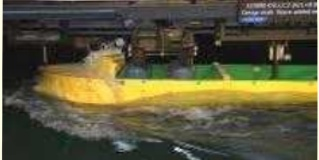

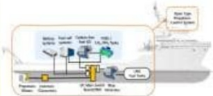

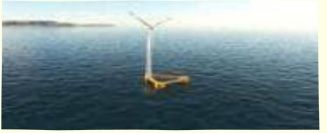

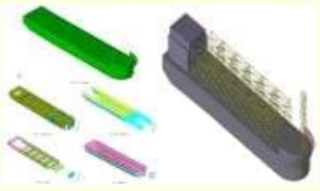

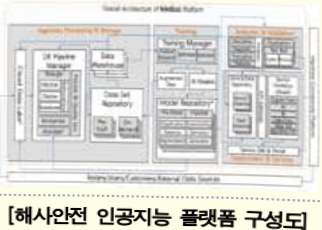

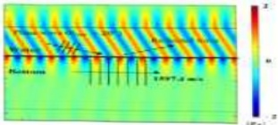

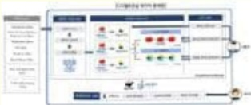

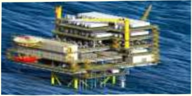

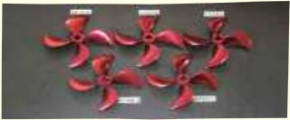

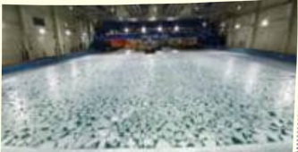

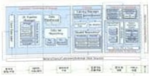

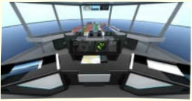

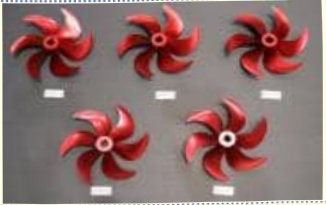

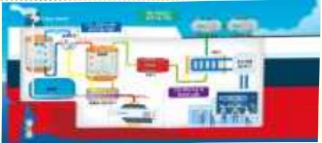

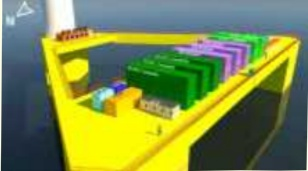

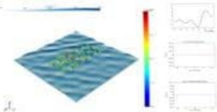

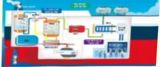

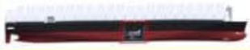

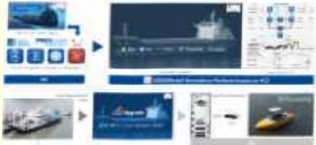

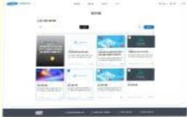

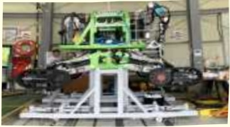

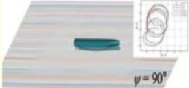

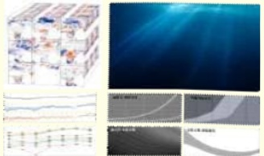

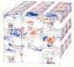

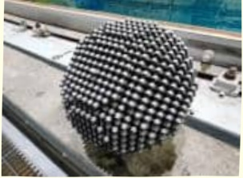

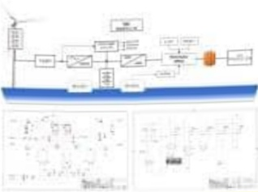

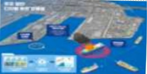

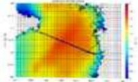

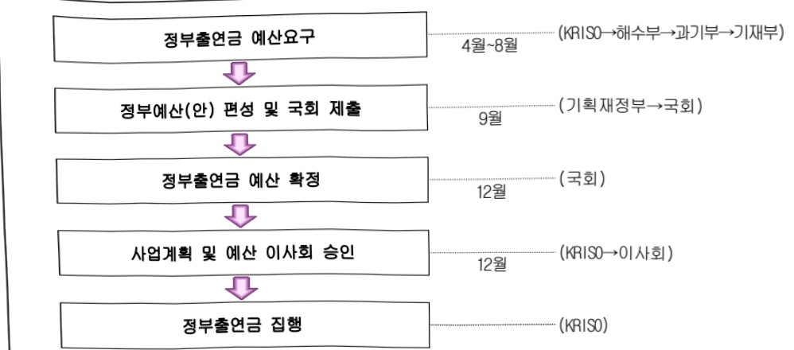

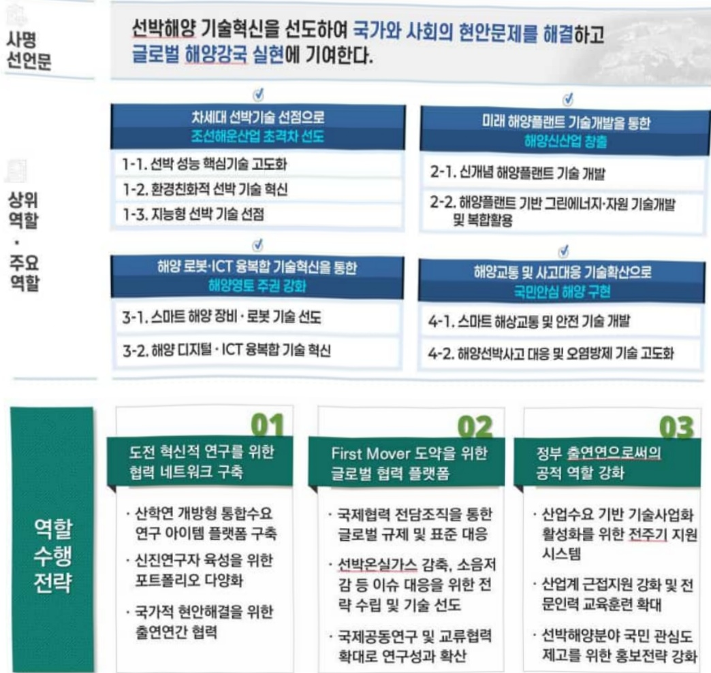

