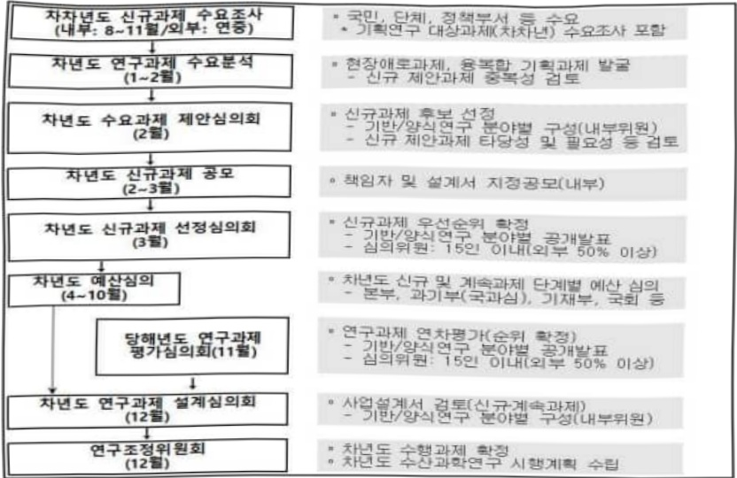

# 스마트수산업 응용기술 국산화 및 실증연구(R&D)

**해당 페이지**: PDF 5052 ~ 5058 쪽 해당

**부처**: 해양수산부
**분야**: 농림수산
**회계유형**: 일반회계
**2026 확정예산**: 5017.0 백만원
**전년대비 증감률**: None%
**AI 도메인**: 해양/수산

---

<table border=1 style='margin: auto; word-wrap: break-word;'><tr><td style='text-align: center; word-wrap: break-word;'>사 업 명</td></tr><tr><td style='text-align: center; word-wrap: break-word;'>(114) 스마트수산업 응용기술 국산화 및 실증연구(R&amp;D) (3632-320)</td></tr></table>

□ 사업 코드 정보

<table border=1 style='margin: auto; word-wrap: break-word;'><tr><td style='text-align: center; word-wrap: break-word;'>구분</td><td style='text-align: center; word-wrap: break-word;'>회계</td><td style='text-align: center; word-wrap: break-word;'>소관</td><td style='text-align: center; word-wrap: break-word;'>실국(기관)</td><td style='text-align: center; word-wrap: break-word;'>계정</td><td style='text-align: center; word-wrap: break-word;'>분야</td><td style='text-align: center; word-wrap: break-word;'>부문</td></tr><tr><td style='text-align: center; word-wrap: break-word;'>코드</td><td rowspan="2">11</td><td rowspan="2">28</td><td rowspan="2">국립수산과학원</td><td rowspan="2"></td><td style='text-align: center; word-wrap: break-word;'>100</td><td style='text-align: center; word-wrap: break-word;'>103</td></tr><tr><td style='text-align: center; word-wrap: break-word;'>명칭</td><td style='text-align: center; word-wrap: break-word;'>농림수산</td><td style='text-align: center; word-wrap: break-word;'>수산·어촌</td></tr></table>

<table border=1 style='margin: auto; word-wrap: break-word;'><tr><td style='text-align: center; word-wrap: break-word;'>구분</td><td style='text-align: center; word-wrap: break-word;'>프로그램</td><td style='text-align: center; word-wrap: break-word;'>단위사업</td><td style='text-align: center; word-wrap: break-word;'>세부사업</td></tr><tr><td style='text-align: center; word-wrap: break-word;'>코드</td><td style='text-align: center; word-wrap: break-word;'>3600</td><td style='text-align: center; word-wrap: break-word;'>3632</td><td style='text-align: center; word-wrap: break-word;'>320</td></tr><tr><td style='text-align: center; word-wrap: break-word;'>명칭</td><td style='text-align: center; word-wrap: break-word;'>수산연구(국립수산과학원)</td><td style='text-align: center; word-wrap: break-word;'>수산과학연구</td><td style='text-align: center; word-wrap: break-word;'>스마트수산업 응용기술 국산화 및 실증연구(R&amp;D)</td></tr></table>

□ 사업 성격 (공통요구자료 Ⅱ-1 작성유의사항 4. 참조, 해당하는 사항에 “○” 표시)

<table border=1 style='margin: auto; word-wrap: break-word;'><tr><td style='text-align: center; word-wrap: break-word;'>신규 계속</td><td style='text-align: center; word-wrap: break-word;'>완료</td><td style='text-align: center; word-wrap: break-word;'>예비타당성 실시여부</td><td style='text-align: center; word-wrap: break-word;'>총사업비 관리대상</td><td style='text-align: center; word-wrap: break-word;'>총액계상 예산사업</td><td style='text-align: center; word-wrap: break-word;'>사업소관 변경정보 2025예산 시 소관</td></tr><tr><td style='text-align: center; word-wrap: break-word;'>☑</td><td style='text-align: center; word-wrap: break-word;'></td><td style='text-align: center; word-wrap: break-word;'></td><td style='text-align: center; word-wrap: break-word;'></td><td style='text-align: center; word-wrap: break-word;'></td><td style='text-align: center; word-wrap: break-word;'></td></tr></table>

□사업지원형태 및지원을(최소한한개는반드시선택하시오.해당사항에O표시)

<table border=1 style='margin: auto; word-wrap: break-word;'><tr><td style='text-align: center; word-wrap: break-word;'>직접</td><td style='text-align: center; word-wrap: break-word;'>출자</td><td style='text-align: center; word-wrap: break-word;'>출연</td><td style='text-align: center; word-wrap: break-word;'>보조</td><td style='text-align: center; word-wrap: break-word;'>융자</td><td style='text-align: center; word-wrap: break-word;'>국고보조율(%)</td><td style='text-align: center; word-wrap: break-word;'>융자율(%)</td></tr><tr><td style='text-align: center; word-wrap: break-word;'>○</td><td style='text-align: center; word-wrap: break-word;'></td><td style='text-align: center; word-wrap: break-word;'></td><td style='text-align: center; word-wrap: break-word;'></td><td style='text-align: center; word-wrap: break-word;'></td><td style='text-align: center; word-wrap: break-word;'></td><td style='text-align: center; word-wrap: break-word;'></td></tr></table>

## □ 사업 담당자

<table border=1 style='margin: auto; word-wrap: break-word;'><tr><td style='text-align: center; word-wrap: break-word;'>사업명</td><td colspan="2">구분</td></tr><tr><td rowspan="2">스마트수산업 응용기술 국산화 및 실증연구(R&amp;D)</td><td style='text-align: center; word-wrap: break-word;'>소관부처</td><td style='text-align: center; word-wrap: break-word;'>실·국·과(팀)명 국립수산과학원 양식연구과</td></tr><tr><td style='text-align: center; word-wrap: break-word;'>사업시행주체</td><td style='text-align: center; word-wrap: break-word;'>직접수행</td></tr></table>

---

### 가.예산 총괄표

(단위: 백만원, %)

<table border=1 style='margin: auto; word-wrap: break-word;'><tr><td rowspan="2">사업명</td><td rowspan="2">2024년 결산</td><td colspan="2">2025년 예산</td><td colspan="2">2026년</td><td rowspan="2">중감(B-A)</td><td rowspan="2">(B-A)/A</td></tr><tr><td style='text-align: center; word-wrap: break-word;'>본예산(A)</td><td style='text-align: center; word-wrap: break-word;'>추경</td><td style='text-align: center; word-wrap: break-word;'>정부안</td><td style='text-align: center; word-wrap: break-word;'>확정(B)</td></tr><tr><td style='text-align: center; word-wrap: break-word;'>스마트수산업 응용기술 국산화 및 실증연구(R&amp;D)</td><td style='text-align: center; word-wrap: break-word;'>-</td><td style='text-align: center; word-wrap: break-word;'>-</td><td style='text-align: center; word-wrap: break-word;'>-</td><td style='text-align: center; word-wrap: break-word;'>5,017</td><td style='text-align: center; word-wrap: break-word;'>5,017</td><td style='text-align: center; word-wrap: break-word;'>5,017</td><td style='text-align: center; word-wrap: break-word;'>순증</td></tr></table>

□ 기능별(내역사업별), 목별 예산 내역

(단위:백만원)

<table border=1 style='margin: auto; word-wrap: break-word;'><tr><td rowspan="3"></td><td colspan="4">2024</td><td colspan="6">2025(2025.12월말)</td><td style='text-align: center; word-wrap: break-word;'>2026</td></tr><tr><td rowspan="2">예산의(추정)</td><td rowspan="2">예산현액</td><td rowspan="2">집행액[실집행액]</td><td rowspan="2">이월액</td><td rowspan="2">불용액</td><td rowspan="2">분예산</td><td rowspan="2">예산현액</td><td rowspan="2">집행액[실집행액]</td><td colspan="2">전년도 이월액제외</td><td rowspan="2">불용예상액</td></tr><tr><td style='text-align: center; word-wrap: break-word;'>예산현액</td><td style='text-align: center; word-wrap: break-word;'>집행액[실집행액]</td></tr><tr><td style='text-align: center; word-wrap: break-word;'>○ 기능별 분류(함께)</td><td style='text-align: center; word-wrap: break-word;'>-</td><td style='text-align: center; word-wrap: break-word;'>-</td><td style='text-align: center; word-wrap: break-word;'>-</td><td style='text-align: center; word-wrap: break-word;'>-</td><td style='text-align: center; word-wrap: break-word;'>-</td><td style='text-align: center; word-wrap: break-word;'>-</td><td style='text-align: center; word-wrap: break-word;'>-</td><td style='text-align: center; word-wrap: break-word;'>-</td><td style='text-align: center; word-wrap: break-word;'>-</td><td style='text-align: center; word-wrap: break-word;'>-</td><td style='text-align: center; word-wrap: break-word;'>5,017</td></tr><tr><td style='text-align: center; word-wrap: break-word;'>· 지능형 양식시스템고도화 기술개발· 지능형 양식시스템현장적용 연구</td><td style='text-align: center; word-wrap: break-word;'>-</td><td style='text-align: center; word-wrap: break-word;'>-</td><td style='text-align: center; word-wrap: break-word;'>-</td><td style='text-align: center; word-wrap: break-word;'>-</td><td style='text-align: center; word-wrap: break-word;'>-</td><td style='text-align: center; word-wrap: break-word;'>-</td><td style='text-align: center; word-wrap: break-word;'>-</td><td style='text-align: center; word-wrap: break-word;'>-</td><td style='text-align: center; word-wrap: break-word;'>-</td><td style='text-align: center; word-wrap: break-word;'>-</td><td style='text-align: center; word-wrap: break-word;'>2,009</td></tr><tr><td style='text-align: center; word-wrap: break-word;'>○ 비목별 분류(함께)</td><td style='text-align: center; word-wrap: break-word;'>-</td><td style='text-align: center; word-wrap: break-word;'>-</td><td style='text-align: center; word-wrap: break-word;'>-</td><td style='text-align: center; word-wrap: break-word;'>-</td><td style='text-align: center; word-wrap: break-word;'>-</td><td style='text-align: center; word-wrap: break-word;'>-</td><td style='text-align: center; word-wrap: break-word;'>-</td><td style='text-align: center; word-wrap: break-word;'>-</td><td style='text-align: center; word-wrap: break-word;'>-</td><td style='text-align: center; word-wrap: break-word;'>-</td><td style='text-align: center; word-wrap: break-word;'>3,008</td></tr><tr><td style='text-align: center; word-wrap: break-word;'>· 상용임금(110-03)· 복리 후 생비(210-12)· 시험 연 구 비(210-13)· 일 반 연 구 비(260-01)· 고 용 부 담 금(320-09)</td><td style='text-align: center; word-wrap: break-word;'>-</td><td style='text-align: center; word-wrap: break-word;'>-</td><td style='text-align: center; word-wrap: break-word;'>-</td><td style='text-align: center; word-wrap: break-word;'>-</td><td style='text-align: center; word-wrap: break-word;'>-</td><td style='text-align: center; word-wrap: break-word;'>-</td><td style='text-align: center; word-wrap: break-word;'>-</td><td style='text-align: center; word-wrap: break-word;'>-</td><td style='text-align: center; word-wrap: break-word;'>-</td><td style='text-align: center; word-wrap: break-word;'>-</td><td style='text-align: center; word-wrap: break-word;'>5,017</td></tr><tr><td style='text-align: center; word-wrap: break-word;'>○ 기능비목별 분류(함께)</td><td style='text-align: center; word-wrap: break-word;'>-</td><td style='text-align: center; word-wrap: break-word;'>-</td><td style='text-align: center; word-wrap: break-word;'>-</td><td style='text-align: center; word-wrap: break-word;'>-</td><td style='text-align: center; word-wrap: break-word;'>-</td><td style='text-align: center; word-wrap: break-word;'>-</td><td style='text-align: center; word-wrap: break-word;'>-</td><td style='text-align: center; word-wrap: break-word;'>-</td><td style='text-align: center; word-wrap: break-word;'>-</td><td style='text-align: center; word-wrap: break-word;'>-</td><td style='text-align: center; word-wrap: break-word;'>354</td></tr><tr><td style='text-align: center; word-wrap: break-word;'>· 지능형 양식시스템고도화 기술개발· 상 용 임 금(110-03)· 복리 후 생비(210-12)· 시험 연 구 비(210-13)· 일 반 연 구 비(260-01)· 고 용 부 담 금(320-09)</td><td style='text-align: center; word-wrap: break-word;'>-</td><td style='text-align: center; word-wrap: break-word;'>-</td><td style='text-align: center; word-wrap: break-word;'>-</td><td style='text-align: center; word-wrap: break-word;'>-</td><td style='text-align: center; word-wrap: break-word;'>-</td><td style='text-align: center; word-wrap: break-word;'>-</td><td style='text-align: center; word-wrap: break-word;'>-</td><td style='text-align: center; word-wrap: break-word;'>-</td><td style='text-align: center; word-wrap: break-word;'>-</td><td style='text-align: center; word-wrap: break-word;'>-</td><td style='text-align: center; word-wrap: break-word;'>2,009</td></tr></table>

---

<table border=1 style='margin: auto; word-wrap: break-word;'><tr><td rowspan="3"></td><td colspan="5">2024</td><td colspan="7">2025(2025.12월말)</td><td rowspan="3">2026</td></tr><tr><td rowspan="2">예산액(추경)</td><td rowspan="2">예산현액</td><td rowspan="2">집행액[실집행액]</td><td rowspan="2">이월액</td><td rowspan="2">불용액</td><td rowspan="2">본예산</td><td rowspan="2">예산현액</td><td rowspan="2">집행액[실집행액]</td><td colspan="2">전년도 이월액제의</td><td rowspan="2">이월예산액</td><td rowspan="2">불용예산액</td></tr><tr><td style='text-align: center; word-wrap: break-word;'>예산현액</td><td style='text-align: center; word-wrap: break-word;'>집행액[실집행액]</td></tr><tr><td rowspan="6">· 지능형 양식시스템현장적용 연구- 상 용 임 금(110-03)- 복 리 후 생 비(210-12)- 시 협 연 구 비(210-13)- 일 반 연 구 비(260-01)- 고 용 부 담 금(320-09)</td><td style='text-align: center; word-wrap: break-word;'>-</td><td style='text-align: center; word-wrap: break-word;'>-</td><td style='text-align: center; word-wrap: break-word;'>-</td><td style='text-align: center; word-wrap: break-word;'>-</td><td style='text-align: center; word-wrap: break-word;'>-</td><td style='text-align: center; word-wrap: break-word;'>-</td><td style='text-align: center; word-wrap: break-word;'>-</td><td style='text-align: center; word-wrap: break-word;'>-</td><td style='text-align: center; word-wrap: break-word;'>-</td><td style='text-align: center; word-wrap: break-word;'>-</td><td style='text-align: center; word-wrap: break-word;'>-</td><td style='text-align: center; word-wrap: break-word;'>-</td><td style='text-align: center; word-wrap: break-word;'>3,008</td></tr><tr><td style='text-align: center; word-wrap: break-word;'>-</td><td style='text-align: center; word-wrap: break-word;'>-</td><td style='text-align: center; word-wrap: break-word;'>-</td><td style='text-align: center; word-wrap: break-word;'>-</td><td style='text-align: center; word-wrap: break-word;'>-</td><td style='text-align: center; word-wrap: break-word;'>-</td><td style='text-align: center; word-wrap: break-word;'>-</td><td style='text-align: center; word-wrap: break-word;'>-</td><td style='text-align: center; word-wrap: break-word;'>-</td><td style='text-align: center; word-wrap: break-word;'>-</td><td style='text-align: center; word-wrap: break-word;'>-</td><td style='text-align: center; word-wrap: break-word;'>-</td><td style='text-align: center; word-wrap: break-word;'>161</td></tr><tr><td style='text-align: center; word-wrap: break-word;'>-</td><td style='text-align: center; word-wrap: break-word;'>-</td><td style='text-align: center; word-wrap: break-word;'>-</td><td style='text-align: center; word-wrap: break-word;'>-</td><td style='text-align: center; word-wrap: break-word;'>-</td><td style='text-align: center; word-wrap: break-word;'>-</td><td style='text-align: center; word-wrap: break-word;'>-</td><td style='text-align: center; word-wrap: break-word;'>-</td><td style='text-align: center; word-wrap: break-word;'>-</td><td style='text-align: center; word-wrap: break-word;'>-</td><td style='text-align: center; word-wrap: break-word;'>-</td><td style='text-align: center; word-wrap: break-word;'>-</td><td style='text-align: center; word-wrap: break-word;'>3</td></tr><tr><td style='text-align: center; word-wrap: break-word;'>-</td><td style='text-align: center; word-wrap: break-word;'>-</td><td style='text-align: center; word-wrap: break-word;'>-</td><td style='text-align: center; word-wrap: break-word;'>-</td><td style='text-align: center; word-wrap: break-word;'>-</td><td style='text-align: center; word-wrap: break-word;'>-</td><td style='text-align: center; word-wrap: break-word;'>-</td><td style='text-align: center; word-wrap: break-word;'>-</td><td style='text-align: center; word-wrap: break-word;'>-</td><td style='text-align: center; word-wrap: break-word;'>-</td><td style='text-align: center; word-wrap: break-word;'>-</td><td style='text-align: center; word-wrap: break-word;'>-</td><td style='text-align: center; word-wrap: break-word;'>812</td></tr><tr><td style='text-align: center; word-wrap: break-word;'>-</td><td style='text-align: center; word-wrap: break-word;'>-</td><td style='text-align: center; word-wrap: break-word;'>-</td><td style='text-align: center; word-wrap: break-word;'>-</td><td style='text-align: center; word-wrap: break-word;'>-</td><td style='text-align: center; word-wrap: break-word;'>-</td><td style='text-align: center; word-wrap: break-word;'>-</td><td style='text-align: center; word-wrap: break-word;'>-</td><td style='text-align: center; word-wrap: break-word;'>-</td><td style='text-align: center; word-wrap: break-word;'>-</td><td style='text-align: center; word-wrap: break-word;'>-</td><td style='text-align: center; word-wrap: break-word;'>-</td><td style='text-align: center; word-wrap: break-word;'>2,000</td></tr><tr><td style='text-align: center; word-wrap: break-word;'>-</td><td style='text-align: center; word-wrap: break-word;'>-</td><td style='text-align: center; word-wrap: break-word;'>-</td><td style='text-align: center; word-wrap: break-word;'>-</td><td style='text-align: center; word-wrap: break-word;'>-</td><td style='text-align: center; word-wrap: break-word;'>-</td><td style='text-align: center; word-wrap: break-word;'>-</td><td style='text-align: center; word-wrap: break-word;'>-</td><td style='text-align: center; word-wrap: break-word;'>-</td><td style='text-align: center; word-wrap: break-word;'>-</td><td style='text-align: center; word-wrap: break-word;'>-</td><td style='text-align: center; word-wrap: break-word;'>-</td><td style='text-align: center; word-wrap: break-word;'>32</td></tr></table>

### 나. 사업설명자료

## 1 ) 사업목적·내용

- (스마트수산업 응용기술 국산화 및 실증연구) 양식방법별(해상가두리, 육상수조) 스마트

양식 요소기술의 국산화/고도화 기술 개발과 현장 적용 실증을 통해 수산업의 지속

가능성 확보 및 첨단산업화 추진

- (지능형 양식시스템 고도화 기술개발)

- 먹이활성도 연동 지능형 사료공급 기술, 수중 카메라 기반 행동 분석 알고리즘, 양식장

운영 소프트웨어 국산화

- 동 사업은 사료 공급 패턴 제어 및 먹이활성도 연동 지능형 사료 공급 기술, 수중 카메라 기반 성장 측정 및 유영행동 분석 알고리즘 개발, 실시간 조류, 수온 등 센서 통합 및 경보시스템 개발, 사육생물/양식환경 통합 제어 기술개발, 양식장 운영 소프트웨어 국산화 개발, 양식기자재 모듈형 기술개발, 경제성 분석 수행

- (지능형 양식시스템 현장적용 연구)

- 해상가두리 및 육상수조 지능형 양식시스템 테스트베드 구축 및 고도화, 보급형 모델

적용성 평가

- 동 사업은 해상가두리 테스트베드 5개소 구축·운영, 육상수조 테스트베드 3개소 구축·운영, 고도화 기술 현장적용 및 성능 실증, 시스템 통합 시험 및 보급형 모델 적용가능성 평가, 표준화 설계도 및 기자재 대량생산 시스템 개발 수행

---

## 2 ) 사업개요

## □ 사업근거 및 추진경위

## ① 법령상 근거 조항 적시

## - 「해양수산과학기술 육성법」 제5조(해양수산과학기술육성 기본계획의 수립 등)제1항, 제2항

① 해양수산부장관은 해양수산과학기술 육성을 위하여 5년마다 해양수산과학기술 육성 기본계획(이하 “기본계획”이라 한다)을 수립하여 시행하여야 한다. ② 기본계획에는 다음 각 호의 사항이 포함되어야 한다. 1. 해양수산과학기술 육성을 위한 정책목표와 방향. 2. 해양수산과학기술의 국내외 현황과 전망. 3. 해양수산과학기술의 중점기술 개발 전략. 4. 해양수산과학기술 육성을 위한 중장기 투자계획. 5. 해양수산과학기술 성과의 보급 및 실용화 방안. 6. 해양수산과학기술 인력의 수급 및 육성 방안. 7. 해양수산과학기술 관련 학계 · 연구기관 · 산업계 간의 협동연구 및 융합기술 연구개발 촉진 방안. 8. 그 밖에 해양수산과학기술 육성을 위하여 해양수산부장관이 필요하다고 인정하는 사항

## -「수산과학기술진흥을 위한 시험연구 등에 관한 법률」제4조(연구개발의 추진)제1항

① 해양수산부장관은 시험연구사업의 촉진을 위하여 다음 각 호의 연구개발을 추진한다.

1. 수산업 기초과학기술의 연구개발. 2. 수산물의 수출 품종에 관한 연구개발. 3. 수산생명공학에 관한 응용연구. 4. 「수산업·어촌 발전 기본법」 제30조에 따른 수산업 관련 산업의 기술개발. 5. 수산생물의 산업화에 관한 연구개발. 6. 지역 특성에 맞는 새 기술의 개발 및 현장애로개선기술의 개발

## -「양식산업발전법」제59조(규모화 지원)

· 국가 및 지방자치단체는 양식업의 생산성 향상을 위하여 양식업자 간 협업경영과 양식업에 대한 투자의 촉진 등 양식업의 규모 확대에 관한 시책을 수립 · 시행할 수 있다. 다만,

「독점규제 및 공정거래에 관한 법률」 제40조제1항 각 호의 어느 하나에 해당하는 방식의 협업경영은 제외한다

## -「양식산업발전법」제61조(기술개발 지원)제1항

① 해양수산부장관은 양식산업과 관련된 기술의 개발·보급을 위하여 다음 각 호의 사업을 하려는 자에 대하여 해당 사업을 지원할 수 있다. 1. 양식산업 발전을 위한 사회·경제적 조사·연구 사업. 2. 양식산업에 관한 외국으로부터의 새로운 기술도입 사업. 3. 양식시설의 자동화, 기계화 및 지능화에 관한 기술개발 사업. 4. 양식시설 개선·보완 사업. 5. 개발된 양식기술의 산업화 사업. 6. 양식업 생산경쟁력 제고 및 안정적인 사료 공급을 위한 사료기술의 개발·보급 사업. 7. 양식산업 관련 데이터 베이스의 구축 및 관리 사업. 8. 그 밖에 양식산업에 관한 기술개발·보급을 위하여 필요한 사업

---

② 추진경위 - 사업 시작년도, 추진배경, 부처별 중점과제, 대통령 공약사항 등

- (국정과제 경제2-2) 「수산·해양산업 혁신으로 어촌·연안을 기회의 땅으로 조성」

· 첨단 육상양식기술을 개발·실증하는 스마트양식 클러스터 확충 및 연관산업 집적화를 위한 배후부지 기반 조성

-「해양수산부 스마트양식 클러스터 지원 공모사업 추진」

· 스마트양식 클러스터 테스트베드 및 배후부지 지원(400억/1개소)

- 에너지 비용 급등 및 친환경 정책 강화

·산업용 전기요금 급등으로 인한 양식업 경영난 심화

* '22~'23년 80원/kWh 인상, '24년 10월 추가 9.7% 인상으로 운영비 부담 가중

** 육상양식장의 전력 의존도 높은 설비(RAS, 펌프류, UV살균기, 산소공급장치 등) 운영비 급증

- 노동력 부족 및 생산성 향상 요구 증대

· 수산업 종사자 고령화 및 신규 인력 유입 부족

* 고령 어업인 작업 부담 가중으로 생산성 저하 심화 및 물리적으로 힘든 작업 특성으로

인한 젊은 인력 기피 현상 지속

·자동화를 통한 효율성 제고 및 산업 경쟁력 확보 필요

*에너지효율분석 및양식관리(질병관리, 폐사어처리, 정밀사료공급등)를 위한 반복적

위험 작업의 자동화 요구

## □ 주요내용

① 사업규모

- 총사업비(해당되는 경우에만 기재) : 250억원

- 사업기간 : 2026-2030년

- 최근 5년 간 투입된 사업비(예산액기준, 추경편성한 연도에는 추경포함)

<table border=1 style='margin: auto; word-wrap: break-word;'><tr><td style='text-align: center; word-wrap: break-word;'>연도</td><td style='text-align: center; word-wrap: break-word;'>2022</td><td style='text-align: center; word-wrap: break-word;'>2023</td><td style='text-align: center; word-wrap: break-word;'>2024</td><td style='text-align: center; word-wrap: break-word;'>2025</td><td style='text-align: center; word-wrap: break-word;'>2026</td></tr><tr><td style='text-align: center; word-wrap: break-word;'>사업비</td><td style='text-align: center; word-wrap: break-word;'>-</td><td style='text-align: center; word-wrap: break-word;'>-</td><td style='text-align: center; word-wrap: break-word;'>-</td><td style='text-align: center; word-wrap: break-word;'>-</td><td style='text-align: center; word-wrap: break-word;'>5,000</td></tr></table>

② 사업추진체계

- 사업시행방법 : 직접수행

- 사업시행주체 : 국립수산과학원

-사업 수혜자 : 어업인, 데이터플랫폼기업, 수산기업, 기자재기업, 수산물 유통기업

- 보조, 융자, 출연, 출자 등의 경우 보조·융자 등 지원 비율 및 법적근거 : 해당없음

---

## 3 ) 2026년도 예산 산출 근거

① 지능형 양식시스템 고도화 기술개발

:(25)0백만원→(26요구)2,009백만원,2,009백만원증액

- (요구) 사료 공급 패턴 및 먹이 활성도 연동 지능형 제어기술, RAS 핵심 모듈(여과기, UV 등) 기술, 먹이활성도 연동 제어 기술 개발을 위한 2,009백만원

- (산출) 계속 2과제 × 1,004백만원 × 100% × 12/12개월 = 2,009백만원

② 지능형 양식시스템 현장적용 연구

:(25) 0백만원 → (26요구) 2,009백만원, 2,009백만원 증액

- (요구) 육상양식 및 해상가두리양식 선도지구 테스트베드 구축 및 시범운영을 위한 3,008백만원

- (산술) 계속 2과제 × 1,504백만원 × 100% × 12/12개월 = 3,008백만원

- 2025년도 예산 및 2026년도 예산 산출 세부내역 비교

<table border=1 style='margin: auto; word-wrap: break-word;'><tr><td colspan="2">2025년 분예산</td><td colspan="2">2026년 예산</td></tr><tr><td style='text-align: center; word-wrap: break-word;'>예산</td><td style='text-align: center; word-wrap: break-word;'>산줄내역</td><td style='text-align: center; word-wrap: break-word;'>예산</td><td style='text-align: center; word-wrap: break-word;'>산줄내역</td></tr><tr><td style='text-align: center; word-wrap: break-word;'>-</td><td style='text-align: center; word-wrap: break-word;'></td><td style='text-align: center; word-wrap: break-word;'>5,017</td><td style='text-align: center; word-wrap: break-word;'>① 지능형 양식시스템 고도화 기술개발
② 상용임금(110-03): 193백만원
③ 32백만원×6명×12/12개월 = 193백만원
④ 복리후생비(210-12): 3백만원
⑤ 0.5백만원×6명×12/12개월 = 3백만원
⑥ 시험연구비(210-13): 774백만원
⑦ 387백만원×해상가두리 스마트시스템 고도화 1식 = 387백만원
⑧ 387백만원×육상수조식 스마트시스템 고도화 1식 = 387백만원
⑨ 일반연구비(260-01): 1,000백만원
⑩ 500백만원×해상가두리 스마트시스템 고도화 1식 = 500백만원
⑪ 500백만원×육상수조식 스마트시스템 고도화 1식 = 500백만원
⑫ 고용부담금(320-09): 38백만원
⑬ 6.4백만원×6명×12/12개월 = 38백만원
⑭ 지능형 양식시스템 현장적용 연구
⑮ 상용임금(110-03): 161백만원
⑯ 32백만원×5명×12/12개월 = 161백만원
⑰ 복리후생비(210-12): 3백만원
⑱ 0.5백만원×5명×12/12개월 = 2.5백만원
⑲ 시험연구비(210-13): 812백만원
⑳ 387백만원×해상가두리 스마트시스템 현장적용 1식 = 387백만원
㉑ 425백만원×육상수조식 스마트시스템 현장적용 1식 = 425백만원
㉒ 일반연구비(260-01): 2,000백만원
㉓ 1,000백만원×해상가두리 스마트시스템 고도화 1식 = 1,000백만원
㉔ 1,000백만원×육상수조식 스마트시스템 고도화 1식 = 1,000백만원
㉕ 고용부담금(320-09): 32백만원
㉖ 6.4백만원×5명×12/12개월 = 32백만원</td></tr></table>

## 4 ) 사업효과

□ 사업영향, 산출물 성과지표 등

① 2022~2026년도 성과계획서 상 성과지표 및 최근 5년간 성과 달성도 : 해당없음

---

② 성과지표 이외의 연도별 사업추진 경과 및 실적 : 해당없음

③향후(2026년도 이후)기대효과

- (지능형 양식시스템 고도화 기술개발) 양식방법별(해상가두리, 육상수조) 스마트 수산업 요소기술의 국산화 및 고도화 기술 10종 개발

- (지능형 양식시스템 현장적용 연구) 스마트 요소기술의 현장 적용, 보급형 모델

적용 가능성 평가, 표준화를 통한 대량생산 시스템 개발 및 테스트베드 8개소 구축

5) 타당성조사 및 예비타당성조사 시행여부 및 결과 요지 : 해당없음

6) 총사업비 대상사업 여부 및 내역 : 해당없음

## 7 ) 사업 집행절차

8) 각종 평가: 해당없음

다.최근 4년간 결산내역 : 해당없음

---

### 원본 PDF 크롭 이미지

