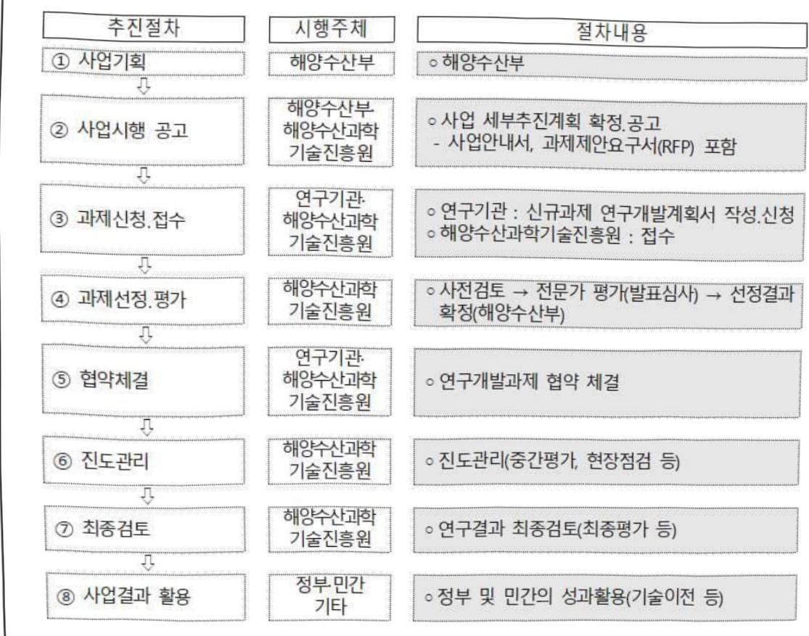

# 유수식 디지털양식 혁신기술개발(R&D)

**해당 페이지**: PDF 5073 ~ 5080 쪽 해당

**부처**: 해양수산부
**분야**: 농림수산
**회계유형**: 농어촌구조 개선특별회계
**2026 확정예산**: 9380.0 백만원
**전년대비 증감률**: 31.4%
**AI 도메인**: 데이터

---

<table border=1 style='margin: auto; word-wrap: break-word;'><tr><td style='text-align: center; word-wrap: break-word;'>사 업 명</td></tr><tr><td style='text-align: center; word-wrap: break-word;'>(36) 유수식 디지털양식 혁신기술개발(R&amp;D) (3433-326)</td></tr></table>

## □ 사업 코드 정보

<table border=1 style='margin: auto; word-wrap: break-word;'><tr><td style='text-align: center; word-wrap: break-word;'>구분</td><td style='text-align: center; word-wrap: break-word;'>회계</td><td style='text-align: center; word-wrap: break-word;'>소관</td><td style='text-align: center; word-wrap: break-word;'>실국(기관)</td><td style='text-align: center; word-wrap: break-word;'>계정</td><td style='text-align: center; word-wrap: break-word;'>분야</td><td style='text-align: center; word-wrap: break-word;'>부문</td></tr><tr><td style='text-align: center; word-wrap: break-word;'>코드</td><td style='text-align: center; word-wrap: break-word;'>농어촌구조</td><td rowspan="2">해양수산부</td><td style='text-align: center; word-wrap: break-word;'>수산정책실</td><td style='text-align: center; word-wrap: break-word;'>농어촌특별세</td><td style='text-align: center; word-wrap: break-word;'>100</td><td style='text-align: center; word-wrap: break-word;'>103</td></tr><tr><td style='text-align: center; word-wrap: break-word;'>명칭</td><td style='text-align: center; word-wrap: break-word;'>개선특별회계</td><td style='text-align: center; word-wrap: break-word;'>어촌양식정책관</td><td style='text-align: center; word-wrap: break-word;'>사업계정</td><td style='text-align: center; word-wrap: break-word;'>농림수산</td><td style='text-align: center; word-wrap: break-word;'>수산·어촌</td></tr></table>

<table border=1 style='margin: auto; word-wrap: break-word;'><tr><td style='text-align: center; word-wrap: break-word;'>구분</td><td style='text-align: center; word-wrap: break-word;'>프로그램</td><td style='text-align: center; word-wrap: break-word;'>단위사업</td><td style='text-align: center; word-wrap: break-word;'>세부사업</td></tr><tr><td style='text-align: center; word-wrap: break-word;'>코드</td><td style='text-align: center; word-wrap: break-word;'>3400</td><td style='text-align: center; word-wrap: break-word;'>3433</td><td style='text-align: center; word-wrap: break-word;'>326</td></tr><tr><td style='text-align: center; word-wrap: break-word;'>명칭</td><td style='text-align: center; word-wrap: break-word;'>어업인소득안정지원</td><td style='text-align: center; word-wrap: break-word;'>수산연구개발</td><td style='text-align: center; word-wrap: break-word;'>유수식 디지털양식 혁신기술개발(R&amp;D)</td></tr></table>

☐ 사업 성격

<table border=1 style='margin: auto; word-wrap: break-word;'><tr><td rowspan="2">신규</td><td rowspan="2">계속</td><td rowspan="2">완료</td><td rowspan="2">예비타당성 실시여부</td><td rowspan="2">총사업비 관리대상</td><td rowspan="2">총액계상 예산사업</td><td style='text-align: center; word-wrap: break-word;'>사업소관 변경정보</td></tr><tr><td style='text-align: center; word-wrap: break-word;'>2025예산 시 소관</td></tr><tr><td style='text-align: center; word-wrap: break-word;'></td><td style='text-align: center; word-wrap: break-word;'>○</td><td style='text-align: center; word-wrap: break-word;'></td><td style='text-align: center; word-wrap: break-word;'></td><td style='text-align: center; word-wrap: break-word;'></td><td style='text-align: center; word-wrap: break-word;'></td><td style='text-align: center; word-wrap: break-word;'></td></tr></table>

□ 사업 지원 형태 및 지원을 (최소한 한 개는 반드시 선택하시오. 해당사항에 0 표시)

<table border=1 style='margin: auto; word-wrap: break-word;'><tr><td style='text-align: center; word-wrap: break-word;'>직접</td><td style='text-align: center; word-wrap: break-word;'>출자</td><td style='text-align: center; word-wrap: break-word;'>출연</td><td style='text-align: center; word-wrap: break-word;'>보조</td><td style='text-align: center; word-wrap: break-word;'>융자</td><td style='text-align: center; word-wrap: break-word;'>국고보조율(%)</td><td style='text-align: center; word-wrap: break-word;'>융자율(%)</td></tr><tr><td style='text-align: center; word-wrap: break-word;'></td><td style='text-align: center; word-wrap: break-word;'></td><td style='text-align: center; word-wrap: break-word;'>○</td><td style='text-align: center; word-wrap: break-word;'></td><td style='text-align: center; word-wrap: break-word;'></td><td style='text-align: center; word-wrap: break-word;'></td><td style='text-align: center; word-wrap: break-word;'></td></tr></table>

## □ 사업 담당자

<table border=1 style='margin: auto; word-wrap: break-word;'><tr><td style='text-align: center; word-wrap: break-word;'>사업명</td><td colspan="2">구분</td></tr><tr><td rowspan="4">유수식 디지털양식 혁신기술개발 (R&amp;D)</td><td rowspan="3">소관부처</td><td style='text-align: center; word-wrap: break-word;'>실·국·과(팀)명</td></tr><tr><td style='text-align: center; word-wrap: break-word;'>수산정책실 어촌양식정책관</td></tr><tr><td style='text-align: center; word-wrap: break-word;'>양식산업과</td></tr><tr><td style='text-align: center; word-wrap: break-word;'>사업시행주체</td><td style='text-align: center; word-wrap: break-word;'>해양수산과학기술진흥원 블루푸드팀</td></tr></table>

---

### 가.예산 총괄표

(단위: 백만원, %)

<table border=1 style='margin: auto; word-wrap: break-word;'><tr><td rowspan="2">사업명</td><td rowspan="2">2024년 결산</td><td colspan="2">2025년 예산</td><td colspan="2">2026년</td><td rowspan="2">증감(B-A)</td><td rowspan="2">(B-A)/A</td></tr><tr><td style='text-align: center; word-wrap: break-word;'>본예산(A)</td><td style='text-align: center; word-wrap: break-word;'>추경</td><td style='text-align: center; word-wrap: break-word;'>정부안</td><td style='text-align: center; word-wrap: break-word;'>확정(B)</td></tr><tr><td style='text-align: center; word-wrap: break-word;'>유수식 디지털양식 혁신기술개발(R&amp;D)</td><td style='text-align: center; word-wrap: break-word;'>7,000</td><td style='text-align: center; word-wrap: break-word;'>7,140</td><td style='text-align: center; word-wrap: break-word;'>7,140</td><td style='text-align: center; word-wrap: break-word;'>9,380</td><td style='text-align: center; word-wrap: break-word;'>9,380</td><td style='text-align: center; word-wrap: break-word;'>2,440</td><td style='text-align: center; word-wrap: break-word;'>31.4</td></tr></table>

□ 기능별(내역사업별), 목별 예산 내역

(단위:백만원)

<table border=1 style='margin: auto; word-wrap: break-word;'><tr><td rowspan="3"></td><td colspan="5">2024</td><td colspan="7">2025(2025.12월말)</td><td rowspan="3">2026</td></tr><tr><td rowspan="2">예산액(추정)</td><td rowspan="2">예산현액</td><td rowspan="2">집행액[실집행액]</td><td rowspan="2">이월액</td><td rowspan="2">불용액</td><td rowspan="2">본예산</td><td rowspan="2">예산현액</td><td rowspan="2">집행액[실집행액]</td><td colspan="2">전년도 이월액제외</td><td rowspan="2">이월예상액</td><td rowspan="2">불용예상액</td></tr><tr><td style='text-align: center; word-wrap: break-word;'>예산현액</td><td style='text-align: center; word-wrap: break-word;'>집행액[실집행액]</td></tr><tr><td style='text-align: center; word-wrap: break-word;'>○ 기능별 분류(합계)</td><td style='text-align: center; word-wrap: break-word;'>7,000</td><td style='text-align: center; word-wrap: break-word;'>7,000</td><td style='text-align: center; word-wrap: break-word;'>7,000</td><td style='text-align: center; word-wrap: break-word;'>-</td><td style='text-align: center; word-wrap: break-word;'>-</td><td style='text-align: center; word-wrap: break-word;'>7,140</td><td style='text-align: center; word-wrap: break-word;'>7,140</td><td style='text-align: center; word-wrap: break-word;'>7,140</td><td style='text-align: center; word-wrap: break-word;'>7,140</td><td style='text-align: center; word-wrap: break-word;'>7,140</td><td style='text-align: center; word-wrap: break-word;'>-</td><td style='text-align: center; word-wrap: break-word;'>-</td><td style='text-align: center; word-wrap: break-word;'>9,380</td></tr><tr><td style='text-align: center; word-wrap: break-word;'>· 유수식 스마트양식시스템 개발</td><td style='text-align: center; word-wrap: break-word;'>4,000</td><td style='text-align: center; word-wrap: break-word;'>4,000</td><td style='text-align: center; word-wrap: break-word;'>4,000</td><td style='text-align: center; word-wrap: break-word;'>-</td><td style='text-align: center; word-wrap: break-word;'>-</td><td style='text-align: center; word-wrap: break-word;'>2,765</td><td style='text-align: center; word-wrap: break-word;'>2,765</td><td style='text-align: center; word-wrap: break-word;'>2,765</td><td style='text-align: center; word-wrap: break-word;'>2,765</td><td style='text-align: center; word-wrap: break-word;'>2,765</td><td style='text-align: center; word-wrap: break-word;'>-</td><td style='text-align: center; word-wrap: break-word;'>-</td><td style='text-align: center; word-wrap: break-word;'>4,235</td></tr><tr><td style='text-align: center; word-wrap: break-word;'>· 빅데이터 기반양식 생산성향상기술</td><td style='text-align: center; word-wrap: break-word;'>3,000</td><td style='text-align: center; word-wrap: break-word;'>3,000</td><td style='text-align: center; word-wrap: break-word;'>3,000</td><td style='text-align: center; word-wrap: break-word;'>-</td><td style='text-align: center; word-wrap: break-word;'>-</td><td style='text-align: center; word-wrap: break-word;'>4,375</td><td style='text-align: center; word-wrap: break-word;'>4,375</td><td style='text-align: center; word-wrap: break-word;'>4,375</td><td style='text-align: center; word-wrap: break-word;'>4,375</td><td style='text-align: center; word-wrap: break-word;'>4,375</td><td style='text-align: center; word-wrap: break-word;'>-</td><td style='text-align: center; word-wrap: break-word;'>-</td><td style='text-align: center; word-wrap: break-word;'>5,145</td></tr><tr><td style='text-align: center; word-wrap: break-word;'>○ 비목별 분류(합계)</td><td style='text-align: center; word-wrap: break-word;'>7,000</td><td style='text-align: center; word-wrap: break-word;'>7,000</td><td style='text-align: center; word-wrap: break-word;'>7,000</td><td style='text-align: center; word-wrap: break-word;'>-</td><td style='text-align: center; word-wrap: break-word;'>-</td><td style='text-align: center; word-wrap: break-word;'>7,140</td><td style='text-align: center; word-wrap: break-word;'>7,140</td><td style='text-align: center; word-wrap: break-word;'>7,140</td><td style='text-align: center; word-wrap: break-word;'>7,140</td><td style='text-align: center; word-wrap: break-word;'>7,140</td><td style='text-align: center; word-wrap: break-word;'>-</td><td style='text-align: center; word-wrap: break-word;'>-</td><td style='text-align: center; word-wrap: break-word;'>9,380</td></tr><tr><td style='text-align: center; word-wrap: break-word;'>· 연구개발활동비등(360-05)</td><td style='text-align: center; word-wrap: break-word;'>7,000</td><td style='text-align: center; word-wrap: break-word;'>7,000</td><td style='text-align: center; word-wrap: break-word;'>7,000</td><td style='text-align: center; word-wrap: break-word;'>-</td><td style='text-align: center; word-wrap: break-word;'>-</td><td style='text-align: center; word-wrap: break-word;'>7,140</td><td style='text-align: center; word-wrap: break-word;'>7,140</td><td style='text-align: center; word-wrap: break-word;'>7,140</td><td style='text-align: center; word-wrap: break-word;'>7,140</td><td style='text-align: center; word-wrap: break-word;'>7,140</td><td style='text-align: center; word-wrap: break-word;'>-</td><td style='text-align: center; word-wrap: break-word;'>-</td><td style='text-align: center; word-wrap: break-word;'>9,380</td></tr><tr><td style='text-align: center; word-wrap: break-word;'>○ 기능·비목별분류(합계)</td><td style='text-align: center; word-wrap: break-word;'>7,000</td><td style='text-align: center; word-wrap: break-word;'>7,000</td><td style='text-align: center; word-wrap: break-word;'>7,000</td><td style='text-align: center; word-wrap: break-word;'>-</td><td style='text-align: center; word-wrap: break-word;'>-</td><td style='text-align: center; word-wrap: break-word;'>7,140</td><td style='text-align: center; word-wrap: break-word;'>7,140</td><td style='text-align: center; word-wrap: break-word;'>7,140</td><td style='text-align: center; word-wrap: break-word;'>7,140</td><td style='text-align: center; word-wrap: break-word;'>7,140</td><td style='text-align: center; word-wrap: break-word;'>-</td><td style='text-align: center; word-wrap: break-word;'>-</td><td style='text-align: center; word-wrap: break-word;'>9,380</td></tr><tr><td style='text-align: center; word-wrap: break-word;'>· 유수식 스마트양식시스템 개발</td><td style='text-align: center; word-wrap: break-word;'>4,000</td><td style='text-align: center; word-wrap: break-word;'>4,000</td><td style='text-align: center; word-wrap: break-word;'>4,000</td><td style='text-align: center; word-wrap: break-word;'>-</td><td style='text-align: center; word-wrap: break-word;'>-</td><td style='text-align: center; word-wrap: break-word;'>2,765</td><td style='text-align: center; word-wrap: break-word;'>2,765</td><td style='text-align: center; word-wrap: break-word;'>2,765</td><td style='text-align: center; word-wrap: break-word;'>2,765</td><td style='text-align: center; word-wrap: break-word;'>2,765</td><td style='text-align: center; word-wrap: break-word;'>-</td><td style='text-align: center; word-wrap: break-word;'>-</td><td style='text-align: center; word-wrap: break-word;'>4,235</td></tr><tr><td style='text-align: center; word-wrap: break-word;'>· 연구개발활동비등(360-05)</td><td style='text-align: center; word-wrap: break-word;'>4,000</td><td style='text-align: center; word-wrap: break-word;'>4,000</td><td style='text-align: center; word-wrap: break-word;'>4,000</td><td style='text-align: center; word-wrap: break-word;'>-</td><td style='text-align: center; word-wrap: break-word;'>-</td><td style='text-align: center; word-wrap: break-word;'>2,765</td><td style='text-align: center; word-wrap: break-word;'>2,765</td><td style='text-align: center; word-wrap: break-word;'>2,765</td><td style='text-align: center; word-wrap: break-word;'>2,765</td><td style='text-align: center; word-wrap: break-word;'>2,765</td><td style='text-align: center; word-wrap: break-word;'>-</td><td style='text-align: center; word-wrap: break-word;'>-</td><td style='text-align: center; word-wrap: break-word;'>4,235</td></tr><tr><td style='text-align: center; word-wrap: break-word;'>· 빅데이터 기반양식 생산성향상기술</td><td style='text-align: center; word-wrap: break-word;'>3,000</td><td style='text-align: center; word-wrap: break-word;'>3,000</td><td style='text-align: center; word-wrap: break-word;'>3,000</td><td style='text-align: center; word-wrap: break-word;'>-</td><td style='text-align: center; word-wrap: break-word;'>-</td><td style='text-align: center; word-wrap: break-word;'>4,375</td><td style='text-align: center; word-wrap: break-word;'>4,375</td><td style='text-align: center; word-wrap: break-word;'>4,375</td><td style='text-align: center; word-wrap: break-word;'>4,375</td><td style='text-align: center; word-wrap: break-word;'>4,375</td><td style='text-align: center; word-wrap: break-word;'>-</td><td style='text-align: center; word-wrap: break-word;'>-</td><td style='text-align: center; word-wrap: break-word;'>5,145</td></tr><tr><td style='text-align: center; word-wrap: break-word;'>· 연구개발활동비등(360-05)</td><td style='text-align: center; word-wrap: break-word;'>3,000</td><td style='text-align: center; word-wrap: break-word;'>3,000</td><td style='text-align: center; word-wrap: break-word;'>3,000</td><td style='text-align: center; word-wrap: break-word;'>-</td><td style='text-align: center; word-wrap: break-word;'>-</td><td style='text-align: center; word-wrap: break-word;'>4,375</td><td style='text-align: center; word-wrap: break-word;'>4,375</td><td style='text-align: center; word-wrap: break-word;'>4,375</td><td style='text-align: center; word-wrap: break-word;'>4,375</td><td style='text-align: center; word-wrap: break-word;'>4,375</td><td style='text-align: center; word-wrap: break-word;'>-</td><td style='text-align: center; word-wrap: break-word;'>-</td><td style='text-align: center; word-wrap: break-word;'>5,145</td></tr></table>

---

### 나. 사업설명자료

## 1 ) 사업목적·내용

- (유수식 디지털양식 혁신기술개발) 육상 유수식 넓치양식장의 실시간 생물 및 환경

정보를 수집, 분석, 활용하는 기술개발을 통해 양식업 현장의 에너지, 노동력, 환경

부하 절감 및 생산성 향상

- (유수식 스마트양식시스템 개발) IT 기반 수산양식 시스템 구축 및 표준화 설계기술 개발을 통해 유수식 양식장의 노동력 절감 및 생산성 향상이 가능한 유수식 스마트양식 모델 개발

- (빅데이터 기반 양식 생산성 향상기술) 유수식 양식 전주기에 발생되는 수산양식 데이터를 활용한 현장맞춤형 빅데이터-AI기반 데이터 플랫폼 기술 개발 및 디지털양식 체계 구축

## 2 ) 사업개요

## □ 사업근거 및 추진경위

① 법령상 근거 및 조항 적시

-「해양수산과학기술육성법」제8조 : 해양수산부 장관은 기본계획을 효율적으로 추진하기 위하여 연도별·분야별 해양수산과학기술 연구개발 과제를 선정하고 추진할 수 있다.

-「해양수산발전기본법」제28조의2: 정부는 해양수산분야의 신성장동력 창출 및 관련 산업의 육성을 위하여 필요한 시책을 마련하고 이를 시행하여야 한다.

- 「수산업·어촌 발전 기본법」제24조 국가와 지방자치단체는 수산업 경영비용을 절감하고 수산업의 생산성을 높일 수 있도록 수산기자재산업 등을 육성하고 기계화, 시설현대화 등을 촉진하기 위하여 필요한 정책을 수립하고 시행하여야 한다. 제30조 국가와 지방자치단체는 수산업과 관련된 연구와 기술의 개발을 촉진하기 위한 사업을 추진하여야 한다.

## ② 추진경위

- (예타 추진) 동 사업 관련 기획은 <스마트양식 혁신기술개발 사업>과 <아쿠아픔 4.0 혁신기술개발사업>으로 기획되어 각각 '18년 4차, '19년 4차 예비타당성조사 신청

- (기획 경과) 신규 R&D 필요성에 대한 의견 수렴 (‘18.03~)

* (18.03.28.) 혁신성장동력 스마트팜 공청회 개최, (18.08.28.) 스마트양식 혁신기술개발사업 대국민 공청회 개최, (19.10.24) 아쿠아팜 4.0 혁신 기술개발사업 대국민 공청회, (19.12.12)

BH농특위 타운홀 미팅 전국 농어업인 의견수렴, (20.1.22) 아쿠아팜 4.0 심포지엄 개최

---

- 전문가 의견수렴 및 기획연구 수행 (‘17.22~)

* (17.12.22.) 스마트양식 R&D 사업기획단 1차 분과회의, (18.10.17) 스마트양식 혁신기술개발 사업 제 1차 다부처 기획회의, (19.6.7.) 아쿠아팜 4.0 혁신을 위한 양식산업 현황분석을 위한 기획연구용역추진, (20.1.17) 아쿠아팜 4.0 혁신기술개발사업 다부처 기획회의, (20.1.20) 아쿠아팜 4.0 다부처협의체 실무회의

- 사업 참여의향서 조사 (19.8)

* 총 92개 기관 : 산업계 71개, 학계 7개, 연구계 8개, 지자체 6개

- (과제 선정) 유수식 디지털양식 혁신기술개발사업으로 신규과제 지원('22~)

## □ 주요내용

① 사업규모

- 총사업비 : 해당없음

- 사업기간 : 2022~2026

-최근 5년 간 투입된 사업비

<table border=1 style='margin: auto; word-wrap: break-word;'><tr><td style='text-align: center; word-wrap: break-word;'>$ \underline{\text{연도}} $</td><td style='text-align: center; word-wrap: break-word;'>2022</td><td style='text-align: center; word-wrap: break-word;'>2023</td><td style='text-align: center; word-wrap: break-word;'>2024</td><td style='text-align: center; word-wrap: break-word;'>2025</td><td style='text-align: center; word-wrap: break-word;'>2026</td></tr><tr><td style='text-align: center; word-wrap: break-word;'>$ \underline{\text{사업비}} $</td><td style='text-align: center; word-wrap: break-word;'>5,000</td><td style='text-align: center; word-wrap: break-word;'>7,000</td><td style='text-align: center; word-wrap: break-word;'>7,000</td><td style='text-align: center; word-wrap: break-word;'>7,140</td><td style='text-align: center; word-wrap: break-word;'>9,380</td></tr></table>

- 기타: 2개 내역사업, 2개 과제('26년 기준)

② 사업추진체계

- 사업시행방법 : 출연

-사업시행주체:해양수산부(전문기관:해양수산과학기술진흥원)

- 사업 수혜자 : 대학, 기업, 출연연, 국민 등

- 보조, 융자, 출연, 출자 등의 경우 보조·융자 등 지원 비율 및 법적근거

<table border=1 style='margin: auto; word-wrap: break-word;'><tr><td style='text-align: center; word-wrap: break-word;'>내역사업명</td><td style='text-align: center; word-wrap: break-word;'>구분</td><td style='text-align: center; word-wrap: break-word;'>피보조·피출연 등 기관명</td><td style='text-align: center; word-wrap: break-word;'>지원 금액 (2026예산)</td><td style='text-align: center; word-wrap: break-word;'>지원 비율(%)</td><td style='text-align: center; word-wrap: break-word;'>보조율 법적근거 (해당 조항)</td></tr><tr><td style='text-align: center; word-wrap: break-word;'>유수식 스마트양식 시스템 개발</td><td style='text-align: center; word-wrap: break-word;'>출연</td><td style='text-align: center; word-wrap: break-word;'>해양수산 과학기술 진흥원</td><td style='text-align: center; word-wrap: break-word;'>4,235</td><td style='text-align: center; word-wrap: break-word;'>100</td><td style='text-align: center; word-wrap: break-word;'>해양수산과학기술육성법 제23조(해양수산과학기술진흥원 설립)</td></tr><tr><td style='text-align: center; word-wrap: break-word;'>빅데이터 기반 양식 생산성 향상기술</td><td style='text-align: center; word-wrap: break-word;'>출연</td><td style='text-align: center; word-wrap: break-word;'>해양수산 과학기술 진흥원</td><td style='text-align: center; word-wrap: break-word;'>5,145</td><td style='text-align: center; word-wrap: break-word;'>100</td><td style='text-align: center; word-wrap: break-word;'>해양수산과학기술육성법 제23조(해양수산과학기술진흥원 설립)</td></tr></table>

---

## 3 ) 2026년도 예산 산출 근거

① 유수식 스마트양식 시스템 개발

:(2025 본예산) 2,765백만원 → (2026 확정) 4,235백만원, 1,470백만원 증액

-(요구) 스마트양식 모듈 사업화 및 상품화, 유수식 스마트양식 통합 시뮬레이터 표준화 등 4,235백만원

- (산출) 1과제×4,235백만원×12/12개월 = 4,235백만원

°2025년도 예산 및 2026년도 예산 산출 세부내역 비교

<table border=1 style='margin: auto; word-wrap: break-word;'><tr><td colspan="2">2025년 본예산</td><td colspan="2">2026년 예산</td></tr><tr><td style='text-align: center; word-wrap: break-word;'>예산</td><td style='text-align: center; word-wrap: break-word;'>산출내역</td><td style='text-align: center; word-wrap: break-word;'>예산</td><td style='text-align: center; word-wrap: break-word;'>산출내역</td></tr><tr><td style='text-align: center; word-wrap: break-word;'>2,765 백만원</td><td style='text-align: center; word-wrap: break-word;'>○ 연구개발활동비 등(360-05): 2,765백만원 가. 디지털양식 빅데이터 표준 가이드라인 현장실증 (160백만원) 나. 유수식 양식장 개선 및 진단기술 고도화 (180백만원) 다. 스마트양식장 모듈 고도화 (1,410백만원) • 생장관리모듈 및 사료공급기 고도화: 710백만원 • 에너지관리모듈 고도화 및 실증: 300백만원 • 수질관리모듈 고도화 및 실증: 400백만원 라. 유수식 스마트양식 시스템 통합실증 및 DB 구축 (1,015백만원)</td><td style='text-align: center; word-wrap: break-word;'>4,235 백만원</td><td style='text-align: center; word-wrap: break-word;'>○ 연구개발활동비 등(360-05): 4,235백만원 가. 디지털양식 기자재, 서비스산업 보급확산 실행체계 마련 및 표준화 가이드라인 확정, 보급 (235백만원) 나. 유수식 양식장 단위공정 진단 기술 최적화 및 모듈화 (500백만원) 다. 스마트양식장 모듈 사업화 및 상품화 (2,500백만원) • 생장관리모듈 및 사료공급기 상품화: 1,000백만원 • 에너지관리모듈 사업화: 500백만원 • 수질관리모듈 표준화: 500백만원 • 수질관리모듈 사업화: 500백만원 라. 유수식 스마트양식 통합 시뮬레이터 표준화 (470백만원) 마. 유수식 스마트양식 시스템 사업화 (530백만원)</td></tr></table>

② 빅데이터 기반 양식 생산성 향상기술

: (2025 본예산) 4,375백만원 → (2026 확정) 5,145백만원, 770백만원 증액

- (요구) 유수식 양식장 빅데이터 처리시스템 최적화 및 분석엔진 상용화,어가생산 의사결정 SW 보급 등 5,145백만원

- (산출) 1과제×5,145백만원×12/12개월 = 5,145백만원

02025년도 예산 및 2026년도 예산 산출 세부내역 비교

<table border=1 style='margin: auto; word-wrap: break-word;'><tr><td colspan="2">2025년 본예산</td><td colspan="2">2026년 예산</td></tr><tr><td style='text-align: center; word-wrap: break-word;'>예산</td><td style='text-align: center; word-wrap: break-word;'>산출내역</td><td style='text-align: center; word-wrap: break-word;'>예산</td><td style='text-align: center; word-wrap: break-word;'>산출내역</td></tr><tr><td style='text-align: center; word-wrap: break-word;'>4,375 백만원</td><td style='text-align: center; word-wrap: break-word;'>○ 연구개발활동비 등(360-05): 4,375백만원가. 디지털양식 기술현황 분석(60백만원)나. 유수식 디지털양식 백데이터 표준 가이드라인 현장실증(400백만원)다. 유수식 양식장 개선 및 빅데이터 수집, 활용기술 개발(735백만원) • 양식장 문제점 진단 모듈 설계: 320백만원 • 빅데이터 분석 및 저장, 전처리 기술 개발: 68백만원 • 빅데이터 정보 협력시스템 및 개방형 API 개발: 347백만원라. 빅데이터 활용 양식 시스템 개발(2,410백만원) • 생산성 향상 분석시스템 개발: 460백만원 • 어가 생산 의사결정 시스템 개선: 980백만원 • 수산질병 모니터링 데이터 수집 및 예측 모델 개발: 970백만원마. 유수식 디지털양식 매뉴얼 개발 및 실증(770백만원)</td><td style='text-align: center; word-wrap: break-word;'>5,145 백만원</td><td style='text-align: center; word-wrap: break-word;'>○ 연구개발활동비 등(360-05): 5,145백만원가. 디지털양식 표준화 가이드라인 확정 및 보급(350백만원)나. 유수식 양식장 진단기술 응용가이드, 데이터 측정 및 분석, 해석가이드 개발(724백만원)다. 유수식 양식장 개선 및 빅데이터 처리시스템 최적화 및 분석연진 보급, 상용화(412백만원)라. 빅데이터 기반 생산향상성 SW 상용화(650백만원)마. 어가생산 의사결정 SW 상용화 및 보급(770백만원)바. 수산질병 데이터수집 알고리즘 검증 및 SW 현장실증(966백만원)사. 통합 디지털 매뉴얼 보급 및 유수식 디지털양식 빅데이터 플랫폼 상용화 등(1,273백만원) • 통합 디지털 매뉴얼 보급: 300백만원 • 빅데이터 플랫폼 상용화: 773백만원 • 모바일 매뉴얼 앱 교육 및 보급 등: 200백만원</td></tr></table>

---

## 4 ) 사업효과

□ 사업영향, 산출물 성과지표 등

① 2022~2026년도 성과계획서 상 성과지표 및 최근 5년간 성과 달성도

<table border=1 style='margin: auto; word-wrap: break-word;'><tr><td style='text-align: center; word-wrap: break-word;'>성과지표</td><td style='text-align: center; word-wrap: break-word;'>구분</td><td style='text-align: center; word-wrap: break-word;'>2022</td><td style='text-align: center; word-wrap: break-word;'>2023</td><td style='text-align: center; word-wrap: break-word;'>2024</td><td style='text-align: center; word-wrap: break-word;'>2025</td><td style='text-align: center; word-wrap: break-word;'>2026</td><td style='text-align: center; word-wrap: break-word;'>2026 목표치산출근거</td><td style='text-align: center; word-wrap: break-word;'>측정산식(또는 측정방법)</td><td style='text-align: center; word-wrap: break-word;'>자료수집방법(또는 자료출처)</td></tr><tr><td rowspan="3">어업생산액(단위: 억원)</td><td style='text-align: center; word-wrap: break-word;'>목표</td><td style='text-align: center; word-wrap: break-word;'>77,720</td><td style='text-align: center; word-wrap: break-word;'>78,826</td><td style='text-align: center; word-wrap: break-word;'>84,258</td><td style='text-align: center; word-wrap: break-word;'>84,258</td><td style='text-align: center; word-wrap: break-word;'>-</td><td rowspan="3">&#x27;22년~&#x27;24년평균(83,404)의 101% 수준</td><td rowspan="3">최근 3년어업생산액의평균</td><td rowspan="3">국가통계포털(통계청)어업생산동향조사</td></tr><tr><td style='text-align: center; word-wrap: break-word;'>실적</td><td style='text-align: center; word-wrap: break-word;'>82,453</td><td style='text-align: center; word-wrap: break-word;'>82,159</td><td style='text-align: center; word-wrap: break-word;'>85,660</td><td style='text-align: center; word-wrap: break-word;'>-</td><td style='text-align: center; word-wrap: break-word;'>-</td></tr><tr><td style='text-align: center; word-wrap: break-word;'>달성도</td><td style='text-align: center; word-wrap: break-word;'>106.1%</td><td style='text-align: center; word-wrap: break-word;'>104.2%</td><td style='text-align: center; word-wrap: break-word;'>101.7%</td><td style='text-align: center; word-wrap: break-word;'>-</td><td style='text-align: center; word-wrap: break-word;'>-</td></tr></table>

② 성과지표 이외의 연도별 사업추진 경과 및 실적

<table border=1 style='margin: auto; word-wrap: break-word;'><tr><td style='text-align: center; word-wrap: break-word;'>2022</td><td style='text-align: center; word-wrap: break-word;'>○ 디지털 양식시스템 표준 기반연구 및 데이터 센싱, 수집기술 개발 ○ 생리/생태학적 사육시설 데이터 생산 및 수집기반 마련</td></tr><tr><td style='text-align: center; word-wrap: break-word;'>2023</td><td style='text-align: center; word-wrap: break-word;'>○ 데이터 표준화 전략수립 및 디지털양식장 모듈개발 ○ 빅데이터 수집/저장/전처리 기술검증 및 분석엔진 개발</td></tr><tr><td style='text-align: center; word-wrap: break-word;'>2024</td><td style='text-align: center; word-wrap: break-word;'>○ 디지털양식장 모듈 어가 현장적용 및 단위공정 진단기술 확보 ○ 생산성 분석 알고리즘 및 SW 상세설계 및 구현, 현장 증상데이터 수집/딥러닝 모델, SW 구현</td></tr><tr><td style='text-align: center; word-wrap: break-word;'>2025</td><td style='text-align: center; word-wrap: break-word;'>○ 디지털양식장 모듈 개선점 수집 및 고도화 ○ 현장 피드백 기반 단위공정 기술 재설계 및 개발 SW 실증, 고도화</td></tr></table>

③ 향후(2026년도 이후) 기대효과 :

- 디지털양식관리 모듈/시스템 SW 및 KC인증 확보, 정책 및 국내외 표준제안

- 디지털 양식 기술 확보로 국내 양식업 경쟁력 및 양식어가 자생력 강화

- 노동력, 경험지 기반의 양식기술에서 데이터, AI의 디지털 양식 확산으로 생산비

절감, 폐사율 저감 등 양식업 선진국 도약

5) 타당성조사 및 예비타당성조사 시행여부 및 결과 요지 : 해당없음

6) 총사업비 대상사업 여부 및 내역 : 해당없음

---

## 7 ) 사업 집행절차

## 8 ) 각종 평가

1) 국회(예결위, 상임위, 예정처, 국정감사 포함) 지적 : 해당없음

2) 대외공개 평가 : 해당없음

3) 자체평가 : 해당없음

---

### 다. 최근 4년간 결산내역

## 1 ) 결산표

☐ 부처 결산내역

(단위: 백만원, %)

<table border=1 style='margin: auto; word-wrap: break-word;'><tr><td style='text-align: center; word-wrap: break-word;'>卍卍卍</td><td style='text-align: center; word-wrap: break-word;'>叁叁叁叁叁叁叁叁叁叁叁叁叁叁叁叁叁叁叁叁叁叁叁叁叁叁叁叁叁叁叁叁叁叁叁叁叁叁叁叁叁叁叁叁叁叁叁叁叁叁叁叁叁叁叁叁叁叁叁叁叁叁叁叁叁叁叁叁叁叁叁叁叁叁叁叁叁叁叁叁叁叁叁叁叁叁叁叁叁叁叁叁叁叁叁叁叁叁叁叁叁叁叁叁叁叁叁叁叁叁叁叁叁叁叁叁叁叁叁叁叁叁叁叁叁叁叁叁叁叁叁叁叁叁叁叁叁叁叁叁叁叁叁叁叁叁叁叁叁叁叁叁叁叁叁叁叁叁叁叁叁叁叁叁叁叁叁叁叁叁叁叁叁叁叁叁叁叁叁叁叁叁叁叁叁叁叁叁叁叁叁叁叁叁叁叁叁叁叁叁叁叁叁叁叁叁叁叁叁叁叁叁叁叁叁叁叁叁叁叁叁叁叁叁叁叁叁叁叁叁叁叁叁叁叁叁叁叁叁叁叁叁叁叁叁叁叁叁叁叁叁叁叁叁叁叁叁叁叁叁叁叁叁叁叁叁叁叁叁叁叁叁叁叁叁叁叁叁叁叁叁叁叁叁叁叁叁叁叁叁叁叁叁叁叁叁叁叁叁叁叁叁叁叁叁叁叁叁叁叁叁叁叁叁叁叁叁叁叁叁叁叁叁叁叁叁叁叁叁叁叁叁叁叁叁叁叁叁叁叁叁叁叁叁叁叁叁叁叁叁叁叁叁叁叁叁叁叁叁叁叁叁叁叁叁叁叁叁叁叁叁叁叁叁叁叁叁叁叁叁叁叁叁叁叁叁叁叁叁叁叁叁叁叁叁叁叁叁叁叁叁叁叁叁叁叁叁叁叁叁叁叁叁叁叁叁叁叁叁叁叁叁叁叁叁叁叁叁叁叁叁叁叁叁叁叁叁叁叁叁叁叁叁叁叁叁叁叁叁叁叁叁叁叁叁叁叁叁叁叁叁叁叁叁叁叁叁叁叁叁叁叁叁叁叁叁叁叁叁叁叁叁叁叁叁叁叁叁叁叁叁叁叁叁叁叁叁叁叁叁叁叁叁叁叁叁叁叁叁叁叁叁叁叁叁叁叁叁叁叁叁叁叁叁叁叁叁叁叁叁叁叁叁叁叁叁叁叁叁叁叁叁叁叁叁叁叁叁叁叁叁叁叁叁叁叁叁叁叁叁叁叁叁叁叁叁叁叁叁叁叁叁叁叁叁叁叁叁叁叁叁叁叁叁叁叁叁叁叁叁叁叁叁叁叁叁叁叁叁叁叁叁叁叁叁叁叁叁叁叁叁叁叁叁叁叁叁叁叁叁叁叁叁叁叁叁叁叁叁叁叁叁叁叁叁叁叁叁叁叁叁叁叁叁叁叁叁叁叁叁叁叁叁叁叁叁叁叁叁叁叁叁叁叁叁叁叁叁叁叁叁叁叁叁叁叁叁叁叁叁叁叁叁叁叁叁叁叁叁叁叁叁叁叁叁叁叁叁叁叁叁叁叁叁叁叁叁叁叁叁叁叁叁叁叁叁叁叁叁叁叁叁叁叁叁叁叁叁叁叁叁叁叁叁叁叁叁叁叁叁叁叁叁叁叁叁叁叁叁叁叁叁叁叁叁叁叁叁叁叁叁叁叁叁叁叁叁叁叁叁叁叁叁叁叁叁叁叁叁叁叁叁叁叁叁叁叁叁叁叁叁叁叁叁叁叁叁叁叁叁叁叁叁叁叁叁叁叁叁叁叁叁叁叁叁叁叁叁叁叁叁叁叁叁叁叁叁叁叁叁叁叁叁叁叁叁叁叁叁叁叁叁叁叁叁叁叁叁叁叁叁叁叁叁叁叁叁叁叁叁叁叁叁叁叁叁叁叁叁叁叁叁叁叁叁叁叁叁叁叁叁叁叁叁叁叁叁叁叁叁叁叁叁叁叁叁叁叁叁叁叁叁叁叁叁叁叁叁叁叁叁叁叁叁叁叁叁叁叁叁叁叁叁叁叁叁叁叁叁叁叁叁叁叁叁叁叁叁叁叁叁叁叁叁叁叁叁叁叁叁叁叁叁叁叁叁叁叁叁叁叁叁叁叁叁叁叁叁叁叁叁叁叁叁叁叁叁叁叁叁叁叁叁叁叁叁叁叁叁叁叁叁叁叁叁叁叁叁叁叁叁叁叁叁叁叁叁叁叁叁叁叁叁叁叁叁叁叁叁叁叁叁叁叁叁叁叁叁叁叁叁叁叁叁叁叁叁叁叁叁叁叁叁叁叁叁叁叁叁叁叁叁叁叁叁叁叁叁叁叁叁叁叁叁叁叁叁叁叁叁叁叁叁叁叁叁叁叁叁叁叁叁叁叁叁叁叁叁叁叁叁叁叁叁叁叁叁叁叁叁叁叁叁叁叁叁叁叁叁叁叁叁叁叁叁叁叁叁叁叁叁叁叁叁叁叁叁叁叁叁叁叁叁叁叁叁叁叁叁叁叁叁叁叁叁叁叁叁叁叁叁叁叁叁叁叁叁叁叁叁叁叁叁叁叁叁叁叁叁叁叁叁叁叁叁叁叁叁叁叁叁叁叁叁叁叁叁叁叁叁叁叁叁叁叁叁叁叁叁叁叁叁叁叁叁叁叁叁叁叁叁叁叁叁叁叁叁叁叁叁叁叁叁叁叁叁叁叁叁叁叁叁叁叁叁叁叁叁叁叁叁叁叁叁叁叁叁叁叁叁叁叁叁叁叁叁叁叁叁叁叁叁叁叁叁叁叁叁叁叁叁叁叁叁叁叁叁叁叁叁叁叁叁叁叁叁叁叁叁叁叁叁叁叁叁叁叁叁叁叁叁叁叁叁叁叁叁叁叁叁叁叁叁叁叁叁叁叁叁叁叁叁叁叁叁叁叁叁叁叁叁叁叁叁叁叁叁叁叁叁叁叁叁叁叁叁叁叁叁叁叁叁叁叁叁叁叁叁叁叁叁</td></tr></table>

□출연·보조사업 등 실집행내역

(단위: 백만원, %)

<table border=1 style='margin: auto; word-wrap: break-word;'><tr><td rowspan="3">구분</td><td colspan="3">부처</td><td colspan="6">사업시행주체(피출연·피보조 기관 등)</td></tr><tr><td colspan="2">예산액</td><td rowspan="2">집행액</td><td rowspan="2">교부액</td><td rowspan="2">전년도 이월액</td><td rowspan="2">교부 현액</td><td rowspan="2">집행액(B)</td><td rowspan="2">이월액</td><td rowspan="2">불용액(B/A)</td></tr><tr><td style='text-align: center; word-wrap: break-word;'>본예산</td><td style='text-align: center; word-wrap: break-word;'>추경(A)</td></tr><tr><td style='text-align: center; word-wrap: break-word;'>2022</td><td style='text-align: center; word-wrap: break-word;'>5,000</td><td style='text-align: center; word-wrap: break-word;'>5,000</td><td style='text-align: center; word-wrap: break-word;'>5,000</td><td style='text-align: center; word-wrap: break-word;'>5,000</td><td style='text-align: center; word-wrap: break-word;'>-</td><td style='text-align: center; word-wrap: break-word;'>-</td><td style='text-align: center; word-wrap: break-word;'>5,000</td><td style='text-align: center; word-wrap: break-word;'>-</td><td style='text-align: center; word-wrap: break-word;'>-</td></tr><tr><td style='text-align: center; word-wrap: break-word;'>2023</td><td style='text-align: center; word-wrap: break-word;'>7,000</td><td style='text-align: center; word-wrap: break-word;'>7,000</td><td style='text-align: center; word-wrap: break-word;'>7,000</td><td style='text-align: center; word-wrap: break-word;'>7,000</td><td style='text-align: center; word-wrap: break-word;'>-</td><td style='text-align: center; word-wrap: break-word;'>-</td><td style='text-align: center; word-wrap: break-word;'>7,000</td><td style='text-align: center; word-wrap: break-word;'>-</td><td style='text-align: center; word-wrap: break-word;'>-</td></tr><tr><td style='text-align: center; word-wrap: break-word;'>2024</td><td style='text-align: center; word-wrap: break-word;'>7,000</td><td style='text-align: center; word-wrap: break-word;'>7,000</td><td style='text-align: center; word-wrap: break-word;'>7,000</td><td style='text-align: center; word-wrap: break-word;'>7,000</td><td style='text-align: center; word-wrap: break-word;'>-</td><td style='text-align: center; word-wrap: break-word;'>-</td><td style='text-align: center; word-wrap: break-word;'>7,000</td><td style='text-align: center; word-wrap: break-word;'>-</td><td style='text-align: center; word-wrap: break-word;'>-</td></tr><tr><td style='text-align: center; word-wrap: break-word;'>2025.</td><td style='text-align: center; word-wrap: break-word;'>7,140</td><td style='text-align: center; word-wrap: break-word;'>7,140</td><td style='text-align: center; word-wrap: break-word;'>7,140</td><td style='text-align: center; word-wrap: break-word;'>7,140</td><td style='text-align: center; word-wrap: break-word;'>-</td><td style='text-align: center; word-wrap: break-word;'>-</td><td style='text-align: center; word-wrap: break-word;'>7,140</td><td style='text-align: center; word-wrap: break-word;'>-</td><td style='text-align: center; word-wrap: break-word;'>-</td></tr></table>

2) 주요 결산사항 : 해당없음

---

### 원본 PDF 크롭 이미지

