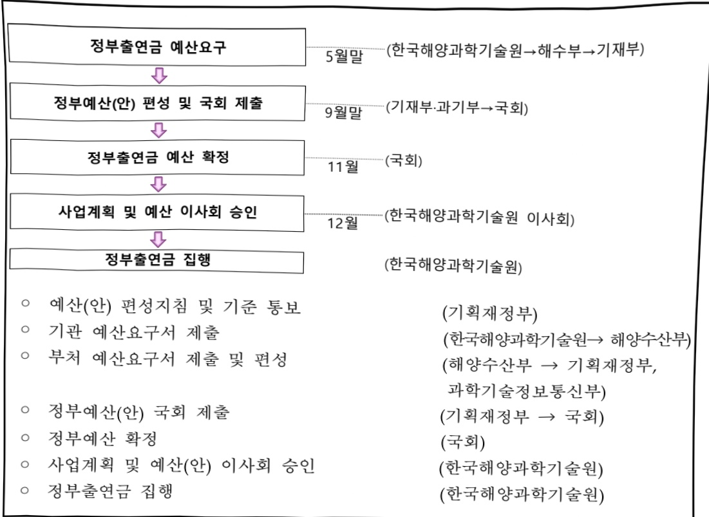

# 한국해양과학기술원운영지원(R&D)

**해당 페이지**: PDF 5100 ~ 5114 쪽 해당

**부처**: 해양수산부
**분야**: 과학기술
**회계유형**: 일반회계
**2026 확정예산**: 83164.0 백만원
**전년대비 증감률**: 6.5%
**AI 도메인**: R&D 지원

---

<table border=1 style='margin: auto; word-wrap: break-word;'><tr><td rowspan="2"></td><td colspan="5">2024</td><td colspan="7">2025（2025.12.11）</td><td rowspan="2">2026</td></tr><tr><td style='text-align: center; word-wrap: break-word;'>예산액(추정)</td><td style='text-align: center; word-wrap: break-word;'>예산현액</td><td style='text-align: center; word-wrap: break-word;'>집행액[실집행액]</td><td style='text-align: center; word-wrap: break-word;'>이월액</td><td style='text-align: center; word-wrap: break-word;'>불용액</td><td style='text-align: center; word-wrap: break-word;'>분예산</td><td style='text-align: center; word-wrap: break-word;'>예산현액</td><td style='text-align: center; word-wrap: break-word;'>집행액[실집행액]</td><td style='text-align: center; word-wrap: break-word;'>예산현액</td><td style='text-align: center; word-wrap: break-word;'>집행액[실집행액]</td><td style='text-align: center; word-wrap: break-word;'>이월액예산액</td><td style='text-align: center; word-wrap: break-word;'>불용액예산</td></tr><tr><td style='text-align: center; word-wrap: break-word;'>○기능별 분류(합계)</td><td style='text-align: center; word-wrap: break-word;'>70,082(70,082)</td><td style='text-align: center; word-wrap: break-word;'>70,082</td><td style='text-align: center; word-wrap: break-word;'>68,897(73,574)</td><td style='text-align: center; word-wrap: break-word;'>-</td><td style='text-align: center; word-wrap: break-word;'>1,185</td><td style='text-align: center; word-wrap: break-word;'>78,123</td><td style='text-align: center; word-wrap: break-word;'>77,623</td><td style='text-align: center; word-wrap: break-word;'>77,305(76,371)</td><td style='text-align: center; word-wrap: break-word;'>77,623</td><td style='text-align: center; word-wrap: break-word;'>77,305(73,746)</td><td style='text-align: center; word-wrap: break-word;'>-</td><td style='text-align: center; word-wrap: break-word;'>318</td><td style='text-align: center; word-wrap: break-word;'>83,164</td></tr><tr><td style='text-align: center; word-wrap: break-word;'>·기관운영비</td><td style='text-align: center; word-wrap: break-word;'>37,522(37,522)</td><td style='text-align: center; word-wrap: break-word;'>37,522</td><td style='text-align: center; word-wrap: break-word;'>36,337(36,754)</td><td style='text-align: center; word-wrap: break-word;'>-</td><td style='text-align: center; word-wrap: break-word;'>1,185</td><td style='text-align: center; word-wrap: break-word;'>39,080</td><td style='text-align: center; word-wrap: break-word;'>38,580</td><td style='text-align: center; word-wrap: break-word;'>38,262(38,262)</td><td style='text-align: center; word-wrap: break-word;'>38,580</td><td style='text-align: center; word-wrap: break-word;'>38,262(37,724)</td><td style='text-align: center; word-wrap: break-word;'>-</td><td style='text-align: center; word-wrap: break-word;'>318</td><td style='text-align: center; word-wrap: break-word;'>40,620</td></tr><tr><td style='text-align: center; word-wrap: break-word;'>·기본사업비</td><td style='text-align: center; word-wrap: break-word;'>32,560(32,560)</td><td style='text-align: center; word-wrap: break-word;'>32,560</td><td style='text-align: center; word-wrap: break-word;'>32,560(36,820)</td><td style='text-align: center; word-wrap: break-word;'>-</td><td style='text-align: center; word-wrap: break-word;'>-</td><td style='text-align: center; word-wrap: break-word;'>39,043</td><td style='text-align: center; word-wrap: break-word;'>39,043</td><td style='text-align: center; word-wrap: break-word;'>39,043(38,109)</td><td style='text-align: center; word-wrap: break-word;'>39,043</td><td style='text-align: center; word-wrap: break-word;'>39,043(36,022)</td><td style='text-align: center; word-wrap: break-word;'>-</td><td style='text-align: center; word-wrap: break-word;'>-</td><td style='text-align: center; word-wrap: break-word;'>42,544</td></tr><tr><td style='text-align: center; word-wrap: break-word;'>○비목별 분류(합계)</td><td style='text-align: center; word-wrap: break-word;'>70,082(70,082)</td><td style='text-align: center; word-wrap: break-word;'>70,082</td><td style='text-align: center; word-wrap: break-word;'>68,897(73,574)</td><td style='text-align: center; word-wrap: break-word;'>-</td><td style='text-align: center; word-wrap: break-word;'>1,185</td><td style='text-align: center; word-wrap: break-word;'>78,123</td><td style='text-align: center; word-wrap: break-word;'>77,623</td><td style='text-align: center; word-wrap: break-word;'>77,305(76,371)</td><td style='text-align: center; word-wrap: break-word;'>77,623</td><td style='text-align: center; word-wrap: break-word;'>77,305(73,746)</td><td style='text-align: center; word-wrap: break-word;'>-</td><td style='text-align: center; word-wrap: break-word;'>318</td><td style='text-align: center; word-wrap: break-word;'>83,164</td></tr><tr><td style='text-align: center; word-wrap: break-word;'>·연구개발인건비(360-01)</td><td style='text-align: center; word-wrap: break-word;'>33,577(33,577)</td><td style='text-align: center; word-wrap: break-word;'>33,577</td><td style='text-align: center; word-wrap: break-word;'>32,392(32,809)</td><td style='text-align: center; word-wrap: break-word;'>-</td><td style='text-align: center; word-wrap: break-word;'>1,185</td><td style='text-align: center; word-wrap: break-word;'>34,964</td><td style='text-align: center; word-wrap: break-word;'>34,464</td><td style='text-align: center; word-wrap: break-word;'>34,146(34,146)</td><td style='text-align: center; word-wrap: break-word;'>34,464</td><td style='text-align: center; word-wrap: break-word;'>34,146(33,608)</td><td style='text-align: center; word-wrap: break-word;'>-</td><td style='text-align: center; word-wrap: break-word;'>318</td><td style='text-align: center; word-wrap: break-word;'>36,501</td></tr><tr><td style='text-align: center; word-wrap: break-word;'>·연구개발장상경비(360-02)</td><td style='text-align: center; word-wrap: break-word;'>3,945(3,945)</td><td style='text-align: center; word-wrap: break-word;'>3,945</td><td style='text-align: center; word-wrap: break-word;'>3,945(3,945)</td><td style='text-align: center; word-wrap: break-word;'>-</td><td style='text-align: center; word-wrap: break-word;'>-</td><td style='text-align: center; word-wrap: break-word;'>4,116</td><td style='text-align: center; word-wrap: break-word;'>4,116</td><td style='text-align: center; word-wrap: break-word;'>4,116(4,116)</td><td style='text-align: center; word-wrap: break-word;'>4,116</td><td style='text-align: center; word-wrap: break-word;'>4,116(4,116)</td><td style='text-align: center; word-wrap: break-word;'>-</td><td style='text-align: center; word-wrap: break-word;'>-</td><td style='text-align: center; word-wrap: break-word;'>4,119</td></tr><tr><td style='text-align: center; word-wrap: break-word;'>·연구개발장비시스템구축비(360-04)</td><td style='text-align: center; word-wrap: break-word;'>2,419(2,419)</td><td style='text-align: center; word-wrap: break-word;'>2,419</td><td style='text-align: center; word-wrap: break-word;'>2,419(5,621)</td><td style='text-align: center; word-wrap: break-word;'>-</td><td style='text-align: center; word-wrap: break-word;'>-</td><td style='text-align: center; word-wrap: break-word;'>2,419</td><td style='text-align: center; word-wrap: break-word;'>2,419</td><td style='text-align: center; word-wrap: break-word;'>2,419(2,404)</td><td style='text-align: center; word-wrap: break-word;'>2,419</td><td style='text-align: center; word-wrap: break-word;'>2,419(2,404)</td><td style='text-align: center; word-wrap: break-word;'>-</td><td style='text-align: center; word-wrap: break-word;'>-</td><td style='text-align: center; word-wrap: break-word;'>2,419</td></tr><tr><td style='text-align: center; word-wrap: break-word;'>·연구개발활동비(360-05)</td><td style='text-align: center; word-wrap: break-word;'>30,141(30,141)</td><td style='text-align: center; word-wrap: break-word;'>30,141</td><td style='text-align: center; word-wrap: break-word;'>30,141(31,199)</td><td style='text-align: center; word-wrap: break-word;'>-</td><td style='text-align: center; word-wrap: break-word;'>-</td><td style='text-align: center; word-wrap: break-word;'>36,624</td><td style='text-align: center; word-wrap: break-word;'>36,624</td><td style='text-align: center; word-wrap: break-word;'>36,624(35,705)</td><td style='text-align: center; word-wrap: break-word;'>36,624</td><td style='text-align: center; word-wrap: break-word;'>36,624(33,618)</td><td style='text-align: center; word-wrap: break-word;'>-</td><td style='text-align: center; word-wrap: break-word;'>-</td><td style='text-align: center; word-wrap: break-word;'>40,125</td></tr><tr><td style='text-align: center; word-wrap: break-word;'>○기능비목별 분류(합계)</td><td style='text-align: center; word-wrap: break-word;'>70,082(70,082)</td><td style='text-align: center; word-wrap: break-word;'>70,082</td><td style='text-align: center; word-wrap: break-word;'>68,897(73,574)</td><td style='text-align: center; word-wrap: break-word;'>-</td><td style='text-align: center; word-wrap: break-word;'>1,185</td><td style='text-align: center; word-wrap: break-word;'>78,123</td><td style='text-align: center; word-wrap: break-word;'>77,623</td><td style='text-align: center; word-wrap: break-word;'>77,305(76,371)</td><td style='text-align: center; word-wrap: break-word;'>77,623</td><td style='text-align: center; word-wrap: break-word;'>77,305(73,746)</td><td style='text-align: center; word-wrap: break-word;'>-</td><td style='text-align: center; word-wrap: break-word;'>318</td><td style='text-align: center; word-wrap: break-word;'>83,164</td></tr><tr><td style='text-align: center; word-wrap: break-word;'>·기관운영비</td><td style='text-align: center; word-wrap: break-word;'>37,522(37,522)</td><td style='text-align: center; word-wrap: break-word;'>37,522</td><td style='text-align: center; word-wrap: break-word;'>36,337(36,754)</td><td style='text-align: center; word-wrap: break-word;'>-</td><td style='text-align: center; word-wrap: break-word;'>1,185</td><td style='text-align: center; word-wrap: break-word;'>39,080</td><td style='text-align: center; word-wrap: break-word;'>38,580</td><td style='text-align: center; word-wrap: break-word;'>38,262(38,262)</td><td style='text-align: center; word-wrap: break-word;'>38,580</td><td style='text-align: center; word-wrap: break-word;'>38,262(37,724)</td><td style='text-align: center; word-wrap: break-word;'>-</td><td style='text-align: center; word-wrap: break-word;'>318</td><td style='text-align: center; word-wrap: break-word;'>40,620</td></tr><tr><td style='text-align: center; word-wrap: break-word;'>·연구개발인건비(360-01)</td><td style='text-align: center; word-wrap: break-word;'>33,577(33,577)</td><td style='text-align: center; word-wrap: break-word;'>33,577</td><td style='text-align: center; word-wrap: break-word;'>32,392(32,809)</td><td style='text-align: center; word-wrap: break-word;'>-</td><td style='text-align: center; word-wrap: break-word;'>1,185</td><td style='text-align: center; word-wrap: break-word;'>34,964</td><td style='text-align: center; word-wrap: break-word;'>34,464</td><td style='text-align: center; word-wrap: break-word;'>34,146(34,146)</td><td style='text-align: center; word-wrap: break-word;'>34,464</td><td style='text-align: center; word-wrap: break-word;'>34,146(33,608)</td><td style='text-align: center; word-wrap: break-word;'>-</td><td style='text-align: center; word-wrap: break-word;'>318</td><td style='text-align: center; word-wrap: break-word;'>36,501</td></tr><tr><td style='text-align: center; word-wrap: break-word;'>·연구개발장상경비(360-02)</td><td style='text-align: center; word-wrap: break-word;'>3,945(3,945)</td><td style='text-align: center; word-wrap: break-word;'>3,945</td><td style='text-align: center; word-wrap: break-word;'>3,945(3,945)</td><td style='text-align: center; word-wrap: break-word;'>-</td><td style='text-align: center; word-wrap: break-word;'>-</td><td style='text-align: center; word-wrap: break-word;'>4,116</td><td style='text-align: center; word-wrap: break-word;'>4,116</td><td style='text-align: center; word-wrap: break-word;'>4,116(4,116)</td><td style='text-align: center; word-wrap: break-word;'>4,116</td><td style='text-align: center; word-wrap: break-word;'>4,116(4,116)</td><td style='text-align: center; word-wrap: break-word;'>-</td><td style='text-align: center; word-wrap: break-word;'>-</td><td style='text-align: center; word-wrap: break-word;'>4,119</td></tr><tr><td style='text-align: center; word-wrap: break-word;'>·기본사업비</td><td style='text-align: center; word-wrap: break-word;'>32,560(32,560)</td><td style='text-align: center; word-wrap: break-word;'>32,560</td><td style='text-align: center; word-wrap: break-word;'>32,560(36,820)</td><td style='text-align: center; word-wrap: break-word;'>-</td><td style='text-align: center; word-wrap: break-word;'>-</td><td style='text-align: center; word-wrap: break-word;'>39,043</td><td style='text-align: center; word-wrap: break-word;'>39,043</td><td style='text-align: center; word-wrap: break-word;'>39,043(38,109)</td><td style='text-align: center; word-wrap: break-word;'>39,043</td><td style='text-align: center; word-wrap: break-word;'>39,043(36,022)</td><td style='text-align: center; word-wrap: break-word;'>-</td><td style='text-align: center; word-wrap: break-word;'>-</td><td style='text-align: center; word-wrap: break-word;'>42,544</td></tr><tr><td style='text-align: center; word-wrap: break-word;'>·연구개발장비시스템구축비(360-04)</td><td style='text-align: center; word-wrap: break-word;'>2,419(2,419)</td><td style='text-align: center; word-wrap: break-word;'>2,419</td><td style='text-align: center; word-wrap: break-word;'>2,419(5,621)</td><td style='text-align: center; word-wrap: break-word;'>-</td><td style='text-align: center; word-wrap: break-word;'>-</td><td style='text-align: center; word-wrap: break-word;'>2,419</td><td style='text-align: center; word-wrap: break-word;'>2,419</td><td style='text-align: center; word-wrap: break-word;'>2,419(2,404)</td><td style='text-align: center; word-wrap: break-word;'>2,419</td><td style='text-align: center; word-wrap: break-word;'>2,419(2,404)</td><td style='text-align: center; word-wrap: break-word;'>-</td><td style='text-align: center; word-wrap: break-word;'>-</td><td style='text-align: center; word-wrap: break-word;'>2,419</td></tr><tr><td style='text-align: center; word-wrap: break-word;'>·연구개발활동비 등(360-05)</td><td style='text-align: center; word-wrap: break-word;'>30,141(30,141)</td><td style='text-align: center; word-wrap: break-word;'>30,141</td><td style='text-align: center; word-wrap: break-word;'>30,141(31,199)</td><td style='text-align: center; word-wrap: break-word;'>-</td><td style='text-align: center; word-wrap: break-word;'>-</td><td style='text-align: center; word-wrap: break-word;'>36,624</td><td style='text-align: center; word-wrap: break-word;'>36,624</td><td style='text-align: center; word-wrap: break-word;'>36,624(35,705)</td><td style='text-align: center; word-wrap: break-word;'>36,624</td><td style='text-align: center; word-wrap: break-word;'>36,624(33,618)</td><td style='text-align: center; word-wrap: break-word;'>-</td><td style='text-align: center; word-wrap: break-word;'>-</td><td style='text-align: center; word-wrap: break-word;'>40,125</td></tr></table>

(단위: 백만원)

□ 기능별(대역사업별), 목별 예산 내역

<table border=1 style='margin: auto; word-wrap: break-word;'><tr><td rowspan="2">사업명</td><td rowspan="2">2024년 결산</td><td colspan="2">2025년 예산</td><td colspan="2">2026년</td><td rowspan="2">증감(B-A)</td><td rowspan="2">(B-A)/A</td></tr><tr><td style='text-align: center; word-wrap: break-word;'>본예산(A)</td><td style='text-align: center; word-wrap: break-word;'>추경</td><td style='text-align: center; word-wrap: break-word;'>정부안</td><td style='text-align: center; word-wrap: break-word;'>확정(B)</td></tr><tr><td style='text-align: center; word-wrap: break-word;'>한국해양과학기술원 운영지원(R&amp;D)</td><td style='text-align: center; word-wrap: break-word;'>68,897</td><td style='text-align: center; word-wrap: break-word;'>78,123</td><td style='text-align: center; word-wrap: break-word;'>78,123</td><td style='text-align: center; word-wrap: break-word;'>82,314</td><td style='text-align: center; word-wrap: break-word;'>83,164</td><td style='text-align: center; word-wrap: break-word;'>5,041</td><td style='text-align: center; word-wrap: break-word;'>6.5</td></tr></table>

(단하: 빠끔, %)

---

### 나. 사업설명자료

## 1 ) 사업목적·내용

- (한국해양과학기술원 운영지원(R&D)) 국내 유일의 종합해양연구기관으로서 해양과학기술의 연구개발을 통한 관할해역의 과학적 관리기반 구축, 해양자원의 개발·이용 및 해양환경 보전과 해양안전 확보 능력을 축적하고 그 성과를 보급하기 위한 안정적 기관 운영 추구

- (기관운영비) 동 사업은 기관 고유임무 수행을 위한 연구·지원인력 인건비와 일반 운영비, 시설유지관리비 등 기관운영에 소요되는 경상경비를 지원

- (기본사업비) 동 사업은 기관고유 역할과 책임(R&R) 수행에 필수적인 해양과기원 5대 전략목표의 안정적 수행을 위한 해양기후·환경변화 대응, 해양전략자원 개발, 첨단해양공학기술 창출, 해양영토관리, 해양정책 분야의 연구사업 수행과 글로벌 해양과학기술의 주도권 선점을 위한 사업 추진, 해양관련 국가 현안문제 해결 지원, 연구인프라의 안정적인 운영을 지원하며, 국민이 체감할 수 있는 성과 창출을 위해 원천기술 연구(R&D)에서 나아가 솔루션 제공형 연구개발(R&SD) 패러다임 도입에 필요한 기관전략 연구사업 수행 지원

· (해양기후변화 진단·예측 역량 및 해양환경·생태계 변화 대응 기반 강화) 기후변화와 해양환경 위기에 따른 한반도 주변 변화 선제적 대응 및 해양 생태계 변동성 예측 역량 강화

·(해양바이오·전략광물자원 개발 및 미개척 대양 신자원 탐사) 해양생명자원 탐색을 통한 유용소재 발굴과 의약, 식품산업 원천소재 개발 및 인도양 중앙해령 열수분출구 /태평양 해저산 생물자원 확보

·(해양공학 핵심기술 및 첨단장비 개발) 일자리 창출, 기후변화 대응 및 신성장 동력 개발을 위한 해양에너지 및 항만해양구조물 분야 신산업 창출

·(해양력 향상 및 해양 재난·재해 대응기술 개발) 해양상황 인식기술 개발 및 해양 재난·재해 기술 개발을 통한 해양영토 관리 및 해양안전에 기여

(해양분야 법·정책 대응력 강화) 해양수산부문 기후변화 관련 국제규범 연구, 국제

규범의 국내이행 및 적용방안 모색, 지역주도형 정책·전략 수립

(연구인프라 운영사업) 연구조사선(이사부호, 온누리호 등), 국내 및 해외 연구거점, 국제네트워크 인프라 등 종합적 연구기반 인프라 운영

(미래선도사업) 창의적·도전적·융복합 연구과제 기획·육성 및 국가·사회적 문제해결형

해양과학기술 수요 발굴 및 예측

---

(장비·시스템구축비) 국내 유일의 해양 분야 종합연구기관으로서 국책연구사업 수행 및 기관의 고유사업 수행에 필요한 연구장비 및 기반 시스템 구축

(해양 마이크로 도플러 기술 기반 AI 수중 감시 시스템 개발) 해양 이동체(무단 침입체, 멸종 위기 해양 동물 등)의 감시를 위한 AI 기반 수중 원거리 표적 탐지·식별·추적 기술 개발

(해양생물 기반 슬기세포 조절 소재 국산화 및 산업화 생태계 구축) 해양생물 유래

안전한 천연 소재를 기반으로 줄기세포와 오가노이드를 정밀 조정하는 핵심 바이오

제품을 국산화하여 수입을 대체하고, 이를 산업화하여 수출형 글로벌 제품을 개발

## 2 ) 사업개요

## □ 사업근거 및 추진경위

① 법령상 근거 및 조항 적시 : 「한국해양과학기술원법」 제10조(출연금) ① 국가 · 지방자치단체 또는 「공공기관의 운영에 관한 법률」 제4조에 따른 공공기관은 해양과기원의 설립 · 건설 · 연구 · 운영 및 해양분야 우수 전문인력 양성에 소요되는 경비에 충당하게 하기 위하여 해양과기원에 출연금(出掲金)을 지급할 수 있다.

② 추진경위

- 1990. 6. 1 재단법인 한국해양연구소 설립(KIST로부터 분리·독립)

-1997.3.28 남해분원 설치(경남 거제시)

- 1999. 5. 1 대덕분원(해양시스템안전연구소) 설치(대전 유성구)

- 2001. 1. 1 한국해양연구원으로 명칭 변경

- 2004. 4. 16 부설 극지연구소 설치

-2008.6.20 동해분원 설치(경북 울진군)

- 2012. 7. 1 한국해양과학기술원 설립

- 2014. 1. 1 부설 선박해양플랜트연구소 설치

---

## □ 주요내용

① 사업규모

- 총사업비 : 해당없음

- 사업기간 : '91년 ~ 계속

- 최근 5년 간 투입된 사업비

<table border=1 style='margin: auto; word-wrap: break-word;'><tr><td style='text-align: center; word-wrap: break-word;'>$ \underline{\text{笹}} $</td><td style='text-align: center; word-wrap: break-word;'>2022</td><td style='text-align: center; word-wrap: break-word;'>2023</td><td style='text-align: center; word-wrap: break-word;'>2024</td><td style='text-align: center; word-wrap: break-word;'>2025</td><td style='text-align: center; word-wrap: break-word;'>2026</td></tr><tr><td style='text-align: center; word-wrap: break-word;'>$ \underline{\text{사업비}} $</td><td style='text-align: center; word-wrap: break-word;'>85,510</td><td style='text-align: center; word-wrap: break-word;'>82,989</td><td style='text-align: center; word-wrap: break-word;'>70,082</td><td style='text-align: center; word-wrap: break-word;'>78,123</td><td style='text-align: center; word-wrap: break-word;'>83,164</td></tr></table>

## ② 사업추진체계

- 사업시행방법 : 출연

- 사업시행주체 : 한국해양과학기술원

- 사업 수혜자 : 산업계, 학계, 연구계, 공공부문 등 국가 모든 분야

- 보조, 융자, 출연, 출자 등의 경우 보조·융자 등 지원 비율 및 법적근거

<table border=1 style='margin: auto; word-wrap: break-word;'><tr><td style='text-align: center; word-wrap: break-word;'>내역사업명</td><td style='text-align: center; word-wrap: break-word;'>구분</td><td style='text-align: center; word-wrap: break-word;'>피보조피출연 등기관명</td><td style='text-align: center; word-wrap: break-word;'>지원 금액(2026예산)</td><td style='text-align: center; word-wrap: break-word;'>지원 비율(%)</td><td style='text-align: center; word-wrap: break-word;'>보조율 법적근거 (해당 조항)</td></tr><tr><td style='text-align: center; word-wrap: break-word;'>기관운영비</td><td style='text-align: center; word-wrap: break-word;'>출연</td><td style='text-align: center; word-wrap: break-word;'>한국해양과학기술원</td><td style='text-align: center; word-wrap: break-word;'>40,620</td><td style='text-align: center; word-wrap: break-word;'>100</td><td style='text-align: center; word-wrap: break-word;'>「한국해양과학기술원법」제10조(출연금)</td></tr><tr><td style='text-align: center; word-wrap: break-word;'>기본사업비</td><td style='text-align: center; word-wrap: break-word;'>출연</td><td style='text-align: center; word-wrap: break-word;'>한국해양과학기술원</td><td style='text-align: center; word-wrap: break-word;'>42,544</td><td style='text-align: center; word-wrap: break-word;'>100</td><td style='text-align: center; word-wrap: break-word;'>「한국해양과학기술원법」제10조(출연금)</td></tr></table>

## 3 ) 2026년도 예산 산출 근거

① 기관운영비 : (2025) 39,080 → (2026) 40,620백만원, +3.9%

○ 인건비 : (2025) 34,964 → (2026) 36,501 백만원, +4.4%

- '25년 신규인력(7명) 미반영 6개월분 인건비 = 140백만원

- '26년 신규인력(7명) 6개월분 인건비 = 168백만원

- 처우개선분 3.5% = 1,229백만원

<table border=1 style='margin: auto; word-wrap: break-word;'><tr><td style='text-align: center; word-wrap: break-word;'>산출 내역</td><td style='text-align: center; word-wrap: break-word;'>금액(백만원)</td></tr><tr><td style='text-align: center; word-wrap: break-word;'>- 인건비</td><td style='text-align: center; word-wrap: break-word;'>36,501</td></tr><tr><td style='text-align: center; word-wrap: break-word;'>- &#x27;25년 기존 인건비</td><td style='text-align: center; word-wrap: break-word;'>34,964</td></tr><tr><td style='text-align: center; word-wrap: break-word;'>- &#x27;25년 신규인력(7명) 미반영 6개월분 인건비</td><td style='text-align: center; word-wrap: break-word;'>140</td></tr><tr><td style='text-align: center; word-wrap: break-word;'>- &#x27;26년 신규인력(7명) 6개월분 인건비</td><td style='text-align: center; word-wrap: break-word;'>168</td></tr><tr><td style='text-align: center; word-wrap: break-word;'>- 처우개선분 3.5%</td><td style='text-align: center; word-wrap: break-word;'>1,229</td></tr></table>

---

☐ 경상경비 : (2025) 4,116 → (2026) 4,119백만원, +0.1%

-경상비 효율화 = △81백만원

-해양환경 모사 제어 시설 완공에 따른 취득세 = 84백만원

<table border=1 style='margin: auto; word-wrap: break-word;'><tr><td style='text-align: center; word-wrap: break-word;'>산출내역</td><td style='text-align: center; word-wrap: break-word;'>금액(백만원)</td></tr><tr><td style='text-align: center; word-wrap: break-word;'>· 경상경비</td><td style='text-align: center; word-wrap: break-word;'>4,119</td></tr><tr><td style='text-align: center; word-wrap: break-word;'>- &#x27;25년 기존 경상경비</td><td style='text-align: center; word-wrap: break-word;'>4,116</td></tr><tr><td style='text-align: center; word-wrap: break-word;'>- 경상비 효율화</td><td style='text-align: center; word-wrap: break-word;'>△81</td></tr><tr><td style='text-align: center; word-wrap: break-word;'>- 해양환경 모사 제어 시설 완공에 따른 취득세
* 과세표준 5,279백만원 x 세율 3.16% x 감면율 50% = 84백만원</td><td style='text-align: center; word-wrap: break-word;'>84</td></tr></table>

② 기본사업비 : (2025) 39,043 → (2026) 42,544 백만원, +9.0%

- 9개 과제 × 4,727백만원 × 12/12개월 = 42,544백만원

<table border=1 style='margin: auto; word-wrap: break-word;'><tr><td style='text-align: center; word-wrap: break-word;'>산출 내역</td><td style='text-align: center; word-wrap: break-word;'>금액(백만원)</td></tr><tr><td style='text-align: center; word-wrap: break-word;'>· 기본사업비</td><td style='text-align: center; word-wrap: break-word;'>42,544</td></tr><tr><td style='text-align: center; word-wrap: break-word;'>· 해양기후변화 진단·예측 역량 및 해양환경·생태계 변화 대응 기반 강화</td><td style='text-align: center; word-wrap: break-word;'>5,258(△1,682)</td></tr><tr><td style='text-align: center; word-wrap: break-word;'>· 예산효율화→(구조 효율화) 3개 세부과제 통합 및 구조조정(△244)→(지출 효율화) 3개 세부과제 구조조정(△1,263)→(자체재원 대체투자) 1개 세부과제 자체재원(적립금 등) 대체투자(△1,249)</td><td style='text-align: center; word-wrap: break-word;'>(△2,756)</td></tr><tr><td style='text-align: center; word-wrap: break-word;'>· 신규 해양대형동물의 플라스틱 노출, 행동반응, 영향 연구 : 바다거북과 바닷새 중심</td><td style='text-align: center; word-wrap: break-word;'>(1,074)</td></tr><tr><td style='text-align: center; word-wrap: break-word;'>· 해양바이오·전략광물자원 개발 및 미개척 대양 신자원 탐사</td><td style='text-align: center; word-wrap: break-word;'>1,800(△2,808)</td></tr><tr><td style='text-align: center; word-wrap: break-word;'>· 예산효율화→(지출 효율화) 5개 세부과제 구조조정(△346)→(재투자) 1개 세부과제 ISD 과제 흡수 추진(△838)→(자체재원 대체투자) 2개 세부과제 자체재원(적립금 등) 대체투자(△1,624)</td><td style='text-align: center; word-wrap: break-word;'>(△2,808)</td></tr><tr><td style='text-align: center; word-wrap: break-word;'>· 해양공학 핵심기술 및 첨단장비 개발</td><td style='text-align: center; word-wrap: break-word;'>- (△531)</td></tr><tr><td style='text-align: center; word-wrap: break-word;'>· 예산효율화→(재투자) 1개 세부과제 ISD 과제 흡수 추진(△531)</td><td style='text-align: center; word-wrap: break-word;'>(△531)</td></tr><tr><td style='text-align: center; word-wrap: break-word;'>· 해양력 향상 및 해양 재난·재해 대응기술 개발</td><td style='text-align: center; word-wrap: break-word;'>2,191(△610)</td></tr><tr><td style='text-align: center; word-wrap: break-word;'>· 예산효율화→(지출 효율화) 3개 세부과제 구조조정(△243)→(자체재원 대체투자) 1개 세부과제 자체재원(적립금 등) 대체투자(△367)</td><td style='text-align: center; word-wrap: break-word;'>(△610)</td></tr><tr><td style='text-align: center; word-wrap: break-word;'>· 해양분야 법·정책 대응력 강화</td><td style='text-align: center; word-wrap: break-word;'>261(△29)</td></tr><tr><td style='text-align: center; word-wrap: break-word;'>· 예산효율화→(지출 효율화) 1개 세부과제 구조조정(△29)</td><td style='text-align: center; word-wrap: break-word;'>(△29)</td></tr><tr><td style='text-align: center; word-wrap: break-word;'>· 연구인프라 운영사업</td><td style='text-align: center; word-wrap: break-word;'>20,756</td></tr><tr><td style='text-align: center; word-wrap: break-word;'>· 미래선도사업</td><td style='text-align: center; word-wrap: break-word;'>1,098</td></tr><tr><td style='text-align: center; word-wrap: break-word;'>· 증액국가사회적 해양과학기술 수요 예측 및 대응 연구(+400)→서해연구소 설립 시범사업 운영비 반영</td><td style='text-align: center; word-wrap: break-word;'>(+400)</td></tr><tr><td style='text-align: center; word-wrap: break-word;'>· 장비·시스템구축비</td><td style='text-align: center; word-wrap: break-word;'>2,419</td></tr><tr><td style='text-align: center; word-wrap: break-word;'>· 신규(ISD) 해양 마이크로 도플러 기술 기반 AI 수중 감시 시스템 개발</td><td style='text-align: center; word-wrap: break-word;'>4,006</td></tr><tr><td rowspan="3">· 신규(ISD) 해양생물 기반 줄기세포 조절 소재 국산화 및 산업화 생태계 구축</td><td style='text-align: center; word-wrap: break-word;'>(+4,006)</td></tr><tr><td style='text-align: center; word-wrap: break-word;'>4,755</td></tr><tr><td style='text-align: center; word-wrap: break-word;'>(+4,755)</td></tr></table>

---

°2025년도 예산 및 2026년도 예산 산출 세부내역 비교

<table border=1 style='margin: auto; word-wrap: break-word;'><tr><td colspan="2">2025년 본예산</td><td colspan="2">2026년 예산</td></tr><tr><td style='text-align: center; word-wrap: break-word;'>예산</td><td style='text-align: center; word-wrap: break-word;'>산출내역</td><td style='text-align: center; word-wrap: break-word;'>예산</td><td style='text-align: center; word-wrap: break-word;'>산출내역</td></tr><tr><td rowspan="6">78,123</td><td style='text-align: center; word-wrap: break-word;'>○ 연구개발인건비(360-01): 34,964백만원가. 기존인력 인건비(34,584백만원)· 안정적 기관운영을 위한 연구인력·지원인력 인건비: 732명 × 47백만원 × 12개월 = 34,584백만원* 인건비 처우개선분(3%) 1,007백만원 반영</td><td rowspan="6">83,164</td><td rowspan="6">○ 연구개발인건비(360-01): 36,501백만원가. 기존인력 인건비(36,193백만원)· 안정적 기관운영을 위한 연구인력·지원인력 인건비: 744명 × 49백만원 × 12개월 = 36,193백만원* 인건비 처우개선분(3.5%) 1,229백만원 반영</td></tr><tr><td style='text-align: center; word-wrap: break-word;'>나. 신규인력 인건비(380백만원)· &#x27;24년 신규인력(2명) 미반영 인건비: 2명 × 40백만원 × 6개월 = 40백만원· &#x27;24년 상반기 수시증원(5명) 인건비: 5명 × 40백만원 × 12개월 = 200백만원· &#x27;25년 신규인력(7명) 인건비: 7명 × 40백만원 × 6개월 = 140백만원</td></tr><tr><td style='text-align: center; word-wrap: break-word;'>○ 연구개발경상경비(360-02): 4,116백만원가. 경상경비(4,116백만원)· 안정적인 기관운영을 위한 경상경비: 1개 × 4,116백만원 × 100% × 12개월 = 4,116백만원</td></tr><tr><td style='text-align: center; word-wrap: break-word;'>○ 연구개발장비·시스템구축비(360-04): 2,419백만원가. 장비·시스템구축비(2,419백만원)· 연구사업 수행을 위한 장비·시스템 구축: 20개 × 121백만원 × 100% × 12개월 = 2,419백만원</td></tr><tr><td style='text-align: center; word-wrap: break-word;'>○ 연구개발활동비 등(360-05): 36,624백만원가. 해양기후변화 진단·예측 역량 및 해양환경·생태계 변화 대응기반 강화(6,940백만원)· 해양변화 모니터링을 통한 기후변화 및 해양환경 변동특성 진단(2,829백만원)· 1개 × 2,829백만원 × 100% × 12개월 = 2,829백만원· 해양변화 예측역량 강화와 해양기후변화 전망(298백만원)· 1개 × 298백만원 × 100% × 12개월 = 298백만원· 해양환경 현안대응 기술개발(3,813백만원)· 4개 × 953백만원 × 100% × 12개월 = 3,813백만원* 샌라반도해역 탄소저장 평가기술 개발(1,000백만원)나. 해양바이오·전략광물자원 개발 및 미개척 대양 신자원 탐사(4,608백만원)· 해양생물 유전자원 활용기술 개발(4,205백만원)· 5개 × 841백만원 × 100% × 12개월 = 4,205백만원· 샐탄소중립 LOHC기반 청정바이오수소 생산기술 개발(1,000백만원)· 대양·극한지 탐사 및 물질/생물 신자원 발굴(403백만원)· 1개 × 403백만원 × 100% × 12개월 = 403백만원</td></tr><tr><td style='text-align: center; word-wrap: break-word;'>다. 해양공학 핵심기술 및 첨단장비 개발(531백만원)· 해양에너지 및 향만·해양구조물 기술 개발(531백만원)· 1개 × 531백만원 × 100% × 12개월 = 531백만원* 자체구조조정(△423백만원)</td></tr></table>

---

<table border=1 style='margin: auto; word-wrap: break-word;'><tr><td colspan="2">2025년 분예산</td><td colspan="2">2026년 예산</td></tr><tr><td style='text-align: center; word-wrap: break-word;'>예산</td><td style='text-align: center; word-wrap: break-word;'>산출내역</td><td style='text-align: center; word-wrap: break-word;'>예산</td><td style='text-align: center; word-wrap: break-word;'>산출내역</td></tr><tr><td rowspan="2"></td><td rowspan="2">라. 해양력 향상 및 해양 재난·재해 대응기술 개발(2,801백만원)
• 접경해역 중합 해양정보 확보 및 활용기술 개발(2,000백만원)
: 1개 x 2,000백만원 x 100% x 12개월 = 2,000백만원
* 샌규서해 NLL 연구공백 대응 해양과학조사 및 활용 기술 개발(2,000백만원)
• 해양 재난·재해 피해저감을 위한 예측기술 개발(432백만원)
: 1개 x 432백만원 x 100% x 12개월 = 432백만원
• 해양력 향상을 위한 해양 상황 인식 기술 개발(369백만원)
: 1개 x 369백만원 x 100% x 12개월 = 369백만원
마. 해양분야 법·정책 대응력 강화(290백만원)
• 해양과학기술 국가전략분야 정책지원 강화(290백만원)
: 1개 x 290백만원 x 100% x 12개월 = 290백만원
바. 연구인프라운영사업(20,756백만원)
• 연구인프라운영사업(20,756백만원)
: 17개 x 1,221백만원 x 100% x 12개월 = 20,756백만원
* 선규스마트복합해양배양센터 운영(627백만원)
* 선규해양연구 핵심 인프라(KOFLA) 운영(800백만원)
* 선규해양과학 데이터 오픈 플랫폼「MIDAS」 운영(500백만원)
* 홍옥해양법적 갈등현안 해결 및 해양경제영역 확장을 위한 국제 네트워크 인프라 구축(1,855백만원, +500백만원)
* 홍옥해양연구선 운영(2,872백만원, +479백만원)
사. 미래선도사업(698백만원)
• 미래선도사업(698백만원)
: 2개 x 349백만원 x 100% x 12개월 = 698백만원</td><td style='text-align: center; word-wrap: break-word;'>예산</td><td style='text-align: center; word-wrap: break-word;'>산출내역</td></tr><tr><td style='text-align: center; word-wrap: break-word;'>다. 해양공학 핵심기술 및 첨단장비 개발(-백만원)
• 해양에너지 및 향안·해양구조물 기술 개발(-백만원)
: 0개 x -백만원 x 100% x 12개월 = -백만원
* (재투자) 1개 세부과제 ISD 과제 흡수 추진(△531백만원)
라. 해양력 향상 및 해양 재난·재해 대응기술 개발(2,191백만원)
• 접경해역 중합 해양정보 확보 및 활용기술 개발(1,848백만원)
: 1개 x 1,848백만원 x 100% x 12개월 = 1,848백만원
* (지출 효율화) 1개 세부과제 구조조정(△152백만원)
• 해양 재난·재해 피해저감을 위한 예측기술 개발(-백만원)
: 0개 x -백만원 x 100% x 12개월 = -백만원
* (지출 효율화) 1개 세부과제 구조조정(△65백만원)
* (자체재원 대체투자) 1개 세부과제 자체재원(적립금 등)
대체투자(△367백만원)
• 해양력 향상을 위한 해양 상황 인식 기술 개발(343백만원)
: 1개 x 343백만원 x 100% x 12개월 = 343백만원
* (지출 효율화) 1개 세부과제 구조조정(△26백만원)
마. 해양분야 법·정책 대응력 강화(261백만원)
• 해양과학기술 국가전략분야 정책지원 강화(261백만원)
: 1개 x 261백만원 x 100% x 12개월 = 261백만원
* (지출 효율화) 1개 세부과제 구조조정(△29백만원)
바. 연구인프라운영사업(20,756백만원)
• 연구인프라운영사업(20,756백만원)
: 17개 x 1,221백만원 x 100% x 12개월 = 20,756백만원
사. 미래선도사업(1,098백만원)
• 미래선도사업(1,098백만원)
: 2개 x 549백만원 x 100% x 12개월 = 1,098백만원
* 홍옥국가사회적 해양과학기술 수요 예측 및 대응 연구
(+400백만원)
야. 샐귀(ISD) 해양 마이크로 도플러 기술 기반 AI 수중 감시 시스템 개발(4,006백만원)
• 수중 마이크로 도플러 신호처리 시스템 개발(1,956백만원)
: 1개 x 1,956백만원 x 100% x 12개월 = 1,956백만원
• 원거리 이동체 고해상도 식별 기술 개발(1,490백만원)
: 1개 x 1,490백만원 x 100% x 12개월 = 1,490백만원
• AI 기반 추적·관찰 기술 고도화(560백만원)
: 1개 x 560백만원 x 100% x 12개월 = 560백만원
자. 샐귀(ISD) 해양생물 기반 줄기세포 조절 소재 국산화 및 산업화 생태계 구축(4,755백만원)
• 해양생물 기반 줄기세포 및 오가노이드 조절 소재 개발 (2,400백만원)
: 2개 x 1,200백만원 x 100% x 12개월 = 2,400백만원
• 줄기세포 조절 해양 소재 기반 산업화 제품 개발(2,355백만원)
: 2개 x 1,178백만원 x 100% x 12개월 = 2,355백만원</td><td style='text-align: center; word-wrap: break-word;'></td></tr></table>

---

## 4 ) 사업효과

□ 사업영향, 산출물 성과지표 등

①2022~2026년도 성과계획서 상 성과지표 및 최근 5년간 성과 달성도

<table border=1 style='margin: auto; word-wrap: break-word;'><tr><td style='text-align: center; word-wrap: break-word;'>성과지표</td><td style='text-align: center; word-wrap: break-word;'>구분</td><td style='text-align: center; word-wrap: break-word;'>2022</td><td style='text-align: center; word-wrap: break-word;'>2023</td><td style='text-align: center; word-wrap: break-word;'>2024</td><td style='text-align: center; word-wrap: break-word;'>2025</td><td style='text-align: center; word-wrap: break-word;'>2026</td><td style='text-align: center; word-wrap: break-word;'>2026 목표치산출근거</td><td style='text-align: center; word-wrap: break-word;'>측정산식(또는 측정방법)</td><td style='text-align: center; word-wrap: break-word;'>자료수집방법(또는 자료출처)</td></tr><tr><td rowspan="3">논문의 질적 우수성 (단위: 편)</td><td style='text-align: center; word-wrap: break-word;'>목표</td><td style='text-align: center; word-wrap: break-word;'>35</td><td style='text-align: center; word-wrap: break-word;'>36</td><td style='text-align: center; word-wrap: break-word;'>31*</td><td style='text-align: center; word-wrap: break-word;'>35</td><td style='text-align: center; word-wrap: break-word;'>-</td><td rowspan="3">최근 3년 실적 평균에 가중치 3% 적용</td><td rowspan="3">게재논문의 mrnIF값 90 이상 논문 편수</td><td rowspan="3">JCR DB 조회</td></tr><tr><td style='text-align: center; word-wrap: break-word;'>실적</td><td style='text-align: center; word-wrap: break-word;'>35</td><td style='text-align: center; word-wrap: break-word;'>36</td><td style='text-align: center; word-wrap: break-word;'>32</td><td style='text-align: center; word-wrap: break-word;'>-</td><td style='text-align: center; word-wrap: break-word;'>-</td></tr><tr><td style='text-align: center; word-wrap: break-word;'>달성도</td><td style='text-align: center; word-wrap: break-word;'>100</td><td style='text-align: center; word-wrap: break-word;'>100</td><td style='text-align: center; word-wrap: break-word;'>103</td><td style='text-align: center; word-wrap: break-word;'>-</td><td style='text-align: center; word-wrap: break-word;'>-</td></tr><tr><td rowspan="3">특허 활용률 (단위: %)</td><td style='text-align: center; word-wrap: break-word;'>목표</td><td style='text-align: center; word-wrap: break-word;'>35</td><td style='text-align: center; word-wrap: break-word;'>36</td><td style='text-align: center; word-wrap: break-word;'>38</td><td style='text-align: center; word-wrap: break-word;'>38</td><td style='text-align: center; word-wrap: break-word;'>-</td><td rowspan="3">최근 3년 활용률 평균에 가중치 3% 적용</td><td rowspan="3">보유특허 건수 대비 활용특허* 건수 비율 *실시, 양도, 출자 등</td><td rowspan="3">특허청 DB 조회</td></tr><tr><td style='text-align: center; word-wrap: break-word;'>실적</td><td style='text-align: center; word-wrap: break-word;'>36</td><td style='text-align: center; word-wrap: break-word;'>38</td><td style='text-align: center; word-wrap: break-word;'>39</td><td style='text-align: center; word-wrap: break-word;'>-</td><td style='text-align: center; word-wrap: break-word;'>-</td></tr><tr><td style='text-align: center; word-wrap: break-word;'>달성도</td><td style='text-align: center; word-wrap: break-word;'>103</td><td style='text-align: center; word-wrap: break-word;'>106</td><td style='text-align: center; word-wrap: break-word;'>103</td><td style='text-align: center; word-wrap: break-word;'>-</td><td style='text-align: center; word-wrap: break-word;'>-</td></tr><tr><td rowspan="3">기술사업화 건수 (단위: 건)</td><td style='text-align: center; word-wrap: break-word;'>목표</td><td style='text-align: center; word-wrap: break-word;'>26</td><td style='text-align: center; word-wrap: break-word;'>27</td><td style='text-align: center; word-wrap: break-word;'>23</td><td style='text-align: center; word-wrap: break-word;'>23</td><td style='text-align: center; word-wrap: break-word;'>-</td><td rowspan="3">최근 3년 실적 평균에 가중치 3% 적용</td><td rowspan="3">기업으로의 기술이전·매각·양도 건수</td><td rowspan="3">자체 조사</td></tr><tr><td style='text-align: center; word-wrap: break-word;'>실적</td><td style='text-align: center; word-wrap: break-word;'>19</td><td style='text-align: center; word-wrap: break-word;'>22</td><td style='text-align: center; word-wrap: break-word;'>28</td><td style='text-align: center; word-wrap: break-word;'>-</td><td style='text-align: center; word-wrap: break-word;'>-</td></tr><tr><td style='text-align: center; word-wrap: break-word;'>달성도</td><td style='text-align: center; word-wrap: break-word;'>73</td><td style='text-align: center; word-wrap: break-word;'>81</td><td style='text-align: center; word-wrap: break-word;'>122</td><td style='text-align: center; word-wrap: break-word;'>-</td><td style='text-align: center; word-wrap: break-word;'>-</td></tr><tr><td rowspan="3">연구성과의 국가·사회적 영향 (단위: 건)</td><td style='text-align: center; word-wrap: break-word;'>목표</td><td style='text-align: center; word-wrap: break-word;'>4</td><td style='text-align: center; word-wrap: break-word;'>4</td><td style='text-align: center; word-wrap: break-word;'>5</td><td style='text-align: center; word-wrap: break-word;'>5</td><td style='text-align: center; word-wrap: break-word;'>-</td><td rowspan="3">제안 법령 제·개정, 정부훈령, 정부 간 협상 건수 등</td><td rowspan="3">제안 법령 제·개정, 정부훈령, 정부 간 협상 건수</td><td rowspan="3">자체 조사</td></tr><tr><td style='text-align: center; word-wrap: break-word;'>실적</td><td style='text-align: center; word-wrap: break-word;'>8</td><td style='text-align: center; word-wrap: break-word;'>6</td><td style='text-align: center; word-wrap: break-word;'>8</td><td style='text-align: center; word-wrap: break-word;'>-</td><td style='text-align: center; word-wrap: break-word;'>-</td></tr><tr><td style='text-align: center; word-wrap: break-word;'>달성도</td><td style='text-align: center; word-wrap: break-word;'>200</td><td style='text-align: center; word-wrap: break-word;'>150</td><td style='text-align: center; word-wrap: break-word;'>160</td><td style='text-align: center; word-wrap: break-word;'>-</td><td style='text-align: center; word-wrap: break-word;'>-</td></tr></table>

* 정부 R&D예산 지출효율화에 따른 '24년 기본사업비 예산 감액(전년대비 13% 감소) 반영하여 '24년 목표 하향 조정

② 성과지표 이외의 연도별 사업추진 경과 및 실적

<table border=1 style='margin: auto; word-wrap: break-word;'><tr><td style='text-align: center; word-wrap: break-word;'>2022</td><td style='text-align: center; word-wrap: break-word;'>- 북서태평양 순환과 기후 변동성이 한반도 주변해역 변화와 물질순환에 미치는 영향
· 한반도 아열대화 진행 요인과 해양 순환 변동 이해
· 한반도 주변 해양 모델링을 통한 거시적 해류 순환 과정 이해
· 후쿠시마 원전 영향을 분석하는 해류 순환 모델 제공
- 생지화학 순환 및 해양환경변동 연구
· 한반도 동해/남해 장기적 해양환경변동 해석 정보 지원
· 해양 방사능 사고 대응 관측 해류 모델 고도화로 유효 정보 제공
· 후쿠시마 방사능 오염수 방출에 따른 감시 장비 체계 지원
· 인도·태평양 전지구적 체계의 해양·대기 상호작용 정보 체계구축
- 한국 주변 해양생태계 변동 이해 및 대응 기반 연구
· 황해 생태계 장기변동 이해
· 기후변화, 한·중 연안 개발이 황해에 미치는 영향 정보 제공
· 동해 암반 생태계 해조류 감소 요인 공간 규모 정보 제공
- 해양생물 기반 생리활성 화합물의 확보와 응용·평가 기술 개발
· 해양 천연물 활용을 위한 생물자원 소재 확대
· 마비성 패독 정성, 정량 분석 방법론 구축으로 대응 방향 고도화
· 주요 국민 질병(팬데믹 요소) 치료를 위한 해양미생물 효용성 제시</td></tr></table>

---

<table border=1 style='margin: auto; word-wrap: break-word;'><tr><td style='text-align: center; word-wrap: break-word;'></td><td style='text-align: center; word-wrap: break-word;'>- 해양바이오 기반 청정 기능성·산업소재 대량생산 기술 개발
· 해양생물의 산업적 활용 기반 소재 파악 확대
· 미세조류 중심 유용 해양생물의 대량생산 공정 체계 설계
· 수층공간이용 미 이용 생물자원 생산 기술 개발
- 심해저광업 잔사물질 특성규명 및 환경 진화적 저감/처리 기술 연구
· 심해퇴적물, 심층수, 광물시료 확보를 통한 연구 기반 조성
· 심해 생물 등 자원 활용 요소 탐색으로 활용 잠재 기능 확대
- 서태평양 공해/심해저 신 생명자원 및 퇴적물 회유금속 자원 탐사
· BBNJ 규범 제정 전 공해상 유전자원 정보 확보
- 해양에너지 및 항만·해양구조물 실용화 기술 개발
· 소 공간에서 해양에너지(조류, 조석) 생산 가능성 확대
· 해안선 보호를 위한 연안구조물 배치 최적화 방안 창출
· 항만·해양구조물의 수명연장을 위한 수중코팅기술 제안
- 해양 데이터 실시간 확보를 위한 IoT 핵심 원천 기술 개발
· 표준화된 해양 IoT 플랫폼 실현을 위한 핵심 요소 기술로 활용
· 해수배터리 시스템의 해양 어플리케이션의 적용을 통한 가용시간 증대
· 해양구조물 시공 시 수중 위치인식 기반 모니터링 기술 적용
- 해양방위 및 안전기술 개발
· 해양방위 체계에 무인체계 통신망 확장 및 다목적 센서 연동 확대
· 해양방위 지원용 음향탐지 체계 구축 및 운용
- AI 기반 파랑기인 연안재해 모델링 플랫폼 및 해무 예측기술 개발
· 연안재해 대비 3차원 영상 관측시스템 지원
· 연안 해무 발생 및 소멸 메커니즘 정보 제공 기반 구축
- 해양공간 통합관리 연구
· 해양공간 이용 및 개발계획의 세부 협의기준(안) 활용
· 핵심해역 관리 및 남북해양 협력방안 도출
· 국가 해양법 갈등 현안 해결을 위한 전문가 양성체계 구축</td></tr><tr><td style='text-align: center; word-wrap: break-word;'>2023</td><td style='text-align: center; word-wrap: break-word;'>- 해양변화 모니터링을 통한 기후변화 및 해양환경 변동특성 진단
· 제주해협 광역표층해류 관측지속(자료수집률 연85%↑) 및 연직해류 관측
· 표층 뜰개를 이용한 동해 남서부 표층해류 관측
· 태풍 강화해역 해양·대기 환경 집충관측(15정점 이상)
- 해양변화 예측역량 강화와 해양기후변화 전망
· 전지구 해양 순환 모형 수평해상도 고도화(0.5°이상)
· 황해 생태계 재현성 평가 방안 개발 및 기존 모형 결과 평가
· CMIP6 기후모델 및 IPCC 시나리오 기반 미래 기후 전망
- 해양환경 현안대응 기술개발
· 해양기후 계절 예측성 지표 및 평가 도구 개발
· 북태평양 해양방사능 확산모델 개선
· 중규모 실증지 해저지층·해양환경·생태계 특성 규명 및 DB구축
- 해양생물 유전자원 활용기술 개발
· 신규/유효 천연물 탐색(항암, 항염증, 이온채널억제, 형광 등)
· 해양·극한 미생물 생리/대사/오믹스 분석
· 해양생물 확보 및 NGS 기술 기반 마이크로바이옴 특성 분석</td></tr></table>

---

<table border=1 style='margin: auto; word-wrap: break-word;'><tr><td style='text-align: center; word-wrap: break-word;'></td><td style='text-align: center; word-wrap: break-word;'>- 전략광물 자원개발역량 확보
· 탐사광구 내 열수광체 유형판별을 위한 광체 조사
· 해저산 천부시추(50공)를 통한 망간각 시료 회득
· 국제해저기구 대응을 통한 공해상 망간단과 광구 유지/관리
- 대양·극한지 탐사 및 물질/생물 신자원 발굴
· 대양 극한지 무기가스, 열수분출물 현장측정 기술 확보
· 고해상도 영상회득 기술 및 대양 극한지 생물 동정/분류 자동화 기술 확보
· 신규 열수분출지(1-2구역)/해산(1-2구역)생물시료 체집
- 해양에너지 및 항만·해양구조물 기술 개발
· 1MW 조류에너지 변환장치 실해역 가동에 따른 환경영향 분석
· 해양쓰레기 재활용 건설재료의 구조물 적용 기술 개발
· 해저공간 플랫폼 기본설계
- IoMT 기반 해양로봇 및 장비 기술개발을 통한 해양 SOC 고도화
· 해수배터리 장시간 운용을 위한 신뢰성 검증 기술 개발
· 극한지 광역 고속 통신 및 IoET네트워크 테스트베드 구현
· 해양무인시스템 시험평가 체계 수립
- 해양재난·재해 피해 저감을 위한 예측기술 개발
· 외력 기인 발생 가능 선박 사고 및 과거 피해 사례 DB 구축
· 해양과학기지 및 대형해양관측부이 관측정보 수집
· 현상별 해양관측 인프라 운영 시나리오 작성
- 해양력 향상을 위한 해양 상황 인식 기술 개발
· 동해 소용돌이 특성 DB 확보 및 중주파수 음파전달 특성 분석·해석 기술 연구
· 중·저층 수역의 수평·수직 수중시정 분석 알고리즘 개발
- 해양과학기술 국가전략분야 정책지원 강화
· 기후변화 의제 관련 해양분야 정책 발굴 및 제안, 기후/에너지/해양산업/해양공간 등에 관한 통계자료/동향자료 발간, 탄소 중립을 위한 지역 해양정책·전략·수립 및 제안
· K-Science·Tech 기반 탄소중립 대응 해양신산업 R&amp;D사업 발굴 및 사업타당성 분석 지원, 신규 사업 예산편성 상정/해양과학기술의 미래시장 규모/전망/통계분석/ 수요예측 정책 지원
· 탄소중립 정책의 지역별 이행과 상생형 산업 성장을 위한 해양환경 및 산업특성 권역 분석 → 지역 특화자원 기반 권역별 수요 발굴 → 지자체별 탄소중립/기후 변화 대응지수 이행력 강화방안 제시</td></tr><tr><td style='text-align: center; word-wrap: break-word;'>2024</td><td style='text-align: center; word-wrap: break-word;'>- 해양변화 모니터링을 통한 기후변화 및 해양환경 변동특성 진단
· 부유성입자 유기 탄소 시계열자료 생산(7-15일 주기)
· 동해 에어컨 SO 자료처리
· 인도양 선박 관측(1회), 장기 계류 관측(1정점), 무인 관측 정보 분석(1기)
- 해양변화 예측역량 강화와 해양기후변화 전망
· 전지구 해양 순환 모형 결과 평가 및 개선
· 동중국해 생태계 재현성 평가 방안 개발 및 기존 모형 결과 평가
· 해양기후변동성 미래 전망
- 해양환경 현안대응 기술개발
· 해양기후 계절예측 시스템 개발 및 기준 평가
· 빈산소 해역 퇴적물 지화학 환경자료 DB 구축</td></tr></table>

---

<table border=1 style='margin: auto; word-wrap: break-word;'><tr><td style='text-align: center; word-wrap: break-word;'></td><td style='text-align: center; word-wrap: break-word;'>· 해저지증 지질위험요소 평가 해양환경 특성 DB 구축
· 해양생물 유전자원 활용기술 개발
· 해양생물독 구축효능 생물활성 시험
· 배양환경 조건 자원 생체리듬/반응지표 검색
· 분석생물 확대 및 해양생물 마이크로바이옴 DB 구축
· 대양·극한지 탐사 및 물질/생물 신자원 발굴
· 인도양 맨틀암 노출지역 무기가스 농도 현장 측정(1-2구역)
· 해양에너지 및 항만·해양구조물 기술 개발
· 조류발전 실증단지 자원 분석 및 적지선정
· 해양쓰레기 재활용 건설재료의 구조물 적용 가이드라인 제시
· 해양재난·재해 피해 저감을 위한 예측기술 개발
· 고정밀 대기·해양·파랑 결합예측시스템 수립 및 과거 발생사고 기반 위험도 분석
· 해양재난·재해 상황별 정밀 모니터링 체계 설계 및 시범구축
· 해양력 향상을 위한 해양 상황 인식 기술 개발
· 동해 소용돌이 특성 DB 체계 고도화
· 무인체 기반 수중시정 기술 제시
· 해양과학기술 국가전략분야 정책지원 강화
· 기후변화 의제 관련 해양과학기술 발굴 및 정책 제안</td></tr><tr><td style='text-align: center; word-wrap: break-word;'>2025</td><td style='text-align: center; word-wrap: break-word;'>· 해양변화 모니터링을 통한 기후변화 및 해양환경 변동특성 진단
· 제주해협 연직해류관측(6개월 이상), 열·염 플릭스 분석
· 연안 아열대화 주요 환경/생태계 반응인자의 변동성 분석
· 하계 연안 고정점의 해양환경/생물 기초자료 조사 및 인공방사능 측정을 위한 시료화
· 해양변화 예측역량 강화와 해양기후변화 전망
· 전지구 해양순환모형 자료 생산(10년 이상)
· 지역기후 역학적 상세화 기술 개발
· IPCC 시나리오 기반 대서양과 태평양 기후모드 상호작용 미래변화 분석
· 해양환경 현안대응 기술개발
· 해양으로 유입된 플라스틱 쓰레기(MPD)의 오염 및 섭식/얽힘 영향 DB 구축
· 갯녹음 발생 해역 및 해조숲 암반서식지의 해양생물 변동성 특성 파악
· 탄소저장량 평가 연구를 위한 실해역 조사 및 퇴적물 시료 획득
· 해양생물 유전자원 활용기술 개발
· 해양무척추동물, 미생물의 생리활성 신규/유용 해양천연물 발굴
· 항균 미생물 배양체 추출물 제작 및 효능 평가
· 무혈청배지 생산기술 표준화
· 해양바이오매스 LOHC 전환 기술 탐색
· 대양·극한지 탐사 및 물질/생물 신자원 발굴
· 무기가스 실시간 현장 측정(2건), 무기가스 및 열수분출물 종합 정보체계 업데이트(1건)
· 해양에너지 및 항만·해양구조물 기술 개발
· 조류발전 실증단지 최적 설계 및 안정성 평가
· 점경해역 종합 해양정보 확보 및 활용기술 개발
· 점경해역 해양물리환경 특성자료 분석 및 현장자료 취득
· 해양재난·재해 피해 저감을 위한 예측기술 개발
· 해양재난·재해 상황별 정밀 모니터링 체계 설계 및 시범구축</td></tr></table>

---

<table border=1 style='margin: auto; word-wrap: break-word;'><tr><td rowspan="4"></td><td style='text-align: center; word-wrap: break-word;'>- 해양력 향상을 위한 해양 상황 인식 기술 개발</td></tr><tr><td style='text-align: center; word-wrap: break-word;'>- 동해 소용돌이 특성 중주파수 음향환경 분석을 위한 요소기술 식별</td></tr><tr><td style='text-align: center; word-wrap: break-word;'>- 해양과학기술 국가전략분야 정책지원 강화</td></tr><tr><td style='text-align: center; word-wrap: break-word;'>- 기후변화 국제규범 분석 및 해외 동향 심층 분석</td></tr></table>

## ③향후(2026년도 이후)기대효과

- (기후·해양환경 변화 대응) 해양기후변화 진단·예측 역량 및 해양환경·생태계 변화 대응 기반 강화

· 전지구 기후변화에 따른 우리나라에 미치는 해양환경 및 수산분야 변화 대응과

정책계획 수립에 효율성 기대

· 해양생태환경 양극화 현상 발생에 따른 효율적 관리 방안 도출과 정부의 대응 방안 및 정책 수립에 필요한 과학적 근거 제시

- (해양전략자원 개발) 해양바이오·전략광물자원 개발 및 미개척 대양 신자원 탐사

/ 해양생물 기반 줄기세포 조절 소재 국산화 및 산업화 생태계 구축

· 한반도 연안 생물자원 생산환경 변동에 따른 생산성 저하상태 극복을 위한 생산

안정화 기술 확산

· 기후변화 대응 탄소중립 실현을 위한 생물학적 탄소 저감 기술 개발

· 해양생물 유래 줄기세포 조절소재 및 오가노이드 성장 촉진가능성 소재 발굴

- (침단 해양공학기술 창출) 해양 마이크로 도플러 기술 기반 AI 수중 감시 시스템 개발

· 수중 마이크로 도플러 신호처리 시스템 설계 및 스펙트럼 추정 기술 개발

- (해양영토 관리) 해양력 향상 및 해양 재난·재해 대응기술 개발

· 접경해역의 종합 해양·해저정보 DB 구축 및 해양정책 수립의 자료로 활용

· 해저환경 상황인식 기술을 통해 전술해양학적 시스템 개발의 기초 연구자료 활용

- (해양정책) 해양분야 법·정책 대응력 강화

· 해양 관련 국제기구 의제검토 및 훈련작성 지원을 통한 우리나라 국제 회의 대응력 제고

5) 타당성조사 및 예비타당성조사 시행여부 및 결과 요지 : 해당없음

6) 총사업비 대상사업 여부 및 내역 : 해당없음

---

## 7 ) 사업 집행절차

## 8 ) 각종 평가

1) 국회(예결위, 상임위, 예정처, 국정감사 포함) 지적

지적사항

- 2024 : 해양법 전문인력 양성사업의 지원자 수 확대방안 마련 필요

(상임위 '23 결산 예비심사검토보고서)

2) 대외공개 평가 : 해당없음

3) 자체평가 : 해당없음

---

### 다. 최근 4년간 결산내역

## 1 ) 결산표

☐ 부처 결산내역

(단위:백만원,%)

<table border=1 style='margin: auto; word-wrap: break-word;'><tr><td rowspan="2">연도</td><td colspan="3">예산액</td><td rowspan="2">전년도 이월액</td><td rowspan="2">이·전용 등</td><td rowspan="2">예비비</td><td rowspan="2">예산 현액(B)</td><td rowspan="2">집행액(C)</td><td rowspan="2">집행물(C/A)</td><td rowspan="2">집행물(C/B)</td><td rowspan="2">다음연도 이월액</td><td rowspan="2">불용액</td></tr><tr><td style='text-align: center; word-wrap: break-word;'>본예산</td><td style='text-align: center; word-wrap: break-word;'>추경 중감액</td><td style='text-align: center; word-wrap: break-word;'>추경(A)</td></tr><tr><td style='text-align: center; word-wrap: break-word;'>2022</td><td style='text-align: center; word-wrap: break-word;'>85,510</td><td style='text-align: center; word-wrap: break-word;'>-</td><td style='text-align: center; word-wrap: break-word;'>85,510</td><td style='text-align: center; word-wrap: break-word;'>-</td><td style='text-align: center; word-wrap: break-word;'>-</td><td style='text-align: center; word-wrap: break-word;'>-</td><td style='text-align: center; word-wrap: break-word;'>85,510</td><td style='text-align: center; word-wrap: break-word;'>84,469</td><td style='text-align: center; word-wrap: break-word;'>98.8</td><td style='text-align: center; word-wrap: break-word;'>98.8</td><td style='text-align: center; word-wrap: break-word;'>-</td><td style='text-align: center; word-wrap: break-word;'>1,041</td></tr><tr><td style='text-align: center; word-wrap: break-word;'>2023</td><td style='text-align: center; word-wrap: break-word;'>82,989</td><td style='text-align: center; word-wrap: break-word;'>-</td><td style='text-align: center; word-wrap: break-word;'>82,989</td><td style='text-align: center; word-wrap: break-word;'>-</td><td style='text-align: center; word-wrap: break-word;'>-</td><td style='text-align: center; word-wrap: break-word;'>-</td><td style='text-align: center; word-wrap: break-word;'>82,989</td><td style='text-align: center; word-wrap: break-word;'>82,669</td><td style='text-align: center; word-wrap: break-word;'>99.6</td><td style='text-align: center; word-wrap: break-word;'>99.6</td><td style='text-align: center; word-wrap: break-word;'>-</td><td style='text-align: center; word-wrap: break-word;'>320</td></tr><tr><td style='text-align: center; word-wrap: break-word;'>2024</td><td style='text-align: center; word-wrap: break-word;'>70,082</td><td style='text-align: center; word-wrap: break-word;'>-</td><td style='text-align: center; word-wrap: break-word;'>70,082</td><td style='text-align: center; word-wrap: break-word;'>-</td><td style='text-align: center; word-wrap: break-word;'>-</td><td style='text-align: center; word-wrap: break-word;'>-</td><td style='text-align: center; word-wrap: break-word;'>70,082</td><td style='text-align: center; word-wrap: break-word;'>68,897</td><td style='text-align: center; word-wrap: break-word;'>98.3</td><td style='text-align: center; word-wrap: break-word;'>98.3</td><td style='text-align: center; word-wrap: break-word;'>-</td><td style='text-align: center; word-wrap: break-word;'>1,185</td></tr><tr><td style='text-align: center; word-wrap: break-word;'>2025</td><td style='text-align: center; word-wrap: break-word;'>78,123</td><td style='text-align: center; word-wrap: break-word;'>-</td><td style='text-align: center; word-wrap: break-word;'>78,123</td><td style='text-align: center; word-wrap: break-word;'>-</td><td style='text-align: center; word-wrap: break-word;'>500</td><td style='text-align: center; word-wrap: break-word;'>-</td><td style='text-align: center; word-wrap: break-word;'>77,623</td><td style='text-align: center; word-wrap: break-word;'>77,305</td><td style='text-align: center; word-wrap: break-word;'>99.0</td><td style='text-align: center; word-wrap: break-word;'>99.0</td><td style='text-align: center; word-wrap: break-word;'>-</td><td style='text-align: center; word-wrap: break-word;'>318</td></tr></table>

□출연·보조사업 등 실집행내역

(단위:백만원,%)

<table border=1 style='margin: auto; word-wrap: break-word;'><tr><td rowspan="3">구분</td><td colspan="3">부처</td><td colspan="7">사업시행주체(피출연·피보조기관 등)</td></tr><tr><td colspan="2">예산액</td><td rowspan="2">집행액</td><td rowspan="2">교부액</td><td rowspan="2">전년도 이월액</td><td rowspan="2">교부 현액</td><td rowspan="2">집행액 (B)</td><td rowspan="2">이월액</td><td rowspan="2">불용액</td><td rowspan="2">살집행률 (B/A)</td></tr><tr><td style='text-align: center; word-wrap: break-word;'>본예산</td><td style='text-align: center; word-wrap: break-word;'>추경(A)</td></tr><tr><td style='text-align: center; word-wrap: break-word;'>2022</td><td style='text-align: center; word-wrap: break-word;'>85,510</td><td style='text-align: center; word-wrap: break-word;'>85,510</td><td style='text-align: center; word-wrap: break-word;'>84,469</td><td style='text-align: center; word-wrap: break-word;'>84,469</td><td style='text-align: center; word-wrap: break-word;'>31,543</td><td style='text-align: center; word-wrap: break-word;'>116,012</td><td style='text-align: center; word-wrap: break-word;'>87,077</td><td style='text-align: center; word-wrap: break-word;'>28,935</td><td style='text-align: center; word-wrap: break-word;'>1,041</td><td style='text-align: center; word-wrap: break-word;'>101.8</td></tr><tr><td style='text-align: center; word-wrap: break-word;'>2023</td><td style='text-align: center; word-wrap: break-word;'>82,989</td><td style='text-align: center; word-wrap: break-word;'>82,989</td><td style='text-align: center; word-wrap: break-word;'>82,669</td><td style='text-align: center; word-wrap: break-word;'>82,669</td><td style='text-align: center; word-wrap: break-word;'>28,935</td><td style='text-align: center; word-wrap: break-word;'>111,604</td><td style='text-align: center; word-wrap: break-word;'>99,339</td><td style='text-align: center; word-wrap: break-word;'>12,265</td><td style='text-align: center; word-wrap: break-word;'>320</td><td style='text-align: center; word-wrap: break-word;'>119.7</td></tr><tr><td style='text-align: center; word-wrap: break-word;'>2024</td><td style='text-align: center; word-wrap: break-word;'>70,082</td><td style='text-align: center; word-wrap: break-word;'>70,082</td><td style='text-align: center; word-wrap: break-word;'>68,897</td><td style='text-align: center; word-wrap: break-word;'>68,897</td><td style='text-align: center; word-wrap: break-word;'>7,302 $ ^{*} $</td><td style='text-align: center; word-wrap: break-word;'>76,199</td><td style='text-align: center; word-wrap: break-word;'>73,574</td><td style='text-align: center; word-wrap: break-word;'>2,625</td><td style='text-align: center; word-wrap: break-word;'>1,185</td><td style='text-align: center; word-wrap: break-word;'>105.0</td></tr><tr><td style='text-align: center; word-wrap: break-word;'>2025.12월기준</td><td style='text-align: center; word-wrap: break-word;'>78,123</td><td style='text-align: center; word-wrap: break-word;'>78,123</td><td style='text-align: center; word-wrap: break-word;'>77,305</td><td style='text-align: center; word-wrap: break-word;'>77,305</td><td style='text-align: center; word-wrap: break-word;'>2,625</td><td style='text-align: center; word-wrap: break-word;'>79,930</td><td style='text-align: center; word-wrap: break-word;'>76,371</td><td style='text-align: center; word-wrap: break-word;'>-</td><td style='text-align: center; word-wrap: break-word;'>818</td><td style='text-align: center; word-wrap: break-word;'>97.8</td></tr></table>

* '24년도부터 내역사업인 특수사업비가 '한국해양과학기술원 시설지원(R&D)' 사업으로 분리됨에 따라, 해당 사업비의 이월금은 제외함

## 2 ) 주요 결산사항

□ 2022~2025년 결산 주요 지적사항 및 시정요구사항

<table border=1 style='margin: auto; word-wrap: break-word;'><tr><td style='text-align: center; word-wrap: break-word;'>2022</td><td style='text-align: center; word-wrap: break-word;'>- 이월액 발생 사유 : 해당 없음- 불용액 발생 사유 : 인건비 잔액(1,041백만원) 발생에 따른 불용 (기획재정부, 예산 및 기금 운용계획 집행지침)</td></tr><tr><td style='text-align: center; word-wrap: break-word;'>2023</td><td style='text-align: center; word-wrap: break-word;'>- 이월액 발생 사유 : 해당 없음- 불용액 발생 사유 : 인건비 잔액(320백만원) 발생에 따른 불용 (기획재정부, 예산 및 기금 운용계획 집행지침)</td></tr><tr><td style='text-align: center; word-wrap: break-word;'>2024</td><td style='text-align: center; word-wrap: break-word;'>- 이월액 발생 사유 : 해당 없음- 불용액 발생 사유 : 인건비 잔액(1,185백만원) 발생에 따른 불용 (기획재정부, 예산 및 기금 운용계획 집행지침)</td></tr><tr><td style='text-align: center; word-wrap: break-word;'>2025</td><td style='text-align: center; word-wrap: break-word;'>- 사업수행중</td></tr></table>

□ 2025년 이·전용 등 세부내역 : 이용 500백만원(해양수산부 본부 인건비 부족분 발생에 따른 재원 마련)

---

<table border=1 style='margin: auto; word-wrap: break-word;'><tr><td style='text-align: center; word-wrap: break-word;'>사 업 명</td></tr><tr><td style='text-align: center; word-wrap: break-word;'>(120) 한국형 연안재해 발생요인 예측기술 개발(R&amp;D) (4151-317)</td></tr></table>

□ 사업 코드 정보

<table border=1 style='margin: auto; word-wrap: break-word;'><tr><td style='text-align: center; word-wrap: break-word;'>구분</td><td style='text-align: center; word-wrap: break-word;'>회계</td><td style='text-align: center; word-wrap: break-word;'>소관</td><td style='text-align: center; word-wrap: break-word;'>실국(기관)</td><td style='text-align: center; word-wrap: break-word;'>계정</td><td style='text-align: center; word-wrap: break-word;'>분야</td><td style='text-align: center; word-wrap: break-word;'>부문</td></tr><tr><td style='text-align: center; word-wrap: break-word;'>코드</td><td style='text-align: center; word-wrap: break-word;'>11</td><td style='text-align: center; word-wrap: break-word;'>28</td><td rowspan="2">국립해양조사원</td><td rowspan="2">-</td><td style='text-align: center; word-wrap: break-word;'>120</td><td style='text-align: center; word-wrap: break-word;'>126</td></tr><tr><td style='text-align: center; word-wrap: break-word;'>명칭</td><td style='text-align: center; word-wrap: break-word;'>일반회계</td><td style='text-align: center; word-wrap: break-word;'>해양수산부</td><td style='text-align: center; word-wrap: break-word;'>교통 및 물류</td><td style='text-align: center; word-wrap: break-word;'>물류 등 기타</td></tr></table>

<table border=1 style='margin: auto; word-wrap: break-word;'><tr><td style='text-align: center; word-wrap: break-word;'>구분</td><td style='text-align: center; word-wrap: break-word;'>프로그램</td><td style='text-align: center; word-wrap: break-word;'>단위사업</td><td style='text-align: center; word-wrap: break-word;'>세부사업</td></tr><tr><td style='text-align: center; word-wrap: break-word;'>코드</td><td style='text-align: center; word-wrap: break-word;'>4100</td><td style='text-align: center; word-wrap: break-word;'>4151</td><td style='text-align: center; word-wrap: break-word;'>317</td></tr><tr><td style='text-align: center; word-wrap: break-word;'>명칭</td><td style='text-align: center; word-wrap: break-word;'>해양수산연구개발</td><td style='text-align: center; word-wrap: break-word;'>해양안전기술개발(R&amp;D)</td><td style='text-align: center; word-wrap: break-word;'>한국형 연안재해 발생요인 예측기술 개발(R&amp;D)</td></tr></table>

□ 사업 성격 (공통요구자료 Ⅱ-1 작성유의사항 4. 참조, 해당하는 사항에 “○” 표시)

<table border=1 style='margin: auto; word-wrap: break-word;'><tr><td rowspan="2">신규</td><td rowspan="2">계속</td><td rowspan="2">완료</td><td rowspan="2">예비타당성 실시여부</td><td rowspan="2">총사업비 관리대상</td><td rowspan="2">총액계상 예산사업</td><td style='text-align: center; word-wrap: break-word;'>사업소관 변경정보</td></tr><tr><td style='text-align: center; word-wrap: break-word;'>2025예산 시 소관</td></tr><tr><td style='text-align: center; word-wrap: break-word;'></td><td style='text-align: center; word-wrap: break-word;'>○</td><td style='text-align: center; word-wrap: break-word;'></td><td style='text-align: center; word-wrap: break-word;'></td><td style='text-align: center; word-wrap: break-word;'></td><td style='text-align: center; word-wrap: break-word;'></td><td style='text-align: center; word-wrap: break-word;'></td></tr></table>

□ 사업 지원 형태 및 지원을 (최소한 한 개는 반드시 선택하시오. 해당사항에 0 표시)

<table border=1 style='margin: auto; word-wrap: break-word;'><tr><td style='text-align: center; word-wrap: break-word;'>직접</td><td style='text-align: center; word-wrap: break-word;'>출자</td><td style='text-align: center; word-wrap: break-word;'>출연</td><td style='text-align: center; word-wrap: break-word;'>보조</td><td style='text-align: center; word-wrap: break-word;'>융자</td><td style='text-align: center; word-wrap: break-word;'>국고보조율(%)</td><td style='text-align: center; word-wrap: break-word;'>융자율(%)</td></tr><tr><td style='text-align: center; word-wrap: break-word;'></td><td style='text-align: center; word-wrap: break-word;'></td><td style='text-align: center; word-wrap: break-word;'>○</td><td style='text-align: center; word-wrap: break-word;'></td><td style='text-align: center; word-wrap: break-word;'></td><td style='text-align: center; word-wrap: break-word;'></td><td style='text-align: center; word-wrap: break-word;'></td></tr></table>

## □ 사업 담당자

<table border=1 style='margin: auto; word-wrap: break-word;'><tr><td style='text-align: center; word-wrap: break-word;'>사업명</td><td colspan="2">구분</td></tr><tr><td rowspan="4">한국형연안재해발생요인예측기술개발(R&amp;D)</td><td rowspan="3">소관부처</td><td style='text-align: center; word-wrap: break-word;'>실·국·과(팀)명</td></tr><tr><td style='text-align: center; word-wrap: break-word;'>국립해양조사원</td></tr><tr><td style='text-align: center; word-wrap: break-word;'>해양예보과</td></tr><tr><td style='text-align: center; word-wrap: break-word;'>사업시행주체</td><td style='text-align: center; word-wrap: break-word;'>해양수산과학기술진흥원해양R&amp;D실</td></tr></table>

---

### 원본 PDF 크롭 이미지

