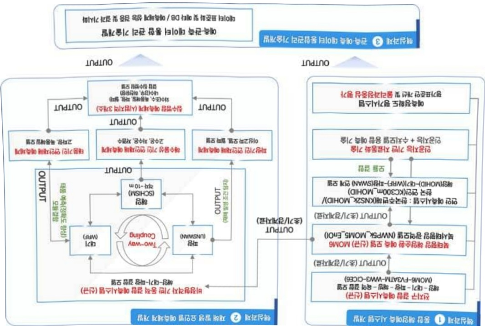
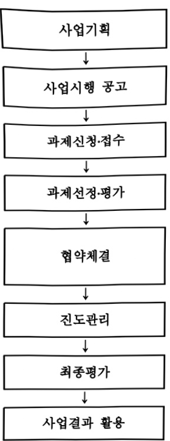

# 한국형 연안재해 발생요인 예측기술 개발(R&D)

**해당 페이지**: PDF 5115 ~ 5123 쪽 해당

**부처**: 해양수산부
**분야**: 교통 및 물류
**회계유형**: 일반회계
**2026 확정예산**: 10635.0 백만원
**전년대비 증감률**: 147.3%
**AI 도메인**: 클라우드/컴퓨팅

---

### 가.예산 총괄표

(단위:백만원,%)

<table border=1 style='margin: auto; word-wrap: break-word;'><tr><td rowspan="2">사업명</td><td rowspan="2">2024년 결산</td><td colspan="2">2025년 예산</td><td colspan="2">2026년</td><td rowspan="2">중감 (B-A)</td><td rowspan="2">(B-A)/A</td></tr><tr><td style='text-align: center; word-wrap: break-word;'>본예산(A)</td><td style='text-align: center; word-wrap: break-word;'>추경</td><td style='text-align: center; word-wrap: break-word;'>정부안</td><td style='text-align: center; word-wrap: break-word;'>확정(B)</td></tr><tr><td style='text-align: center; word-wrap: break-word;'>한국형 연안재해 발생요인 예측기술 개발(R&amp;D)</td><td style='text-align: center; word-wrap: break-word;'></td><td style='text-align: center; word-wrap: break-word;'>4,300</td><td style='text-align: center; word-wrap: break-word;'>4,300</td><td style='text-align: center; word-wrap: break-word;'>10,635</td><td style='text-align: center; word-wrap: break-word;'>10,635</td><td style='text-align: center; word-wrap: break-word;'>6,335</td><td style='text-align: center; word-wrap: break-word;'>147.3</td></tr></table>

□ 기능별(내역사업별), 목별 예산 내역

(단위:백만원)

<table border=1 style='margin: auto; word-wrap: break-word;'><tr><td rowspan="3"></td><td colspan="5">2024</td><td colspan="7">2025(2025.12월말)</td><td rowspan="3">2026예산</td></tr><tr><td rowspan="2">예산액(추정)</td><td rowspan="2">예산현액</td><td rowspan="2">집행액[실집행액]</td><td rowspan="2">이월액</td><td rowspan="2">불용액</td><td rowspan="2">본예산</td><td rowspan="2">예산현액</td><td rowspan="2">집행액[실집행액]</td><td colspan="2">전년도이월액제외</td><td rowspan="2">이월예산액</td><td rowspan="2">불용예산액</td></tr><tr><td style='text-align: center; word-wrap: break-word;'>예산현액</td><td style='text-align: center; word-wrap: break-word;'>집행액[실집행액]</td></tr><tr><td style='text-align: center; word-wrap: break-word;'>○ 기능별 분류(합계)</td><td style='text-align: center; word-wrap: break-word;'>-</td><td style='text-align: center; word-wrap: break-word;'>-</td><td style='text-align: center; word-wrap: break-word;'>-</td><td style='text-align: center; word-wrap: break-word;'>-</td><td style='text-align: center; word-wrap: break-word;'>-</td><td style='text-align: center; word-wrap: break-word;'>4,300</td><td style='text-align: center; word-wrap: break-word;'>4,300</td><td style='text-align: center; word-wrap: break-word;'>4,300[4,300]</td><td style='text-align: center; word-wrap: break-word;'>4,300</td><td style='text-align: center; word-wrap: break-word;'>4,300[4,300]</td><td style='text-align: center; word-wrap: break-word;'>-</td><td style='text-align: center; word-wrap: break-word;'>-</td><td style='text-align: center; word-wrap: break-word;'>10,635</td></tr><tr><td style='text-align: center; word-wrap: break-word;'>· 한국형 연안재해발생요인예측결계</td><td style='text-align: center; word-wrap: break-word;'>-</td><td style='text-align: center; word-wrap: break-word;'>-</td><td style='text-align: center; word-wrap: break-word;'>-</td><td style='text-align: center; word-wrap: break-word;'>-</td><td style='text-align: center; word-wrap: break-word;'>-</td><td style='text-align: center; word-wrap: break-word;'>4,300</td><td style='text-align: center; word-wrap: break-word;'>4,300</td><td style='text-align: center; word-wrap: break-word;'>4,300[4,300]</td><td style='text-align: center; word-wrap: break-word;'>4,300</td><td style='text-align: center; word-wrap: break-word;'>4,300[4,300]</td><td style='text-align: center; word-wrap: break-word;'>-</td><td style='text-align: center; word-wrap: break-word;'>-</td><td style='text-align: center; word-wrap: break-word;'>10,635</td></tr><tr><td style='text-align: center; word-wrap: break-word;'>○ 비목별 분류(합계)</td><td style='text-align: center; word-wrap: break-word;'>-</td><td style='text-align: center; word-wrap: break-word;'>-</td><td style='text-align: center; word-wrap: break-word;'>-</td><td style='text-align: center; word-wrap: break-word;'>-</td><td style='text-align: center; word-wrap: break-word;'>-</td><td style='text-align: center; word-wrap: break-word;'>4,300</td><td style='text-align: center; word-wrap: break-word;'>4,300</td><td style='text-align: center; word-wrap: break-word;'>4,300[4,300]</td><td style='text-align: center; word-wrap: break-word;'>4,300</td><td style='text-align: center; word-wrap: break-word;'>4,300[4,300]</td><td style='text-align: center; word-wrap: break-word;'>-</td><td style='text-align: center; word-wrap: break-word;'>-</td><td style='text-align: center; word-wrap: break-word;'>10,635</td></tr><tr><td style='text-align: center; word-wrap: break-word;'>· 연구개발활동비등(360-05)</td><td style='text-align: center; word-wrap: break-word;'>-</td><td style='text-align: center; word-wrap: break-word;'>-</td><td style='text-align: center; word-wrap: break-word;'>-</td><td style='text-align: center; word-wrap: break-word;'>-</td><td style='text-align: center; word-wrap: break-word;'>-</td><td style='text-align: center; word-wrap: break-word;'>4,300</td><td style='text-align: center; word-wrap: break-word;'>4,300</td><td style='text-align: center; word-wrap: break-word;'>4,300[4,300]</td><td style='text-align: center; word-wrap: break-word;'>4,300</td><td style='text-align: center; word-wrap: break-word;'>4,300[4,300]</td><td style='text-align: center; word-wrap: break-word;'>-</td><td style='text-align: center; word-wrap: break-word;'>-</td><td style='text-align: center; word-wrap: break-word;'>10,635</td></tr><tr><td style='text-align: center; word-wrap: break-word;'>○ 기능비목별 분류(합계)</td><td style='text-align: center; word-wrap: break-word;'>-</td><td style='text-align: center; word-wrap: break-word;'>-</td><td style='text-align: center; word-wrap: break-word;'>-</td><td style='text-align: center; word-wrap: break-word;'>-</td><td style='text-align: center; word-wrap: break-word;'>-</td><td style='text-align: center; word-wrap: break-word;'>4,300</td><td style='text-align: center; word-wrap: break-word;'>4,300</td><td style='text-align: center; word-wrap: break-word;'>4,300[4,300]</td><td style='text-align: center; word-wrap: break-word;'>4,300</td><td style='text-align: center; word-wrap: break-word;'>4,300[4,300]</td><td style='text-align: center; word-wrap: break-word;'>-</td><td style='text-align: center; word-wrap: break-word;'>-</td><td style='text-align: center; word-wrap: break-word;'>10,635</td></tr><tr><td style='text-align: center; word-wrap: break-word;'>· 한국형 연안재해발생요인예측결계</td><td style='text-align: center; word-wrap: break-word;'>-</td><td style='text-align: center; word-wrap: break-word;'>-</td><td style='text-align: center; word-wrap: break-word;'>-</td><td style='text-align: center; word-wrap: break-word;'>-</td><td style='text-align: center; word-wrap: break-word;'>-</td><td style='text-align: center; word-wrap: break-word;'>4,300</td><td style='text-align: center; word-wrap: break-word;'>4,300</td><td style='text-align: center; word-wrap: break-word;'>4,300[4,300]</td><td style='text-align: center; word-wrap: break-word;'>4,300</td><td style='text-align: center; word-wrap: break-word;'>4,300[4,300]</td><td style='text-align: center; word-wrap: break-word;'>-</td><td style='text-align: center; word-wrap: break-word;'>-</td><td style='text-align: center; word-wrap: break-word;'>10,635</td></tr><tr><td style='text-align: center; word-wrap: break-word;'>· 연구개발활동비등(360-05)</td><td style='text-align: center; word-wrap: break-word;'>-</td><td style='text-align: center; word-wrap: break-word;'>-</td><td style='text-align: center; word-wrap: break-word;'>-</td><td style='text-align: center; word-wrap: break-word;'>-</td><td style='text-align: center; word-wrap: break-word;'>-</td><td style='text-align: center; word-wrap: break-word;'>4,300</td><td style='text-align: center; word-wrap: break-word;'>4,300</td><td style='text-align: center; word-wrap: break-word;'>4,300[4,300]</td><td style='text-align: center; word-wrap: break-word;'>4,300</td><td style='text-align: center; word-wrap: break-word;'>4,300[4,300]</td><td style='text-align: center; word-wrap: break-word;'>-</td><td style='text-align: center; word-wrap: break-word;'>-</td><td style='text-align: center; word-wrap: break-word;'>10,635</td></tr></table>

### 나. 사업설명자료

## 1 ) 사업목적·내용

- (한국형 연안재해 발생요인 예측기술 개발)

- 연안재해 발생 요인 예측시스템 구축으로 연안 복합·대규모 재해 사전 대비·대응 능력 확보

- (한국형 연안재해 발생요인 예측기술 개발)

- 동합해양에 즉 시스템 및 연안재해 요인멸 예측 제계 개발(대분류 4개, 소분류 8개, 예측정확도 평균 82%), 초고성능 컴퓨팅 인프라(국립해양조사원 내 구축) 기반 예측 시스템 현업화

* 대분류: 해수물성기인, 파랑기인, 태풍기인, 침수범람 연안재해

소분류: 고수온, 저수온, 저염수, 월파, 이상고파, 고파량, 폭풍해일, 침수범람

---

## 2 ) 사업개요

## □ 사업근거 및 추진경위

① 법령상 근거 및 조항 적시

- 「해양수산발전기본법」 제17조(해양과학조사 및 기술개발), 제30조(연구기관의 설치·육성 등)

- 「해양과학조사법」 제20조(해양과학조사의 장려)

- 「연안관리법」제34조의2(연안정보체계의 구축 및 관리 등), 제34조의3(연안관리 연구개발), 제34조의6(연안재해 위험평가 실시 등)

- 「해양조사와 해양정보 활용에 관한 법률」 제14조(해양관측의 실시), 제17조(해양예측 정보의 생산), 제18조(해양의 중장기 현상변화 연구), 제43조(해양정보의 품질관리)

- 「해양조사와 해양정보 활용에 관한 법률 시행규칙」 제10조(해양예측정보)

- 「재난 및 안전관리 기본법」(해양수산분야 재난관리 주관기관), 제4조(국가 등의 책무), 제38조의2제1항(재난 예보·경보체계 구축·운영 등)

② 추진경위 - 사업 시작년도, 추진배경, 부처별 중점과제, 대통령 공약사항 등

## <연안재해 피해 증가 >

ㅇ 기후변화로 인해 연안재해의 발생과 피해는 점점 심각해지고 있는 상황

- '12년부터 자연재해 발생에 따른 연안지역 피해규모는 17,735억원이며, 대형 피해가 최근 3년간 ('20~'22) 집중적으로 발생

* 최근 3년간('20~'22) 발생한 피해규모(5,520억원)가 '12년부터 현재까지 피해의 31.1%를 차지

<table border=1 style='margin: auto; word-wrap: break-word;'><tr><td style='text-align: center; word-wrap: break-word;'>구분</td><td style='text-align: center; word-wrap: break-word;'>&#x27;12</td><td style='text-align: center; word-wrap: break-word;'>&#x27;13</td><td style='text-align: center; word-wrap: break-word;'>&#x27;14</td><td style='text-align: center; word-wrap: break-word;'>&#x27;15</td><td style='text-align: center; word-wrap: break-word;'>&#x27;16</td><td style='text-align: center; word-wrap: break-word;'>&#x27;17</td><td style='text-align: center; word-wrap: break-word;'>&#x27;18</td><td style='text-align: center; word-wrap: break-word;'>&#x27;19</td><td style='text-align: center; word-wrap: break-word;'>&#x27;20</td><td style='text-align: center; word-wrap: break-word;'>&#x27;21</td><td style='text-align: center; word-wrap: break-word;'>&#x27;22</td><td style='text-align: center; word-wrap: break-word;'>제</td></tr><tr><td style='text-align: center; word-wrap: break-word;'>자연재해연안피해(억원)</td><td style='text-align: center; word-wrap: break-word;'>6,143</td><td style='text-align: center; word-wrap: break-word;'>33</td><td style='text-align: center; word-wrap: break-word;'>1,238</td><td style='text-align: center; word-wrap: break-word;'>199</td><td style='text-align: center; word-wrap: break-word;'>2,078</td><td style='text-align: center; word-wrap: break-word;'>97</td><td style='text-align: center; word-wrap: break-word;'>653</td><td style='text-align: center; word-wrap: break-word;'>1,773</td><td style='text-align: center; word-wrap: break-word;'>2,433</td><td style='text-align: center; word-wrap: break-word;'>513</td><td style='text-align: center; word-wrap: break-word;'>2,573</td><td style='text-align: center; word-wrap: break-word;'>17,735</td></tr></table>

자료:연안기본조사 연안재해(자연재해)피해규모현황

- 연안은 해양과 내륙 둘 다 영향을 받기 때문에 태풍, 호우 발생 시 내륙보다 더욱 취약한 것으로 나타나 연안에 대한 재해 대응력 강화가 요구

재난관리에 있어 예측에 기반한 사전 예방이 강조되고 있으나, 연안재해는 과학적 대응역량 부족으로 매년 증가하는 재해복구비용이 투입되고 있음

- '12~'22년간 연안지역의 자연재난 피해복구비는 총 8조 7,475억원으로 전국 피해복구 비용의 88%에 해당

*연안포털 연안재해대응 통계 중 국민재난안전포털 자연재해 복구실적 재인용

o 긴급한 연안재해 대응 시 신속하고 정확한 예측을 위한 기술과 해양예측, 관측 및 정보 서비스가 연계된 기술개발 필요

---

* 해수부 R&D를 통해 운용해양예보시스템의 현업화로 해양예측에 대한 인프라 및 예측방법 개선 등의 기반을 마련하였으나 목적별 예측정보 제공의 한계

** 운용해양예보시스템을 구성하고 있는 해양기상, 파랑, 해양순환 예측모델들은 각각 독립적으로 수행되므로 각 구성요소들 간의 상호작용을 고려할 수 없다는 한계

## < 해양수산 스마트화 전략 대응 >

o 국민의 안전 확보와 대응 관점에서 해양예측 정보는 지속적인 연구개발로 정확성이 높아지고 관련 데이터 역시 지속적으로 생산되고 있음

- 사물인터넷(IoT), 인공지능(AI), 빅데이터 기술 등이 새로운 시장 영역을 창출하고 있는 점을 감안하여, 해양예측 및 관측 정보의 융합을 통한 해양수산 스마트화 전략 대응 및 새로운 해양 신산업 영역을 창출 필요

< 추진 경과 >

o 한국형 연안재해 대응체계 구축(K-Ocean Watch) 기술개발사업 기술 기획('22.02.~'22.11.)

o 한국형 연안재해 대응체계 구축(K-Ocean Watch) 기술개발사업 대국민 공청회('22.11.)

ㅇ 예비타당성 조사 (23.03.~23.10.)

* 연안재해 정밀 예측기술은 연안재해 대응체계를 구축함으로써 국민의 해양 안전 확보라는 공공의 이익에 기여하므로 정부 지원의 필요성은 존재함

**제시된 기술과 연안재해 대응 및 피해저감 사이 연관성 제시는 미흡함

*** 해양의 자연현상이 피해를 유발할지 판단하기 위해서는 위해성, 노출성, 취약성에 대한 정보를 획득하고, 세 가지 요소 사이의 상호작용을 고려하여야 하나, 동 사업 세부 활동은 관측·예측 기반의 위해성 정보 획득에 치중함

*** B/C 비율은 0.14로 경제성을 확보하지 못함

ㅇ 핵심 아이템 도출 및 예산 규모, 연구추진 방법 등의 기획연구 완료('23.11.~24.02.)

°25년 신규 사업 공고(25.01.~)

ㅇ협약 체결('25.04.25.)

□ 주요내용

① 사업규모

- 총사업비(해당되는 경우에만 기재) : 해당 없음

- 사업기간 : '25~'29년

- 최근 5년 간 투입된 사업비(예산액기준, 추경편성한 연도에는 추경포함)

<table border=1 style='margin: auto; word-wrap: break-word;'><tr><td style='text-align: center; word-wrap: break-word;'>연도</td><td style='text-align: center; word-wrap: break-word;'>2022</td><td style='text-align: center; word-wrap: break-word;'>2023</td><td style='text-align: center; word-wrap: break-word;'>2024</td><td style='text-align: center; word-wrap: break-word;'>2025</td><td style='text-align: center; word-wrap: break-word;'>2026</td></tr><tr><td style='text-align: center; word-wrap: break-word;'>사업비</td><td style='text-align: center; word-wrap: break-word;'>-</td><td style='text-align: center; word-wrap: break-word;'>-</td><td style='text-align: center; word-wrap: break-word;'>-</td><td style='text-align: center; word-wrap: break-word;'>4,300</td><td style='text-align: center; word-wrap: break-word;'>10,635</td></tr></table>

- 기타: 1개 내역사업, 1개 과제

---

## ② 사업추진체계

- 사업시행방법 : 출연(국고지원 100%)

- 사업시행주체 : 해양수산부(전문기관: 해양수산과학기술진흥원)

- 사업 수혜자 : 대학, 출연연, 기업 등

- 보조, 융자, 출연, 출자 등의 경우 보조 · 융자 등 지원 비율 및 법적근거

<table border=1 style='margin: auto; word-wrap: break-word;'><tr><td style='text-align: center; word-wrap: break-word;'>내역사업명</td><td style='text-align: center; word-wrap: break-word;'>구분</td><td style='text-align: center; word-wrap: break-word;'>피보조·피출연 등 기관명</td><td style='text-align: center; word-wrap: break-word;'>지원 금액 (2026예산)</td><td style='text-align: center; word-wrap: break-word;'>지원 비율(%)</td><td style='text-align: center; word-wrap: break-word;'>보조율 법적근거 (해당 조항)</td></tr><tr><td style='text-align: center; word-wrap: break-word;'>한국형 연안재해 발생요인 예측기술 개발</td><td style='text-align: center; word-wrap: break-word;'>출연</td><td style='text-align: center; word-wrap: break-word;'>해양수산 과학기술 진흥원</td><td style='text-align: center; word-wrap: break-word;'>10,635</td><td style='text-align: center; word-wrap: break-word;'>100</td><td style='text-align: center; word-wrap: break-word;'>해양수산과학기술육성법 제23조 (해양수산과학기술진흥원의 설립)</td></tr></table>

## 3 ) 2026년도 예산 산출 근거

□ 한국형 연안재해 발생요인 예측기술 개발 : (2025 본예산) 4,300백만원 → (2026 예산) 10,635백만원, 6,335백만원 증액

① 한국형 연안재해 발생요인 예측기술 개발

: (2025 본예산) 4,300백만원 → (2026 요구) 10,635백만원, 6,335백만원 증액

- (요구) 한국형 연안재해 정밀 예측시스템 수립, 초고성능 컴퓨팅 인프라 구축 등 관련 소요 예산 요구

- (산출) 10,635백만원 = 1개(과제 수)× 10,635백만원 × 12/12개월

* 컴퓨팅 인프라 4,000백만원 + 모델구축 등 연구 6,635백만원

ㅇ 2025년도 예산 및 2026년도 예산 산출 세부내역 비교

<table border=1 style='margin: auto; word-wrap: break-word;'><tr><td colspan="2">2025년 본예산</td><td colspan="2">2026년 예산</td></tr><tr><td style='text-align: center; word-wrap: break-word;'>예산</td><td style='text-align: center; word-wrap: break-word;'>산출내역</td><td style='text-align: center; word-wrap: break-word;'>예산</td><td style='text-align: center; word-wrap: break-word;'>산출내역</td></tr><tr><td rowspan="13">4,300</td><td style='text-align: center; word-wrap: break-word;'>○ 연구개발활동비(360-05): 4,300백만원</td><td colspan="2">○ 연구개발활동비(360-05): 10,635백만원</td></tr><tr><td style='text-align: center; word-wrap: break-word;'>가. 통합 해양 예측시스템 개발 (2,120백만원)</td><td colspan="2">가. 통합 해양 예측시스템 개발 (3,652백만원)</td></tr><tr><td style='text-align: center; word-wrap: break-word;'>· 예측시스템 설계(격자체계 및 접합 방안 개발): 1,051백만원</td><td colspan="2">· 전지구·지역해·연안 예측시스템 개발: 2,023백만원</td></tr><tr><td style='text-align: center; word-wrap: break-word;'>· 인공지능 기반 자료동화·용합 예측시스템 설계: 759백만원</td><td colspan="2">· 인공지능 기반 자료동화·용합 예측시스템 개발: 1,629백만원</td></tr><tr><td style='text-align: center; word-wrap: break-word;'>· 무인선 관측·예측 연계시스템 설계: 310백만원</td><td colspan="2">나. 연안재해 발생 요인별 예측 체계 개발 (2,509백만원)</td></tr><tr><td style='text-align: center; word-wrap: break-word;'>나. 연안재해 발생 요인별 예측 체계 개발 (1,730백만원)</td><td colspan="2">· 해수물성기인 연안재해 예측기술 개발: 720백만원</td></tr><tr><td style='text-align: center; word-wrap: break-word;'>· 해수물성 및 기압변동 기인 연안재해 예측기술 설계: 670백만원</td><td colspan="2">· 파랑기인 재해 예측기술 개발: 520백만원</td></tr><tr><td style='text-align: center; word-wrap: break-word;'>· 파랑기인 재해 예측기술 설계: 100백만원</td><td colspan="2">· 태풍기인 연안재해 예측기술 개발: 614백만원</td></tr><tr><td style='text-align: center; word-wrap: break-word;'>· 태풍기인 연안재해 예측기술 설계: 360백만원</td><td colspan="2">· 해양·대기·파랑 결합 침수범람 예측기술 개발: 655백만원</td></tr><tr><td style='text-align: center; word-wrap: break-word;'>· 해양·대기·파랑 결합 침수범람 예측기술 설계: 600백만원</td><td colspan="2">다. 관측·예측 데이터 통합관리 기술 개발 (474백만원)</td></tr><tr><td style='text-align: center; word-wrap: break-word;'>다. 관측·예측 데이터 통합관리 기술 개발 (450백만원)</td><td colspan="2">· 예측데이터 표준화: 199백만원</td></tr><tr><td style='text-align: center; word-wrap: break-word;'>· 관측데이터 표준화: 177백만원</td><td colspan="2">· 해양환경 및 연안재해 예측 결과 가시화 기술 개발: 275백만원</td></tr><tr><td style='text-align: center; word-wrap: break-word;'>· 해양환경 및 연안재해 예측 결과 가시화 기술 설계: 273백만원</td><td colspan="2">라. 초고성능 컴퓨팅 인프라 구축 (4,000백만원)</td></tr></table>

---

## 4 ) 사업효과

☐ 사업영향, 산출물 성과지표 등

① 2022~2026년도 성과계획서 상 성과지표 및 최근 5년간 성과 달성도

<table border=1 style='margin: auto; word-wrap: break-word;'><tr><td style='text-align: center; word-wrap: break-word;'>성과지표</td><td style='text-align: center; word-wrap: break-word;'>구분</td><td style='text-align: center; word-wrap: break-word;'>2022</td><td style='text-align: center; word-wrap: break-word;'>2023</td><td style='text-align: center; word-wrap: break-word;'>2024</td><td style='text-align: center; word-wrap: break-word;'>2025</td><td style='text-align: center; word-wrap: break-word;'>2026</td><td style='text-align: center; word-wrap: break-word;'>2026 목표치산출근거</td><td style='text-align: center; word-wrap: break-word;'>측정산식(또는 측정방법)</td><td style='text-align: center; word-wrap: break-word;'>자료수집방법(또는 자료출처)</td></tr><tr><td rowspan="3">해양수산 일자리창출 수(단위: 명)</td><td style='text-align: center; word-wrap: break-word;'>목표</td><td style='text-align: center; word-wrap: break-word;'>신규</td><td style='text-align: center; word-wrap: break-word;'>신규</td><td style='text-align: center; word-wrap: break-word;'>신규</td><td style='text-align: center; word-wrap: break-word;'>255</td><td style='text-align: center; word-wrap: break-word;'>261</td><td rowspan="3">최근 3년 평균값을 기준으로 설정하고, 3개년 평균값 대비 15% 상향한 도전적 목표 제시</td><td rowspan="3">해양수산 창업·투자, R&amp;D 지원사업 수혜기업의 신규 고용창출 수</td><td rowspan="3">해양수산과학 기술진흥원(KIMST) 보고서</td></tr><tr><td style='text-align: center; word-wrap: break-word;'>실적</td><td style='text-align: center; word-wrap: break-word;'>신규</td><td style='text-align: center; word-wrap: break-word;'>신규</td><td style='text-align: center; word-wrap: break-word;'>신규</td><td style='text-align: center; word-wrap: break-word;'>-</td><td style='text-align: center; word-wrap: break-word;'>-</td></tr><tr><td style='text-align: center; word-wrap: break-word;'>달성도</td><td style='text-align: center; word-wrap: break-word;'>신규</td><td style='text-align: center; word-wrap: break-word;'>신규</td><td style='text-align: center; word-wrap: break-word;'>신규</td><td style='text-align: center; word-wrap: break-word;'>-</td><td style='text-align: center; word-wrap: break-word;'>-</td></tr></table>

※ 본 세부사업이 포함되어 있는 프로그램「해양산업육성및영토관리」의 성과지표임

② 성과지표 이외의 연도별 사업추진 경과 및 실적

<table border=1 style='margin: auto; word-wrap: break-word;'><tr><td style='text-align: center; word-wrap: break-word;'>2022</td><td style='text-align: center; word-wrap: break-word;'>-</td></tr><tr><td style='text-align: center; word-wrap: break-word;'>2023</td><td style='text-align: center; word-wrap: break-word;'>-</td></tr><tr><td style='text-align: center; word-wrap: break-word;'>2024</td><td style='text-align: center; word-wrap: break-word;'>-</td></tr><tr><td style='text-align: center; word-wrap: break-word;'>2025</td><td style='text-align: center; word-wrap: break-word;'>- 연구기관 선정 및 협약체결(4.25.) - 예측정확도 평가표준안 수립</td></tr></table>

③향후(2026년도 이후)기대효과

°(통합 해양예측시스템) 전지구-지역해-연안 연계 예측시스템 및 인공지능 기반

- 전지구-지역해-연안 예측시스템 선진국 대비 기술 수준: 착수 약 56% → 최종 약 78%

- AI 기반 융합 예측시스템 선진국 대비 기술 수준: 착수 약 33% → 최종 약 67%

° (연안재해 발생 요인별 예측체계) 비정형격자 기반 동적 결합 예측시스템 구축 및 연안재해 발생 요인별 예측체계 개발을 통한 선진국 기술격차 해소

- 비정형격자 기반 해양·대기·파랑 동적 결합 예측 시스템 선진국 대비 기술 수준:

착수 약 67% → 최종 약 89%

- 연안재해 요인 별 예측체계(대분류 4개, 소분류 8개) 예측체계 선진국 대비 기술수준: 착수 평균 약 67% → 최종 평균 약 89%

---

5) 타당성조사 및 예비타당성조사 시행여부 및 결과 요지 : 해당 없음

[한국형 연안재해 발생요인 예측기술 개발 사업 구성도]

※ 기술수준(%) 산출근거 : (국내 TRL/선진국 TRL) $ \times $100

구축을 통한 선진국 기술격차 해소: 착수 약 67% → 최종 약 89%

°(예측·관측 데이터 통합관리 기술) 관측·예측 데이터 표준화 및 가시화 시스템

---

## 7 ) 사업 집행절차

## ·해양수산부

°해양수산부·해양수산과학기술진흥원 : 세부추진계획 확정·공고

- 사업안내서, 과제제안요구서(RFP) 포함

°연구기관 : 신규과제 연구개발계획서 작성·신청

°해양수산과학기술진흥원 : 접수

°해양수산과학기술진흥원

- 사전검토 → 전문가 평가(서면·발표심사) → 전문기관 조정 및 협의

°해양수산과학기술진흥원 ↔ 주관연구기관

- 주관연구기관 ↔ 세부주관기관 및 참여기업

- 주관연구기관 ↔ 위탁기관

°해양수산과학기술진흥원 : 진도관리

°해양수산과학기술진흥원 : 연구결과 최종평가

°해양수산과학기술진흥원/주관연구기관/민간

<table border=1 style='margin: auto; word-wrap: break-word;'><tr><td style='text-align: center; word-wrap: break-word;'>부처</td><td style='text-align: center; word-wrap: break-word;'></td><td style='text-align: center; word-wrap: break-word;'>피출연·피보조기관</td><td style='text-align: center; word-wrap: break-word;'></td><td style='text-align: center; word-wrap: break-word;'>간접보조사업자·사업수행자</td></tr><tr><td style='text-align: center; word-wrap: break-word;'>국립해양조사원(4,300백만원)</td><td style='text-align: center; word-wrap: break-word;'>=&gt;(4,300백만원)</td><td style='text-align: center; word-wrap: break-word;'>해양수산과학기술진흥원(4,300백만원)</td><td style='text-align: center; word-wrap: break-word;'>=&gt;(4,300백만원)</td><td style='text-align: center; word-wrap: break-word;'>한국해양과학기술원외 5개 기관</td></tr></table>

## 8 ) 각종 평가

1) 국회(예결위, 상임위, 예정처, 국정감사 포함) 지적 : 해당없음

2) 대외공개 평가 : 해당없음

3) 자체평가 : 해당없음

---

### 다. 최근 4년간 결산내역

## 1 ) 결산표

☐ 부처 결산내역

(단위: 백만원, %)

<table border=1 style='margin: auto; word-wrap: break-word;'><tr><td rowspan="2">闰五</td><td colspan="3">예산액</td><td rowspan="2">전년도이월액</td><td rowspan="2">이·전용등</td><td rowspan="2">예비비</td><td rowspan="2">예산현액(B)</td><td rowspan="2">집행액(C)</td><td rowspan="2">집행률(C/A)</td><td rowspan="2">집행률(C/B)</td><td rowspan="2">다음연도이월액</td><td rowspan="2">불용액</td></tr><tr><td style='text-align: center; word-wrap: break-word;'>본예산중감액</td><td style='text-align: center; word-wrap: break-word;'>추경중감액</td><td style='text-align: center; word-wrap: break-word;'>추경(A)</td></tr><tr><td style='text-align: center; word-wrap: break-word;'>2022</td><td style='text-align: center; word-wrap: break-word;'>-</td><td style='text-align: center; word-wrap: break-word;'>-</td><td style='text-align: center; word-wrap: break-word;'>-</td><td style='text-align: center; word-wrap: break-word;'>-</td><td style='text-align: center; word-wrap: break-word;'>-</td><td style='text-align: center; word-wrap: break-word;'>-</td><td style='text-align: center; word-wrap: break-word;'>-</td><td style='text-align: center; word-wrap: break-word;'>-</td><td style='text-align: center; word-wrap: break-word;'>-</td><td style='text-align: center; word-wrap: break-word;'>-</td><td style='text-align: center; word-wrap: break-word;'>-</td><td style='text-align: center; word-wrap: break-word;'>-</td></tr><tr><td style='text-align: center; word-wrap: break-word;'>2023</td><td style='text-align: center; word-wrap: break-word;'>-</td><td style='text-align: center; word-wrap: break-word;'>-</td><td style='text-align: center; word-wrap: break-word;'>-</td><td style='text-align: center; word-wrap: break-word;'>-</td><td style='text-align: center; word-wrap: break-word;'>-</td><td style='text-align: center; word-wrap: break-word;'>-</td><td style='text-align: center; word-wrap: break-word;'>-</td><td style='text-align: center; word-wrap: break-word;'>-</td><td style='text-align: center; word-wrap: break-word;'>-</td><td style='text-align: center; word-wrap: break-word;'>-</td><td style='text-align: center; word-wrap: break-word;'>-</td><td style='text-align: center; word-wrap: break-word;'>-</td></tr><tr><td style='text-align: center; word-wrap: break-word;'>2024</td><td style='text-align: center; word-wrap: break-word;'>-</td><td style='text-align: center; word-wrap: break-word;'>-</td><td style='text-align: center; word-wrap: break-word;'>-</td><td style='text-align: center; word-wrap: break-word;'>-</td><td style='text-align: center; word-wrap: break-word;'>-</td><td style='text-align: center; word-wrap: break-word;'>-</td><td style='text-align: center; word-wrap: break-word;'>-</td><td style='text-align: center; word-wrap: break-word;'>-</td><td style='text-align: center; word-wrap: break-word;'>-</td><td style='text-align: center; word-wrap: break-word;'>-</td><td style='text-align: center; word-wrap: break-word;'>-</td><td style='text-align: center; word-wrap: break-word;'>-</td></tr><tr><td style='text-align: center; word-wrap: break-word;'>2025</td><td style='text-align: center; word-wrap: break-word;'>4,300</td><td style='text-align: center; word-wrap: break-word;'>-</td><td style='text-align: center; word-wrap: break-word;'>4,300</td><td style='text-align: center; word-wrap: break-word;'>-</td><td style='text-align: center; word-wrap: break-word;'>-</td><td style='text-align: center; word-wrap: break-word;'>-</td><td style='text-align: center; word-wrap: break-word;'>4,300</td><td style='text-align: center; word-wrap: break-word;'>4,300</td><td style='text-align: center; word-wrap: break-word;'>100</td><td style='text-align: center; word-wrap: break-word;'>100</td><td style='text-align: center; word-wrap: break-word;'>-</td><td style='text-align: center; word-wrap: break-word;'>-</td></tr></table>

□출연·보조사업 등 실집행내역

(단위: 백만원, %)

<table border=1 style='margin: auto; word-wrap: break-word;'><tr><td rowspan="3">구분</td><td colspan="3">부처</td><td colspan="7">사업시행주체(피출연·피보조 기관 등)</td></tr><tr><td colspan="2">예산액</td><td rowspan="2">집행액</td><td rowspan="2">교부액</td><td rowspan="2">전년도 이월액</td><td rowspan="2">교부 현액</td><td rowspan="2">집행액 (B)</td><td rowspan="2">이월액</td><td rowspan="2">불용액</td><td rowspan="2">살림행률 (B/A)</td></tr><tr><td style='text-align: center; word-wrap: break-word;'>본예산</td><td style='text-align: center; word-wrap: break-word;'>추경(A)</td></tr><tr><td style='text-align: center; word-wrap: break-word;'>2022</td><td style='text-align: center; word-wrap: break-word;'>-</td><td style='text-align: center; word-wrap: break-word;'>-</td><td style='text-align: center; word-wrap: break-word;'>-</td><td style='text-align: center; word-wrap: break-word;'>-</td><td style='text-align: center; word-wrap: break-word;'>-</td><td style='text-align: center; word-wrap: break-word;'>-</td><td style='text-align: center; word-wrap: break-word;'>-</td><td style='text-align: center; word-wrap: break-word;'>-</td><td style='text-align: center; word-wrap: break-word;'>-</td><td style='text-align: center; word-wrap: break-word;'>-</td></tr><tr><td style='text-align: center; word-wrap: break-word;'>2023</td><td style='text-align: center; word-wrap: break-word;'>-</td><td style='text-align: center; word-wrap: break-word;'>-</td><td style='text-align: center; word-wrap: break-word;'>-</td><td style='text-align: center; word-wrap: break-word;'>-</td><td style='text-align: center; word-wrap: break-word;'>-</td><td style='text-align: center; word-wrap: break-word;'>-</td><td style='text-align: center; word-wrap: break-word;'>-</td><td style='text-align: center; word-wrap: break-word;'>-</td><td style='text-align: center; word-wrap: break-word;'>-</td><td style='text-align: center; word-wrap: break-word;'>-</td></tr><tr><td style='text-align: center; word-wrap: break-word;'>2024</td><td style='text-align: center; word-wrap: break-word;'>-</td><td style='text-align: center; word-wrap: break-word;'>-</td><td style='text-align: center; word-wrap: break-word;'>-</td><td style='text-align: center; word-wrap: break-word;'>-</td><td style='text-align: center; word-wrap: break-word;'>-</td><td style='text-align: center; word-wrap: break-word;'>-</td><td style='text-align: center; word-wrap: break-word;'>-</td><td style='text-align: center; word-wrap: break-word;'>-</td><td style='text-align: center; word-wrap: break-word;'>-</td><td style='text-align: center; word-wrap: break-word;'>-</td></tr><tr><td style='text-align: center; word-wrap: break-word;'>2025.12월기준</td><td style='text-align: center; word-wrap: break-word;'>4,300</td><td style='text-align: center; word-wrap: break-word;'>4,300</td><td style='text-align: center; word-wrap: break-word;'>4,300</td><td style='text-align: center; word-wrap: break-word;'>4,300</td><td style='text-align: center; word-wrap: break-word;'>-</td><td style='text-align: center; word-wrap: break-word;'>4,300</td><td style='text-align: center; word-wrap: break-word;'>4,300</td><td style='text-align: center; word-wrap: break-word;'>-</td><td style='text-align: center; word-wrap: break-word;'>-</td><td style='text-align: center; word-wrap: break-word;'>100%</td></tr></table>

## 2 ) 주요 결산사항

2022~2025년 결산 주요 지적사항 및 시정요구사항 : 해당 없음

□ 2025년 이·전용 등 세부내역 : 해당 없음

---

<table border=1 style='margin: auto; word-wrap: break-word;'><tr><td style='text-align: center; word-wrap: break-word;'>사 업 명</td></tr><tr><td style='text-align: center; word-wrap: break-word;'>(97) 해양공간 디지털트윈 적용 및 활용 기술개발(R&amp;D) (4132-312)</td></tr></table>

□ 사업 코드 정보

<table border=1 style='margin: auto; word-wrap: break-word;'><tr><td style='text-align: center; word-wrap: break-word;'>구분</td><td style='text-align: center; word-wrap: break-word;'>회계</td><td style='text-align: center; word-wrap: break-word;'>소관</td><td style='text-align: center; word-wrap: break-word;'>실국(기관)</td><td style='text-align: center; word-wrap: break-word;'>계정</td><td style='text-align: center; word-wrap: break-word;'>분야</td><td style='text-align: center; word-wrap: break-word;'>부문</td></tr><tr><td style='text-align: center; word-wrap: break-word;'>코드</td><td rowspan="2">일반회계</td><td rowspan="2">해양수산부</td><td rowspan="2">해양환경정책관</td><td rowspan="2"></td><td style='text-align: center; word-wrap: break-word;'>120</td><td style='text-align: center; word-wrap: break-word;'>126</td></tr><tr><td style='text-align: center; word-wrap: break-word;'>명칭</td><td style='text-align: center; word-wrap: break-word;'>교통 및 물류</td><td style='text-align: center; word-wrap: break-word;'>물류 등 기타</td></tr></table>

<table border=1 style='margin: auto; word-wrap: break-word;'><tr><td style='text-align: center; word-wrap: break-word;'>구분</td><td style='text-align: center; word-wrap: break-word;'>프로그램</td><td style='text-align: center; word-wrap: break-word;'>단위사업</td><td style='text-align: center; word-wrap: break-word;'>세부사업</td></tr><tr><td style='text-align: center; word-wrap: break-word;'>코드</td><td style='text-align: center; word-wrap: break-word;'>4100</td><td style='text-align: center; word-wrap: break-word;'>4132</td><td style='text-align: center; word-wrap: break-word;'>312</td></tr><tr><td style='text-align: center; word-wrap: break-word;'>명칭</td><td style='text-align: center; word-wrap: break-word;'>해양수산연구개발</td><td style='text-align: center; word-wrap: break-word;'>해양수산환경 기술개발(R&amp;D)</td><td style='text-align: center; word-wrap: break-word;'>해양공간 디지털트윈 적용 및 활용 기술개발(R&amp;D)</td></tr></table>

□ 사업 성격 (공통요구자료 Ⅱ-1 작성유의사항 4. 참조, 해당하는 사항에 “0” 표시)

<table border=1 style='margin: auto; word-wrap: break-word;'><tr><td rowspan="2">신규</td><td rowspan="2">계속</td><td rowspan="2">완료</td><td style='text-align: center; word-wrap: break-word;'>예비타당성</td><td style='text-align: center; word-wrap: break-word;'>총사업비</td><td style='text-align: center; word-wrap: break-word;'>총액계상</td><td style='text-align: center; word-wrap: break-word;'>사업소관 변경정보</td></tr><tr><td style='text-align: center; word-wrap: break-word;'>실시여부</td><td style='text-align: center; word-wrap: break-word;'>관리대상</td><td style='text-align: center; word-wrap: break-word;'>예산사업</td><td style='text-align: center; word-wrap: break-word;'>2025예산 시 소관</td></tr><tr><td style='text-align: center; word-wrap: break-word;'></td><td style='text-align: center; word-wrap: break-word;'>O</td><td style='text-align: center; word-wrap: break-word;'></td><td style='text-align: center; word-wrap: break-word;'></td><td style='text-align: center; word-wrap: break-word;'></td><td style='text-align: center; word-wrap: break-word;'></td><td style='text-align: center; word-wrap: break-word;'></td></tr></table>

□사업지원형태 및지원을(최소한한개는반드시선택하시오.해당사항에O표시)

<table border=1 style='margin: auto; word-wrap: break-word;'><tr><td style='text-align: center; word-wrap: break-word;'>직접</td><td style='text-align: center; word-wrap: break-word;'>출자</td><td style='text-align: center; word-wrap: break-word;'>출연</td><td style='text-align: center; word-wrap: break-word;'>보조</td><td style='text-align: center; word-wrap: break-word;'>융자</td><td style='text-align: center; word-wrap: break-word;'>국고보조율(%)</td><td style='text-align: center; word-wrap: break-word;'>융자율(%)</td></tr><tr><td style='text-align: center; word-wrap: break-word;'></td><td style='text-align: center; word-wrap: break-word;'></td><td style='text-align: center; word-wrap: break-word;'>O</td><td style='text-align: center; word-wrap: break-word;'></td><td style='text-align: center; word-wrap: break-word;'></td><td style='text-align: center; word-wrap: break-word;'></td><td style='text-align: center; word-wrap: break-word;'></td></tr></table>

## □ 사업 담당자

<table border=1 style='margin: auto; word-wrap: break-word;'><tr><td style='text-align: center; word-wrap: break-word;'>사업명</td><td colspan="2">구분</td></tr><tr><td rowspan="4">해양공간 디지털트런 적용 및 활용기술 개발(R&amp;D)</td><td rowspan="3">소관부처</td><td style='text-align: center; word-wrap: break-word;'>실·국·과(팀)명</td></tr><tr><td style='text-align: center; word-wrap: break-word;'>해양정책실 해양환경정책관</td></tr><tr><td style='text-align: center; word-wrap: break-word;'>해양공간정책과</td></tr><tr><td style='text-align: center; word-wrap: break-word;'>사업시행주체</td><td style='text-align: center; word-wrap: break-word;'>해양수산과학기술진흥원 생명환경팀</td></tr></table>

---

### 원본 PDF 크롭 이미지

