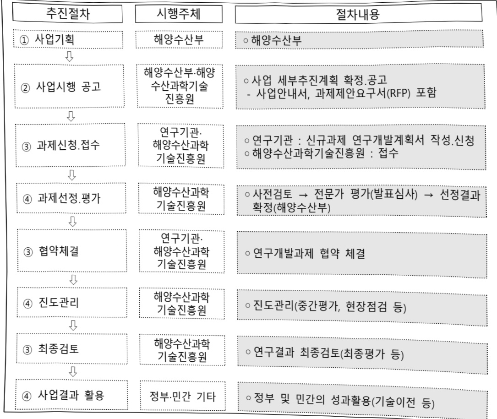

# 해양공간 디지털트윈 적용 및 활용 기술개발(R&D)

**해당 페이지**: PDF 5124 ~ 5132 쪽 해당

**부처**: 해양수산부
**분야**: 교통 및 물류
**회계유형**: 일반회계
**2026 확정예산**: 6000.0 백만원
**전년대비 증감률**: -10.1%
**AI 도메인**: 건설/스마트시티

---

### 가.예산 총괄표

(단위: 백만원, %)

<table border=1 style='margin: auto; word-wrap: break-word;'><tr><td rowspan="2">사업명</td><td rowspan="2">2024년 결산</td><td colspan="2">2025년 예산</td><td colspan="2">2026년</td><td rowspan="2">증감(B-A)</td><td rowspan="2">(B-A)/A</td></tr><tr><td style='text-align: center; word-wrap: break-word;'>본예산(A)</td><td style='text-align: center; word-wrap: break-word;'>추경</td><td style='text-align: center; word-wrap: break-word;'>정부안</td><td style='text-align: center; word-wrap: break-word;'>확정(B)</td></tr><tr><td style='text-align: center; word-wrap: break-word;'>해양공간 디지털 트윈 적용 및 활용 기술개발(R&amp;D)</td><td style='text-align: center; word-wrap: break-word;'>5,975</td><td style='text-align: center; word-wrap: break-word;'>6,675</td><td style='text-align: center; word-wrap: break-word;'>6,675</td><td style='text-align: center; word-wrap: break-word;'>6,000</td><td style='text-align: center; word-wrap: break-word;'>6,000</td><td style='text-align: center; word-wrap: break-word;'>△675</td><td style='text-align: center; word-wrap: break-word;'>△10.1</td></tr></table>

□ 기능별(내역사업별), 목별 예산 내역

(단위:백만원)

<table border=1 style='margin: auto; word-wrap: break-word;'><tr><td rowspan="3"></td><td colspan="5">2024</td><td colspan="7">2025(2025.12월말)</td><td rowspan="3">2026예산</td></tr><tr><td rowspan="2">예산액(추정)</td><td rowspan="2">예산현액</td><td rowspan="2">집행액[실집행액]</td><td rowspan="2">이월액</td><td rowspan="2">불용액</td><td rowspan="2">본예산</td><td rowspan="2">예산현액</td><td rowspan="2">집행액[실집행액]</td><td colspan="2">전년도 이월액제외</td><td rowspan="2">이월예상액</td><td rowspan="2">불용예상액</td></tr><tr><td style='text-align: center; word-wrap: break-word;'>예산현액</td><td style='text-align: center; word-wrap: break-word;'>집행액[실집행액]</td></tr><tr><td style='text-align: center; word-wrap: break-word;'>○ 기능별 분류(합계)</td><td style='text-align: center; word-wrap: break-word;'>5,975</td><td style='text-align: center; word-wrap: break-word;'>5,975</td><td style='text-align: center; word-wrap: break-word;'>5,975[5,975]</td><td style='text-align: center; word-wrap: break-word;'>-</td><td style='text-align: center; word-wrap: break-word;'>-</td><td style='text-align: center; word-wrap: break-word;'>6,675</td><td style='text-align: center; word-wrap: break-word;'>6,675[6,675]</td><td style='text-align: center; word-wrap: break-word;'>6,675[6,675]</td><td style='text-align: center; word-wrap: break-word;'>6,675[6,675]</td><td style='text-align: center; word-wrap: break-word;'>6,675[6,675]</td><td style='text-align: center; word-wrap: break-word;'>-</td><td style='text-align: center; word-wrap: break-word;'>-</td><td style='text-align: center; word-wrap: break-word;'>6,000</td></tr><tr><td style='text-align: center; word-wrap: break-word;'>· 해양 디지털트윈구축 및 활용 기반기술 연구</td><td style='text-align: center; word-wrap: break-word;'>3,946</td><td style='text-align: center; word-wrap: break-word;'>3,946</td><td style='text-align: center; word-wrap: break-word;'>3,946[3,946]</td><td style='text-align: center; word-wrap: break-word;'>-</td><td style='text-align: center; word-wrap: break-word;'>-</td><td style='text-align: center; word-wrap: break-word;'>2,973</td><td style='text-align: center; word-wrap: break-word;'>2,973[2,973]</td><td style='text-align: center; word-wrap: break-word;'>2,973[2,973]</td><td style='text-align: center; word-wrap: break-word;'>2,973[2,973]</td><td style='text-align: center; word-wrap: break-word;'>-</td><td style='text-align: center; word-wrap: break-word;'>-</td><td style='text-align: center; word-wrap: break-word;'>2,800</td><td style='text-align: center; word-wrap: break-word;'></td></tr><tr><td style='text-align: center; word-wrap: break-word;'>· 해양공간 정책 시뮬레이터 기술 개발</td><td style='text-align: center; word-wrap: break-word;'>1,178</td><td style='text-align: center; word-wrap: break-word;'>1,178</td><td style='text-align: center; word-wrap: break-word;'>1,178[1,178]</td><td style='text-align: center; word-wrap: break-word;'>-</td><td style='text-align: center; word-wrap: break-word;'>-</td><td style='text-align: center; word-wrap: break-word;'>2,400</td><td style='text-align: center; word-wrap: break-word;'>2,400[2,400]</td><td style='text-align: center; word-wrap: break-word;'>2,400[2,400]</td><td style='text-align: center; word-wrap: break-word;'>2,400[2,400]</td><td style='text-align: center; word-wrap: break-word;'>-</td><td style='text-align: center; word-wrap: break-word;'>-</td><td style='text-align: center; word-wrap: break-word;'>2,300</td><td style='text-align: center; word-wrap: break-word;'></td></tr><tr><td style='text-align: center; word-wrap: break-word;'>· 맞춤형 해양예측정보 제공을 위한서비스 기술 개발</td><td style='text-align: center; word-wrap: break-word;'>851</td><td style='text-align: center; word-wrap: break-word;'>851</td><td style='text-align: center; word-wrap: break-word;'>851[851]</td><td style='text-align: center; word-wrap: break-word;'>-</td><td style='text-align: center; word-wrap: break-word;'>-</td><td style='text-align: center; word-wrap: break-word;'>1,302</td><td style='text-align: center; word-wrap: break-word;'>1,302[1,302]</td><td style='text-align: center; word-wrap: break-word;'>1,302[1,302]</td><td style='text-align: center; word-wrap: break-word;'>1,302[1,302]</td><td style='text-align: center; word-wrap: break-word;'>-</td><td style='text-align: center; word-wrap: break-word;'>-</td><td style='text-align: center; word-wrap: break-word;'>900</td><td style='text-align: center; word-wrap: break-word;'></td></tr><tr><td style='text-align: center; word-wrap: break-word;'>○ 비목별 분류(합계)</td><td style='text-align: center; word-wrap: break-word;'>5,974</td><td style='text-align: center; word-wrap: break-word;'>5,975</td><td style='text-align: center; word-wrap: break-word;'>5,975[5,975]</td><td style='text-align: center; word-wrap: break-word;'>-</td><td style='text-align: center; word-wrap: break-word;'>-</td><td style='text-align: center; word-wrap: break-word;'>6,675</td><td style='text-align: center; word-wrap: break-word;'>6,675[6,675]</td><td style='text-align: center; word-wrap: break-word;'>6,675[6,675]</td><td style='text-align: center; word-wrap: break-word;'>6,675[6,675]</td><td style='text-align: center; word-wrap: break-word;'>-</td><td style='text-align: center; word-wrap: break-word;'>-</td><td style='text-align: center; word-wrap: break-word;'>6,000</td><td style='text-align: center; word-wrap: break-word;'></td></tr><tr><td style='text-align: center; word-wrap: break-word;'>· 연구개발활동비등(360-05)</td><td style='text-align: center; word-wrap: break-word;'>5,974</td><td style='text-align: center; word-wrap: break-word;'>5,975</td><td style='text-align: center; word-wrap: break-word;'>5,975[5,975]</td><td style='text-align: center; word-wrap: break-word;'>-</td><td style='text-align: center; word-wrap: break-word;'>-</td><td style='text-align: center; word-wrap: break-word;'>6,675</td><td style='text-align: center; word-wrap: break-word;'>6,675[6,675]</td><td style='text-align: center; word-wrap: break-word;'>6,675[6,675]</td><td style='text-align: center; word-wrap: break-word;'>6,675[6,675]</td><td style='text-align: center; word-wrap: break-word;'>-</td><td style='text-align: center; word-wrap: break-word;'>-</td><td style='text-align: center; word-wrap: break-word;'>6,000</td><td style='text-align: center; word-wrap: break-word;'></td></tr><tr><td style='text-align: center; word-wrap: break-word;'>○ 기능비목별 분류(합계)</td><td style='text-align: center; word-wrap: break-word;'>5,974</td><td style='text-align: center; word-wrap: break-word;'>5,975</td><td style='text-align: center; word-wrap: break-word;'>5,975[5,975]</td><td style='text-align: center; word-wrap: break-word;'>-</td><td style='text-align: center; word-wrap: break-word;'>-</td><td style='text-align: center; word-wrap: break-word;'>6,675</td><td style='text-align: center; word-wrap: break-word;'>6,675[6,675]</td><td style='text-align: center; word-wrap: break-word;'>6,675[6,675]</td><td style='text-align: center; word-wrap: break-word;'>6,675[6,675]</td><td style='text-align: center; word-wrap: break-word;'>-</td><td style='text-align: center; word-wrap: break-word;'>-</td><td style='text-align: center; word-wrap: break-word;'>6,000</td><td style='text-align: center; word-wrap: break-word;'></td></tr><tr><td style='text-align: center; word-wrap: break-word;'>· 해양 디지털트윈구축 및 활용 기반기술 연구</td><td style='text-align: center; word-wrap: break-word;'>3,946</td><td style='text-align: center; word-wrap: break-word;'>3,946</td><td style='text-align: center; word-wrap: break-word;'>3,946[3,946]</td><td style='text-align: center; word-wrap: break-word;'>-</td><td style='text-align: center; word-wrap: break-word;'>-</td><td style='text-align: center; word-wrap: break-word;'>2,973</td><td style='text-align: center; word-wrap: break-word;'>2,973[2,973]</td><td style='text-align: center; word-wrap: break-word;'>2,973[2,973]</td><td style='text-align: center; word-wrap: break-word;'>2,973[2,973]</td><td style='text-align: center; word-wrap: break-word;'>-</td><td style='text-align: center; word-wrap: break-word;'>-</td><td style='text-align: center; word-wrap: break-word;'>2,800</td><td style='text-align: center; word-wrap: break-word;'></td></tr><tr><td style='text-align: center; word-wrap: break-word;'>· 연구개발활동비등(360-05)</td><td style='text-align: center; word-wrap: break-word;'>3,946</td><td style='text-align: center; word-wrap: break-word;'>3,946</td><td style='text-align: center; word-wrap: break-word;'>3,946[3,946]</td><td style='text-align: center; word-wrap: break-word;'>-</td><td style='text-align: center; word-wrap: break-word;'>-</td><td style='text-align: center; word-wrap: break-word;'>2,973</td><td style='text-align: center; word-wrap: break-word;'>2,973[2,973]</td><td style='text-align: center; word-wrap: break-word;'>2,973[2,973]</td><td style='text-align: center; word-wrap: break-word;'>2,973[2,973]</td><td style='text-align: center; word-wrap: break-word;'>-</td><td style='text-align: center; word-wrap: break-word;'>-</td><td style='text-align: center; word-wrap: break-word;'>2,800</td><td style='text-align: center; word-wrap: break-word;'></td></tr><tr><td style='text-align: center; word-wrap: break-word;'>· 해양공간 정책 시뮬레이터 기술 개발</td><td style='text-align: center; word-wrap: break-word;'>1,178</td><td style='text-align: center; word-wrap: break-word;'>1,178</td><td style='text-align: center; word-wrap: break-word;'>1,178[1,178]</td><td style='text-align: center; word-wrap: break-word;'>-</td><td style='text-align: center; word-wrap: break-word;'>-</td><td style='text-align: center; word-wrap: break-word;'>2,400</td><td style='text-align: center; word-wrap: break-word;'>2,400[2,400]</td><td style='text-align: center; word-wrap: break-word;'>2,400[2,400]</td><td style='text-align: center; word-wrap: break-word;'>2,400[2,400]</td><td style='text-align: center; word-wrap: break-word;'>-</td><td style='text-align: center; word-wrap: break-word;'>-</td><td style='text-align: center; word-wrap: break-word;'>2,300</td><td style='text-align: center; word-wrap: break-word;'></td></tr><tr><td style='text-align: center; word-wrap: break-word;'>· 연구개발활동비등(360-05)</td><td style='text-align: center; word-wrap: break-word;'>1,178</td><td style='text-align: center; word-wrap: break-word;'>1,178</td><td style='text-align: center; word-wrap: break-word;'>1,178[1,178]</td><td style='text-align: center; word-wrap: break-word;'>-</td><td style='text-align: center; word-wrap: break-word;'>-</td><td style='text-align: center; word-wrap: break-word;'>2,400</td><td style='text-align: center; word-wrap: break-word;'>2,400[2,400]</td><td style='text-align: center; word-wrap: break-word;'>2,400[2,400]</td><td style='text-align: center; word-wrap: break-word;'>2,400[2,400]</td><td style='text-align: center; word-wrap: break-word;'>-</td><td style='text-align: center; word-wrap: break-word;'>-</td><td style='text-align: center; word-wrap: break-word;'>2,300</td><td style='text-align: center; word-wrap: break-word;'></td></tr><tr><td style='text-align: center; word-wrap: break-word;'>· 맞춤형 해양예측정보 제공을 위한서비스 기술 개발</td><td style='text-align: center; word-wrap: break-word;'>851</td><td style='text-align: center; word-wrap: break-word;'>851</td><td style='text-align: center; word-wrap: break-word;'>851[851]</td><td style='text-align: center; word-wrap: break-word;'>-</td><td style='text-align: center; word-wrap: break-word;'>-</td><td style='text-align: center; word-wrap: break-word;'>1,302</td><td style='text-align: center; word-wrap: break-word;'>1,302[1,302]</td><td style='text-align: center; word-wrap: break-word;'>1,302[1,302]</td><td style='text-align: center; word-wrap: break-word;'>1,302[1,302]</td><td style='text-align: center; word-wrap: break-word;'>-</td><td style='text-align: center; word-wrap: break-word;'>-</td><td style='text-align: center; word-wrap: break-word;'>900</td><td style='text-align: center; word-wrap: break-word;'></td></tr><tr><td style='text-align: center; word-wrap: break-word;'>· 연구개발활동비등(360-05)</td><td style='text-align: center; word-wrap: break-word;'>851</td><td style='text-align: center; word-wrap: break-word;'>851</td><td style='text-align: center; word-wrap: break-word;'>851[851]</td><td style='text-align: center; word-wrap: break-word;'>-</td><td style='text-align: center; word-wrap: break-word;'>-</td><td style='text-align: center; word-wrap: break-word;'>1,302</td><td style='text-align: center; word-wrap: break-word;'>1,302[1,302]</td><td style='text-align: center; word-wrap: break-word;'>1,302[1,302]</td><td style='text-align: center; word-wrap: break-word;'>1,302[1,302]</td><td style='text-align: center; word-wrap: break-word;'>-</td><td style='text-align: center; word-wrap: break-word;'>-</td><td style='text-align: center; word-wrap: break-word;'>900</td><td style='text-align: center; word-wrap: break-word;'></td></tr></table>

---

### 나. 사업설명자료

## 1 ) 사업목적·내용

- (해양 디지털트런 구축 및 활용 기반 기술 연구) 해양 디지털트런 플랫폼 구축으로

해양공간 정책시뮬레이션·해양예측서비스 기반기술 제공 및 외부활용기반 마련

- (해양공간 정책시뮬레이터 기술 개발) 해양활동 예측 및 시나리오 기반 공간변화

정책진단을 위한 해양공간 정책 시뮬레이션 기술 개발 및 정책지원기술 제도 개선안 마련

- (맞춤형 해양예측정보 제공을 위한 서비스 기술 개발) 다양한 수치모델 기반 해양예측자료 융합·제공 등 기반 기술을 확보 및 선제적인 현장 문제 해결 지원을 위한

맞춤형 서비스 시범구축

## 2 ) 사업개요

## □ 사업근거 및 추진경위

① 법령상 근거 및 조항

-「해양수산과학기술 육성법」제8조(연구개발사업등의 추진)

제8조(연구개발사업등의 추진) ① 해양수산부장관은 기본계획을 효율적으로 추진하기 위하여 연도별 · 분야별 해양수산과학기술 연구개발과제를 선정하고, 다음 각 호의 어느 하나에 해당하는 기관 또는 단체와 협약을 체결하여 해양수산과학기술 연구개발사업 및 전문인력 양성사업(이하 “연구개발사업등”이라 하다)을 추진할 수 있다.

-「해양공간계획 및 관리에 관한 법률」제21조(연구개발사업 등의 추진)

제21조(연구개발사업 등의 추진) ① 정부는 해양공간의 체계적 관리에 필요한 연구와 기술 개발 사업을 효율적으로 추진하기 위하여 다음 각 호의 업무를 수행할 수 있다.

1. 해양공간통합체계의 구축·관리·활용에 관한 사항

2. 해양공간특성평가 등의 연구 및 개발 등에 관한 사항

3. 해양용도구역의 체계적 관리에 관한 사항

4. 해양공간 관련 전문인력 양성 및 교육

5. 해양공간 관련 국제 기술협력 및 교류

② 정부는 제1항 각 호의 업무를 수행하는 데 필요한 비용의 전부 또는 일부를 예산의 범위에서 지원할 수 있다.

-「해양조사와 해양정보 활용에 관한 법률」 제12조(연구·개발 등의 추진)

제12조(연구·개발 등의 추진) ① 해양수산부장관은 해양조사의 발전을 위하여 대통령령으로 정하는 해양조사 연구·개발을 추진할 수 있다.

② 해양수산부장관은 제1항에 따른 연구·개발 업무를 수행하는 연구기관을 설립하거나 대통령령으로 정하는 관련 전문기관으로 하여금 해당 업무를 수행하게 할 수 있다.

③ 해양수산부장관은 제2항에 따른 연구기관 또는 관련 전문기관에 예산의 범위에서 업무를 수행하는 데에 필요한 비용의 전부 또는 일부를 지원할 수 있다.

---

## ② 추진경위

- (20.12.) 「제3차 해양수산발전 기본계획(2021~2030)」 수립(20.12.)

：「제5절 환경 친화적·합리적 해양 이용」과제 중 “가. 해양공간계획 기술 고도화

- 디지털 기반 해양공간관리체계 강화” 로 포함

- (20.12.) 「제5차 해양환경 종합계획(2021~2030)」 수립

：「3. 융합형 해양환경 보전산업 육성」 추진과제 중 “디지털트런 기반 해양수산

디지털화 가속화"에 포함

- (20.12.) 「제3차 해양조사기본계획(2021~2025)」 수립

：「과제 3-4. 한반도대수조(해양디지털트런) 구축 기반 마련」으로 해양디지털트런 및 실용해양예보에 관한 과제 포함

-(21.4.)「해양통합모델링가상실험을위한해양디지털트런구축을위한기획연구」:「디지털트런기반해양공간입체적통합관리및서비스기술개발연구타당성검토및연구로드맵

- (22.4) 사업수행주체 선정(공고/평가, '22.3)을 통해 '22.4.28부터 사업착수

□ 주요내용

① 사업규모

- 총사업비 : 해당없음

- 사업기간 : 2022~2026

- 최근 5년 간 투입된 사업비(예산액기준, 추경편성한 연도에는 추경포함)

<table border=1 style='margin: auto; word-wrap: break-word;'><tr><td style='text-align: center; word-wrap: break-word;'>$ \underline{\text{角}} $</td><td style='text-align: center; word-wrap: break-word;'>2022</td><td style='text-align: center; word-wrap: break-word;'>2023</td><td style='text-align: center; word-wrap: break-word;'>2024</td><td style='text-align: center; word-wrap: break-word;'>2025</td><td style='text-align: center; word-wrap: break-word;'>2026</td></tr><tr><td style='text-align: center; word-wrap: break-word;'>$ \underline{\text{人}} $</td><td style='text-align: center; word-wrap: break-word;'>3,246</td><td style='text-align: center; word-wrap: break-word;'>6,352</td><td style='text-align: center; word-wrap: break-word;'>5,975</td><td style='text-align: center; word-wrap: break-word;'>6,675</td><td style='text-align: center; word-wrap: break-word;'>6,000</td></tr></table>

- 기타: 내역사업 3개, 세부과제 3개(내역별 1개 과제)

## ② 사업추진체계

- 사업시행방법 : 출연

- 사업시행주체 : 해양수산부(전문기관: 해양수산과학기술진흥원)

- 사업 수혜자 : 국민, 민간기업, 대학, 출연연, 정부 등

- 보조, 융자, 출연, 출자 등의 경우 보조·융자 등 지원 비율 및 법적근거

---

<table border=1 style='margin: auto; word-wrap: break-word;'><tr><td style='text-align: center; word-wrap: break-word;'>내역사업명</td><td style='text-align: center; word-wrap: break-word;'>구분</td><td style='text-align: center; word-wrap: break-word;'>피보조·피출연 등 기관명</td><td style='text-align: center; word-wrap: break-word;'>지원 금액 (2026예산)</td><td style='text-align: center; word-wrap: break-word;'>지원 비율(%)</td><td style='text-align: center; word-wrap: break-word;'>보조율 법적근거 (해당 조항)</td></tr><tr><td style='text-align: center; word-wrap: break-word;'>해양 디지털트윈 구축 및 활용기반 기술 연구</td><td style='text-align: center; word-wrap: break-word;'>출연</td><td rowspan="3">해양수산 과학기술 진흥원</td><td style='text-align: center; word-wrap: break-word;'>2,800</td><td style='text-align: center; word-wrap: break-word;'>100</td><td rowspan="3">해양수산과학기술 육성법 제23조 (해양수산과학기술진흥원 설립)</td></tr><tr><td style='text-align: center; word-wrap: break-word;'>해양공간 정책시뮬레이터 기술 개발</td><td style='text-align: center; word-wrap: break-word;'>출연</td><td style='text-align: center; word-wrap: break-word;'>2,300</td><td style='text-align: center; word-wrap: break-word;'>100</td></tr><tr><td style='text-align: center; word-wrap: break-word;'>맞춤형 해양예측정보 제공을위한 서비스 기술 개발</td><td style='text-align: center; word-wrap: break-word;'>출연</td><td style='text-align: center; word-wrap: break-word;'>900</td><td style='text-align: center; word-wrap: break-word;'>100</td></tr></table>

## 3 ) 2026년도 예산 산출 근거

① 해양공간 디지털트윈 적용 및 활용기술 개발

:(25)6,675백만원→(26요구)6,000백만원,675백만원 감액

- (요구) 해양 디지털트런 구축 및 활용기반 기술 연구 2,800백만원

해양공간 정책시뮬레이터 기술개발 2,300백만원

맞춤형 해양예측정보 제공을 위한 서비스 기술 개발 900백만원

o 2025년도 예산 및 2026년도 예산 산출 세부내역 비교

<table border=1 style='margin: auto; word-wrap: break-word;'><tr><td colspan="2">&#x27;25년 예산</td><td colspan="2">&#x27;26년 예산</td></tr><tr><td style='text-align: center; word-wrap: break-word;'>예산</td><td style='text-align: center; word-wrap: break-word;'>산출내역</td><td style='text-align: center; word-wrap: break-word;'>예산</td><td style='text-align: center; word-wrap: break-word;'>산출내역</td></tr><tr><td style='text-align: center; word-wrap: break-word;'>6,675</td><td style='text-align: center; word-wrap: break-word;'>○ 연구개발활동비등(360-05): 6,675백만원가. 해양 디지털트윈 구축 및 활용기반 기술 (2,973백만원) · 해양데이터 수집 및 미리링: 70MMx10백만원 = 700백만원 · 해양3D모델링, 육해상모델 접합: 50MMx10백만원 = 500백만원 · 해양트윈 조작 및 시뮬레이터 연계 개발 2,345FPx0.6백만원 = 1,407백만원 · 국내외 해양 트윈 표준화: 12.1MMx10백만원 = 121백만원 · 서버 등 장비도입: 서버5식x49백만원 = 245백만원 나. 해양공간 정책 시뮬레이터 기술 개발 (2,400백만원) · 시뮬레이터 기본구조 및 영양요소 등 설계: 22km200백만원 = 400백만원 · 시각화 및 정책지표, 리포팅 기술개발: 10식x100백만원 = 1,000백만원 · 시뮬레이터 개발 및 시범구역 적용: 52km2150백만원 = 750백만원 3식x83.3백만원 = 250백만원 다. 맞춤형 해양 예측 정보 제공을 위한 서비스 기술 (1,302백만원) · 방재/수색구조, 해양활동 서비스 구축: 128.5MMx7.1백만원 = 913백만원 · 수색구조 지원 해양예측 실증: 28.2MMx7.1백만원 = 200백만원 · 트윈기반 시각화 및 2내역 정보연계: 26.6MMx7.1백만원 = 189백만원</td><td style='text-align: center; word-wrap: break-word;'>6,000</td><td style='text-align: center; word-wrap: break-word;'>○ 연구개발활동비등(360-05): 6,000백만원 가. 해양 디지털트윈 구축 및 활용기반 기술 (2,800백만원) · 해양DT데이터 추가수집 및 연계 모니터링: 60MMx10백만원 = 600백만원 · 플랫폼 해상도 개선: 70MMx10백만원 = 700백만원 · 플랫폼 기능 고도화: 1,605FPx0.7백만원 = 1,124백만원 · 국내외 해양 트윈 표준화: 18MMx10백만원 = 180백만원 · 서버 등 장비도입: 서버4식x49백만원 = 196백만원 나. 해양공간 정책 시뮬레이터 기술 개발 (2,300백만원) · 시뮬레이터 검증 및 시범적용: 2식x375백만원 = 750백만원 · 제도개선 연구: 1식x50백만원 = 50백만원 · 정책정보 생산 운용체계 구축: 5개x160백만원 = 800백만원 · 해양DT 플랫폼 연계: 3개x200백만원 = 600백만원 · 정책정보 추가 생산: 2개x50백만원 = 100백만원 다. 맞춤형 해양 예측 정보 제공을 위한 서비스 기술 (1,302백만원) · 수색구조 지원 해양예측 실증: 28.2MMx7.1백만원 = 200백만원 · 트윈기반 시각화 및 2내역 정보연계: 26.6MMx7.1백만원 = 189백만원 · 서버 기능 고도화: 56.3MM x 7.1백만원 = 400백만원 · 경량화, 실시간 제공 등 서버스 개선: 49.3MMx7.1백만원 = 350백만원</td></tr></table>

---

## 4 ) 사업효과

☐ 사업영향, 산출물 성과지표 등

① 2022~2026년도 성과계획서 상 성과지표 및 최근 5년간 성과 달성도

<table border=1 style='margin: auto; word-wrap: break-word;'><tr><td style='text-align: center; word-wrap: break-word;'>성과지표</td><td style='text-align: center; word-wrap: break-word;'>구분</td><td style='text-align: center; word-wrap: break-word;'>2022</td><td style='text-align: center; word-wrap: break-word;'>2023</td><td style='text-align: center; word-wrap: break-word;'>2024</td><td style='text-align: center; word-wrap: break-word;'>2025</td><td style='text-align: center; word-wrap: break-word;'>2026</td><td style='text-align: center; word-wrap: break-word;'>2026 목표치산출근거</td><td style='text-align: center; word-wrap: break-word;'>측정산식(또는 측정방법)</td><td style='text-align: center; word-wrap: break-word;'>자료수집방법(또는 자료출처)</td></tr><tr><td rowspan="3">논문의 질적우수성(점)</td><td style='text-align: center; word-wrap: break-word;'>목표</td><td style='text-align: center; word-wrap: break-word;'>신규</td><td style='text-align: center; word-wrap: break-word;'>신규</td><td style='text-align: center; word-wrap: break-word;'>신규</td><td style='text-align: center; word-wrap: break-word;'>74.46</td><td style='text-align: center; word-wrap: break-word;'>74.8</td><td style='text-align: center; word-wrap: break-word;'>23년~25년</td><td style='text-align: center; word-wrap: break-word;'>프로그램 내</td><td rowspan="3">NTIS 성과 확인</td></tr><tr><td style='text-align: center; word-wrap: break-word;'>실적</td><td style='text-align: center; word-wrap: break-word;'>69.1</td><td style='text-align: center; word-wrap: break-word;'>70.1</td><td style='text-align: center; word-wrap: break-word;'>74.33</td><td style='text-align: center; word-wrap: break-word;'>-</td><td style='text-align: center; word-wrap: break-word;'>-</td><td style='text-align: center; word-wrap: break-word;'>평균(72.63)</td><td style='text-align: center; word-wrap: break-word;'>세부사업</td></tr><tr><td style='text-align: center; word-wrap: break-word;'>달성도</td><td style='text-align: center; word-wrap: break-word;'>-</td><td style='text-align: center; word-wrap: break-word;'>-</td><td style='text-align: center; word-wrap: break-word;'>-</td><td style='text-align: center; word-wrap: break-word;'>-</td><td style='text-align: center; word-wrap: break-word;'>-</td><td style='text-align: center; word-wrap: break-word;'>대비 3% 상향</td><td style='text-align: center; word-wrap: break-word;'>전수조사</td></tr></table>

※ 2026년도 성과계획서의「해양수산연구개발」 프로그램 성과지표

② 성과지표 이외의 연도별 사업추진 경과 및 실적

<table border=1 style='margin: auto; word-wrap: break-word;'><tr><td style='text-align: center; word-wrap: break-word;'>2022</td><td style='text-align: center; word-wrap: break-word;'>- 해양공간 디지털트윈 플랫폼 데이터 수집기술 조사·분석- 해양공간 정책시뮬레이너 요구사항 조사 및 분석- 맞춤형 해양예측정보 서비스 수요 및 요구사항 분석</td></tr><tr><td style='text-align: center; word-wrap: break-word;'>2023</td><td style='text-align: center; word-wrap: break-word;'>- 디지털트윈 모델 구조 및 3D 데이터 생성기법 연구, 가시화 기술 기본 설계- 시뮬레이터 정책의제 개발 및 기본 방향 설정- 단위 서비스 시나리오 개발 및 해양예측 데이터 구축</td></tr><tr><td style='text-align: center; word-wrap: break-word;'>2024</td><td style='text-align: center; word-wrap: break-word;'>- 디지털트윈 플랫폼 상세설계, 3D기반 해양 데이터 구조 특허 및 표준화 등록- 정책시뮬레이터 시나리오 및 평가지표 개발- 맞춤형 서비스 구축(수색구조 및 방재업무 지원, 어업 및 민간 해양예측정보)</td></tr><tr><td style='text-align: center; word-wrap: break-word;'>2025</td><td style='text-align: center; word-wrap: break-word;'>- 134개 해양 관측시설조위, 수온 등 해양정보의 실시간 플랫폼 연계 개발- 시뮬레이터 지능형 영향예측 엔진 개발 및 정책정보 생산- 맞춤형 서비스 개방 및 사용자 피드백을 통한 개선</td></tr></table>

③향후(2026년도 이후)기대효과

- (1대역) 다양한 해양 자료를 3차원 자료로 구축하여 공공, 민간 등 다양한 분야에서 목적에 맞는 정밀 해양데이터 활용 가능

·일반 국민, 국가·공공기관, 해양 디지털 서비스 개발 기업 등 이용자별로 필요로 하는 해양 공간SW를 효율적으로 개발 가능

※ (개발비용 절감) 500FP x 0.6백만원 x 30개 시스템: 약 90억원

(데이터 수집비용 절감) 1,000종 해양데이터 x 10만원 x 30개 사업: 약 30억원

(개발 생산성 향상) 기능개발 및 데이터 수집 기간 단축에 따른 개발기간 단축

- (2내역) 시뮬레이터 기반 해양공간 관리의 과학적 관리 수단 확보로 미래 해양

활동을 예측하고 정책 효과 진단 가능

(해양용도구역 지정) 과학적 근거와 미래 환경변화 예측을 반영한 어장보호구역,

항행구역 지정·관리를 통해 해양이용 주체 간의 갈등 최소화

·(해양개발의 환경·생태계 영향분석) 해상풍력발전단지 개발, 항만 건설 등 주요 개발 사업 추진 전에 환경영향을 과학적으로 진단하고 예방책을 마련

---

- (3대역) 해양예측 정보를 활용한 대국민 서비스 제공을 통한 국민의 생명과 재산 보호와 영세 어민의 어업소득 향상에 기여

(재난·재해 예측) 기후변화에 따른 해수면 상승과 악천후(태풍)로 인한 연안 침수에 선제적 대응, 복잡한 해역에서의 효과적인 표류자 수색 구조 등

(어장형성 예측) 주요 어종(4종)의 일별 어장 형성 위치 및 어획량 예측 정보를 제공하여 영세 어민의 소득 증대 및 낚시레저 인구 증가 기여

5) 타당성조사 및 예비타당성조사 시행여부 및 결과 요지 : 해당없음

6) 총사업비 대상사업 여부 및 내역 : 해당없음

7) 사업 집행절차

---

## 8 ) 각종 평가

1) 국회(예결위, 상임위, 예정처, 국정감사 포함) 지적 : 해당없음

2) 대외공개 평가 : 해당없음

3) 자체평가

- (최종 결과) 미흡

- (주요 의견) 2단계 수행 시 외부 전문가 의견 등 환경 변화요인 반영 및 해양수산 분야 기존 정보시스템과 연계 추진 필요

- (조치 사항) 해양수산 분야 외부 전문가가 참석한 현장점검 실시 예정(25.9월) 및

해양DT 플랫폼을 공동 활동 가능한 R&D 과제 발굴 및 협의 추진 중

### 다. 최근 4년간 결산내역

## 1 ) 결산표

☐ 부처 결산내역

(단위: 백만원, %)

<table border=1 style='margin: auto; word-wrap: break-word;'><tr><td rowspan="2">闰도</td><td colspan="3">예산액</td><td rowspan="2">전년도 이월액</td><td rowspan="2">이·전용 등</td><td rowspan="2">예비비</td><td rowspan="2">예산 현액(B)</td><td rowspan="2">집행액(C)</td><td rowspan="2">집행률(C/A)</td><td rowspan="2">집행률(C/B)</td><td rowspan="2">다음연도 이월액</td><td rowspan="2">불용액</td></tr><tr><td style='text-align: center; word-wrap: break-word;'>본예산 중감액</td><td style='text-align: center; word-wrap: break-word;'>추경</td><td style='text-align: center; word-wrap: break-word;'>추경(A)</td></tr><tr><td style='text-align: center; word-wrap: break-word;'>2022</td><td style='text-align: center; word-wrap: break-word;'>3,249</td><td style='text-align: center; word-wrap: break-word;'>-</td><td style='text-align: center; word-wrap: break-word;'>-</td><td style='text-align: center; word-wrap: break-word;'>-</td><td style='text-align: center; word-wrap: break-word;'>-</td><td style='text-align: center; word-wrap: break-word;'>-</td><td style='text-align: center; word-wrap: break-word;'>3,249</td><td style='text-align: center; word-wrap: break-word;'>3,249</td><td style='text-align: center; word-wrap: break-word;'>100</td><td style='text-align: center; word-wrap: break-word;'>100</td><td style='text-align: center; word-wrap: break-word;'>-</td><td style='text-align: center; word-wrap: break-word;'>-</td></tr><tr><td style='text-align: center; word-wrap: break-word;'>2023</td><td style='text-align: center; word-wrap: break-word;'>6,352</td><td style='text-align: center; word-wrap: break-word;'>-</td><td style='text-align: center; word-wrap: break-word;'>-</td><td style='text-align: center; word-wrap: break-word;'>-</td><td style='text-align: center; word-wrap: break-word;'>-</td><td style='text-align: center; word-wrap: break-word;'>-</td><td style='text-align: center; word-wrap: break-word;'>6,352</td><td style='text-align: center; word-wrap: break-word;'>6,352</td><td style='text-align: center; word-wrap: break-word;'>100</td><td style='text-align: center; word-wrap: break-word;'>100</td><td style='text-align: center; word-wrap: break-word;'>-</td><td style='text-align: center; word-wrap: break-word;'>-</td></tr><tr><td style='text-align: center; word-wrap: break-word;'>2024</td><td style='text-align: center; word-wrap: break-word;'>5,975</td><td style='text-align: center; word-wrap: break-word;'>-</td><td style='text-align: center; word-wrap: break-word;'>-</td><td style='text-align: center; word-wrap: break-word;'>-</td><td style='text-align: center; word-wrap: break-word;'>-</td><td style='text-align: center; word-wrap: break-word;'>-</td><td style='text-align: center; word-wrap: break-word;'>5,975</td><td style='text-align: center; word-wrap: break-word;'>5,975</td><td style='text-align: center; word-wrap: break-word;'>100</td><td style='text-align: center; word-wrap: break-word;'>100</td><td style='text-align: center; word-wrap: break-word;'>-</td><td style='text-align: center; word-wrap: break-word;'>-</td></tr><tr><td style='text-align: center; word-wrap: break-word;'>2025</td><td style='text-align: center; word-wrap: break-word;'>6,675</td><td style='text-align: center; word-wrap: break-word;'>-</td><td style='text-align: center; word-wrap: break-word;'>-</td><td style='text-align: center; word-wrap: break-word;'>-</td><td style='text-align: center; word-wrap: break-word;'>-</td><td style='text-align: center; word-wrap: break-word;'>-</td><td style='text-align: center; word-wrap: break-word;'>6,675</td><td style='text-align: center; word-wrap: break-word;'>6,675</td><td style='text-align: center; word-wrap: break-word;'>100</td><td style='text-align: center; word-wrap: break-word;'>100</td><td style='text-align: center; word-wrap: break-word;'>-</td><td style='text-align: center; word-wrap: break-word;'>-</td></tr></table>

□출연·보조사업 등 실집행내역

(단위: 백만원, %)

<table border=1 style='margin: auto; word-wrap: break-word;'><tr><td rowspan="3">구분</td><td colspan="3">부처</td><td colspan="6">사업시행주체(피출연·피보조 기관 등)</td></tr><tr><td colspan="2">예산액</td><td rowspan="2">집행액</td><td rowspan="2">교부액</td><td rowspan="2">전년도 이월액</td><td rowspan="2">교부 현액</td><td rowspan="2">집행액 (B)</td><td rowspan="2">이월액</td><td rowspan="2">불용액</td></tr><tr><td style='text-align: center; word-wrap: break-word;'>본예산</td><td style='text-align: center; word-wrap: break-word;'>추경(A)</td></tr><tr><td style='text-align: center; word-wrap: break-word;'>2022</td><td style='text-align: center; word-wrap: break-word;'>3,249</td><td style='text-align: center; word-wrap: break-word;'>-</td><td style='text-align: center; word-wrap: break-word;'>3,249</td><td style='text-align: center; word-wrap: break-word;'>3,249</td><td style='text-align: center; word-wrap: break-word;'>-</td><td style='text-align: center; word-wrap: break-word;'>3,249</td><td style='text-align: center; word-wrap: break-word;'>3,249</td><td style='text-align: center; word-wrap: break-word;'>-</td><td style='text-align: center; word-wrap: break-word;'>-</td></tr><tr><td style='text-align: center; word-wrap: break-word;'>2023</td><td style='text-align: center; word-wrap: break-word;'>6,352</td><td style='text-align: center; word-wrap: break-word;'>-</td><td style='text-align: center; word-wrap: break-word;'>6,352</td><td style='text-align: center; word-wrap: break-word;'>6,352</td><td style='text-align: center; word-wrap: break-word;'>-</td><td style='text-align: center; word-wrap: break-word;'>6,352</td><td style='text-align: center; word-wrap: break-word;'>6,352</td><td style='text-align: center; word-wrap: break-word;'>-</td><td style='text-align: center; word-wrap: break-word;'>-</td></tr><tr><td style='text-align: center; word-wrap: break-word;'>2024</td><td style='text-align: center; word-wrap: break-word;'>5,975</td><td style='text-align: center; word-wrap: break-word;'>-</td><td style='text-align: center; word-wrap: break-word;'>5,975</td><td style='text-align: center; word-wrap: break-word;'>5,975</td><td style='text-align: center; word-wrap: break-word;'>-</td><td style='text-align: center; word-wrap: break-word;'>5,975</td><td style='text-align: center; word-wrap: break-word;'>5,975</td><td style='text-align: center; word-wrap: break-word;'>-</td><td style='text-align: center; word-wrap: break-word;'>-</td></tr><tr><td style='text-align: center; word-wrap: break-word;'>2025</td><td style='text-align: center; word-wrap: break-word;'>6,675</td><td style='text-align: center; word-wrap: break-word;'>-</td><td style='text-align: center; word-wrap: break-word;'>-</td><td style='text-align: center; word-wrap: break-word;'>6,675</td><td style='text-align: center; word-wrap: break-word;'>-</td><td style='text-align: center; word-wrap: break-word;'>6,675</td><td style='text-align: center; word-wrap: break-word;'>6,675</td><td style='text-align: center; word-wrap: break-word;'>-</td><td style='text-align: center; word-wrap: break-word;'>-</td></tr></table>

---

## 2 ) 주요 결산사항

□ 2022~2025년 결산 주요 지적사항 및 시정요구사항 : 해당없음

□ 2025년 이·전용 등 세부내역 : 해당없음

---

<table border=1 style='margin: auto; word-wrap: break-word;'><tr><td style='text-align: center; word-wrap: break-word;'>사 업 명</td></tr><tr><td style='text-align: center; word-wrap: break-word;'>(42) 해양배터리 특화 데이터 허브 플랫폼 구축 기술 개발(R&amp;D) (2046-301)</td></tr></table>

□ 사업 코드 정보

<table border=1 style='margin: auto; word-wrap: break-word;'><tr><td style='text-align: center; word-wrap: break-word;'>구분</td><td style='text-align: center; word-wrap: break-word;'>회계</td><td style='text-align: center; word-wrap: break-word;'>소관</td><td style='text-align: center; word-wrap: break-word;'>실국(기관)</td><td style='text-align: center; word-wrap: break-word;'>계정</td><td style='text-align: center; word-wrap: break-word;'>분야</td><td style='text-align: center; word-wrap: break-word;'>부문</td></tr><tr><td style='text-align: center; word-wrap: break-word;'>코드</td><td style='text-align: center; word-wrap: break-word;'>지역균형발전</td><td rowspan="2">해양수산부</td><td rowspan="2">해양정책실</td><td rowspan="2">지역지원</td><td style='text-align: center; word-wrap: break-word;'>120</td><td style='text-align: center; word-wrap: break-word;'>126</td></tr><tr><td style='text-align: center; word-wrap: break-word;'>명칭</td><td style='text-align: center; word-wrap: break-word;'>특별회계</td><td style='text-align: center; word-wrap: break-word;'>교통및물류</td><td style='text-align: center; word-wrap: break-word;'>물류등기타</td></tr></table>

<table border=1 style='margin: auto; word-wrap: break-word;'><tr><td style='text-align: center; word-wrap: break-word;'>구분</td><td style='text-align: center; word-wrap: break-word;'>프로그램</td><td style='text-align: center; word-wrap: break-word;'>단위사업</td><td style='text-align: center; word-wrap: break-word;'>세부사업</td></tr><tr><td style='text-align: center; word-wrap: break-word;'>코드</td><td style='text-align: center; word-wrap: break-word;'>2000</td><td style='text-align: center; word-wrap: break-word;'>2046</td><td style='text-align: center; word-wrap: break-word;'>301</td></tr><tr><td style='text-align: center; word-wrap: break-word;'>명칭</td><td style='text-align: center; word-wrap: break-word;'>해양산업육성및영토관리</td><td style='text-align: center; word-wrap: break-word;'>해양수산산업진흥(R&amp;D)</td><td style='text-align: center; word-wrap: break-word;'>해양배터리 특화 데이터 허브 플랫폼 구축 기술 개발</td></tr></table>

□ 사업 성격 (공통요구자료 Ⅱ-1 작성유의사항 4. 참조, 해당하는 사항에 “0” 표시)

<table border=1 style='margin: auto; word-wrap: break-word;'><tr><td rowspan="2">신규</td><td rowspan="2">계속</td><td rowspan="2">완료</td><td style='text-align: center; word-wrap: break-word;'>예비타당성</td><td style='text-align: center; word-wrap: break-word;'>충사업비</td><td style='text-align: center; word-wrap: break-word;'>충액계상</td><td style='text-align: center; word-wrap: break-word;'>사업소관 변경정보</td></tr><tr><td style='text-align: center; word-wrap: break-word;'>실시여부</td><td style='text-align: center; word-wrap: break-word;'>관리대상</td><td style='text-align: center; word-wrap: break-word;'>예산사업</td><td style='text-align: center; word-wrap: break-word;'>2025예산 시 소관</td></tr><tr><td style='text-align: center; word-wrap: break-word;'>○</td><td style='text-align: center; word-wrap: break-word;'></td><td style='text-align: center; word-wrap: break-word;'></td><td style='text-align: center; word-wrap: break-word;'></td><td style='text-align: center; word-wrap: break-word;'></td><td style='text-align: center; word-wrap: break-word;'></td><td style='text-align: center; word-wrap: break-word;'></td></tr></table>

□ 사업 지원 형태 및 지원을 (최소한 한 개는 반드시 선택하시오. 해당사항에 O 표시)

<table border=1 style='margin: auto; word-wrap: break-word;'><tr><td style='text-align: center; word-wrap: break-word;'>직접</td><td style='text-align: center; word-wrap: break-word;'>출자</td><td style='text-align: center; word-wrap: break-word;'>출연</td><td style='text-align: center; word-wrap: break-word;'>보조</td><td style='text-align: center; word-wrap: break-word;'>융자</td><td style='text-align: center; word-wrap: break-word;'>국고보조율(%)</td><td style='text-align: center; word-wrap: break-word;'>융자율(%)</td></tr><tr><td style='text-align: center; word-wrap: break-word;'></td><td style='text-align: center; word-wrap: break-word;'></td><td style='text-align: center; word-wrap: break-word;'>○</td><td style='text-align: center; word-wrap: break-word;'></td><td style='text-align: center; word-wrap: break-word;'></td><td style='text-align: center; word-wrap: break-word;'></td><td style='text-align: center; word-wrap: break-word;'></td></tr></table>

## □ 사업 담당자

<table border=1 style='margin: auto; word-wrap: break-word;'><tr><td style='text-align: center; word-wrap: break-word;'>사업명</td><td colspan="2">구분</td></tr><tr><td rowspan="4">해양배터리특화 데이터허브 플랫폼구축 기술개발</td><td rowspan="3">소관부처</td><td style='text-align: center; word-wrap: break-word;'>실·국·과(팀)명</td></tr><tr><td style='text-align: center; word-wrap: break-word;'>해양정책실</td></tr><tr><td style='text-align: center; word-wrap: break-word;'>해양개발과</td></tr><tr><td style='text-align: center; word-wrap: break-word;'>사업시행주체</td><td style='text-align: center; word-wrap: break-word;'>-</td></tr></table>

---

### 원본 PDF 크롭 이미지

