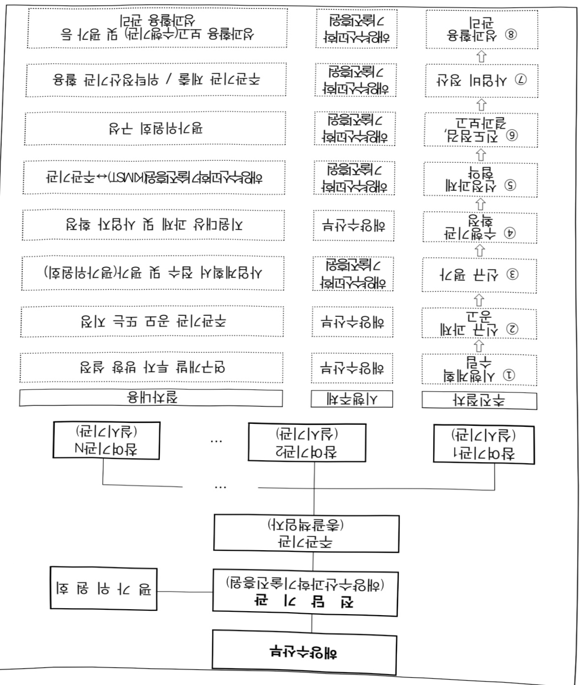

# 해양배터리 특화 데이터 허브 플랫폼 구축 기술 개발(R&D)

**해당 페이지**: PDF 5133 ~ 5141 쪽 해당

**부처**: 해양수산부
**분야**: 교통 및 물류
**회계유형**: 지역균형발전 특별회계
**2026 확정예산**: 2000.0 백만원
**전년대비 증감률**: None%
**AI 도메인**: 데이터, 해양/수산

---

### 가.예산 총괄표

(단위: 백만원, %)

<table border=1 style='margin: auto; word-wrap: break-word;'><tr><td rowspan="2">사업명</td><td rowspan="2">2024년 결산</td><td colspan="2">2025년 예산</td><td colspan="2">2026년</td><td rowspan="2">중감(B-A)</td><td rowspan="2">(B-A)/A</td></tr><tr><td style='text-align: center; word-wrap: break-word;'>본예산(A)</td><td style='text-align: center; word-wrap: break-word;'>추경</td><td style='text-align: center; word-wrap: break-word;'>정부안</td><td style='text-align: center; word-wrap: break-word;'>확정(B)</td></tr><tr><td style='text-align: center; word-wrap: break-word;'>해양배터리 특화 데이터 허브 플랫폼 구축 기술 개발(R&amp;D)</td><td style='text-align: center; word-wrap: break-word;'>-</td><td style='text-align: center; word-wrap: break-word;'>-</td><td style='text-align: center; word-wrap: break-word;'>-</td><td style='text-align: center; word-wrap: break-word;'>2,000</td><td style='text-align: center; word-wrap: break-word;'>2,000</td><td style='text-align: center; word-wrap: break-word;'>2,000</td><td style='text-align: center; word-wrap: break-word;'>순증</td></tr></table>

□ 기능별(내역사업별), 목별 예산 내역

(단위:백만원)

<table border=1 style='margin: auto; word-wrap: break-word;'><tr><td rowspan="3"></td><td colspan="5">2024</td><td colspan="7">2025(2025.12월)</td><td rowspan="3">2026예산</td></tr><tr><td rowspan="2">예산액(추정)</td><td rowspan="2">예산현액</td><td rowspan="2">집행액[실집행액]</td><td rowspan="2">이월액</td><td rowspan="2">불용액</td><td rowspan="2">본예산</td><td rowspan="2">예산현액</td><td rowspan="2">집행액[실집행액]</td><td colspan="2">전년도이월액제외</td><td rowspan="2">이월예산액</td><td rowspan="2">불용예산액</td></tr><tr><td style='text-align: center; word-wrap: break-word;'>예산현액</td><td style='text-align: center; word-wrap: break-word;'>집행액[실집행액]</td></tr><tr><td style='text-align: center; word-wrap: break-word;'>○ 기능별 분류(함께)</td><td style='text-align: center; word-wrap: break-word;'>-</td><td style='text-align: center; word-wrap: break-word;'>-</td><td style='text-align: center; word-wrap: break-word;'>-</td><td style='text-align: center; word-wrap: break-word;'>-</td><td style='text-align: center; word-wrap: break-word;'>-</td><td style='text-align: center; word-wrap: break-word;'>-</td><td style='text-align: center; word-wrap: break-word;'>-</td><td style='text-align: center; word-wrap: break-word;'>-</td><td style='text-align: center; word-wrap: break-word;'>-</td><td style='text-align: center; word-wrap: break-word;'>-</td><td style='text-align: center; word-wrap: break-word;'>-</td><td style='text-align: center; word-wrap: break-word;'>-</td><td style='text-align: center; word-wrap: break-word;'>2,000</td></tr><tr><td style='text-align: center; word-wrap: break-word;'>· 해양배터리 특화데이터 허브 플랫폼 구축 기술 개발</td><td style='text-align: center; word-wrap: break-word;'>-</td><td style='text-align: center; word-wrap: break-word;'>-</td><td style='text-align: center; word-wrap: break-word;'>-</td><td style='text-align: center; word-wrap: break-word;'>-</td><td style='text-align: center; word-wrap: break-word;'>-</td><td style='text-align: center; word-wrap: break-word;'>-</td><td style='text-align: center; word-wrap: break-word;'>-</td><td style='text-align: center; word-wrap: break-word;'>-</td><td style='text-align: center; word-wrap: break-word;'>-</td><td style='text-align: center; word-wrap: break-word;'>-</td><td style='text-align: center; word-wrap: break-word;'>-</td><td style='text-align: center; word-wrap: break-word;'>-</td><td style='text-align: center; word-wrap: break-word;'>2,000</td></tr><tr><td style='text-align: center; word-wrap: break-word;'>○ 비목별 분류(함께)</td><td style='text-align: center; word-wrap: break-word;'>-</td><td style='text-align: center; word-wrap: break-word;'>-</td><td style='text-align: center; word-wrap: break-word;'>-</td><td style='text-align: center; word-wrap: break-word;'>-</td><td style='text-align: center; word-wrap: break-word;'>-</td><td style='text-align: center; word-wrap: break-word;'>-</td><td style='text-align: center; word-wrap: break-word;'>-</td><td style='text-align: center; word-wrap: break-word;'>-</td><td style='text-align: center; word-wrap: break-word;'>-</td><td style='text-align: center; word-wrap: break-word;'>-</td><td style='text-align: center; word-wrap: break-word;'>-</td><td style='text-align: center; word-wrap: break-word;'>-</td><td style='text-align: center; word-wrap: break-word;'>2,000</td></tr><tr><td style='text-align: center; word-wrap: break-word;'>· 연구개발연구활동비등(360-05)</td><td style='text-align: center; word-wrap: break-word;'>-</td><td style='text-align: center; word-wrap: break-word;'>-</td><td style='text-align: center; word-wrap: break-word;'>-</td><td style='text-align: center; word-wrap: break-word;'>-</td><td style='text-align: center; word-wrap: break-word;'>-</td><td style='text-align: center; word-wrap: break-word;'>-</td><td style='text-align: center; word-wrap: break-word;'>-</td><td style='text-align: center; word-wrap: break-word;'>-</td><td style='text-align: center; word-wrap: break-word;'>-</td><td style='text-align: center; word-wrap: break-word;'>-</td><td style='text-align: center; word-wrap: break-word;'>-</td><td style='text-align: center; word-wrap: break-word;'>-</td><td style='text-align: center; word-wrap: break-word;'>2,000</td></tr><tr><td style='text-align: center; word-wrap: break-word;'>○ 기능비목별 분류(함께)</td><td style='text-align: center; word-wrap: break-word;'>-</td><td style='text-align: center; word-wrap: break-word;'>-</td><td style='text-align: center; word-wrap: break-word;'>-</td><td style='text-align: center; word-wrap: break-word;'>-</td><td style='text-align: center; word-wrap: break-word;'>-</td><td style='text-align: center; word-wrap: break-word;'>-</td><td style='text-align: center; word-wrap: break-word;'>-</td><td style='text-align: center; word-wrap: break-word;'>-</td><td style='text-align: center; word-wrap: break-word;'>-</td><td style='text-align: center; word-wrap: break-word;'>-</td><td style='text-align: center; word-wrap: break-word;'>-</td><td style='text-align: center; word-wrap: break-word;'>-</td><td style='text-align: center; word-wrap: break-word;'>2,000</td></tr><tr><td style='text-align: center; word-wrap: break-word;'>· 해양배터리 특화데이터 허브 플랫폼 구축 기술 개발 -연구개발연구활동비등(360-05)</td><td style='text-align: center; word-wrap: break-word;'>-</td><td style='text-align: center; word-wrap: break-word;'>-</td><td style='text-align: center; word-wrap: break-word;'>-</td><td style='text-align: center; word-wrap: break-word;'>-</td><td style='text-align: center; word-wrap: break-word;'>-</td><td style='text-align: center; word-wrap: break-word;'>-</td><td style='text-align: center; word-wrap: break-word;'>-</td><td style='text-align: center; word-wrap: break-word;'>-</td><td style='text-align: center; word-wrap: break-word;'>-</td><td style='text-align: center; word-wrap: break-word;'>-</td><td style='text-align: center; word-wrap: break-word;'>-</td><td style='text-align: center; word-wrap: break-word;'>-</td><td style='text-align: center; word-wrap: break-word;'>2,000</td></tr></table>

### 나.사업설명자료

## 1 ) 사업목적·내용

- (목적) 해양배터리 실운용 데이터 기반 메타데이터 허브 구축 및 국제표준 대응 데이터 관리·분석을 위한 해양배터리 특화 데이터 허브 플랫폼 구축 기술 개발

* 해양환경 특화 해양배터리 데이터 수집·진단 장치·데이터 관리·분석 시스템 각 1식 구축

* 해양배터리 운용·환경·상태 데이터 기반 분석용 데이터 항목 체계 및 시나리오 기반 분석

모델 1식 이상 도출

* 전주기 관점의 해양배터리 메타데이터 허브 시스템 1식 구축

* IALA, ISO/IEC, IMO연계 국제표준 제안 1건 이상, 국내표준(안)/가이드라인 1건 이상

---

## 2 ) 사업개요

## □ 사업근거 및 추진경위

① 법령상 근거 및 조항 적시

°「환경친화적 선박의 개발 및 보급 촉진에 관한 법률」제5조(환경친화적 선박의 보급시행계획) 해양수산부장관은 기본계획을 추진하기 위하여 대통령령으로 정하는 바에 따라 관계 중앙행정기관의 장의 의견을 들어 매년 환경친화적 선박의 보급에 관한 시행계획을 수립 · 추진하여야 한다.

1. 환경친화적 선박의 보급 지원대상

2. 환경친화적 선박의 선종 및 선종별 보급 지원물량

3. 액화천연가스 공급시설 등 기반시설 구축에 관한 사항

4. 재원조달방안 및 재정지원의 기준에 관한 사항

5. 그 밖에 환경친화적 선박의 보급을 위하여 필요한 사항

° | 데이터 산업진흥 및 이용촉진에 관한 기본법」26조(기술개발의 촉진 및 시범사업 지원) 과학기술정보통신부장관은 데이터의 생산·거래 및 활용에 관한 기술개발의 추진과 관련하여 민간 부문의 데이터 관련 기술 연구개발을 활성화하고 연구개발투자의 확대를 유도하기 위한 지원시책을 세우고 추진하여야 한다.

1. 기술의 발전목표 및 산업에의 적용 방안

2. 기술개발 촉진을 위한 투자 재원의 확보

3. 기술개발을 위한 연구개발사업의 추진과 산업계·학계·공공기관 간의 협동연구 및 학제 간 연구의 촉진 방안

4. 기술 연구인력·시설 및 정보 등 연구기반의 확충

5. 국제협력의 촉진

6. 연구성과의 확산 및 기술이전

○「선박안전법」 제1조(목적)선박의 구조·설비 및 안전성을 확보함으로써 해상에서의 인명과 재산을 보호하고 해양환경 보전에 이바지함을 목적으로 한다. 제15조(선박의 검사) 해양수산부장관은 선박의 안전성 확보를 위하여 대통령령으로 정하는 바에 따라 정기검사, 임시검사 등 필요한 검사를 하여야 한다. 제28조(기술기준의 제정) 선박의 구조·설비 및 안전에 관한 기술기준은 해양수산부령으로 정한다.

°「항로표지법」제1조(목적) 항로표지를 설치·관리함으로써 선박의 안전한 항행을 도모하고 해양사고를 예방함을 목적으로 한다. 제5조(항로표지의 설치·관리) 해양

---

수산부장관은 항로표지를 효율적으로 설치·관리하기 위하여 대통령령으로 정하는 바에 따라 필요한 조치를 하여야 한다. 제17조(항로표지의 기술기준 등) 항로표지의 구조·성능·설치기준 및 관리에 관한 사항은 해양수산부령으로 정한다.

°「제5차 과학기술 기본계획」(22.12)

°「제1차 데이터산업 진흥 기본계획」(23.01)

°「2023 온실가스 감축전략」(23.07)

°「2024년 한국형 친환경선박 보급시행계획」(24.01)

## ② 추진경위(국정과제(안))

° [경2-2] 과학기술 5대 강국 실현을 위한 과학기술 시스템 혁신

- (6) 지역자율 R&D지원으로 지역혁신역량 제고와 부합

·해양배터리는 전략 품목을 중심으로, 지역 수요·공급 연계형 실증 기반

마련 및 산업화 추진

° [경2-23] 세계를 선도할 넥스트(NEXT) 전략기술 육성

- (1) 민관협업 기반 미래전략기술 집중 육성

·민관협력 기반 해양에너지 전환 기술과 스마트 해양 모빌리티 분야의 미래 기술 육성

- (3) 공공R&D 성과 확산체계 구축 및 딥테크 실험실창업 지원 강화

·데이터 기반 플랫폼 구축 및 기술사업화 중심 공공 R&D 성과 확산체계 구축과 정합

°[경2-24] 안전한 나라, 안심하고 이용하는 AI

- (2) AI 오남용 대응 등 AI안전·신뢰 확보 기반 조성

·해양배터리 안전 데이터를 기반으로 한 신뢰성 확보 체계 및 산업 품질 관리 기반 마련

- (3) 글로벌 AI 규범 및 국제 표준 정립 주도

·글로벌 안전기준 대응 및 국제표준 선도 가능성 확보

---

## □ 주요내용

① 사업규모

- 총사업비(해당되는 경우에만 기재) : 250억원(국고 212.5억원)

- 사업기간 : '26년 ~ '30년

- 최근 5년 간 투입된 사업비(예산액기준, 추경편성한 연도에는 추경포함)

<table border=1 style='margin: auto; word-wrap: break-word;'><tr><td style='text-align: center; word-wrap: break-word;'>$ \underline{\text{연도}} $</td><td style='text-align: center; word-wrap: break-word;'>2022</td><td style='text-align: center; word-wrap: break-word;'>2023</td><td style='text-align: center; word-wrap: break-word;'>2024</td><td style='text-align: center; word-wrap: break-word;'>2025</td><td style='text-align: center; word-wrap: break-word;'>2026</td></tr><tr><td style='text-align: center; word-wrap: break-word;'>$ \underline{\text{사업비}} $</td><td style='text-align: center; word-wrap: break-word;'>-</td><td style='text-align: center; word-wrap: break-word;'>-</td><td style='text-align: center; word-wrap: break-word;'>-</td><td style='text-align: center; word-wrap: break-word;'>-</td><td style='text-align: center; word-wrap: break-word;'>2,000</td></tr></table>

② 사업추진체계

- 사업시행방법 : 출연(국고 100%)

- 사업시행주체 : -

- 사업 수혜자 : 국내 배터리 중소기업, 실증장비·부이 제조기업, 해양ICT 솔루션 기업 등

- 보조, 융자, 출연, 출자 등의 경우 보조·융자 등 지원 비율 및 법적 근거

<table border=1 style='margin: auto; word-wrap: break-word;'><tr><td style='text-align: center; word-wrap: break-word;'>내역사업명</td><td style='text-align: center; word-wrap: break-word;'>구분</td><td style='text-align: center; word-wrap: break-word;'>피보조·피출연 등 기관명</td><td style='text-align: center; word-wrap: break-word;'>지원 금액 (2026예산)</td><td style='text-align: center; word-wrap: break-word;'>지원 비율(%)</td><td style='text-align: center; word-wrap: break-word;'>보조율 법적근거 (해당 조항)</td></tr><tr><td style='text-align: center; word-wrap: break-word;'>해양배터리 특화 데이터 허브 플랫폼 구축 기술 개발(R&amp;D)</td><td style='text-align: center; word-wrap: break-word;'>출연</td><td style='text-align: center; word-wrap: break-word;'>국내 배터리 중소기업, 실증장비·부이 제조기업, 해양ICT 솔루션 기업 등</td><td style='text-align: center; word-wrap: break-word;'>2,000</td><td style='text-align: center; word-wrap: break-word;'>100</td><td style='text-align: center; word-wrap: break-word;'>환경친화적 선박의 개발 및 보급 촉진에 관한 법률 제5조, 데이터 산업진흥 및 이용 촉진에 관한 기본법 제26조</td></tr></table>

## 3 ) 2026년도 예산 산출 근거

☐ 해양배터리 특화 데이터 허브 플랫폼 구축 기술 개발 : (2025) 000 → (2026 예산) 2,000백만원, 순증

☐ 해양배터리 특화 데이터 허브 플랫폼 구축 기술 개발 : (2025) 000 → (2026 예산) 2,000백만원, 순증 - (요구) 해양배터리 데이터 표준화 및 기술 선도를 통한 글로벌 경쟁력 확보

- (산출)

① (해양배터리 실시간 데이터 수집 및 진단 기술) 해양배터리 데이터 발굴·체계 정립, 실시간 데이터 수집 및 동기화 기술 개발, 안정적 데이터 수집 장치·네트워크 기술 개발을 통해 실운용 데이터 수집·진단·분석 시스템 구축

② (해양배터리 메타데이터 허브 구축 및 AI 분석 기반 기술) 전주기 관계형 메타데이터 허브플랫폼 구축, 배터리 성능분석 알고리즘, 맞춤형 데이터 융합 데이터모델·시제품 개발을 통해 해양환경에 최적화된 배터리 안정성 확보 및 운영 효율화

---

③ (국제표준 연계형 해양배터리 데이터 신뢰성 검증 및 활용기술) 해양데이터 신뢰성 확보, 국제표준연계 국내표준개발, 오픈소스 기반 참조 구현(GAIA-X 적용)을 통해 글로벌 경쟁력 확보

- (신규) 3개 과제 x 2,666.67백만원 x 9/12개월 = 2,000백만원

°2025년도 예산 및 2026년도 예산 산출 세부내역 비교(국비)

<table border=1 style='margin: auto; word-wrap: break-word;'><tr><td colspan="2">2025년 예산</td><td colspan="2">2026년 예산</td></tr><tr><td style='text-align: center; word-wrap: break-word;'>예산</td><td style='text-align: center; word-wrap: break-word;'>산출내역</td><td style='text-align: center; word-wrap: break-word;'>예산</td><td style='text-align: center; word-wrap: break-word;'>산출내역</td></tr><tr><td style='text-align: center; word-wrap: break-word;'>-</td><td style='text-align: center; word-wrap: break-word;'>-</td><td style='text-align: center; word-wrap: break-word;'>해양배터리 실시간 데이터 수집 및 진단 기술 635백만원</td><td style='text-align: center; word-wrap: break-word;'>&lt; 해양 맞춤형 배터리 운용 데이터 체계 &gt; 248.2백만원 가. 해양환경 모니터링 센서 2식 = 255백만원 나. 운용데이터 수집시스템 1식 = 59.6백만원 다. 통신/프로토콜 장치 구축 1식 = 39.7백만원 &lt; 국한 해양환경 대응 데이터 수집 시스템 &gt; 223.3백만원 가. 고내구성 방수 하우징 2식 = 99.3백만원 나. 극한환경 시험모듈 1식 = 74.4백만원 다. 온도/진동센서 복합장치 1식 = 49.6백만원 &lt; 해상 배터리 모니터링 및 진단 &gt; 163.8백만원 가. 진단 알고리즘 SW개발 1식 = 59.6백만원 나. 클라우드 연계 시스템 구축 1식 = 59.6백만원 다. 운영 매뉴얼 및 검증보고서 작성 1식 = 44.7백만원</td></tr><tr><td style='text-align: center; word-wrap: break-word;'>-</td><td style='text-align: center; word-wrap: break-word;'>-</td><td style='text-align: center; word-wrap: break-word;'>해양배터리 메타데이터 허브 구축 및 AI 분석 기반 기술 965백만원</td><td style='text-align: center; word-wrap: break-word;'>&lt; 해양옛지클라우드 기반 데이터 허브 플랫폼 &gt; 965백만원 가. 데이터 허브용 고성능 DB서버 2식 = 70.3백만원 나. AI분석용 GPU 서버 3대 = 90.4백만원 다. 보안 서버 및 스토리지 2식 = 60.3백만원 &lt; 해양환경 특화 배터리 성능 측정 및 열화 모델 &gt; 422.1백만원 가. 열화 재현 및 예측 TB 설계 2식 = 160.8백만원 나. 배터리 상태 측정 모듈 3식 = 120.6백만원 다. 환경센서·배터리 연동 시험장비 2식 = 140.7백만원 &lt; 선박, 해양설비 맞춤형 배터리 데이터 용합 모델 &gt; 321.6백만원 가. 배터리 용합 시뮬레이터 및 연계시스템 2식 = 180.9백만원 나. 데이터 용합 매뉴 소프트웨어 1식 = 60.3백만원 다. 다중소스 데이터 정제 및 시각화 모듈 1식 = 80.4백만원</td></tr><tr><td style='text-align: center; word-wrap: break-word;'>-</td><td style='text-align: center; word-wrap: break-word;'>-</td><td style='text-align: center; word-wrap: break-word;'>국제표준 연계형 해양배터리 데이터 신뢰성 검증 및 활용기술 400백만원</td><td style='text-align: center; word-wrap: break-word;'>&lt; 해양배터리 글로벌 표준화 선도 &gt; 120백만원 가. 국제 대응 시험인증 장비 2식 = 80백만원 나. 국제 인증 실증 시나리오 설계 1식 = 20백만원 다. 해외 인증기관 협의체 운영 1식 = 20백만원 &lt; 해양배터리 데이터 전문가 &gt; 130백만원 가. 해양배터리 데이터 교육 모듈 개발 1식 = 60백만원 나. 지자체 연계 지역교육 프로그램 1식 = 40백만원 다. 전문가 양성 커리큘럼 운영비 1식 = 30백만원 &lt; 해양배터리 데이터 서버 &gt; 150백만원 가. 데이터 허브 플랫폼 DB서버 2식 = 40백만원 나. AI컴퓨팅 서버 3식 = 90백만원 다. 스토리지 확장 NAS 장비 1식 = 20백만원</td></tr></table>

---

## 4 ) 사업효과

☐ 사업영향, 산출물 성과지표 등

①2022~2026년도 성과계획서상 성과지표 및 최근 5년간 성과 달성도

<table border=1 style='margin: auto; word-wrap: break-word;'><tr><td style='text-align: center; word-wrap: break-word;'>성과지표</td><td style='text-align: center; word-wrap: break-word;'>구분</td><td style='text-align: center; word-wrap: break-word;'>2022</td><td style='text-align: center; word-wrap: break-word;'>2023</td><td style='text-align: center; word-wrap: break-word;'>2024</td><td style='text-align: center; word-wrap: break-word;'>2025</td><td style='text-align: center; word-wrap: break-word;'>2026</td><td style='text-align: center; word-wrap: break-word;'>2026 목표치산출근거</td><td style='text-align: center; word-wrap: break-word;'>측정산식(또는 측정방법)</td><td style='text-align: center; word-wrap: break-word;'>자료수집방법(또는 자료출처)</td></tr><tr><td rowspan="3">해양수산일자리 장출 수(단위: 명)</td><td style='text-align: center; word-wrap: break-word;'>목표</td><td style='text-align: center; word-wrap: break-word;'>87</td><td style='text-align: center; word-wrap: break-word;'>160</td><td style='text-align: center; word-wrap: break-word;'>221</td><td style='text-align: center; word-wrap: break-word;'>255</td><td style='text-align: center; word-wrap: break-word;'>261</td><td rowspan="3">최근 3년 평균값을 기준으로 설정하고, 3개년 평균값 대비 15% 상향한 도전적 목표 제시</td><td rowspan="3">해양수산 창업투자 R&amp;D 지원사업 수혜기업의 신규 고용창출 수</td><td rowspan="3">해양수산과학기술 진흥원(KIMST) 보고서</td></tr><tr><td style='text-align: center; word-wrap: break-word;'>실적</td><td style='text-align: center; word-wrap: break-word;'>188</td><td style='text-align: center; word-wrap: break-word;'>252</td><td style='text-align: center; word-wrap: break-word;'>227</td><td style='text-align: center; word-wrap: break-word;'>-</td><td style='text-align: center; word-wrap: break-word;'>-</td></tr><tr><td style='text-align: center; word-wrap: break-word;'>달성도</td><td style='text-align: center; word-wrap: break-word;'>100</td><td style='text-align: center; word-wrap: break-word;'>100</td><td style='text-align: center; word-wrap: break-word;'>100</td><td style='text-align: center; word-wrap: break-word;'>-</td><td style='text-align: center; word-wrap: break-word;'>-</td></tr></table>

② 성과지표 이외의 연도별 사업추진 경과 및 실적 : 해당 없음

③향후(2026년도 이후)기대효과

- 실해역 환경에서 운용되는 해양배터리의 안전·운용 데이터의 체계적인 축적으로

실해역 기반 해양배터리 운용·안전 데이터셋 3종 이상 구축

→ 해양환경 특성을 반영한 데이터 수집·관리 체계 마련

- 실해역 운용 데이터 기반의 해양배터리 상태 분석 가능, 운용·환경·상태 정보를 포함한 데이터 항목 체계 1식 정립

→ 향후 고도 분석 및 예측 기술 개발을 위한 데이터 준비도(Data Readiness) 제고

- 데이터 허브 플랫폼을 통해 축적·관리되는 해양배터리 데이터 활용으로 중소기업 대상 데이터 활용 실증 연계 5건 내외 지원, 국내 인증·표준 대응을 위한 데이터 활용 시나리오 2건 이상 도출

→자율운항선박·무인부이 등 해양모빌리티 분야 확산을 위한 기반 조성

5) 타당성조사 및 예비타당성조사 시행여부 및 결과 요지: 해당 없음

6) 총사업비 대상사업 여부 및 내역 : 해당 없음

---

---

## 8 ) 각종 평가

1) 국회(예결위, 상임위, 예정처, 국정감사 포함) 지적 : 해당없음

2) 대외공개 평가 : 해당없음

3) 자체평가 : 해당없음

### 다. 최근 4년간 결산내역: 해당 없음

---

<table border=1 style='margin: auto; word-wrap: break-word;'><tr><td style='text-align: center; word-wrap: break-word;'>사 업 명</td></tr><tr><td style='text-align: center; word-wrap: break-word;'>(6) 해양수산 신산업 육성 및 기업 투자유치 지원(2031-300)</td></tr></table>

□사업 코드 정보

<table border=1 style='margin: auto; word-wrap: break-word;'><tr><td style='text-align: center; word-wrap: break-word;'>구분</td><td style='text-align: center; word-wrap: break-word;'>회계</td><td style='text-align: center; word-wrap: break-word;'>소관</td><td style='text-align: center; word-wrap: break-word;'>실국(기관)</td><td style='text-align: center; word-wrap: break-word;'>계정</td><td style='text-align: center; word-wrap: break-word;'>분야</td><td style='text-align: center; word-wrap: break-word;'>부문</td></tr><tr><td style='text-align: center; word-wrap: break-word;'>코드</td><td style='text-align: center; word-wrap: break-word;'>39</td><td style='text-align: center; word-wrap: break-word;'>28</td><td style='text-align: center; word-wrap: break-word;'>해양정책실</td><td style='text-align: center; word-wrap: break-word;'>지역지원</td><td style='text-align: center; word-wrap: break-word;'>120</td><td style='text-align: center; word-wrap: break-word;'>126</td></tr><tr><td style='text-align: center; word-wrap: break-word;'>명칭</td><td style='text-align: center; word-wrap: break-word;'>지특회계</td><td style='text-align: center; word-wrap: break-word;'>해양수산부</td><td style='text-align: center; word-wrap: break-word;'>해양정책관</td><td style='text-align: center; word-wrap: break-word;'>계정</td><td style='text-align: center; word-wrap: break-word;'>교통 및 물류</td><td style='text-align: center; word-wrap: break-word;'>물류 등 기타</td></tr></table>

<table border=1 style='margin: auto; word-wrap: break-word;'><tr><td style='text-align: center; word-wrap: break-word;'>구분</td><td style='text-align: center; word-wrap: break-word;'>프로그램</td><td style='text-align: center; word-wrap: break-word;'>단위사업</td><td style='text-align: center; word-wrap: break-word;'>세부사업</td></tr><tr><td style='text-align: center; word-wrap: break-word;'>코드</td><td style='text-align: center; word-wrap: break-word;'>2000</td><td style='text-align: center; word-wrap: break-word;'>2031</td><td style='text-align: center; word-wrap: break-word;'>300</td></tr><tr><td style='text-align: center; word-wrap: break-word;'>명칭</td><td style='text-align: center; word-wrap: break-word;'>해양산업육성 및 영토관리</td><td style='text-align: center; word-wrap: break-word;'>해양문화활성화</td><td style='text-align: center; word-wrap: break-word;'>해양수산 신산업 육성 및 기업 투자유치 지원</td></tr></table>

□ 사업 성격 (공통요구자료 Ⅱ-1 작성유의사항 4.참조,해당하는 사항에 "O" 표시)

<table border=1 style='margin: auto; word-wrap: break-word;'><tr><td rowspan="2">신규</td><td rowspan="2">계속</td><td rowspan="2">완료</td><td rowspan="2">예비타당성 실시여부</td><td rowspan="2">총사업비 관리대상</td><td rowspan="2">총액계상 예산사업</td><td style='text-align: center; word-wrap: break-word;'>사업소관 변경정보</td></tr><tr><td style='text-align: center; word-wrap: break-word;'>2025예산 시 소관</td></tr><tr><td style='text-align: center; word-wrap: break-word;'></td><td style='text-align: center; word-wrap: break-word;'>○</td><td style='text-align: center; word-wrap: break-word;'></td><td style='text-align: center; word-wrap: break-word;'></td><td style='text-align: center; word-wrap: break-word;'>○</td><td style='text-align: center; word-wrap: break-word;'></td><td style='text-align: center; word-wrap: break-word;'></td></tr></table>

□사업지원형태 및지원을(최소한한개는반드시선택하시오.해당사항에O표시)

<table border=1 style='margin: auto; word-wrap: break-word;'><tr><td style='text-align: center; word-wrap: break-word;'>직접</td><td style='text-align: center; word-wrap: break-word;'>출자</td><td style='text-align: center; word-wrap: break-word;'>출연</td><td style='text-align: center; word-wrap: break-word;'>보조</td><td style='text-align: center; word-wrap: break-word;'>융자</td><td style='text-align: center; word-wrap: break-word;'>국고보조율(%)</td><td style='text-align: center; word-wrap: break-word;'>융자율(%)</td></tr><tr><td style='text-align: center; word-wrap: break-word;'>○</td><td style='text-align: center; word-wrap: break-word;'></td><td style='text-align: center; word-wrap: break-word;'>○</td><td style='text-align: center; word-wrap: break-word;'>○</td><td style='text-align: center; word-wrap: break-word;'></td><td style='text-align: center; word-wrap: break-word;'>70%</td><td style='text-align: center; word-wrap: break-word;'></td></tr></table>

## □ 사업 담당자

<table border=1 style='margin: auto; word-wrap: break-word;'><tr><td style='text-align: center; word-wrap: break-word;'>사업명</td><td colspan="2">구분</td></tr><tr><td rowspan="4">타갯기업투자 확대 및 일자리 창출지원 등</td><td rowspan="3">소관부처</td><td style='text-align: center; word-wrap: break-word;'>실·국·과(팀)명</td></tr><tr><td style='text-align: center; word-wrap: break-word;'>해양정책관</td></tr><tr><td style='text-align: center; word-wrap: break-word;'>해양수산 과학기술정책과</td></tr><tr><td style='text-align: center; word-wrap: break-word;'>사업시행주체</td><td style='text-align: center; word-wrap: break-word;'>해양수산과학기술진흥원 창업투자팀</td></tr><tr><td style='text-align: center; word-wrap: break-word;'>국내 해양 플랜트 서비스 산업 촉진</td><td style='text-align: center; word-wrap: break-word;'>소관부처 사업시행주체</td><td style='text-align: center; word-wrap: break-word;'>실·국·과(팀)명 해양정책관 해양개발과</td></tr><tr><td style='text-align: center; word-wrap: break-word;'>해양심층수 수질검사</td><td style='text-align: center; word-wrap: break-word;'>소관부처</td><td style='text-align: center; word-wrap: break-word;'>실·국·과(팀)명 해양정책관 해양개발과</td></tr><tr><td style='text-align: center; word-wrap: break-word;'>권역별 해양바이오 인프라 구축</td><td style='text-align: center; word-wrap: break-word;'>소관부처</td><td style='text-align: center; word-wrap: break-word;'>실·국·과(팀)명 해양정책관 해양수산 생명자원과</td></tr></table>

---

### 원본 PDF 크롭 이미지

