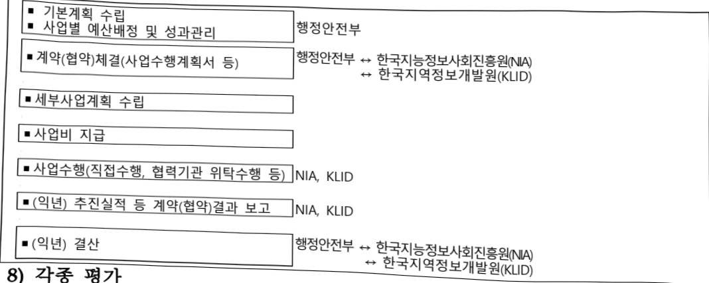

# 공공데이터개방및이용활성화지원(정보화)

**해당 페이지**: PDF 5166 ~ 5176 쪽 해당

**부처**: 행정안전부
**분야**: 일반·지방행정
**회계유형**: 일반회계
**2026 확정예산**: 40662.0 백만원
**전년대비 증감률**: -2.3%
**AI 도메인**: 데이터, 교육/인재

---

### 가. 예산 총괄표

(단위: 백만원, %)

<table border=1 style='margin: auto; word-wrap: break-word;'><tr><td rowspan="2">사업명</td><td rowspan="2">2024년 결산</td><td colspan="2">2025년 예산</td><td colspan="2">2026년 예산</td><td rowspan="2">증감(B-A)</td><td rowspan="2">(B-A)/A</td></tr><tr><td style='text-align: center; word-wrap: break-word;'>본예산</td><td style='text-align: center; word-wrap: break-word;'>추경*(A)</td><td style='text-align: center; word-wrap: break-word;'>요구안</td><td style='text-align: center; word-wrap: break-word;'>본예산(B)</td></tr><tr><td style='text-align: center; word-wrap: break-word;'>공공데이터 개방 및 이용활성화 지원(정보화)</td><td style='text-align: center; word-wrap: break-word;'>44,925</td><td style='text-align: center; word-wrap: break-word;'>41,634</td><td style='text-align: center; word-wrap: break-word;'>41,634</td><td style='text-align: center; word-wrap: break-word;'>40,662</td><td style='text-align: center; word-wrap: break-word;'>40,662</td><td style='text-align: center; word-wrap: break-word;'>△972</td><td style='text-align: center; word-wrap: break-word;'>△2.33</td></tr></table>

*추경: 추경증감액을 포함한 최종 예산액을 기재

## □ 기능별(내역사업별) 예산 내역

(단위: 백만원)

<table border=1 style='margin: auto; word-wrap: break-word;'><tr><td rowspan="2"></td><td colspan="5">2024</td><td colspan="5">2025</td><td rowspan="2">2026예산</td></tr><tr><td style='text-align: center; word-wrap: break-word;'>예산액(추경)</td><td style='text-align: center; word-wrap: break-word;'>예산현액</td><td style='text-align: center; word-wrap: break-word;'>집행액</td><td style='text-align: center; word-wrap: break-word;'>이월액</td><td style='text-align: center; word-wrap: break-word;'>불용액</td><td style='text-align: center; word-wrap: break-word;'>예산액(추경)</td><td style='text-align: center; word-wrap: break-word;'>예산현액</td><td style='text-align: center; word-wrap: break-word;'>집행액</td><td style='text-align: center; word-wrap: break-word;'>이월액</td><td style='text-align: center; word-wrap: break-word;'>불용액</td></tr><tr><td style='text-align: center; word-wrap: break-word;'>○ 기능별 분류(함께)</td><td style='text-align: center; word-wrap: break-word;'>44,925</td><td style='text-align: center; word-wrap: break-word;'>44,925</td><td style='text-align: center; word-wrap: break-word;'>44,925</td><td style='text-align: center; word-wrap: break-word;'>-</td><td style='text-align: center; word-wrap: break-word;'>-</td><td style='text-align: center; word-wrap: break-word;'>41,634</td><td style='text-align: center; word-wrap: break-word;'>41,634</td><td style='text-align: center; word-wrap: break-word;'>41,634</td><td style='text-align: center; word-wrap: break-word;'>-</td><td style='text-align: center; word-wrap: break-word;'>-</td><td style='text-align: center; word-wrap: break-word;'>40,662</td></tr><tr><td rowspan="6">· 공공데이터 제공기반 조성· 차세대 공공데이터포털 구축· 공공데이터 구축개방 확대· 공공데이터 품질제고· 공공데이터 이용· 활성화 지원· 공공데이터 기업지원</td><td style='text-align: center; word-wrap: break-word;'>1,452</td><td style='text-align: center; word-wrap: break-word;'>1,452</td><td style='text-align: center; word-wrap: break-word;'>1,452</td><td style='text-align: center; word-wrap: break-word;'>-</td><td style='text-align: center; word-wrap: break-word;'>-</td><td style='text-align: center; word-wrap: break-word;'>1,640</td><td style='text-align: center; word-wrap: break-word;'>1,640</td><td style='text-align: center; word-wrap: break-word;'>1,640</td><td style='text-align: center; word-wrap: break-word;'>-</td><td style='text-align: center; word-wrap: break-word;'>-</td><td style='text-align: center; word-wrap: break-word;'>1,692</td></tr><tr><td style='text-align: center; word-wrap: break-word;'>6,819</td><td style='text-align: center; word-wrap: break-word;'>6,819</td><td style='text-align: center; word-wrap: break-word;'>6,819</td><td style='text-align: center; word-wrap: break-word;'>-</td><td style='text-align: center; word-wrap: break-word;'>-</td><td style='text-align: center; word-wrap: break-word;'>5,120</td><td style='text-align: center; word-wrap: break-word;'>5,120</td><td style='text-align: center; word-wrap: break-word;'>5,120</td><td style='text-align: center; word-wrap: break-word;'>-</td><td style='text-align: center; word-wrap: break-word;'>-</td><td style='text-align: center; word-wrap: break-word;'>-</td></tr><tr><td style='text-align: center; word-wrap: break-word;'>26,410</td><td style='text-align: center; word-wrap: break-word;'>26,410</td><td style='text-align: center; word-wrap: break-word;'>26,410</td><td style='text-align: center; word-wrap: break-word;'>-</td><td style='text-align: center; word-wrap: break-word;'>-</td><td style='text-align: center; word-wrap: break-word;'>26,410</td><td style='text-align: center; word-wrap: break-word;'>26,410</td><td style='text-align: center; word-wrap: break-word;'>26,410</td><td style='text-align: center; word-wrap: break-word;'>-</td><td style='text-align: center; word-wrap: break-word;'>-</td><td style='text-align: center; word-wrap: break-word;'>30,506</td></tr><tr><td style='text-align: center; word-wrap: break-word;'>7,580</td><td style='text-align: center; word-wrap: break-word;'>7,580</td><td style='text-align: center; word-wrap: break-word;'>7,580</td><td style='text-align: center; word-wrap: break-word;'>-</td><td style='text-align: center; word-wrap: break-word;'>-</td><td style='text-align: center; word-wrap: break-word;'>6,316</td><td style='text-align: center; word-wrap: break-word;'>6,316</td><td style='text-align: center; word-wrap: break-word;'>6,316</td><td style='text-align: center; word-wrap: break-word;'>-</td><td style='text-align: center; word-wrap: break-word;'>-</td><td style='text-align: center; word-wrap: break-word;'>6,316</td></tr><tr><td style='text-align: center; word-wrap: break-word;'>1,784</td><td style='text-align: center; word-wrap: break-word;'>1,784</td><td style='text-align: center; word-wrap: break-word;'>1,784</td><td style='text-align: center; word-wrap: break-word;'>-</td><td style='text-align: center; word-wrap: break-word;'>-</td><td style='text-align: center; word-wrap: break-word;'>1,268</td><td style='text-align: center; word-wrap: break-word;'>1,268</td><td style='text-align: center; word-wrap: break-word;'>1,268</td><td style='text-align: center; word-wrap: break-word;'>-</td><td style='text-align: center; word-wrap: break-word;'>-</td><td style='text-align: center; word-wrap: break-word;'>1,268</td></tr><tr><td style='text-align: center; word-wrap: break-word;'>880</td><td style='text-align: center; word-wrap: break-word;'>880</td><td style='text-align: center; word-wrap: break-word;'>880</td><td style='text-align: center; word-wrap: break-word;'>-</td><td style='text-align: center; word-wrap: break-word;'>-</td><td style='text-align: center; word-wrap: break-word;'>880</td><td style='text-align: center; word-wrap: break-word;'>880</td><td style='text-align: center; word-wrap: break-word;'>880</td><td style='text-align: center; word-wrap: break-word;'>-</td><td style='text-align: center; word-wrap: break-word;'>-</td><td style='text-align: center; word-wrap: break-word;'>880</td></tr></table>

### 나. 사업설명자료

## 1 ) 사업목적·내용

- (공공데이터 제공 기반 조성) 공공데이터 정책 심의·검토를 위한 공공데이터전략위원회 운영, 공공데이터 제공 분쟁조정처리, 사무국 운영 등 민·관 협의체 운영 추진 및 대국민 공공데이터 제공을 위한 공공데이터 포털 운영·유지 보수 등

- (공공데이터 구축 개방 확대) AI 학습용 공공데이터 가공, 공공데이터 개방DB 구축, 공공데이터 개방 가능성 점검 및 개선, 공공데이터 제공 확대, 민·관 협업 기반 데이터

---

구축·개방 확대 및 전국 통합(지자체) 데이터 개방 확대

- (공공데이터 품질 제고) 공공데이터의 안정적 품질관리와 적정 품질관리 수준 확보를 위해 품질관리 수준진단·평가 실시 및 데이터 표준화 확대 추진 등

- (공공데이터 이용활성화 지원) 공공데이터 제공 운영실태 평가, 민관협력 포럼 운영 및 창업경진대회 개최, 공공데이터 통합 콜센터 운영, 범정부 공공데이터 중장기 개방계획 이행, 공공데이터 개방 교육 훈련, 공공데이터 민간중복유사서비스 정비, 공공데이터 활용기업 실태조사 등 추진

- (공공데이터 활용기업 지원) 공공데이터 활용기업 맞춤형 지원 운영, 지역거점 오픈 스케어-D 운영 관리

## 2 ) 사업개요

## □ 사업근거 및 추진경위

① 법령상 근거 및 조항 적시

- 공공데이터 제공 및 이용 활성화에 관한 법률(2013.10 시행)

② 추진경위

[2013년]

- 공공데이터의 제공 및 이용 활성화에 관한 법률 시행('13.10.31.)

- '공공데이터전략위원회' 출범, '공공데이터제공 분쟁조정위원회' 출범('13.12)

- 제1차('14~'16) 공공데이터 기본계획 수립(공공데이터전략위, '13.12)

[2014년]

- '공공데이터 개방 발전전략' 심의·의결(공공데이터전략위, '14.9.16)

- '국가 중점개방 데이터 개방 계획' 심의·의결(공공데이터전략위, '14.12.30)

- 공공데이터 관리지침 제정, 고시('14.3.), 공공데이터 개방 표준 제정, 고시('14.10.)

[2015년]

- 제1차('15~'16) 국가중점데이터 개방 추진(부동산, 건축 등 11개 분야 개방)

- 대한민국 OECD 공공데이터 개방지수 1위 달성('15.7.6, 'Government at a Glance 2015')

- '민간창업 촉진을 위한 모바일 공공앱 등 공공데이터 활용 서비스 개선 방안' 보고 (국무회의, '15.2)

[2016년]

- 공공데이터 품질관리 추진계획 수립(공공데이터전략위원회, '16.2)

- 공공기관 앱·웹서비스 대상 민간서비스와 중복·유사서비스 정비계획 수립(16.2)

- 제2차('17~'19) 공공데이터 기본계획 수립(공공데이터전략위, '16.12)

- 제2차('17~'19) 국가중점데이터 개방 계획 수립(공공데이터전략위, '16.12)

---

[2017년]

- '공공데이터 활용 창업지원 콜라보(Collabo) 프로젝트 운영계획' 수립('17.5)

- 대한민국 OECD 공공데이터 개방지수 2회 연속 1위 달성('17.7, 'Government at a Glance 2017')

-민간주도의'오픈데이터포럼'출범('17.7)

- 제5회 범정부 공공데이터 활용 창업경진대회 개최('17.10)

[2018년]

- 제3기 공공데이터전략위 출범 및 공공데이터 혁신전략 수립('18.2)

- 공공기관 보유데이터 전수조사 실시('18.5~8)

- 범정부 데이터 통합관리를 위한 메타데이터 관리시스템 1차 구축('18.7~19.3)

[2019년]

- 2019년도 공공데이터 제공 및 이용활성화 시행계획 수립(공공데이터전략위, '19.2)

- 범정부 공공데이터 중장기('19~'21) 개방계획 마련(공공데이터전략위, '19.2)

- 대한민국 OECD 공공데이터 개방지수 3회 연속 1위 달성('19.11, 'Government at a Glance 2019')

- 제3차('20~22) 공공데이터 제공 및 이용활성화 기본계획 수립(공공데이터전략위, '19.12.)

- 제3차('20~22) 국가 중점개방 데이터 개방계획 수립(공공데이터전략위, '19.12.)

- 공공데이터 품질관리 중장기계획 수립('19.12.)

- 디지털 정부혁신('19.11.)

6. 개방형 데이터·서비스 생태계 구축

1 범정부 데이터 연계·활용 기반 강화

2 국민에게 가치있는 공공데이터 개방 확대

- 메타데이터 관리시스템 확대 구축('19.9~20.3)

[2020년]

- 제4기 공공데이터전략위원회 출범(20.5.)

- 제1회 OECD 디지털정부평가 '열린 정부' 부분 1위 달성('20.10.)

- 공공부문 비정형데이터 관리 실태조사 실시('20.6.~12.)

[2021년]

- 「공공데이터 개방 2.0」 추진전략 수립('20.4.)

- 공공데이터 14.7만개 전면 개방 완료(103.5% 초과달성, '21.12.)

- 공공데이터 제공 표준 개정(2회, 10.26./12.15.)

[2022년]

- 제5기 공공데이터전략위원회 출범('22.12.)

- 제4차('23~'25) 공공데이터 제공 및 이용 활성화 기본계획」 수립('22.12.)

- 메타데이터 기반 공공데이터 중장기('23~'25) 개방 이행계획 수립

- 비정형 공공데이터 개방·등록을 위한 가이드 마련 및 기관 배포('22.9.)

-공공데이터 품질인증제 도입, 예방적 품질관리 진단체계 확대 적용(1,755개 사업)

---

및 공공데이터 품질관리 수준진단·평가 추진(687개 기관 5,979여개 DB)

- 공공데이터 제공표준 32종 추가 제정(누적 169종) 및 공통표준용어 631종 추가제정(누적 1,686종)

[2023년]

- 공공데이터 활용성 예측·진단 서비스 구축(11월) 및 시범 운영

- 제4차('23~'25) 국가 중점개방 데이터 개방계획 수립(공공데이터전략위, '23.4.)

- 공공데이터 제공표준 34종 추가제정(누적 203종) 및 공통표준용어 3,700종 추가 제정(누적 5,386종)

- 공공데이터 품질관리 수준진단·평가(697개 기관) 및 우수기관 품질인증 부여(23개 기관)

- 행정·공공기관 메타데이터 관리시스템 확대 보급(818개) 완료

[2024년]

- '24년 국가중점데이터 개방계획 수립('24.2.)

- 메타데이터 기반 범정부 공공데이터 개방계획('24~'25년) 수립('24.2.)

- '24년 공공데이터 표준화 추진계획 수립('24.2.)

- '24년 전국 통합 데이터 개방 확대 관련 위탁 체결('24.5.)

-공공데이터 품질관리 수준진단·평가(679개 기관) 및 우수기관 품질인증 부여(38개 기관)

- 2024년 공공데이터 제공 운영실태 평가 추진(679개 기관)

- 공공데이터 제공표준 47종 추가제정(누적 250종) 및 공통표준용어 3,641종 추가 제정(누적 9,027종)

- 공공데이터포털 고도화(차세대 공공데이터포털) 1차 구축 추진(24.9월~25.4월)

[2025]

- 메타관리시스템 기반의 공공데이터 중장기('25~, '27년) 개방계획 수립('25.2.)

- 제6기 공공데이터전략위원회 출범('25.4.)

-공공데이터 품질관리 수준진단·평가(684개 기관) 및 우수기관 품질인증 부여(56개 기관)

- 2025년 공공데이터 제공 운영실태 평가 추진(684개 기관)

- AI 시대 공공데이터 개방정책 전환계획 수립(25.4)

- 공공데이터 품질·표준관리 통합시스템 고도화 완료(25.5.)

- '25년 전국 통합 데이터 개방 확대 관련 위탁 체결('25.5.)

- 기업 공공데이터 문제해결 지원센터 개소·운영('25.7월)

- 공공데이터포털 고도화(차세대 공공데이터포털) 2차 구축 추진(25.9월~26.6월)

- AI·고가치 공공데이터 Top100 선정('25.12월)

- 공공데이터 제공표준 50종 추가제정(누적 300종) 및 공통표준용어 4,132종 추가 제정(누적 13,159종)

---

## □ 주요내용

## ① 사업규모

- 총사업비(해당되는 경우에만 기재) : 해당없음

- 사업기간 : 계속사업

- 최근 5년 간 투입된 사업비(예산액기준, 추경편성한 연도에는 추경포함)

<table border=1 style='margin: auto; word-wrap: break-word;'><tr><td style='text-align: center; word-wrap: break-word;'>연도</td><td style='text-align: center; word-wrap: break-word;'>2022</td><td style='text-align: center; word-wrap: break-word;'>2023</td><td style='text-align: center; word-wrap: break-word;'>2024</td><td style='text-align: center; word-wrap: break-word;'>2025</td><td style='text-align: center; word-wrap: break-word;'>2026</td></tr><tr><td style='text-align: center; word-wrap: break-word;'>사업비</td><td style='text-align: center; word-wrap: break-word;'>112,279</td><td style='text-align: center; word-wrap: break-word;'>41,683</td><td style='text-align: center; word-wrap: break-word;'>44,925</td><td style='text-align: center; word-wrap: break-word;'>41,634</td><td style='text-align: center; word-wrap: break-word;'>40,662</td></tr></table>

- 기타: 해당없음

② 사업추진체계

- 사업시행방법 : 직접수행, 출연, 위탁

- 사업시행주체 : 행정안전부, 한국지능정보사회진흥원, 한국지역정보개발원

- 사업 수혜자 : 국민, 기업

- 보조, 율자, 줄연, 줄자 능의 경우 보조·율자 등 지원 비율 및 법적근거

<table border=1 style='margin: auto; word-wrap: break-word;'><tr><td style='text-align: center; word-wrap: break-word;'>내역사업명</td><td style='text-align: center; word-wrap: break-word;'>구분</td><td style='text-align: center; word-wrap: break-word;'>피보조·피출연 등 기관명</td><td style='text-align: center; word-wrap: break-word;'>지원 금액 (2026예산)</td><td style='text-align: center; word-wrap: break-word;'>지원 비율(%)</td><td style='text-align: center; word-wrap: break-word;'>보조율 법적근거 (해당 조항)</td></tr><tr><td style='text-align: center; word-wrap: break-word;'>공공데이터 제공 기반 조성</td><td style='text-align: center; word-wrap: break-word;'>출연</td><td style='text-align: center; word-wrap: break-word;'>한국지능 정보사회 진흥원</td><td style='text-align: center; word-wrap: break-word;'>1,692백</td><td style='text-align: center; word-wrap: break-word;'>100%</td><td style='text-align: center; word-wrap: break-word;'>지능정보화 기본법 12조</td></tr><tr><td rowspan="2">공공데이터 구축 개방 확대</td><td style='text-align: center; word-wrap: break-word;'>출연</td><td style='text-align: center; word-wrap: break-word;'>한국지능 정보사회 진흥원</td><td style='text-align: center; word-wrap: break-word;'>27,632백</td><td style='text-align: center; word-wrap: break-word;'>100%</td><td style='text-align: center; word-wrap: break-word;'>지능정보화 기본법 12조</td></tr><tr><td style='text-align: center; word-wrap: break-word;'>위탁</td><td style='text-align: center; word-wrap: break-word;'>한국지역정 보개발원</td><td style='text-align: center; word-wrap: break-word;'>2,874백</td><td style='text-align: center; word-wrap: break-word;'>100%</td><td style='text-align: center; word-wrap: break-word;'>전자정부법 제72조</td></tr><tr><td style='text-align: center; word-wrap: break-word;'>공공데이터 품질 제고</td><td style='text-align: center; word-wrap: break-word;'>출연</td><td style='text-align: center; word-wrap: break-word;'>한국지능 정보사회 진흥원</td><td style='text-align: center; word-wrap: break-word;'>6,316백</td><td style='text-align: center; word-wrap: break-word;'>100%</td><td style='text-align: center; word-wrap: break-word;'>지능정보화 기본법 12조</td></tr><tr><td style='text-align: center; word-wrap: break-word;'>공공데이터 이용활성화 지원</td><td style='text-align: center; word-wrap: break-word;'>출연</td><td style='text-align: center; word-wrap: break-word;'>한국지능 정보사회 진흥원</td><td style='text-align: center; word-wrap: break-word;'>1,259백</td><td style='text-align: center; word-wrap: break-word;'>100%</td><td style='text-align: center; word-wrap: break-word;'>지능정보화 기본법 12조</td></tr><tr><td style='text-align: center; word-wrap: break-word;'>공공데이터 기업지원</td><td style='text-align: center; word-wrap: break-word;'>출연</td><td style='text-align: center; word-wrap: break-word;'>한국지능 정보사회 진흥원</td><td style='text-align: center; word-wrap: break-word;'>880백</td><td style='text-align: center; word-wrap: break-word;'>100%</td><td style='text-align: center; word-wrap: break-word;'>지능정보화 기본법 12조</td></tr></table>

---

3) 2026년도 예산 산출 근거

□ 공공데이터 개방 및 이용활성화지원 : (2026) 40,662백만원

① 공공데이터 제공 기반 조성 : (2026) 1,692백만원

공공데이터전략위원회 운영 및 활동 지원 : 394백만원

공공데이터분쟁조정위원회 및 사무국 운영 : 217백만원

공공데이터포털 시스템 유지관리 : 923백만원

공공데이터포털 민간 클라우드 운영비 : 158백만원

② 공공데이터 구축 개방 확대 : (2026) 30,506백만원

공공데이터 개방 가능성 점검 및 개선: 9,744백만원

AI 학습용 공공데이터 가공 : 4,010백만원

공공데이터 개방DB 구축 : 8,568백만원

공공데이터 제공 확대 : 5,310백만원

▶ 전국 통합 데이터 개방 확대 : 2,874백만원

③공공데이터품질제고:(2026)6,316백만원

공공데이터 품질관리 수준평가 및 품질관리 강화 : 5,804백만원

공공데이터 표준체계 확대 및 운영 : 512백만원

④공공데이터 이용활성화 지원:(2026)1,268백만원

공공데이터 제공 운영실태 평가 : 455백만원

▶민관협력 포럼 운영 및 창업경진대회 개최 : 230백만원

공공데이터포털 서비스 기술지원 : 454백만원

공공데이터 개방 교육 훈련 : 39백만원

공공데이터 민간 중복·유사서비스 정비 : 90백만원

⑤ 공공데이터 활용기업 지원 : (2026) 880백만원

공공데이터 활용기업 맞춤형 지원 : (2026) 700백만원

지역거점 오픈스퀘어-D 운영관리 : (2026) 180백만원

---

## 4 ) 사업효과

☐ 사업영향, 산출물 성과지표 등

12022~2026년도 성과계획서 상 성과지표 및 최근 5년간 성과 달성도

<table border=1 style='margin: auto; word-wrap: break-word;'><tr><td style='text-align: center; word-wrap: break-word;'>성과지표</td><td style='text-align: center; word-wrap: break-word;'>구분</td><td style='text-align: center; word-wrap: break-word;'>2022</td><td style='text-align: center; word-wrap: break-word;'>2023</td><td style='text-align: center; word-wrap: break-word;'>2024</td><td style='text-align: center; word-wrap: break-word;'>2025</td><td style='text-align: center; word-wrap: break-word;'>2026</td><td style='text-align: center; word-wrap: break-word;'>2026 목표치산출근거</td><td style='text-align: center; word-wrap: break-word;'>측정산식(또는 측정방법)</td><td style='text-align: center; word-wrap: break-word;'>자료수집방법(또는 자료출처)</td></tr><tr><td rowspan="3">인공지능전자정부서비스이용률(단위: %)</td><td style='text-align: center; word-wrap: break-word;'>목표</td><td style='text-align: center; word-wrap: break-word;'>-</td><td style='text-align: center; word-wrap: break-word;'>-</td><td style='text-align: center; word-wrap: break-word;'>-</td><td style='text-align: center; word-wrap: break-word;'>18</td><td style='text-align: center; word-wrap: break-word;'>19.8</td><td rowspan="3">전년도 실적의10% 증가율적용</td><td rowspan="3">‘최근 1년간 인공지능(AI)을 활용한 전자정부서비스를 이용한 적이 있다’라고답한 국민 수/ 전체 표본 국민 수만 16~74세의 일반국민 4,000명)×100</td><td rowspan="3">국가승인통계</td></tr><tr><td style='text-align: center; word-wrap: break-word;'>실적</td><td style='text-align: center; word-wrap: break-word;'>-</td><td style='text-align: center; word-wrap: break-word;'>-</td><td style='text-align: center; word-wrap: break-word;'>-</td><td style='text-align: center; word-wrap: break-word;'>-</td><td style='text-align: center; word-wrap: break-word;'>-</td></tr><tr><td style='text-align: center; word-wrap: break-word;'>달성도</td><td style='text-align: center; word-wrap: break-word;'>-</td><td style='text-align: center; word-wrap: break-word;'>-</td><td style='text-align: center; word-wrap: break-word;'>-</td><td style='text-align: center; word-wrap: break-word;'>-</td><td style='text-align: center; word-wrap: break-word;'>-</td></tr><tr><td rowspan="3">전자정부서비스만족도(단위: 점)</td><td style='text-align: center; word-wrap: break-word;'>목표</td><td style='text-align: center; word-wrap: break-word;'>-</td><td style='text-align: center; word-wrap: break-word;'>87.9</td><td style='text-align: center; word-wrap: break-word;'>87.9</td><td style='text-align: center; word-wrap: break-word;'>87.9</td><td style='text-align: center; word-wrap: break-word;'>-</td><td rowspan="3">해당없음</td><td rowspan="3">전자정부서비스만족도(점) = ‘최근 1년 간 전자정부서비스에 대해 전반적으로 만족한다’는 문장에 대해 7점 리커트 척도 점수를 100점으로 환산하여 평균값산출</td><td rowspan="3">국가승인통계</td></tr><tr><td style='text-align: center; word-wrap: break-word;'>실적</td><td style='text-align: center; word-wrap: break-word;'>- (87.7)</td><td style='text-align: center; word-wrap: break-word;'>86.3</td><td style='text-align: center; word-wrap: break-word;'>89.4</td><td style='text-align: center; word-wrap: break-word;'>-</td><td style='text-align: center; word-wrap: break-word;'>-</td></tr><tr><td style='text-align: center; word-wrap: break-word;'>달성도</td><td style='text-align: center; word-wrap: break-word;'>-</td><td style='text-align: center; word-wrap: break-word;'>98.2</td><td style='text-align: center; word-wrap: break-word;'>102.4</td><td style='text-align: center; word-wrap: break-word;'>-</td><td style='text-align: center; word-wrap: break-word;'>-</td></tr><tr><td rowspan="3">전자정부서비스이용률(고령층)(단위: %)</td><td style='text-align: center; word-wrap: break-word;'>목표</td><td style='text-align: center; word-wrap: break-word;'>59.9</td><td style='text-align: center; word-wrap: break-word;'>68.1</td><td style='text-align: center; word-wrap: break-word;'>-</td><td style='text-align: center; word-wrap: break-word;'>-</td><td style='text-align: center; word-wrap: break-word;'>-</td><td rowspan="3">해당없음</td><td rowspan="3">전자정부서비스이용률(고령층)(%) = ‘최근1년 간 전자정부서비스를 이용해본 적이 있다’라고 답한 만60~74세 국민수/ 전체 표본(만16~74세 일반국민 4,000명) 증 만10~74세 국민수×100</td><td rowspan="3">국가승인통계</td></tr><tr><td style='text-align: center; word-wrap: break-word;'>실적</td><td style='text-align: center; word-wrap: break-word;'>77.2</td><td style='text-align: center; word-wrap: break-word;'>73.4</td><td style='text-align: center; word-wrap: break-word;'>-</td><td style='text-align: center; word-wrap: break-word;'>-</td><td style='text-align: center; word-wrap: break-word;'>-</td></tr><tr><td style='text-align: center; word-wrap: break-word;'>달성도</td><td style='text-align: center; word-wrap: break-word;'>128.9</td><td style='text-align: center; word-wrap: break-word;'>107.8</td><td style='text-align: center; word-wrap: break-word;'>-</td><td style='text-align: center; word-wrap: break-word;'>-</td><td style='text-align: center; word-wrap: break-word;'>-</td></tr><tr><td rowspan="3">전자정부서비스이용률(단위: %)</td><td style='text-align: center; word-wrap: break-word;'>목표</td><td style='text-align: center; word-wrap: break-word;'>89.6</td><td style='text-align: center; word-wrap: break-word;'>-</td><td style='text-align: center; word-wrap: break-word;'>-</td><td style='text-align: center; word-wrap: break-word;'>-</td><td style='text-align: center; word-wrap: break-word;'>-</td><td rowspan="3">해당없음</td><td rowspan="3">전자정부서비스이용률(전체)(%) = ‘최근1년 간 전자정부서비스를 이용해본 적이 있다’라고 답한 국민수/ 전체 표본 국민 수(만16~74세의 일반국민 4,000명)×100</td><td rowspan="3">국가승인통계</td></tr><tr><td style='text-align: center; word-wrap: break-word;'>실적</td><td style='text-align: center; word-wrap: break-word;'>92.2</td><td style='text-align: center; word-wrap: break-word;'>90.6</td><td style='text-align: center; word-wrap: break-word;'>-</td><td style='text-align: center; word-wrap: break-word;'>-</td><td style='text-align: center; word-wrap: break-word;'>-</td></tr><tr><td style='text-align: center; word-wrap: break-word;'>달성도</td><td style='text-align: center; word-wrap: break-word;'>102.9</td><td style='text-align: center; word-wrap: break-word;'>-</td><td style='text-align: center; word-wrap: break-word;'>-</td><td style='text-align: center; word-wrap: break-word;'>-</td><td style='text-align: center; word-wrap: break-word;'>-</td></tr><tr><td rowspan="3">주요공공서비스의디지털 전환율(단위: %)</td><td style='text-align: center; word-wrap: break-word;'>목표</td><td style='text-align: center; word-wrap: break-word;'>50</td><td style='text-align: center; word-wrap: break-word;'>-</td><td style='text-align: center; word-wrap: break-word;'>-</td><td style='text-align: center; word-wrap: break-word;'>-</td><td style='text-align: center; word-wrap: break-word;'>-</td><td rowspan="3">해당없음</td><td rowspan="3">주요 공공서비스의디지털 전환율 = ‘개별 공공서비스의디지털 전환율’ 평균값-개별 공공서비스의디지털 전환율 = ‘해당 서비스의공통지표와 서비스유형 획득점수’ ÷ ‘적용된 층 배접’</td><td rowspan="3">외부전문가를 통한 사용자(end user)관점의 측정 주요 공공서비스(10대 분야 27개 소분류, 56개 서비스)</td></tr><tr><td style='text-align: center; word-wrap: break-word;'>실적</td><td style='text-align: center; word-wrap: break-word;'>67.3</td><td style='text-align: center; word-wrap: break-word;'>-</td><td style='text-align: center; word-wrap: break-word;'>-</td><td style='text-align: center; word-wrap: break-word;'>-</td><td style='text-align: center; word-wrap: break-word;'>-</td></tr><tr><td style='text-align: center; word-wrap: break-word;'>달성도</td><td style='text-align: center; word-wrap: break-word;'>134.6</td><td style='text-align: center; word-wrap: break-word;'>-</td><td style='text-align: center; word-wrap: break-word;'>-</td><td style='text-align: center; word-wrap: break-word;'>-</td><td style='text-align: center; word-wrap: break-word;'>-</td></tr></table>

---

② 성과지표 이외의 연도별 사업추진 경과 및 실적

<table border=1 style='margin: auto; word-wrap: break-word;'><tr><td style='text-align: center; word-wrap: break-word;'>2022</td><td style='text-align: center; word-wrap: break-word;'>- 한국철도공사(코레일) 승차권 진위확인 서비스 제공(22.5.) - 정부 위원회 결정문 데이터 대극민 개방 추진 - 공공데이터 공통표준용어 5차 제정(누적 1,686개, &#x27;22.7) - 공공데이터 품질관리 우수기관 인증(시범) 실시((16개 기관(최우수 6, 우수 10)에 인증부여, &#x27;22.7-12원)) - 공공데이터 청년인턴 사업 추진(2,500명) - 제10회 법정부 공공데이터 활용 창업경진대회 개최(22.11) - 국가중점데이터 개방·활용 사례 발굴(30건) 및 성과 홍보(22.12) * KTX 기내, 유유브, 영화관 등 영상광고, 기획기사, 옥외전광관, 인플루언서 광고기획제작 등 - 공공데이터포털(data.go.kr) 운영·관리의 지속적 안정화 및 개선(22.12) * 민간 연계 체계 구축, 유관시스템 연계 및 통합인증 시스템 구축, 수요자 중심 서비스 제공 - 공공데이터 활용기업 맞춤형 지원 추진(맞춤형50개사, 협업39개사, &#x27;22.12) * 맞춤형지원(데이터 중계, 큐레이션, 교육, 사업자투자유치), 창업단계별 연계 119개 프로그램 지원 - 오른스퀘어·D 운영(33개사, &#x27;22.12) * 데이터 활용 교육 및 론텐츠 제작, 온오프라인 컨설팅, 지역 창업지원행사(대전 사이언스 스타트업 쇼, 대구 글로벌 이노베이터 페스타) 연계 우수사례 발굴 및 네트워킹 등 - 제10회 법정부 공공데이터 활용 창업경진대회 개최(22.11.22) - &#x27;22년 국가중점데이터 17개(주민등록, 전자판보 등) 개방 추진(22.12) - 메타시스템 기반 공공데이터 중장기(23~25) 개방계획 수립(22.12) * 중앙행정기관 37개, 지자체137개, 공공기관 136개, 지방공사공단 27개대상, 3년간 총 57,590 테이블 개방 예정 - 제4차(2023~2025) 국가중점 개방계획 수립(22.12) - 공공데이터 제공 표준 제개정(14차: 22.4, 15차: 22.10) - 2022년 공공데이터 예방적 품질관리 진단 추진(1,743개 정보화사업, ~22.12)</td></tr><tr><td style='text-align: center; word-wrap: break-word;'>2023</td><td style='text-align: center; word-wrap: break-word;'>- 공공데이터포털을 통한 누적 활용 건수 6,116만건 돌파(23.12월 기준) - &#x27;23년 국가중점데이터 30개 데이터(위원회 결정문, 교통사고다발지점 정보 등) 개방 - 데이터 융합 대국민 플랫폼 구현 ISMP 추진 및 구축계획 수립(23.12.) - 메타데이터관리시스템 기반 범정부 공공데이터 개방계획 초과 달성(625개 행정·공공기관, 공공데이터 14,198건 개방) - 공공데이터 품질관리 수준진단·평가(697개 기관) 및 우수기관 품질인증 부여(23개 기관) - 공공데이터 제공표준 34종 추가제정(누적 203종) 및 공통표준용어 3,700종 추가제정(누적 5,386종)</td></tr><tr><td style='text-align: center; word-wrap: break-word;'>2024</td><td style='text-align: center; word-wrap: break-word;'>- &#x27;24년 국가중점데이터 19개 분야(현법재판소 관련, 여객선 교통정보 등) 개방 - 메타데이터 기반 범정부 공공데이터 개방계획(24~25년) 수립(24.2.) - &#x27;24년 공공데이터 표준화 추진계획 수립(24.2.) - &#x27;24년 전국 통합 데이터 개방 확대 관련 위탁 체결(24.5.) - &#x27;24년 공공데이터 품질관리 수준진단·평가 추진계획(24.4), 품질인증 추진계획 수립(24.6.) - 공공데이터 제공표준 18차 제·개정(제정 15종, 개정 199건)(24.6.) - 공공데이터 품질관리 수준진단·평가(679개 기관) 및 우수기관 품질인증 부여(38개 기관) - 공공데이터 활용성 진단서비스 시범 적용(국가중점데이터 대상, ~&#x27;24.12)</td></tr><tr><td style='text-align: center; word-wrap: break-word;'>2025</td><td style='text-align: center; word-wrap: break-word;'>- &#x27;25년 국가중점데이터 15개 분야(중앙행정기관 법령해석, 건물화제예방 및 대응시설 등) 개방 - 공공데이터 포털 개방 목록 10만 2천 건 돌파(25.2) * 오른포맷 데이터 비중 98.6%, 오른API 11,859개, 공공데이터 활용 모바일 앱·웹 3,131개 - 데타데이터 기반 범정부 공공데이터 개방계획(26~28) 수립(25.2) - 공공데이터 포털 개방 목록 10만 2천 건 돌파(25.2) * 오른포맷 데이터 비중 98.6%, 오른API 11,859개, 공공데이터 활용 모바일 앱·웹 3,131개 - 공공데이터 표준화 정책 추진계획 수립(25.3.) - 공공데이터 품질관리 수준진단·평가 및 품질인증 추진계획 수립(25.4.) - 전국 통합데이터 교통·문화 등 4종(공영자전거, 교통약자 이동지원 등) 개방(25.4.) - AI 시대 공공데이터 개방정책 전환계획 수립(25.4)</td></tr></table>

---

<table border=1 style='margin: auto; word-wrap: break-word;'><tr><td style='text-align: center; word-wrap: break-word;'>- &#x27;25년 국가중점데이터 개방계획 수립&#x27;(25.4) - 공공데이터 품질·표준관리 통합시스템 고도화 완료(&#x27;25.5.) - 공공데이터 활용성 진단서비스 의무 적용(실태평가 반영, &#x27;25.5~) - 공공데이터 품질관리 수준진단·평가(684개 기관) 및 우수기관 품질인증 부여(56개 기관) - 2025년 공공데이터 제공 운영실태 평가 추진(684개 기관) - 기업 공공데이터 문제해결 지원센터 수립(&#x27;25.7) - 공공데이터포털 고도화(차세대 공공데이터포털) 2차 구축 추진(&#x27;25.9월~26.6월) - AI·고가치 공공데이터 Top100 선정(&#x27;25.12월)</td></tr></table>

③ 향후(2026년도 이후) 기대효과

- 제5차('26~'28) 국가중점데이터 개방계획에 따른 AI·고품질 공공데이터 개방으로 기업의 연구·개발 지원 및 AI 등 신산업 창출에 기여

※ '25년 : 전국 업종별 인허가 정보, 건물 화재 예방 및 대응시설 정보, 특수교 통합관리계측 데이터, 신재생에너지 및 발전소 운영정보 등 15개 분야 공공데이터 개방

※ '26년 발굴방향 : AI 사비스 개발 수요나 기업의 지속적 수요가 높은 데이터, 지역·사회 현안 해결에 도움이 되는 데이터 등을 중점 발굴

- 차세대 공공데이터 포털 고도화에 따라 범정부 공공데이터를 한곳에서 제공할 수 있는 제공체계 구축(~26년)으로 대국민 이용 편의성 제고

※ 공공기관에서 구축·운영 중인 데이터 개별 포털(125개, '24.12월 기준) 연계

- 공공데이터 품질관리 수준진단·평가 대상 범위 확대(전년 대비 5%p 이상, DB 7,300개 목표), 기관별 맞춤형 지원 등으로 품질 개선 및 표준화 확대를 통하여 데이터 활용 촉진

- 공공데이터·AI 활용기업의 역량강화를 위한 맞춤형 지원 및 국민 참여형 프로젝트

(리빙랩) 추진으로 국민·기업의 공공데이터 활용 촉진

- 주민 밀착형 민간서비스 창출을 위한 전국 통합데이터 신규과제(3종) 발굴 및 개방 추진

5) 타당성조사 및 예비타당성조사 시행여부 및 결과 요지 : 해당없음

6) 총사업비 대상사업 여부 및 내역 : 해당없음

7) 사업 집행절차

---

1) 국회(예결위, 상임위, 예정처, 국정감사 포함) 지적 : 해당없음

2) 대외공개 평가 : 해당없음

3) 자체평가

- 2025년도 부처 재정사업 자율평가 결과: 보통

### 다. 최근 4년간 결산내역

## 1 ) 결산표

☐ 부처 결산내역

(단위: 백만원, %)

<table border=1 style='margin: auto; word-wrap: break-word;'><tr><td rowspan="2">闰도</td><td colspan="3">예산액</td><td rowspan="2">예산현액(A)</td><td rowspan="2">집행액(B)</td><td rowspan="2">집행률(B/A)</td><td rowspan="2">다음연도이월액</td><td rowspan="2">불용액</td></tr><tr><td style='text-align: center; word-wrap: break-word;'>본예산</td><td style='text-align: center; word-wrap: break-word;'>추경중감액</td><td style='text-align: center; word-wrap: break-word;'>추경</td></tr><tr><td style='text-align: center; word-wrap: break-word;'>2022</td><td style='text-align: center; word-wrap: break-word;'>112,279</td><td style='text-align: center; word-wrap: break-word;'>-</td><td style='text-align: center; word-wrap: break-word;'>112,279</td><td style='text-align: center; word-wrap: break-word;'>112,279</td><td style='text-align: center; word-wrap: break-word;'>112,279</td><td style='text-align: center; word-wrap: break-word;'>100</td><td style='text-align: center; word-wrap: break-word;'>-</td><td style='text-align: center; word-wrap: break-word;'>-</td></tr><tr><td style='text-align: center; word-wrap: break-word;'>2023</td><td style='text-align: center; word-wrap: break-word;'>41,683</td><td style='text-align: center; word-wrap: break-word;'>-</td><td style='text-align: center; word-wrap: break-word;'>41,683</td><td style='text-align: center; word-wrap: break-word;'>41,683</td><td style='text-align: center; word-wrap: break-word;'>41,683</td><td style='text-align: center; word-wrap: break-word;'>100</td><td style='text-align: center; word-wrap: break-word;'>-</td><td style='text-align: center; word-wrap: break-word;'>-</td></tr><tr><td style='text-align: center; word-wrap: break-word;'>2024</td><td style='text-align: center; word-wrap: break-word;'>44,925</td><td style='text-align: center; word-wrap: break-word;'>-</td><td style='text-align: center; word-wrap: break-word;'>44,925</td><td style='text-align: center; word-wrap: break-word;'>44,925</td><td style='text-align: center; word-wrap: break-word;'>44,925</td><td style='text-align: center; word-wrap: break-word;'>100</td><td style='text-align: center; word-wrap: break-word;'>-</td><td style='text-align: center; word-wrap: break-word;'>-</td></tr><tr><td style='text-align: center; word-wrap: break-word;'>2025</td><td style='text-align: center; word-wrap: break-word;'>41,634</td><td style='text-align: center; word-wrap: break-word;'>-</td><td style='text-align: center; word-wrap: break-word;'>41,634</td><td style='text-align: center; word-wrap: break-word;'>41,634</td><td style='text-align: center; word-wrap: break-word;'>41,634</td><td style='text-align: center; word-wrap: break-word;'>100</td><td style='text-align: center; word-wrap: break-word;'>-</td><td style='text-align: center; word-wrap: break-word;'>-</td></tr></table>

## 2 ) 주요 결산사항

□ 2022~2025년 결산 주요사항

<table border=1 style='margin: auto; word-wrap: break-word;'><tr><td style='text-align: center; word-wrap: break-word;'>2022</td><td style='text-align: center; word-wrap: break-word;'>- 해당사항 없음</td></tr><tr><td style='text-align: center; word-wrap: break-word;'>2023</td><td style='text-align: center; word-wrap: break-word;'>- 해당사항 없음</td></tr><tr><td style='text-align: center; word-wrap: break-word;'>2024</td><td style='text-align: center; word-wrap: break-word;'>- 해당사항 없음</td></tr><tr><td style='text-align: center; word-wrap: break-word;'>2025</td><td style='text-align: center; word-wrap: break-word;'>- 해당사항 없음</td></tr></table>

□ 2025년 이·전용 등 세부내역 : 해당없음

---

<table border=1 style='margin: auto; word-wrap: break-word;'><tr><td style='text-align: center; word-wrap: break-word;'>사 업 명</td></tr><tr><td style='text-align: center; word-wrap: break-word;'>(19) 공공부문 AI 서비스 지원 (2039-508)</td></tr></table>

사업 코드 정보

<table border=1 style='margin: auto; word-wrap: break-word;'><tr><td style='text-align: center; word-wrap: break-word;'>구분</td><td style='text-align: center; word-wrap: break-word;'>회계</td><td style='text-align: center; word-wrap: break-word;'>소관</td><td style='text-align: center; word-wrap: break-word;'>실국(기관)</td><td style='text-align: center; word-wrap: break-word;'>계정</td><td style='text-align: center; word-wrap: break-word;'>분야</td><td style='text-align: center; word-wrap: break-word;'>부문</td></tr><tr><td style='text-align: center; word-wrap: break-word;'>코드</td><td rowspan="2">일반회계</td><td rowspan="2">행정안전부</td><td rowspan="2">인공지능정부실</td><td rowspan="2"></td><td style='text-align: center; word-wrap: break-word;'>010</td><td style='text-align: center; word-wrap: break-word;'>015</td></tr><tr><td style='text-align: center; word-wrap: break-word;'>명칭</td><td style='text-align: center; word-wrap: break-word;'>일반-지방행정</td><td style='text-align: center; word-wrap: break-word;'>정부자원관리</td></tr></table>

<table border=1 style='margin: auto; word-wrap: break-word;'><tr><td style='text-align: center; word-wrap: break-word;'>구분</td><td style='text-align: center; word-wrap: break-word;'>프로그램</td><td style='text-align: center; word-wrap: break-word;'>단위사업</td><td style='text-align: center; word-wrap: break-word;'>세부사업</td></tr><tr><td style='text-align: center; word-wrap: break-word;'>코드</td><td style='text-align: center; word-wrap: break-word;'>2000</td><td style='text-align: center; word-wrap: break-word;'>2039</td><td style='text-align: center; word-wrap: break-word;'>508</td></tr><tr><td style='text-align: center; word-wrap: break-word;'>명칭</td><td style='text-align: center; word-wrap: break-word;'>전자정부</td><td style='text-align: center; word-wrap: break-word;'>정보자원관리지원기반확충</td><td style='text-align: center; word-wrap: break-word;'>공공부문 AI 서비스 지원</td></tr></table>

□ 사업 성격 (공통요구자료 II-1 작성유의사항 4. 참조, 해당하는 사항에 “○” 표시)

<table border=1 style='margin: auto; word-wrap: break-word;'><tr><td rowspan="2">신규</td><td rowspan="2">계속</td><td rowspan="2">완료</td><td rowspan="2">예비타당성 실시여부</td><td rowspan="2">총사업비 관리대상</td><td rowspan="2">총액계상 예산사업</td><td style='text-align: center; word-wrap: break-word;'>사업소관 변경정보</td></tr><tr><td style='text-align: center; word-wrap: break-word;'>2025예산 시 소관</td></tr><tr><td style='text-align: center; word-wrap: break-word;'>○</td><td style='text-align: center; word-wrap: break-word;'></td><td style='text-align: center; word-wrap: break-word;'></td><td style='text-align: center; word-wrap: break-word;'></td><td style='text-align: center; word-wrap: break-word;'></td><td style='text-align: center; word-wrap: break-word;'></td><td style='text-align: center; word-wrap: break-word;'></td></tr></table>

□ 사업 지원 형태 및 지원을 (최소한 한 개는 반드시 선택하시오. 해당사항에 0 표시)

<table border=1 style='margin: auto; word-wrap: break-word;'><tr><td style='text-align: center; word-wrap: break-word;'>직접</td><td style='text-align: center; word-wrap: break-word;'>출자</td><td style='text-align: center; word-wrap: break-word;'>출연</td><td style='text-align: center; word-wrap: break-word;'>보조</td><td style='text-align: center; word-wrap: break-word;'>융자</td><td style='text-align: center; word-wrap: break-word;'>국고보조율(%)</td><td style='text-align: center; word-wrap: break-word;'>융자율(%)</td></tr><tr><td style='text-align: center; word-wrap: break-word;'></td><td style='text-align: center; word-wrap: break-word;'></td><td style='text-align: center; word-wrap: break-word;'>0</td><td style='text-align: center; word-wrap: break-word;'></td><td style='text-align: center; word-wrap: break-word;'></td><td style='text-align: center; word-wrap: break-word;'></td><td style='text-align: center; word-wrap: break-word;'></td></tr></table>

## 사업 소관부처 및 시행주체

<table border=1 style='margin: auto; word-wrap: break-word;'><tr><td style='text-align: center; word-wrap: break-word;'>사업명</td><td colspan="2">구분</td></tr><tr><td rowspan="3">공공부문 AI 서비스 지원</td><td rowspan="2">소관부처</td><td style='text-align: center; word-wrap: break-word;'>인공지능정부실 인공지능정부정책국</td></tr><tr><td style='text-align: center; word-wrap: break-word;'>인공지능정보정책과</td></tr><tr><td style='text-align: center; word-wrap: break-word;'>사업시행주체</td><td style='text-align: center; word-wrap: break-word;'>한국지능정보사회진흥원</td></tr></table>

---

### 원본 PDF 크롭 이미지

