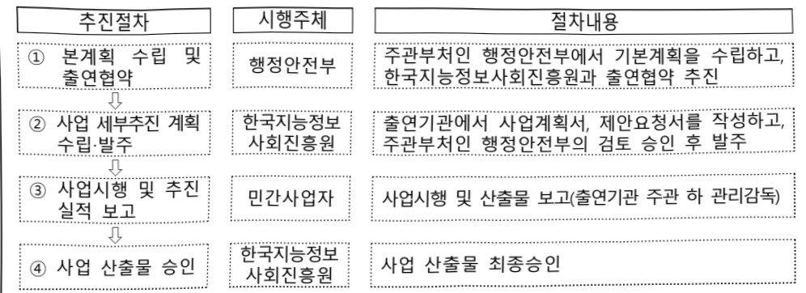

# 공공부문 AI 서비스 지원(정보화)

**해당 페이지**: PDF 5177 ~ 5182 쪽 해당

**부처**: 행정안전부
**분야**: 일반·지방행정
**회계유형**: 일반회계
**2026 확정예산**: 20608.0 백만원
**전년대비 증감률**: None%
**AI 도메인**: 행정/전자정부, 디지털전환(AX)

---

<table border=1 style='margin: auto; word-wrap: break-word;'><tr><td style='text-align: center; word-wrap: break-word;'>사 업 명</td></tr><tr><td style='text-align: center; word-wrap: break-word;'>(19) 공공부문 AI 서비스 지원 (2039-508)</td></tr></table>

사업 코드 정보

<table border=1 style='margin: auto; word-wrap: break-word;'><tr><td style='text-align: center; word-wrap: break-word;'>구분</td><td style='text-align: center; word-wrap: break-word;'>회계</td><td style='text-align: center; word-wrap: break-word;'>소관</td><td style='text-align: center; word-wrap: break-word;'>실국(기관)</td><td style='text-align: center; word-wrap: break-word;'>계정</td><td style='text-align: center; word-wrap: break-word;'>분야</td><td style='text-align: center; word-wrap: break-word;'>부문</td></tr><tr><td style='text-align: center; word-wrap: break-word;'>코드</td><td rowspan="2">일반회계</td><td rowspan="2">행정안전부</td><td rowspan="2">인공지능정부실</td><td rowspan="2"></td><td style='text-align: center; word-wrap: break-word;'>010</td><td style='text-align: center; word-wrap: break-word;'>015</td></tr><tr><td style='text-align: center; word-wrap: break-word;'>명칭</td><td style='text-align: center; word-wrap: break-word;'>일반-지방행정</td><td style='text-align: center; word-wrap: break-word;'>정부자원관리</td></tr></table>

<table border=1 style='margin: auto; word-wrap: break-word;'><tr><td style='text-align: center; word-wrap: break-word;'>구분</td><td style='text-align: center; word-wrap: break-word;'>프로그램</td><td style='text-align: center; word-wrap: break-word;'>단위사업</td><td style='text-align: center; word-wrap: break-word;'>세부사업</td></tr><tr><td style='text-align: center; word-wrap: break-word;'>코드</td><td style='text-align: center; word-wrap: break-word;'>2000</td><td style='text-align: center; word-wrap: break-word;'>2039</td><td style='text-align: center; word-wrap: break-word;'>508</td></tr><tr><td style='text-align: center; word-wrap: break-word;'>명칭</td><td style='text-align: center; word-wrap: break-word;'>전자정부</td><td style='text-align: center; word-wrap: break-word;'>정보자원관리지원기반확충</td><td style='text-align: center; word-wrap: break-word;'>공공부문 AI 서비스 지원</td></tr></table>

□ 사업 성격 (공통요구자료 II-1 작성유의사항 4. 참조, 해당하는 사항에 “○” 표시)

<table border=1 style='margin: auto; word-wrap: break-word;'><tr><td rowspan="2">신규</td><td rowspan="2">계속</td><td rowspan="2">완료</td><td rowspan="2">예비타당성 실시여부</td><td rowspan="2">총사업비 관리대상</td><td rowspan="2">총액계상 예산사업</td><td style='text-align: center; word-wrap: break-word;'>사업소관 변경정보</td></tr><tr><td style='text-align: center; word-wrap: break-word;'>2025예산 시 소관</td></tr><tr><td style='text-align: center; word-wrap: break-word;'>○</td><td style='text-align: center; word-wrap: break-word;'></td><td style='text-align: center; word-wrap: break-word;'></td><td style='text-align: center; word-wrap: break-word;'></td><td style='text-align: center; word-wrap: break-word;'></td><td style='text-align: center; word-wrap: break-word;'></td><td style='text-align: center; word-wrap: break-word;'></td></tr></table>

□ 사업 지원 형태 및 지원을 (최소한 한 개는 반드시 선택하시오. 해당사항에 0 표시)

<table border=1 style='margin: auto; word-wrap: break-word;'><tr><td style='text-align: center; word-wrap: break-word;'>직접</td><td style='text-align: center; word-wrap: break-word;'>출자</td><td style='text-align: center; word-wrap: break-word;'>출연</td><td style='text-align: center; word-wrap: break-word;'>보조</td><td style='text-align: center; word-wrap: break-word;'>융자</td><td style='text-align: center; word-wrap: break-word;'>국고보조율(%)</td><td style='text-align: center; word-wrap: break-word;'>융자율(%)</td></tr><tr><td style='text-align: center; word-wrap: break-word;'></td><td style='text-align: center; word-wrap: break-word;'></td><td style='text-align: center; word-wrap: break-word;'>0</td><td style='text-align: center; word-wrap: break-word;'></td><td style='text-align: center; word-wrap: break-word;'></td><td style='text-align: center; word-wrap: break-word;'></td><td style='text-align: center; word-wrap: break-word;'></td></tr></table>

## 사업 소관부처 및 시행주체

<table border=1 style='margin: auto; word-wrap: break-word;'><tr><td style='text-align: center; word-wrap: break-word;'>사업명</td><td colspan="2">구분</td></tr><tr><td rowspan="3">공공부문 AI 서비스 지원</td><td rowspan="2">소관부처</td><td style='text-align: center; word-wrap: break-word;'>인공지능정부실 인공지능정부정책국</td></tr><tr><td style='text-align: center; word-wrap: break-word;'>인공지능정보정책과</td></tr><tr><td style='text-align: center; word-wrap: break-word;'>사업시행주체</td><td style='text-align: center; word-wrap: break-word;'>한국지능정보사회진흥원</td></tr></table>

---

### 가. 예산 총괄표

(단위: 백만원, %)

<table border=1 style='margin: auto; word-wrap: break-word;'><tr><td rowspan="2">사업명</td><td rowspan="2">2024년 결산</td><td colspan="2">2025년 예산</td><td colspan="2">2026년 예산</td><td rowspan="2">증감(B-A)</td><td rowspan="2">(B-A)/A</td></tr><tr><td style='text-align: center; word-wrap: break-word;'>본예산</td><td style='text-align: center; word-wrap: break-word;'>추경*(A)</td><td style='text-align: center; word-wrap: break-word;'>요구안</td><td style='text-align: center; word-wrap: break-word;'>본예산(B)</td></tr><tr><td style='text-align: center; word-wrap: break-word;'>공공부문 AI 서비스 지원</td><td style='text-align: center; word-wrap: break-word;'>-</td><td style='text-align: center; word-wrap: break-word;'>-</td><td style='text-align: center; word-wrap: break-word;'>-</td><td style='text-align: center; word-wrap: break-word;'>20,608</td><td style='text-align: center; word-wrap: break-word;'>20,608</td><td style='text-align: center; word-wrap: break-word;'>20,608</td><td style='text-align: center; word-wrap: break-word;'>순증</td></tr></table>

* 추경: 추경증감액을 포함한 최종 예산액을 기재

## □ 기능별(내역사업별) 예산 내역

(단위:백만원)

<table border=1 style='margin: auto; word-wrap: break-word;'><tr><td rowspan="2"></td><td colspan="5">2024</td><td colspan="5">2025</td><td rowspan="2">2026 예산</td></tr><tr><td style='text-align: center; word-wrap: break-word;'>예산액(추경)</td><td style='text-align: center; word-wrap: break-word;'>예산현액</td><td style='text-align: center; word-wrap: break-word;'>집행액</td><td style='text-align: center; word-wrap: break-word;'>이월액</td><td style='text-align: center; word-wrap: break-word;'>불용액</td><td style='text-align: center; word-wrap: break-word;'>예산액(추경)</td><td style='text-align: center; word-wrap: break-word;'>예산현액</td><td style='text-align: center; word-wrap: break-word;'>집행액</td><td style='text-align: center; word-wrap: break-word;'>이월액</td><td style='text-align: center; word-wrap: break-word;'>불용액</td></tr><tr><td style='text-align: center; word-wrap: break-word;'>○ 기능별 분류(합계)</td><td style='text-align: center; word-wrap: break-word;'>-</td><td style='text-align: center; word-wrap: break-word;'>-</td><td style='text-align: center; word-wrap: break-word;'>-</td><td style='text-align: center; word-wrap: break-word;'>-</td><td style='text-align: center; word-wrap: break-word;'>-</td><td style='text-align: center; word-wrap: break-word;'>-</td><td style='text-align: center; word-wrap: break-word;'>-</td><td style='text-align: center; word-wrap: break-word;'>-</td><td style='text-align: center; word-wrap: break-word;'>-</td><td style='text-align: center; word-wrap: break-word;'>-</td><td style='text-align: center; word-wrap: break-word;'>20,608</td></tr><tr><td style='text-align: center; word-wrap: break-word;'>• 부처 효율화 AI 지원사업</td><td style='text-align: center; word-wrap: break-word;'>-</td><td style='text-align: center; word-wrap: break-word;'>-</td><td style='text-align: center; word-wrap: break-word;'>-</td><td style='text-align: center; word-wrap: break-word;'>-</td><td style='text-align: center; word-wrap: break-word;'>-</td><td style='text-align: center; word-wrap: break-word;'>-</td><td style='text-align: center; word-wrap: break-word;'>-</td><td style='text-align: center; word-wrap: break-word;'>-</td><td style='text-align: center; word-wrap: break-word;'>-</td><td style='text-align: center; word-wrap: break-word;'>-</td><td style='text-align: center; word-wrap: break-word;'>10,220</td></tr><tr><td style='text-align: center; word-wrap: break-word;'>• 지자체 공통서비스 AI 표준화 지원</td><td style='text-align: center; word-wrap: break-word;'>-</td><td style='text-align: center; word-wrap: break-word;'>-</td><td style='text-align: center; word-wrap: break-word;'>-</td><td style='text-align: center; word-wrap: break-word;'>-</td><td style='text-align: center; word-wrap: break-word;'>-</td><td style='text-align: center; word-wrap: break-word;'>-</td><td style='text-align: center; word-wrap: break-word;'>-</td><td style='text-align: center; word-wrap: break-word;'>-</td><td style='text-align: center; word-wrap: break-word;'>-</td><td style='text-align: center; word-wrap: break-word;'>-</td><td style='text-align: center; word-wrap: break-word;'>10,220</td></tr><tr><td style='text-align: center; word-wrap: break-word;'>• 공공 AI 사업지원센터</td><td style='text-align: center; word-wrap: break-word;'>-</td><td style='text-align: center; word-wrap: break-word;'>-</td><td style='text-align: center; word-wrap: break-word;'>-</td><td style='text-align: center; word-wrap: break-word;'>-</td><td style='text-align: center; word-wrap: break-word;'>-</td><td style='text-align: center; word-wrap: break-word;'>-</td><td style='text-align: center; word-wrap: break-word;'>-</td><td style='text-align: center; word-wrap: break-word;'>-</td><td style='text-align: center; word-wrap: break-word;'>-</td><td style='text-align: center; word-wrap: break-word;'>-</td><td style='text-align: center; word-wrap: break-word;'>168</td></tr></table>

### 나. 사업설명자료

## 1 ) 사업목적·내용

(목적) 보안성이 갖춰진 '범정부 AI 공통기반'을 토대로 부처·지자체 공통 업무를 AI 서비스로 효율화·공통 모델화하여 대국민 서비스 개선

- (부처 효율화 AI 지원사업) 각 부처가 중복투자 없이 공통업무에 신속하게 AI를 도입·활용할 수 있도록 서비스 구축 지원

- (지자체 공통서비스 AI 표준화 지원) 지자체 공통적으로 주민들의 수요가 높은 서비스를

조사, 공통 모델화하여 지역간 AI 격차가 해소되도록 전국에 보급, 확산 추진

- (공공 AI 사업지원센터) 부처 · 지자체의 경우 AX 전문인력과 경험 부족으로 효율적인 사업 추진을 위한 컨설팅 필요 → ‘공공 AI 사업지원센터’ 설치 · 운영으로 지원

※ (국정과제 24번) AI 3대 강국 도약을 위한 국정과제 ‘세계 1위 AI 정부 실현’을 위한 ‘30대 핵심과제’ 선정 · 추진 및 AI 사업 성공을 위해 ‘공공 AI 사업지원센터’ 설치 · 운영

---

## 2 ) 사업개요

## 사업근거 및 추진경위

① 법령상 근거 및 조항 적시

- 전자정부법 제18조의2(지능형 전자정부서비스의 제공 등)

① 행정기관등의 장은 인공지능 등의 기술을 활용하여 전자정부서비스를 제공할 수 있다. ② 행정안전부장관은 행정기관등의 장이 인공지능 등의 기술을 효율적으로 활용할 수 있도록 행정적·재정적·기술적 지원 등 필요한 지원을 할 수 있다.

- 전자정부법 시행령 제15조의2(지능형 전자정부서비스의 도입 및 활용)

②행정안전부장관은법제18조의2제2항에따라다음각호의사업을지원할수있다.

1. 인공지능 등의 기술을 전자정부서비스에 적용·실증하는 사업

2. 인공지능 등의 기술을 여러 전자정부서비스에 활용할 수 있도록 공통기반을 구축하는 사업

3. 인공지능 등의 기술을 빅데이터 분석 기법 등 다른 기술이나 서비스와 융합하는 사업

4. 그 밖에 지능형 전자정부서비스의 도입이나 활용에 필요한 사업

② 추진경위 - 사업 시작년도, 추진배경, 부처별 중점과제, 대통령 공약사항 등 - (추진경과) 범정부에서 활용할 목적으로 인공지능 공통기반 구축('25년~')

- (추진배경) 각 기관이 무분별한 중복투자 없이 성공적으로 AI를 도입할 수 있도록 공통 AI 서비스를 개발·모델화·보급, 부처·지자체의 경우 AI 사업 인력·경험 부족을 극복하기 위해 ‘공공 AI 사업지원센터’를 신설하여 각 기관 지원

- (공약사항) 인공지능 거버넌스 정립을 통해 AI 3강의 기반을 마련하겠습니다.

- (국정과제) 24번 세계 1위 AI 정부 실현(AI 정부 대전환을 위한 30대 핵심과제 추진)

## 주요내용

① 사업규모

- 총사업비(해당되는 경우에만 기재) : 해당없음

- 사업기간 : '26년~

- 최근 5년 간 투입된 사업비(예산액기준, 추경편성한 연도에는 추경포함)

<table border=1 style='margin: auto; word-wrap: break-word;'><tr><td style='text-align: center; word-wrap: break-word;'>연도</td><td style='text-align: center; word-wrap: break-word;'>2022</td><td style='text-align: center; word-wrap: break-word;'>2023</td><td style='text-align: center; word-wrap: break-word;'>2024</td><td style='text-align: center; word-wrap: break-word;'>2025</td><td style='text-align: center; word-wrap: break-word;'>2026</td></tr><tr><td style='text-align: center; word-wrap: break-word;'>사업비</td><td style='text-align: center; word-wrap: break-word;'>-</td><td style='text-align: center; word-wrap: break-word;'>-</td><td style='text-align: center; word-wrap: break-word;'>-</td><td style='text-align: center; word-wrap: break-word;'>-</td><td style='text-align: center; word-wrap: break-word;'>20,608</td></tr></table>

② 사업추진체계

- 사업시행방법 : 출연

- 사업시행주체 : 한국지능정보사회진흥원

- 사업 수혜자 : 국민, 부처, 지자체, AI 서비스 관련 기업 등

- 보조, 융자, 출연, 출자 등의 경우 보조·융자 등 지원 비율 및 법적근거

---

<table border=1 style='margin: auto; word-wrap: break-word;'><tr><td style='text-align: center; word-wrap: break-word;'>내역사업명</td><td style='text-align: center; word-wrap: break-word;'>구분</td><td style='text-align: center; word-wrap: break-word;'>피보조·피출연 등 기관명</td><td style='text-align: center; word-wrap: break-word;'>지원 금액 (2026예산)</td><td style='text-align: center; word-wrap: break-word;'>지원 비율(%)</td><td style='text-align: center; word-wrap: break-word;'>보조율 법적근거 (해당 조항)</td></tr><tr><td style='text-align: center; word-wrap: break-word;'>부처 효율화 AI 지원사업</td><td rowspan="3">출연</td><td rowspan="3">한국지능 정보사회 진흥원</td><td style='text-align: center; word-wrap: break-word;'>10,220</td><td rowspan="3">100</td><td rowspan="3">지능정보화 기본법 제12조제4항 (한국지능정보사회진흥원의 설립) 전자정부법 제71조제1항 (전문기관의 지정 등)</td></tr><tr><td style='text-align: center; word-wrap: break-word;'>지자체 공통서비스 AI 표준화 지원</td><td style='text-align: center; word-wrap: break-word;'>10,220</td></tr><tr><td style='text-align: center; word-wrap: break-word;'>공공 AI 사업지원센터</td><td style='text-align: center; word-wrap: break-word;'>168</td></tr></table>

## 3 ) 2026년도 예산 산출 근거

□ 공공부문 AI 서비스 지원 : (2026 예산) 20,608백만원

① 부처 효율화 AI 지원사업 : (2026 예산) 10,220백만원

- (산출) 서비스 개발비 10,220백만원

② 지자체 공통서비스 AI 표준화 지원 : (2026) 10,220백만원

- (산출) 서비스 개발비 10,220백만원

③ 공공 AI 사업지원센터 : (2026 예산) 168백만원

- (산출) 컨설팅비 168백만원

---

② 성과지표 이외의 연도별 사업추진 경과 및 실적 : 해당없음

<table border=1 style='margin: auto; word-wrap: break-word;'><tr><td style='text-align: center; word-wrap: break-word;'>성과지표</td><td style='text-align: center; word-wrap: break-word;'>구분</td><td style='text-align: center; word-wrap: break-word;'>2022</td><td style='text-align: center; word-wrap: break-word;'>2023</td><td style='text-align: center; word-wrap: break-word;'>2024</td><td style='text-align: center; word-wrap: break-word;'>2025</td><td style='text-align: center; word-wrap: break-word;'>2026</td><td style='text-align: center; word-wrap: break-word;'>2026 목표치산출근거</td><td style='text-align: center; word-wrap: break-word;'>측정칙식(또는 측정방법)</td><td style='text-align: center; word-wrap: break-word;'>자료수집방법(또는 자료출처)</td></tr><tr><td rowspan="3">인공지능전자정부서비스이용률(단위:%)</td><td style='text-align: center; word-wrap: break-word;'>목표</td><td style='text-align: center; word-wrap: break-word;'>-</td><td style='text-align: center; word-wrap: break-word;'>-</td><td style='text-align: center; word-wrap: break-word;'>-</td><td style='text-align: center; word-wrap: break-word;'>18</td><td style='text-align: center; word-wrap: break-word;'>19.8</td><td rowspan="3">전년도 설적의10% 증가율적용</td><td rowspan="3">‘취근 1년간 인공지능(AI)을 활용한 전자정부서비스를 이용한 적이 있다’라고 답한 국민 수 / 전체 표본 국민 수(만 16~74세의 일반국민 4,000명) × 100</td><td rowspan="3">국가승인통계</td></tr><tr><td style='text-align: center; word-wrap: break-word;'>실적</td><td style='text-align: center; word-wrap: break-word;'>-</td><td style='text-align: center; word-wrap: break-word;'>-</td><td style='text-align: center; word-wrap: break-word;'>-</td><td style='text-align: center; word-wrap: break-word;'>-</td><td style='text-align: center; word-wrap: break-word;'>-</td></tr><tr><td style='text-align: center; word-wrap: break-word;'>달성도</td><td style='text-align: center; word-wrap: break-word;'>-</td><td style='text-align: center; word-wrap: break-word;'>-</td><td style='text-align: center; word-wrap: break-word;'>-</td><td style='text-align: center; word-wrap: break-word;'>-</td><td style='text-align: center; word-wrap: break-word;'>-</td></tr><tr><td rowspan="3">전자정부서비스만족도(단위:점)</td><td style='text-align: center; word-wrap: break-word;'>목표</td><td style='text-align: center; word-wrap: break-word;'>-</td><td style='text-align: center; word-wrap: break-word;'>87.9</td><td style='text-align: center; word-wrap: break-word;'>87.9</td><td style='text-align: center; word-wrap: break-word;'>87.9</td><td style='text-align: center; word-wrap: break-word;'>-</td><td rowspan="3">해당없음</td><td rowspan="3">전자정부서비스만족도(점) = ‘취근 1년 간 전자정부서비스에 대해 전반적으로 만족한다’는 문항에 대해 7점 리커트 척도 접수를 100점으로 환산하여 평균값산출</td><td rowspan="3">국가승인통계</td></tr><tr><td style='text-align: center; word-wrap: break-word;'>실적</td><td style='text-align: center; word-wrap: break-word;'>-</td><td style='text-align: center; word-wrap: break-word;'>86.3</td><td style='text-align: center; word-wrap: break-word;'>89.4</td><td style='text-align: center; word-wrap: break-word;'>-</td><td style='text-align: center; word-wrap: break-word;'>-</td></tr><tr><td style='text-align: center; word-wrap: break-word;'>달성도</td><td style='text-align: center; word-wrap: break-word;'>-</td><td style='text-align: center; word-wrap: break-word;'>98.2</td><td style='text-align: center; word-wrap: break-word;'>102.4</td><td style='text-align: center; word-wrap: break-word;'>-</td><td style='text-align: center; word-wrap: break-word;'>-</td></tr><tr><td rowspan="3">전자정부서비스이용률(고평층)(단위:%)</td><td style='text-align: center; word-wrap: break-word;'>목표</td><td style='text-align: center; word-wrap: break-word;'>59.9</td><td style='text-align: center; word-wrap: break-word;'>68.1</td><td style='text-align: center; word-wrap: break-word;'>-</td><td style='text-align: center; word-wrap: break-word;'>-</td><td style='text-align: center; word-wrap: break-word;'>-</td><td rowspan="3">해당없음</td><td rowspan="3">전자정부서비스이용률(고평층)(%) = ‘취근 1년 간 전자정부서비스를 이용해낸 적이 있다’라고 답한 만60~74세 국민수(전체 표본(만16~74세 일반국민 4,000명) 중 만0~74세 국민수 × 100</td><td rowspan="3">국가승인통계</td></tr><tr><td style='text-align: center; word-wrap: break-word;'>실적</td><td style='text-align: center; word-wrap: break-word;'>77.2</td><td style='text-align: center; word-wrap: break-word;'>73.4</td><td style='text-align: center; word-wrap: break-word;'>-</td><td style='text-align: center; word-wrap: break-word;'>-</td><td style='text-align: center; word-wrap: break-word;'>-</td></tr><tr><td style='text-align: center; word-wrap: break-word;'>달성도</td><td style='text-align: center; word-wrap: break-word;'>128.9</td><td style='text-align: center; word-wrap: break-word;'>107.8</td><td style='text-align: center; word-wrap: break-word;'>-</td><td style='text-align: center; word-wrap: break-word;'>-</td><td style='text-align: center; word-wrap: break-word;'>-</td></tr><tr><td rowspan="3">전자정부서비스이용률(단위:%)</td><td style='text-align: center; word-wrap: break-word;'>목표</td><td style='text-align: center; word-wrap: break-word;'>89.6</td><td style='text-align: center; word-wrap: break-word;'>-</td><td style='text-align: center; word-wrap: break-word;'>-</td><td style='text-align: center; word-wrap: break-word;'>-</td><td style='text-align: center; word-wrap: break-word;'>-</td><td rowspan="3">해당없음</td><td rowspan="3">전자정부서비스이용률(전체)(%) = ‘취근 1년 간 전자정부서비스를 이용해낸 적이 있다’라고 답한 국민수/전체 표본 국민 수(만 16~74세의 일반국민 4,000명) × 100</td><td rowspan="3">국가승인통계</td></tr><tr><td style='text-align: center; word-wrap: break-word;'>실적</td><td style='text-align: center; word-wrap: break-word;'>92.2</td><td style='text-align: center; word-wrap: break-word;'>90.6</td><td style='text-align: center; word-wrap: break-word;'>-</td><td style='text-align: center; word-wrap: break-word;'>-</td><td style='text-align: center; word-wrap: break-word;'>-</td></tr><tr><td style='text-align: center; word-wrap: break-word;'>달성도</td><td style='text-align: center; word-wrap: break-word;'>102.9</td><td style='text-align: center; word-wrap: break-word;'>-</td><td style='text-align: center; word-wrap: break-word;'>-</td><td style='text-align: center; word-wrap: break-word;'>-</td><td style='text-align: center; word-wrap: break-word;'>-</td></tr><tr><td rowspan="3">주요공공서비스의디지털 전환율(단위:%)</td><td style='text-align: center; word-wrap: break-word;'>목표</td><td style='text-align: center; word-wrap: break-word;'>50</td><td style='text-align: center; word-wrap: break-word;'>-</td><td style='text-align: center; word-wrap: break-word;'>-</td><td style='text-align: center; word-wrap: break-word;'>-</td><td style='text-align: center; word-wrap: break-word;'>-</td><td rowspan="3">해당없음</td><td rowspan="3">주요 공공서비스의디지털 전환율 = ‘개별 공공서비스의디지털 전환율 전략평균값 -개별 공공서비스의디지털 전환율 = ‘해당 서비스의 공동지표와 서비스 유형론 자료채취 중 핵심수 ÷ ‘적용된 지표의 총 배접’</td><td rowspan="3">외부전문가를 통한사용자(end user) 관점의 측정 주요 공공서비스(10대 분야 2개 소분류 56개 서비스)</td></tr><tr><td style='text-align: center; word-wrap: break-word;'>실적</td><td style='text-align: center; word-wrap: break-word;'>67.3</td><td style='text-align: center; word-wrap: break-word;'>-</td><td style='text-align: center; word-wrap: break-word;'>-</td><td style='text-align: center; word-wrap: break-word;'>-</td><td style='text-align: center; word-wrap: break-word;'>-</td></tr><tr><td style='text-align: center; word-wrap: break-word;'>달성도</td><td style='text-align: center; word-wrap: break-word;'>134.6</td><td style='text-align: center; word-wrap: break-word;'>-</td><td style='text-align: center; word-wrap: break-word;'>-</td><td style='text-align: center; word-wrap: break-word;'>-</td><td style='text-align: center; word-wrap: break-word;'>-</td></tr></table>

① 2022~2026년도 성과계획서 상 성과지표 및 최근 5년간 성과 달성도

☐사업영향,산출물 성과지표 등

---

③ 향후(2026년도 이후) 기대효과 : 부처, 지자체가 실시하는 공통서비스에 중복없이 AI 서비스를 도입하여 서비스 효율화, 공통 모델화를 통해 대국민 서비스 제고 → 중복투자 방지로 국가 예산 절감, AI 격차 해소로 전국 균형 발전에 기여

5) 타당성조사 및 예비타당성조사 시행여부 및 결과 요지 : 해당없음

6) 총사업비 대상사업 정보 : 해당없음

## 7 ) 사업 집행절차

8) 각종 평가 : 해당없음

### 다.최근 4년간 결산내역

## 1 ) 결산표

☐ 부처 결산내역 : 해당없음

## 2 ) 주요 결산사항

□ 2022~2025년 결산 주요사항 : 해당없음

□ 2025년 이·전용 등 세부내역 : 해당없음

---

### 원본 PDF 크롭 이미지

