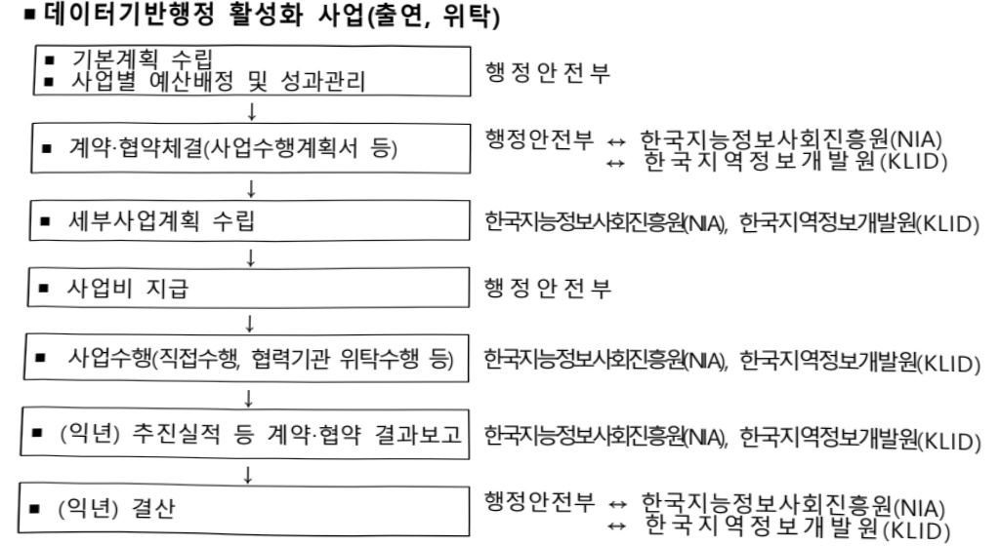
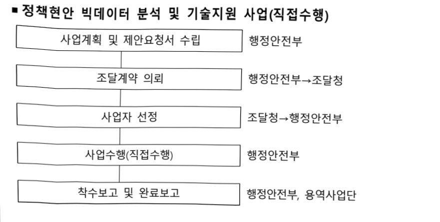

# 데이터기반행정활성화(정보화)

**해당 페이지**: PDF 5195 ~ 5206 쪽 해당

**부처**: 행정안전부
**분야**: 일반·지방행정
**회계유형**: 일반회계
**2026 확정예산**: 10478.0 백만원
**전년대비 증감률**: -30.2%
**AI 도메인**: 데이터, 디지털전환(AX)

---

<table border=1 style='margin: auto; word-wrap: break-word;'><tr><td style='text-align: center; word-wrap: break-word;'>사 업 명</td></tr><tr><td style='text-align: center; word-wrap: break-word;'>(25) 데이터기반행정활성화(정보화) (2046-503)</td></tr></table>

□ 사업 코드 정보

<table border=1 style='margin: auto; word-wrap: break-word;'><tr><td style='text-align: center; word-wrap: break-word;'>구분</td><td style='text-align: center; word-wrap: break-word;'>회계</td><td style='text-align: center; word-wrap: break-word;'>소관</td><td style='text-align: center; word-wrap: break-word;'>실국(기관)</td><td style='text-align: center; word-wrap: break-word;'>계정</td><td style='text-align: center; word-wrap: break-word;'>분야</td><td style='text-align: center; word-wrap: break-word;'>부문</td></tr><tr><td style='text-align: center; word-wrap: break-word;'>코드</td><td rowspan="2">일반회계</td><td rowspan="2">행정안전부</td><td rowspan="2">인공지능정부실</td><td rowspan="2">-</td><td style='text-align: center; word-wrap: break-word;'>010</td><td style='text-align: center; word-wrap: break-word;'>015</td></tr><tr><td style='text-align: center; word-wrap: break-word;'>명칭</td><td style='text-align: center; word-wrap: break-word;'>일반·지방행정</td><td style='text-align: center; word-wrap: break-word;'>정부자원관리</td></tr></table>

<table border=1 style='margin: auto; word-wrap: break-word;'><tr><td style='text-align: center; word-wrap: break-word;'>구분</td><td style='text-align: center; word-wrap: break-word;'>프로그램</td><td style='text-align: center; word-wrap: break-word;'>단위사업</td><td style='text-align: center; word-wrap: break-word;'>세부사업</td></tr><tr><td style='text-align: center; word-wrap: break-word;'>코드</td><td style='text-align: center; word-wrap: break-word;'>2000</td><td style='text-align: center; word-wrap: break-word;'>2046</td><td style='text-align: center; word-wrap: break-word;'>503</td></tr><tr><td style='text-align: center; word-wrap: break-word;'>명칭</td><td style='text-align: center; word-wrap: break-word;'>전자정부</td><td style='text-align: center; word-wrap: break-word;'>공공데이터 개방 및 이용활성화 지원(정보화)</td><td style='text-align: center; word-wrap: break-word;'>데이터기반행정활성화 (정보화)</td></tr></table>

□ 사업 성격 (공통요구자료 Ⅱ-1 작성유의사항 5. 참조, 해당하는 사항에 “○” 표시)

<table border=1 style='margin: auto; word-wrap: break-word;'><tr><td rowspan="2">신규</td><td rowspan="2">계속</td><td rowspan="2">완료</td><td rowspan="2">예비타당성 실시여부</td><td rowspan="2">총사업비 관리대상</td><td rowspan="2">총액계상 예산사업</td><td style='text-align: center; word-wrap: break-word;'>사업소관 변경정보</td></tr><tr><td style='text-align: center; word-wrap: break-word;'>2025예산 시 소관</td></tr><tr><td style='text-align: center; word-wrap: break-word;'></td><td style='text-align: center; word-wrap: break-word;'>○</td><td style='text-align: center; word-wrap: break-word;'></td><td style='text-align: center; word-wrap: break-word;'></td><td style='text-align: center; word-wrap: break-word;'></td><td style='text-align: center; word-wrap: break-word;'></td><td style='text-align: center; word-wrap: break-word;'></td></tr></table>

□ 사업 지원 형태 및 지원을 (최소한 한 개는 반드시 선택하시오. 해당사항에 O 표시)

<table border=1 style='margin: auto; word-wrap: break-word;'><tr><td style='text-align: center; word-wrap: break-word;'>직접</td><td style='text-align: center; word-wrap: break-word;'>출자</td><td style='text-align: center; word-wrap: break-word;'>출연</td><td style='text-align: center; word-wrap: break-word;'>보조</td><td style='text-align: center; word-wrap: break-word;'>융자</td><td style='text-align: center; word-wrap: break-word;'>국고보조율(%)</td><td style='text-align: center; word-wrap: break-word;'>융자율(%)</td></tr><tr><td style='text-align: center; word-wrap: break-word;'>○</td><td style='text-align: center; word-wrap: break-word;'></td><td style='text-align: center; word-wrap: break-word;'>○</td><td style='text-align: center; word-wrap: break-word;'></td><td style='text-align: center; word-wrap: break-word;'></td><td style='text-align: center; word-wrap: break-word;'></td><td style='text-align: center; word-wrap: break-word;'></td></tr></table>

## □ 사업 담당자

<table border=1 style='margin: auto; word-wrap: break-word;'><tr><td style='text-align: center; word-wrap: break-word;'>사업명</td><td colspan="2">구분</td></tr><tr><td rowspan="4">데이터기반행정활성화(정보화)</td><td rowspan="3">소관부처</td><td style='text-align: center; word-wrap: break-word;'>인공지능정부실인공지능정부정책국</td></tr><tr><td style='text-align: center; word-wrap: break-word;'>공공인공지능혁신과</td></tr><tr><td style='text-align: center; word-wrap: break-word;'>공공데이터분석관리과</td></tr><tr><td style='text-align: center; word-wrap: break-word;'>사업시행주체</td><td style='text-align: center; word-wrap: break-word;'>한국지능정보사회진흥원</td></tr></table>

---

### 가.예산 총괄표

(단위: 백만원, %)

<table border=1 style='margin: auto; word-wrap: break-word;'><tr><td rowspan="2">사업명</td><td rowspan="2">2024년 결산</td><td colspan="2">2025년 예산</td><td colspan="2">2026년 예산</td><td rowspan="2">증감(B-A)</td><td rowspan="2">(B-A)/A</td></tr><tr><td style='text-align: center; word-wrap: break-word;'>본예산</td><td style='text-align: center; word-wrap: break-word;'>추경(A)</td><td style='text-align: center; word-wrap: break-word;'>요구안</td><td style='text-align: center; word-wrap: break-word;'>본예산(B)</td></tr><tr><td style='text-align: center; word-wrap: break-word;'>데이터기반행정 활성화(정보화)</td><td style='text-align: center; word-wrap: break-word;'>14,664</td><td style='text-align: center; word-wrap: break-word;'>15,008</td><td style='text-align: center; word-wrap: break-word;'>15,008</td><td style='text-align: center; word-wrap: break-word;'>14,506</td><td style='text-align: center; word-wrap: break-word;'>10,478</td><td style='text-align: center; word-wrap: break-word;'>△4,530</td><td style='text-align: center; word-wrap: break-word;'>△30.2</td></tr></table>

## □ 기능별(내역사업별) 예산 내역

(단위:백만원)

<table border=1 style='margin: auto; word-wrap: break-word;'><tr><td rowspan="2"></td><td colspan="5">2024</td><td colspan="5">2025</td><td rowspan="2">2026예산</td></tr><tr><td style='text-align: center; word-wrap: break-word;'>예산액(추경)</td><td style='text-align: center; word-wrap: break-word;'>예산현액</td><td style='text-align: center; word-wrap: break-word;'>집행액</td><td style='text-align: center; word-wrap: break-word;'>이월액</td><td style='text-align: center; word-wrap: break-word;'>불용액</td><td style='text-align: center; word-wrap: break-word;'>본예산</td><td style='text-align: center; word-wrap: break-word;'>예산현액</td><td style='text-align: center; word-wrap: break-word;'>집행액</td><td style='text-align: center; word-wrap: break-word;'>이월액</td><td style='text-align: center; word-wrap: break-word;'>불용액</td></tr><tr><td style='text-align: center; word-wrap: break-word;'>○ 기능별 분류(함께)</td><td style='text-align: center; word-wrap: break-word;'>14,665</td><td style='text-align: center; word-wrap: break-word;'>14,665</td><td style='text-align: center; word-wrap: break-word;'>14,664</td><td style='text-align: center; word-wrap: break-word;'>-</td><td style='text-align: center; word-wrap: break-word;'>1</td><td style='text-align: center; word-wrap: break-word;'>15,008</td><td style='text-align: center; word-wrap: break-word;'>15,008</td><td style='text-align: center; word-wrap: break-word;'>14,623</td><td style='text-align: center; word-wrap: break-word;'>370</td><td style='text-align: center; word-wrap: break-word;'>15</td><td style='text-align: center; word-wrap: break-word;'>10,478</td></tr><tr><td style='text-align: center; word-wrap: break-word;'>· 공공빅데이터분석·활용</td><td style='text-align: center; word-wrap: break-word;'>4,741</td><td style='text-align: center; word-wrap: break-word;'>4,741</td><td style='text-align: center; word-wrap: break-word;'>4,740</td><td style='text-align: center; word-wrap: break-word;'>-</td><td style='text-align: center; word-wrap: break-word;'>1</td><td style='text-align: center; word-wrap: break-word;'>5,796</td><td style='text-align: center; word-wrap: break-word;'>5,796</td><td style='text-align: center; word-wrap: break-word;'>5,411</td><td style='text-align: center; word-wrap: break-word;'>370</td><td style='text-align: center; word-wrap: break-word;'>15</td><td style='text-align: center; word-wrap: break-word;'>3,863</td></tr><tr><td style='text-align: center; word-wrap: break-word;'>· 범정부 데이터플랫폼 구축·운영</td><td style='text-align: center; word-wrap: break-word;'>8,194</td><td style='text-align: center; word-wrap: break-word;'>8,194</td><td style='text-align: center; word-wrap: break-word;'>8,194</td><td style='text-align: center; word-wrap: break-word;'>-</td><td style='text-align: center; word-wrap: break-word;'>-</td><td style='text-align: center; word-wrap: break-word;'>7,482</td><td style='text-align: center; word-wrap: break-word;'>7,482</td><td style='text-align: center; word-wrap: break-word;'>7,482</td><td style='text-align: center; word-wrap: break-word;'>-</td><td style='text-align: center; word-wrap: break-word;'>-</td><td style='text-align: center; word-wrap: break-word;'>4,885</td></tr><tr><td style='text-align: center; word-wrap: break-word;'>· 데이터기반행정 역량지원</td><td style='text-align: center; word-wrap: break-word;'>1,479</td><td style='text-align: center; word-wrap: break-word;'>1,479</td><td style='text-align: center; word-wrap: break-word;'>1,479</td><td style='text-align: center; word-wrap: break-word;'>-</td><td style='text-align: center; word-wrap: break-word;'>-</td><td style='text-align: center; word-wrap: break-word;'>1,479</td><td style='text-align: center; word-wrap: break-word;'>1,479</td><td style='text-align: center; word-wrap: break-word;'>1,479</td><td style='text-align: center; word-wrap: break-word;'>-</td><td style='text-align: center; word-wrap: break-word;'>-</td><td style='text-align: center; word-wrap: break-word;'>1,479</td></tr><tr><td style='text-align: center; word-wrap: break-word;'>· 데이터기반행정활성화 제도운영</td><td style='text-align: center; word-wrap: break-word;'>251</td><td style='text-align: center; word-wrap: break-word;'>251</td><td style='text-align: center; word-wrap: break-word;'>251</td><td style='text-align: center; word-wrap: break-word;'>-</td><td style='text-align: center; word-wrap: break-word;'>-</td><td style='text-align: center; word-wrap: break-word;'>251</td><td style='text-align: center; word-wrap: break-word;'>251</td><td style='text-align: center; word-wrap: break-word;'>251</td><td style='text-align: center; word-wrap: break-word;'>-</td><td style='text-align: center; word-wrap: break-word;'>-</td><td style='text-align: center; word-wrap: break-word;'>251</td></tr></table>

### 나.사업설명자료

## 1 ) 사업목적·내용

- (공공빅데이터 분석·활용)

부처 간 협력이 필요한 과제 및 정책활용도가 높은 현장의 수요과제, 국민이 실질적으로 체감할 수 있는 범정부 분석과제 등을 적극 발굴·추진하여 전문·심층 분석 수행(데이터기반행정법 제20조)

활용성 높은 다양한 데이터 분석 모델 발굴·표준화, 온라인 자동 분석 모델 지원

으로 편의성 및 활성화 제고

## - (범정부 데이터플랫폼 구축·운영)

·기관 간 칸막이를 넘어 기관이 보유한 데이터가 막힘없이 흐를 수 있도록 '범정부 데이터 파이프라인' 구축 및 데이터 공유 확산

· 행정·공공기관의 특성에 맞는 AI기반 분석환경 제공 및 분석플랫폼 이용 활성화를 위한 클라우드 기반 ‘범정부 데이터 분석시스템’ 고도화 및 운영 추진

## - (데이터기반행정 역량 지원)

AI·데이터 중심으로 대상별·수준별 교육과정을 개발하여 교육 컨텐츠를 범정부 공유하여 행정·공공기관 직원 AI리터러시 역량을 제고하고, 공공행정 전반에 AI·데이터 전환을 주도하는 문제해결역량을 갖춘 내부 실무인재 육성 추진

---

기관의 AI 활용 역량 강화를 통해 실질적인 성과 창출 등 변화를 유도하기 위한 컨설팅 및 우수사례 공모전 개최 등 역량 강화 지원 사업 추진

- (데이터기반행정 활성화 제도 운영)

데이터기반행정이 행정·공공기관에 조기 정착될 수 있도록 거버넌스(위원회, 협의회 등)

운영, 데이터기반행정 실태점검 및 평가, 제도 연구 등 추진

## 2 ) 사업개요

□ 사업근거 및 추진경위

① 법령상 근거 및 조항

-「데이터기반행정 활성화에 관한 법률」 및 동 시행령, 시행규칙

제1조(목적) 이 법은 데이터를 기반으로 한 행정의 활성화에 필요한 사항을 정함으로써 객관적이고 과학적인 행정을 통하여 공공기관의 책임성, 대응성 및 신뢰성을 높이고 국민의 삶의 질을 향상시키는 것을 목적으로 한다.

② 추진경위

- (20.6.) 데이터기반행정 활성화에 관한 법률 제정

- (20.12.) 데이터기반행정 활성화에 관한 법률 시행

- (20.12.) '공공기관 데이터 역량강화 가이드' 마련·배포

- (20.12.) '데이터 공동활용 가이드' 마련·배포

- (20.12.) 공동활용데이터 등록관리시스템 서비스 운영

- (21.2.) 데이터기반행정 활성화 위원회 구성·운영

- (21.3.) 제1차(21.~23.) 데이터기반행정 활성화 기본계획 수립

- (21.4.) 2021년 데이터기반행정 활성화 시행계획 수립

- (21.5.) 2021년 데이터기반행정 실태점검 계획 수립

- (21.3.) 「데이터기반행정 활성화 위원회」 운영

- (21.7.) 「데이터기반행정 책임관 협의회」 운영

- (21.12.) 「정부통합데이터분석센터」 설치·운영

- (22.2.) 2022년 데이터기반행정 활성화 시행계획 수립

- (22.2.) 2022년 행정·공공기관 데이터활용역량 강화교육 추진계획 수립·운영

- (22.3.) 2022년 데이터 분석 세부계획 수립

- (22.4.) 2022년 데이터기반행정 실태점검 계획 수립

- (23.2.) 범정부 데이터 분석활용 역량진단 가이드라인 및 진단도구 개발

- (23.2.) 2023년 행정·공공기관 데이터활용역량 강화교육 추진계획 수립·운영

- (23.3) 2023년 데이터 분석 세부계획 수립

- (23.3.) 범정부 데이터 분석시스템 서비스 개시

- (23.4.) 2023년 데이터기반행정 실태점검 계획 수립

---

- (23.7.) 2023년 데이터기반행정 활성화 시행계획 수립

- (23.7.) 범정부 데이터 분석시스템 구축·확대 추진

- (23.9.) 범정부 데이터 공유·활용체계 마련 BPR/ISP

- (23.12.) 제2차(24.~26.) 데이터기반행정 활성화 기본계획 수립

- (24.1.) 전문인재 양성과정 계획 수립 및 운영

- (24.3.) AI 자동회의록 개발(24.2.) 및 서비스 시범 운영

- (24.3.) 국가공유데이터플랫폼 구축계획 수립

- (24.6.) 2024년 데이터기반행정 활성화 시행계획 수립

- (24.6.) 표준 기관공유데이터 관리시스템 구축사업 완료

- (25.3.) 기관공유데이터 관리시스템 확산 실행계획 수립

- (25.4.) 범정부 데이터 분석시스템 고도화 완료

- (25.5.) 2025년 공공분야 AI·데이터분석 역량강화 추진계획 수립

- (25.6.) 국가공유데이터플랫폼 1차 구축사업 완료

- (25.9.) 국가공유데이터플랫폼 2차 구축사업 추진

## □ 주요내용

① 사업규모

- 총사업비 : 해당없음

- 사업기간 : 2015 ~ 계속

- 최근 5년 간 투입된 사업비

<table border=1 style='margin: auto; word-wrap: break-word;'><tr><td style='text-align: center; word-wrap: break-word;'>연도</td><td style='text-align: center; word-wrap: break-word;'>2022</td><td style='text-align: center; word-wrap: break-word;'>2023</td><td style='text-align: center; word-wrap: break-word;'>2024</td><td style='text-align: center; word-wrap: break-word;'>2025</td><td style='text-align: center; word-wrap: break-word;'>2026</td></tr><tr><td style='text-align: center; word-wrap: break-word;'>사업비</td><td style='text-align: center; word-wrap: break-word;'>20,781</td><td style='text-align: center; word-wrap: break-word;'>23,049</td><td style='text-align: center; word-wrap: break-word;'>14,665</td><td style='text-align: center; word-wrap: break-word;'>15,008</td><td style='text-align: center; word-wrap: break-word;'>10,478</td></tr></table>

-기타: 해당없음

② 사업추진체계

- 사업시행방법 : 직접수행, 출연, 위탁

- 사업시행주체 : 행정안전부, 한국지능정보사회진흥원, 한국지역정보개발원

- 사업 수혜자 : 대국민, 행정·공공기관

- 보조, 융자, 출연, 출자 등의 경우 보조·융자 등 지원 비율 및 법적근거

---

<table border=1 style='margin: auto; word-wrap: break-word;'><tr><td style='text-align: center; word-wrap: break-word;'>내역사업명</td><td style='text-align: center; word-wrap: break-word;'>구분</td><td style='text-align: center; word-wrap: break-word;'>피보조·피출연 등 기관명</td><td style='text-align: center; word-wrap: break-word;'>지원 금액 (2026예산)</td><td style='text-align: center; word-wrap: break-word;'>지원 비율(%)</td><td style='text-align: center; word-wrap: break-word;'>보조율 법적근거 (해당 조항)</td></tr><tr><td rowspan="2">공공빅데이터 분석활용</td><td style='text-align: center; word-wrap: break-word;'>출연</td><td style='text-align: center; word-wrap: break-word;'>한국지능정보 사회진흥원</td><td style='text-align: center; word-wrap: break-word;'>2,597백만원</td><td style='text-align: center; word-wrap: break-word;'>100%</td><td style='text-align: center; word-wrap: break-word;'>데이터기반행정법 제21조</td></tr><tr><td style='text-align: center; word-wrap: break-word;'>위탁</td><td style='text-align: center; word-wrap: break-word;'>한국지역정보 개발원</td><td style='text-align: center; word-wrap: break-word;'>428백만원</td><td style='text-align: center; word-wrap: break-word;'>100%</td><td style='text-align: center; word-wrap: break-word;'>데이터기반행정법 제21조</td></tr><tr><td style='text-align: center; word-wrap: break-word;'>범정부 데이터플랫폼 구축·운영</td><td style='text-align: center; word-wrap: break-word;'>출연</td><td style='text-align: center; word-wrap: break-word;'>한국지능정보 사회진흥원</td><td style='text-align: center; word-wrap: break-word;'>4,885백만원</td><td style='text-align: center; word-wrap: break-word;'>100%</td><td style='text-align: center; word-wrap: break-word;'>데이터기반행정법 제21조</td></tr><tr><td style='text-align: center; word-wrap: break-word;'>데이터기반행정 역량지원</td><td style='text-align: center; word-wrap: break-word;'>출연</td><td style='text-align: center; word-wrap: break-word;'>한국지능정보 사회진흥원</td><td style='text-align: center; word-wrap: break-word;'>1,479백만원</td><td style='text-align: center; word-wrap: break-word;'>100%</td><td style='text-align: center; word-wrap: break-word;'>데이터기반행정법 제21조</td></tr><tr><td style='text-align: center; word-wrap: break-word;'>데이터기반행정 활성화 제도운영</td><td style='text-align: center; word-wrap: break-word;'>출연</td><td style='text-align: center; word-wrap: break-word;'>한국지능정보 사회진흥원</td><td style='text-align: center; word-wrap: break-word;'>248백만원</td><td style='text-align: center; word-wrap: break-word;'>100%</td><td style='text-align: center; word-wrap: break-word;'>데이터기반행정법 제21조</td></tr></table>

## 3 ) 2026년도 예산 산출 근거

① 공공빅데이터 분석·활용 : (2026) 3,863백만원
▶ 정책현안 분석 및 기술지원 체계 운영 : ('26예산) 838백
- (산출) 838백만원 = 23.9백(분석가 1인당 월 소요 비용) × 분석가 3.5명 × 10개월
▶ 공공빅데이터 분석 추진 : ('26예산) 1,893백
- (산출) 1,893백만원 = 7개 과제 × 과제당 270.4백
▶ AI기반 현안 해결형 데이터 분석모델 개발 : ('26예산) 704백
- (산출) 704백만원 = 2개 모델 × 모델당 352백
▶ 표준분석모델 정립 및 확산 : ('26예산) 428백
- (산출) 428백만원 = 모델 정립 245.6백 + 모델 정비 95.4백 + 위탁사업비 87백
① 표준분석모델 정립 : 245.6백 = 2개 × 122.8백
② 표준분석모델(53종) 정비, 온라인·매뉴얼화, 기술지원 및 교육 : 95.4백
② 범정부 데이터플랫폼 구축·운영 : (2026) 4,885백만원
▶ 국가공유DB 구축: ('26예산) 2,959백
- (산출) 2,959백만원 = 운영 인건비 1,334백 + 응용SW 1,495백 + 상용SW 130백
▶ 범정부 데이터분석시스템 운영 및 유지보수 : ('26예산) 1,926백
- (산출) 1,926백만원 = ①운영비 959백 + ② 유지관리비 967백
① 운영비 : 959만원 = 운영인력 총 4명 × 19.9백 × 12개월
② 유지관리비(상용·응용SW) : 967백만원 = 상용SW 603백 + 응용SW 364백

---

③ 데이터기반행정 역량지원 : (2026) 1,479백만원
▶ AI·데이터 인재 양성·리터러시 강화 : ('26예산) 1,105백
- (산출) 1,105백만원 = AI인재양성 교육과정 개발·운영 1,105백
▶ 기관별 데이터기반행정 컨설팅 : ('26예산) 265백
- (산출) 265백만원 = 10개 기관 × 과제당 26.5백
▶ 역량진단도구 운영 등 기반조성 : ('26예산) 109백
- (산출) 역량진단도구 및 학습지원시스템 운영 : 109백만원 (전년동)
④ 데이터기반행정 활성화 제도 운영 : (2026) 251백만원
▶ 데이터기반행정 활성화 거버넌스 운영 : ('26예산) 95백
- (산출) 95백만원 = 분과위원회(21백만원)+전문위원회(12백만원)+책임관 협의회(10백만원)+포럼 및 세미나(52백만원)
▶ 데이터기반행정 정책 수립 및 평가(중앙·지방) : ('26예산) 63백
- (산출) 63백 (데이터기반행정 평가·정책 운영 및 지원 인력 인건비)
① 데이터기반행정 실태점검 평가단 운영 : 56백
- 평가수당 : 2,500천원 X 17명(평가위원) X 1회 = 42,500천원
- 자문 및 회의참석 수당 : 200천원 X 17명(평가위원) X 4회 = 13,600천원
② 기관 대상 데이터기반행정 평가 설명회 : 7백
- 임차비 : 2,500천원 × 2회 = 5,000천원
- 운영부대비 (인쇄비, 현수막, 소모품 등) : 1,000천원 × 2회 = 2,000천원
▶ 데이터기반행정 활성화 제도 연구 : ('26예산) 90백
- (산출) 90백만원 = 45백 × 2개 과제
▶ 데이터기반행정 활성화 기본경비 : ('26예산) 3백
- (산출) 3백만원 = 출장비 1백 + 업무협의 경비 2백
- 행정·공공기관 역량강화 지원 현장방문 등 출장비 : 1백 = 20만원 × 1명 × 5회
- 교육과정 개발, 분석지원, 플랫폼 운영 등 업무협의 : 2백 = 20만원 × 10회

---

## 4 ) 사업효과

□ 사업영향, 산출물 성과지표 등

① 2022~2026년도 성과계획서 상 성과지표 및 최근 5년간 성과 달성도

<table border=1 style='margin: auto; word-wrap: break-word;'><tr><td style='text-align: center; word-wrap: break-word;'>성과지표</td><td style='text-align: center; word-wrap: break-word;'>구분</td><td style='text-align: center; word-wrap: break-word;'>2022</td><td style='text-align: center; word-wrap: break-word;'>2023</td><td style='text-align: center; word-wrap: break-word;'>2024</td><td style='text-align: center; word-wrap: break-word;'>2025</td><td style='text-align: center; word-wrap: break-word;'>2026</td><td style='text-align: center; word-wrap: break-word;'>2026 목표치산출근거</td><td style='text-align: center; word-wrap: break-word;'>측정산식(또는 측정방법)</td><td style='text-align: center; word-wrap: break-word;'>자료수집방법(또는 자료출처)</td></tr><tr><td rowspan="3">인공지능전자정부서비스이용률(단위: %)</td><td style='text-align: center; word-wrap: break-word;'>목표</td><td style='text-align: center; word-wrap: break-word;'>-</td><td style='text-align: center; word-wrap: break-word;'>-</td><td style='text-align: center; word-wrap: break-word;'>-</td><td style='text-align: center; word-wrap: break-word;'>18</td><td style='text-align: center; word-wrap: break-word;'>19.8</td><td rowspan="3">전년도 실적의 10% 증가율적용</td><td rowspan="3">‘최근 1년간 인공지능(AI)을 활용한 전자정부서비스를 이용한 적이 있다’라고답한 국민 수/ 전체 표본 국민 수만 16~74세의 일반국민, 4,000명)×100</td><td rowspan="3">국가승인통계</td></tr><tr><td style='text-align: center; word-wrap: break-word;'>실적</td><td style='text-align: center; word-wrap: break-word;'>-</td><td style='text-align: center; word-wrap: break-word;'>-</td><td style='text-align: center; word-wrap: break-word;'>-</td><td style='text-align: center; word-wrap: break-word;'>-</td><td style='text-align: center; word-wrap: break-word;'>-</td></tr><tr><td style='text-align: center; word-wrap: break-word;'>달성도</td><td style='text-align: center; word-wrap: break-word;'>-</td><td style='text-align: center; word-wrap: break-word;'>-</td><td style='text-align: center; word-wrap: break-word;'>-</td><td style='text-align: center; word-wrap: break-word;'>-</td><td style='text-align: center; word-wrap: break-word;'>-</td></tr><tr><td rowspan="3">전자정부서비스만족도(단위: 점)</td><td style='text-align: center; word-wrap: break-word;'>목표</td><td style='text-align: center; word-wrap: break-word;'>-</td><td style='text-align: center; word-wrap: break-word;'>87.9</td><td style='text-align: center; word-wrap: break-word;'>87.9</td><td style='text-align: center; word-wrap: break-word;'>87.9</td><td style='text-align: center; word-wrap: break-word;'>-</td><td rowspan="3">해당없음</td><td rowspan="3">전자정부서비스만족도(점) = ‘최근 1년 간 전자정부서비스에 대해 전반적으로 만족한다’는 문항에 대해 7점 리커트 척도 점수를 100점으로 환산하여 평균값산출</td><td rowspan="3">국가승인통계</td></tr><tr><td style='text-align: center; word-wrap: break-word;'>실적</td><td style='text-align: center; word-wrap: break-word;'>- (87.7)</td><td style='text-align: center; word-wrap: break-word;'>86.3</td><td style='text-align: center; word-wrap: break-word;'>89.4</td><td style='text-align: center; word-wrap: break-word;'>-</td><td style='text-align: center; word-wrap: break-word;'>-</td></tr><tr><td style='text-align: center; word-wrap: break-word;'>달성도</td><td style='text-align: center; word-wrap: break-word;'>-</td><td style='text-align: center; word-wrap: break-word;'>98.2</td><td style='text-align: center; word-wrap: break-word;'>102.4</td><td style='text-align: center; word-wrap: break-word;'>-</td><td style='text-align: center; word-wrap: break-word;'>-</td></tr><tr><td rowspan="3">전자정부서비스이용률(고령층)(단위: %)</td><td style='text-align: center; word-wrap: break-word;'>목표</td><td style='text-align: center; word-wrap: break-word;'>59.9</td><td style='text-align: center; word-wrap: break-word;'>68.1</td><td style='text-align: center; word-wrap: break-word;'>-</td><td style='text-align: center; word-wrap: break-word;'>-</td><td style='text-align: center; word-wrap: break-word;'>-</td><td rowspan="3">해당없음</td><td rowspan="3">전자정부서비스이용률(고령층)(%) = ‘최근1년 간 전자정부서비스를 이용해본 적이 있다’라고 답한 만60~74세 국민수/ 전체 표본(만16~74세 일반국민 4,000명)층 만074세 국민수×100</td><td rowspan="3">국가승인통계</td></tr><tr><td style='text-align: center; word-wrap: break-word;'>실적</td><td style='text-align: center; word-wrap: break-word;'>77.2</td><td style='text-align: center; word-wrap: break-word;'>73.4</td><td style='text-align: center; word-wrap: break-word;'>-</td><td style='text-align: center; word-wrap: break-word;'>-</td><td style='text-align: center; word-wrap: break-word;'>-</td></tr><tr><td style='text-align: center; word-wrap: break-word;'>달성도</td><td style='text-align: center; word-wrap: break-word;'>128.9</td><td style='text-align: center; word-wrap: break-word;'>107.8</td><td style='text-align: center; word-wrap: break-word;'>-</td><td style='text-align: center; word-wrap: break-word;'>-</td><td style='text-align: center; word-wrap: break-word;'>-</td></tr><tr><td rowspan="3">전자정부서비스이용률(단위: %)</td><td style='text-align: center; word-wrap: break-word;'>목표</td><td style='text-align: center; word-wrap: break-word;'>89.6</td><td style='text-align: center; word-wrap: break-word;'>-</td><td style='text-align: center; word-wrap: break-word;'>-</td><td style='text-align: center; word-wrap: break-word;'>-</td><td style='text-align: center; word-wrap: break-word;'>-</td><td rowspan="3">해당없음</td><td rowspan="3">전자정부서비스이용률(전체)(%) = ‘최근1년 간 전자정부서비스를 이용해본 적이 있다’라고 답한 국민수/ 전체 표본 국민 수(만16~74세 의 일반국민 4,000명)×100</td><td rowspan="3">국가승인통계</td></tr><tr><td style='text-align: center; word-wrap: break-word;'>실적</td><td style='text-align: center; word-wrap: break-word;'>92.2</td><td style='text-align: center; word-wrap: break-word;'>90.6</td><td style='text-align: center; word-wrap: break-word;'>-</td><td style='text-align: center; word-wrap: break-word;'>-</td><td style='text-align: center; word-wrap: break-word;'>-</td></tr><tr><td style='text-align: center; word-wrap: break-word;'>달성도</td><td style='text-align: center; word-wrap: break-word;'>102.9</td><td style='text-align: center; word-wrap: break-word;'>-</td><td style='text-align: center; word-wrap: break-word;'>-</td><td style='text-align: center; word-wrap: break-word;'>-</td><td style='text-align: center; word-wrap: break-word;'>-</td></tr><tr><td rowspan="3">주요공공서비스의디지털 전환율(단위: %)</td><td style='text-align: center; word-wrap: break-word;'>목표</td><td style='text-align: center; word-wrap: break-word;'>50</td><td style='text-align: center; word-wrap: break-word;'>-</td><td style='text-align: center; word-wrap: break-word;'>-</td><td style='text-align: center; word-wrap: break-word;'>-</td><td style='text-align: center; word-wrap: break-word;'>-</td><td rowspan="3">해당없음</td><td rowspan="3">주요 공공서비스의 디지털 전환율 = ‘개별 공공서비스의 디지털 전환율 채택 평균값 -개별 공공서비스의 디지털 전환율 = ‘해당 서비스의 공통지표와 서비스 유형론 지표채취충 화두점수 = ‘적용된 지표의 총 배절’</td><td rowspan="3">외부전문가를 통한 사용자(end user) 관점의 측정 주요 공공서비스(10대 분야 27개 스분류 56개 서비스)</td></tr><tr><td style='text-align: center; word-wrap: break-word;'>실적</td><td style='text-align: center; word-wrap: break-word;'>67.3</td><td style='text-align: center; word-wrap: break-word;'>-</td><td style='text-align: center; word-wrap: break-word;'>-</td><td style='text-align: center; word-wrap: break-word;'>-</td><td style='text-align: center; word-wrap: break-word;'>-</td></tr><tr><td style='text-align: center; word-wrap: break-word;'>달성도</td><td style='text-align: center; word-wrap: break-word;'>134.6</td><td style='text-align: center; word-wrap: break-word;'>-</td><td style='text-align: center; word-wrap: break-word;'>-</td><td style='text-align: center; word-wrap: break-word;'>-</td><td style='text-align: center; word-wrap: break-word;'>-</td></tr></table>

---

② 성과지표 이외의 연도별 사업추진 경과 및 실적

<table border=1 style='margin: auto; word-wrap: break-word;'><tr><td style='text-align: center; word-wrap: break-word;'>2022</td><td style='text-align: center; word-wrap: break-word;'>- 사전 자료조사, 의견수렴 등으로 내실 있는 지수 개발계획 마련(22.1.~2.) - 「22년 데이터 활용역량 강화교육 추진계획」 수립(2.21.) - 「22년 데이터 활용역량 강화교육」 운영체계 정립(&#x27;22.3.~5.) - 「22년 범정부 데이터 분석」을 위한 중점 분석과제 분야 선정(~&#x27;22.3.) - 데이터분석체계 구축을 위한「범정부데이터분석협의회」운영(&#x27;22.3.~) - 「공공범데이터 신규 분석과제」 후보안(6개) 선정(&#x27;22.3.~5.) - 데이터 활용 역량지수의 신규 개발을 위한 체계 정립(&#x27;22.3.~5.) - 공공분야 데이터 활용 역량 진단에 적합한 역량모델 발굴(&#x27;22.5.~6.) - 2022년 데이터기반행정 실태점검 계획 확정·배포(&#x27;22.4.) - 「범정부 데이터 분석시스템」 구축 추진(~&#x27;22.4.) ※ 사업계획 수립, 조달발주 등 - 메타관리시스템 보급 및 메타데이터 등록 확대 (기관 및 데이블: &#x27;22.1.599개/708,663개→&#x27;22.5.614개/804,773개) - 시스템 활용도 제고를 위한 온라인 설명회 개최(&#x27;22.4~5., 4회 1,267명 참석) - 시스템 사용자 접근성 향상을 위한 기능개선(19건) 및 보안성 강화(~&#x27;22.5.) - 「민관합동 데이터분석협의회」 구성·운영(&#x27;22.6.~) - 지역사랑상품권 이상거래 탐지분석 등 분석과제 정책적용 완료(&#x27;3건) - 분석결과의 정책활용도 제고를 위한 적극적 기관협의 등 추진(&#x27;14회) - 국가전략 수립 및 사회현안 해결을 위한 분석과제 수행(&#x27;9건) - 데이터 기반의 일하는 방식 혁신을 위한 분석과제 수행(&#x27;2건) - 「22년 표준분석모델 사업」 추진계획 수립(&#x27;2.15.) 및 위탁협약(&#x27;4.11.), 과제선정(~6.17.) - 직무·역할 및 역량수준에 맞춘 교육 커리큘럼 개발(&#x27;5개 과정 36회) - 학습효과 제고를 위한 새로운 형태(메타버스 등)의 교육콘텐츠 개발 추진(&#x27;22.4~6.) - 공공(민원, 제안)과 민간(하스, SNS, 포럼 검색어 등) 여론 데이터 상시 모니터링을 통해 국민 수요 데이터 분석 및 활용 계획 수립(~&#x27;22.6.) - 유관기관(국가인재개발원 등) 협업으로 온라인 교육과정 확대 및 상시학습 제공(&#x27;22.6.) - 2022년 데이터 분석활용 공모전 계획 수립·운영(&#x27;22.7.~12.)</td></tr><tr><td style='text-align: center; word-wrap: break-word;'>2023</td><td style='text-align: center; word-wrap: break-word;'>- 정책현안 데이터 분석 및 기술지원 추진(&#x27;23.1.~ / 상시분석, 기술지원, 정례분석) - 「23년 데이터 활용역량 강화교육 추진계획」 수립(&#x27;23.2.) - 「범정부 데이터분석 거버넌스 체계 내실화 방안」 수립(&#x27;23.2.) - 「23년 통합데이터분석센터 홍보 추진계획」 수립 및 제작·홍보(&#x27;23.2.~) - &#x27;23년 범정부 데이터 분석활용 역량진단 가이드라인 및 온라인 진단 도구 개발(~23.3.) - 데이터 분석 및 활용역량 강화 전설팅 수행(&#x27;23.3.~ / 총 30개 기관) - 범정부 데이터 분석시스템 서비스 개시 및 이용 활성화 추진(&#x27;23.3.~) - 「2023년 데이터분석 세부 추진계획」 수립(&#x27;23.3.) - AI 기반 현안 해결 모델 개발 추진(&#x27;23.3.~ / 8개 과제) - 「범정부데이터분석실무협의회」 구성 및 1차 회의 개최(&#x27;23.3.) - 범정부 데이터 공유·활용체계 마련 BPR/ISP 추진(&#x27;23.3.~9.) - 2023년 데이터기반행정 실태점검 계획 확정·배포(&#x27;23.4.)</td></tr></table>

---

<table border=1 style='margin: auto; word-wrap: break-word;'><tr><td style='text-align: center; word-wrap: break-word;'></td><td style='text-align: center; word-wrap: break-word;'>-「2023년 제1회 민관합동 데이터분석협의회 및 정책세미나」 개최(&#x27;23.5.) - 2023년 데이터 분석활용 공모전 계획 수립·운영(&#x27;23.7~10.) - 데이터 분석 전문가 양성 과정 개발 및 시범 운영(&#x27;23.8~11.) - 「2023년 대한민국 정부박람회」 전시 계획 수립·운영(&#x27;23.9~11.) - 2023년 공공부문 데이터 분석·활용 우수사례집 발간(&#x27;23.11.) - 「2023년 제2회 민관합동 데이터분석협의회」 개최(&#x27;23.11.)</td></tr><tr><td style='text-align: center; word-wrap: break-word;'>2024</td><td style='text-align: center; word-wrap: break-word;'>- 정책현안 데이터 분석 및 기술지원 추진(&#x27;24.1~ / 상시분석, 기술지원) - 전문인재 양성과정 계획 수립·추진(&#x27;24.1~5.) 및 운영(&#x27;24.6.) - 데이터기반행정 활성화를 위한 정책설명회 개최(&#x27;24.2.) - 국가공유데이터플랫폼 구축계획 수립(&#x27;24.3.) - AI 자동화의록 개발(24.3) 및 서비스 시범 운영(&#x27;24.3~9.) - 데이터 활용·역량 강화교육 과정 개발·운영(&#x27;24.3~11.) - 「2024년 데이터기반행정 역량강화 전설팀」 추진계획 수립·운영(&#x27;24.4.) - 범정부 데이터 공유·활용을 위한 공유데이터 구축 로드맵 수립 설명회(&#x27;24.5.) - 표준분석모델 정립 및 확산 사업 추진계획 수립(&#x27;24.5.) - 「데이터 분석·활용 논의를 위한 정책 세미나」 개최(&#x27;24.5.) - 「&#x27;24년 공공벽데이터 분석사업」 추진계획 수립(&#x27;24.5.) - 표준 기관공유데이터 관리시스템 구축사업 추진(&#x27;23.11~24.5.) - 「2024년 제1회 민관합동 데이터분석협의회」 개최(&#x27;24.6.) - 데이터 분석 및 활용역량 강화 전설팀 수행(&#x27;24.6~ / 총 30개 기관) - 2024년 데이터기반행정 활성화 시행계획 수립(&#x27;24.6.)</td></tr><tr><td style='text-align: center; word-wrap: break-word;'>2025</td><td style='text-align: center; word-wrap: break-word;'>- 기관별 기관공유시스템 확산 실행계획 수립(&#x27;25.3) - 2025년 데이터기반행정 활성화 시행계획 수립(&#x27;25.3.) - 「정책현안 데이터 분석 및 기술지원 사업」 추진(&#x27;25.3~ / 상시분석, 기술지원) - 2025년 데이터기반행정 평가계획 수립 및 기관 대상 평가개편 설명회 개최(&#x27;25.4.) - 기관공유데이터 관리시스템 확산을 위한 기관설명회 개최(&#x27;25.2월~4월) - 데이터 공유·활용 활성화를 위한 담당자 설명회 개최(&#x27;25.5.) - 국가공유데이터플랫폼 구축(2차) 사업 계획 수립(&#x27;25.5.) - 기관의 다양한 이기종DB 운영환경을 위한 PostgreSQL기반 기관메타시스템 개선(&#x27;25.5.) - 국가공유데이터플랫폼 1차 구축사업 완료(&#x27;25.6.) - 센터 간 망연계를 통한 메타데이터 자동수집 체계 확대(&#x27;25.6.) - 기관공유시스템 구축기관 지원을 위한 기술설명회 개최(&#x27;25.7.) - 「&#x27;25년 표준분석모델 정립 및 확산 사업」 추진(&#x27;25.7~) - 「&#x27;25년 정책 수립 지원 데이터 분석 사업」 추진(&#x27;25.8~ / 9개 과제) - 「&#x27;25년 상시적 의사결정 지원 데이터 분석 사업」 추진(&#x27;25.8~ / 5개 과제) - AI·데이터분석 역량 강화교육 과정 개발·운영(&#x27;25.5~10.) 및 범정부 공유(&#x27;25.8.) - 국가공유데이터플랫폼 2차 구축사업 추진(&#x27;25.9.) - 전문인재 양성과정 계획 수립·추진(&#x27;25.1~5.) 및 운영(&#x27;25.6~9.) - 민관협업 AI 인재양성 교육 업무협업 및 운영(&#x27;25.4, 12. /2회) - AI캠퍼인 역량인증체계 시범 개발·운영(&#x27;25.5~11.) - AI 활용역량 강화 전설팀 수행(&#x27;25.6~10. / 총 10개 기관)</td></tr></table>

---

③ 향후(2026년도 이후) 기대효과

- 전문적이고 체계적인 데이터분석 수행으로 정부 정책의 질적 수준을 제고하여 범정부 과학 행정의 실질적 지원

- 범정부 데이터 분석시스템 구축·운영을 통해 행정·공공기관이 보유한 방대한 데이터를 분석·활용하여 범정부 데이터기반행정 이행의 기반 마련

- 행정·공공기관 간 데이터를 막힘없이 흐르도록 체계적으로 관리하여 정책·의사 결정 등에 활용할 수 있도록 “범정부 데이터 공유 플랫폼”을 구축·운영함으로써 행정의 책임성·신뢰성을 높이고 국민의 삶의 질 향상

- AI시대가 본격화됨에 따라, 공공분야 AI 내부인재(AI챔피언) 육성 및 전직원 대상 AI 리터러시 교육을 통해 공공행정 업무 혁신 도모

- 데이터기반행정 제도의 조기 정착 및 데이터 활용역량 강화를 통해 행정·공공기관의 일하는 방식 혁신 도모

## 5 ) 타당성조사 및 예비타당성조사 시행여부 및 결과 요지 : 해당없음

## 6 ) 총사업비 대상사업 여부 및 내역 : 해당없음

## 7 ) 사업 집행절차

## ■ 데이터기반행정 활성화 사업(출연, 위탁)

---

## 8 ) 각종 평가

1) 국회(예결위, 상임위, 예정처, 국정감사 포함) 지적 : 해당없음

2) 「국가재정법」제85조의8제1항에 따른 재정사업자율평가 결과에 대한 기획재정부의 상위평가(심층평가) 결과 : 해당없음

3) R&D사업의 경우 「국가연구개발사업 등의 성과평가 및 성과관리에 관한 법률」 제7조제3항에 따른 부처의 R&D사업 자체성과평가에 대한 과학기술정보통신부 상위평가 결과 : 해당없음

4) 그 외 보조사업 연장평가, 재정지원 일자리사업 평가 등 개별 법률에 규정된 평가 시행 결과 : 해당없음

5) 2025년도 부처 재정사업 자율평가 결과: 보통 / 83.2점

°데이터기반행정 활성화에 대한 질적 성과와 함께 양적 활성화 성과를 균형있게 검토할 필요, 대외적 홍보를 통해 해당 사업의 긍정적 성과를 대외적으로 확산할 필요가 있음

---

### 다. 최근 4년간 결산내역

## 1 ) 결산표

☐ 부처 결산내역

(단위: 백만원, %)

<table border=1 style='margin: auto; word-wrap: break-word;'><tr><td rowspan="2">연도</td><td colspan="3">예산액</td><td rowspan="2">예산현액(A)</td><td rowspan="2">집행액(B)</td><td rowspan="2">집행률(B/A)</td><td rowspan="2">다음연도이월액</td><td rowspan="2">불용액</td></tr><tr><td style='text-align: center; word-wrap: break-word;'>본예산</td><td style='text-align: center; word-wrap: break-word;'>추경증감액</td><td style='text-align: center; word-wrap: break-word;'>추경</td></tr><tr><td style='text-align: center; word-wrap: break-word;'>2022</td><td style='text-align: center; word-wrap: break-word;'>20,781</td><td style='text-align: center; word-wrap: break-word;'>-</td><td style='text-align: center; word-wrap: break-word;'>20,781</td><td style='text-align: center; word-wrap: break-word;'>20,781</td><td style='text-align: center; word-wrap: break-word;'>20,718</td><td style='text-align: center; word-wrap: break-word;'>99.7</td><td style='text-align: center; word-wrap: break-word;'>-</td><td style='text-align: center; word-wrap: break-word;'>63</td></tr><tr><td style='text-align: center; word-wrap: break-word;'>2023</td><td style='text-align: center; word-wrap: break-word;'>23,049</td><td style='text-align: center; word-wrap: break-word;'>-</td><td style='text-align: center; word-wrap: break-word;'>23,049</td><td style='text-align: center; word-wrap: break-word;'>23,049</td><td style='text-align: center; word-wrap: break-word;'>23,024</td><td style='text-align: center; word-wrap: break-word;'>99.9</td><td style='text-align: center; word-wrap: break-word;'>-</td><td style='text-align: center; word-wrap: break-word;'>25</td></tr><tr><td style='text-align: center; word-wrap: break-word;'>2024</td><td style='text-align: center; word-wrap: break-word;'>14,665</td><td style='text-align: center; word-wrap: break-word;'>-</td><td style='text-align: center; word-wrap: break-word;'>14,665</td><td style='text-align: center; word-wrap: break-word;'>14,665</td><td style='text-align: center; word-wrap: break-word;'>14,664</td><td style='text-align: center; word-wrap: break-word;'>99.9</td><td style='text-align: center; word-wrap: break-word;'>-</td><td style='text-align: center; word-wrap: break-word;'>1</td></tr><tr><td style='text-align: center; word-wrap: break-word;'>2025</td><td style='text-align: center; word-wrap: break-word;'>15,008</td><td style='text-align: center; word-wrap: break-word;'>-</td><td style='text-align: center; word-wrap: break-word;'>15,008</td><td style='text-align: center; word-wrap: break-word;'>15,008</td><td style='text-align: center; word-wrap: break-word;'>14,623</td><td style='text-align: center; word-wrap: break-word;'>97.4</td><td style='text-align: center; word-wrap: break-word;'>370</td><td style='text-align: center; word-wrap: break-word;'>15</td></tr></table>

## 2 ) 주요 결산사항

2022~2025년 결산 주요 지적사항 및 시정요구사항

<table border=1 style='margin: auto; word-wrap: break-word;'><tr><td style='text-align: center; word-wrap: break-word;'>2022</td><td style='text-align: center; word-wrap: break-word;'>불용 사유 : 낙찰차액(63백)</td></tr><tr><td style='text-align: center; word-wrap: break-word;'>2023</td><td style='text-align: center; word-wrap: break-word;'>불용 사유 : 낙찰차액(25백)</td></tr><tr><td style='text-align: center; word-wrap: break-word;'>2024</td><td style='text-align: center; word-wrap: break-word;'>불용 사유 : 낙찰차액(1백)</td></tr><tr><td style='text-align: center; word-wrap: break-word;'>2025</td><td style='text-align: center; word-wrap: break-word;'>불용 사유 : 낙찰차액(15백)
이월 사유 : 일반연구비(260-01) ‘2025년 정책현안 데이터 분석 및 기술지원 사업’ 계약 종료일
(‘26.3.4. ) 잔금(370백) 집행</td></tr></table>

□ 2025년 이·전용 등 세부내역 : 해당사항 없음

---

### 원본 PDF 크롭 이미지

