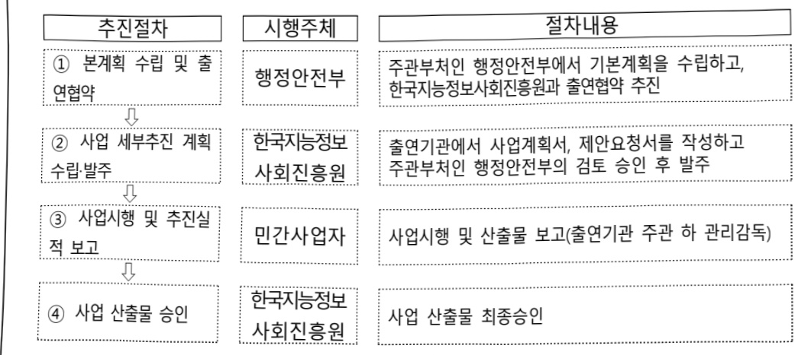

# 범정부 인공지능 공통기반 구현(정보화)

**해당 페이지**: PDF 5214 ~ 5220 쪽 해당

**부처**: 행정안전부
**분야**: 일반·지방행정
**회계유형**: 일반회계
**2026 확정예산**: 7371.0 백만원
**전년대비 증감률**: 1979.0%
**AI 도메인**: LLM/언어모델

---

### 가. 예산 총괄표

(단위: 백만원, %)

<table border=1 style='margin: auto; word-wrap: break-word;'><tr><td rowspan="2">사업명</td><td rowspan="2">2024년 결산</td><td colspan="2">2025년 예산</td><td colspan="2">2026년 예산</td><td rowspan="2">증감(B-A)</td><td rowspan="2">(B-A)/A</td></tr><tr><td style='text-align: center; word-wrap: break-word;'>본예산</td><td style='text-align: center; word-wrap: break-word;'>추경*(A)</td><td style='text-align: center; word-wrap: break-word;'>요구안</td><td style='text-align: center; word-wrap: break-word;'>본예산(B)</td></tr><tr><td style='text-align: center; word-wrap: break-word;'>범정부 인공지능 공통기반 구현</td><td style='text-align: center; word-wrap: break-word;'>-</td><td style='text-align: center; word-wrap: break-word;'>5,392</td><td style='text-align: center; word-wrap: break-word;'>5,392</td><td style='text-align: center; word-wrap: break-word;'>7,958</td><td style='text-align: center; word-wrap: break-word;'>7,371</td><td style='text-align: center; word-wrap: break-word;'>7,371</td><td style='text-align: center; word-wrap: break-word;'>1,979</td></tr></table>

* 추경: 추경증감액을 포함한 최종 예산액을 기재

## □ 기능별(내역사업별) 예산 내역

(단위: 백만원)

<table border=1 style='margin: auto; word-wrap: break-word;'><tr><td rowspan="2"></td><td colspan="5">2024</td><td colspan="5">2025</td><td rowspan="2">2026 倉塗</td></tr><tr><td style='text-align: center; word-wrap: break-word;'>倉塗処(추경)</td><td style='text-align: center; word-wrap: break-word;'>倉塗処</td><td style='text-align: center; word-wrap: break-word;'>집행処</td><td style='text-align: center; word-wrap: break-word;'>이월処</td><td style='text-align: center; word-wrap: break-word;'>불용処</td><td style='text-align: center; word-wrap: break-word;'>倉塗処(추경)</td><td style='text-align: center; word-wrap: break-word;'>倉塗処</td><td style='text-align: center; word-wrap: break-word;'>집행処</td><td style='text-align: center; word-wrap: break-word;'>이월処</td><td style='text-align: center; word-wrap: break-word;'>불용処</td></tr><tr><td style='text-align: center; word-wrap: break-word;'>○ 기능별 분류(합계)</td><td style='text-align: center; word-wrap: break-word;'>-</td><td style='text-align: center; word-wrap: break-word;'>-</td><td style='text-align: center; word-wrap: break-word;'>-</td><td style='text-align: center; word-wrap: break-word;'>-</td><td style='text-align: center; word-wrap: break-word;'>-</td><td style='text-align: center; word-wrap: break-word;'>5,392</td><td style='text-align: center; word-wrap: break-word;'>5,392</td><td style='text-align: center; word-wrap: break-word;'>5,392</td><td style='text-align: center; word-wrap: break-word;'>-</td><td style='text-align: center; word-wrap: break-word;'>-</td><td style='text-align: center; word-wrap: break-word;'>7,371</td></tr><tr><td rowspan="2">· 범정부 초거대AI 공통기반 구현 · 범정부 초거대AI 공통기반 운영</td><td style='text-align: center; word-wrap: break-word;'>-</td><td style='text-align: center; word-wrap: break-word;'>-</td><td style='text-align: center; word-wrap: break-word;'>-</td><td style='text-align: center; word-wrap: break-word;'>-</td><td style='text-align: center; word-wrap: break-word;'>-</td><td style='text-align: center; word-wrap: break-word;'>5,392</td><td style='text-align: center; word-wrap: break-word;'>5,392</td><td style='text-align: center; word-wrap: break-word;'>5,392</td><td style='text-align: center; word-wrap: break-word;'>-</td><td style='text-align: center; word-wrap: break-word;'>-</td><td style='text-align: center; word-wrap: break-word;'>7,194</td></tr><tr><td style='text-align: center; word-wrap: break-word;'>-</td><td style='text-align: center; word-wrap: break-word;'>-</td><td style='text-align: center; word-wrap: break-word;'>-</td><td style='text-align: center; word-wrap: break-word;'>-</td><td style='text-align: center; word-wrap: break-word;'>-</td><td style='text-align: center; word-wrap: break-word;'>-</td><td style='text-align: center; word-wrap: break-word;'>-</td><td style='text-align: center; word-wrap: break-word;'>-</td><td style='text-align: center; word-wrap: break-word;'>-</td><td style='text-align: center; word-wrap: break-word;'>-</td><td style='text-align: center; word-wrap: break-word;'>177</td></tr></table>

### 나. 사업설명자료

## 1 ) 사업목적·내용

- 범정부적으로 초거대 AI를 도입하여 각 기관이 특화 데이터를 활용하여 초거대 AI 서비스를 신속히 구현·운영할 수 있게 지원하는 것임

## 2 ) 사업개요

## ☐ 사업근거 및 추진경위

① 법령상 근거 및 조항 적시

- 전자정부법 제18조의2(지능형 전자정부서비스의 제공 등)

제18조의2(지능형 전자정부서비스의 제공 등)

① 행정기관등의 장은 인공지능 등의 기술을 활용하여 전자정부서비스를 제공할 수 있다.

② 행정안전부장관은 행정기관등의 장이 인공지능 등의 기술을 효율적으로 활용할 수 있도록

행정적·재정적·기술적 지원 등 필요한 지원을 할 수 있다.

---

- 전자정부법 시행령 제15조의2(지능형 전자정부서비스의 도입 및 활용)

제15조의2(지능형 전자정부서비스의 도입 및 활용)

① 법 제18조의 2 제1항에 따라 전자정부서비스 제공에 활용할 수 있는 인공지능 등의 기술은 다음 각 호와 같다.

1. 자연어 처리(컴퓨터를 이용해 사람의 언어를 분석하고 처리하는 기술을 말한다)

2. 음성인식

3. 영상인식

4. 그 밖에 전자적 방법으로 학습 · 추론 · 판단 등을 구현하는 기술로서 지능형 전자정부서비스 제공에 필요한 기술

② 행정안전부장관은 법 제18조의 2 제2항에 따라 다음 각 호의 사업을 지원할 수 있다.

1. 인공지능 등의 기술을 전자정부서비스에 적용·실증하는 사업

2. 인공지능 등의 기술을 여러 전자정부서비스에 활용할 수 있도록 공통기반을 구축하는 사업

3. 인공지능 등의 기술을 빅데이터 분석 기법 등 다른 기술이나 서비스와 융합하는 사업

4. 그 밖에 지능형 전자정부서비스의 도입이나 활용에 필요한 사업

③ 제2항에 따른 사업의 선정, 관리 등에 필요한 세부사항은 행정안전부장관이 정하여 고시한다.

## ② 추진경위

- 혁신적인 초거대 AI 서비스 ChatGPT 발표('22.11.)

- 대통령 지시사항, ChatGPT 등 세계적인 선진 서비스 벤치마킹('23.1.)

- '범정부 초거대AI 공통기반 구현 및 AI 기반 디지털 행정혁신 체계 수립을 위한 BPR/ISP' 사업추진('24.4.26.~10.31.)

- '범정부 초거대AI 공통기반 구현' 사업 추진 중('25.6.23.~'26.1.19.)

## □ 주요내용

① 사업규모

- 총사업비 : 해당 없음

- 사업기간 : '25 ~ 계속

- 최근 5년 간 투입된 사업비

<table border=1 style='margin: auto; word-wrap: break-word;'><tr><td style='text-align: center; word-wrap: break-word;'>$ \underline{\text{所}} $</td><td style='text-align: center; word-wrap: break-word;'>2022</td><td style='text-align: center; word-wrap: break-word;'>2023</td><td style='text-align: center; word-wrap: break-word;'>2024</td><td style='text-align: center; word-wrap: break-word;'>2025</td><td style='text-align: center; word-wrap: break-word;'>2026</td></tr><tr><td style='text-align: center; word-wrap: break-word;'>$ \underline{\text{사}} $</td><td style='text-align: center; word-wrap: break-word;'>-</td><td style='text-align: center; word-wrap: break-word;'>-</td><td style='text-align: center; word-wrap: break-word;'>-</td><td style='text-align: center; word-wrap: break-word;'>5,392</td><td style='text-align: center; word-wrap: break-word;'>7,371</td></tr></table>

-기타:해당 없음

② 사업추진체계

- 사업시행방법 : 출연

- 사업시행주체 : 행정안전부, 한국지능정보사회진흥원

- 사업 수혜자 : 국민, 행정기관, 디지털정부서비스 관련 기업 등

---

- 보조, 융자, 출연, 출자 등의 경우 보조 · 융자 등 지원 비율 및 법적근거

<table border=1 style='margin: auto; word-wrap: break-word;'><tr><td style='text-align: center; word-wrap: break-word;'>내역사업명</td><td style='text-align: center; word-wrap: break-word;'>구분</td><td style='text-align: center; word-wrap: break-word;'>피보조·피출연 등 기관명</td><td style='text-align: center; word-wrap: break-word;'>지원 금액 (2026예산)</td><td style='text-align: center; word-wrap: break-word;'>지원 비율(%)</td><td style='text-align: center; word-wrap: break-word;'>보조율 법적근거 (해당 조항)</td></tr><tr><td style='text-align: center; word-wrap: break-word;'>범정부 초거대AI 공통기반 구현</td><td style='text-align: center; word-wrap: break-word;'>출연</td><td style='text-align: center; word-wrap: break-word;'>한국지능 정보사회 진흥원</td><td style='text-align: center; word-wrap: break-word;'>7,371</td><td style='text-align: center; word-wrap: break-word;'>100</td><td style='text-align: center; word-wrap: break-word;'>지능정보화기본법 제12조 제4항 (한국지능정보사회진흥원의 설립)</td></tr></table>

## 3 ) 2026년도 예산 산출 근거

☐ 범정부 인공지능 공통기반 구현 : (2026 예산) 7,371백만원

① 범정부 초거대AI 공통기반 구현 : (2026) 7,194백만원
- (요구) 공통기반 구현 2년차로 공용 학습데이터 잔여분(40%), RAG(4종) 구축·적용에 따라 증액 요구
- (산출) 공용 학습데이터, RAG 구축·적용, 관리자시스템 인프라 구독, AI 신기술 검증 = 7,149백만원
- 학습데이터 구축 및 적용 : (2025) 5,272 → (2026) 6,292백만원 (+1,020백)
* 공용 학습데이터 구축 : ('25) 60% → ('26) 40%
- (공용 학습데이터) 199MM × 6.57백만원 = 1,308백만원
* RAG 구축·적용을 통한 민간모델 서비스 개선 : ('25) 2종 → ('26) 4종
- (RAG 구축) 17MM × 22.8백만원 × 4종 = 1,550백만원
- (RAG 적용) 38MM × 22.6백만원 × 4종 = 3,434백만원
※ ('25년) 내부 자료 검색, 단순형 문서 초안 작성 등 2종
(26년) 외부 전문자료 검색, 복합형 문서 초안 작성, 규정기반 검토 서비스,
민원상담 서비스 등 4종('25년 수요조사 및 용역사업을 통해 확정)
관리자시스템 인프라 구독 : (2025) 120 → (2026) 73백만원 (△47백)
WEB(2), WAS(2), DB(2), ST(1) 등 7대 × 1.4백만원 × 12개월 × 60.8% = 73백만원
AI 신기술 도입을 위한 검증* : (2025) 0 → (2026) 829백만원 (순증)
업무관리시스템, e사람 등 개별 AI 에이전트 연결에 필요한 기반기술 및 사용성 검증
(신기술 검증) 응용SW개발자 36M × 23백 = 829백만원
AI분야 민간 신기술
AI 에이전트 : 단순 질의 답변을 넘어 업무절차를 정의하고 수행을 대행하는 AI 기능
MCP : AI 에이전트와 다른 시스템 도구 및 데이터 원천을 연결하는 연결 방식의 표준화
(Anthropic)
A2A : AI 에이전트와 다른 AI 에이전트 간의 소통을 위한 협력 방식의 표준화(Google)
- 25년 공통서비스 2종* 운영에 따른 서비스 개선 요구 반영, 학습데이터(RAG) 현행화 등
인건비 소요
* 민간모델 서비스 중 자료 검색, 문서 초안 작성 기능 개선
(산출) 응용SW개발자 12MM × 23,000천원 × 64% = 177백만원

---

## 4 ) 사업효과

사업영향, 산출물 성과지표 등

① 2022~2026년도 성과계획서 상 성과지표 및 최근 5년간 성과 달성도

<table border=1 style='margin: auto; word-wrap: break-word;'><tr><td style='text-align: center; word-wrap: break-word;'>성과지표</td><td style='text-align: center; word-wrap: break-word;'>구분</td><td style='text-align: center; word-wrap: break-word;'>2022</td><td style='text-align: center; word-wrap: break-word;'>2023</td><td style='text-align: center; word-wrap: break-word;'>2024</td><td style='text-align: center; word-wrap: break-word;'>2025</td><td style='text-align: center; word-wrap: break-word;'>2026</td><td style='text-align: center; word-wrap: break-word;'>2026 목표치산출근거</td><td style='text-align: center; word-wrap: break-word;'>측정산식(또는 측정방법)</td><td style='text-align: center; word-wrap: break-word;'>자료수집방법(또는 자료출처)</td></tr><tr><td rowspan="3">인공지능전자정부서비스 이용률(단위: %)</td><td style='text-align: center; word-wrap: break-word;'>목표</td><td style='text-align: center; word-wrap: break-word;'>-</td><td style='text-align: center; word-wrap: break-word;'>-</td><td style='text-align: center; word-wrap: break-word;'>-</td><td style='text-align: center; word-wrap: break-word;'>18</td><td style='text-align: center; word-wrap: break-word;'>19.8</td><td rowspan="3">전년도 실적의 10% 증가율적용</td><td rowspan="3">‘최근 1년간 인공지능(AI)을 활용한 전자정부서비스를 이용한 적이 있다’라고답한 국민 수/ 전체 표본 국민 수만 16~74세의 일반국민, 4,000명)×100</td><td rowspan="3">국가승인통계</td></tr><tr><td style='text-align: center; word-wrap: break-word;'>실적</td><td style='text-align: center; word-wrap: break-word;'>-</td><td style='text-align: center; word-wrap: break-word;'>-</td><td style='text-align: center; word-wrap: break-word;'>-</td><td style='text-align: center; word-wrap: break-word;'>-</td><td style='text-align: center; word-wrap: break-word;'>-</td></tr><tr><td style='text-align: center; word-wrap: break-word;'>달성도</td><td style='text-align: center; word-wrap: break-word;'>-</td><td style='text-align: center; word-wrap: break-word;'>-</td><td style='text-align: center; word-wrap: break-word;'>-</td><td style='text-align: center; word-wrap: break-word;'>-</td><td style='text-align: center; word-wrap: break-word;'>-</td></tr><tr><td rowspan="3">전자정부서비스만족도(단위: 점)</td><td style='text-align: center; word-wrap: break-word;'>목표</td><td style='text-align: center; word-wrap: break-word;'>-</td><td style='text-align: center; word-wrap: break-word;'>87.9</td><td style='text-align: center; word-wrap: break-word;'>87.9</td><td style='text-align: center; word-wrap: break-word;'>87.9</td><td style='text-align: center; word-wrap: break-word;'>-</td><td rowspan="3">해당없음</td><td rowspan="3">전자정부서비스만족도(점) = ‘최근 1년 간 전자정부서비스에 대해 전반적으로 만족한다’는 문장에 대해 7점 리카트 척도 점수를 100점으로 환산하여 평균값산출</td><td rowspan="3">국가승인통계</td></tr><tr><td style='text-align: center; word-wrap: break-word;'>실적</td><td style='text-align: center; word-wrap: break-word;'>- (87.7)</td><td style='text-align: center; word-wrap: break-word;'>86.3</td><td style='text-align: center; word-wrap: break-word;'>89.4</td><td style='text-align: center; word-wrap: break-word;'>-</td><td style='text-align: center; word-wrap: break-word;'>-</td></tr><tr><td style='text-align: center; word-wrap: break-word;'>달성도</td><td style='text-align: center; word-wrap: break-word;'>-</td><td style='text-align: center; word-wrap: break-word;'>98.2</td><td style='text-align: center; word-wrap: break-word;'>102.4</td><td style='text-align: center; word-wrap: break-word;'>-</td><td style='text-align: center; word-wrap: break-word;'>-</td></tr><tr><td rowspan="3">전자정부서비스이용률(고령층)(단위: %)</td><td style='text-align: center; word-wrap: break-word;'>목표</td><td style='text-align: center; word-wrap: break-word;'>59.9</td><td style='text-align: center; word-wrap: break-word;'>68.1</td><td style='text-align: center; word-wrap: break-word;'>-</td><td style='text-align: center; word-wrap: break-word;'>-</td><td style='text-align: center; word-wrap: break-word;'>-</td><td rowspan="3">해당없음</td><td rowspan="3">전자정부서비스이용률(고령층)(%) = ‘최근1년 간 전자정부서비스를 이용해본 적이 있다’라고 답한 만60~74세 국민수/ (전체표본(만16~74세 일반국민 4,000명) 중 만074세 국민수×100</td><td rowspan="3">국가승인통계</td></tr><tr><td style='text-align: center; word-wrap: break-word;'>실적</td><td style='text-align: center; word-wrap: break-word;'>77.2</td><td style='text-align: center; word-wrap: break-word;'>73.4</td><td style='text-align: center; word-wrap: break-word;'>-</td><td style='text-align: center; word-wrap: break-word;'>-</td><td style='text-align: center; word-wrap: break-word;'>-</td></tr><tr><td style='text-align: center; word-wrap: break-word;'>달성도</td><td style='text-align: center; word-wrap: break-word;'>128.9</td><td style='text-align: center; word-wrap: break-word;'>107.8</td><td style='text-align: center; word-wrap: break-word;'>-</td><td style='text-align: center; word-wrap: break-word;'>-</td><td style='text-align: center; word-wrap: break-word;'>-</td></tr><tr><td rowspan="3">전자정부서비스이용률(단위: %)</td><td style='text-align: center; word-wrap: break-word;'>목표</td><td style='text-align: center; word-wrap: break-word;'>89.6</td><td style='text-align: center; word-wrap: break-word;'>-</td><td style='text-align: center; word-wrap: break-word;'>-</td><td style='text-align: center; word-wrap: break-word;'>-</td><td style='text-align: center; word-wrap: break-word;'>-</td><td rowspan="3">해당없음</td><td rowspan="3">전자정부서비스이용률(전체)(%) = ‘최근1년 간 전자정부서비스를 이용해본 적이 있다’라고 답한 국민수/ 전체표본 국민수(만16~74세 의 일반국민 4,000명)×100</td><td rowspan="3">국가승인통계</td></tr><tr><td style='text-align: center; word-wrap: break-word;'>실적</td><td style='text-align: center; word-wrap: break-word;'>92.2</td><td style='text-align: center; word-wrap: break-word;'>90.6</td><td style='text-align: center; word-wrap: break-word;'>-</td><td style='text-align: center; word-wrap: break-word;'>-</td><td style='text-align: center; word-wrap: break-word;'>-</td></tr><tr><td style='text-align: center; word-wrap: break-word;'>달성도</td><td style='text-align: center; word-wrap: break-word;'>102.9</td><td style='text-align: center; word-wrap: break-word;'>-</td><td style='text-align: center; word-wrap: break-word;'>-</td><td style='text-align: center; word-wrap: break-word;'>-</td><td style='text-align: center; word-wrap: break-word;'>-</td></tr><tr><td rowspan="3">주요공공서비스의디지털 전환율(단위: %)</td><td style='text-align: center; word-wrap: break-word;'>목표</td><td style='text-align: center; word-wrap: break-word;'>50</td><td style='text-align: center; word-wrap: break-word;'>-</td><td style='text-align: center; word-wrap: break-word;'>-</td><td style='text-align: center; word-wrap: break-word;'>-</td><td style='text-align: center; word-wrap: break-word;'>-</td><td rowspan="3">해당없음</td><td rowspan="3">주요 공공서비스의 디지털 전환율 = ‘개별 공공서비스의 디지털 전환율 전체의 평균값-개별 공공서비스의 디지털 전환율 = ‘해당 서비스의 공동지표와 서비스 유형론 지표에서의 총 획득점수 = ‘적용된 지표의 총 배점’</td><td rowspan="3">외부전문가를 통한 사용자(end user)관점의 측정 주요 공공서비스(10대 분야 27개 소분류 56개 서비스)</td></tr><tr><td style='text-align: center; word-wrap: break-word;'>실적</td><td style='text-align: center; word-wrap: break-word;'>67.3</td><td style='text-align: center; word-wrap: break-word;'>-</td><td style='text-align: center; word-wrap: break-word;'>-</td><td style='text-align: center; word-wrap: break-word;'>-</td><td style='text-align: center; word-wrap: break-word;'>-</td></tr><tr><td style='text-align: center; word-wrap: break-word;'>달성도</td><td style='text-align: center; word-wrap: break-word;'>134.6</td><td style='text-align: center; word-wrap: break-word;'>-</td><td style='text-align: center; word-wrap: break-word;'>-</td><td style='text-align: center; word-wrap: break-word;'>-</td><td style='text-align: center; word-wrap: break-word;'>-</td></tr></table>

---

② 성과지표 이외의 연도별 사업추진 경과 및 실적

<table border=1 style='margin: auto; word-wrap: break-word;'><tr><td style='text-align: center; word-wrap: break-word;'>2024</td><td style='text-align: center; word-wrap: break-word;'>·&#x27;범정부 초거대 AI 공통기반 구현 및 AI 기반 디지털 행정혁신 체계 수립을 위한 BPR/ISP&#x27; 사업 추진(&#x27;24.4.26. ~ 10.31., 1,075백만원)</td></tr><tr><td style='text-align: center; word-wrap: break-word;'>2025</td><td style='text-align: center; word-wrap: break-word;'>·&#x27;범정부 초거대 AI 공통기반 구현(&#x27;25.6.23. ~ &#x27;26.1.19., 8,455백만원)</td></tr></table>

③향후(2026년도 이후)기대효과

- 기관별 도입에 따른 중복투자 비용을 절감하고 범정부적 AI 기반 행정으로의 신속한 전환을 통해 행정 효율 및 서비스 품질 개선

5) 타당성조사 및 예비타당성조사 시행여부 및 결과 요지 : 해당 없음

## 6 ) 총사업비 대상사업 정보 : 해당 없음

## 7 ) 사업 집행절차

## 8 ) 각종 평가 : 해당 없음

---

### 다. 최근 4년간 결산내역

## 1 ) 결산표

☐ 부처 결산내역

(단위: 백만원, %)

<table border=1 style='margin: auto; word-wrap: break-word;'><tr><td rowspan="2">연도</td><td colspan="3">예산액</td><td rowspan="2">예산현액(A)</td><td rowspan="2">집행액(B)</td><td rowspan="2">집행률(B/A)</td><td rowspan="2">다음연도이월액</td><td rowspan="2">불용액</td></tr><tr><td style='text-align: center; word-wrap: break-word;'>본예산</td><td style='text-align: center; word-wrap: break-word;'>추경증감액</td><td style='text-align: center; word-wrap: break-word;'>추경</td></tr><tr><td style='text-align: center; word-wrap: break-word;'>2022</td><td style='text-align: center; word-wrap: break-word;'>-</td><td style='text-align: center; word-wrap: break-word;'>-</td><td style='text-align: center; word-wrap: break-word;'>-</td><td style='text-align: center; word-wrap: break-word;'>-</td><td style='text-align: center; word-wrap: break-word;'>-</td><td style='text-align: center; word-wrap: break-word;'>-</td><td style='text-align: center; word-wrap: break-word;'>-</td><td style='text-align: center; word-wrap: break-word;'>-</td></tr><tr><td style='text-align: center; word-wrap: break-word;'>2023</td><td style='text-align: center; word-wrap: break-word;'>-</td><td style='text-align: center; word-wrap: break-word;'>-</td><td style='text-align: center; word-wrap: break-word;'>-</td><td style='text-align: center; word-wrap: break-word;'>-</td><td style='text-align: center; word-wrap: break-word;'>-</td><td style='text-align: center; word-wrap: break-word;'>-</td><td style='text-align: center; word-wrap: break-word;'>-</td><td style='text-align: center; word-wrap: break-word;'>-</td></tr><tr><td style='text-align: center; word-wrap: break-word;'>2024</td><td style='text-align: center; word-wrap: break-word;'>-</td><td style='text-align: center; word-wrap: break-word;'>-</td><td style='text-align: center; word-wrap: break-word;'>-</td><td style='text-align: center; word-wrap: break-word;'>-</td><td style='text-align: center; word-wrap: break-word;'>-</td><td style='text-align: center; word-wrap: break-word;'>-</td><td style='text-align: center; word-wrap: break-word;'>-</td><td style='text-align: center; word-wrap: break-word;'>-</td></tr><tr><td style='text-align: center; word-wrap: break-word;'>2025</td><td style='text-align: center; word-wrap: break-word;'>5,392</td><td style='text-align: center; word-wrap: break-word;'>-</td><td style='text-align: center; word-wrap: break-word;'>5,392</td><td style='text-align: center; word-wrap: break-word;'>5,392</td><td style='text-align: center; word-wrap: break-word;'>5,392</td><td style='text-align: center; word-wrap: break-word;'>100</td><td style='text-align: center; word-wrap: break-word;'>-</td><td style='text-align: center; word-wrap: break-word;'>-</td></tr></table>

## 2 ) 주요 결산사항

□ 2022~2025년 결산 주요사항

<table border=1 style='margin: auto; word-wrap: break-word;'><tr><td style='text-align: center; word-wrap: break-word;'>2022</td><td style='text-align: center; word-wrap: break-word;'>- 해당없음</td></tr><tr><td style='text-align: center; word-wrap: break-word;'>2023</td><td style='text-align: center; word-wrap: break-word;'>- 해당없음</td></tr><tr><td style='text-align: center; word-wrap: break-word;'>2024</td><td style='text-align: center; word-wrap: break-word;'>- 해당없음</td></tr><tr><td style='text-align: center; word-wrap: break-word;'>2025</td><td style='text-align: center; word-wrap: break-word;'>- 해당없음</td></tr></table>

□ 2025년 이·전용 등 세부내역 : 해당 없음

---

<table border=1 style='margin: auto; word-wrap: break-word;'><tr><td style='text-align: center; word-wrap: break-word;'>사 업 명</td></tr><tr><td style='text-align: center; word-wrap: break-word;'>(18) 재난 및 안전관리 연구개발(R&amp;D) (2931-535)</td></tr></table>

## □ 사업 코드 정보

<table border=1 style='margin: auto; word-wrap: break-word;'><tr><td style='text-align: center; word-wrap: break-word;'>구분</td><td style='text-align: center; word-wrap: break-word;'>회계</td><td style='text-align: center; word-wrap: break-word;'>소관</td><td style='text-align: center; word-wrap: break-word;'>실국(기관)</td><td style='text-align: center; word-wrap: break-word;'>계정</td><td style='text-align: center; word-wrap: break-word;'>분야</td><td style='text-align: center; word-wrap: break-word;'>부문</td></tr><tr><td style='text-align: center; word-wrap: break-word;'>코드</td><td rowspan="2">일반회계</td><td rowspan="2">행정안전부</td><td style='text-align: center; word-wrap: break-word;'>안전예방정책실</td><td rowspan="2">-</td><td style='text-align: center; word-wrap: break-word;'>020</td><td style='text-align: center; word-wrap: break-word;'>025</td></tr><tr><td style='text-align: center; word-wrap: break-word;'>명칭</td><td style='text-align: center; word-wrap: break-word;'>안전정책국</td><td style='text-align: center; word-wrap: break-word;'>공공질서및안전</td><td style='text-align: center; word-wrap: break-word;'>재난관리</td></tr></table>

<table border=1 style='margin: auto; word-wrap: break-word;'><tr><td style='text-align: center; word-wrap: break-word;'>구분</td><td style='text-align: center; word-wrap: break-word;'>프로그램</td><td style='text-align: center; word-wrap: break-word;'>단위사업</td><td style='text-align: center; word-wrap: break-word;'>세부사업</td></tr><tr><td style='text-align: center; word-wrap: break-word;'>코드</td><td style='text-align: center; word-wrap: break-word;'>2900</td><td style='text-align: center; word-wrap: break-word;'>2931</td><td style='text-align: center; word-wrap: break-word;'>535</td></tr><tr><td style='text-align: center; word-wrap: break-word;'>명칭</td><td style='text-align: center; word-wrap: break-word;'>재난안전기술개발</td><td style='text-align: center; word-wrap: break-word;'>재난안전기술개발</td><td style='text-align: center; word-wrap: break-word;'>재난 및 안전관리 연구개발(R&amp;D)</td></tr></table>

□ 사업 성격

<table border=1 style='margin: auto; word-wrap: break-word;'><tr><td rowspan="2">신규 계속</td><td rowspan="2">완료</td><td rowspan="2">예비타당성 실시여부</td><td rowspan="2">총사업비 관리대상</td><td rowspan="2">총액계상 예산사업</td><td style='text-align: center; word-wrap: break-word;'>사업소관 변경정보</td></tr><tr><td style='text-align: center; word-wrap: break-word;'>2025예산 시 소관</td></tr><tr><td style='text-align: center; word-wrap: break-word;'>☐</td><td style='text-align: center; word-wrap: break-word;'></td><td style='text-align: center; word-wrap: break-word;'>☐</td><td style='text-align: center; word-wrap: break-word;'></td><td style='text-align: center; word-wrap: break-word;'></td><td style='text-align: center; word-wrap: break-word;'></td></tr></table>

□ 사업 지원 형태 및 지원을

<table border=1 style='margin: auto; word-wrap: break-word;'><tr><td style='text-align: center; word-wrap: break-word;'>직접</td><td style='text-align: center; word-wrap: break-word;'>출자</td><td style='text-align: center; word-wrap: break-word;'>출연</td><td style='text-align: center; word-wrap: break-word;'>보조</td><td style='text-align: center; word-wrap: break-word;'>융자</td><td style='text-align: center; word-wrap: break-word;'>국고보조율(%)</td><td style='text-align: center; word-wrap: break-word;'>융자율(%)</td></tr><tr><td style='text-align: center; word-wrap: break-word;'></td><td style='text-align: center; word-wrap: break-word;'></td><td style='text-align: center; word-wrap: break-word;'>○</td><td style='text-align: center; word-wrap: break-word;'></td><td style='text-align: center; word-wrap: break-word;'></td><td style='text-align: center; word-wrap: break-word;'></td><td style='text-align: center; word-wrap: break-word;'></td></tr></table>

## □ 사업 담당자

<table border=1 style='margin: auto; word-wrap: break-word;'><tr><td style='text-align: center; word-wrap: break-word;'>사업명</td><td colspan="2">구분</td></tr><tr><td rowspan="3">재난 및 안전관리 연구개발 (R&amp;D)</td><td rowspan="2">소관부처</td><td style='text-align: center; word-wrap: break-word;'>안전예방정책실 안전정책국</td></tr><tr><td style='text-align: center; word-wrap: break-word;'>재난안전연구개발과</td></tr><tr><td style='text-align: center; word-wrap: break-word;'>사업시행주체</td><td style='text-align: center; word-wrap: break-word;'>한국산업기술기획평가원</td></tr></table>

---

### 원본 PDF 크롭 이미지

