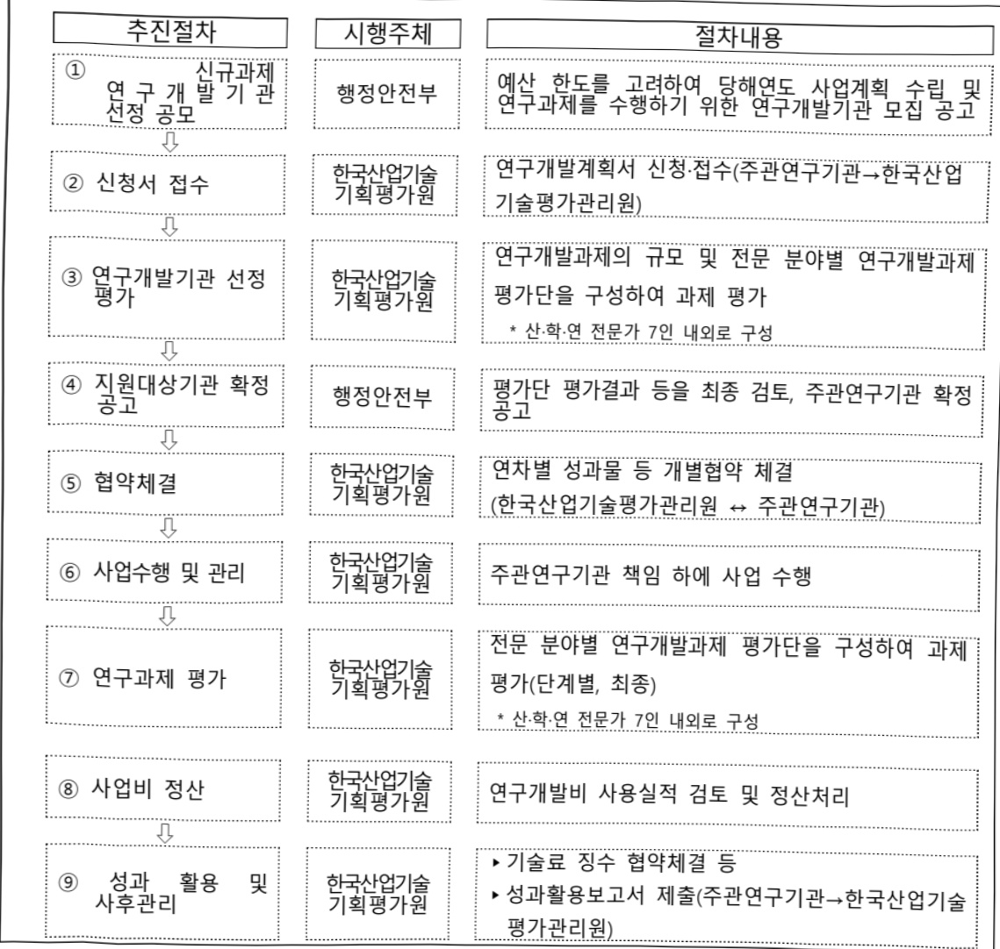

# 재난및안전관리연구개발(R&D)

**해당 페이지**: PDF 5221 ~ 5229 쪽 해당

**부처**: 행정안전부
**분야**: 공공질서 및 안전
**회계유형**: 일반회계
**2026 확정예산**: 26766.0 백만원
**전년대비 증감률**: -15.7%
**AI 도메인**: 교통/모빌리티, 재난/안전

---

<table border=1 style='margin: auto; word-wrap: break-word;'><tr><td style='text-align: center; word-wrap: break-word;'>사 업 명</td></tr><tr><td style='text-align: center; word-wrap: break-word;'>(18) 재난 및 안전관리 연구개발(R&amp;D) (2931-535)</td></tr></table>

## □ 사업 코드 정보

<table border=1 style='margin: auto; word-wrap: break-word;'><tr><td style='text-align: center; word-wrap: break-word;'>구분</td><td style='text-align: center; word-wrap: break-word;'>회계</td><td style='text-align: center; word-wrap: break-word;'>소관</td><td style='text-align: center; word-wrap: break-word;'>실국(기관)</td><td style='text-align: center; word-wrap: break-word;'>계정</td><td style='text-align: center; word-wrap: break-word;'>분야</td><td style='text-align: center; word-wrap: break-word;'>부문</td></tr><tr><td style='text-align: center; word-wrap: break-word;'>코드</td><td rowspan="2">일반회계</td><td rowspan="2">행정안전부</td><td style='text-align: center; word-wrap: break-word;'>안전예방정책실</td><td rowspan="2">-</td><td style='text-align: center; word-wrap: break-word;'>020</td><td style='text-align: center; word-wrap: break-word;'>025</td></tr><tr><td style='text-align: center; word-wrap: break-word;'>명칭</td><td style='text-align: center; word-wrap: break-word;'>안전정책국</td><td style='text-align: center; word-wrap: break-word;'>공공질서및안전</td><td style='text-align: center; word-wrap: break-word;'>재난관리</td></tr></table>

<table border=1 style='margin: auto; word-wrap: break-word;'><tr><td style='text-align: center; word-wrap: break-word;'>구분</td><td style='text-align: center; word-wrap: break-word;'>프로그램</td><td style='text-align: center; word-wrap: break-word;'>단위사업</td><td style='text-align: center; word-wrap: break-word;'>세부사업</td></tr><tr><td style='text-align: center; word-wrap: break-word;'>코드</td><td style='text-align: center; word-wrap: break-word;'>2900</td><td style='text-align: center; word-wrap: break-word;'>2931</td><td style='text-align: center; word-wrap: break-word;'>535</td></tr><tr><td style='text-align: center; word-wrap: break-word;'>명칭</td><td style='text-align: center; word-wrap: break-word;'>재난안전기술개발</td><td style='text-align: center; word-wrap: break-word;'>재난안전기술개발</td><td style='text-align: center; word-wrap: break-word;'>재난 및 안전관리 연구개발(R&amp;D)</td></tr></table>

□ 사업 성격

<table border=1 style='margin: auto; word-wrap: break-word;'><tr><td rowspan="2">신규 계속</td><td rowspan="2">완료</td><td rowspan="2">예비타당성 실시여부</td><td rowspan="2">총사업비 관리대상</td><td rowspan="2">총액계상 예산사업</td><td style='text-align: center; word-wrap: break-word;'>사업소관 변경정보</td></tr><tr><td style='text-align: center; word-wrap: break-word;'>2025예산 시 소관</td></tr><tr><td style='text-align: center; word-wrap: break-word;'>☐</td><td style='text-align: center; word-wrap: break-word;'></td><td style='text-align: center; word-wrap: break-word;'>☐</td><td style='text-align: center; word-wrap: break-word;'></td><td style='text-align: center; word-wrap: break-word;'></td><td style='text-align: center; word-wrap: break-word;'></td></tr></table>

□ 사업 지원 형태 및 지원을

<table border=1 style='margin: auto; word-wrap: break-word;'><tr><td style='text-align: center; word-wrap: break-word;'>직접</td><td style='text-align: center; word-wrap: break-word;'>출자</td><td style='text-align: center; word-wrap: break-word;'>출연</td><td style='text-align: center; word-wrap: break-word;'>보조</td><td style='text-align: center; word-wrap: break-word;'>융자</td><td style='text-align: center; word-wrap: break-word;'>국고보조율(%)</td><td style='text-align: center; word-wrap: break-word;'>융자율(%)</td></tr><tr><td style='text-align: center; word-wrap: break-word;'></td><td style='text-align: center; word-wrap: break-word;'></td><td style='text-align: center; word-wrap: break-word;'>○</td><td style='text-align: center; word-wrap: break-word;'></td><td style='text-align: center; word-wrap: break-word;'></td><td style='text-align: center; word-wrap: break-word;'></td><td style='text-align: center; word-wrap: break-word;'></td></tr></table>

## □ 사업 담당자

<table border=1 style='margin: auto; word-wrap: break-word;'><tr><td style='text-align: center; word-wrap: break-word;'>사업명</td><td colspan="2">구분</td></tr><tr><td rowspan="3">재난 및 안전관리 연구개발 (R&amp;D)</td><td rowspan="2">소관부처</td><td style='text-align: center; word-wrap: break-word;'>안전예방정책실 안전정책국</td></tr><tr><td style='text-align: center; word-wrap: break-word;'>재난안전연구개발과</td></tr><tr><td style='text-align: center; word-wrap: break-word;'>사업시행주체</td><td style='text-align: center; word-wrap: break-word;'>한국산업기술기획평가원</td></tr></table>

---

### 가. 예산 총괄표

(단위: 백만원, %)

<table border=1 style='margin: auto; word-wrap: break-word;'><tr><td rowspan="2">사업명</td><td rowspan="2">2024년 결산</td><td colspan="2">2025년 예산</td><td colspan="2">2026년 예산</td><td rowspan="2">증감(B-A)</td><td rowspan="2">(B-A)/A</td></tr><tr><td style='text-align: center; word-wrap: break-word;'>본예산</td><td style='text-align: center; word-wrap: break-word;'>추경(A)</td><td style='text-align: center; word-wrap: break-word;'>요구안</td><td style='text-align: center; word-wrap: break-word;'>본예산(B)</td></tr><tr><td style='text-align: center; word-wrap: break-word;'>재난 및 안전관리연구개발(R&amp;D)</td><td style='text-align: center; word-wrap: break-word;'>32,940</td><td style='text-align: center; word-wrap: break-word;'>31,744</td><td style='text-align: center; word-wrap: break-word;'>31,744</td><td style='text-align: center; word-wrap: break-word;'>26,766</td><td style='text-align: center; word-wrap: break-word;'>26,766</td><td style='text-align: center; word-wrap: break-word;'>△4,978</td><td style='text-align: center; word-wrap: break-word;'>△15.7</td></tr></table>

□ 기능별(내역사업별) 예산 내역

(단위:백만원)

<table border=1 style='margin: auto; word-wrap: break-word;'><tr><td rowspan="2"></td><td colspan="5">2024</td><td colspan="5">2025</td><td rowspan="2">2026예산</td></tr><tr><td style='text-align: center; word-wrap: break-word;'>예산액(추경)</td><td style='text-align: center; word-wrap: break-word;'>예산현액</td><td style='text-align: center; word-wrap: break-word;'>집행액</td><td style='text-align: center; word-wrap: break-word;'>이월액</td><td style='text-align: center; word-wrap: break-word;'>불용액</td><td style='text-align: center; word-wrap: break-word;'>본예산</td><td style='text-align: center; word-wrap: break-word;'>예산현액</td><td style='text-align: center; word-wrap: break-word;'>집행액</td><td style='text-align: center; word-wrap: break-word;'>이월액</td><td style='text-align: center; word-wrap: break-word;'>불용액</td></tr><tr><td style='text-align: center; word-wrap: break-word;'>○ 기능별 분류(합계)</td><td style='text-align: center; word-wrap: break-word;'>32,940</td><td style='text-align: center; word-wrap: break-word;'>32,940</td><td style='text-align: center; word-wrap: break-word;'>32,940</td><td style='text-align: center; word-wrap: break-word;'>-</td><td style='text-align: center; word-wrap: break-word;'>-</td><td style='text-align: center; word-wrap: break-word;'>31,744</td><td style='text-align: center; word-wrap: break-word;'>31,744</td><td style='text-align: center; word-wrap: break-word;'>31,744</td><td style='text-align: center; word-wrap: break-word;'>-</td><td style='text-align: center; word-wrap: break-word;'>550</td><td style='text-align: center; word-wrap: break-word;'>26,766</td></tr><tr><td style='text-align: center; word-wrap: break-word;'>· 자연재난 R&amp;D</td><td style='text-align: center; word-wrap: break-word;'>17,500</td><td style='text-align: center; word-wrap: break-word;'>17,500</td><td style='text-align: center; word-wrap: break-word;'>17,500</td><td style='text-align: center; word-wrap: break-word;'>-</td><td style='text-align: center; word-wrap: break-word;'>-</td><td style='text-align: center; word-wrap: break-word;'>19,428</td><td style='text-align: center; word-wrap: break-word;'>19,428</td><td style='text-align: center; word-wrap: break-word;'>19,428</td><td style='text-align: center; word-wrap: break-word;'>-</td><td style='text-align: center; word-wrap: break-word;'>-</td><td style='text-align: center; word-wrap: break-word;'>15,170</td></tr><tr><td style='text-align: center; word-wrap: break-word;'>· 사회재난 R&amp;D</td><td style='text-align: center; word-wrap: break-word;'>14,270</td><td style='text-align: center; word-wrap: break-word;'>14,270</td><td style='text-align: center; word-wrap: break-word;'>14,270</td><td style='text-align: center; word-wrap: break-word;'>-</td><td style='text-align: center; word-wrap: break-word;'>-</td><td style='text-align: center; word-wrap: break-word;'>12,316</td><td style='text-align: center; word-wrap: break-word;'>12,316</td><td style='text-align: center; word-wrap: break-word;'>12,316</td><td style='text-align: center; word-wrap: break-word;'>-</td><td style='text-align: center; word-wrap: break-word;'>550</td><td style='text-align: center; word-wrap: break-word;'>11,116</td></tr><tr><td style='text-align: center; word-wrap: break-word;'>· 안전사고 R&amp;D</td><td style='text-align: center; word-wrap: break-word;'>1,170</td><td style='text-align: center; word-wrap: break-word;'>1,170</td><td style='text-align: center; word-wrap: break-word;'>1,170</td><td style='text-align: center; word-wrap: break-word;'>-</td><td style='text-align: center; word-wrap: break-word;'>-</td><td style='text-align: center; word-wrap: break-word;'>-</td><td style='text-align: center; word-wrap: break-word;'>-</td><td style='text-align: center; word-wrap: break-word;'>-</td><td style='text-align: center; word-wrap: break-word;'>-</td><td style='text-align: center; word-wrap: break-word;'>-</td><td style='text-align: center; word-wrap: break-word;'>480</td></tr></table>

※(불용예상액)25년 계속 1개 과제(550백만원)중단(성실)

### 나. 사업설명자료

## 1 ) 사업목적·내용

- (재난 및 안전관리 연구개발사업(R&D) '재난안전 현안문제 해결과 미래 대응을 위한 3대 전략분야(자연재난, 사회재난, 안전사고) 현장활용 핵심기술 확보'를 목표로 행정안전부 고유임무 중심의 연구개발 추진

- (내역1: 자연재난 R&D) 기후변화로 인한 재난 피해 최소화를 위한 사전대비 현장 대응 기술개발을 목표로 피해예측, 위험감지, 예경보, 현장대응 4개의 중점분야에 대한 연구개발 추진

- (내역2: 사회재난 R&D) 세월호, 이태원 참사 등 다양한 사회재난에 대응할 수 있는 현안문제 해결을 위한 기술개발을 목표로 인파관리, 선박사고, 대형화재, 대형봉괴 4개의 중점분야에 대한 연구개발 추진

---

- (내역3: 안전사고 R&D) 어린이보호구역내 인명사고 등 안전사고로부터 사상자 수감소를 위한 안전사고 감시·구조 기술개발을 목표로 수난사고, 교통사고, 승강기사고 3개의 중점분야에 대한 연구개발 추진

## 2 ) 사업개요

## □ 사업근거 및 추진경위

① 법령상 근거 및 조항 적시

- 「재난 및 안전관리 기본법」 제4조(국가 등의 책무), 제71조(재난 및 안전관리에 필요한 과학기술의 진흥 등)

- 「자연재해대책법」제3조(책무), 제29조(가뭄 방재를 위한 조사·연구), 제35조(중앙긴급지원체계의 구축), 제58조(방재기술의 연구·개발 및 방재산업의 육성)

- 「재난안전산업 진흥법」 제11조(기술개발 촉진을 위한 사업 추진)

- 「지진 · 화산재해대책법」 제22조(지진·화산재해경감 연구 및 기술개발)

-「재난안전통신망법」제4조(재난안전통신망의 구축 및 운영에 관한 기본계획)

## ② 추진경위

- (24.01.16) R&D 예비타당성조사 제도 개편방안 심의·확정(부처 고유임무형계속 사업 신설)

- (24.02.27~03.27) 부처 대상 고유임무형 계속사업 수요조사 실시(과기부)

- (24.04.22) 고유임무형 계속사업 R&D 사업(재난 및 안전관리 연구개발사업)선정

- (24.05~09)「행정안전부 주관·지원 재난안전 분야 중장기(24~29) 중점기술 연구 개발 로드맵」기반 재난 및 안전관리 연구개발사업 통합·재기획 실시

- (‘24.10~11) 대상선정평가 선정

- (25.04) 예비타당성조사 중간점검

- (25.06) 부처 고유임무형 계속사업 예비타당성조사 결과 심의·확정(결과: 시행)

## □ 주요내용

① 사업규모

- 총사업비(해당되는 경우에만 기재) : 해당없음

- 사업기간 : '26~계속

- 최근 5년 간 투입된 사업비(예산액기준, 추경편성한 연도에는 추경포함)

---

<table border=1 style='margin: auto; word-wrap: break-word;'><tr><td style='text-align: center; word-wrap: break-word;'>연도</td><td style='text-align: center; word-wrap: break-word;'>2022</td><td style='text-align: center; word-wrap: break-word;'>2023</td><td style='text-align: center; word-wrap: break-word;'>2024</td><td style='text-align: center; word-wrap: break-word;'>2025</td><td style='text-align: center; word-wrap: break-word;'>2026</td></tr><tr><td style='text-align: center; word-wrap: break-word;'>사업비</td><td style='text-align: center; word-wrap: break-word;'>36,439</td><td style='text-align: center; word-wrap: break-word;'>38,800</td><td style='text-align: center; word-wrap: break-word;'>32,940</td><td style='text-align: center; word-wrap: break-word;'>31,744</td><td style='text-align: center; word-wrap: break-word;'>26,766</td></tr></table>

- 기타: 해당없음

② 사업추진체계

- 사업시행방법 : 출연

- 사업시행주체 : 행정안전부(한국산업기술기획평가원)

- 사업 수혜자 : 산·학·연, 지자체, 국민

- 보조, 융자, 출연, 출자 등의 경우 보조·융자 등 지원 비율 및 법적근거

<table border=1 style='margin: auto; word-wrap: break-word;'><tr><td style='text-align: center; word-wrap: break-word;'>내역사업명</td><td style='text-align: center; word-wrap: break-word;'>구분</td><td style='text-align: center; word-wrap: break-word;'>피보조·피출연 등 기관명</td><td style='text-align: center; word-wrap: break-word;'>지원 금액 (2026예산)</td><td style='text-align: center; word-wrap: break-word;'>지원 비율(%)</td><td style='text-align: center; word-wrap: break-word;'>보조율 법적근거 (해당 조항)</td></tr><tr><td style='text-align: center; word-wrap: break-word;'>자연재난 R&amp;D</td><td style='text-align: center; word-wrap: break-word;'>출연</td><td style='text-align: center; word-wrap: break-word;'>산·학·연 등</td><td style='text-align: center; word-wrap: break-word;'>15,170</td><td style='text-align: center; word-wrap: break-word;'>100%이내</td><td style='text-align: center; word-wrap: break-word;'>국가연구개발혁신법 제13조 제1항 및 동법 시행령 제19조</td></tr><tr><td style='text-align: center; word-wrap: break-word;'>사회재난 R&amp;D</td><td style='text-align: center; word-wrap: break-word;'>출연</td><td style='text-align: center; word-wrap: break-word;'>산·학·연 등</td><td style='text-align: center; word-wrap: break-word;'>11,116</td><td style='text-align: center; word-wrap: break-word;'>100%이내</td><td style='text-align: center; word-wrap: break-word;'>국가연구개발혁신법 제13조 제1항 및 동법 시행령 제19조</td></tr><tr><td style='text-align: center; word-wrap: break-word;'>안전사고 R&amp;D</td><td style='text-align: center; word-wrap: break-word;'>출연</td><td style='text-align: center; word-wrap: break-word;'>산·학·연 등</td><td style='text-align: center; word-wrap: break-word;'>480</td><td style='text-align: center; word-wrap: break-word;'>100%이내</td><td style='text-align: center; word-wrap: break-word;'>국가연구개발혁신법 제13조 제1항 및 동법 시행령 제19조</td></tr></table>

## 3 ) 2026년도 예산 산출 근거

① 자연재난 R&D

R&D
: ('26 예산) 15,170백만원
- (산출) (계속) 10개 × 1,469백만원 × 12/12개월 = 14,690백만원
(신규) 1개 × 640백만원 × 9/12개월 = 480백만원
② 사회재난 R&D
: ('26 예산) 11,116백만원
- (산출) (계속) 13개 × 818.2백만원 × 12/12개월 = 10,636백만원
(신규) 1개 × 640백만원 × 9/12개월 = 480백만원
③ 안전사고 R&D
: ('26 예산) 480백만원
- (산출) (신규) 1개 × 640백만원 × 9/12개월 = 480백만원

---

## 4 ) 사업효과

☐ 사업영향, 산출물 성과지표 등

①2022~2026년도 성과계획서 상 성과지표 및 최근 5년간 성과 달성도

<table border=1 style='margin: auto; word-wrap: break-word;'><tr><td style='text-align: center; word-wrap: break-word;'>성과지표</td><td style='text-align: center; word-wrap: break-word;'>구분</td><td style='text-align: center; word-wrap: break-word;'>2022</td><td style='text-align: center; word-wrap: break-word;'>2023</td><td style='text-align: center; word-wrap: break-word;'>2024</td><td style='text-align: center; word-wrap: break-word;'>2025</td><td style='text-align: center; word-wrap: break-word;'>2026</td><td style='text-align: center; word-wrap: break-word;'>2026 목표치산출근거</td><td style='text-align: center; word-wrap: break-word;'>측정산식(또는 측정방법)</td><td style='text-align: center; word-wrap: break-word;'>자료수집방법(또는 자료출처)</td></tr><tr><td rowspan="3">재난안전기술현장적용(단위: 건)</td><td style='text-align: center; word-wrap: break-word;'>목표</td><td style='text-align: center; word-wrap: break-word;'>-</td><td style='text-align: center; word-wrap: break-word;'>-</td><td style='text-align: center; word-wrap: break-word;'>-</td><td style='text-align: center; word-wrap: break-word;'>-</td><td style='text-align: center; word-wrap: break-word;'>4</td><td rowspan="3">신규지표임을감안하여국가연구개발우수성과 선정,혁신제품지정,재난안전제품인증,현장실증/활용보급의연도별목표치를 설정</td><td rowspan="3">국가연구개발우수성과 선정(1.0x건수) +혁신제품지정(0.8x건수) +재난안전제품인증(0.5x건수) +현장실증/활용보급(0.3x건수)</td><td rowspan="3">각 지정, 실증등 지정 결과 및 과제별성과보고서</td></tr><tr><td style='text-align: center; word-wrap: break-word;'>실적</td><td style='text-align: center; word-wrap: break-word;'>-</td><td style='text-align: center; word-wrap: break-word;'>-</td><td style='text-align: center; word-wrap: break-word;'>-</td><td style='text-align: center; word-wrap: break-word;'>-</td><td style='text-align: center; word-wrap: break-word;'></td></tr><tr><td style='text-align: center; word-wrap: break-word;'>달성도</td><td style='text-align: center; word-wrap: break-word;'>-</td><td style='text-align: center; word-wrap: break-word;'>-</td><td style='text-align: center; word-wrap: break-word;'>-</td><td style='text-align: center; word-wrap: break-word;'>-</td><td style='text-align: center; word-wrap: break-word;'></td></tr><tr><td rowspan="3">K-PEG(단위: 점)</td><td style='text-align: center; word-wrap: break-word;'>목표</td><td style='text-align: center; word-wrap: break-word;'>-</td><td style='text-align: center; word-wrap: break-word;'>-</td><td style='text-align: center; word-wrap: break-word;'>-</td><td style='text-align: center; word-wrap: break-word;'>-</td><td style='text-align: center; word-wrap: break-word;'>2</td><td rowspan="3">신규지표임을감안하여대상사업 16개대상의 K-PEG 평균 실적이 2.0으로연차별로 점수1씩 확대하여달성하는것으로 설정</td><td rowspan="3">∑(국내외등록특허의K-PEG등급점수) /전체 국내외등록특허 건수</td><td rowspan="3">한국특허기술진흥원의K-PEG특허평가시스템에서제공하는K-PEG등급점수 활용</td></tr><tr><td style='text-align: center; word-wrap: break-word;'>실적</td><td style='text-align: center; word-wrap: break-word;'>-</td><td style='text-align: center; word-wrap: break-word;'>-</td><td style='text-align: center; word-wrap: break-word;'>-</td><td style='text-align: center; word-wrap: break-word;'>-</td><td style='text-align: center; word-wrap: break-word;'></td></tr><tr><td style='text-align: center; word-wrap: break-word;'>달성도</td><td style='text-align: center; word-wrap: break-word;'>-</td><td style='text-align: center; word-wrap: break-word;'>-</td><td style='text-align: center; word-wrap: break-word;'>-</td><td style='text-align: center; word-wrap: break-word;'>-</td><td style='text-align: center; word-wrap: break-word;'></td></tr><tr><td rowspan="3">논문수준(단위: 점)</td><td style='text-align: center; word-wrap: break-word;'>목표</td><td style='text-align: center; word-wrap: break-word;'>-</td><td style='text-align: center; word-wrap: break-word;'>-</td><td style='text-align: center; word-wrap: break-word;'>-</td><td style='text-align: center; word-wrap: break-word;'>-</td><td style='text-align: center; word-wrap: break-word;'>55</td><td rowspan="3">대상사업 논문실적의 평균이52로 목표치를점차 확대하여달성하는것으로 설정</td><td rowspan="3">mrnIF 지수 합/논문 수 *mrnIF - 100 x (N x mriF - 1) /(N-1)</td><td rowspan="3">과제별 성과 및 연차별 보고서</td></tr><tr><td style='text-align: center; word-wrap: break-word;'>실적</td><td style='text-align: center; word-wrap: break-word;'>-</td><td style='text-align: center; word-wrap: break-word;'>-</td><td style='text-align: center; word-wrap: break-word;'>-</td><td style='text-align: center; word-wrap: break-word;'>-</td><td style='text-align: center; word-wrap: break-word;'></td></tr><tr><td style='text-align: center; word-wrap: break-word;'>달성도</td><td style='text-align: center; word-wrap: break-word;'>-</td><td style='text-align: center; word-wrap: break-word;'>-</td><td style='text-align: center; word-wrap: break-word;'>-</td><td style='text-align: center; word-wrap: break-word;'>-</td><td style='text-align: center; word-wrap: break-word;'></td></tr><tr><td rowspan="3">기술수준(단위: %)</td><td style='text-align: center; word-wrap: break-word;'>목표</td><td style='text-align: center; word-wrap: break-word;'>-</td><td style='text-align: center; word-wrap: break-word;'>-</td><td style='text-align: center; word-wrap: break-word;'>-</td><td style='text-align: center; word-wrap: break-word;'>-</td><td style='text-align: center; word-wrap: break-word;'>80</td><td rowspan="3">재난안전기술개발 이행력강화를 위한전략기획연구(2023.11),국립재난안전연구원 기반 &#x27;23년 평균 기술수준(80.0%) 기반 목표치 설정</td><td rowspan="3">최고기술국대비 재난안전분야기술수준</td><td rowspan="3">전문기관 위탁, 평가·재난안전분야전문가 대상설문 조사</td></tr><tr><td style='text-align: center; word-wrap: break-word;'>실적</td><td style='text-align: center; word-wrap: break-word;'>-</td><td style='text-align: center; word-wrap: break-word;'>-</td><td style='text-align: center; word-wrap: break-word;'>-</td><td style='text-align: center; word-wrap: break-word;'>-</td><td style='text-align: center; word-wrap: break-word;'></td></tr><tr><td style='text-align: center; word-wrap: break-word;'>달성도</td><td style='text-align: center; word-wrap: break-word;'>-</td><td style='text-align: center; word-wrap: break-word;'>-</td><td style='text-align: center; word-wrap: break-word;'>-</td><td style='text-align: center; word-wrap: break-word;'>-</td><td style='text-align: center; word-wrap: break-word;'></td></tr><tr><td rowspan="3">정책사업연계건수(단위: 건)</td><td style='text-align: center; word-wrap: break-word;'>목표</td><td style='text-align: center; word-wrap: break-word;'>-</td><td style='text-align: center; word-wrap: break-word;'>-</td><td style='text-align: center; word-wrap: break-word;'>-</td><td style='text-align: center; word-wrap: break-word;'>-</td><td style='text-align: center; word-wrap: break-word;'>2</td><td rowspan="3">대상사업 정책활용 실적은평균1.91건으로점차 목표를 확대하여달성하는것으로 설정</td><td rowspan="3">당해연도상위정책, 법제도, 가이드라인, 연구성과물채택 활용 등에 반영된건수의 합</td><td rowspan="3">과제별 성과 및 연차별 보고서</td></tr><tr><td style='text-align: center; word-wrap: break-word;'>실적</td><td style='text-align: center; word-wrap: break-word;'>-</td><td style='text-align: center; word-wrap: break-word;'>-</td><td style='text-align: center; word-wrap: break-word;'>-</td><td style='text-align: center; word-wrap: break-word;'>-</td><td style='text-align: center; word-wrap: break-word;'></td></tr><tr><td style='text-align: center; word-wrap: break-word;'>달성도</td><td style='text-align: center; word-wrap: break-word;'>-</td><td style='text-align: center; word-wrap: break-word;'>-</td><td style='text-align: center; word-wrap: break-word;'>-</td><td style='text-align: center; word-wrap: break-word;'>-</td><td style='text-align: center; word-wrap: break-word;'></td></tr><tr><td rowspan="3">일자리 창출(단위: 명)</td><td style='text-align: center; word-wrap: break-word;'>목표</td><td style='text-align: center; word-wrap: break-word;'>-</td><td style='text-align: center; word-wrap: break-word;'>-</td><td style='text-align: center; word-wrap: break-word;'>-</td><td style='text-align: center; word-wrap: break-word;'>-</td><td style='text-align: center; word-wrap: break-word;'>9</td><td rowspan="3">&#x27;20-&#x27;23년 간창출된 전부처재난안전 분야평균 고용9.5명을기준으로 설정</td><td rowspan="3">당해연도 본사업를 통해 고용된 인력의 합</td><td rowspan="3">과제별 성과 및 연차별 보고서</td></tr><tr><td style='text-align: center; word-wrap: break-word;'>실적</td><td style='text-align: center; word-wrap: break-word;'>-</td><td style='text-align: center; word-wrap: break-word;'>-</td><td style='text-align: center; word-wrap: break-word;'>-</td><td style='text-align: center; word-wrap: break-word;'>-</td><td style='text-align: center; word-wrap: break-word;'></td></tr><tr><td style='text-align: center; word-wrap: break-word;'>달성도</td><td style='text-align: center; word-wrap: break-word;'>-</td><td style='text-align: center; word-wrap: break-word;'>-</td><td style='text-align: center; word-wrap: break-word;'>-</td><td style='text-align: center; word-wrap: break-word;'>-</td><td style='text-align: center; word-wrap: break-word;'></td></tr></table>

---

<table border=1 style='margin: auto; word-wrap: break-word;'><tr><td rowspan="3">재난안전신기술 등 법률기반 신기술지정 건수(단위: 건)</td><td style='text-align: center; word-wrap: break-word;'>목표</td><td style='text-align: center; word-wrap: break-word;'>-</td><td style='text-align: center; word-wrap: break-word;'>-</td><td style='text-align: center; word-wrap: break-word;'>-</td><td style='text-align: center; word-wrap: break-word;'>-</td><td style='text-align: center; word-wrap: break-word;'>3</td><td rowspan="3">지원 신규과제 수(9개)의 25%수준(3개)으로 목표를 설정</td><td rowspan="3">당해연도에 ‘재난안전신기술 지정제도’ 기반 신기술로 지정된 기술 건수의 합</td><td rowspan="3">연차별 재난안전신기술 지정 결과</td></tr><tr><td style='text-align: center; word-wrap: break-word;'>실적</td><td style='text-align: center; word-wrap: break-word;'>-</td><td style='text-align: center; word-wrap: break-word;'>-</td><td style='text-align: center; word-wrap: break-word;'>-</td><td style='text-align: center; word-wrap: break-word;'>-</td><td style='text-align: center; word-wrap: break-word;'></td></tr><tr><td style='text-align: center; word-wrap: break-word;'>달성도</td><td style='text-align: center; word-wrap: break-word;'>-</td><td style='text-align: center; word-wrap: break-word;'>-</td><td style='text-align: center; word-wrap: break-word;'>-</td><td style='text-align: center; word-wrap: break-word;'>-</td><td style='text-align: center; word-wrap: break-word;'></td></tr></table>

② 성과지표 이외의 연도별 사업추진 경과 및 실적

<table border=1 style='margin: auto; word-wrap: break-word;'><tr><td style='text-align: center; word-wrap: break-word;'>2022</td><td style='text-align: center; word-wrap: break-word;'>○ ‘22년 고유임무형 통합사업(예타) 대상 9개 세부사업(36,439백만원) 개별 추진</td></tr><tr><td style='text-align: center; word-wrap: break-word;'>2023</td><td style='text-align: center; word-wrap: break-word;'>○ ‘23년 고유임무형 통합사업(예타) 대상 9개 세부사업(38,800백만원) 개별 추진</td></tr><tr><td style='text-align: center; word-wrap: break-word;'>2024</td><td style='text-align: center; word-wrap: break-word;'>○ ‘24년 고유임무형 통합사업(예타) 대상 10개 세부사업(32,940백만원) 개별 추진</td></tr><tr><td style='text-align: center; word-wrap: break-word;'>2025</td><td style='text-align: center; word-wrap: break-word;'>○ ‘25년 고유임무형 통합사업(예타) 대상 9개 세부사업(31,744백만원) 개별 추진</td></tr></table>

③ 향후(2026년도 이후) 기대효과 :

°(과학기술적 과급효과) 현재 활용되는 재난안전체계 고도화를 통해 효율적인 재난 대비, 대응, 예방체계를 구축하여 국민 생명 보호 가능

° (경제사회적 기대효과) 5년간 생산유발효과는 약 3,534.5억원, 부가가치 유발효과는 1,415.3억원, 일자리 창출은 약 1,830명으로 예상

## 5 ) 타당성조사 및 예비타당성조사 시행여부 및 결과 요지

☐ 타당성조사 보고서가 있는 경우는 편의/비용을 중심으로 내용을 요약제시: 해당 없음

□ 총사업비 500억원 이상인 경우 예비타당성조사 시행유무 및 그 결과요지 기재

<table border=1 style='margin: auto; word-wrap: break-word;'><tr><td style='text-align: center; word-wrap: break-word;'>○(사업개요) “재난안전 현안문제 해결과 미래 대응을 위한 3대 전략분야* 현장활용 핵심기술 확보”를 목표로 행정안전부 고유임무 중심의 연구개발 추진을 위해 16개 세부사업(계속)을 1개 세부사업으로 통합</td></tr><tr><td style='text-align: center; word-wrap: break-word;'>- (자연재난 R&amp;D) 기후변화로 인한 재난 피해 최소화를 위한 사전대비 현장대응 기술개발을 목표로 피해예측, 위험감지, 예경보, 현장대응 4개의 세부분야에 대해 연구개발 추진</td></tr><tr><td style='text-align: center; word-wrap: break-word;'>- (사회재난 R&amp;D) 세월호, 이태원 참사 등 다양한 사회재난에 대응할 수 있는 현안 문제 해결을 위한 기술개발을 목표로 인파관리, 선박사고, 대형화재, 대형붕괴 4개의</td></tr></table>

- (자연재난 R&D) 기후변화로 인한 재난 피해 최소화를 위한 사전대비 현장대응 기술개발을 목표로 피해예측, 위험감지, 예정보, 현장대응 4개의 세부분야에 대해 연구개발 추진

- (사회재난 R&D) 세월호, 이태원 참사 등 다양한 사회재난에 대응할 수 있는 현안 문제 해결을 위한 기술개발을 목표로 인파관리, 선박사고, 대형화재, 대형봉괴 4개의

---

세부분야에 대해 연구개발 추진

- (안전사고 R&D) 어린이보호구역내 인명사고 등 안전사고로부터 사상자 수 감소를 위한 안전사고 감시·구조 기술개발을 목표로 수난사고, 교통사고, 승강기사고 3개의 세부분야에 대해 연구개발 추진

°(사업규모) '26~'30년(5년), 총사업비 1862.2억 원(국고 1,577억 원, 민자 285.2억 원)

°(검토의견) 시행('25.6월)

- 주관부처가 제시한 통합·재기획 대상 16개 사업은 행안부 직제상의 업무 범위와

부합하여 주관부처의 고유임무로 적절한 것으로 판단

- 단, 동 사업 범위가 행안부의 독점·배타적인 고유영역은 아니므로 타부처와 지속적인 효율화 노력 지속 필요

- 재정·사업관리·성과제고 통합효과를 제시하였고, 현안 대응과 예산 편중 방지를 위한 몰림플랜* 마련 등으로 사업 추진 여건이 조성됨

* 기술적·정책적 적합성 등을 반영한 기준의 AHP 평가를 통해 투자 전략분야를 주기적으로 재조정하는 방식으로 운영

- 일부 타부처 사전협의가 부재한 과제* 제외 및 국고 기준 기준 5년('20~'24) 투입액

초과분을 감액하여 대안을 마련

- 범부처 계획과 일관성 유지를 위하여 예산 심의 시 소관 전문위(과기자문회의) 의견을

로드맵에 반영하고 국과심 검토 등을 거칠 필요

*「재난 및 안전관리 기술개발 종합계획」(5년 단위 계획, 범부처)

**재난안전 중장기 중점기술 개발 로드맵(5년 단위 계획, 행안부)

<table border=1 style='margin: auto; word-wrap: break-word;'><tr><td style='text-align: center; word-wrap: break-word;'>구분</td><td style='text-align: center; word-wrap: break-word;'>요구안(국고)</td><td style='text-align: center; word-wrap: break-word;'>예타 결과(국고)</td><td style='text-align: center; word-wrap: break-word;'>증감</td></tr><tr><td style='text-align: center; word-wrap: break-word;'>총사업비</td><td style='text-align: center; word-wrap: break-word;'>1,946(1,648)</td><td style='text-align: center; word-wrap: break-word;'>1,862.2(1,577)</td><td style='text-align: center; word-wrap: break-word;'>△83.8</td></tr><tr><td colspan="4">※ 대안구성에 따른 경제성 비교(비용저감):(원안)2.8억 원→(대안) 12.7억 원</td></tr></table>

※ 대안구성에 따른 경제성 비교(비용저감) : (원안)2.8억 원→(대안) 12.7억 원

□ 시행하지 않은 경우 그 이유를 적시: 해당없음

6) 총사업비 대상사업 여부 및 내역: 해당없음

---

## 8 ) 각종 평가

---

### 다. 최근 4년간 결산내역

## 1 ) 결산표

☐ 부처 결산내역

(단위: 백만원, %)

<table border=1 style='margin: auto; word-wrap: break-word;'><tr><td rowspan="2">연도</td><td colspan="3">예산액</td><td rowspan="2">예산현액(A)</td><td rowspan="2">집행액(B)</td><td rowspan="2">집행를(B/A)</td><td rowspan="2">다음연도이월액</td><td rowspan="2">불용액</td></tr><tr><td style='text-align: center; word-wrap: break-word;'>본예산</td><td style='text-align: center; word-wrap: break-word;'>추경증감액</td><td style='text-align: center; word-wrap: break-word;'>추경</td></tr><tr><td style='text-align: center; word-wrap: break-word;'>2022</td><td style='text-align: center; word-wrap: break-word;'>36,439</td><td style='text-align: center; word-wrap: break-word;'>-</td><td style='text-align: center; word-wrap: break-word;'>36,439</td><td style='text-align: center; word-wrap: break-word;'>36,439</td><td style='text-align: center; word-wrap: break-word;'>36,439</td><td style='text-align: center; word-wrap: break-word;'>100</td><td style='text-align: center; word-wrap: break-word;'>-</td><td style='text-align: center; word-wrap: break-word;'>-</td></tr><tr><td style='text-align: center; word-wrap: break-word;'>2023</td><td style='text-align: center; word-wrap: break-word;'>38,800</td><td style='text-align: center; word-wrap: break-word;'>-</td><td style='text-align: center; word-wrap: break-word;'>38,800</td><td style='text-align: center; word-wrap: break-word;'>38,800</td><td style='text-align: center; word-wrap: break-word;'>38,800</td><td style='text-align: center; word-wrap: break-word;'>100</td><td style='text-align: center; word-wrap: break-word;'>-</td><td style='text-align: center; word-wrap: break-word;'>-</td></tr><tr><td style='text-align: center; word-wrap: break-word;'>2024</td><td style='text-align: center; word-wrap: break-word;'>32,940</td><td style='text-align: center; word-wrap: break-word;'>-</td><td style='text-align: center; word-wrap: break-word;'>32,940</td><td style='text-align: center; word-wrap: break-word;'>32,940</td><td style='text-align: center; word-wrap: break-word;'>32,940</td><td style='text-align: center; word-wrap: break-word;'>100</td><td style='text-align: center; word-wrap: break-word;'>-</td><td style='text-align: center; word-wrap: break-word;'>-</td></tr><tr><td style='text-align: center; word-wrap: break-word;'>2025</td><td style='text-align: center; word-wrap: break-word;'>31,744</td><td style='text-align: center; word-wrap: break-word;'>-</td><td style='text-align: center; word-wrap: break-word;'>31,744</td><td style='text-align: center; word-wrap: break-word;'>31,744</td><td style='text-align: center; word-wrap: break-word;'>31,194</td><td style='text-align: center; word-wrap: break-word;'>98.3</td><td style='text-align: center; word-wrap: break-word;'>-</td><td style='text-align: center; word-wrap: break-word;'>550</td></tr></table>

## 2 ) 주요 결산사항

2022~2025년 결산 주요 지적사항 및 시정요구사항

<table border=1 style='margin: auto; word-wrap: break-word;'><tr><td style='text-align: center; word-wrap: break-word;'>2022</td><td style='text-align: center; word-wrap: break-word;'>- 이·전용 등 사유: 해당없음- 예비비 배정 사유: 해당없음- 추경 편성 사유: 해당없음- 이월 사유 및 불용 사유(집행부진사유): 해당없음</td></tr><tr><td style='text-align: center; word-wrap: break-word;'>2023</td><td style='text-align: center; word-wrap: break-word;'>- 이·전용 등 사유: 해당없음- 예비비 배정 사유: 해당없음- 추경 편성 사유: 해당없음- 이월 사유 및 불용 사유(집행부진사유): 해당없음</td></tr><tr><td style='text-align: center; word-wrap: break-word;'>2024</td><td style='text-align: center; word-wrap: break-word;'>- 이·전용 등 사유: 해당없음- 예비비 배정 사유: 해당없음- 추경 편성 사유: 해당없음- 이월 사유 및 불용 사유(집행부진사유): 해당없음</td></tr><tr><td style='text-align: center; word-wrap: break-word;'>2025</td><td style='text-align: center; word-wrap: break-word;'>- 이·전용 등 사유: 해당없음- 예비비 배정 사유: 해당없음- 추경 편성 사유: 해당없음- 이월 사유 및 불용 사유(집행부진사유): 25년 계속 1개 과제(550백만원) 중단(성실)</td></tr></table>

□ 2025년 이·전용 등 세부내역: 해당없음

---

### 원본 PDF 크롭 이미지

