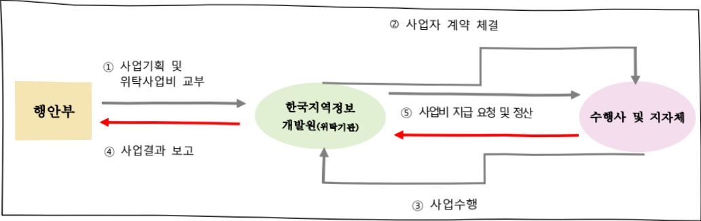

# 재난안전 AI 관제체계 및 데이터 구축(정보화)

**해당 페이지**: PDF 5230 ~ 5236 쪽 해당

**부처**: 행정안전부
**분야**: 공공질서 및 안전
**회계유형**: 일반회계
**2026 확정예산**: 12369.0 백만원
**전년대비 증감률**: 143.7%
**AI 도메인**: 데이터, 보안/사이버, 교육/인재, 법률/치안, 재난/안전

---

## □ 기능별(내역사업별) 예산 내역

(단위:백만원)

<table border=1 style='margin: auto; word-wrap: break-word;'><tr><td rowspan="2"></td><td colspan="5">2024</td><td colspan="5">2025</td><td rowspan="2">2026예산</td></tr><tr><td style='text-align: center; word-wrap: break-word;'>예산액(추정)</td><td style='text-align: center; word-wrap: break-word;'>예산현액</td><td style='text-align: center; word-wrap: break-word;'>집행액</td><td style='text-align: center; word-wrap: break-word;'>이윌액</td><td style='text-align: center; word-wrap: break-word;'>불용액</td><td style='text-align: center; word-wrap: break-word;'>본예산</td><td style='text-align: center; word-wrap: break-word;'>예산현액</td><td style='text-align: center; word-wrap: break-word;'>집행액</td><td style='text-align: center; word-wrap: break-word;'>이윌액</td><td style='text-align: center; word-wrap: break-word;'>불용액</td></tr><tr><td style='text-align: center; word-wrap: break-word;'>○ 기능별 분류(함께)</td><td style='text-align: center; word-wrap: break-word;'>3,251</td><td style='text-align: center; word-wrap: break-word;'>3,251</td><td style='text-align: center; word-wrap: break-word;'>3,251</td><td style='text-align: center; word-wrap: break-word;'>-</td><td style='text-align: center; word-wrap: break-word;'>-</td><td style='text-align: center; word-wrap: break-word;'>5,075</td><td style='text-align: center; word-wrap: break-word;'>5,075</td><td style='text-align: center; word-wrap: break-word;'>5,075</td><td style='text-align: center; word-wrap: break-word;'>-</td><td style='text-align: center; word-wrap: break-word;'>-</td><td style='text-align: center; word-wrap: break-word;'>12,369</td></tr><tr><td style='text-align: center; word-wrap: break-word;'>· 지능형 CCTV 관제 지원시스템 구축 ISP</td><td style='text-align: center; word-wrap: break-word;'>-</td><td style='text-align: center; word-wrap: break-word;'>431</td><td style='text-align: center; word-wrap: break-word;'>431</td><td style='text-align: center; word-wrap: break-word;'>-</td><td style='text-align: center; word-wrap: break-word;'>-</td><td style='text-align: center; word-wrap: break-word;'>-</td><td style='text-align: center; word-wrap: break-word;'>-</td><td style='text-align: center; word-wrap: break-word;'>-</td><td style='text-align: center; word-wrap: break-word;'>-</td><td style='text-align: center; word-wrap: break-word;'>-</td><td style='text-align: center; word-wrap: break-word;'>-</td></tr><tr><td style='text-align: center; word-wrap: break-word;'>· 지능형 표준 영상분석 시험개발 및 시험적용</td><td style='text-align: center; word-wrap: break-word;'>-</td><td style='text-align: center; word-wrap: break-word;'>820</td><td style='text-align: center; word-wrap: break-word;'>820</td><td style='text-align: center; word-wrap: break-word;'>-</td><td style='text-align: center; word-wrap: break-word;'>-</td><td style='text-align: center; word-wrap: break-word;'>-</td><td style='text-align: center; word-wrap: break-word;'>-</td><td style='text-align: center; word-wrap: break-word;'>-</td><td style='text-align: center; word-wrap: break-word;'>-</td><td style='text-align: center; word-wrap: break-word;'>-</td><td style='text-align: center; word-wrap: break-word;'>-</td></tr><tr><td style='text-align: center; word-wrap: break-word;'>· 재난안전 인공지능 영상분석 기술 실증</td><td style='text-align: center; word-wrap: break-word;'>-</td><td style='text-align: center; word-wrap: break-word;'>2,000</td><td style='text-align: center; word-wrap: break-word;'>2,000</td><td style='text-align: center; word-wrap: break-word;'>-</td><td style='text-align: center; word-wrap: break-word;'>-</td><td style='text-align: center; word-wrap: break-word;'>1,760</td><td style='text-align: center; word-wrap: break-word;'>1,760</td><td style='text-align: center; word-wrap: break-word;'>1,760</td><td style='text-align: center; word-wrap: break-word;'>-</td><td style='text-align: center; word-wrap: break-word;'>-</td><td style='text-align: center; word-wrap: break-word;'>1,554</td></tr><tr><td style='text-align: center; word-wrap: break-word;'>· AI 기반 자체 CCTV 관제지원시스템 구축</td><td style='text-align: center; word-wrap: break-word;'>-</td><td style='text-align: center; word-wrap: break-word;'>-</td><td style='text-align: center; word-wrap: break-word;'>-</td><td style='text-align: center; word-wrap: break-word;'>-</td><td style='text-align: center; word-wrap: break-word;'>-</td><td style='text-align: center; word-wrap: break-word;'>3,315</td><td style='text-align: center; word-wrap: break-word;'>3,315</td><td style='text-align: center; word-wrap: break-word;'>3,315</td><td style='text-align: center; word-wrap: break-word;'>-</td><td style='text-align: center; word-wrap: break-word;'>-</td><td style='text-align: center; word-wrap: break-word;'>3,135</td></tr><tr><td style='text-align: center; word-wrap: break-word;'>· 재난안전 AI 데이터 체계적 제공</td><td style='text-align: center; word-wrap: break-word;'>-</td><td style='text-align: center; word-wrap: break-word;'>-</td><td style='text-align: center; word-wrap: break-word;'>-</td><td style='text-align: center; word-wrap: break-word;'>-</td><td style='text-align: center; word-wrap: break-word;'>-</td><td style='text-align: center; word-wrap: break-word;'>-</td><td style='text-align: center; word-wrap: break-word;'>-</td><td style='text-align: center; word-wrap: break-word;'>-</td><td style='text-align: center; word-wrap: break-word;'>-</td><td style='text-align: center; word-wrap: break-word;'>-</td><td style='text-align: center; word-wrap: break-word;'>7,680</td></tr></table>

### 나. 사업설명자료

## 1 ) 사업목적·내용

## <재난안전 AI 관제체계 및 데이터 구축>

- (AI 기반 지자체 CCTV 관제지원시스템 구축) 지자체 CCTV 실영상 기반 인공지능 영상분석 학습데이터 플랫폼 및 지자체 학습용 영상전송 인프라 구축·관리 체계 마련

- (재난안전 인공지능 영상분석 기술 실증) 민간영역에서 개발이 어려운 재난분야 학습 데이터 구축 및 재난식별 알고리즘을 개발·고도화 및 실증

- (재난안전 AI 데이터 체계적 제공) 과학적 재난관리를 위해 흩어진 데이터를 통합하고, 표준화된 데이터 관리체계를 마련하여 대규모의 고품질 AI 학습데이터 구축

## 2 ) 사업개요

## □ 사업근거 및 추진경위

① 법령상 근거 및 조항 적시

- 재난 및 안전관리 기본법 제25조의4(재난관리책임기관의 장의 재난예방조치 등)

- 재난 및 안전관리 기본법 제71조(재난 및 안전관리에 필요한 과학기술의 진흥 등)

- 재난 및 안전관리 기본법 제74조의4(재난안전데이터 수집 등)

- 재난 및 안전관리 기본법 제74조의5(영상정보처리기기 통합관제센터)

- 재난 및 안전관리 기본법 시행령 제83조의3(재난안전데이터통합관리시스템의 운영 등)

- 재난 및 안전관리 기본법 시행령 제83조의6(영상정보처리기기 통합관제센터의 설치·운영)

---

- 재난 및 안전관리 기본법 시행령 제83조의7(통합관제센터 운영위원회의 설치·운영)

- 인공지능 발전과 신뢰 기반 조성 등에 관한 기본법 제15조(인공지능 학습용데이터 관련 시책의 수립 등)

- 인공지능 발전과 신뢰 기반 조성 등에 관한 기본법 제21조(전문인력의 확보)

- 인공지능 발전과 신뢰 기반 조성 등에 관한 기본법 제24조(인공지능 실증기반 조성 등)

- (이태원참사 국정조사 보고서) CCTV 연계망 구축 및 실시간 영상 공유 시정 요구

- (국가안전시스템 개편 종합대책) CCTV 개선 등을 통한 현장 재난상황관리 강화

- (국정과제 73) 재난 피해 최소화를 위한 예방·대응 강화

## ② 추진경위

- (23.5월) 「재난안전법」 개정을 통한 행안부의 재난안전데이터 수집 근거 신설

- (23.9월) 지능형 시스템 표준화 및 최적 운영모델 적용방안에 대한 선행연구R&D 추진(2년간 5억)

- (23.12월) CCTV 영상정보 활용을 위한 '재난안전법' 개정안 21대 국회 제출

- (24.1) 한국지역정보개발원(KLID) 협약 체결('24년 지능형 CCTV 관제체계 구축 사업)

- (24.3) [지자체 CCTV 관제체계 개선 지원단] 정부협업기구 발족

- (24.5) 지자체 CCTV 영상분석 기술실증 공모사업 추진(24.8억)

- (24.7월) 지능형 관제 지원시스템 구축을 위한 ISP 수립(7.19)

- (24.7) CCTV 영상정보 활용을 위한「재난안전법」개정안 22대 재입법

- (24.12월) CCTV 영상정보 활용을 위한「재난안전법」 개정안 국회 본회의 통과 (12.20) 및 국무회의 의결(12.31)

- (25.1) CCTV 영상정보 활용을 위한 「재난안전법」 개정(1.7)

- (25.1월)「인공지능기본법」공포

- (25.2) 과학기술로 재난안전관리의 미래 준비를 위한 정책 설명회

- (25.3)「AI 기반 지자체 CCTV 관제지원시스템 구축」1차 사업 착수

-(25.3월) 개인정보가 포함된 재난안전데이터 수집근거 마련을 위한 '재난안전법 시행령 개정(3.20)

- (25.5) 재난·안전 분야에 AI 기술 활용을 위한 전문가 간담회

- (25.5월) 국가 AI위원회「AI 현장 대화」

- (25.7월) 중앙안전관리위원회 심의·의결 결과, 재난안전예산 사전협의 결과 투자등급 확대 및 핵심사업 선정(지능형 CCTV 관제체계 구축)

-(25.7월) 지자체 CCTV 통합관제센터 설치·운영 세부근거 마련 등을 위한「재난안전법 시행령」개정(7.8.)

- (25.8월) (국정과제-73) '재난 피해 최소화를 위한 예방·대응 강화'에 반영(AI 데이터, AI 기반 CCTV 관제체계 구축)

- (25.9월)「AI 기반 국민안전 강화 방안」수립 및 내부 보고(장관)

---

## □ 주요내용

① 사업규모

- 총사업비(해당되는 경우에만 기재) : 해당없음

- 사업기간 : '24 ~ 계속

- 최근 5년 간 투입된 사업비(예산액기준, 추경편성한 연도에는 추경포함)

<table border=1 style='margin: auto; word-wrap: break-word;'><tr><td style='text-align: center; word-wrap: break-word;'>연도</td><td style='text-align: center; word-wrap: break-word;'>2022</td><td style='text-align: center; word-wrap: break-word;'>2023</td><td style='text-align: center; word-wrap: break-word;'>2024</td><td style='text-align: center; word-wrap: break-word;'>2025</td><td style='text-align: center; word-wrap: break-word;'>2026</td></tr><tr><td style='text-align: center; word-wrap: break-word;'>사업비</td><td style='text-align: center; word-wrap: break-word;'>-</td><td style='text-align: center; word-wrap: break-word;'>-</td><td style='text-align: center; word-wrap: break-word;'>3,251</td><td style='text-align: center; word-wrap: break-word;'>5,075</td><td style='text-align: center; word-wrap: break-word;'>12,369</td></tr></table>

② 사업추진체계

- 사업시행방법 : 직접수행, 민간위탁

- 사업수혜자 : 영상분석 기업, 지자체 등

- 사업시행주체 : 행정안전부(한국지역정보개발원, NIA 등 전문기관 위탁)

- 보조, 융자, 출연, 출자 등의 경우 보조·융자 등 지원 비율 및 법적근거 : 해당없음

## 3 ) 2026년도 예산 산출 근거

① AI 기반 지자체 CCTV 관제지원시스템 구축

:(26반영)3,135백만원

- (요구) 2년차 인공지능 영상 학습데이터 관리 플랫폼 및 지자체 실영상 전송 인프라 구축비 등 요구

- (산출) AI 기반 지자체 CCTV 관제지원시스템 구축 3,135백만원

② 재난안전 인공지능 영상분석 기술 실증

:(26반영)1,554백만원

- (요구) 재난분야 AI 학습데이터 제작 및 이상상황을 탐지하는 AI 알고리즘 개발 비용 등 요구

- (산출) 재난안전 인공지능 영상분석 기술 실증 1,554백만원

③ 재난안전 AI 데이터 체계적 제공

:(26반영)7,680백만원

- (요구) 대량의 고품질 학습데이터 확보를 위해 재난안전 데이터 품질관리 및 문제해결형 지능형 데이터 구축,

멀티모달 데이터 수집·정제·가공을 통한 AI 학습데이터 생성 등 AI 학습용 데이터 확보 비용 요구

- (산출) 재난안전 AI 데이터 체계적 제공 7,680백만원

---

## 4 ) 사업효과

□ 사업영향, 산출물 성과지표 등

① 2022~2026년도 성과계획서 상 성과지표 및 최근 5년간 성과 달성도

<table border=1 style='margin: auto; word-wrap: break-word;'><tr><td style='text-align: center; word-wrap: break-word;'>성과지표</td><td style='text-align: center; word-wrap: break-word;'>구분</td><td style='text-align: center; word-wrap: break-word;'>2022</td><td style='text-align: center; word-wrap: break-word;'>2023</td><td style='text-align: center; word-wrap: break-word;'>2024</td><td style='text-align: center; word-wrap: break-word;'>2025</td><td style='text-align: center; word-wrap: break-word;'>2026</td><td style='text-align: center; word-wrap: break-word;'>2026 목표치산출근거</td><td style='text-align: center; word-wrap: break-word;'>측정산식(또는 측정방법)</td><td style='text-align: center; word-wrap: break-word;'>자료수집방법(또는 자료출처)</td></tr><tr><td rowspan="3">통합관제센터 AI 기반 CCTV 관제 도입률(단위: %)</td><td style='text-align: center; word-wrap: break-word;'>목표</td><td style='text-align: center; word-wrap: break-word;'>-</td><td style='text-align: center; word-wrap: break-word;'>-</td><td style='text-align: center; word-wrap: break-word;'>&#x27;25년 신규</td><td style='text-align: center; word-wrap: break-word;'>92</td><td style='text-align: center; word-wrap: break-word;'>95</td><td rowspan="3">예산 등을 고려하여 &#x27;27년까지 모든 통합관제센터에서 AI 기반 관제 시스템을 도입하도록 목표 설정</td><td rowspan="3">AI CCTV 도입(10% 이상) 통합관제센터 수 ×100 통합관제센터 수 ※ AI CCTV 도입 대상이 100대 이하일 경우 100대 기준</td><td rowspan="3">지자체 CCTV 통합관제센터 운영현황 조사 결과</td></tr><tr><td style='text-align: center; word-wrap: break-word;'>실적</td><td style='text-align: center; word-wrap: break-word;'>-</td><td style='text-align: center; word-wrap: break-word;'>-</td><td style='text-align: center; word-wrap: break-word;'>-</td><td style='text-align: center; word-wrap: break-word;'>89.8</td><td style='text-align: center; word-wrap: break-word;'>-</td></tr><tr><td style='text-align: center; word-wrap: break-word;'>달성도</td><td style='text-align: center; word-wrap: break-word;'>-</td><td style='text-align: center; word-wrap: break-word;'>-</td><td style='text-align: center; word-wrap: break-word;'>-</td><td style='text-align: center; word-wrap: break-word;'>97.6</td><td style='text-align: center; word-wrap: break-word;'>-</td></tr><tr><td rowspan="3">플랫폼 공유 학습데이터 유형 수 (단위: 건)</td><td style='text-align: center; word-wrap: break-word;'>목표</td><td style='text-align: center; word-wrap: break-word;'>-</td><td style='text-align: center; word-wrap: break-word;'>-</td><td style='text-align: center; word-wrap: break-word;'>&#x27;25년 신규</td><td style='text-align: center; word-wrap: break-word;'>3</td><td style='text-align: center; word-wrap: break-word;'>3</td><td rowspan="3">관제센터 연계 및 학습데이터 생성 기반 마련 1차년도 사업임을 고려 3종을 목표로 설정</td><td rowspan="3">AI 기반 학습데이터 플랫폼에 공유되는 학습데이터의 유형 수(3종)</td><td rowspan="3">지자체 CCTV 통합관제센터 학습데이터 플랫폼 구축 사업결과 보고서</td></tr><tr><td style='text-align: center; word-wrap: break-word;'>실적</td><td style='text-align: center; word-wrap: break-word;'>-</td><td style='text-align: center; word-wrap: break-word;'>-</td><td style='text-align: center; word-wrap: break-word;'>-</td><td style='text-align: center; word-wrap: break-word;'>-</td><td style='text-align: center; word-wrap: break-word;'>-</td></tr><tr><td style='text-align: center; word-wrap: break-word;'>달성도</td><td style='text-align: center; word-wrap: break-word;'>-</td><td style='text-align: center; word-wrap: break-word;'>-</td><td style='text-align: center; word-wrap: break-word;'>-</td><td style='text-align: center; word-wrap: break-word;'>-</td><td style='text-align: center; word-wrap: break-word;'>-</td></tr></table>

② 성과지표 이외의 연도별 사업추진 경과 및 실적

<table border=1 style='margin: auto; word-wrap: break-word;'><tr><td style='text-align: center; word-wrap: break-word;'>2022</td><td style='text-align: center; word-wrap: break-word;'>해당 없음</td></tr><tr><td style='text-align: center; word-wrap: break-word;'>2023</td><td style='text-align: center; word-wrap: break-word;'>해당 없음</td></tr><tr><td style='text-align: center; word-wrap: break-word;'>2024</td><td style='text-align: center; word-wrap: break-word;'>- (&#x27;24.7월) 지능형 관제 지원시스템 구축을 위한 ISP 수립(7.19) - (&#x27;24.7월) [&#x27;AI 기반 지자체 CCTV 관제 고도화 지원방안&#x27;, 범정부 AI 대표 과제 채택 (DPG 제6차회의 보고, 7.16) - (&#x27;24.12월) CCTV 영상정보 활용을 위한 [&#x27;재난안전법&#x27;] 개정안 국회 본회의 통과(12.20) 및 국무회의 의결(12.31)</td></tr><tr><td style='text-align: center; word-wrap: break-word;'>2025</td><td style='text-align: center; word-wrap: break-word;'>- (&#x27;25.1월) CCTV 영상정보 활용을 위한 [&#x27;재난안전법&#x27;] 개정(1.7) - (&#x27;25.3월) 개인정보가 포함된 재난안전데이터 수집근거 마련을 위한 [&#x27;재난안전법 시행령&#x27;, 개정(3.20) - (&#x27;25.2월) 과학기술로 재난안전관리의 미래 준비를 위한 정책 설명회 - (&#x27;25.5월) 재난·안전 분야에 AI 기술 활용을 위한 전문가 간담회0 - (&#x27;25.5월) 국가 AI위원회 [&#x27;AI 현장 대화&#x27;] - (&#x27;25.7월) 중앙안전관리위원회 심의·의결 결과, 재난안전예산 사전협의 결과 투자 등급 확대 및 핵심사업 선정(지능형 CCTV 관제체계 구축) - (&#x27;25.7월) 지자체 CCTV 통합관제센터 설치·운영 세부근거 마련 등을 위한 [&#x27;재난안전법 시행령&#x27;] 개정(7.8.) - (&#x27;25.8월) (국정과제-73) &#x27;재난 피해 최소화를 위한 예방·대응 강화&#x27;에 반영(AI 데이터, AI 기반 CCTV 관제체계 구축)</td></tr></table>

---

③ 향후(2026년도 이후) 기대효과

- 지자체 CCTV 통합관제센터에 AI 기술을 접목하여 관련 정책개발 등을 통해 재난 예방·대응력 제고 및 AI·영상산업 발전에 이바지

- 흩어진 재난안전 데이터를 통합하고 표준화된 관리체계를 확립함으로써 AI·데이터 기반 과학적 재난관리체계 구축

## 5 ) 타당성조사 및 예비타당성조사 시행여부 및 결과 요지: 해당없음

6) 총사업비 대상사업 여부 및 내역: 해당없음

## 7 ) 사업 집행절차

## 8 ) 각종 평가

1) 국회(예결위, 상임위, 예정처, 국정감사 포함) 지적

① 예결위 분석보고서('23.10월)

- (지적) 지능형 관제체계의 표준화를 위한 선행연구 기간이 '25년까지임을 고려하여 연구 결과물과 본 사업간 연계가 잘되도록 사업관리 철저

- (조치) 선행연구는 실질적으로 '24년 상반기에 완료되고 이를 토대로 '24년 6월부터 지자체 시범적용을 수행하여, 사업간 연계가 되도록 추진

②[2024 회계연도 결산] 예결위 검토보고서('25.8월)

- (지적) 지능형 CCTV 관제체계 구축 관련 시범사업 결과물을 ISP 수립 시에도 활용하여 시업계획 타당성 제고, 학습데이터를 제작배포하여 각 지자체의 지능형 관제 고도화 지원 관련, 활성화 방안 미련 필요

- (조치) 시범사업 결과물이 ISP 수립에 활용될 수 있도록 유의, 지능형 관제 고도화 지원 관련 활성화 방안으로써 SW 개발 환경 제공, 기술개발 실증사업, 재난특교세 등을 통해 활용도 제고하겠음

③ 예결위 검토보고서('25.11월)

---

<table border=1 style='margin: auto; word-wrap: break-word;'><tr><td style='text-align: center; word-wrap: break-word;'>- (지적) 사업 대상이 과도한 측면이 있어, 데이터 활용 실적 확인 및 활용이 활성화된 데이터들부터 선정하여 단계적 추진 필요- (조치) 한국지능정보사회진흥원, 국가인공지능전략위원회 등 관계기관과의 협업, 재난안전 AX 자문단 구성·운영 등 내실 있게 사업을 추진하겠음2) 그 외 보조사업 연장평가, 재정지원 일자리사업 평가 등 개별 법률에 규정된 평가 시행 결과① 재난안전사업평가(&#x27;25.1월)- (평가) 우수(97.9점)- (의견) 지능형 CCTV 관제체계 구축 사업은 선제적 관제 기능, 사고 시 신속 대응력 등을 강화하는 측면에서 사업 중요도가 매우 높고 재난안전관리 예방시스템 역량 강화에 기여가 높은 것으로 평가② &#x27;26년 재난안전예산 사전협의(&#x27;25.8월)- (평가) 투자등급 확대 및 핵심사업 선정(중앙안전관리위원회 심의·의결)- (의견) 과도한 CCTV 관제업무 해소를 위해 AI 기반 CCTV로 관제업무의 효율성을 높이고, 신속한 재난대응체계 마련을 위한 지속적인 예산 확대 필요</td></tr></table>

② '26년 재난안전예산 사전협의('25.8월)

- (평가) 투자등급 확대 및 핵심사업 선정(중앙안전관리위원회 심의·의결)

### 다. 최근 4년간 결산내역

1) 결산표

☐ 부처 결산내역

(단위: 백만원, %)

<table border=1 style='margin: auto; word-wrap: break-word;'><tr><td rowspan="2">연도</td><td colspan="3">예산액</td><td rowspan="2">예산 현액(A)</td><td rowspan="2">집행액(B)</td><td rowspan="2">집행률(B/A)</td><td rowspan="2">다음연도 이월액</td><td rowspan="2">불용액</td></tr><tr><td style='text-align: center; word-wrap: break-word;'>본예산</td><td style='text-align: center; word-wrap: break-word;'>추경 중감액</td><td style='text-align: center; word-wrap: break-word;'>추경</td></tr><tr><td style='text-align: center; word-wrap: break-word;'>2022</td><td style='text-align: center; word-wrap: break-word;'>-</td><td style='text-align: center; word-wrap: break-word;'>-</td><td style='text-align: center; word-wrap: break-word;'>-</td><td style='text-align: center; word-wrap: break-word;'>-</td><td style='text-align: center; word-wrap: break-word;'>-</td><td style='text-align: center; word-wrap: break-word;'>-</td><td style='text-align: center; word-wrap: break-word;'>-</td><td style='text-align: center; word-wrap: break-word;'>-</td></tr><tr><td style='text-align: center; word-wrap: break-word;'>2023</td><td style='text-align: center; word-wrap: break-word;'>-</td><td style='text-align: center; word-wrap: break-word;'>-</td><td style='text-align: center; word-wrap: break-word;'>-</td><td style='text-align: center; word-wrap: break-word;'>-</td><td style='text-align: center; word-wrap: break-word;'>-</td><td style='text-align: center; word-wrap: break-word;'>-</td><td style='text-align: center; word-wrap: break-word;'>-</td><td style='text-align: center; word-wrap: break-word;'>-</td></tr><tr><td style='text-align: center; word-wrap: break-word;'>2024</td><td style='text-align: center; word-wrap: break-word;'>3,251</td><td style='text-align: center; word-wrap: break-word;'>-</td><td style='text-align: center; word-wrap: break-word;'>-</td><td style='text-align: center; word-wrap: break-word;'>3,251</td><td style='text-align: center; word-wrap: break-word;'>3,251</td><td style='text-align: center; word-wrap: break-word;'>100</td><td style='text-align: center; word-wrap: break-word;'>-</td><td style='text-align: center; word-wrap: break-word;'>-</td></tr><tr><td style='text-align: center; word-wrap: break-word;'>2025</td><td style='text-align: center; word-wrap: break-word;'>5,075</td><td style='text-align: center; word-wrap: break-word;'>-</td><td style='text-align: center; word-wrap: break-word;'>-</td><td style='text-align: center; word-wrap: break-word;'>5,075</td><td style='text-align: center; word-wrap: break-word;'>5,075</td><td style='text-align: center; word-wrap: break-word;'>100</td><td style='text-align: center; word-wrap: break-word;'>-</td><td style='text-align: center; word-wrap: break-word;'>-</td></tr></table>

□출연·보조사업 등 실집행내역: 해당 없음

2) 주요 결산사항: 해당 없음

---

<table border=1 style='margin: auto; word-wrap: break-word;'><tr><td style='text-align: center; word-wrap: break-word;'>사 업 명</td></tr><tr><td style='text-align: center; word-wrap: break-word;'>(19) 재난안전 부처협력 기술개발(R&amp;D)(2931-627)</td></tr></table>

□ 사업 코드 정보

<table border=1 style='margin: auto; word-wrap: break-word;'><tr><td style='text-align: center; word-wrap: break-word;'>구분</td><td style='text-align: center; word-wrap: break-word;'>회계</td><td style='text-align: center; word-wrap: break-word;'>소관</td><td style='text-align: center; word-wrap: break-word;'>실국(기관)</td><td style='text-align: center; word-wrap: break-word;'>계정</td><td style='text-align: center; word-wrap: break-word;'>분야</td><td style='text-align: center; word-wrap: break-word;'>부문</td></tr><tr><td style='text-align: center; word-wrap: break-word;'>코드</td><td rowspan="2">일반회계</td><td rowspan="2">행정안전부</td><td rowspan="2">안전예방정책실안전정책국</td><td rowspan="2">-</td><td style='text-align: center; word-wrap: break-word;'>020</td><td style='text-align: center; word-wrap: break-word;'>025</td></tr><tr><td style='text-align: center; word-wrap: break-word;'>명칭</td><td style='text-align: center; word-wrap: break-word;'>공공질서및안전</td><td style='text-align: center; word-wrap: break-word;'>재난관리</td></tr></table>

<table border=1 style='margin: auto; word-wrap: break-word;'><tr><td style='text-align: center; word-wrap: break-word;'>구분</td><td style='text-align: center; word-wrap: break-word;'>프로그램</td><td style='text-align: center; word-wrap: break-word;'>단위사업</td><td style='text-align: center; word-wrap: break-word;'>세부사업</td></tr><tr><td style='text-align: center; word-wrap: break-word;'>코드</td><td style='text-align: center; word-wrap: break-word;'>2900</td><td style='text-align: center; word-wrap: break-word;'>2931</td><td style='text-align: center; word-wrap: break-word;'>627</td></tr><tr><td style='text-align: center; word-wrap: break-word;'>명칭</td><td style='text-align: center; word-wrap: break-word;'>재난안전기술개발</td><td style='text-align: center; word-wrap: break-word;'>재난안전기술개발</td><td style='text-align: center; word-wrap: break-word;'>재난안전기술개발(R&amp;D)</td></tr></table>

사업 성격 (공통요구자료 Ⅱ-1 작성유의사항 5. 참조, 해당하는 사항에 “0” 표시)

<table border=1 style='margin: auto; word-wrap: break-word;'><tr><td rowspan="2">신규</td><td rowspan="2">계속</td><td rowspan="2">완료</td><td rowspan="2">예비타당성 실시여부</td><td rowspan="2">총사업비 관리대상</td><td rowspan="2">총액계상 예산사업</td><td style='text-align: center; word-wrap: break-word;'>사업소관 변경정보</td></tr><tr><td style='text-align: center; word-wrap: break-word;'>2025예산 시 소관</td></tr><tr><td style='text-align: center; word-wrap: break-word;'></td><td style='text-align: center; word-wrap: break-word;'>☐</td><td style='text-align: center; word-wrap: break-word;'></td><td style='text-align: center; word-wrap: break-word;'></td><td style='text-align: center; word-wrap: break-word;'></td><td style='text-align: center; word-wrap: break-word;'></td><td style='text-align: center; word-wrap: break-word;'></td></tr></table>

□ 사업 지원 형태 및 지원을 (최소한 한 개는 반드시 선택하시오. 해당사항에 0 표시)

<table border=1 style='margin: auto; word-wrap: break-word;'><tr><td style='text-align: center; word-wrap: break-word;'>직접</td><td style='text-align: center; word-wrap: break-word;'>출자</td><td style='text-align: center; word-wrap: break-word;'>출연</td><td style='text-align: center; word-wrap: break-word;'>보조</td><td style='text-align: center; word-wrap: break-word;'>융자</td><td style='text-align: center; word-wrap: break-word;'>국고보조율(%)</td><td style='text-align: center; word-wrap: break-word;'>융자율(%)</td></tr><tr><td style='text-align: center; word-wrap: break-word;'></td><td style='text-align: center; word-wrap: break-word;'></td><td style='text-align: center; word-wrap: break-word;'>○</td><td style='text-align: center; word-wrap: break-word;'></td><td style='text-align: center; word-wrap: break-word;'></td><td style='text-align: center; word-wrap: break-word;'></td><td style='text-align: center; word-wrap: break-word;'></td></tr></table>

## □ 사업 담당자

<table border=1 style='margin: auto; word-wrap: break-word;'><tr><td style='text-align: center; word-wrap: break-word;'>사업명</td><td colspan="2">구분</td></tr><tr><td rowspan="6">재난안전부처협력기술개발(R&amp;D)</td><td rowspan="2">소관부처</td><td style='text-align: center; word-wrap: break-word;'>안전예방정책실 안전정책국</td></tr><tr><td style='text-align: center; word-wrap: break-word;'>재난안전연구개발과</td></tr><tr><td rowspan="4">사업시행주체</td><td style='text-align: center; word-wrap: break-word;'>한국산업기술기획평가원</td></tr><tr><td style='text-align: center; word-wrap: break-word;'>한국연구재단</td></tr><tr><td style='text-align: center; word-wrap: break-word;'>한국보건산업진흥원</td></tr><tr><td style='text-align: center; word-wrap: break-word;'>정보통신기획평가원</td></tr></table>

---

### 원본 PDF 크롭 이미지

