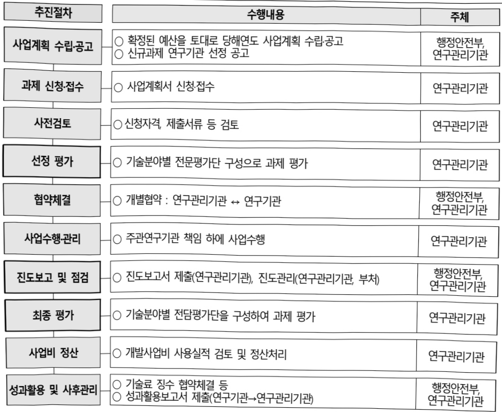

# 재난안전부처협력기술개발(R&D)

**해당 페이지**: PDF 5237 ~ 5247 쪽 해당

**부처**: 행정안전부
**분야**: 공공질서 및 안전
**회계유형**: 일반회계
**2026 확정예산**: 18925.0 백만원
**전년대비 증감률**: 59.5%
**AI 도메인**: 의료/바이오, 로봇, 문화/콘텐츠, 건설/스마트시티, 재난/안전

---

### 가. 예산 총괄표

(단위: 백만원, %)

<table border=1 style='margin: auto; word-wrap: break-word;'><tr><td rowspan="2">사업명</td><td rowspan="2">2024년 결산</td><td colspan="2">2025년 예산</td><td colspan="2">2026년 예산</td><td rowspan="2">증감(B-A)</td><td rowspan="2">(B-A)/A</td></tr><tr><td style='text-align: center; word-wrap: break-word;'>본예산</td><td style='text-align: center; word-wrap: break-word;'>추경(A)</td><td style='text-align: center; word-wrap: break-word;'>요구안</td><td style='text-align: center; word-wrap: break-word;'>본예산(B)</td></tr><tr><td style='text-align: center; word-wrap: break-word;'>재난안전부처협력 기술개발(R&amp;D)</td><td style='text-align: center; word-wrap: break-word;'>11,060</td><td style='text-align: center; word-wrap: break-word;'>11,867</td><td style='text-align: center; word-wrap: break-word;'>11,867</td><td style='text-align: center; word-wrap: break-word;'>18,925</td><td style='text-align: center; word-wrap: break-word;'>18,925</td><td style='text-align: center; word-wrap: break-word;'>7,058</td><td style='text-align: center; word-wrap: break-word;'>59.5</td></tr></table>

□ 기능별(내역사업별) 예산 내역

(단위:백만원)

<table border=1 style='margin: auto; word-wrap: break-word;'><tr><td rowspan="2"></td><td colspan="5">2024</td><td colspan="5">2025</td><td rowspan="2">2026예산</td></tr><tr><td style='text-align: center; word-wrap: break-word;'>예산액(추정)</td><td style='text-align: center; word-wrap: break-word;'>예산현액</td><td style='text-align: center; word-wrap: break-word;'>집행액</td><td style='text-align: center; word-wrap: break-word;'>이윌액</td><td style='text-align: center; word-wrap: break-word;'>불용액</td><td style='text-align: center; word-wrap: break-word;'>본예산(추정)</td><td style='text-align: center; word-wrap: break-word;'>예산현액</td><td style='text-align: center; word-wrap: break-word;'>집행액</td><td style='text-align: center; word-wrap: break-word;'>이윌액</td><td style='text-align: center; word-wrap: break-word;'>불용액</td></tr><tr><td style='text-align: center; word-wrap: break-word;'>○ 기능별 분류(합계)</td><td style='text-align: center; word-wrap: break-word;'>11,060</td><td style='text-align: center; word-wrap: break-word;'>11,060</td><td style='text-align: center; word-wrap: break-word;'>11,060</td><td style='text-align: center; word-wrap: break-word;'>-</td><td style='text-align: center; word-wrap: break-word;'>-</td><td style='text-align: center; word-wrap: break-word;'>11,867</td><td style='text-align: center; word-wrap: break-word;'>11,867</td><td style='text-align: center; word-wrap: break-word;'>11,867</td><td style='text-align: center; word-wrap: break-word;'>-</td><td style='text-align: center; word-wrap: break-word;'>-</td><td style='text-align: center; word-wrap: break-word;'>18,925</td></tr><tr><td style='text-align: center; word-wrap: break-word;'>· 디지털트윈 기반 지하공동구 화재·재난지원 통합플랫폼 기술개발</td><td style='text-align: center; word-wrap: break-word;'>500</td><td style='text-align: center; word-wrap: break-word;'>500</td><td style='text-align: center; word-wrap: break-word;'>500</td><td style='text-align: center; word-wrap: break-word;'>-</td><td style='text-align: center; word-wrap: break-word;'>-</td><td style='text-align: center; word-wrap: break-word;'>-</td><td style='text-align: center; word-wrap: break-word;'>-</td><td style='text-align: center; word-wrap: break-word;'>-</td><td style='text-align: center; word-wrap: break-word;'>-</td><td style='text-align: center; word-wrap: break-word;'>-</td><td style='text-align: center; word-wrap: break-word;'>-</td></tr><tr><td style='text-align: center; word-wrap: break-word;'>· 국민생활안전 긴급대응연구</td><td style='text-align: center; word-wrap: break-word;'>180</td><td style='text-align: center; word-wrap: break-word;'>180</td><td style='text-align: center; word-wrap: break-word;'>180</td><td style='text-align: center; word-wrap: break-word;'>-</td><td style='text-align: center; word-wrap: break-word;'>-</td><td style='text-align: center; word-wrap: break-word;'>-</td><td style='text-align: center; word-wrap: break-word;'>-</td><td style='text-align: center; word-wrap: break-word;'>-</td><td style='text-align: center; word-wrap: break-word;'>-</td><td style='text-align: center; word-wrap: break-word;'>-</td><td style='text-align: center; word-wrap: break-word;'>-</td></tr><tr><td style='text-align: center; word-wrap: break-word;'>· 신종감염방대응체계 고도화기술개발</td><td style='text-align: center; word-wrap: break-word;'>240</td><td style='text-align: center; word-wrap: break-word;'>240</td><td style='text-align: center; word-wrap: break-word;'>240</td><td style='text-align: center; word-wrap: break-word;'>-</td><td style='text-align: center; word-wrap: break-word;'>-</td><td style='text-align: center; word-wrap: break-word;'>-</td><td style='text-align: center; word-wrap: break-word;'>-</td><td style='text-align: center; word-wrap: break-word;'>-</td><td style='text-align: center; word-wrap: break-word;'>-</td><td style='text-align: center; word-wrap: break-word;'>-</td><td style='text-align: center; word-wrap: break-word;'>-</td></tr><tr><td style='text-align: center; word-wrap: break-word;'>· 신종감염병 기획평가 관리비</td><td style='text-align: center; word-wrap: break-word;'>10</td><td style='text-align: center; word-wrap: break-word;'>10</td><td style='text-align: center; word-wrap: break-word;'>10</td><td style='text-align: center; word-wrap: break-word;'>-</td><td style='text-align: center; word-wrap: break-word;'>-</td><td style='text-align: center; word-wrap: break-word;'>-</td><td style='text-align: center; word-wrap: break-word;'>-</td><td style='text-align: center; word-wrap: break-word;'>-</td><td style='text-align: center; word-wrap: break-word;'>-</td><td style='text-align: center; word-wrap: break-word;'>-</td><td style='text-align: center; word-wrap: break-word;'>-</td></tr><tr><td style='text-align: center; word-wrap: break-word;'>· 부처협력 사업지원</td><td style='text-align: center; word-wrap: break-word;'>6,500</td><td style='text-align: center; word-wrap: break-word;'>6,500</td><td style='text-align: center; word-wrap: break-word;'>6,500</td><td style='text-align: center; word-wrap: break-word;'>-</td><td style='text-align: center; word-wrap: break-word;'>-</td><td style='text-align: center; word-wrap: break-word;'>5,820</td><td style='text-align: center; word-wrap: break-word;'>5,820</td><td style='text-align: center; word-wrap: break-word;'>5,820</td><td style='text-align: center; word-wrap: break-word;'>-</td><td style='text-align: center; word-wrap: break-word;'>-</td><td style='text-align: center; word-wrap: break-word;'>8,000</td></tr><tr><td style='text-align: center; word-wrap: break-word;'>· 소방현장 탐색·진압 활동지원 센서 및 로봇기술개발</td><td style='text-align: center; word-wrap: break-word;'>910</td><td style='text-align: center; word-wrap: break-word;'>910</td><td style='text-align: center; word-wrap: break-word;'>910</td><td style='text-align: center; word-wrap: break-word;'>-</td><td style='text-align: center; word-wrap: break-word;'>-</td><td style='text-align: center; word-wrap: break-word;'>1,120</td><td style='text-align: center; word-wrap: break-word;'>1,120</td><td style='text-align: center; word-wrap: break-word;'>1,120</td><td style='text-align: center; word-wrap: break-word;'>-</td><td style='text-align: center; word-wrap: break-word;'>-</td><td style='text-align: center; word-wrap: break-word;'>1,300</td></tr><tr><td style='text-align: center; word-wrap: break-word;'>· 난접근성특수화재 신불 진화를 위한 고능성 소화한 및 무인 능동전압기술개발</td><td style='text-align: center; word-wrap: break-word;'>1,000</td><td style='text-align: center; word-wrap: break-word;'>1,000</td><td style='text-align: center; word-wrap: break-word;'>1,000</td><td style='text-align: center; word-wrap: break-word;'>-</td><td style='text-align: center; word-wrap: break-word;'>-</td><td style='text-align: center; word-wrap: break-word;'>1,200</td><td style='text-align: center; word-wrap: break-word;'>1,200</td><td style='text-align: center; word-wrap: break-word;'>1,200</td><td style='text-align: center; word-wrap: break-word;'>-</td><td style='text-align: center; word-wrap: break-word;'>-</td><td style='text-align: center; word-wrap: break-word;'>1,850</td></tr><tr><td style='text-align: center; word-wrap: break-word;'>· 가상융합기술 기반 재난대응 교육훈련 플랫폼 개발</td><td style='text-align: center; word-wrap: break-word;'>1,000</td><td style='text-align: center; word-wrap: break-word;'>1,000</td><td style='text-align: center; word-wrap: break-word;'>1,000</td><td style='text-align: center; word-wrap: break-word;'>-</td><td style='text-align: center; word-wrap: break-word;'>-</td><td style='text-align: center; word-wrap: break-word;'>860</td><td style='text-align: center; word-wrap: break-word;'>860</td><td style='text-align: center; word-wrap: break-word;'>860</td><td style='text-align: center; word-wrap: break-word;'>-</td><td style='text-align: center; word-wrap: break-word;'>-</td><td style='text-align: center; word-wrap: break-word;'>1,000</td></tr><tr><td style='text-align: center; word-wrap: break-word;'>· 국민생활안전 긴급 대응연구(2단계)</td><td style='text-align: center; word-wrap: break-word;'>-</td><td style='text-align: center; word-wrap: break-word;'>-</td><td style='text-align: center; word-wrap: break-word;'>-</td><td style='text-align: center; word-wrap: break-word;'>-</td><td style='text-align: center; word-wrap: break-word;'>-</td><td style='text-align: center; word-wrap: break-word;'>2,225</td><td style='text-align: center; word-wrap: break-word;'>2,225</td><td style='text-align: center; word-wrap: break-word;'>2,225</td><td style='text-align: center; word-wrap: break-word;'>-</td><td style='text-align: center; word-wrap: break-word;'>-</td><td style='text-align: center; word-wrap: break-word;'>4,375</td></tr><tr><td style='text-align: center; word-wrap: break-word;'>· 범부처감염방방역 체계 고도화R&amp;D사업</td><td style='text-align: center; word-wrap: break-word;'>720</td><td style='text-align: center; word-wrap: break-word;'>720</td><td style='text-align: center; word-wrap: break-word;'>720</td><td style='text-align: center; word-wrap: break-word;'>-</td><td style='text-align: center; word-wrap: break-word;'>-</td><td style='text-align: center; word-wrap: break-word;'>642</td><td style='text-align: center; word-wrap: break-word;'>642</td><td style='text-align: center; word-wrap: break-word;'>642</td><td style='text-align: center; word-wrap: break-word;'>-</td><td style='text-align: center; word-wrap: break-word;'>-</td><td style='text-align: center; word-wrap: break-word;'>900</td></tr><tr><td style='text-align: center; word-wrap: break-word;'>· 초고층 복합시설 복합재난 디지털플랫폼 기술개발</td><td style='text-align: center; word-wrap: break-word;'>-</td><td style='text-align: center; word-wrap: break-word;'>-</td><td style='text-align: center; word-wrap: break-word;'>-</td><td style='text-align: center; word-wrap: break-word;'>-</td><td style='text-align: center; word-wrap: break-word;'>-</td><td style='text-align: center; word-wrap: break-word;'>-</td><td style='text-align: center; word-wrap: break-word;'>-</td><td style='text-align: center; word-wrap: break-word;'>-</td><td style='text-align: center; word-wrap: break-word;'>-</td><td style='text-align: center; word-wrap: break-word;'>-</td><td style='text-align: center; word-wrap: break-word;'>1,500</td></tr></table>

---

### 나. 사업설명자료

## 1 ) 사업목적·내용

과학기술의 발전, 재난환경의 복잡·다양화 등 여건변화에 대응하여 개별 부처별 R&D 수행으로 인한 한계를 극복하기 위해 부처 간 협업에 기반한 재난안전 R&D 강화

- (부처협력 사업지원) 행정안전부는 재난안전 R&D 총괄부처로서, 기존 개발기술의 종합·융합 및 실증하는 역할 수행 필요, 재난안전 분야는 정부 중심의 공공서비스이므로 사업화 연계가 미약할 수 있으나 긴급 현안사항에 대응할 수 있는 실용화 기술 개발 필요

- (소방현장 탐색·진압 활동지원 센서 및 로봇기술개발) 육상 대형시설물/사업장의 소방관 화재 진압활동 및 인명탐색 작업을 지원하는 센서 및 로봇 시스템 개발 등 소방관 안전사고 예방 및 복합화재 진압 능력 향상을 위한 기술개발 지원

- (난접근성 특수화재·산불 진화를 위한 고기능성 소화탄 및 무인 능동진압 기술개발) 고층 건물,

혹은 원격지 대형화재를 효율적으로 진압할 수 있는 가스하이드레이트 소화탄과 능동진압

플랫폼 기술개발 지원

- (가상융합기술 기반 재난대응 교육훈련 플랫폼 개발) 재난상황 체험 및 대응을 위한 모듈형

실감 콘텐츠 개발 등 메타버스 기반 초실감형 해양경찰·재난안전 교육훈련시스템 구축을 통하여

현장 즉시 대응력 강화할 수 있는 기술개발 지원

- (국민생활안전 긴급대응연구(2단계)) 국민생활안전 긴급대응연구(R&D)의 긴급대응 체계를 고도화하고, 성과확산 기능을 강화하여 국민의 불안해소에 기여하며 현장성과를 창출하는 국민생활안전 긴급대응연구 후속사업

- (범부처 감염병 방역체계 고도화 R&D사업) 신변종 감염병 대유행 대비 관점에서 방역 전주기 단계별 방역현장의 수요를 기반으로 ①빠른 감시, ②지능적 예측·차단, ③신속 진단, ④효능이 입증된 방역물품 개발·검증 기반 고도화를 위하여 범부처 협력 R&D 추진

- (초고층 복합시설 복합재난관리 디지털플랫폼 기술개발) 동 사업 내용은 지상·지하공간이 상호 연계된 도심지 복합공간에서의 복합재난 발생을 억제하고 피해를 줄이기 위해 초고층 복합시설 복합재난 회복력 강화를 위한 예측·예방 중심의 초고층 복합시설 복합재난관리 디지털플랫폼 개발을 지원하는 것임

---

## 2 ) 사업개요

## □ 사업근거 및 추진경위

① 법령상 근거 및 조항 적시

-「과학기술기본법」제11조(국가연구개발사업의 추진)

- 과학기술기본법 제17조(협동·융합연구개발의 촉진)

-「재난 및 안전관리기본법」제71조(재난 및 안전관리에 필요한 과학기술 진흥)

-「보건의료기술진흥법」제3조(기술개발의 보호·육성) 및 제5조(연구개발사업의 추진)

-국가통합교통체계효율화법제98조(교통기술연구·개발사업의추진)

- '산업기술혁신촉진법' 제11조(산업기술개발사업)

-다부처 공동기획사업 운영지침

## ② 추진경위

- ‘중앙-지방 재난안전 연구개발 협의체’를 통한 부처협력사업 협의·조정 : 5G 기반 긴급 재난문자 서비스 고도화('19.4), 방사능재난 주민보호시스템 개발('20.1), 웨어러블 기반 해상화재·화학사고 대응기술개발('21.4.)

- '국민생활연구 추진전략'(18.3.14, 국가과학기술심의회) : 긴급대응연구 지원체계 도입, 국민생활안전 긴급대응연구 1단계 사업 추진('19~'24년)

- ‘다부처공동기획사업 추진위원회’ 대상 사업 선정 : 디지털트런 기반 지하공동구 화재·재난지원 통합플랫폼 기술개발('19.1.), 범부처 감염병 방역체계 고도화 R&D사업('22.3.), 난접근성 특수화재 진화를 위한 고기능성 소화탄 및 무인 능동진압 기술개발('22.4.)

- 메타버스 기반 현장대응력 강화 위한 해양경찰 교육훈련플랫폼 개발기획연구('21.11.), 해경청, 행안부 부처협력 사업 추진 실무협의('22.3.14., 3.22.)

- 국민생활안전긴급대응연구(2단계) 기획연구('23.4.), 과기부 주관 행안부 부처협력사업 추진 실무협의('23.4.~')

## □ 주요내용

① 사업규모

- 총사업비(해당되는 경우에만 기재) : 해당없음

- 사업기간 : '20~계속

- 최근 5년 간 투입된 사업비(예산액기준, 추경편성한 연도에는 추경포함)

---

<table border=1 style='margin: auto; word-wrap: break-word;'><tr><td style='text-align: center; word-wrap: break-word;'>연도</td><td style='text-align: center; word-wrap: break-word;'>2022</td><td style='text-align: center; word-wrap: break-word;'>2023</td><td style='text-align: center; word-wrap: break-word;'>2024</td><td style='text-align: center; word-wrap: break-word;'>2025</td><td style='text-align: center; word-wrap: break-word;'>2026</td></tr><tr><td style='text-align: center; word-wrap: break-word;'>사업비</td><td style='text-align: center; word-wrap: break-word;'>19,073</td><td style='text-align: center; word-wrap: break-word;'>19,250</td><td style='text-align: center; word-wrap: break-word;'>11,060</td><td style='text-align: center; word-wrap: break-word;'>11,867</td><td style='text-align: center; word-wrap: break-word;'>18,925</td></tr></table>

- 기타: 해당없음

## ② 사업추진체계

- 사업시행방법 : 출연

- 사업시행주체 : 한국산업기술기획평가원, 한국연구재단, (재)범부처방역연계감염병 연구개발재단,

정보통신기획평가원

- 사업 수혜자 : 국민, 재난 대응 유관기관 등

- 보조, 융자, 출연, 출자 등의 경우 보조·융자 등 지원 비율 및 법적근거

<table border=1 style='margin: auto; word-wrap: break-word;'><tr><td style='text-align: center; word-wrap: break-word;'>내역사업명</td><td style='text-align: center; word-wrap: break-word;'>구분</td><td style='text-align: center; word-wrap: break-word;'>피보조·피출연 등 기관명</td><td style='text-align: center; word-wrap: break-word;'>지원 금액 (2026예산)</td><td style='text-align: center; word-wrap: break-word;'>지원 비율 (%)</td><td style='text-align: center; word-wrap: break-word;'>보조율 법적근거 (해당 조항)</td></tr><tr><td rowspan="4">재난안전부처협력기술개발</td><td rowspan="4">출연</td><td style='text-align: center; word-wrap: break-word;'>대학, 출연연 등 비영리기관</td><td rowspan="4">18,925백만원</td><td style='text-align: center; word-wrap: break-word;'>100</td><td style='text-align: center; word-wrap: break-word;'>국가연구개발혁신법 제13조 제1항 및 동법 시행령 제19조 제1항</td></tr><tr><td style='text-align: center; word-wrap: break-word;'>대기업, 공기업</td><td style='text-align: center; word-wrap: break-word;'>50</td><td style='text-align: center; word-wrap: break-word;'>국가연구개발혁신법 제13조 제1항 및 동법 시행령 제19조 제1항 제3호, 제4호</td></tr><tr><td style='text-align: center; word-wrap: break-word;'>중견기업</td><td style='text-align: center; word-wrap: break-word;'>60</td><td style='text-align: center; word-wrap: break-word;'>국가연구개발혁신법 제13조 제1항 및 동법 시행령 제19조 제1항 제2호</td></tr><tr><td style='text-align: center; word-wrap: break-word;'>중소기업</td><td style='text-align: center; word-wrap: break-word;'>75</td><td style='text-align: center; word-wrap: break-word;'>국가연구개발혁신법 제13조 제1항 및 동법 시행령 제19조 제1항 제1호</td></tr></table>

## 3 ) 2026년도 예산 산출 근거

① 부처협력 사업지원 : ('26 예산) 8,000백만원
- (산출) 계속과제 7개 × 1,143백만원 × 12/12개월 = 8,000백만원
② 소방현장 탐색 진압활동 지원센서 및 로봇기술 개발 : ('26 예산) 1,300백만원
- (산출) 계속과제 1개 × 1,300백만원 × 12/12개월 = 1,300백만원
③ 난접근성 특수화재·산불진화를 위한 고기능성 소화탄 및 무인 능동진압기술 개발 : ('26 예산) 1,850백만원
- (산출) 계속과제 1개 × 1,850백만원 × 12/12개월 = 1,850백만원
④ 가상융합기술기반 재난대응 교육훈련 플랫폼 개발 : ('26 예산) 1,000백만원
- (산출) 계속과제 1개 × 1,000백만원 × 12/12개월 = 1,000백만원
⑤ 국민생활안전 긴급대응연구(2단계) : ('26 예산) 4,375백만원
- (산출) 신규과제 10개 과제 × 225백만원 × 6/12개월 = 1,125백만원
  계속과제 10개 과제 × 225백만원 × 12/12개월 = 2,250백만원
  종합지원허브 1개 과제 × 1,000백만원 × 12/12개월 = 1,000백만원
⑥ 범부처 감염병 방역체계 고도화(R&D) : ('26 예산) 900백만원
- (산출) 계속과제 12개 × 833.3백만 × 0.09(부처투자비율) × 12/12개월
⑦ 초고증 복합시설 복합재난관리 디지털플랫폼 기술개발 : ('26 예산) 1,500백만원
- (산출) 신규과제 1개 × 2,000백만원 × 9/12개월 = 1,500백만원

---

<table border=1 style='margin: auto; word-wrap: break-word;'><tr><td style='text-align: center; word-wrap: break-word;'>성과지표</td><td style='text-align: center; word-wrap: break-word;'>구분</td><td style='text-align: center; word-wrap: break-word;'>2022</td><td style='text-align: center; word-wrap: break-word;'>2023</td><td style='text-align: center; word-wrap: break-word;'>2024</td><td style='text-align: center; word-wrap: break-word;'>2025</td><td style='text-align: center; word-wrap: break-word;'>2026</td><td style='text-align: center; word-wrap: break-word;'>2026목표치산출근거</td><td style='text-align: center; word-wrap: break-word;'>측정산시(또는 측정방법)</td><td style='text-align: center; word-wrap: break-word;'>자료수집방법(또는 자료출처)</td></tr><tr><td rowspan="3">재난안전기술관련 등록특허KPEG 등급접수*대상내역:‘방역연계형 별부처 감염병연구개발, ‘디지털트런기반 지하공동구 화재개반 지원통합풍룰류 기술개발, ‘부처협력 사업지원, ‘국민생활안전 긴급대응연구 사업’</td><td style='text-align: center; word-wrap: break-word;'>목표</td><td style='text-align: center; word-wrap: break-word;'>3.43</td><td style='text-align: center; word-wrap: break-word;'>3.53</td><td style='text-align: center; word-wrap: break-word;'>3.64</td><td style='text-align: center; word-wrap: break-word;'>3.54</td><td style='text-align: center; word-wrap: break-word;'>3.65</td><td rowspan="3">행안부 출연금 공공기술개발 R&amp;D사업평균치에서 매년 3%상향</td><td rowspan="3">산식: \Sigma K-PEG등급/특허등록건수방법:특허등록증 및특허평가보고서 확인사기:NITS 성과등록마감 이후 시점</td><td rowspan="3">특허등록증, 한국특허평가 보고서</td></tr><tr><td style='text-align: center; word-wrap: break-word;'>실적</td><td style='text-align: center; word-wrap: break-word;'>5.10</td><td style='text-align: center; word-wrap: break-word;'>4.00</td><td style='text-align: center; word-wrap: break-word;'>4.00</td><td style='text-align: center; word-wrap: break-word;'>집계중</td><td style='text-align: center; word-wrap: break-word;'></td></tr><tr><td style='text-align: center; word-wrap: break-word;'>달성도</td><td style='text-align: center; word-wrap: break-word;'>100</td><td style='text-align: center; word-wrap: break-word;'>100</td><td style='text-align: center; word-wrap: break-word;'>100</td><td style='text-align: center; word-wrap: break-word;'></td><td style='text-align: center; word-wrap: break-word;'></td></tr><tr><td style='text-align: center; word-wrap: break-word;'>재난안전기술시계품 제작SW 등록 건수(10억원 당)</td><td style='text-align: center; word-wrap: break-word;'>목표</td><td style='text-align: center; word-wrap: break-word;'>3.79</td><td style='text-align: center; word-wrap: break-word;'>3.90</td><td style='text-align: center; word-wrap: break-word;'>4.02</td><td style='text-align: center; word-wrap: break-word;'>5.09</td><td style='text-align: center; word-wrap: break-word;'>5.24</td><td rowspan="3">행안부 출연금 공공기술개발 R&amp;D사업평균치에서 매년 3%상향</td><td rowspan="3">산식: \Sigma (시계품 개발건+SW 등록평비 제외, 10억원 단위)방법:시계품 성능실험 검증 문서(SW) 공인 기관(저작권 위원회)으로부터 발급된 프로그램등록증</td><td rowspan="3">시계품: 시계품 성능실험 검증 문서(SW) 공인 기관(저작권 위원회)으로부터 발급된 프로그램등록증</td></tr><tr><td rowspan="2">*대상내역:방역연계 범부처 감염병연구개발(18~), 공간정보 기반 실감형 콘텐츠 응복합 및 혼합협실 제공기술개발(18~), 스마트 도로조명 통합운영체계 개발 및 실증연구(19~), 디지털트런 기반 화재개난 지원 통합풍룰류 기술개발(20~), 부처협력 사업 지원(20~), 국민생활안전긴급 대응연구(19~)</td><td style='text-align: center; word-wrap: break-word;'>실적</td><td style='text-align: center; word-wrap: break-word;'>3.82</td><td style='text-align: center; word-wrap: break-word;'>3.95</td><td style='text-align: center; word-wrap: break-word;'>6.00</td><td style='text-align: center; word-wrap: break-word;'>집계중</td><td style='text-align: center; word-wrap: break-word;'></td></tr><tr><td style='text-align: center; word-wrap: break-word;'>달성도</td><td style='text-align: center; word-wrap: break-word;'>100</td><td style='text-align: center; word-wrap: break-word;'>100</td><td style='text-align: center; word-wrap: break-word;'>100</td><td style='text-align: center; word-wrap: break-word;'></td><td style='text-align: center; word-wrap: break-word;'></td></tr><tr><td style='text-align: center; word-wrap: break-word;'>재난안전기술관련 수요자만족도</td><td style='text-align: center; word-wrap: break-word;'>목표</td><td style='text-align: center; word-wrap: break-word;'>70</td><td style='text-align: center; word-wrap: break-word;'>75</td><td style='text-align: center; word-wrap: break-word;'>80</td><td style='text-align: center; word-wrap: break-word;'>70</td><td style='text-align: center; word-wrap: break-word;'>75</td><td style='text-align: center; word-wrap: break-word;'>수요조사 섣문조사 섣문조사 섣문조사 섣문조사 섣문조사 섣문조사 섣문조사 섣문조사 섣문조사 섣문조사 섣문조사 섣문조사 섣문조사 섣문조사 섣문조사 섣문조사 섣문조사 섣문조사 섣문조사 섣문조사 섣문조사 섣문조사 섣문조사 섣문조사 섣문조사 섣문조사 섣문조사 섣문조사 섣문조사 섣문조사 섣문조사 섣문조사 섣문조사 섣문조사 섣문조사 섣문조사 섣문조사 섣문조사 섣문조사 섣문조사 섣문조사 섣문조사 섣문조사 섣문조사 섣문조사 섣문조사 섣문조사 섣문조사 섣문조사 섣문조사 섣문조사 섣문조사 섣문조사 섣문조사 섣문조사 섣문조사 섣문조사 섣문조사 섣문조사 섣문조사 섣문조사 섣문조사 섣문조사 섣문조사 섣문조사 섣문조사 섣문조사 섣문조사 섣문조사 섣문조사 섣문조사 섣문조사 섣문조사 섣문조사 섣문조사 섣문조사 섣문조사 섣문조사 섣문조사 섣문조사 섣문조사 섣문조사 섣문조사 섣문조사 섣문조사 섣문조사 섣문조사 섣문조사 섣문조사 섣문조사 섣문조사 섣문조사 섣문조사 섣문조사 섣문조사 섣문조사 섣문조사 섣문조사 섣문조사 섣문조사 섣문조사 섣문조사 섣문조사 섣문조사 섣문조사 섣문조사 섣문조사 섣문조사 섣문조사 섣문조사 섣문조사 섣문조사 섣문조사 섣문조사 섣문조사 섣문조사 섣문조사 섣문조사 섣문조사 섣문조사 섣문조사 섣문조사 섣문조사 섣문조사 섣문조사 섣문조사 섣문조사 섣문조사 섣문조사 섣문조사 섣문조사 섣문조사 섣문조사 섣문조사 섣문조사 섣문조사 섣문조사 섣문조사 섣문조사 섣문조사 섣문조사 섣문조사 섣문조사 섣문조사 섣문조사 섣문조사 섣문조사 섣문조사 섣문조사 섣문조사 섣문조사 섣문조사 섣문조사 섣문조사 섣문조사 섣문조사 섣문조사 섣문조사 섣문조사 섣문조사 섣문조사 섣문조사 섣문조사 섣문조사 섣문조사 섣문조사 섣문조사 섣문조사 섣문조사 섣문조사 섣문조사 섣문조사 섣문조사 섣문조사 섣문조사 섣문조사 섣문조사 섣문조사 섣문조사 섣문조사 섣문조사 섣문조사 섣문조사 섣문조사 섣문조사 섣문조사 섣문조사 섣문조사 섣문조사 섣문조사 섣문조사 섣문조사 섣문조사 섣문조사 섣문조사 섣문조사 섣문조사 섣문조사 섣문조사 섣문조사 섣문조사 섣문조사 섣문조사 섣문조사 섣문조사 섣문조사 섣문조사 섣문조사 섣문조사 섣문조사 섣문조사 섣문조사 섣문조사 섣문조사 섣문조사 섣문조사 섣문조사 섣문조사 섣문조사 섣문조사 섣문조사 섣문조사 섣문조사 섣문조사 섣문조사 섣문조사 섣문조사 섣문조사 섣문조사 섣문조사 섣문조사 섣문조사 섣문조사 섣문조사 섣문조사 섣문조사 섣문조사 섣문조사 섣문조사 섣문조사 섣문조사 섣문조사 섣문조사 섣문조사 섣문조사 섣문조사 섣문조사 섣문조사 섣문조사 섣문조사 섣문조사 섣문조사 섣문조사 섣문조사 섣문조사 섣문조사 섣문조사 섣문조사 섣문조사 섣문조사 섣문조사 섣문조사 섣문조사 섣문조사 섣문조사 섣문조사 섣문조사 섣문조사 섣문조사 섣문조사 섣문조사 섣문조사 섣문조사 섣문조사 섣문조사 섣문조사 섣문조사 섣문조사 섣문조사 섣문조사 섣문조사 섣문조사 섣문조사 섣문조사 섣문조사 섣문조사 섣문조사 섣문조사 섣문조사 섣문조사 섣문조사 섣문조사 섣문조사 섣문조사 섣문조사 섣문조사 섣문조사 섣문조사 섣문조사 섣문조사 섣문조사 섣문조사 섣문조사 섣문조사 섣문조사 섣문조사 섣문조사 섣문조사 섣문조사 섣문조사 섣문조사 섣문조사 섣문조사 섣문조사 섣문조사 섣문조사 섣문조사 섣문조사 섣문조사 섣문조사 섣문조사 섣문조사 섣문조사 섣문조사 섣문조사 섣문조사 섣문조사 섣문조사 섣문조사 섣문조사 섣문조사 섣문조사 섣문조사 섣문조사 섣문조사 섣문조사 섣문조사 섣문조사 섣문조사 섣문조사 섣문조사 섣문조사 섣문조사 섣문조사 섣문조사 섣문조사 섣문조사 섣문조사 섣문조사 섣문조사 섣문조사 섣문조사 섣문조사 섣문조사 섣문조사 섣문조사 섣문조사 섣문조사 섣문조사 섣문조사 섣문조사 섣문조사 섣문조사 섣문조사 섣문조사 섣문조사 섣문조사 섣문조사 섣문조사 섣문조사 섣문조사 섣문조사 섣문조사 섣문조사 섣문조사 섣문조사 섣문조사 섣문조사 섣문조사 섣문조사 섣문조사 섣문조사 섣문조사 섣문조사 섣문조사 섣문조사 섣문조사 섣문조사 섣문조사 섣문조사 섣문조사 섣문조사 섣문조사 섣문조사 섣문조사 섣문조사 섣문조사 섣문조사 섣문조사 섣문조사 섣문조사 섣문조사 섣문조사 섣문조사 섣문조사 섣문조사 섣문조사 섣문조사 섣문조사 섣문조사 섣문조사 섣문조사 섣문조사 섣문조사 섣문조사 섣문조사 섣문조사 섣문조사 섣문조사 섣문조사 섣문조사 섣문조사 섣문조사 섣문조사 섣문조사 섣문조사 섣문조사 섣문조사 섣문조사 섣문조사 섣문조사 섣문조사 섣문조사 섣문조사 섣문조사 섣문조사 섣문조사 섣문조사 섣문조사 섣문조사 섣문조사 섣문조사 섣문조사 섣문조사 섣문조사 섣문조사 섣문조사 섣문조사 섣문조사 섣문조사 섣문조사 섣문조사 섣문조사 섣문조사 섣문조사 섣문조사 섣문조사 섣문조사</td><td style='text-align: center; word-wrap: break-word;'></td><td style='text-align: center; word-wrap: break-word;'></td></tr></table>

① 2022~2026년도 성과계획서 상 성과지표 및 최근 5년간 성과 달성도

□사업영향,산출물성과지표등

4)사업효과

---

<table border=1 style='margin: auto; word-wrap: break-word;'><tr><td style='text-align: center; word-wrap: break-word;'>성과지표</td><td style='text-align: center; word-wrap: break-word;'>구분</td><td style='text-align: center; word-wrap: break-word;'>2022</td><td style='text-align: center; word-wrap: break-word;'>2023</td><td style='text-align: center; word-wrap: break-word;'>2024</td><td style='text-align: center; word-wrap: break-word;'>2025</td><td style='text-align: center; word-wrap: break-word;'>2026</td><td style='text-align: center; word-wrap: break-word;'>2026목표치산출근거</td><td style='text-align: center; word-wrap: break-word;'>측정산식(또는 측정방법)</td><td style='text-align: center; word-wrap: break-word;'>자료수집방법(또는 자료출처)</td></tr><tr><td rowspan="2">*대상내역: ‘공간정보 기반 실감형 콘텐츠 융복합 및 혼합현실 제공기술개발’, ‘스마트도로 조명 플랫폼 개발 및 실증’, ‘디지털 트윈기반 지하공동구 화재재난 지원 통합플랫폼 기술개발’, ‘부처협력 사업지원’</td><td style='text-align: center; word-wrap: break-word;'>실적</td><td style='text-align: center; word-wrap: break-word;'>1.92</td><td style='text-align: center; word-wrap: break-word;'>3.30</td><td style='text-align: center; word-wrap: break-word;'>1.143</td><td style='text-align: center; word-wrap: break-word;'>집계중</td><td style='text-align: center; word-wrap: break-word;'></td><td rowspan="2">사업 성과활용과제 기준으로 매년 1.0% 상향</td><td rowspan="2">고용인력 중 퇴직인력 수) / 해당 년도 조사대상과제의 정부지원금(10억원) 방법: · 측정수행기관: 국가과학기술지식정보 서비스(NTIS)를 활용한 신규고용창출인원 조사시기: NTIS 성과등록 마감 이후 시점</td><td rowspan="2">명서(또는 이에 준하는 서류)</td></tr><tr><td style='text-align: center; word-wrap: break-word;'>달성도</td><td style='text-align: center; word-wrap: break-word;'>100</td><td style='text-align: center; word-wrap: break-word;'>100</td><td style='text-align: center; word-wrap: break-word;'>100</td><td style='text-align: center; word-wrap: break-word;'></td><td style='text-align: center; word-wrap: break-word;'></td></tr></table>

② 성과지표 이외의 연도별 사업추진 경과 및 실적

<table border=1 style='margin: auto; word-wrap: break-word;'><tr><td style='text-align: center; word-wrap: break-word;'>2022</td><td style='text-align: center; word-wrap: break-word;'>○지하구 관제용 싱글모드 분포형 온도세션 개발 및 현장실증○Mesh BLE 기반 자율형 애드홈 네트워킹 기술○태양광 지역 지형정보 기반 국부 위험판단 모델 개발○수소기반시설(충전소 등)의 화재·폭발 시 주변 피해영향도 분석</td></tr><tr><td style='text-align: center; word-wrap: break-word;'>2023</td><td style='text-align: center; word-wrap: break-word;'>○사회재난관리를 위한 정형비정형 재난안전 데이터 표준체계 등 플랫폼 개발 및 실증○광설유 센서 기반 고성능 고신퇴성 재난 통합안전관리 시스템 개발 및 실증○국민생활시설 지하구 대상 테스트베드 구축 및 실증○BLE Mesh 네트워크망 활용 위험관리용 통합 모니터링 시스템 개발 및 실증○붕괴매물자 탐지용 GPR 관련 핵심부품개발○요구조자 이상음향·음성 탐지를 위한 고정밀 탐지 장치 기술개발○인과밀집에 따른 안전사고 위험도 평가 및 예경보 기술개발○태양광 시설물 전주기 스마트 안전관리 기술 검증 및 실증○수소 기반 시설 사고 피해영향 분석 등 플랫폼 세부 모듈 설계</td></tr><tr><td style='text-align: center; word-wrap: break-word;'>2024</td><td style='text-align: center; word-wrap: break-word;'>○위상배열 RF 송수신침/신호처리 설계 및 위상배열 레이다 시스템 구조 시험 및 고심도 공동 및 인명 탐지 시스템 개발 등○대량의 오디오 데이터 저장을 위한 빅데이터 플랫폼 구축, 음향탐지 센서 인터페이스 설계 등○내화체율구조 대표구조 분류, 비과괴점검기술 음원 및 사양결정○도로 전용 기상관측소 데이터 연계 초기 학습데이터 구축 등</td></tr><tr><td style='text-align: center; word-wrap: break-word;'>2025</td><td style='text-align: center; word-wrap: break-word;'>○산불조기 경보 자동 전송개발 상시산불 발생 모니터링을 위한 관측/분석/관리 원격 자동화 시스템 구축○지능형 스프링클러셀비 시제품 제작 및 성능 평가, 모듈형(무전원, 독립형) 스프링클러셀비 구성품 시제품 제작 및 성능 평가○난접근성 화재 확산 감지 모니터링 및 능동진압 플랫폼 개발, 가스하이드레이트 소화제/탄 성능검증 시스템개발 및 지원○가상훈련 콘텐츠 개발을 위한 확장 인터페이스를 지원하는 시뮬레이션 통합 플랫폼 개발○감염병 예측관련 개별 모듈 기술의 감염병 통합예측시스템 개발, 생활방역물품 평가 시험 성적서 확보 등 기술 고도화○도심 칩수 모니터링을 위한 CCTV 기반 플랫폼 개발 등</td></tr></table>

---

③향후(2026년도 이후)기대효과

0 부처 간 협업을 기반으로 재난안전 현안에 대해 신속한 문제해결 및 사업의 효율적 체계적 통합 관리·운영

0 재난/안전 대응 로봇 기술 확보를 통해 다양한 사회안전/국방/산업에서 활용 가능한 국가 R&D 및 과학기술 역량 제고

0 난접근성 화재현장에서의 효율적 화재진압으로 인명 및 재산 피해 축소에 기여

(소방인력의 인명피해 최소화 포함)

0 실감형 콘텐츠 기반 교육훈련 플랫폼을 확보하여 기능별, 계급별 생애주기에 따른 교육훈련체계를 제공하여 보직이동 등 교육훈련 수요가 비연속적으로 발생하는 상황에 유연하게 대응하고 역량수준을 확인하여 직무에 투입함으로써 효과적 조직인력운영이 가능

°국민생활안전긴급대응연구(2단계) : 긴급한 현장 수요에 대해 신속한 대응·피해확산 방지·예방을 지원하기 위한 부처 협업 기반의 혁신적 긴급대응체계 및 현장 적용 기술 마련

※ 코로나바이러스감염증-19 대응 고감도 신속진단제, 도로살얼음 발생 위험도 예측기술 및 정보 전달 서비스, 야간산불 대응을 위한 산불진화대 활동지원 차량 개발 등

ㅇ 범부처방역체계감염병R&D고도화 : 방역 단계별 고도화 기술을 통해 과학적 근거에 기반한 데이터, 국가 표준 및 지침 등을 활용하여 향후 신·변종 감염병 발생 시, 신속 효율적 방역 대응 및 국가 보건 위기시 대응 가능

- 초고층 복합시설 복합재난 디지털플랫폼 기술개발

- (행안부, 지지체, 소방청 등 공공) 미래도시 복합재난 예방·대응을 위한 플랫폼으로 활용

- (민간기관) (초)고층 건물 및 대규모 위락·상업 시설 등을 모니터링 및 운영관리

하는 민간기관의 시설물 안전관리 플랫폼으로 활용

- 미래도시 복합재난 피해를 예방·저감하여 인명과 재산 피해 최소화 및 전조 감지 인프라

효율적인 복합재난관리 시스템 체계 구축을 통한 재난안전관리 역량 강화

5) 타당성조사 및 예비타당성조사 시행여부 및 결과 요지 : 해당없음

6) 총사업비 대상사업 여부 및 내역 : 해당없음

---

## 7 ) 사업 집행절차

<table border=1 style='margin: auto; word-wrap: break-word;'><tr><td style='text-align: center; word-wrap: break-word;'>부처</td><td style='text-align: center; word-wrap: break-word;'></td><td style='text-align: center; word-wrap: break-word;'>피출연기관</td><td style='text-align: center; word-wrap: break-word;'></td><td style='text-align: center; word-wrap: break-word;'>사업수행자</td></tr><tr><td colspan="5">가. 부처협력 사업지원</td></tr><tr><td style='text-align: center; word-wrap: break-word;'>행정안전부 (8,000백만원)</td><td style='text-align: center; word-wrap: break-word;'>=&gt; (8,000백만원)</td><td style='text-align: center; word-wrap: break-word;'>한국산업기술기획평가원</td><td style='text-align: center; word-wrap: break-word;'>=&gt; (8,000백만원)</td><td style='text-align: center; word-wrap: break-word;'>차세대융합기술연구원 등</td></tr><tr><td colspan="5">나. 소방현장 탐색·진압 활동지원 로봇 기술개발</td></tr><tr><td style='text-align: center; word-wrap: break-word;'>행정안전부 (1,300백만원)</td><td style='text-align: center; word-wrap: break-word;'>=&gt; (1,300백만원)</td><td style='text-align: center; word-wrap: break-word;'>한국산업기술기획평가원</td><td style='text-align: center; word-wrap: break-word;'>=&gt; (1,300백만원)</td><td style='text-align: center; word-wrap: break-word;'>주식회사 세오 등</td></tr><tr><td colspan="5">다. 난접근성 특수화재 진화를 위한 고기능성 소화탄 및 무인 능동진압 기술개발</td></tr><tr><td style='text-align: center; word-wrap: break-word;'>행정안전부 (1,850백만원)</td><td style='text-align: center; word-wrap: break-word;'>=&gt; (1,850백만원)</td><td style='text-align: center; word-wrap: break-word;'>한국산업기술기획평가원</td><td style='text-align: center; word-wrap: break-word;'>=&gt; (1,850백만원)</td><td style='text-align: center; word-wrap: break-word;'>한국생산기술연구원 등</td></tr><tr><td colspan="5">라. 가상융합기술기반 재난대응 교육훈련 플랫폼 개발</td></tr><tr><td style='text-align: center; word-wrap: break-word;'>행정안전부 (1,000백만원)</td><td style='text-align: center; word-wrap: break-word;'>=&gt; (1,000백만원)</td><td style='text-align: center; word-wrap: break-word;'>한국산업기술기획평가원</td><td style='text-align: center; word-wrap: break-word;'>=&gt; (1,000백만원)</td><td style='text-align: center; word-wrap: break-word;'>중소조선연구원 등</td></tr></table>

---

<table border=1 style='margin: auto; word-wrap: break-word;'><tr><td colspan="5">마. 국민생활안전 긴급대응연구(2단계)</td></tr><tr><td style='text-align: center; word-wrap: break-word;'>행정안전부(4,375백만원)</td><td style='text-align: center; word-wrap: break-word;'>=&gt;(4,375백만원)</td><td style='text-align: center; word-wrap: break-word;'>한국연구재단</td><td style='text-align: center; word-wrap: break-word;'>=&gt;(4,375백만원)</td><td style='text-align: center; word-wrap: break-word;'>성균관대학교 등</td></tr><tr><td colspan="5">바. 범부처 감염병 방역체계 고도화 R&amp;D사업</td></tr><tr><td style='text-align: center; word-wrap: break-word;'>행정안전부(900백만원)</td><td style='text-align: center; word-wrap: break-word;'>=&gt;(900백만원)</td><td style='text-align: center; word-wrap: break-word;'>한국보건산업 진흥원</td><td style='text-align: center; word-wrap: break-word;'>=&gt;(900백만원)</td><td style='text-align: center; word-wrap: break-word;'>(재)범부처방역 연계감염병연구 개발재단 등</td></tr><tr><td colspan="5">사. 초고층 복합시설 복합재난 디지털플랫폼 기술개발</td></tr><tr><td style='text-align: center; word-wrap: break-word;'>행정안전부(1,500백만원)</td><td style='text-align: center; word-wrap: break-word;'>=&gt;(1,500백만원)</td><td style='text-align: center; word-wrap: break-word;'>정보통신기획 평가원</td><td style='text-align: center; word-wrap: break-word;'>=&gt;(1,500백만원)</td><td style='text-align: center; word-wrap: break-word;'>대학·기업·출연연 등 수행기관</td></tr></table>

## 8 ) 각종평가

1) 국회(예결위, 상임위, 예정처, 국정감사 포함) 지적 : 해당없음

<table border=1 style='margin: auto; word-wrap: break-word;'><tr><td style='text-align: center; word-wrap: break-word;'>1) 국회(예결위, 상임위, 예정처, 국정감사 포함) 지적 : 해당없음</td></tr><tr><td style='text-align: center; word-wrap: break-word;'>2) 대외공개 평가 : 해당없음</td></tr><tr><td style='text-align: center; word-wrap: break-word;'>3) 자체평가 : 해당없음</td></tr></table>

2) 대외공개 평가 : 해당없음

3) 자체평가 : 해당없음

## 1 ) 결산표

### 다.최근 4년간 결산내역

☐ 부처 결산내역

(단위: 백만원, %)

<table border=1 style='margin: auto; word-wrap: break-word;'><tr><td rowspan="2">연도</td><td colspan="3">예산액</td><td rowspan="2">예산현액(A)</td><td rowspan="2">집행액(B)</td><td rowspan="2">집행률(B/A)</td><td rowspan="2">다음연도이월액</td><td rowspan="2">불용액</td></tr><tr><td style='text-align: center; word-wrap: break-word;'>본예산</td><td style='text-align: center; word-wrap: break-word;'>추경증감액</td><td style='text-align: center; word-wrap: break-word;'>추경</td></tr><tr><td style='text-align: center; word-wrap: break-word;'>2022</td><td style='text-align: center; word-wrap: break-word;'>19,073</td><td style='text-align: center; word-wrap: break-word;'>-</td><td style='text-align: center; word-wrap: break-word;'>19,073</td><td style='text-align: center; word-wrap: break-word;'>19,073</td><td style='text-align: center; word-wrap: break-word;'>19,073</td><td style='text-align: center; word-wrap: break-word;'>100</td><td style='text-align: center; word-wrap: break-word;'>-</td><td style='text-align: center; word-wrap: break-word;'>-</td></tr><tr><td style='text-align: center; word-wrap: break-word;'>2023</td><td style='text-align: center; word-wrap: break-word;'>19,250</td><td style='text-align: center; word-wrap: break-word;'>-</td><td style='text-align: center; word-wrap: break-word;'>19,250</td><td style='text-align: center; word-wrap: break-word;'>19,250</td><td style='text-align: center; word-wrap: break-word;'>19,250</td><td style='text-align: center; word-wrap: break-word;'>100</td><td style='text-align: center; word-wrap: break-word;'>-</td><td style='text-align: center; word-wrap: break-word;'>-</td></tr><tr><td style='text-align: center; word-wrap: break-word;'>2024</td><td style='text-align: center; word-wrap: break-word;'>11,060</td><td style='text-align: center; word-wrap: break-word;'>-</td><td style='text-align: center; word-wrap: break-word;'>11,060</td><td style='text-align: center; word-wrap: break-word;'>11,060</td><td style='text-align: center; word-wrap: break-word;'>11,060</td><td style='text-align: center; word-wrap: break-word;'>100</td><td style='text-align: center; word-wrap: break-word;'>-</td><td style='text-align: center; word-wrap: break-word;'>-</td></tr><tr><td style='text-align: center; word-wrap: break-word;'>2025</td><td style='text-align: center; word-wrap: break-word;'>11,867</td><td style='text-align: center; word-wrap: break-word;'>-</td><td style='text-align: center; word-wrap: break-word;'>11,867</td><td style='text-align: center; word-wrap: break-word;'>11,867</td><td style='text-align: center; word-wrap: break-word;'>11,867</td><td style='text-align: center; word-wrap: break-word;'>100</td><td style='text-align: center; word-wrap: break-word;'>-</td><td style='text-align: center; word-wrap: break-word;'>-</td></tr></table>

---

## 2 ) 주요 결산사항

□ 2022~2025년 결산 주요 지적사항 및 시정요구사항

<table border=1 style='margin: auto; word-wrap: break-word;'><tr><td style='text-align: center; word-wrap: break-word;'>2022</td><td style='text-align: center; word-wrap: break-word;'>- 이·전용 등 사유: 해당없음- 예비비 배정 사유: 해당없음- 추경 편성 사유: 해당없음- 이월 사유 및 불용 사유(집행부진사유): 해당없음</td></tr><tr><td style='text-align: center; word-wrap: break-word;'>2023</td><td style='text-align: center; word-wrap: break-word;'>- 이·전용 등 사유: 해당없음- 예비비 배정 사유: 해당없음- 추경 편성 사유: 해당없음- 이월 사유 및 불용 사유(집행부진사유): 해당없음</td></tr><tr><td style='text-align: center; word-wrap: break-word;'>2024</td><td style='text-align: center; word-wrap: break-word;'>- 이·전용 등 사유: 해당없음- 예비비 배정 사유: 해당없음- 추경 편성 사유: 해당없음- 이월 사유 및 불용 사유(집행부진사유): 해당없음</td></tr><tr><td style='text-align: center; word-wrap: break-word;'>2025</td><td style='text-align: center; word-wrap: break-word;'>- 이·전용 등 사유: 해당없음- 예비비 배정 사유: 해당없음- 추경 편성 사유: 해당없음- 이월 사유 및 불용 사유(집행부진사유): 해당없음</td></tr></table>

□ 2025년 이·전용 등 세부내역: 해당없음

---

<table border=1 style='margin: auto; word-wrap: break-word;'><tr><td style='text-align: center; word-wrap: break-word;'>사 업 명</td></tr><tr><td style='text-align: center; word-wrap: break-word;'>(6) 전자문서소통시스템(정보화) (1932-501)</td></tr></table>

# 사 엽 명

# (6) 전자문서소통시스템(정보화)(1932-501)

□ 사업 코드 정보

<table border=1 style='margin: auto; word-wrap: break-word;'><tr><td style='text-align: center; word-wrap: break-word;'>구분</td><td style='text-align: center; word-wrap: break-word;'>회계</td><td style='text-align: center; word-wrap: break-word;'>소관</td><td style='text-align: center; word-wrap: break-word;'>실국(기관)</td><td style='text-align: center; word-wrap: break-word;'>계정</td><td style='text-align: center; word-wrap: break-word;'>분야</td><td style='text-align: center; word-wrap: break-word;'>부문</td></tr><tr><td style='text-align: center; word-wrap: break-word;'>코드명칭</td><td style='text-align: center; word-wrap: break-word;'>일반회계</td><td style='text-align: center; word-wrap: break-word;'>행정안전부</td><td style='text-align: center; word-wrap: break-word;'>참여혁신조직실</td><td style='text-align: center; word-wrap: break-word;'>일반계정</td><td style='text-align: center; word-wrap: break-word;'>010일반·지방행정</td><td style='text-align: center; word-wrap: break-word;'>015정부자원관리</td></tr><tr><td style='text-align: center; word-wrap: break-word;'>구분</td><td colspan="2">프로그램</td><td colspan="2">단위사업</td><td colspan="2">세부사업</td></tr><tr><td rowspan="2">코드명칭</td><td colspan="2">1900</td><td colspan="2">1932</td><td colspan="2">501</td></tr><tr><td colspan="2">정부혁신조직</td><td colspan="2">민원처리개선(정보화)</td><td colspan="2">전자문서소통시스템(정보화)</td></tr></table>

□ 사업 성격

<table border=1 style='margin: auto; word-wrap: break-word;'><tr><td style='text-align: center; word-wrap: break-word;'>신규</td><td style='text-align: center; word-wrap: break-word;'>계속</td><td style='text-align: center; word-wrap: break-word;'>완료</td><td style='text-align: center; word-wrap: break-word;'>예비타당성 실시여부</td><td style='text-align: center; word-wrap: break-word;'>총사업비 관리대상</td><td style='text-align: center; word-wrap: break-word;'>총액계상 예산사업</td><td style='text-align: center; word-wrap: break-word;'>사업소관 변경정보 2025예산 시 소관</td></tr><tr><td style='text-align: center; word-wrap: break-word;'></td><td style='text-align: center; word-wrap: break-word;'>○</td><td style='text-align: center; word-wrap: break-word;'></td><td style='text-align: center; word-wrap: break-word;'></td><td style='text-align: center; word-wrap: break-word;'></td><td style='text-align: center; word-wrap: break-word;'></td><td style='text-align: center; word-wrap: break-word;'></td></tr></table>

□ 사업 지원 형태 및 지원을 (최소한 한 개는 반드시 선택하시오. 해당사항에 O 표시)

<table border=1 style='margin: auto; word-wrap: break-word;'><tr><td colspan="6">☐ 사업 지원 형태 및 지원을 (최소한 한 개는 반드시 선택하시오. 해당사항에 ○ 표시)</td></tr><tr><td style='text-align: center; word-wrap: break-word;'>직접</td><td style='text-align: center; word-wrap: break-word;'>출자</td><td style='text-align: center; word-wrap: break-word;'>출연</td><td style='text-align: center; word-wrap: break-word;'>보조</td><td style='text-align: center; word-wrap: break-word;'>융자</td><td style='text-align: center; word-wrap: break-word;'>국고보조율(%)</td></tr><tr><td style='text-align: center; word-wrap: break-word;'>○</td><td style='text-align: center; word-wrap: break-word;'></td><td style='text-align: center; word-wrap: break-word;'></td><td style='text-align: center; word-wrap: break-word;'></td><td style='text-align: center; word-wrap: break-word;'></td><td style='text-align: center; word-wrap: break-word;'></td></tr></table>

## □ 사업 담당자

<table border=1 style='margin: auto; word-wrap: break-word;'><tr><td style='text-align: center; word-wrap: break-word;'>사업명</td><td colspan="2">구분</td></tr><tr><td rowspan="3">전자문서소통 시스템 (정보화)</td><td rowspan="2">소관부처</td><td style='text-align: center; word-wrap: break-word;'>참여혁신조직실 참여혁신국</td></tr><tr><td style='text-align: center; word-wrap: break-word;'>정보공개제도과</td></tr><tr><td style='text-align: center; word-wrap: break-word;'>사업시행주체</td><td style='text-align: center; word-wrap: break-word;'>-</td></tr><tr><td rowspan="3">· 온나라 문서 시스템 운영 · 클라우드 윤리 문서시험 운영</td><td rowspan="2">소관부처</td><td style='text-align: center; word-wrap: break-word;'>참여혁신조직실 참여혁신국</td></tr><tr><td style='text-align: center; word-wrap: break-word;'>정보공개제도과</td></tr><tr><td style='text-align: center; word-wrap: break-word;'>사업시행주체</td><td style='text-align: center; word-wrap: break-word;'>-</td></tr><tr><td rowspan="3">· 정부전자문서 유통센터 운영</td><td rowspan="2">소관부처</td><td style='text-align: center; word-wrap: break-word;'>참여혁신조직실 참여혁신국</td></tr><tr><td style='text-align: center; word-wrap: break-word;'>정보공개제도과</td></tr><tr><td style='text-align: center; word-wrap: break-word;'>사업시행주체</td><td style='text-align: center; word-wrap: break-word;'>-</td></tr><tr><td rowspan="3">· 문서24 시스템 운영</td><td rowspan="2">소관부처</td><td style='text-align: center; word-wrap: break-word;'>참여혁신조직실 참여혁신국</td></tr><tr><td style='text-align: center; word-wrap: break-word;'>정보공개제도과</td></tr><tr><td style='text-align: center; word-wrap: break-word;'>사업시행주체</td><td style='text-align: center; word-wrap: break-word;'>-</td></tr><tr><td rowspan="3">· AI 행정업무 적용</td><td rowspan="2">소관부처</td><td style='text-align: center; word-wrap: break-word;'>인공지능정부실 인공지능정부정책국</td></tr><tr><td style='text-align: center; word-wrap: break-word;'>공공인공지능혁신과</td></tr><tr><td style='text-align: center; word-wrap: break-word;'>사업시행주체</td><td style='text-align: center; word-wrap: break-word;'>-</td></tr></table>

---

### 원본 PDF 크롭 이미지

