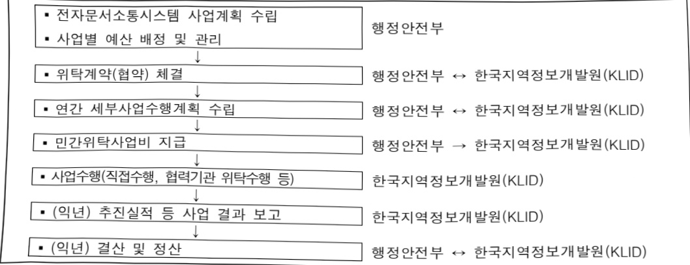

# 전자문서소통시스템(정보화)

**해당 페이지**: PDF 5248 ~ 5257 쪽 해당

**부처**: 행정안전부
**분야**: 일반·지방행정
**회계유형**: 일반회계
**2026 확정예산**: 26152.0 백만원
**전년대비 증감률**: 148.4%
**AI 도메인**: 행정/전자정부

---

<table border=1 style='margin: auto; word-wrap: break-word;'><tr><td style='text-align: center; word-wrap: break-word;'>사 업 명</td></tr><tr><td style='text-align: center; word-wrap: break-word;'>(6) 전자문서소통시스템(정보화) (1932-501)</td></tr></table>

# 사 엽 명

# (6) 전자문서소통시스템(정보화)(1932-501)

□ 사업 코드 정보

<table border=1 style='margin: auto; word-wrap: break-word;'><tr><td style='text-align: center; word-wrap: break-word;'>구분</td><td style='text-align: center; word-wrap: break-word;'>회계</td><td style='text-align: center; word-wrap: break-word;'>소관</td><td style='text-align: center; word-wrap: break-word;'>실국(기관)</td><td style='text-align: center; word-wrap: break-word;'>계정</td><td style='text-align: center; word-wrap: break-word;'>분야</td><td style='text-align: center; word-wrap: break-word;'>부문</td></tr><tr><td style='text-align: center; word-wrap: break-word;'>코드명칭</td><td style='text-align: center; word-wrap: break-word;'>일반회계</td><td style='text-align: center; word-wrap: break-word;'>행정안전부</td><td style='text-align: center; word-wrap: break-word;'>참여혁신조직실</td><td style='text-align: center; word-wrap: break-word;'>일반계정</td><td style='text-align: center; word-wrap: break-word;'>010일반·지방행정</td><td style='text-align: center; word-wrap: break-word;'>015정부자원관리</td></tr><tr><td style='text-align: center; word-wrap: break-word;'>구분</td><td colspan="2">프로그램</td><td colspan="2">단위사업</td><td colspan="2">세부사업</td></tr><tr><td rowspan="2">코드명칭</td><td colspan="2">1900</td><td colspan="2">1932</td><td colspan="2">501</td></tr><tr><td colspan="2">정부혁신조직</td><td colspan="2">민원처리개선(정보화)</td><td colspan="2">전자문서소통시스템(정보화)</td></tr></table>

□ 사업 성격

<table border=1 style='margin: auto; word-wrap: break-word;'><tr><td style='text-align: center; word-wrap: break-word;'>신규</td><td style='text-align: center; word-wrap: break-word;'>계속</td><td style='text-align: center; word-wrap: break-word;'>완료</td><td style='text-align: center; word-wrap: break-word;'>예비타당성 실시여부</td><td style='text-align: center; word-wrap: break-word;'>총사업비 관리대상</td><td style='text-align: center; word-wrap: break-word;'>총액계상 예산사업</td><td style='text-align: center; word-wrap: break-word;'>사업소관 변경정보 2025예산 시 소관</td></tr><tr><td style='text-align: center; word-wrap: break-word;'></td><td style='text-align: center; word-wrap: break-word;'>○</td><td style='text-align: center; word-wrap: break-word;'></td><td style='text-align: center; word-wrap: break-word;'></td><td style='text-align: center; word-wrap: break-word;'></td><td style='text-align: center; word-wrap: break-word;'></td><td style='text-align: center; word-wrap: break-word;'></td></tr></table>

□ 사업 지원 형태 및 지원을 (최소한 한 개는 반드시 선택하시오. 해당사항에 O 표시)

<table border=1 style='margin: auto; word-wrap: break-word;'><tr><td colspan="6">☐ 사업 지원 형태 및 지원을 (최소한 한 개는 반드시 선택하시오. 해당사항에 ○ 표시)</td></tr><tr><td style='text-align: center; word-wrap: break-word;'>직접</td><td style='text-align: center; word-wrap: break-word;'>출자</td><td style='text-align: center; word-wrap: break-word;'>출연</td><td style='text-align: center; word-wrap: break-word;'>보조</td><td style='text-align: center; word-wrap: break-word;'>융자</td><td style='text-align: center; word-wrap: break-word;'>국고보조율(%)</td></tr><tr><td style='text-align: center; word-wrap: break-word;'>○</td><td style='text-align: center; word-wrap: break-word;'></td><td style='text-align: center; word-wrap: break-word;'></td><td style='text-align: center; word-wrap: break-word;'></td><td style='text-align: center; word-wrap: break-word;'></td><td style='text-align: center; word-wrap: break-word;'></td></tr></table>

## □ 사업 담당자

<table border=1 style='margin: auto; word-wrap: break-word;'><tr><td style='text-align: center; word-wrap: break-word;'>사업명</td><td colspan="2">구분</td></tr><tr><td rowspan="3">전자문서소통 시스템 (정보화)</td><td rowspan="2">소관부처</td><td style='text-align: center; word-wrap: break-word;'>참여혁신조직실 참여혁신국</td></tr><tr><td style='text-align: center; word-wrap: break-word;'>정보공개제도과</td></tr><tr><td style='text-align: center; word-wrap: break-word;'>사업시행주체</td><td style='text-align: center; word-wrap: break-word;'>-</td></tr><tr><td rowspan="3">· 온나라 문서 시스템 운영 · 클라우드 윤리 문서시험 운영</td><td rowspan="2">소관부처</td><td style='text-align: center; word-wrap: break-word;'>참여혁신조직실 참여혁신국</td></tr><tr><td style='text-align: center; word-wrap: break-word;'>정보공개제도과</td></tr><tr><td style='text-align: center; word-wrap: break-word;'>사업시행주체</td><td style='text-align: center; word-wrap: break-word;'>-</td></tr><tr><td rowspan="3">· 정부전자문서 유통센터 운영</td><td rowspan="2">소관부처</td><td style='text-align: center; word-wrap: break-word;'>참여혁신조직실 참여혁신국</td></tr><tr><td style='text-align: center; word-wrap: break-word;'>정보공개제도과</td></tr><tr><td style='text-align: center; word-wrap: break-word;'>사업시행주체</td><td style='text-align: center; word-wrap: break-word;'>-</td></tr><tr><td rowspan="3">· 문서24 시스템 운영</td><td rowspan="2">소관부처</td><td style='text-align: center; word-wrap: break-word;'>참여혁신조직실 참여혁신국</td></tr><tr><td style='text-align: center; word-wrap: break-word;'>정보공개제도과</td></tr><tr><td style='text-align: center; word-wrap: break-word;'>사업시행주체</td><td style='text-align: center; word-wrap: break-word;'>-</td></tr><tr><td rowspan="3">· AI 행정업무 적용</td><td rowspan="2">소관부처</td><td style='text-align: center; word-wrap: break-word;'>인공지능정부실 인공지능정부정책국</td></tr><tr><td style='text-align: center; word-wrap: break-word;'>공공인공지능혁신과</td></tr><tr><td style='text-align: center; word-wrap: break-word;'>사업시행주체</td><td style='text-align: center; word-wrap: break-word;'>-</td></tr></table>

---

### 가. 예산 총괄표

(단위: 백만원, %)

<table border=1 style='margin: auto; word-wrap: break-word;'><tr><td rowspan="2">사업명</td><td rowspan="2">2024년 결산</td><td colspan="2">2025년 예산</td><td colspan="2">2026년 예산</td><td rowspan="2">증감(B-A)</td><td rowspan="2">(B-A)/A</td></tr><tr><td style='text-align: center; word-wrap: break-word;'>본예산</td><td style='text-align: center; word-wrap: break-word;'>추경(A)</td><td style='text-align: center; word-wrap: break-word;'>요구안</td><td style='text-align: center; word-wrap: break-word;'>본예산(B)</td></tr><tr><td style='text-align: center; word-wrap: break-word;'>전자문서소통시스템(정보화)</td><td style='text-align: center; word-wrap: break-word;'>7,407</td><td style='text-align: center; word-wrap: break-word;'>10,530</td><td style='text-align: center; word-wrap: break-word;'>10,530</td><td style='text-align: center; word-wrap: break-word;'>28,040</td><td style='text-align: center; word-wrap: break-word;'>26,152</td><td style='text-align: center; word-wrap: break-word;'>15,622</td><td style='text-align: center; word-wrap: break-word;'>148.4</td></tr></table>

□ 기능별(내역사업별) 예산 내역

(단위:백만원)

<table border=1 style='margin: auto; word-wrap: break-word;'><tr><td rowspan="2"></td><td colspan="5">2024</td><td colspan="5">2025</td><td rowspan="2">2026예산</td></tr><tr><td style='text-align: center; word-wrap: break-word;'>예산액(추경)</td><td style='text-align: center; word-wrap: break-word;'>예산현액</td><td style='text-align: center; word-wrap: break-word;'>집행액</td><td style='text-align: center; word-wrap: break-word;'>이월액</td><td style='text-align: center; word-wrap: break-word;'>불용액</td><td style='text-align: center; word-wrap: break-word;'>예산액(추경)</td><td style='text-align: center; word-wrap: break-word;'>예산현액</td><td style='text-align: center; word-wrap: break-word;'>집행액</td><td style='text-align: center; word-wrap: break-word;'>이월액</td><td style='text-align: center; word-wrap: break-word;'>불용액</td></tr><tr><td style='text-align: center; word-wrap: break-word;'>○ 기능별 분류(합계)</td><td style='text-align: center; word-wrap: break-word;'>6,290</td><td style='text-align: center; word-wrap: break-word;'>7,407</td><td style='text-align: center; word-wrap: break-word;'>7,407</td><td style='text-align: center; word-wrap: break-word;'>-</td><td style='text-align: center; word-wrap: break-word;'>-</td><td style='text-align: center; word-wrap: break-word;'>10,530</td><td style='text-align: center; word-wrap: break-word;'>10,530</td><td style='text-align: center; word-wrap: break-word;'>9,781</td><td style='text-align: center; word-wrap: break-word;'>49</td><td style='text-align: center; word-wrap: break-word;'>700</td><td style='text-align: center; word-wrap: break-word;'>26,152</td></tr><tr><td style='text-align: center; word-wrap: break-word;'>• 온나라 문서시스템 운영</td><td style='text-align: center; word-wrap: break-word;'>1,506</td><td style='text-align: center; word-wrap: break-word;'>1,506</td><td style='text-align: center; word-wrap: break-word;'>1,506</td><td style='text-align: center; word-wrap: break-word;'>-</td><td style='text-align: center; word-wrap: break-word;'>-</td><td style='text-align: center; word-wrap: break-word;'>1,492</td><td style='text-align: center; word-wrap: break-word;'>1,492</td><td style='text-align: center; word-wrap: break-word;'>1,492</td><td style='text-align: center; word-wrap: break-word;'>-</td><td style='text-align: center; word-wrap: break-word;'>-</td><td style='text-align: center; word-wrap: break-word;'>1,405</td></tr><tr><td style='text-align: center; word-wrap: break-word;'>• 클라우드 온나라 문서시스템 운영</td><td style='text-align: center; word-wrap: break-word;'>2,093</td><td style='text-align: center; word-wrap: break-word;'>2,093</td><td style='text-align: center; word-wrap: break-word;'>2,093</td><td style='text-align: center; word-wrap: break-word;'>-</td><td style='text-align: center; word-wrap: break-word;'>-</td><td style='text-align: center; word-wrap: break-word;'>3,032</td><td style='text-align: center; word-wrap: break-word;'>3,032</td><td style='text-align: center; word-wrap: break-word;'>3,032</td><td style='text-align: center; word-wrap: break-word;'>-</td><td style='text-align: center; word-wrap: break-word;'>-</td><td style='text-align: center; word-wrap: break-word;'>3,442</td></tr><tr><td style='text-align: center; word-wrap: break-word;'>• 정부전자문서 유통센터 운영</td><td style='text-align: center; word-wrap: break-word;'>885</td><td style='text-align: center; word-wrap: break-word;'>885</td><td style='text-align: center; word-wrap: break-word;'>885</td><td style='text-align: center; word-wrap: break-word;'>-</td><td style='text-align: center; word-wrap: break-word;'>-</td><td style='text-align: center; word-wrap: break-word;'>1,287</td><td style='text-align: center; word-wrap: break-word;'>1,287</td><td style='text-align: center; word-wrap: break-word;'>1,287</td><td style='text-align: center; word-wrap: break-word;'>-</td><td style='text-align: center; word-wrap: break-word;'>-</td><td style='text-align: center; word-wrap: break-word;'>1,303</td></tr><tr><td style='text-align: center; word-wrap: break-word;'>• 문서24 시스템 운영</td><td style='text-align: center; word-wrap: break-word;'>549</td><td style='text-align: center; word-wrap: break-word;'>549</td><td style='text-align: center; word-wrap: break-word;'>549</td><td style='text-align: center; word-wrap: break-word;'>-</td><td style='text-align: center; word-wrap: break-word;'>-</td><td style='text-align: center; word-wrap: break-word;'>549</td><td style='text-align: center; word-wrap: break-word;'>549</td><td style='text-align: center; word-wrap: break-word;'>549</td><td style='text-align: center; word-wrap: break-word;'>-</td><td style='text-align: center; word-wrap: break-word;'>-</td><td style='text-align: center; word-wrap: break-word;'>1,293</td></tr><tr><td style='text-align: center; word-wrap: break-word;'>• 차세대 전자문서 유통시스템 구축</td><td style='text-align: center; word-wrap: break-word;'>-</td><td style='text-align: center; word-wrap: break-word;'>1,117</td><td style='text-align: center; word-wrap: break-word;'>1,117</td><td style='text-align: center; word-wrap: break-word;'>-</td><td style='text-align: center; word-wrap: break-word;'>-</td><td style='text-align: center; word-wrap: break-word;'>-</td><td style='text-align: center; word-wrap: break-word;'>-</td><td style='text-align: center; word-wrap: break-word;'>-</td><td style='text-align: center; word-wrap: break-word;'>-</td><td style='text-align: center; word-wrap: break-word;'>-</td><td style='text-align: center; word-wrap: break-word;'>-</td></tr><tr><td style='text-align: center; word-wrap: break-word;'>• AI 행정업무 적용</td><td style='text-align: center; word-wrap: break-word;'>1,257</td><td style='text-align: center; word-wrap: break-word;'>1,257</td><td style='text-align: center; word-wrap: break-word;'>1,257</td><td style='text-align: center; word-wrap: break-word;'>-</td><td style='text-align: center; word-wrap: break-word;'>-</td><td style='text-align: center; word-wrap: break-word;'>4,170</td><td style='text-align: center; word-wrap: break-word;'>4,170</td><td style='text-align: center; word-wrap: break-word;'>3,421</td><td style='text-align: center; word-wrap: break-word;'>49</td><td style='text-align: center; word-wrap: break-word;'>700</td><td style='text-align: center; word-wrap: break-word;'>18,709</td></tr></table>

### 나.사업설명자료

## 1 ) 사업목적·내용

- (온나라 문서시스템 운영)

· 행안부가 개발하여 중앙부처·자치단체 등이 사용 중인 시스템으로 행정업무에 대한 문서작성·결재·의사결정과정 등 문서 처리의 모든 과정을 전자적으로 기록·관리

· 온나라용 표준OS 기술지원 종료('24.6.30.)로 보안사고 및 대규모 장애 위험성 상존, 안정성이 검증된 대체OS 적용을 위한 표준 온나라 응용SW 재개발

· 온나라 문서시스템, 전자문서유통 및 문서24 시스템 위탁사업 인건비 및 일반관리비 - (클라우드 온나라 문서시스템 운영)

300여개 기관이 사용 중인 업무관리 시스템으로 클라우드 기반으로 부처를 통합하여 부처 간 메모보고 등 공유·협업 기반의 업무환경 제공

---

법·제도 개정에 따른 정책 반영 및 약 72만명 사용자 요구사항에 따른 기능개선을 시스템에 신속 반영함으로써 행정업무 효율 및 사용자 만족도 제고

- (정부전자문서유통센터 운영) 약 3,040여개 기관이 연간 2.2억건의 전자문서를 유통하는 시스템으로 대국민, 행정·공공기관 간 신속·정확한 전자문서 유통 서비스 제공 및 이용 활성화 제고

(문서24 시스템 운영) 대국민이 인터넷을 통해 비대면으로 행정·공공기관과 양방향 전자문서 유통이 가능한 시스템으로 대국민 편의성 및 만족도, 사회 전반의 예산 절감 효과 제고

사회 전반의 종이문서 획기적인 감축으로 약 627억원의 비용(인쇄비, 교통비 등) 절감 획기적인

## - (AI 행정업무 적용)

· 행정업무에 AI를 적용, 모든 행정 프로세스와 업무기능이 유기적으로 연계되는 혁신적 업무환경인 ‘지능형 업무관리 플랫폼’ 구현

· 행정업무의 근간을 이루는 핵심 시스템으로, 공무원의 일하는 방식을 근본적으로 전환하고 업무생산성을 획기적으로 향상시키는 정부 혁신의 새로운 동력

## 2 ) 사업개요

## □ 사업근거 및 추진경위

① 법령상 근거 및 조항 적시

## 0 온나라 문서시스템, 클라우드 온나라 문서시스템 운영

- 행정업무의 운영 및 혁신에 관한 규정 제21조(업무관리시스템) 및 동 규정 시행규칙 제19조(업무관리시스템구축·운영 지원), 제20조(업무관리시스템의 구성), 제21조(업무관리시스템에 의한 기안 및 시행)

행정업무의 운영 및 혁신에 관한 규정 제21조(업무관리시스템)

①행정기관의 장은 업무처리의 모든 과정을 효율적으로 관리하기 위하여 업무관리시스템을 구축·운영하여야 한다

## o 정부전자문서유통센터 운영

- 행정업무의 운영 및 혁신에 관한 규정 제25조(정부전자문서유통지원센터), 동 규정 시행규칙 제22조(정부전자문서유통지원센터의 운영 등)

행정업무의 운영 및 혁신에 관한 규정 제25조(정부전자문서유통지원센터)

① 행정안전부장관은 전자문서의 원활한 유통을 지원하기 위하여 행정안전부에 정부전자문서 유통지원센터를 둔다.

## o 문서24 서비스 운영

-행정업무의 운영 및 혁신에 관한 규정 제 25조(정부전자문서유통지원센터)

행정업무의 운영 및 혁신에 관한 규정 제25조(정부전자문서유통지원센터)

① 행정안전부장관은 전자문서의 원활한 유통을 지원하기 위하여 행정안전부에 정부전자문서 유통지원센터를 둔다.

②센터는 다음 각 호의 업무를 수행한다.

5. 행정기관, 공공기관(「전자정부법」 제2조제3호에 따른 공공기관을 말한다. 이하 같다) 및 국민 간 전자문서의 유통을 위한 시스템 구축 및 운영

---

## ° AI 행정업무 적용

- 전자정부법 제18조의2(지능형 전자정부서비스의 제공 등)

- 행정업무의 운영 및 혁신에 관한 규정(행정업무규정) 제21조(업무관리시스템), 제46조의2(행정업무혁신시스템의 구축·운영) 등

전자정부법 제18조의2(지능형 전자정부서비스의 제공 등)

① 행정기관등의 장은 인공지능 등의 기술을 활용하여 전자정부서비스를 제공할 수 있다.

행정업무의 운영 및 혁신에 관한 규정 제21조(업무관리시스템)

①행정기관의 장은 업무처리의 모든 과정을 효율적으로 관리하기 위하여 업무관리시스템을 구축운영하여야 한다

행정업무의 운영 및 혁신에 관한 규정 제46조의2(행정업무혁신시스템의 구축·운영)

① 행정안전부장관은 행정기관이 제41조제2항 각 호의 업무를 원활하게 수행할 수 있도록 전자적 시스템(이하 “행정업무혁신시스템”이라 한다)을 구축할 수 있다.

## ② 추진경위 - 사업 시작년도, 추진배경, 부처별 중점과제, 대통령 공약사항 등

## 0 온나라 문서시스템 운영

- '23. 1 ~ '23.12. : 국세청, 전라남도, 경상북도 등 80개 기관 온나라2.0 전환지원

- '24. 1 ~ '24.12. : 부산광역시, 서울 도봉구 등 45개 기관 온나라2.0 전환지원

- '25. 1 ~ '25. 8. : 사용자 교육, 자주묻는 질문 작성·배포, 보안취약점 점검·보완 등

## 0 클라우드 온나라 시스템 운영

- '23. 1 ~ '23.12. : 행정문서 활용 및 데이터 친화적 문서생산을 위한 웹 기안기* 전환

* 기존 웹 기안기 서비스종료(EOS)로 솔루션 변경

- '24. 1 ~ '24.12. : 문서내 개인정보 탐지 강화(텍스트 및 이미지파일), 기능개선 등

- '25. 1 ~ '25. 8. : 신규위원회 온나라 설치, UI/UX 개선, 보안취약점 점검·보완 등

## o 정부전자문서유통센터 운영

- '23. 7. ~ '24. 2.: 차세대 전자문서유통시스템 구축 사업(3차) 완료

- '24. 1. ~ '24.12. : 전자문서유통센터 운영·관리지침 개정, 개인정보보호 강화

- '25. 1. ~ '25. 8. : 문서유통 행정망(대전·광주) 스토리지 전환(NAS→SAN) 등

## ㅇ 문서24 서비스 운영

- '23. 10. : 문서 24 운영 정책 및 약관 개정(인증 의무화, 문서보관기간 확대 등)

- '24. 10. : 조달업체 문서24 확대 관련 DB서버 교체 및 편의 기능 개선 추진

- '25. 6. : 문서24 개인정보사용자 로그인 본인인증 수단(금융인증서) 확대

## ○ AI 행정업무 적용

- '23. 11. : AI 행정지원 서비스 시범개발 완료

- '24. 4.~10. : AI 행정지원 서비스 시범운영 완료

- '24. 10. : 지능형 업무관리 플랫폼 구현을 위한 BPR/ISP* 수립 완료

- '25. 5~. : 지능형 업무관리 플랫폼 1차 구축 사업 추진 중

---

## □ 주요내용

① 사업규모

- 총사업비(해당되는 경우에만 기재) : 해당없음

- 사업기간 : '04 ~ 계속

- 최근 5년 간 투입된 사업비(예산액기준, 추경편성한 연도에는 추경포함)

<table border=1 style='margin: auto; word-wrap: break-word;'><tr><td style='text-align: center; word-wrap: break-word;'>$ H_{2}O $</td><td style='text-align: center; word-wrap: break-word;'>2022</td><td style='text-align: center; word-wrap: break-word;'>2023</td><td style='text-align: center; word-wrap: break-word;'>2024</td><td style='text-align: center; word-wrap: break-word;'>2025</td><td style='text-align: center; word-wrap: break-word;'>2026</td></tr><tr><td style='text-align: center; word-wrap: break-word;'>$ H_{2}O $</td><td style='text-align: center; word-wrap: break-word;'>16,951</td><td style='text-align: center; word-wrap: break-word;'>13,009</td><td style='text-align: center; word-wrap: break-word;'>6,290</td><td style='text-align: center; word-wrap: break-word;'>10,530</td><td style='text-align: center; word-wrap: break-word;'>26,152</td></tr></table>

## ② 사업추진체계

- 사업시행방법 : 직접수행, 위탁

- 사업 수혜자 : 국민, 중앙행정기관과 소속기관, 지방자치단체, 군(軍), 공공기관

- 사업시행주체 : 행정안전부

- 보조, 융자, 출연, 출자 등의 경우 보조·융자 등 지원 비율 및 법적근거 : 해당없음

## 3 ) 2026년도 예산 산출 근거

(1) 온나라 문서시스템 운영 : (2026) 1,405백만원

▶ 표준 온나라 응용SW 재개발 : '26예산 784백

- (산출) 재개발 1식 784,000천원

위탁사업 인건비 및 일반관리비 : '26예산 621백

- (산출)

• 인건비 : 279,889천원

• 일반관리비 : 342,000천원

(2) 클라우드 온나라 문서시스템 운영 : (2026) 3,032백만원

시스템 유지관리 : '26예산 2,682백 – (산출)

• 응용 SW : 2,332,000천원

• 상용 SW : 256,196천원

• 상용SW 연간 라이센스 : 94백

▶ 운영 및 기술지원 : '26예산 350백

- (산출) 인건비 350백

▶ 온나라 문서 품질 검증(붙임파일) 솔루션 추가 도입 : '26예산 410백 – (산출) 상용SW 410백

(3) 정부전자문서유통센터 운영 : (2026) 1,303백만원

---

▶ 시스템 유지관리 : '26예산 1,103백

- (산출)

· 응용 SW : 450,815천원

· 상용 SW : 568,646천원

• 보안 SW : 85,880전원

문서유통 상용SW 증설 : '26예산 16백

▶ 운영 및 기술지원 : '26예산 184백

- (산출) 인건비 184백

(4)문서24시스템 운영:(2026)1,293백만원

▶ 시스템 유지관리 : '26예산 199백

- (산출)

• 응용 SW : 149,422천원

• 상용 SW : 49,473천원

문서24 공공웹서식 고도화 등 : '26예산 194백 – (산출) 194,243원

▶ 운영 및 기술지원 : '26예산 156백

- (산출) 인건비 156백

문서24 문서편집기(웹기안기) 교체 도입 : '26예산 744백 – (산출) 솔루션 744백만원

## (5) AI행정업무 적용:(2026)18,709백만원

- (산출)

• 지능형 업무관리 플랫폼 확산 : 16,813백

• 지능형 업무관리 플랫폼 HW(CPU, 스토리지 등) : 1,500백

• 지능형 업무관리 플랫폼 감리 비용 : 396백

## 4 ) 사업효과

☐ 사업영향, 산출물 성과지표 등

① 2022~2026년도 성과계획서 상 성과지표 및 최근 5년간 성과 달성도

<table border=1 style='margin: auto; word-wrap: break-word;'><tr><td style='text-align: center; word-wrap: break-word;'>성과지표</td><td style='text-align: center; word-wrap: break-word;'>구분</td><td style='text-align: center; word-wrap: break-word;'>2022</td><td style='text-align: center; word-wrap: break-word;'>2023</td><td style='text-align: center; word-wrap: break-word;'>2024</td><td style='text-align: center; word-wrap: break-word;'>2025</td><td style='text-align: center; word-wrap: break-word;'>2026</td><td style='text-align: center; word-wrap: break-word;'>2026 목표치산출근거</td><td style='text-align: center; word-wrap: break-word;'>측정산식(또는 측정방법)</td><td style='text-align: center; word-wrap: break-word;'>자료수집방법(또는 자료출처)</td></tr><tr><td rowspan="3">①공공개방자원중 직접예약가능 등록자원 비율(%)</td><td style='text-align: center; word-wrap: break-word;'>목표</td><td style='text-align: center; word-wrap: break-word;'>30</td><td style='text-align: center; word-wrap: break-word;'>33</td><td style='text-align: center; word-wrap: break-word;'>33</td><td style='text-align: center; word-wrap: break-word;'>-</td><td style='text-align: center; word-wrap: break-word;'>-</td><td rowspan="3">-</td><td rowspan="3">-</td><td rowspan="3">-</td></tr><tr><td style='text-align: center; word-wrap: break-word;'>실적</td><td style='text-align: center; word-wrap: break-word;'>30</td><td style='text-align: center; word-wrap: break-word;'>36.5</td><td style='text-align: center; word-wrap: break-word;'>-</td><td style='text-align: center; word-wrap: break-word;'>-</td><td style='text-align: center; word-wrap: break-word;'>-</td></tr><tr><td style='text-align: center; word-wrap: break-word;'>달성도</td><td style='text-align: center; word-wrap: break-word;'>100</td><td style='text-align: center; word-wrap: break-word;'>-</td><td style='text-align: center; word-wrap: break-word;'>-</td><td style='text-align: center; word-wrap: break-word;'>-</td><td style='text-align: center; word-wrap: break-word;'>-</td></tr><tr><td rowspan="3">②정부24 월평균 정부서비스 이용실적(천간)</td><td style='text-align: center; word-wrap: break-word;'>목표</td><td style='text-align: center; word-wrap: break-word;'>4768</td><td style='text-align: center; word-wrap: break-word;'>5245</td><td style='text-align: center; word-wrap: break-word;'>5245</td><td style='text-align: center; word-wrap: break-word;'>-</td><td style='text-align: center; word-wrap: break-word;'>-</td><td rowspan="3">-</td><td rowspan="3">-</td><td rowspan="3">-</td></tr><tr><td style='text-align: center; word-wrap: break-word;'>실적</td><td style='text-align: center; word-wrap: break-word;'>6186</td><td style='text-align: center; word-wrap: break-word;'>7448</td><td style='text-align: center; word-wrap: break-word;'>-</td><td style='text-align: center; word-wrap: break-word;'>-</td><td style='text-align: center; word-wrap: break-word;'>-</td></tr><tr><td style='text-align: center; word-wrap: break-word;'>달성도</td><td style='text-align: center; word-wrap: break-word;'>129,7</td><td style='text-align: center; word-wrap: break-word;'>-</td><td style='text-align: center; word-wrap: break-word;'>-</td><td style='text-align: center; word-wrap: break-word;'>-</td><td style='text-align: center; word-wrap: break-word;'>-</td></tr><tr><td rowspan="2">③“도전·한국” 공모과제 국민</td><td style='text-align: center; word-wrap: break-word;'>목표</td><td style='text-align: center; word-wrap: break-word;'>2900</td><td style='text-align: center; word-wrap: break-word;'>515</td><td style='text-align: center; word-wrap: break-word;'>515</td><td style='text-align: center; word-wrap: break-word;'>-</td><td style='text-align: center; word-wrap: break-word;'>-</td><td rowspan="2">-</td><td rowspan="2">-</td><td rowspan="2">-</td></tr><tr><td style='text-align: center; word-wrap: break-word;'>실적</td><td style='text-align: center; word-wrap: break-word;'>510</td><td style='text-align: center; word-wrap: break-word;'>2082</td><td style='text-align: center; word-wrap: break-word;'>-</td><td style='text-align: center; word-wrap: break-word;'>-</td><td style='text-align: center; word-wrap: break-word;'>-</td></tr></table>

---

<table border=1 style='margin: auto; word-wrap: break-word;'><tr><td style='text-align: center; word-wrap: break-word;'>아이디어 제안실적(건)</td><td style='text-align: center; word-wrap: break-word;'>달성도</td><td style='text-align: center; word-wrap: break-word;'></td><td style='text-align: center; word-wrap: break-word;'></td><td style='text-align: center; word-wrap: break-word;'></td><td style='text-align: center; word-wrap: break-word;'>-</td><td style='text-align: center; word-wrap: break-word;'>-</td><td style='text-align: center; word-wrap: break-word;'></td><td style='text-align: center; word-wrap: break-word;'></td><td style='text-align: center; word-wrap: break-word;'></td></tr><tr><td rowspan="3">④주민참여 지역문제 해결 확산 프로젝트 과제건수(건)</td><td style='text-align: center; word-wrap: break-word;'>목표</td><td style='text-align: center; word-wrap: break-word;'>37</td><td style='text-align: center; word-wrap: break-word;'>40</td><td style='text-align: center; word-wrap: break-word;'>40</td><td style='text-align: center; word-wrap: break-word;'>-</td><td style='text-align: center; word-wrap: break-word;'>-</td><td rowspan="3">-</td><td rowspan="3">-</td><td rowspan="3">-</td></tr><tr><td style='text-align: center; word-wrap: break-word;'>실적</td><td style='text-align: center; word-wrap: break-word;'>39</td><td style='text-align: center; word-wrap: break-word;'>44</td><td style='text-align: center; word-wrap: break-word;'>-</td><td style='text-align: center; word-wrap: break-word;'>-</td><td style='text-align: center; word-wrap: break-word;'>-</td></tr><tr><td style='text-align: center; word-wrap: break-word;'>달성도</td><td style='text-align: center; word-wrap: break-word;'>105,4</td><td style='text-align: center; word-wrap: break-word;'>-</td><td style='text-align: center; word-wrap: break-word;'>-</td><td style='text-align: center; word-wrap: break-word;'>-</td><td style='text-align: center; word-wrap: break-word;'>-</td></tr><tr><td rowspan="3">⑤정부혁신 및 관련 주요정책 국민인지도 및 참여도(점)</td><td style='text-align: center; word-wrap: break-word;'>목표</td><td style='text-align: center; word-wrap: break-word;'>신규</td><td style='text-align: center; word-wrap: break-word;'>신규</td><td style='text-align: center; word-wrap: break-word;'>56.7</td><td style='text-align: center; word-wrap: break-word;'>-</td><td style='text-align: center; word-wrap: break-word;'>-</td><td rowspan="3">-</td><td rowspan="3">-</td><td rowspan="3">-</td></tr><tr><td style='text-align: center; word-wrap: break-word;'>실적</td><td style='text-align: center; word-wrap: break-word;'>신규</td><td style='text-align: center; word-wrap: break-word;'>신규</td><td style='text-align: center; word-wrap: break-word;'>-</td><td style='text-align: center; word-wrap: break-word;'>-</td><td style='text-align: center; word-wrap: break-word;'>-</td></tr><tr><td style='text-align: center; word-wrap: break-word;'>달성도</td><td style='text-align: center; word-wrap: break-word;'>-</td><td style='text-align: center; word-wrap: break-word;'>-</td><td style='text-align: center; word-wrap: break-word;'>-</td><td style='text-align: center; word-wrap: break-word;'>-</td><td style='text-align: center; word-wrap: break-word;'>-</td></tr><tr><td rowspan="3">⑥국내 ‘정부혁신’ 확산도(회)</td><td style='text-align: center; word-wrap: break-word;'>목표</td><td style='text-align: center; word-wrap: break-word;'>신규</td><td style='text-align: center; word-wrap: break-word;'>신규</td><td style='text-align: center; word-wrap: break-word;'>신규</td><td style='text-align: center; word-wrap: break-word;'>90</td><td style='text-align: center; word-wrap: break-word;'>-</td><td rowspan="3">-</td><td rowspan="3">-</td><td rowspan="3">-</td></tr><tr><td style='text-align: center; word-wrap: break-word;'>실적</td><td style='text-align: center; word-wrap: break-word;'>신규</td><td style='text-align: center; word-wrap: break-word;'>신규</td><td style='text-align: center; word-wrap: break-word;'>신규</td><td style='text-align: center; word-wrap: break-word;'>-</td><td style='text-align: center; word-wrap: break-word;'>-</td></tr><tr><td style='text-align: center; word-wrap: break-word;'>달성도</td><td style='text-align: center; word-wrap: break-word;'>-</td><td style='text-align: center; word-wrap: break-word;'>-</td><td style='text-align: center; word-wrap: break-word;'>-</td><td style='text-align: center; word-wrap: break-word;'>-</td><td style='text-align: center; word-wrap: break-word;'>-</td></tr><tr><td rowspan="3">⑦국민 ‘정부혁신 체감도’(점)</td><td style='text-align: center; word-wrap: break-word;'>목표</td><td style='text-align: center; word-wrap: break-word;'>신규</td><td style='text-align: center; word-wrap: break-word;'>신규</td><td style='text-align: center; word-wrap: break-word;'>신규</td><td style='text-align: center; word-wrap: break-word;'>신규</td><td style='text-align: center; word-wrap: break-word;'>54</td><td rowspan="3">‘24년 정부혁신 인식조사에서 측정한 체감도 점수는 53.5점으로, 신규지표이지만 새정부 정부혁신의 체감도 제고를 위해 54점으로 설정</td><td rowspan="3">국민대상 외부 전문기관 설문조사(리커트 5점 척도로 측정 후 100점 기준 환산)</td><td rowspan="3">정부혁신 대국민 여론조사 보고서</td></tr><tr><td style='text-align: center; word-wrap: break-word;'>실적</td><td style='text-align: center; word-wrap: break-word;'>신규</td><td style='text-align: center; word-wrap: break-word;'>신규</td><td style='text-align: center; word-wrap: break-word;'>신규</td><td style='text-align: center; word-wrap: break-word;'>신규</td><td style='text-align: center; word-wrap: break-word;'>-</td></tr><tr><td style='text-align: center; word-wrap: break-word;'>달성도</td><td style='text-align: center; word-wrap: break-word;'>신규</td><td style='text-align: center; word-wrap: break-word;'>신규</td><td style='text-align: center; word-wrap: break-word;'>신규</td><td style='text-align: center; word-wrap: break-word;'>신규</td><td style='text-align: center; word-wrap: break-word;'>-</td></tr></table>

② 성과지표 이외의 연도별 사업추진 경과 및 실적

<table border=1 style='margin: auto; word-wrap: break-word;'><tr><td style='text-align: center; word-wrap: break-word;'>2025</td><td style='text-align: center; word-wrap: break-word;'>- 온나라 업무관리시스템 기능개선을 통한 사용자 편의 향상- 문서유통 사용자 편의성 향상 및 처리 성능 향상- 문서24 안정적 운영을 위한 인프라·서비스 개선 및 인증수단 확대 추진- 지능형 업무관리 플랫폼 1차 구축 사업 추진</td></tr></table>

③향후(2026년도 이후)기대효과

## 온나라 문서시스템, 클라우드 온나라 문서시스템 운영

- 온나라 문서시스템은 기능분류시스템, 기록관리시스템, 디브레인 등 범정부 시스템 및 이용기관의 개별 행정정보시스템과의 지속적인 연계 확대로 업무 효율성 향상

- 법·제도 개정 및 사용자 요구사항(약 72만명)을 시스템에 반영함으로써 업무 효율성 향상 및 행정업무에 대한 범칭부 활용체계 강화

- 클라우드 기반으로 중앙부처 통합 및 사용기관 지속 확대를 통해 기관 간 메모보고

등 공유·협업 기반의 업무환경을 제공

## ° 정부전자문서유통센터 운영

- 안정적인 정부전자문서유통센터 운영으로 문서유통 수·사용기관 수 지속적인 증가

---

## ○ 문서24 서비스 운영

- 문서24 서비스를 통한 일반 국민이 공문을 전자적으로 제출하면 공무원이 전자적으로 접수하고, 디지털 공공서식을 확산함으로써 대국민 편의성 제고, 종이 문서 감소 등 행정 효율성 향상

## ☐ 행정업무 AI 적용

- 단순·반복적인 업무나 문서작성 등에 투입되는 과도한 시간과 노력을 획기적으로

줄이고, 공무원 본연의 업무에 집중할 수 있도록 지원

- 플랫폼 구축 이후, 중앙 및 지자체까지 범정부적으로 플랫폼을 신속하게 확산하고, 지속적인 AI 서비스 발굴을 통해 정부효율성 향상

## 5 ) 타당성조사 및 예비타당성조사 시행여부 및 결과 요지 : 해당없음

## 6 ) 총사업비 대상사업 여부 및 내역 : 해당없음

## 7 ) 사업 집행절차

## 8 ) 각종 평가

---

<table border=1 style='margin: auto; word-wrap: break-word;'><tr><td style='text-align: center; word-wrap: break-word;'>1) 국회(예결위, 상임위, 예정처, 국정감사 포함) 지적 (예결위·행안위, ‘25예산’) ① ISP 중간산출물이 갖춰야 할 필수요건이 충족되지 않은 상태에서 예산을 편성하여 보완 추진이 필요 ② ISP 추진 중 총사업비 확대·변경 등 미흡한 측면이 있어 구체적 사유 확인 및 철저한 사업 관리 필요 2) 대외공개 평가</td></tr><tr><td style='text-align: center; word-wrap: break-word;'>「국가재정법」제85조의8제1항에 따른 재정사업자율평가 결과에 대한 기획재정부의 상위평가(심층평가) 결과: ‘24년 81.4점(보통)</td></tr><tr><td style='text-align: center; word-wrap: break-word;'>3) 자체평가</td></tr><tr><td style='text-align: center; word-wrap: break-word;'>2025년(2024년 회계연도) 부처 재정사업 자율평가 결과: 우수(92.5점)</td></tr></table>

1) 국회(예결위, 상임위, 예정처, 국정감사 포함) 지적

(예결위·행안위, '25예산) ① ISP 중간산출물이 갖춰야할 필수요건이 충족되지 않은 상태에서 예산을 편성하여 보완 추진이 필요 ② ISP 추진 중 총사업비 확대·변경 등 미흡한 측면이 있어 구체적 사유 확인 및 철저한 사업 관리 필요

2) 대외공개 평가

「국가재정법」제85조의8제1항에 따른 재정사업자율평가 결과에 대한 기획재정부의 상위평가(심층평가) 결과 : '24년 81.4점(보통)

2025년(2024년 회계연도) 부처 재정사업 자율평가 결과: 우수(92.5점)

---

### 다. 최근 4년간 결산내역

## 1 ) 결산표

☐ 부처 결산내역

(단위: 백만원, %)

<table border=1 style='margin: auto; word-wrap: break-word;'><tr><td rowspan="2">연도</td><td colspan="3">예산액</td><td rowspan="2">예산현액(A)</td><td rowspan="2">집행액(B)</td><td rowspan="2">집행률(B/A)</td><td rowspan="2">다음연도이월액</td><td rowspan="2">불용액</td></tr><tr><td style='text-align: center; word-wrap: break-word;'>본예산</td><td style='text-align: center; word-wrap: break-word;'>추경중감액</td><td style='text-align: center; word-wrap: break-word;'>추경</td></tr><tr><td style='text-align: center; word-wrap: break-word;'>2022</td><td style='text-align: center; word-wrap: break-word;'>17,021</td><td style='text-align: center; word-wrap: break-word;'>△70</td><td style='text-align: center; word-wrap: break-word;'>16,951</td><td style='text-align: center; word-wrap: break-word;'>16,951</td><td style='text-align: center; word-wrap: break-word;'>16,788</td><td style='text-align: center; word-wrap: break-word;'>99.0</td><td style='text-align: center; word-wrap: break-word;'>-</td><td style='text-align: center; word-wrap: break-word;'>163</td></tr><tr><td style='text-align: center; word-wrap: break-word;'>2023</td><td style='text-align: center; word-wrap: break-word;'>13,009</td><td style='text-align: center; word-wrap: break-word;'>-</td><td style='text-align: center; word-wrap: break-word;'>13,009</td><td style='text-align: center; word-wrap: break-word;'>12,799</td><td style='text-align: center; word-wrap: break-word;'>11,657</td><td style='text-align: center; word-wrap: break-word;'>89.6</td><td style='text-align: center; word-wrap: break-word;'>1,117</td><td style='text-align: center; word-wrap: break-word;'>25</td></tr><tr><td style='text-align: center; word-wrap: break-word;'>2024</td><td style='text-align: center; word-wrap: break-word;'>6,290</td><td style='text-align: center; word-wrap: break-word;'>-</td><td style='text-align: center; word-wrap: break-word;'>6,290</td><td style='text-align: center; word-wrap: break-word;'>7,407</td><td style='text-align: center; word-wrap: break-word;'>7,407</td><td style='text-align: center; word-wrap: break-word;'>117.8</td><td style='text-align: center; word-wrap: break-word;'>-</td><td style='text-align: center; word-wrap: break-word;'>-</td></tr><tr><td style='text-align: center; word-wrap: break-word;'>2025</td><td style='text-align: center; word-wrap: break-word;'>10,530</td><td style='text-align: center; word-wrap: break-word;'>-</td><td style='text-align: center; word-wrap: break-word;'>10,530</td><td style='text-align: center; word-wrap: break-word;'>10,530</td><td style='text-align: center; word-wrap: break-word;'>9,565</td><td style='text-align: center; word-wrap: break-word;'>90.8</td><td style='text-align: center; word-wrap: break-word;'>-</td><td style='text-align: center; word-wrap: break-word;'>-</td></tr></table>

## 2 ) 주요 결산사항

□ 2022~2025년 결산 주요 지적사항 및 시정요구사항

<table border=1 style='margin: auto; word-wrap: break-word;'><tr><td style='text-align: center; word-wrap: break-word;'>2022</td><td style='text-align: center; word-wrap: break-word;'>- 이·전용 등 사유: 차세대 전자문서유통시스템 개발비용(3,087만원)을 정책연구비(260-02)에서 일반연구비(260-01)로 변경
※「2022년도 예산 및 기금운영계획 집행지침」에 따라 정보화 전산용역사업은 일반연구비로 집행이 타당
- 추경 편성 사유: ‘22년 기재부 제2회 추경 요청에 따라 일반연구비(260-01) △70백만원 감액
- 이월 사유 및 불용 사유(집행부진사유): 낙찰차액</td></tr><tr><td style='text-align: center; word-wrap: break-word;'>2023</td><td style='text-align: center; word-wrap: break-word;'>- 이·전용 등 사유: 차세대 전자문서유통시스템 자산취득비(652백만원) 중 재난대책비(210
백만원)을 호우(6.27.~7.27.) 및 제6호 태풍 카눈 피해 복구에 필요한 행안부 소관 피해시설
복구비(재난대책비) 부족분 예산 자체 이용
※「2023년도 예산 및 기금운영계획 집행지침」에 따라 호우(6.27.~7.27.) 및 제6호 태풍 카눈
피해 복구에 필요한 행안부 소관 피해시설 복구비(재난대책비) 부족분 예산 자체 이용
- 이월액 발생 사유: 차세대 전자문서유통시스템 구축사업(‘23.6.29.~’24.2.24.) 및 감리용역 사업
절대공기 부족으로 이월액(1,117백만원) 발생</td></tr><tr><td style='text-align: center; word-wrap: break-word;'>2024</td><td style='text-align: center; word-wrap: break-word;'>- 해당없음</td></tr><tr><td style='text-align: center; word-wrap: break-word;'>2025</td><td style='text-align: center; word-wrap: break-word;'>- 해당없음</td></tr></table>

□ 2025년 이·전용 등 세부내역 : 해당없음

---

### 원본 PDF 크롭 이미지

