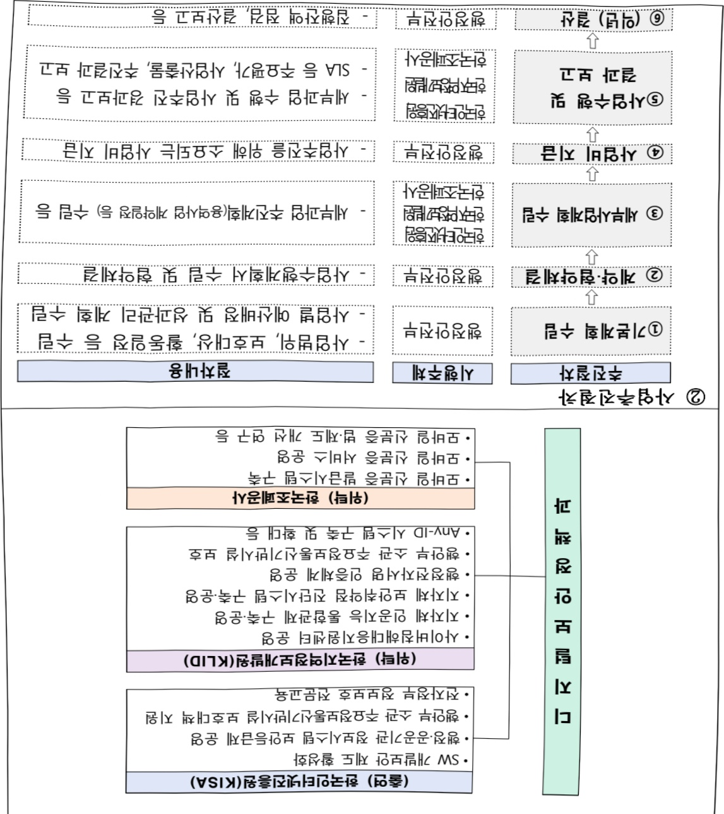

# 정보보호인프라확충(정보화)

**해당 페이지**: PDF 5258 ~ 5285 쪽 해당

**부처**: 행정안전부
**분야**: 일반·지방행정
**회계유형**: 일반회계
**2026 확정예산**: 19514.0 백만원
**전년대비 증감률**: -2.1%
**AI 도메인**: 데이터, 보안/사이버, 행정/전자정부

---

<table border=1 style='margin: auto; word-wrap: break-word;'><tr><td rowspan="2">사이버 침해사고 예방</td><td style='text-align: center; word-wrap: break-word;'>소관부처</td><td style='text-align: center; word-wrap: break-word;'>인공지능정부실 디지털보안정책과</td></tr><tr><td style='text-align: center; word-wrap: break-word;'>사업시행주체</td><td style='text-align: center; word-wrap: break-word;'>한국지역정보개발원</td></tr><tr><td rowspan="2">전자정부 정보보호 전문교육</td><td style='text-align: center; word-wrap: break-word;'>소관부처</td><td style='text-align: center; word-wrap: break-word;'>인공지능정부실 디지털보안정책과</td></tr><tr><td style='text-align: center; word-wrap: break-word;'>사업시행주체</td><td style='text-align: center; word-wrap: break-word;'>한국인터넷진흥원</td></tr><tr><td style='text-align: center; word-wrap: break-word;'>공공요금 등 경상경비</td><td style='text-align: center; word-wrap: break-word;'>소관부처</td><td style='text-align: center; word-wrap: break-word;'>인공지능정부실 디지털보안정책과</td></tr><tr><td rowspan="2">모바일 신분증 플랫폼 구축 및 운영</td><td style='text-align: center; word-wrap: break-word;'>소관부처</td><td style='text-align: center; word-wrap: break-word;'>인공지능정부실 국민맞춤서비스과</td></tr><tr><td style='text-align: center; word-wrap: break-word;'>사업시행주체</td><td style='text-align: center; word-wrap: break-word;'>한국조폐공사</td></tr><tr><td rowspan="2">간편인증시스템 운영 및 유지관리</td><td style='text-align: center; word-wrap: break-word;'>소관부처</td><td style='text-align: center; word-wrap: break-word;'>인공지능정부실 국민맞춤서비스과</td></tr><tr><td style='text-align: center; word-wrap: break-word;'>사업시행주체</td><td style='text-align: center; word-wrap: break-word;'>한국지역정보개발원</td></tr><tr><td rowspan="2">정부 SSL 운영 및 유지관리</td><td style='text-align: center; word-wrap: break-word;'>소관부처</td><td style='text-align: center; word-wrap: break-word;'>인공지능정부실 디지털보안정책과</td></tr><tr><td style='text-align: center; word-wrap: break-word;'>사업시행주체</td><td style='text-align: center; word-wrap: break-word;'>한국지역정보개발원</td></tr></table>

### 가. 예산 총괄표

(단위: 백만원, %)

<table border=1 style='margin: auto; word-wrap: break-word;'><tr><td style='text-align: center; word-wrap: break-word;'>2024년</td><td style='text-align: center; word-wrap: break-word;'>2025년 예산</td><td style='text-align: center; word-wrap: break-word;'>2026년 예산</td><td style='text-align: center; word-wrap: break-word;'>증감 (B-A)</td><td style='text-align: center; word-wrap: break-word;'>(B-A)/A</td></tr><tr><td style='text-align: center; word-wrap: break-word;'>결산</td><td style='text-align: center; word-wrap: break-word;'>본예산</td><td style='text-align: center; word-wrap: break-word;'>추경(A)</td><td style='text-align: center; word-wrap: break-word;'>요구안</td><td style='text-align: center; word-wrap: break-word;'>본예산(B)</td></tr><tr><td style='text-align: center; word-wrap: break-word;'>정보보호인프라화층</td><td style='text-align: center; word-wrap: break-word;'>36,329</td><td style='text-align: center; word-wrap: break-word;'>19,933</td><td style='text-align: center; word-wrap: break-word;'>23,054</td><td style='text-align: center; word-wrap: break-word;'>19,514</td></tr></table>

---

□ 기능별(내역사업별) 예산 내역

(단위:백만원)

<table border=1 style='margin: auto; word-wrap: break-word;'><tr><td rowspan="2"></td><td colspan="5">2024</td><td colspan="5">2025</td><td rowspan="2">2026예산</td></tr><tr><td style='text-align: center; word-wrap: break-word;'>예산액(추경)</td><td style='text-align: center; word-wrap: break-word;'>예산현액</td><td style='text-align: center; word-wrap: break-word;'>집행액</td><td style='text-align: center; word-wrap: break-word;'>이월액</td><td style='text-align: center; word-wrap: break-word;'>불용액</td><td style='text-align: center; word-wrap: break-word;'>예산액(추경)</td><td style='text-align: center; word-wrap: break-word;'>예산현액</td><td style='text-align: center; word-wrap: break-word;'>집행액</td><td style='text-align: center; word-wrap: break-word;'>이월액</td><td style='text-align: center; word-wrap: break-word;'>불용액</td></tr><tr><td style='text-align: center; word-wrap: break-word;'>○ 기능별 분류(함께)</td><td style='text-align: center; word-wrap: break-word;'>36,114</td><td style='text-align: center; word-wrap: break-word;'>36,329</td><td style='text-align: center; word-wrap: break-word;'>36,329</td><td style='text-align: center; word-wrap: break-word;'>-</td><td style='text-align: center; word-wrap: break-word;'>-</td><td style='text-align: center; word-wrap: break-word;'>19,933</td><td style='text-align: center; word-wrap: break-word;'>19,933</td><td style='text-align: center; word-wrap: break-word;'>19,933</td><td style='text-align: center; word-wrap: break-word;'>-</td><td style='text-align: center; word-wrap: break-word;'>-</td><td style='text-align: center; word-wrap: break-word;'>19,514</td></tr><tr><td rowspan="12">· 사이버침해대응지원센터 운영 및 유지관리· 행정전자서명인증 등 운영· 정부 통합인증 공통기반 운영 및 유지관리· 주요정보 통신기반시설 보호· 행정·공공기관의 보안등급제 운영· 정보시스템 소프트웨어 보안체계 강화· 사이버 침해사고 예방· 전자정부 정보보호 전문교육· 공공요금 등 경상경비· 맞춤 액션 콘텐츠 운영 및 유지관리· 정부 SSL 운영 및 유지관리</td><td style='text-align: center; word-wrap: break-word;'>1,572</td><td style='text-align: center; word-wrap: break-word;'>1,572</td><td style='text-align: center; word-wrap: break-word;'>1,572</td><td style='text-align: center; word-wrap: break-word;'>-</td><td style='text-align: center; word-wrap: break-word;'>-</td><td style='text-align: center; word-wrap: break-word;'>1,597</td><td style='text-align: center; word-wrap: break-word;'>1,597</td><td style='text-align: center; word-wrap: break-word;'>1,597</td><td style='text-align: center; word-wrap: break-word;'>-</td><td style='text-align: center; word-wrap: break-word;'>-</td><td style='text-align: center; word-wrap: break-word;'>1,127</td></tr><tr><td style='text-align: center; word-wrap: break-word;'>1,590</td><td style='text-align: center; word-wrap: break-word;'>1,590</td><td style='text-align: center; word-wrap: break-word;'>1,590</td><td style='text-align: center; word-wrap: break-word;'>-</td><td style='text-align: center; word-wrap: break-word;'>-</td><td style='text-align: center; word-wrap: break-word;'>1,591</td><td style='text-align: center; word-wrap: break-word;'>1,591</td><td style='text-align: center; word-wrap: break-word;'>1,591</td><td style='text-align: center; word-wrap: break-word;'>-</td><td style='text-align: center; word-wrap: break-word;'>-</td><td style='text-align: center; word-wrap: break-word;'>1,464</td></tr><tr><td style='text-align: center; word-wrap: break-word;'>8,200</td><td style='text-align: center; word-wrap: break-word;'>8,200</td><td style='text-align: center; word-wrap: break-word;'>8,200</td><td style='text-align: center; word-wrap: break-word;'>-</td><td style='text-align: center; word-wrap: break-word;'>-</td><td style='text-align: center; word-wrap: break-word;'>5,938</td><td style='text-align: center; word-wrap: break-word;'>5,938</td><td style='text-align: center; word-wrap: break-word;'>5,938</td><td style='text-align: center; word-wrap: break-word;'>-</td><td style='text-align: center; word-wrap: break-word;'>-</td><td style='text-align: center; word-wrap: break-word;'>3,763</td></tr><tr><td style='text-align: center; word-wrap: break-word;'>1,384</td><td style='text-align: center; word-wrap: break-word;'>1,384</td><td style='text-align: center; word-wrap: break-word;'>1,384</td><td style='text-align: center; word-wrap: break-word;'>-</td><td style='text-align: center; word-wrap: break-word;'>-</td><td style='text-align: center; word-wrap: break-word;'>1,131</td><td style='text-align: center; word-wrap: break-word;'>1,131</td><td style='text-align: center; word-wrap: break-word;'>1,131</td><td style='text-align: center; word-wrap: break-word;'>-</td><td style='text-align: center; word-wrap: break-word;'>-</td><td style='text-align: center; word-wrap: break-word;'>1,071</td></tr><tr><td style='text-align: center; word-wrap: break-word;'>200</td><td style='text-align: center; word-wrap: break-word;'>200</td><td style='text-align: center; word-wrap: break-word;'>200</td><td style='text-align: center; word-wrap: break-word;'>-</td><td style='text-align: center; word-wrap: break-word;'>-</td><td style='text-align: center; word-wrap: break-word;'>-</td><td style='text-align: center; word-wrap: break-word;'>-</td><td style='text-align: center; word-wrap: break-word;'>-</td><td style='text-align: center; word-wrap: break-word;'>-</td><td style='text-align: center; word-wrap: break-word;'>-</td><td style='text-align: center; word-wrap: break-word;'>-</td></tr><tr><td style='text-align: center; word-wrap: break-word;'>904</td><td style='text-align: center; word-wrap: break-word;'>904</td><td style='text-align: center; word-wrap: break-word;'>904</td><td style='text-align: center; word-wrap: break-word;'>-</td><td style='text-align: center; word-wrap: break-word;'>-</td><td style='text-align: center; word-wrap: break-word;'>631</td><td style='text-align: center; word-wrap: break-word;'>631</td><td style='text-align: center; word-wrap: break-word;'>631</td><td style='text-align: center; word-wrap: break-word;'>-</td><td style='text-align: center; word-wrap: break-word;'>-</td><td style='text-align: center; word-wrap: break-word;'>630</td></tr><tr><td style='text-align: center; word-wrap: break-word;'>500</td><td style='text-align: center; word-wrap: break-word;'>500</td><td style='text-align: center; word-wrap: break-word;'>500</td><td style='text-align: center; word-wrap: break-word;'>-</td><td style='text-align: center; word-wrap: break-word;'>-</td><td style='text-align: center; word-wrap: break-word;'>481</td><td style='text-align: center; word-wrap: break-word;'>481</td><td style='text-align: center; word-wrap: break-word;'>481</td><td style='text-align: center; word-wrap: break-word;'>-</td><td style='text-align: center; word-wrap: break-word;'>-</td><td style='text-align: center; word-wrap: break-word;'>463</td></tr><tr><td style='text-align: center; word-wrap: break-word;'>100</td><td style='text-align: center; word-wrap: break-word;'>100</td><td style='text-align: center; word-wrap: break-word;'>100</td><td style='text-align: center; word-wrap: break-word;'>-</td><td style='text-align: center; word-wrap: break-word;'>-</td><td style='text-align: center; word-wrap: break-word;'>90</td><td style='text-align: center; word-wrap: break-word;'>90</td><td style='text-align: center; word-wrap: break-word;'>90</td><td style='text-align: center; word-wrap: break-word;'>-</td><td style='text-align: center; word-wrap: break-word;'>-</td><td style='text-align: center; word-wrap: break-word;'>90</td></tr><tr><td style='text-align: center; word-wrap: break-word;'>52</td><td style='text-align: center; word-wrap: break-word;'>52</td><td style='text-align: center; word-wrap: break-word;'>52</td><td style='text-align: center; word-wrap: break-word;'>-</td><td style='text-align: center; word-wrap: break-word;'>-</td><td style='text-align: center; word-wrap: break-word;'>52</td><td style='text-align: center; word-wrap: break-word;'>57</td><td style='text-align: center; word-wrap: break-word;'>57</td><td style='text-align: center; word-wrap: break-word;'>-</td><td style='text-align: center; word-wrap: break-word;'>-</td><td style='text-align: center; word-wrap: break-word;'>52</td></tr><tr><td style='text-align: center; word-wrap: break-word;'>20,533</td><td style='text-align: center; word-wrap: break-word;'>20,748</td><td style='text-align: center; word-wrap: break-word;'>20,748</td><td style='text-align: center; word-wrap: break-word;'>-</td><td style='text-align: center; word-wrap: break-word;'>-</td><td style='text-align: center; word-wrap: break-word;'>7,348</td><td style='text-align: center; word-wrap: break-word;'>7,343</td><td style='text-align: center; word-wrap: break-word;'>7,343</td><td style='text-align: center; word-wrap: break-word;'>-</td><td style='text-align: center; word-wrap: break-word;'>-</td><td style='text-align: center; word-wrap: break-word;'>9,834</td></tr><tr><td style='text-align: center; word-wrap: break-word;'>528</td><td style='text-align: center; word-wrap: break-word;'>528</td><td style='text-align: center; word-wrap: break-word;'>528</td><td style='text-align: center; word-wrap: break-word;'>-</td><td style='text-align: center; word-wrap: break-word;'>-</td><td style='text-align: center; word-wrap: break-word;'>523</td><td style='text-align: center; word-wrap: break-word;'>523</td><td style='text-align: center; word-wrap: break-word;'>523</td><td style='text-align: center; word-wrap: break-word;'>-</td><td style='text-align: center; word-wrap: break-word;'>-</td><td style='text-align: center; word-wrap: break-word;'>508</td></tr><tr><td style='text-align: center; word-wrap: break-word;'>551</td><td style='text-align: center; word-wrap: break-word;'>551</td><td style='text-align: center; word-wrap: break-word;'>551</td><td style='text-align: center; word-wrap: break-word;'>-</td><td style='text-align: center; word-wrap: break-word;'>-</td><td style='text-align: center; word-wrap: break-word;'>551</td><td style='text-align: center; word-wrap: break-word;'>551</td><td style='text-align: center; word-wrap: break-word;'>551</td><td style='text-align: center; word-wrap: break-word;'>-</td><td style='text-align: center; word-wrap: break-word;'>-</td><td style='text-align: center; word-wrap: break-word;'>512</td></tr></table>

### 나. 사업설명자료

## 1 ) 사업목적·내용

- (사이버침해대응지원센터 운영 및 유지관리) 사이버공격 탐지·대응, 침해사고 분석·조치,

인프라 지원 등을 통해 전자정부 정보보호 체계 강화 실현

· 랜섬웨어, 가상화폐 채굴 악성코드 등 날로 지능화, 고도화고 지속적으로 증가하는 사이버위협 대응을 위해 인공지능·빅데이터 등 지능정보기술 기반의 기능 고도화, 보안관제 운영장비에 대한 유지관리 등

• 운영인력 및 유지보수 비용 현실화, 지자체 간 연계구간 사이버위협 탐지 강화 등

---

(행정전자서명인증 등 운영) 행정전자서명 인증체계의 효율적 운영, 진본성 보장 등 전자문서 보안 강화로 전자정부 서비스 안전성 및 신뢰성 강화

• 행정전자서명 발급 및 이용 안전성 확보, 전자문서의 진본성 검증, 내부행정서비스 복합 인증 등 시스템 운영 및 유지관리, 주민등록등본 등 대국민 전자서류의 안정적 타임스태프 발급을 위한 스토리지 용량 증설 등

- (정부 통합인증 공통기반 운영 및 유지관리) 본인이 원하는 공공, 민간의 다양한 인증수단으로 공공웹사이트를 쉽고, 안전하게 로그인하는 통합인증 체계 확산으로 대국민 디지털정부 서비스 편의성 제고

◇ (전자정부법 시행령) 제12조제4항 “전자정부서비스이용자등의 신원을 확인하는 데 공통적으로 적용되는 운영기반을 구축 · 운영”

◇ (행정기관 및 공공기관 정보시스템 구축 운영지침, 행안부고시) 제14조의3(사용자 확인) ② 행정기관등의 장은 법 제10조에 따라 전자정부서비스 이용자를 확인하는 경우 특별한 사유가 없는 한 통합인증 공통기반을 활용한 방법이 포함되도록 하여야 한다.

국민 본인이 원하는 다양한 인증수단(모바일신분증, 간편인증, 민간ID 등)으로 모든 공공 웹사이트를 1회의 인증만으로 이용할 수 있는 통합인증 방식 확산 추진

모든 공공서비스를 한 곳에서 열람·처리할 수 있는 범정부 서비스 통합창구(정부24고도화)에 단일 로그인 체계인 Any-ID 적용 및 홈택스, 고용24 등과 통합인증(SSO) 연계 서비스 제공

- (주요정보통신기반시설 보호) 사이버 침해사고 발생시 경제적 손실, 사회적 혼란 등 국민 생활 및 안전에 영향력이 큰 행정안전부 소관 주요정보통신기반시설에 대한 안정적인 보안관리 체계 운용 도모

• 행안부 소관 92개 주요기반시설 보호대책 및 행안부 소관 주요기반시설에 대한 종합 보호계획 수립 검토 및 지원, 보호대책 추진과제 실적 등 이행점검, 지자체 ISAC(정보공유분석센터) 운영, 해킹메일·DDoS 사이버 위기대응 실전훈련 공통기반 운영 및 대응훈련, 업무 담당자 보안관리 교육, 보안장비 확충 등

· 행안부 소관 주요정보통신기반시설에 대한 취약점 분석·평가, 보호계획 수립 지원 등

기술 지원을 통해 국가 주요 시설 보안 수준 강화

---

(정보시스템 소프트웨어 보안체계 강화) 정보시스템 개발·구축단계에서부터 보안약점

진단·조치를 강화하여 잠재적 사이버위험 사전예방 및 최소화

공공 웹서비스·모바일앱 등 개발 보안약점 조사·연구 등 현존·신규 보안약점 통제, 개발보안 준수 관련 제도 및 교육을 통한 SW개발보안 인식제고

• 디지털정부서비스(웹사이트, 모바일앱) 보안약점 진단·조치 지원 대상기관 확대 등

- (사이버 침해사고 예방) 지자체 정보시스템 보안취약점 진단 통합관리시스템을 통해 지자체 사이버보안 역량을 강화하여 범국가적 보안 수준 제고

• 디지털정부 서비스의 보안 강화를 위한 정보시스템 보안취약점 진단 통합관리시스템 운영·기술지원, 진단항목 개선, 사용자 요구 반영 등 운영 및 유지관리 추진

- (전자정부 정보보호 전문교육) 사이버 위협 지능화에 따라, 행정·공공기관 정보보호

담당자 대상 직무 전문교육 강화를 통한 사이버위협 대응 능력 실무 및 전문역량 제고

3개년 로드맵(24년~26년)에 따라, 정보보호 직무와 교육 간 연계 강화를 위한 정보보호 정책 개발·수립 및 최신 정보보호 사례·보안시스템 실습 등 실무역량 강화 교육 개발·운영

- (모바일 신분증 운영·유지관리 및 플랫폼 구축) 온·오프라인 신원증명이 가능한 모

바일 신분증 도입으로 국가 디지털 전면 전환을 선도하고 비대면 기반 경제 활성화 기대

· 모바일 신분증 플랫폼과 도입한 신분증* 관련 시스템을 유지관리하고 연계서비스

발굴·기술지원 및 기능개선 등

* 공무원증, 주민등록증, 운전면허증, 보훈등록증, 외국인등록증, 재외국민 신원확인증, 장애인등록증

- (간편인중시스템 운영 및 유지관리) 공공웹사이트에 공인인증서 외 다양한 민간 전자

서명(13종)의 도입을 확대하여 전자정부서비스 인증수단 다양화 및 이용편의성 제고

국민이 원하는 민간인증서를 선택할 수 있도록 다양화하고, 모바일에서 편리한

인증서 이용환경 제공 등

※ 정부24, 홈택스, 위택스, 복지로, 고용24, 건보공단 등 185개 시스템 활용중('25.5월 기준)

- (정부 SSL 운영 및 유지관리) 디지털정부 웹사이트 이용자의 정보가 네트워크 구간에서

유출되는 것을 방지하기 위한 정부 SSL인증서 발급 및 관리

정부 SSL 발급시스템의 안정적인 운영과 인증서의 신뢰성을 보증해주는 국제인증 획득 및 유지를 위한 지속적인 시스템 개선 등 추진

---

## 2 ) 사업개요

□ 사업근거 및 추진경위

① 사업근거

0 전자정부법 제10조(민원인 등의 본인 확인) 및 동법 시행령 제12조(민원인 등의 본인 확인)

0 전자정부법 제24조(전자적 대민서비스 보안대책) 및 제56조(정보통신망 등의 보안대책 수립·시행), 동법시행령 제20조(전자적대민서비스 보안대책의 범위)

0 전자정부법 제29조(행정전자서명의 인승) 및 농법 시행령 제28조(인증관리센터의 설치) ~ 제34조(행정전자서명의 관리) 등

0 행정전자서명 인증업무지침(행안부 고시 제2021-58호)

o 전자서명법(법률 제18479호)

0 행정기관 및 공공기관 정보시스템 구축·운영 지침(행안부 고시 제2022-31호)

0 행정안전부 소관 주요정보통신기반시설 보호지침(훈령 제186호)

0 행정기관 정보시스템 접근권한 관리 규정(국무총리훈령 제795호)

o 전자문서 진본확인 서비스 연계 기술규격(행안부 고시 제2022-29호)

ㅇ 통합인증 게이트웨이 기술규격(고시 제2017-1호)

°「정보통신기반 보호법」 제5조~10조(주요정보통신기반시설의 보호지원 등) 등

°「행정안전부와 그 소속기관 직제」 제13조(디지털정부국)

o「사이버안보 업무규정」 제14조(사이버공격·위협의 탐지·대응)

°「국가정보보안기본지침」 제2조(정의) ‘부문보안관제센터’, 믽지침 제8조(정보보안 감사 등)

o 「국가사이버안전관리규정」 제16조(인력양성 및 교육홍보)

o 국가사이버안보기본계획 및 시행계획('19.4.)

ㅇ 디지털 정부혁신 추진계획('19.10.)

---

## ② 추진경위

## °국가 정보보호 수준 제고

- '08.7. '정보보호 중기 종합계획' 수립·추진 국무회의 보고

- '09.3. 분산서비스거부(DDoS) 공격 대응계획 보고

- '09.4. 「정보보호 추진현황 및 '09년 역점과제」 국무회의 보고

- '11.6. '전자정부 정보보호 중기 추진계획 국가정보화전략위 심의·의결

- '12.7. 국가 차원의 정보보호 역량 결집, 국민의 정보보호 생활화를 위해 '정보보호의 날' 지정 운영 (매년 7월 둘째 수요일)

- '13.4. 대통령 지시사항('13.4.9.)으로 '지자체 시스템 해킹 방지 대책' 마련·추진

- '15.10. 전자정부사이트 인증서 관련 웹트러스트 국제인증 획득

- '15.12. 보안이 열악한 기초지자체 정보보호 컨설팅 수행 및 이행점검

- '16.12. 전자정부 디지털원패스 서비스 시범구축

## ○ 주요정보통신기반시설 보호 강화

- '01.1. 정보통신기반보호법 제정·공포

- '01.7. 정보통신기반보호법 시행

- '07.12. 기반시설 보호대책 이행여부 확인 등 기반보호법 일부 개정

- '13.1. 행정분야 정보공유분석센터(ISAC) 구축 운영

- '16.12. 행자부 소관 기반시설 신규지정(1개소) 및 관리기관 상향조정(15개)

- '23.3. 행안무 소관 수요정보통신기반시설 지정 현황(국가 전체 439개 중 107개, '22년 대비 6개 증가)

- '24.3. 기존 행안부 소관 주요정보통신기반시설 중"긴급구조" 분야 소방청 으로 이관 (전년대비 △19개)

- '25.3. 행안부 소관 주요정보통신기반시설 지정 현황(전년대비 4개 신규지정)

## ○ 정보시스템의 소프트웨어 보안체계 강화

- '09.12. 소스코드 취약점 진단도구 개발 및 시범적용

- '11.9. 모바일 전자정부서비스 앱 보안성 검증센터 오픈

- '13.1. SW 개발보안 적용 의무화('정보시스템 구축 · 운영 지침' 개정)

* (13) 40억원 이상 → (14) 20억원 이상 → (15) 5억원 이상 사업 적용

- '13.12. SW개발보안 확대 적용(행정기관 161개 운영홈페이지 SW보안약점 진단)

14.9. 모바일 앱 개발 시 보안기준 제시(모바일서비스 관리지침 개정)

'15.8. '모바일 전자정부 서비스관리지침 개정(활용저조 보안취약 공공앱 정비, 성과관리 등)

'15.12. 전자정부서비스 보안진단을 위한 '보안약점 진단원' 양성(90명, 누적 440명)

'16.12. SW개발보안 적용범위 설계단계(기존 구현단계)로 확대

- '18.06. SW개발보안 개발비용 산정 항목(시큐어코딩) 신설

- '21.01. SW보안약점 기준 개정('정보시스템 구축·운영 지침' 개정) 49개 항목 개정

---

## ○ 모바일 기반 전자정부 인증체계 구축 및 연계 확대

- '16.4. '전자정부 2020 기본계획, '16.12. 차세대 전자정부 인증 추진계획 수립

* 하나의 ID와 사용자가 선택 인증수단(모바일, 생체 등)으로 여러 개의 정부서비스를 편리하게 이용하는 새로운 방식의 통합로그인(디지털원패스) 제공

- '16.~'19. 전자정부 인증프레임워크(1~4차) 구축사업 추진

- '17. 디지털원패스 서비스 시범구축, '18.6. 교통민원24 등 14개 웹서비스 대상 시험서 비스 개시, '19. 정부24·나이스·위탁스 등 서비스 추가연계

- '20.7. 모바일 신분증 플랫폼 구축 및 공무원증 서비스 시범사업

* 디지털 정부혁신 추진계획('19.10.) 우선 추진과제 반영

- '21.1. 모바일 공무원증 중앙행정기관 본부·소속기관 공무원 대상 발급 개시

- '22. 모바일 공무원증 지자체(227개) 및 공무직·기간제 근로자 발급 개시

- '22. 국민대상 첫 모바일 신분증인 '모바일 운전면허증' 시범발급(1월) 및 정식발급(7월)

* 시범발급기관 : 서울서부 및 대전 운전면허시험장(14개 연계경찰서 포함)

- '22. 모바일 신분증 연계 서비스' 확대 실시

* (공무원증) 디지털예산회계시스템 등 30개 / (운전면허증) 은행·증권사 등 62개

- '22.12. 모바일 국가보훈등록증(국가유공자증) 발급시스템 구축

- '22.12. 정부 SSL 인증서 발급시스템 구축

- '23.6. 모바일 국가보훈등록증 시범발급 개시 / '23.8.~ 정식발급 개시

- '24.3. 모바일 신분증 민간 앱 대상 개방 개시(삼성월렛)

- '24.7. 모바일 재외국민증 신원확인증 발급 시작

- '24.7. 모바일 신분증 연계 서비스* 확대

* (공무원증) 86개, (운전면허증) 155개, (국가보훈등록증) 6개

- '24.12. 모바일 주민등록증 시범발급 개시 / '25.3.~ 정식발급 개시

- '25.1. 모바일 외국인등록증 발급 시작

- '25.7. 모바일 신분증 민간 앱 대상 개방 확대(국민은행, 농협은행, 네이버, 카카오, 토스 등 5개)

- '25.7. 모바일 신분증 연계 서비스* 확대

* (공무원증) 121개, (운전면허증) 236개, (국가보훈등록증) 107개, (재외국민 신원확인증) 81개, (주민 등록증) 164개, (외국인등록증) 112개

## ㅇ 디지털정부 인증 프레임워크 구축 및 이용 활성화

- '23.3. Any-ID 구축사업 추진계획 수립

- '23.12. Any-ID(정부 통합인증) 1차 구축 완료

- '24.7. Any-ID(정부 통합인증) 시범적용(국민비서, 소통24)

- '24.12. Any-ID(정부 통합인증) 2차 구축 완료

- '24.~ 정부24, 복지로, 장학재단 등 Any-ID 연계 확산

---

## □ 주요내용

① 사업규모

- 총사업비(해당되는 경우에만 기재) : 해당없음

- 사업기간 : 2005~ 계속

- 최근 5년 간 투입된 사업비(예산액기준, 추경편성한 연도에는 추경포함)

<table border=1 style='margin: auto; word-wrap: break-word;'><tr><td style='text-align: center; word-wrap: break-word;'>$ \underline{\text{笹}} $</td><td style='text-align: center; word-wrap: break-word;'>2022</td><td style='text-align: center; word-wrap: break-word;'>2023</td><td style='text-align: center; word-wrap: break-word;'>2024</td><td style='text-align: center; word-wrap: break-word;'>2025</td><td style='text-align: center; word-wrap: break-word;'>2026</td></tr><tr><td style='text-align: center; word-wrap: break-word;'>$ \underline{\text{人}} $</td><td style='text-align: center; word-wrap: break-word;'>21,973</td><td style='text-align: center; word-wrap: break-word;'>25,518</td><td style='text-align: center; word-wrap: break-word;'>36,114</td><td style='text-align: center; word-wrap: break-word;'>19,933</td><td style='text-align: center; word-wrap: break-word;'>19,514</td></tr></table>

② 사업추진체계

- 사업시행방법 : 민간위탁, 출연

- 사업시행주체 : (주관기관) 행정안전부 (참여기관) (출연) 한국인터넷진흥원,

(민간위탁)한국지역정보개발원, (민간위탁)한국조폐공사

- 사업 수혜자 : 디지털정부서비스 제공자 및 이용자

- 보조, 융자, 출연, 출자 등의 경우 보조 · 융자 등 지원 비율 및 법적근거

<table border=1 style='margin: auto; word-wrap: break-word;'><tr><td style='text-align: center; word-wrap: break-word;'>내역사업명</td><td style='text-align: center; word-wrap: break-word;'>구분</td><td style='text-align: center; word-wrap: break-word;'>피보조·피출연 등 기관명</td><td style='text-align: center; word-wrap: break-word;'>지원 금액 (2026예산)</td><td style='text-align: center; word-wrap: break-word;'>지원 비율(%)</td><td style='text-align: center; word-wrap: break-word;'>보조율 법적근거 (해당 조항)</td></tr><tr><td style='text-align: center; word-wrap: break-word;'>지자체 통합 부문 보안관 제센터 운영 유지관리</td><td style='text-align: center; word-wrap: break-word;'>위탁</td><td style='text-align: center; word-wrap: break-word;'>한국지역 정보개발원</td><td style='text-align: center; word-wrap: break-word;'>1,127</td><td style='text-align: center; word-wrap: break-word;'>100%</td><td style='text-align: center; word-wrap: break-word;'>· 전자정부법 제72조 및 시행령 제87조</td></tr><tr><td style='text-align: center; word-wrap: break-word;'>행정전자서명인 중 등 운영</td><td style='text-align: center; word-wrap: break-word;'>위탁</td><td style='text-align: center; word-wrap: break-word;'>한국지역 정보개발원</td><td style='text-align: center; word-wrap: break-word;'>1,464</td><td style='text-align: center; word-wrap: break-word;'>100%</td><td style='text-align: center; word-wrap: break-word;'>· 전자정부법 제72조 및 시행령 제87조</td></tr><tr><td style='text-align: center; word-wrap: break-word;'>정부통합인중 공통기반 운영 및 유지관리</td><td style='text-align: center; word-wrap: break-word;'>위탁</td><td style='text-align: center; word-wrap: break-word;'>한국지역 정보개발원</td><td style='text-align: center; word-wrap: break-word;'>3,413</td><td style='text-align: center; word-wrap: break-word;'>100%</td><td style='text-align: center; word-wrap: break-word;'>· 전자정부법 제72조 및 시행령 제87조</td></tr><tr><td rowspan="2">주요정보통신 기반시설 보호</td><td style='text-align: center; word-wrap: break-word;'>위탁</td><td style='text-align: center; word-wrap: break-word;'>한국지역 정보개발원</td><td style='text-align: center; word-wrap: break-word;'>586</td><td style='text-align: center; word-wrap: break-word;'>100%</td><td style='text-align: center; word-wrap: break-word;'>· 전자정부법 제72조 및 시행령 제87조</td></tr><tr><td style='text-align: center; word-wrap: break-word;'>출연</td><td style='text-align: center; word-wrap: break-word;'>한국인터 넷진홍원</td><td style='text-align: center; word-wrap: break-word;'>485</td><td style='text-align: center; word-wrap: break-word;'>100%</td><td style='text-align: center; word-wrap: break-word;'>· 정보통신망 이용촉진 및 정보보호 등에 관한 법률 제52조 · 정보통신기반보호법 제5조~제10조, 제14조, 제25조</td></tr><tr><td style='text-align: center; word-wrap: break-word;'>행정·공공기 관의 보안등급제 운영</td><td style='text-align: center; word-wrap: break-word;'>출연</td><td style='text-align: center; word-wrap: break-word;'>한국인터 넷진홍원</td><td style='text-align: center; word-wrap: break-word;'>순감</td><td style='text-align: center; word-wrap: break-word;'>100%</td><td style='text-align: center; word-wrap: break-word;'>· 정보통신망 이용촉진 및 정보보호 등에 관한 법률 제52조 · 전자정부법 제24조 및 시행령 제20조 · 행정기관 및 공공기관 정보시스템 구축· 운영 지침 제48조의 2</td></tr><tr><td style='text-align: center; word-wrap: break-word;'>정보시스템 소프트웨어 보안체계 강화</td><td style='text-align: center; word-wrap: break-word;'>출연</td><td style='text-align: center; word-wrap: break-word;'>한국인터 넷진홍원</td><td style='text-align: center; word-wrap: break-word;'>630</td><td style='text-align: center; word-wrap: break-word;'>100%</td><td style='text-align: center; word-wrap: break-word;'>· 정보통신망 이용촉진 및 정보보호 등에 관한 법률 제52조 · 전자정부법 제24조 및 시행령 제20조 · 행정기관 및 공공기관 정보시스템 구축· 운영 지침 제6장</td></tr><tr><td style='text-align: center; word-wrap: break-word;'>사이버 침해사고 예방</td><td style='text-align: center; word-wrap: break-word;'>위탁</td><td style='text-align: center; word-wrap: break-word;'>한국지역 정보개발원</td><td style='text-align: center; word-wrap: break-word;'>463</td><td style='text-align: center; word-wrap: break-word;'>100%</td><td style='text-align: center; word-wrap: break-word;'>· 전자정부법 제72조 및 시행령 제87조</td></tr></table>

---

<table border=1 style='margin: auto; word-wrap: break-word;'><tr><td style='text-align: center; word-wrap: break-word;'>내역사업명</td><td style='text-align: center; word-wrap: break-word;'>구분</td><td style='text-align: center; word-wrap: break-word;'>피보조·피출연 등 기관명</td><td style='text-align: center; word-wrap: break-word;'>지원 금액 (2026예산)</td><td style='text-align: center; word-wrap: break-word;'>지원 비율(%)</td><td style='text-align: center; word-wrap: break-word;'>보조율 법적근거 (해당 조항)</td></tr><tr><td style='text-align: center; word-wrap: break-word;'>전자정부 정보보호 전문 교육</td><td style='text-align: center; word-wrap: break-word;'>출연</td><td style='text-align: center; word-wrap: break-word;'>한국인터넷진흥원</td><td style='text-align: center; word-wrap: break-word;'>90</td><td style='text-align: center; word-wrap: break-word;'>100%</td><td style='text-align: center; word-wrap: break-word;'>• 정보통신망 이용촉진 및 정보보호 등에 관한 법률 제52조 • 전자정부법 제24조 및 시행령 제20조</td></tr><tr><td style='text-align: center; word-wrap: break-word;'>모바일 신분증 플랫폼 구축 및 운영</td><td style='text-align: center; word-wrap: break-word;'>위탁</td><td style='text-align: center; word-wrap: break-word;'>한국조폐 공사</td><td style='text-align: center; word-wrap: break-word;'>9,409</td><td style='text-align: center; word-wrap: break-word;'>100%</td><td style='text-align: center; word-wrap: break-word;'>• 한국조폐공사법 제11조 • 전자정부법 시행령 제86조</td></tr><tr><td style='text-align: center; word-wrap: break-word;'>간편통운영사 및 유지관리</td><td style='text-align: center; word-wrap: break-word;'>위탁</td><td style='text-align: center; word-wrap: break-word;'>한국지역 정보개발원</td><td style='text-align: center; word-wrap: break-word;'>492</td><td style='text-align: center; word-wrap: break-word;'>100%</td><td style='text-align: center; word-wrap: break-word;'>• 전자정부법 제72조 및 시행령 제87조</td></tr><tr><td style='text-align: center; word-wrap: break-word;'>정부 SSL 운영 및 유지관리</td><td style='text-align: center; word-wrap: break-word;'>위탁</td><td style='text-align: center; word-wrap: break-word;'>한국지역 정보개발원</td><td style='text-align: center; word-wrap: break-word;'>512</td><td style='text-align: center; word-wrap: break-word;'>100%</td><td style='text-align: center; word-wrap: break-word;'>• 전자정부법 제72조 및 시행령 제87조</td></tr></table>

---

3) 2026년도 예산 산출 근거
(1) 지자체통합부문보안관제센터 운영유지관리 : (2026) 1,127백만원
▶ 지자체통합부문보안관제센터 운영 : '26 514백
• (산출) 인건비(332백) + 일반관리비(56백) + 직접경비(126백) = 514백만원
▶ 지자체 통합부문관제시스템 유지관리 : '26 613백
• (산출) 613백만원 = 176백만원(인건비) + 437백만원(유지관리비)
(2) 행정전자서명인증 등 운영 : (2026) 1,464백만원
▶ 행정전자서명 인증관리센터 운영 : '26 560백
• (산출내역) 기술지원인력(347백만원), 상담인력(213백만원)
  · 기술지원 인력 : 28,916천원 × 1명 × 12개월 = 347백만원
  · 상담 인력 : 13,353천원 × 2명 × 8개월 = 213백만원
▶ 행정전자서명인증 등 유지관리 : '26 609백
• (산출내역) HW(63백만원), 상용SW(217백만원), 응용SW(329백만원)
▶ 전자문서 진본확인 스토리지 용량 증설 : '26 36백
• (산출내역) 6TB(증설 용량) × 6백만원(국가정보자원관리원 TB당 단가) = 36백만원
▶ 위탁사업 수행경비(인건비, 일반관리비 등) : (2026) 259백
• (산출내역) 한국지역정보개발원 인증관리센터운영(259백만원)
  · 259백만원(직접인건비 : 189백만원, 일반관리비 : 70백만원)
(3) 정부 통합인증 공통기반 운영 및 유지관리 : (2026) 3,763백만원
▶ Any-ID 구축 및 확산 : '26 1,174백
  - (산출) 1,174백 = 기술지원인력 8명×8.5개월
▶ Any-ID 운영 : '26 942백
  - (산출) Any-ID 운영인력 8명(PM 1, 서비스 운용·개발자 4, 콜센터 3)
▶ Any-ID 유지관리 : '26 792백
  - (산출) 792백 = 응용SW 유지보수(572백) + 상용SW 유지보수(220백)
▶ Any-ID 본인확인서비스 이용료 : '26 350백
  - (산출) 350백 = 건당 40원 × 연간 8,750,000건
▶ 위탁사업 수행경비(인건비, 일반관리비) : '25 0백 → '26 505백(+505백)
  - (산출) 한국지역정보개발원 인건비(343백) + 일반관리비(162백)
(4) 행안부 소관 주요정보통신기반시설 보호 : (2026) 1,071백만원
▶ 보안 취약점 분석·평가 : '26 154백만원
  - (산출내역) 4명 × 1.61백 × 12일 × 2개 = 154백만원
▶ 보안장비 확충 : '26 331백
  • (산출내역) 331백만원(컨설팅 및 보안장비 도입)
  * 한국소프트웨어산업협회 '2025년 적용 SW기술자 평균임금'(24.12월)

---

## ▶ 정보공유분석센터(ISAC) 운영 : '26 586백

- (산출) 인건비(486백) + 일반관리비(30백) + 직접경비(70백) = 586백만원

• [국내 ISAC 비교]

<table border=1 style='margin: auto; word-wrap: break-word;'><tr><td style='text-align: center; word-wrap: break-word;'>구분</td><td style='text-align: center; word-wrap: break-word;'>지자체 ISAC (한국지역정보개발원)</td><td style='text-align: center; word-wrap: break-word;'>의료ISAC (사회보장정보원)</td><td style='text-align: center; word-wrap: break-word;'>통신ISAC (한국정보통신진흥협회)</td><td style='text-align: center; word-wrap: break-word;'>금융ISAC (금융보안원)</td></tr><tr><td style='text-align: center; word-wrap: break-word;'>상위기관</td><td style='text-align: center; word-wrap: break-word;'>· 행정안전부</td><td style='text-align: center; word-wrap: break-word;'>· 보건복지부</td><td style='text-align: center; word-wrap: break-word;'>· 과기정통신부· 방송통신위원회</td><td style='text-align: center; word-wrap: break-word;'>· 금융위원회· 금융감독원</td></tr><tr><td style='text-align: center; word-wrap: break-word;'>대상</td><td style='text-align: center; word-wrap: break-word;'>· 행안부 및 지자체 주요기반시설 92개</td><td style='text-align: center; word-wrap: break-word;'>· 종합병원등 49개</td><td style='text-align: center; word-wrap: break-word;'>· KT, SK 등 7개 통신사</td><td style='text-align: center; word-wrap: break-word;'>· 은행 보험 등 202개</td></tr><tr><td style='text-align: center; word-wrap: break-word;'>전문인력</td><td style='text-align: center; word-wrap: break-word;'>· 1본부 1부서 5명</td><td style='text-align: center; word-wrap: break-word;'>· 1센터 1개팀 25명</td><td style='text-align: center; word-wrap: break-word;'>· 1센터 2개팀 29명</td><td style='text-align: center; word-wrap: break-word;'>· 1본부 4개 부서 120여명</td></tr><tr><td style='text-align: center; word-wrap: break-word;'>주요역할</td><td style='text-align: center; word-wrap: break-word;'>· 기반시설 보호대책 및 취약점 점검 등· 모의훈련 및 위협정보공유· 보안 교육 및 협의회운영</td><td style='text-align: center; word-wrap: break-word;'>· 기반시설 보호대책 및 취약점 점검 등· 모의훈련 및 위협정보공유· 보안 교육 및 협의회운영· 의료기관 보안수준관리 및 평가· 의료 정보시스템사고 현장조사분석· 의료기관 보안관제</td><td style='text-align: center; word-wrap: break-word;'>· 기반시설 보호대책 및 취약점 점검 등· 모의훈련 및 위협정보공유· 보안 교육 및 협의회운영· 통신회사 보안수준관리 및 평가· 의료 정보시스템사고 현장조사분석· 통신회사 보안관제</td><td style='text-align: center; word-wrap: break-word;'>· 기반시설 보호대책 및 취약점 점검 등· 모의훈련 및 위협정보공유· 보안 교육 및 협의회운영· 금융기관 보안수준관리 및 평가· 금융 정보시스템 보안관리 및 사고 발생시 현장조사· 금융기관 보안성평가 및 이상금융거래정보 탐지분석· 금융기관 보안관제</td></tr></table>

(5)정보시스템 소프트웨어 보안체계 강화:(2026)630백만원

대민서비스 SW보안약점 제거 : '26 403백

·(산출내역)403백만원(진단·제거)

*한국소프트웨어산업협회"2025년 적용 SW기술자 평균임금('24.12월)

개발보안 인력양성 및 인식제고 : '26 227백

• (산출내역) 227백만원

* 한국소프트웨어산업협회 2025년 적용 SW기술자 평균임금('24.12월)

(6) 사이버 침해사고 예방 : (2026) 463백만원

보안취약점 진단 공통기반 운영·유지관리 : '26 424백

• (산출내역) 424백만원 = (운영비) 139백만원 (11.58백만원×1명×12개월) + (유지보수비) 285백만원 - 운영비 (139백만원) = 개발원 운영비 (①+②+③) + 외주 운영비 (④)

※ 산출근거 : 소프트웨어산업진흥법 시행령 제16조(소프트웨어기술자의 노임단가), 2025년도 적용 SW 기술자 노임단가 공표(한국소프트웨어산업협회 2023.12.19.) 25백분위수 월평균임금(일 임금 × 20.6일) - 유지보수비 (285백만원)

사이버위기 대응 훈련시스템 유지관리 :26 39백 (+21백, ↑116.7%)

• (산출내역) 39백만원 = 43백만원 (HW 18,820천원, 상용SW 24,628천원) × 90%(조정)

---

(7) 디지털정부 정보보호 전문교육 : (2026) 90백만원

디지털정부 정보보호 전문교육 : '26 90백

• (산출내역) 교육 프로그램 개발 및 교육과정 운영 = 90백만원

(8)공공요금 등 경상경비 : (2026)52백만원

▶ 공공요금 등 경상경비 : (2026) 52백

- 정보보호인프라확충 사업의 효율적 업무수행 및 추진을 위한 제반 비용

- (산출) 52백(일반수용비, 출장여비, 사업추진비 등)

(9) 모바일신분증 플랫폼 구축 및 운영 : (2026) 9,834백만원

## 모바일 신분증 서비스 운영 및 유지관리 : "26 7,201백

(산출) 7,201백 = ①704백(모바일 공무원증 운영 및 유지관리) + ②6,072백(모바일 신분증 운영 및 유지관리) + ③425백(모바일 신분증 공공요금)

## ①「모바일 공무원증 운영 및 유지관리」(26) 704백

① 모바일 공무원증 운영 : ('26) 472백

※ 누적발급건수 : ('22.) 3.4만건 → ('23.) 7.8만건 → ('24.) 13.4만건 → ('25.) 17.7만건

※ 누적연계건수 : ('22.) 19건 → ('23.) 49건 → ('24.) 92건 → ('25.) 112건

② 모바일 공무원증 유지관리 : ('26) 232백

(1) 상용SW 유지관리 : ('26) 93백

(2) 응용SW 유지관리 : ('26) 139백

## ②「모바일 신분증 운영 및 유지관리」(26) 6,072백

② 모바일 신분증 운영 및 유지론 6,072백

① 모바일 신분증 운영 : ('26) 2,348백

(1) 모바일 신분증 공통기반 운영 : ('26) 1,158백

(2) 활용처 기술지원 : ('26) 345백

(3) 콜센터 운영 : ('26) 845백

② 모바일 신분증 유지관리 : ('26) 2,811백

(1) 상용SW/HW 유지관리 : ('26) 903백

(2) 응용SW 유지관리 : ('26) 871백

(3) 24시간 관제 : ('26) 1,037백

③ 재해복구센터(조폐공사 IDC) 공통인프라 이용료 : ('26) 913백

③「모바일 신분증 공공요금」('26) 425백

- (산출) 966만건(본인확인서비스 예상 이용량) x 44원(건당 이용료) = 425백

## 모바일 신분증 활용 확대 : '26 2,633백

(산출) 2,633백 = ①322백(모바일 신분증 확산)+②2,201백(모바일 신분증 개선 및 확충) + ③110백(모바일 신분증 홍보)

①「모바일 신분증 확산」(26) 322백

---

②「모바일 신분증 개선 및 확충」(26) 2,201백
① 안면인식 AI모델 품질 개선 및 인증 : ('26) 1,067백 (순증)
(1) 안면인식 품질 개선 및 인증 : 687백
- AI를 통한 안면인식 정확성 및 위변조 방지 케이스 학습
(2) 안면인식 학습 장비 : 250백
- 개인정보보호를 위해 사진을 반출하지 않고 내부에서 처리(AI모델 학습 및 개선)
(3) 한국정보통신기술협의(TTA) 인증 : 130백
- 개선된 모델이 내부 평가만으로 편향된 결과가 나올 수 있으므로, 객관적 검증을 위해 성능, 편향, 보안 등을 충족하는지 제 3자 검증이 필수적임
※ 선진국(미국, 유럽 등)에서는 생체정보와 같은 민감한 분야에 대해 제3자 평가 의무화
② 인프라 확충 및 고가용성 확보 : ('26) 1,134백

## ③「모바일 신분증 홍보」(26) 110백

(10) 간편인증시스템 운영 및 유지관리 : (2025) 523 → (2026) 508백만원, △2.9%

간편인증시스템 운영 : '26 372백
- (산출) 372백만원 = IT PM 1명, 응용SW개발자 1명, IT지원 기술자 2명
간편인증시스템 유지관리 : "26 32백
- (산출) 32백만원 = 326,085,239원(개발비) × 10%(응용SW 유지관리 요율)
간편인증시스템 회선비 : '26 16백
- (산출) 16백만원 = 660천원 × 2회선 × 12개월
* 대전 국정자원 2Mbps 2회선(시내) 기준 ⇒ 월 660,000원 × 2회선 × 12개월 = 15,840,000원 ※ 연결거리 대비 이용요금 산정(국가정보통신서비스 이용지침서 근거)
위탁사업 수행경비(인건비, 일반관리비) : '26 88백
- (산출) 한국지역정보개발원 인건비(65백) + 일반관리비(23백)

## (11) 정부 SSL 운영 및 유지관리 : 512백만원

▶ 정부 SSL 인증서 발급시스템 운영 : 26 96백
- (산출내역) 시스템운영 및 국제인증(96백)
  · 시스템 운영 및 국제인증 대응 : 24,144천원 × 1명 × 4개월 = 96백만원
▶ 정부 SSL 웹트러스트 국제인증심사 : 26 135백
- (산출내역) ①최상위인증기관(45백)+②인증기관(SSL)(45백)+③네트워크보안(NS)(45백)=135백
▶ 정부 SSL 인증서 발급시스템 유지관리 : 25 192백 → 26 192백
- (산출내역) 상용SW(136백만원), 응용SW(56백만원)
  · 상용SW(총 41식) : 1,072,470,000원 × 12.7% = 136백만원
  · 응용SW(335FP) : 435,367,098원 × 12.9%= 56백만원
▶ 위탁사업 수행경비(인건비, 일반관리비 등) : (2026) 89백
- (산출내역) 한국지역정보개발원 사업관리(89백)
  · 89백만원(직접인건비 : 65백만원, 일반관리비 : 24백만원)

---

## 4 ) 사업효과

☐ 사업영향, 산출물 성과지표 등

①2022~2026년도 성과계획서 상 성과지표 및 최근 5년간 성과 달성도

<table border=1 style='margin: auto; word-wrap: break-word;'><tr><td style='text-align: center; word-wrap: break-word;'>성과지표</td><td style='text-align: center; word-wrap: break-word;'>구분</td><td style='text-align: center; word-wrap: break-word;'>2022</td><td style='text-align: center; word-wrap: break-word;'>2023</td><td style='text-align: center; word-wrap: break-word;'>2024</td><td style='text-align: center; word-wrap: break-word;'>2025</td><td style='text-align: center; word-wrap: break-word;'>2026</td><td style='text-align: center; word-wrap: break-word;'>2026 목표치산출근거</td><td style='text-align: center; word-wrap: break-word;'>측정산식(또는 측정방법)</td><td style='text-align: center; word-wrap: break-word;'>자료수집방법(또는 자료출처)</td></tr><tr><td rowspan="3">인공지능전자정부서비스이용률(단위: %)</td><td style='text-align: center; word-wrap: break-word;'>목표</td><td style='text-align: center; word-wrap: break-word;'>-</td><td style='text-align: center; word-wrap: break-word;'>-</td><td style='text-align: center; word-wrap: break-word;'>-</td><td style='text-align: center; word-wrap: break-word;'>18</td><td style='text-align: center; word-wrap: break-word;'>19.8</td><td rowspan="3">전년도 실적의 10% 증가율적용</td><td rowspan="3">‘최근 1년간 인공지능(AI)을 활용한 전자정부서비스를 이용한 적이 있다’라고답한 국민 수 / 전체 표본 국민 수만 16~74세의 일반국민 4,000명)×100</td><td rowspan="3">국가승인통계</td></tr><tr><td style='text-align: center; word-wrap: break-word;'>실적</td><td style='text-align: center; word-wrap: break-word;'>-</td><td style='text-align: center; word-wrap: break-word;'>-</td><td style='text-align: center; word-wrap: break-word;'>-</td><td style='text-align: center; word-wrap: break-word;'>-</td><td style='text-align: center; word-wrap: break-word;'>-</td></tr><tr><td style='text-align: center; word-wrap: break-word;'>달성도</td><td style='text-align: center; word-wrap: break-word;'>-</td><td style='text-align: center; word-wrap: break-word;'>-</td><td style='text-align: center; word-wrap: break-word;'>-</td><td style='text-align: center; word-wrap: break-word;'>-</td><td style='text-align: center; word-wrap: break-word;'>-</td></tr><tr><td rowspan="3">전자정부서비스만족도(단위: 점)</td><td style='text-align: center; word-wrap: break-word;'>목표</td><td style='text-align: center; word-wrap: break-word;'>-</td><td style='text-align: center; word-wrap: break-word;'>87.9</td><td style='text-align: center; word-wrap: break-word;'>87.9</td><td style='text-align: center; word-wrap: break-word;'>87.9</td><td style='text-align: center; word-wrap: break-word;'>-</td><td rowspan="3">해당없음</td><td rowspan="3">전자정부서비스만족도(점) = ‘최근 1년 간 전자정부서비스에 대해 전반적으로 만족한다’는 문항에 대해 7점 리커트 척도 점수를 100점으로 환산하여 평균값산출</td><td rowspan="3">국가승인통계</td></tr><tr><td style='text-align: center; word-wrap: break-word;'>실적</td><td style='text-align: center; word-wrap: break-word;'>- (87.7)</td><td style='text-align: center; word-wrap: break-word;'>86.3</td><td style='text-align: center; word-wrap: break-word;'>89.4</td><td style='text-align: center; word-wrap: break-word;'>-</td><td style='text-align: center; word-wrap: break-word;'>-</td></tr><tr><td style='text-align: center; word-wrap: break-word;'>달성도</td><td style='text-align: center; word-wrap: break-word;'>-</td><td style='text-align: center; word-wrap: break-word;'>98.2</td><td style='text-align: center; word-wrap: break-word;'>102.4</td><td style='text-align: center; word-wrap: break-word;'>-</td><td style='text-align: center; word-wrap: break-word;'>-</td></tr><tr><td rowspan="3">전자정부서비스이용률(고령층)(단위: %)</td><td style='text-align: center; word-wrap: break-word;'>목표</td><td style='text-align: center; word-wrap: break-word;'>59.9</td><td style='text-align: center; word-wrap: break-word;'>68.1</td><td style='text-align: center; word-wrap: break-word;'>-</td><td style='text-align: center; word-wrap: break-word;'>-</td><td style='text-align: center; word-wrap: break-word;'>-</td><td rowspan="3">해당없음</td><td rowspan="3">전자정부서비스이용률(고령층)(%) = ‘최근1년 간 전자정부서비스를 이용해본 적이 있다’라고 답한 만60~74세 국민수/전체표본(만16~74세 일반국민 4,000명) 중 만074세 국민수×100</td><td rowspan="3">국가승인통계</td></tr><tr><td style='text-align: center; word-wrap: break-word;'>실적</td><td style='text-align: center; word-wrap: break-word;'>77.2</td><td style='text-align: center; word-wrap: break-word;'>73.4</td><td style='text-align: center; word-wrap: break-word;'>-</td><td style='text-align: center; word-wrap: break-word;'>-</td><td style='text-align: center; word-wrap: break-word;'>-</td></tr><tr><td style='text-align: center; word-wrap: break-word;'>달성도</td><td style='text-align: center; word-wrap: break-word;'>128.9</td><td style='text-align: center; word-wrap: break-word;'>107.8</td><td style='text-align: center; word-wrap: break-word;'>-</td><td style='text-align: center; word-wrap: break-word;'>-</td><td style='text-align: center; word-wrap: break-word;'>-</td></tr><tr><td rowspan="3">전자정부서비스이용률(단위: %)</td><td style='text-align: center; word-wrap: break-word;'>목표</td><td style='text-align: center; word-wrap: break-word;'>89.6</td><td style='text-align: center; word-wrap: break-word;'>-</td><td style='text-align: center; word-wrap: break-word;'>-</td><td style='text-align: center; word-wrap: break-word;'>-</td><td style='text-align: center; word-wrap: break-word;'>-</td><td rowspan="3">해당없음</td><td rowspan="3">전자정부서비스이용률(전체)(%) = ‘최근1년 간 전자정부서비스를 이용해본 적이 있다’라고 답한 국민수 / 전체표본 국민수(만16~74세의 일반국민 4,000명)×100</td><td rowspan="3">국가승인통계</td></tr><tr><td style='text-align: center; word-wrap: break-word;'>실적</td><td style='text-align: center; word-wrap: break-word;'>92.2</td><td style='text-align: center; word-wrap: break-word;'>90.6</td><td style='text-align: center; word-wrap: break-word;'>-</td><td style='text-align: center; word-wrap: break-word;'>-</td><td style='text-align: center; word-wrap: break-word;'>-</td></tr><tr><td style='text-align: center; word-wrap: break-word;'>달성도</td><td style='text-align: center; word-wrap: break-word;'>102.9</td><td style='text-align: center; word-wrap: break-word;'>-</td><td style='text-align: center; word-wrap: break-word;'>-</td><td style='text-align: center; word-wrap: break-word;'>-</td><td style='text-align: center; word-wrap: break-word;'>-</td></tr><tr><td rowspan="3">주요공공서비스의디지털 전환율(단위: %)</td><td style='text-align: center; word-wrap: break-word;'>목표</td><td style='text-align: center; word-wrap: break-word;'>50</td><td style='text-align: center; word-wrap: break-word;'>-</td><td style='text-align: center; word-wrap: break-word;'>-</td><td style='text-align: center; word-wrap: break-word;'>-</td><td style='text-align: center; word-wrap: break-word;'>-</td><td rowspan="3">해당없음</td><td rowspan="3">주요 공공서비스의디지털 전환율 = ‘개별 공공서비스의디지털 전환율 전략평균값 -개별 공공서비스의디지털 전환율 = ‘해당 서비스의공통지표와 서비스유형 지표에서의 총 획득점수 = ‘적용된 지표의 총 배점’</td><td rowspan="3">의부전문가를 통한 사용자(end user)관점의 측정 주요 공공서비스(10대 분야 27개 소분류 56개 서비스)</td></tr><tr><td style='text-align: center; word-wrap: break-word;'>실적</td><td style='text-align: center; word-wrap: break-word;'>67.3</td><td style='text-align: center; word-wrap: break-word;'>-</td><td style='text-align: center; word-wrap: break-word;'>-</td><td style='text-align: center; word-wrap: break-word;'>-</td><td style='text-align: center; word-wrap: break-word;'>-</td></tr><tr><td style='text-align: center; word-wrap: break-word;'>달성도</td><td style='text-align: center; word-wrap: break-word;'>134.6</td><td style='text-align: center; word-wrap: break-word;'>-</td><td style='text-align: center; word-wrap: break-word;'>-</td><td style='text-align: center; word-wrap: break-word;'>-</td><td style='text-align: center; word-wrap: break-word;'>-</td></tr></table>

---

## 국민 대상 모바일 신분중인 '모바일 운전면허증' 시범 발급

○ 서울서부 및 대전 운전면허시험장(14개 연계경찰서 포함) 대상 시범발급('22.1.27~')

- 모바일 운전면허증 전국 확대발급('22.7월)에 앞서 안정성 및 활용성 확인

○ 모바일 신분증 활성화 및 인식제고를 위한 사전 홍보·교육 추진

- 전 중앙부처 · 지자체 및 유관단체 · 협회 등에 사전 홍보 · 안내(22.1월)

- 방송매체, 온라인 동영상, SNS 등 다양한 매체를 활용한 대국민 홍보('22.1월~')

- 발급기관 및 지자체, 은행 등 주요 활용처 대상 현장 직원 교육('22.1월~')

○ 모바일 운전면허증 이용기관 확대 등 활성화 추진

-도로교통법 시행규칙 개정으로 실물 운전면허증과 동일한 법적 효력 부여(22.1월)

- 공공·금융기관, 편의점, 렌터카 업체, 병원 등에 이어 선거, 시험(국가기술 자격, 토의), 공항 탑승 수속 등 다양한 분야로 이용 확산('22.1월~')

## □ 모바일 공무원중 확산

(이용확산) ①지자체 모바일 공무원증 및 공무직원증·신분증 시범 발급(2월~3월)

② 연계서비스 확대*, 소속기관 발급 독려 등으로 중앙부처 공무원 3.4만 명 발급(6월)

* 12개기관 23개시스템 로그인 기능 적용(6월 기준), 연계수요조사 및 업무협의 추진(6월)

○ (출입편의) 정부청사관리본부와 협업하여 청사 출입 시 모바일 공무원증을 이용한 워크스루*(walk-through) 출입방식 추진 협의완료(5월)

* 워크스루(walk-through) 방식: 모바일 공무원증을 소지한 상태에서 출입게이트가 해당 공무원증을 자동 인식하고(BLE 통신), 안면인증 이중인증을 통해 편의성을 향상한 출입 방식

## 국가유공자 대상 모바일 신분중인 '모바일 국가유공자중' 구축사업 추진

○ '23년 모바일 국가유공자증 발급을 위한 시스템 구축 및 타 시스템과의 연계 추진

- 모바일 국가유공자증(유족증 포함) 관련 발급 근거 마련을 위한 협의 완료

- 정부24 등 시스템 연계를 통한 신청·발급 절차, 구축 및 테스트 협업방안 마련

## 국민이 원하는 인증서를 선택·이용가능한 간편인증 서비스 본격 확대 추진

○ 간편인증 확산 추진 및 간편인증이 제공하는 인증서 중수 확대

- 간편인증 수요조사(1월), '22년 적용 대상 사이트 확정 및 설명회 개최(3월)

* 소상공인 손실보상, 인터넷우체국, 대구·인천 ETX, 4대사회보험정보연계센터 등 12개 추가 적용(누적 6개)

- 인증서 제공기관 업무협약·시범적용 등 인증서 중수 확대 추진(7종→11종)

· 하나은행, 드림인증과 민간 전자서명 확대를 위한 업무협약 체결(3월)

· 간편인증에 인증서 3종(토스, 뱅크샐러드, 하나은행) 추가 및 시범적용(3~5월)

* (21년) 카카오, 통신사·삼성PASS, 페이코, 네이버 등 7종 → (22년) 토스 등 11종(누적)

7민 편의 개선

○ 간편인증 이용 확대를 통해 국민 편의 개선

- '21년 대비 월평균 이용량 약 3배 증가('21년 : 1.1천만건/월 → '22년 : 3천만건/월)'

※ '22년 연말정산 시 인증서 2종(네이버, 신한은행) 추가 제공하고, 모바일서비스(손택스)에도 간편인증을 적용하여 국민 이용건수 대폭 증가("21년1천만건 → '22년1.5천만건, 50% ↑)

## 하나의 ID로 다양한 공공웹사이트 이용이 가능한 디지털원패스 확대·개선

디지털원패스 이용 가능 사이트 확대 및 이용활성화

- 연계 수요기관 기술설명회(3월), 코레일 등 31개 사이트 추가(누적 231개)

---

- '21년 대비 회원가입 약 12%(25만명↑), 이용건수 14%(40만건↑) 증가

° '22년 디지털원패스 서비스 개선 추진

- 국민 편의성 개선을 위해 10개 개선과제 선정, 상반기 3개 과제* 수행

* ①개인정보 재동의 페이지 모바일환경에 최적화, ②모바일앱 등 인증수단 등록 프로세스 개선,

③브라우저에 ID저장 기능 추가

## □디지털정부 홈페이지·모바일앱 대상 SW 보안약점 진단·검증 수행

홈택스, The건강보험 등 주요 디지털정부서비스 정보시스템 대상 보안약점 사전 진단·제거 추진

## □디지털정부 정보보호 전문교육 운영

°22년 디지털정부 정보보호 전문교육 추진계획 수립(3월)

-클라우드,블록체인,4차 산업혁명 시대의 정보보안 등 18개 교육과정 운영(20회차)

°22년 디지털정부 정보보호 전문교육 주관사업자 선정 및 교육과정 확정(5월)

○ 정보보호 전문교육 대상자 선정을 위한 수요조사 실시(6월)

## ☐ 행정전자서명 인중시스템의 안정적 운영 및 사용자 편의성 강화 추진

○ MS社 IE11 지원종료에 대한 대응과 사용자의 불편을 최소화하기 위해 행정 전자서명(GPKI) 이용기관 표준API를 최신버전(HTML5)으로 전환 추진(4~6월)

- 최신 표준API로 전환 안내(78개 기관 / 1,730개 시스템)

※1차 전환조치 안내(4.13.), 2차 전환조치 안내(5.30.)

°22년 제8회 전국동시지방선거 대비 행정전자서명 인증시스템 비상대응

- (기간) '22.5.26.~6.1 / (대상) 행정전자서명 인증(통합검증) 서비스

- (내용) 시스템 사전점검, 인증서 검증 서비스 모니터링 강화

## □ 행안부 소관 주요정보통신기반시설 보안 강화

○ 주요기반시설 보안관리 역량 강화를 위한 교육·훈련·컨설팅 수행

-행안부 소관 주요정보통신기반시설(101개) 보안담당자 정보보호 실무교육 실시(3월)

- 철도분야 13개 기반시설 대상 침해사고 상황대응 모의훈련 실시(4월)

※ 사고접수, 긴급조치, 결과보고 등 대응절차 숙지·점검 훈련 수행

- 24개 주요기반시설 대상 맞춤형 보안컨설팅 실시(5월~9월)

※ 주요 위험요인 제거, 비대면 업무환경 점검, 업무연속성 등 컨설팅 수행

) 주요기반시설 취약점 평가 및 '22년 보호대책 이행점검 등 추진

101개 기반시설 보호대책 이행여부 점검계획 수립 및 시행(5월~)

- 6개 기반시설 취약점 분석·평가 및 보안정책 점검 실시(5월~)

- 기반시설의 보안성 강화를 위한 보안장비 확충 추진(2월~)

※ 수요조사(2.23.~3.10.), 대상기관 및 지원장비 선정(8개 기반시설, NAC 등 14식)

## 국가 사이버위기경보"주의"단계 격상에 따른 위협대웅체계 강화

○ Log4쉘, Spring4쉘 등 제로데이 취약점 위협 및 대선(3월)·지선(6월), 우크라백 등 국내외 이슈 대응을 위한 비상대응 계획 수립·추진(3.21.~)

- (비상근무) 24×7체제로 위협 모니터링 강화 및 위기상황 신속보고 체계 마련

* 1일 85명(국정자원, 지자체, 지역정보개발원) 편성, 3.21.(월)부터 주말포함 91일째 수행중

- (교육강화) ①지자체 보안담당자 대상 침해대응 역량강화 교육(3월)

※ 랜섬웨어 등 지차체 침해사고 발생사례 및 예방대책 안내, 보안장비 정책관리 등 교육

---

② 사전예방 강화를 위해 순 지자체 대상 보안취약점 진단시스템 교육(5월)

※ 취약점 상시진단·관리 방안 등 지자체 보안업무담당자 238명 교육

<table border=1 style='margin: auto; word-wrap: break-word;'><tr><td style='text-align: center; word-wrap: break-word;'>2023</td><td style='text-align: center; word-wrap: break-word;'>② 사전예방 강화를 위해 순 지자체 대상 보안취약점 진단시스템 교육(5월) * 취약점 상시진단·관리 방안 등 지자체 보안업무담당자 238명 교육 - (정보공유) 해킹메일·유해IP 등 위협동향 공유 및 보안권고사항 안내 ☐ 지자체 사이버보안 역량·체계 강화를 위한 인공지능 보안관제 확대 ○ 87개 기초지자체 대상 인공지능 보안관제체계 확대 적용 추진계획 수립 ○ 인공지능 기반 지자체 보안관제시스템 확대 구축 착수보고(4월) * 보안대응 자동화(SOAR) 도입, 지자체 위협공동대응 방안 등 전년대비 추가요구사항 반영 ○ 인공지능 학습대상 지자체 보안장비 로그수집 가이드 배포 및 현장지원(4월~) ○ 기초지자체 인공지능 보안관제시스템 인프라 확대 구축(~6월) * 추가되는 87개 시군구 위협분석량 수용을 위해 기존AI시스템에 서버 등 14대 추가 증설</td></tr><tr><td style='text-align: center; word-wrap: break-word;'>2023</td><td style='text-align: center; word-wrap: break-word;'>☐ ‘모바일 국가보훈등록증’ 시범 발급 실시 ○ 모바일 국가보훈등록증 발급을 위한 사전준비 실시(~5월) - 국가보훈부 대상 발급방법 및 절차안내 등 시연 간담회 개최(4.21.) - 시스템 개발 후 발급테스트, 담당자 교육 및 앱 배포 실시(~5.30.) * 시스템 개발완료(22.12월) → 발급테스트(5.15~23.) → 6개서울·대전·대구·부산·광주·제주) 거점지청 교육 (5.16~31.) → 신분증 통합앱·운전면허증·보훈증 배포(5.30.) ○ 모바일 국가보훈등록증 시범발급 및 종합상황반 운영 - 전국 27개 보훈지청, 신규 국가유공자 대상으로 시범발급 실시(6.5~) - 발급 오류·장애·긴급상황 대응을 위한 종합상황반 운영(6.5~.19.) ☐ ‘모바일 운전면허증’ 확산 및 서비스 향상 추진 ○ 모바일 운전면허증 발급 및 연계서비스’ 지속 확대 - (발급) 약 140만건(전체 발급건수의 약 18%) / (연계) 총 92개, ※ &#x27;236월초 기준 * 공공(정부24, 국민비서, 스마트정부청사), 은행, 증권, 카드, 서민금융 등 ○ 모바일 운전면허증 발급자 대상 만족도 조사 실시(4.17.~28.) - (대상/응답) 모바일 운전면허증 발급자/총 24,159명, (조사결과) 96.1%가 ‘만족’ ○ 홍보 동영상 제작·배포(3월) 및 콜센터 벤치마킹 실시(4월) ☐ 민간인증서(간편인증) 확산 및 안정적인 간편인증 서비스 제공 ○ 공공웹사이트·앱에 간편인증 확산을 위한 추진계획 수립(22년110개→23년180개) - 수요자 중심 도입화망 조사(2월), &#x27;23년 대상 사이트 선정&#x27; 및 설명회 개최(4월) - 국조실 청년DB 플랫폼, 문체부 국립중앙도서관 등 8개 사이트에 적용(누적 118개) ○ 공공분야 전자서명 확대 도입을 위한 금융권과 업무협약(누적 14개) - 카카오뱅크, 우리은행과 공공분야 전자서명 확대 도입을 위한 업무협약(6월) ○ 공공웹사이트·앱 인증에 불편이 없도록 신뢰성 있는 간편인증 제공 - 홈택스, 정부24 연말정산 기간 중 기관·인증사업자와 합동 비상대응 - 이용기편(110개) 대상 중체형 전환 및 설치형 패치안내 보안교육 등 설명회(2월) 실시 ☐ 한 번의 로그인으로 모든 서비스를 이용하는 통합인증체계, Any-ID 구현 ○ Any-ID 구현을 위한 중장기(23 ~ &#x27;24년) 추진계획 수립(3월) ○ &#x27;23년 Any-ID 시스템 구축을 위한 사업발주 및 계약(5~6월) - 국정원 보안성 검토 완료(5월), 제조사 대상 공정화(4월) 및 사업설명화(6월) 실시 ○ 인증 요구레벨이 서로 다른 서비스(단순조회, 등본발급 등)에 다양한 인증 수단을 제공하는 Any-ID 인증정책 수립 추진</td></tr></table>

- (정보공유) 해킹메일·유해IP 등 위협동향 공유 및 보안권고사항 안내

## □ 지자체 사이버보안 역량·체계 강화를 위한 인공지능 보안관제 확대

○ 87개 기초지자체 대상 인공지능 보안관제체계 확대 적용 추진계획 수립

○ 인공지능 기반 지자체 보안관제시스템 확대 구축 착수보고(4월)

※ 보안대응 자동화(SOAR) 도입. 지자체 위협공동대응 방안 등 전년대비 촉가요구

보안대응 자동화(SOAR) 도입, 지자체 위협공동대응 방안 등 전년대비 촉가요구사항 반영

○ 인공지능 학습대상 지자체 보안장비 로그수집 가이드 배포 및 현장지원(4월~)

○ 기초지자체 인공지능 보안관제시스템 인프라 확대 구축(~6월)

※ 추가되는 87개 시군구 위협분석량 수용을 위해 기존AI시스템에 서버 등 14대 추가 증설

## □ '모바일 국가보훈등록중' 시범 발급 실시

## □ '모바일 운전면허증' 확산 및 서비스 향상 추진

○ 모바일 운전면허증 발급자 대상 만족도 조사 실시(4.17.~28.)

- (대상/응답) 모바일 운전면허증 발급자/총 24,159명, (조사결과) 96.1%가 ‘만족’

○ 홍보 동영상 제작·배포(3월) 및 콜센터 벤치마킹 실시(4월)

## □ 민간인중서(간편인중) 확산 및 안정적인 간편인중 서비스 제공

○ 공공웹사이트·앱에 간편인증 확산을 위한 추진계획 수립(22년 110개→23년 180개)

- 수요자 중심 도입희망 조사(2월), '23년 대상 사이트 선장* 및 설명회 개최(4월)

- 국조실 청년DB 플랫폼, 문제부 국립중앙도서관 등 8개 사이트에 적용(누적 118개)

○ 공공분야 전자서명 확대 도입을 위한 금융권과 업무협약(누적 14개)

- 카카오뱅크, 우리은행과 공공분야 전자서명 확대 도입을 위한 업무협약(6월)

○ 공공웹사이트·앱 인증에 불편이 없도록 신뢰성 있는 간편인증 제공

- 홈택스, 정부24 연말정산 기간 중 기관·인증사업자와 합동 비상대응

- 이용기관(110개) 대상 중계형 전환 및 설치형 패치 안내, 보안교육 등 설명회(2월) 실시

## □ 한 번의 로그인으로 모든 서비스를 이용하는 통합인증체계, Any-ID 구현

○ Any-ID 구현을 위한 중장기('23 ~ '24년) 추진계획 수립(3월)

○ '23년 Any-ID 시스템 구축을 위한 사업발주 및 계약(5~6월)

- 국정원 보안성 검토 완료(5월), 제조사 대상 공청회(4월) 및 사업설명회(6월) 실시

○ 인증 요구례벨이 서로 다른 서비스(단순조회, 등본발급 등)에 다양한 인증

수단을 제공하는 Any-ID 인증정책 수립 추진

---

- '민간플랫폼과 공공서비스의 안정적 연계방안 마련을 위한 컨설팅' 사업 착수(5월)

중앙·지자체 대상 간편인증, 디지털원패스 연계적용률을 '디지털정부 서비스 혁신 평가지표'에 신설 반영하여 확산 원동력 마련

<table border=1 style='margin: auto; word-wrap: break-word;'><tr><td colspan="2">- &#x27;민간플랫폼과 공공서비스의 안정적 연계방안 마련을 위한 컨설팅 사업 착수(5월)○ 중앙·지자체 대상 간편인증, 디지털원패스 연계적용률을 &#x27;디지털정부 서비스 혁신 평가지표&#x27;에 신설 반영하여 확산 원동력 마련□ 디지털정부 서비스 SW 보안체계 강화 추진○ 디지털정부 서비스 SW 개발보안 적용 수준 전수조사(5.26.~6.28.)○ SW 보안약점 진단 수요조사 및 진단·제거 지원 (웹 117개, 앱 138개 진단중)○ SW 개발보안 담당자(공무원·개발자) 및 진단원 양성교육 계획수립** 6.14.~11.1. / 공무원(4회), 개발자(8회), 진단원 양성(7회), 진단원 보수교육(6회)□ 정보시스템 등급제 기반 보안관리 체계 개선 추진○ &#x27;23년 정보시스템 보안등급제 사업계획 수립(3월) 및 수행사업자 선정(5월)○ 보안등급 분류지표(기밀성, 무결성 등)를 EA포털에 등록·관리 추진□ 정부 SSL 인증시스템 안정화 및 국제인증 추진○ 정부 SSL 인증서 발급 및 브라우저·등록 등 국제인증 관련 절차 이행** RootCA 키생성 적정관정(3월), 웹트러스트 기준 심사 적정관정(5월)○ 브라우저(MS, 구글) GSSL 등록 요청 및 발급 홈페이지 기능* 개선(~6월)□ 행정전자서명 등 인증시스템의 안정적 운영 및 사용자 편의성 강화 추진○ 행정전자서명시스템의 사이버사고 예방, 복구 및 대응 등 보안역량 강화를 위한 사이버공격 대응훈련 실시(4월)※ 사이버공격 대응훈련 계획서 제출(4.4.), 사이버공격 대응훈련(4.26.~4.27.)□ 행정기관 정보보호 인력 전문성 제고○ 정보보호 인력의 업무 전문성 제고를 위한 정보보호 전문교육 운영 - &#x27;23년 정보보호 전문교육 추진계획 수립(2월), 교육과정 확정(5월)※ 전자정부 정보보호 거버넌스 정책개발 등 8개 교육과정 18회차- 행정기관 대상 정보보호 전문교육 과정 안내 및 교육생 선정(6월)□ 행안부 소관 주요정보통신기반시설 보안 강화○ 주요기반시설 보호대책 이행 실태점검(14개), 취약점 분석·평가(6개시설), 모의훈련(101개시설)※ 연간계획(상반기/하반기) : 실태점검(14/87), 분석·평가(6/6)○ 취약한 주요기반시설 대상 보안장비 지원 수요조사(~3월) 및 현장조사(~6월, 12개기관)○ 업무설명회(3.31), 실무교육(4.21)을 통한 기반시설 담당자 역량 강화 추진□ 지자체 사이버보안 역량·체계 강화를 위한 인공지능 보안관제 확대○ 56개 기초지자체 대상 인공지능 보안관제체계 확대 적용·최적화※ 추가되는 56개 시군구 위협분석량 수용을 위해 기준AI시스템에 서버 등 10대 추가 증설○ 탐지·대응 자동화 확대를 위한 플레이북 개발 및 시도 자동차단 적용※ 자동차단 : 공격유형별 8종(시스템권한 획득 등)</td></tr><tr><td style='text-align: center; word-wrap: break-word;'>2024</td><td style='text-align: center; word-wrap: break-word;'>□ 모바일 신분증 민간 앱 대상 개방 확대○ 모바일 신분증 민간개방 시범서비스(삼성월팬) 오픈(3.20)○ 모바일 신분증 민간개방 참여기업 확대 및 적합성 평가 기준 마련(6월) * 공모(4.29~5.24.), 선정위원회 심사(5.29.), 선정결과(국민은행, 네이버, 농협은행 등 5개 기업)□ 모바일 운전면허증·국가보훈등록증 이용 확산 및 서비스 품질 개선○ 모바일 신분증(운전면허증, 국가보훈등록증) 발급 확산 및 연계서비스 확대 - (모바일 운전면허증) 전체 약 316만건 발급(전체 발급전수의 약27.5%), 공공,</td></tr></table>

## □ 디지털정부 서비스 SW 보안체계 강화 추진

○ 디지털정부 서비스 SW 개발보안 적용 수준 전수조사(5.26.~6.28.)

○ SW 보안약점 진단 수요조사 및 진단·제거 지원 (웹 117개, 앱 138개 진단중)

○ SW 개발보안 담당자(공무원·개발자) 및 진단원 양성교육 계획수립

※ 6.14.~11.1. / 공무원(4회), 개발자(8회), 진단원 양성(7회), 진단원 보수교육(6회)

## □ 정보시스템 등급제 기반 보안관리 체계 개선 추진

○ '23년 정보시스템 보안등급제 사업계획 수립(3월) 및 수행사업자 선정(5월)

○ 보안등급 분류지표(기밀성, 무결성 등)를 EA포털에 등록·관리 추진

## □ 정부 SSL 인중시스템 안정화 및 국제인중 추진

○ 정부 SSL 인증서 발급 및 브라우저社 등록 등 국제인증 관련 절차 이행

RootCA 키생성 적정판정(3월), 웹트러스트 기준 심사 적정판정(5월)

○ 브라우저(MS, 구글) GSSL 등록 요청 및 발급 홈페이지 기능* 개선(~6월)

## ☐ 행정전자서명 등 인중시스템의 안정적 운영 및 사용자 편의성 강화 추진

○ 행정전자서명시스템의 사이버사고 예방, 복구 및 대응 등 보안역량 강화를 위한 사이버공격 대응훈련 실시(4월)

※ 사이버공격 대응훈련 계획서 제출(4.4.), 사이버공격 대응훈련(4.26.~4.27.)

## ☐ 행정기관 정보보호 인력 전문성 제고

○ 정보보호 인력의 업무 전문성 제고를 위한 정보보호 전문교육 운영

- '23년 정보보호 전문교육 추진계획 수립(2월), 교육과정 확정(5월)

※ 전자정부 정보보호 거버넌스 정책개발 등 8개 교육과정 18회차

- 행정기관 대상 정보보호 전문교육 과정 안내 및 교육생 선정(6월)

## ☐ 행안부 소관 주요정보통신기반시설 보안 강화

○ 주요기반시설 보호대책 이행 실태점검(14개), 취약점 분석·평가(6개시설), 모의훈련(10개시설)

※ 연간계획(상반기/하반기) : 실태점검(14/87), 분석·평가(6/6)

○ 취약한 주요기반시설 대상 보안장비 지원 수요조사(~3월) 및 현장조사(~6월, 12개기관)

○ 업무설명회(3.31), 실무교육(4.21)을 통한 기반시설 담당자 역량 강화 추진

## □ 지자체 사이버보안 역량·체계 강화를 위한 인공지능 보안관제 확대

○ 56개 기초지자체 대상 인공지능 보안관제체계 확대 적용·최적화

※ 추가되는 56개 시군구 위협분석량 수용을 위해 기존AI시스템에 서버 등 10대 추가 증설

## □ 모바일 신분증 민간 앱 대상 개방 확대

○ 모바일 신분증 민간개방 시범서비스(삼성월렛) 오픈(3.20)

○ 모바일 신분증 민간개방 참여기업 확대 및 적합성 평가 기준 마련(6월)

* 공모(4.29~5.24), 선정위원회 심사(5.29), 선정결과(국민은행, 네이버, 농협은행 등 5개 기업)

## 2024 

## □ 모바일 운전면허중·국가보훈등록중 이용 확산 및 서비스 품질 개선

○ 모바일 신분증(운전면허증, 국가보훈등록증) 발급 확산 및 연계서비스 확대

- (모바일 운전면허증) 전체 약 316만건 발급(전체 발급건수의 약27.5%), 공공,

---

금융(은행·증권·보험), 민간(편의점·통신사 등) 등 155개 활용처 연계 확산

- (모바일 국가보훈등록증) 전체 20,668건 발급(IC카드 발급 대비 약 12.8%),

- 은행 실명 확인 수단 등 활용처 확산 중(2개 공공기관 및 4개 금융)

- 건강보험 본인확인 의무화 제도에 따른 병·의원 모바일 신분증 활용안내 홍보(5월)

○ 모바일 신분증 활용 확산 및 인식 개선을 위한 협조 추진

- 모바일 신분증으로 투표 가능하도록 중앙부처·지자체·선관위 협조 추진(3월)

- 재외공관 민원업무(여권 재발급 등)에서도 모바일 신분증 활용 가능 협조 추진(5월)

## □ 모바일 재외국민중 신원확인중 발급 추진(7월)

○ 시스템 개발완료(3월) → 발급테스트(~5월) → 서비스 개시(7.3)

## □ 모바일 공무원중 확산 및 활용 촉진

○ 모바일 공무원증 발급 확산 및 정부시스템 로그인 연계 확대

- (발급) 중앙 6.5만명, 지자체 6.5만명, 헌법기관 880명 / (연계) 총 86개

* 중앙부처 본부 기준 2.7만명(100%) 발급완료

** (23.12월) 59건 → (24.7월) 86건, e-나라도움, 국회전자문서시스템 등 연계

0 저출산고령사회위원회, 우주항공청, 경상남도 등 13개 지자체 신규 발급

○ 인사혁신처 AI스마트복무관리 연계 시범서비스 등 편의서비스 확대

- 모바일 공무원증 이용 출퇴근관리 기능 등 신규 기능 도입

## □ 전국민 대상 서비스를 위한 모바일 주민등록중·외국인등록중 시스템 구축

○ 모바일 주민등록증 시스템 구축사업 준비 및 착수 진행

- 자격(운전면허·보훈 등) 있는 일부 국민만 사용하던 모바일 신분증을 17세 이상 모든 국민(4,418만명) 대상으로 확대를 위한 시스템 구축 및 추진

- 관계 법령 정비(주민등록법 개정, '23.12월) 및 구축 예산 164억 반영

※ 사업 사전협의·보안성검토(~4.19.) 조폐공사 위탁협약(4.23.) → 입찰공고(5.10.)

→ 기술 평가·협상(~6.24.) → 계약 체결(~6월말) → 구축 추진(7월~)

○ 모바일 외국인등록증 시스템 구축사업 추진

- 우리나라 국민 대상으로만 사용하던 모바일 신분증을 대한민국 거주 외국인(약 109만) 대상으로도 확대(법무부)

※ 「출입국관리법」 '23.7월 개정, 구축 예산 46억

- 모바일 외국인등록증 구축사업 발주 및 계약('24.5월)

※ 법무부 지체 추진 시업으로 행안부에서 관련 정책 및 모바일신분증 플랫폼 연계 등 지원

## 간편인중(민간인중서) 확산 및 안정적인 간편인중 서비스 제공

○ 공공웹사이트·앱 인증에 불편이 없도록 신뢰성 있는 간편인증 제공

- 홈택스, 정부24 연말정산 기간 중 기관·인증사업자와 합동 비상대응

- 이용기관(180개) 대상 중계형 전환 및 설치형 패치 안내, 보안교육 등 설명회(2월)

## □ 한 번의 로그인으로 모든 서비스를 이용하는 정부 통합인중체계(Any-ID) 구현

○ Any-ID 2차 구축사업 추진계획 수립(2월)

○ ‘24년 Any-ID 시스템 구축을 위한 사업발주 및 계약(3~6월)

○ Any-ID 시범적용(소통24, 국민비서) (7월)

○ Any-ID 2차 구축사업 완료(12월)

## ☐ 행정·공공분야 디지털정부서비스 보안역량 강화

☐ 행정·공공분야 디지털정부서비스 SW개발보안 적용 지원('24년 100여개 서비스 진단 예정)

---

- 2024년 디지털정부서비스 소스코드 보안약점 진단·조치 지원 설명회 개최(5월)

※ 5.10. 온라인 설명회 개최, 행안부·KISA·기관담당자 등 49명 참석

※ 진단 신청서 접수(수시) → 1차 진단 → 기관 소스코드 수정 → 2차(이행) 진단(~10월)

° '24년 디지털정부 정보보호 전문교육 추진계획 수립(3월), 과정운영(6~11월)

- 교육과정 수강자간 자율적 정보교류, 토론 등을 위한 커뮤니티 운영

※ 정보보안 신기술 트랜드 및 이슈대응 등 10개 교육과정 운영(20회), '24년 1,100여명 교육 예정

## □ 지자체 사이버보안 예방체계 강화

○ 총선('24.4월) 대비 순 시군구 누리집 대상 보안 취약점 진단·조치 지원

※ 226개 시·군·구 시스템(2,065식) 보안 취약점 진단(취약점 9,880건, 100% 진단·조치)

○ 보안취약점 진단 통합관리시스템 상반기 지자체 사용자 교육 실시(6월)

※ 지자체 및 주요정보통신기반시설 등 15개 기관 담당자(6.12), 하반기 교육 예정('24.10.)

○ 지자체 보안 취약점(시스템·웹 취약점 진단) 상시 진단 기반환경 제공

※ 지자체 정보시스템 980건 진단 수행(시스템 784건, 웹서비스 196건)

## □ 행안부 소관 주요정보통신기반시설 보안 강화

○ 주요기반시설 보안관리 역량 강화를 위한 교육·훈련 수행

- 행안부 소관 주요기반시설(107개) 해킹사고 대응훈련 실시(2월)

- 행안부 소관 주요기반시설(107개) 보안담당자 정보보안 교육 실시(5월)

○ 주요기반시설 취약점 평가 및 '24년 보호대책 이행점검 등 추진

- 107개 기반시설 보호대책 이행여부 점검계획 수립 및 시행(5월~10월)

- 행안부 소관 지자체 4개 기반시설 취약점 분석·평가 및 업무연속성계획 수립 지원(5월-8월)

- 기반시설의 보안성 강화를 위한 보안장비 확충 추진(5월~)

## 국가 사이버위기경보"주의"단계 지속에 따른 위협대응체계 강화

○ 중국 해커의 정부·공공기관 해킹공격, 우크라이나백 장기화 등 국내외 이슈 대응을 위한 비상근무 체계 유지

* 1일 85명(국정자원, 지자체, 지역정보개발원) 편성, 22.3.21.(월)부터 지속 수행 중

☐ 설연휴('24.2.9.~2.12.) 사이버침해사고 신속대응을 위한 비상근무 체계 가동

* 행안부·국정지원(중앙·지역정보개발원(지지체) 담당자 단택방 운영 등 실시간 상황보고·대응 체계 운영

○ 親 러시아 해커집단에 의한 지자체 대표홈페이지 대상 공격시도 신속 방어를 통해 순지자체 확산 방지

* 공격 상황 지자체 신속 통보, 홈페이지모니터링시스템을 통한 지자체 홈페이지 헬스체크

## □ 지자체 사이버보안 예방체계 강화

## 2025 

○ 21대 대통령 선거 대비 순 시군구 누리집 대상 보안 취약점 진단·조치 지원

※ 229개 시·군·구 시스템(2,065식) 보안 취약점 진단(100% 진단·조치)

○ 보안취약점 진단 통합관리시스템 상반기 지자체 사용자 교육 실시(5월)

°「찾아가는 웹취약점 기술지원」을 통한 기초지자체 컨설팅 지원 수행(6월)

○ 지자체 보안 취약점(시스템·웹 취약점 진단) 상시 진단 기반환경 제공

※ 지자체 정보시스템 980건 진단 수행(시스템 784건, 웹서비스 196건)

---

## □ 정부 웹보안인중서 발급시스템 국제인중 취득 및 행정전자서명 운영

21대 대선 대비(5.29.~6.3.) 중 사이버 공격으로 인해 선거인명부 열람 서비스의 지연·장애로 국민 불편이 발생하지 않도록 단위·부문보안관제 집중 강화 조치

- 선거 업무 지연·장애 대비하여, 선거관리시스템(통합명부, 투·개표시스템)

  GPKI인증 외 대체 인증수단 개발(ID/PW) 관련 표준API 가이드 제공 및 기술지원

○ 웹트러스트 국제인증 취득('25.6.30. 웹트러스트 협회)

- 인증기관의 관리·물리·기술적 국제표준 준수 심사

- 웹 브라우저에서 정부 웹보안인증서에 대한 안전성 및 신뢰성 확보

☐ 행정전자서명 이용기관 GPKI 검증방식 전환 완료(1~2월)

- 장애예방 및 서비스 안정성 제고를 위해 통합검증에서 자체검증방식 (CRL)으로 전환 완료(45개 시스템)

- 자체검증방식 전환을 위한 이용기관 기술지원 수행(약 30건)

## ☐ 행안부 소관 주요정보통신기반시설 보안 강화

○ (KLID) 국정원-KLID 협력을 통한 독도 관련 누리집 DDoS 대응 훈련 추진 (2월)

- 심일절 대비 한일 네티즌 및 친러 해커그룹 등 내외부 사이버 위협에 대한 사전 대응체계 점검

※ 한국해양과학기술원, 경북(본청), 경북 교육청 소관 3개 시스템에 대한 DDoS 모의 공격 및 대응체계 점검

○ (KLID) 행안부가 관리기관인 주요기반시설에 대한 취약점 분석·평가(6~8월) - 주요기반시설(행정전자서명인증 및 모바일 신분증 시스템) 대상 취약점 분석·평가

○ (KLID) 주요기반시설 보호대책 이행점검 및 기술지원(4~9월)

- 행안부 소관 공공분야 주요기반시설 보안관리 이행점검 추진

※ 현장 22개(국정원·행안부·KLID(12), 행안부·KLID(10)) 및 서면점검(KLID(55)) 추진

- 지자체 주요정보통신기반시설 취약점 조치 이력 관리대장 신규 재정 및 관리체계 마련(4월

(KLID) 주요기반시설 신규 지정 평가 회의 추진 지원(3, 7월)

- (상반기) 행안부 본부 14개 중 7개 시스템 신규 지정심사, (하반기) 지자체 시스템 5개 심사 완료

○ 주요기반시설 보안관리 역량 강화를 위한 교육·훈련 수행

- 행안부 소관 주요정보통신기반시설 담당자 대상 보안장비 운용 실습 교육 실시(8~11월)

※ 권역별 4회(전라·광주, 충청·세종, 경상·대구, 서울·경기·강원) 실습 집체교육

○ 주요기반시설 취약점 평가 및 ‘25년 보호대책 이행점검 등 추진

- 기반시설의 보안성 강화를 위한 보안장비 확충 추진(3~12월)

## ☐ 행정·공공분야 디지털정부서비스 보안역량 강화

○ SW보안약점 진단 수요조사 및 진단·제거 지원 (웹 50개, 앱 10개 서비스 진단지원)

- 대통령 선거대비 선거인명부 웹사이트 SW보안약점 점검(28개 서비스 진단지원)

- 2025년 디지털정부서비스 소스코드 보안약점 진단·조치 지원 설명회 개최(5월)

- SW보안약점 진단기준 고도화를 통한 진단기준 개정(아) 마련

- SW개발보안 교육(기초·기본(양성)·보수) 교육과정 운영(총 12회) 및 SW보안 약점 진단원 이수시험 운영(연2회)

---

## □디지털정부 정보보호 전문교육 운영

°25년 디지털정부 정보보호 전문교육 추진계획 수립(3월)

- 블록체인, 포렌식, 네트워크 보안 등 9개 교육과정 운영(총

°25년 디지털정부 정보보호 전문교육 주관사업자 선정 및 교육과정 확정(5월)

○ 정보보호 전문교육 대상자 선정을 위한 수요조사 및 교육과정 운영(7~10월)

°25년 디지털정부 정보보호 전문교육 결과 보고(11월)

## □ 모바일 주민등록중·외국인등록중·장애인등록중 추가 도입

○ 모바일 주민등록증 전면발급 단계적 확대 시행(~25.3월말)

- 자격(운전면허·보훈 등) 있는 일부 국민만 사용하던 모바일 신분증을 17세 이상 모든 국민(4,418만명) 대상 확대 위한 시스템 구축*

*예산/기간/사업자 : 101.4억원 / '24.7.1. ~ '25.3.12.(10개월) / (쥐LG CNS

- 안정적 전국발급 위한 인프라* 증설 및 블록체인 저장공간 재배치(~2.14.)

* 안면인식·키관리시스템 등 주요 병목구간 대상 CPU·메모리 2배 증설

* (2.14) 대구·대전·울산·강원·전라·경상·제주, (2.28) 인천·경기·충청, (3.14) 서울·부산·광주, (3.28) 정부24 통한 온라인 발급 개시

○ 모바일 외국인등록증 전면발급 확대 시행(~25.1월)

- 우리나라 국민 대상으로만 사용하던 모바일 신분증을 대한민국 거주 외국인(약 109만) 대상*으로도 확대(법무부 협업)

* (대상) 입국후 90일 초과 체류하고자 하는 외국인, 대한민국 출생 외국인 등

* 예산/기간 : 46억원 / '24.5월 ~ '25.1월(8개월)

- 외국인등록증* 연계 관련 금융위 협의 및 금융권 적용 테스트(~1월)

### ○ 모바일 장애인등록증 구축 사업 추진 지원(~26.2월)

- 장애인(약 263만) 편의성 향상과 디지털 서비스 접근성 강화를 위한 모바일 장애인등록증 시스템 구축(보건복지부 협업)

* 예산/기간/사업자 : 443억원 / '256월 ~ '262월(9개월) / (쥐LG CNS

- 장애인등록증 도입 관련 간담회 참여 및 의견청취(5.20., 보건복지부 협업)

※ (참석) 보건복지부 및 행정안전부, 한국조폐공사, 한국장애인개발원 및 장애인단체 등

- 모바일 장애인등록증 착수보고회 참석 및 논의(6.18.)

## □ 모바일 신분증 민간개방, 활용환경 확대 및 기능개선

○ 모바일 신분증 민간개방 확대

- 국민이 일상 속에서 자주 쓰는 민간 앱에서도 모바일 신분증을 발급받아 사용할 수 있도록 민간 앱 대상* 추가 개방(7.23.)

* 네이버, 카카오·카카오뱅크, 토스, 국민은행, NH은행

- 민간개방 참여기업 추가 선정 추진*(6.9.~7.4.)

* (6.9.) 모집공고→(6.11.) 사업설명회→(7.8.) 선정위원회 심의개최→(7.11.) 참여기업 선정

- 민간개방 오픈행사 개최(7.23.)를 위한 현장답사 등 준비(~6월)

○ 모바일 신분증 진위확인·사본저장 서비스 구축 및 개시(3.28.)

- 관공서 등에서 민원 처리시 모바일 신분증의 진위를 확인하거나 사본을 보관할 수 있도록 시스템 구축, 활용안내* 및 서비스 개시(3.28.)

* (대상/방법) 관련 28개 부처(76개 부서) / 사용자 매뉴얼, 활용 동영상 배포(3.21)

---

○ 모바일 신분증 연계, 홍보 등 활용처 확대

- 홈택스(국세청), 나라장터(조달청), 국민연금공단, 부산대학교, 롯데카드, 카카오T, 빗썸, 업비트, 트래블웰렛, 교보증권 등 추가 연계

- 홍보 포스터·카드뉴스·전단지 이미지 제작, 지자체 배포 및 홍보(~4.11.)

○ 모바일 신분증 기능개선

- 얼굴사진 업로드 최적화를 통한 안면인식 처리시간 개선 및 성능개선(5월)

- 신분증 발급·이용 시 사진 저장, 오류코드 상세화 등 기능개선(5월)

- 모바일 신분증에서 발송한 문자에 대한 수신인의 신뢰도 향상을 위한 안심 마크 서비스 적용(6.5.)

## □간편인중(민간인중서) 확산 및 안정적인 간편인중 서비스 제공

○ 공공분야 전자서명 확대 도입을 위한 업무협약

- 공공분야에 사업자용 민간인증서를 쉽게 활용토록 3개사(카카오뱅크, KB국민은행, 중소기업은행)와 사업자용 간편인증 서비스 도입을 위한 업무협약(7월)

- 중소기업은행과 공공분야 개인용 전자서명 확대 도입을 위한 업무협약(8월)

○ 공공웹사이트·앱 인증에 불편이 없도록 신뢰성 있는 간편인증 제공

- 홈택스, 정부24 연말정산 기간 중 기관·인증사업자와 합동 비상대응(1월)

- 민생회복 소비쿠폰 지급 관련 기관·인증사업자와 합동 비상대응(7~10월)

- 이용기관(185개) 대상 보안패치 지원, 웹접근성 조치 등 안정적인 운영

### □ 정부 통합인중체계(Any-ID) 구축 완료('24.12월)에 따른 이용 확산 추진

°25년 정부 통합인증(Any-ID) 연계 수요조사 및 대상 선정(1~2월)

○ 수요 신청기관 대상, 서울·세종·부산·나주 4개 권역별 설명회 개최(4월)

○ 연계사이트 개발자 대상 기술교육(상반기 5~6월, 하반기 7~8월)

○ 범정부 통합창구 등 행정·공공기관이 운영중인 25개 서비스 대상으로 정부 통합인증(Any-ID) 연계 확산(“25.8월 기준)

③향후(2026년도 이후) 기대효과 :

- 인공지능, 빅데이터 등 지능형 기술을 정보보호시스템에도 활용하여 전자정부 혁신

추진방향에 걸맞은 선제적 방어체계 구축

- 국민 생활·안전에 밀접한 기반시설의 보안인프라 지원, 취약점 집중점 및 조치 등을 추진하여 범국가적 보호체계 운영 내실화

- 정보보호 역량교육 실시 등으로 사이버보안 업무 전문성 및 기술력 강화 토대 마련

- 민간전자서명 플랫폼, 하나의 ID로 로그인할 수 있는 수단 등을 통해 디지털정부

인증체계 이용 불편을 해소하여 대국민 서비스 편의 제고 및 신뢰성 강화

- 지자체 보안역량 강화 지원·협력을 통하여 보안 사각지대를 해소하고, 중앙부처 전이 위험 원천차단으로 범국가적 차원의 정보보호 체계 강화 실현

- 정보시스템 개발 및 구축, 운영단계에서의 보안약점 예방·조치를 의무화, 제도화하여 대민서비스 보안성 개선

- 모바일 신분증을 활용한 다양한 혁신서비스 등장으로 국민의 편의성 개선 및 비대면

경제 활성화 기여

---

① 사업주진체계

7)사업 집행절차

6) 총사업비 대상사업 여부 및 내역 : 해당없음

5)타당성조사 및 예비타당성조사 시행여부 및 결과 요지: 해당없음

---

## 8 ) 각종 평가

1) 국회(예결위, 상임위, 예정처, 국정감사 포함) 지적

- (23년 행안위) 모바일 주민등록증 사업의 법적 근거 마련 필요

→ (조치) 주민등록법 개정(23.12월)을 통해 법적효력을 부여

2) 대외공개 평가 : 해당없음

3) 자체평가 : 해당없음

### 다. 최근 4년간 결산내역

## 1 ) 결산표

☐ 부처 결산내역

(단위: 백만원, %)

<table border=1 style='margin: auto; word-wrap: break-word;'><tr><td rowspan="2">闰五</td><td colspan="3">예산액</td><td rowspan="2">예산현액(A)</td><td rowspan="2">집행액(B)</td><td rowspan="2">집행률(B/A)</td><td rowspan="2">다음연도이월액</td><td rowspan="2">불용액</td></tr><tr><td style='text-align: center; word-wrap: break-word;'>본예산</td><td style='text-align: center; word-wrap: break-word;'>추경증감액</td><td style='text-align: center; word-wrap: break-word;'>추경</td></tr><tr><td style='text-align: center; word-wrap: break-word;'>2022</td><td style='text-align: center; word-wrap: break-word;'>21,973</td><td style='text-align: center; word-wrap: break-word;'>-</td><td style='text-align: center; word-wrap: break-word;'>21,973</td><td style='text-align: center; word-wrap: break-word;'>21,973</td><td style='text-align: center; word-wrap: break-word;'>21,967</td><td style='text-align: center; word-wrap: break-word;'>99.9</td><td style='text-align: center; word-wrap: break-word;'>-</td><td style='text-align: center; word-wrap: break-word;'>6</td></tr><tr><td style='text-align: center; word-wrap: break-word;'>2023</td><td style='text-align: center; word-wrap: break-word;'>25,418</td><td style='text-align: center; word-wrap: break-word;'>-</td><td style='text-align: center; word-wrap: break-word;'>25,418</td><td style='text-align: center; word-wrap: break-word;'>25,518</td><td style='text-align: center; word-wrap: break-word;'>25,515</td><td style='text-align: center; word-wrap: break-word;'>99.9</td><td style='text-align: center; word-wrap: break-word;'>-</td><td style='text-align: center; word-wrap: break-word;'>3</td></tr><tr><td style='text-align: center; word-wrap: break-word;'>2024</td><td style='text-align: center; word-wrap: break-word;'>36,114</td><td style='text-align: center; word-wrap: break-word;'>-</td><td style='text-align: center; word-wrap: break-word;'>36,114</td><td style='text-align: center; word-wrap: break-word;'>36,329</td><td style='text-align: center; word-wrap: break-word;'>36,329</td><td style='text-align: center; word-wrap: break-word;'>100</td><td style='text-align: center; word-wrap: break-word;'>-</td><td style='text-align: center; word-wrap: break-word;'>0</td></tr><tr><td style='text-align: center; word-wrap: break-word;'>2025</td><td style='text-align: center; word-wrap: break-word;'>19,933</td><td style='text-align: center; word-wrap: break-word;'>-</td><td style='text-align: center; word-wrap: break-word;'>19,933</td><td style='text-align: center; word-wrap: break-word;'>19,933</td><td style='text-align: center; word-wrap: break-word;'>19,933</td><td style='text-align: center; word-wrap: break-word;'>100</td><td style='text-align: center; word-wrap: break-word;'>-</td><td style='text-align: center; word-wrap: break-word;'>0</td></tr></table>

## 2 ) 주요 결산사항

□ 2022~2025년 결산 주요 지적사항 및 시정요구사항

<table border=1 style='margin: auto; word-wrap: break-word;'><tr><td style='text-align: center; word-wrap: break-word;'>2022</td><td style='text-align: center; word-wrap: break-word;'></td></tr><tr><td style='text-align: center; word-wrap: break-word;'>2023</td><td style='text-align: center; word-wrap: break-word;'>- (전용) 모바일 신분증 증가 등으로 부족한 공공요금 100백 전용</td></tr><tr><td style='text-align: center; word-wrap: break-word;'>2024</td><td style='text-align: center; word-wrap: break-word;'>- (전용) 모바일 신분증 증가 등으로 부족한 공공요금 215백 전용</td></tr><tr><td style='text-align: center; word-wrap: break-word;'>2025</td><td style='text-align: center; word-wrap: break-word;'>- (전용) 모바일 신분증 증가 등으로 부족한 공공요금 등 250백 전용</td></tr></table>

□ 2025년 이·전용 등 세부내역

(단위:백만원)

<table border=1 style='margin: auto; word-wrap: break-word;'><tr><td rowspan="2">구분(날짜)</td><td colspan="2">~에서</td><td rowspan="2">금액</td><td colspan="2">~으로</td><td rowspan="2">이·전용 등 사유</td></tr><tr><td style='text-align: center; word-wrap: break-word;'>세부사업명(사업코드)</td><td style='text-align: center; word-wrap: break-word;'>목-세목코드</td><td style='text-align: center; word-wrap: break-word;'>세부사업명(사업코드)</td><td style='text-align: center; word-wrap: break-word;'>목-세목코드</td></tr><tr><td style='text-align: center; word-wrap: break-word;'>전용(20251023)</td><td style='text-align: center; word-wrap: break-word;'>정보보호인프라 확충(2033-500)</td><td style='text-align: center; word-wrap: break-word;'>320-02</td><td style='text-align: center; word-wrap: break-word;'>250</td><td style='text-align: center; word-wrap: break-word;'>정보보호인프라 확충(2033-500)</td><td style='text-align: center; word-wrap: break-word;'>210-02</td><td style='text-align: center; word-wrap: break-word;'>-(전용) 모바일 신분증 증가 등으로  부족한  공공요금 등 250백 전용</td></tr></table>

---

<table border=1 style='margin: auto; word-wrap: break-word;'><tr><td style='text-align: center; word-wrap: break-word;'>사 업 명</td></tr><tr><td style='text-align: center; word-wrap: break-word;'>(9) 전자정부 성과평가(정보화) (2034-500)</td></tr></table>

사업 코드 정보

<table border=1 style='margin: auto; word-wrap: break-word;'><tr><td style='text-align: center; word-wrap: break-word;'>구분</td><td style='text-align: center; word-wrap: break-word;'>회계</td><td style='text-align: center; word-wrap: break-word;'>소관</td><td style='text-align: center; word-wrap: break-word;'>실국(기관)</td><td style='text-align: center; word-wrap: break-word;'>계정</td><td style='text-align: center; word-wrap: break-word;'>분야</td><td style='text-align: center; word-wrap: break-word;'>부문</td></tr><tr><td style='text-align: center; word-wrap: break-word;'>코드</td><td rowspan="2">일반회계</td><td rowspan="2">행정안전부</td><td rowspan="2">인공지능정부기반국</td><td rowspan="2"></td><td style='text-align: center; word-wrap: break-word;'>010</td><td style='text-align: center; word-wrap: break-word;'>015</td></tr><tr><td style='text-align: center; word-wrap: break-word;'>명칭</td><td style='text-align: center; word-wrap: break-word;'>일반·지방행정</td><td style='text-align: center; word-wrap: break-word;'>정보자원관리</td></tr></table>

<table border=1 style='margin: auto; word-wrap: break-word;'><tr><td style='text-align: center; word-wrap: break-word;'>구분</td><td style='text-align: center; word-wrap: break-word;'>프로그램</td><td style='text-align: center; word-wrap: break-word;'>단위사업</td><td style='text-align: center; word-wrap: break-word;'>세부사업</td></tr><tr><td style='text-align: center; word-wrap: break-word;'>코드</td><td style='text-align: center; word-wrap: break-word;'>2000</td><td style='text-align: center; word-wrap: break-word;'>2034</td><td style='text-align: center; word-wrap: break-word;'>500</td></tr><tr><td style='text-align: center; word-wrap: break-word;'>명칭</td><td style='text-align: center; word-wrap: break-word;'>전자정부</td><td style='text-align: center; word-wrap: break-word;'>전자정부성과평가강화(정보화)</td><td style='text-align: center; word-wrap: break-word;'>전자정부 성과평가(정보화)</td></tr></table>

☐ 사업 성격

<table border=1 style='margin: auto; word-wrap: break-word;'><tr><td rowspan="2">신규</td><td rowspan="2">계속</td><td rowspan="2">완료</td><td rowspan="2">예비타당성 실시여부</td><td rowspan="2">총사업비 관리대상</td><td rowspan="2">총액계상 예산사업</td><td style='text-align: center; word-wrap: break-word;'>사업소관 변경정보</td></tr><tr><td style='text-align: center; word-wrap: break-word;'>2025예산 시 소관</td></tr><tr><td style='text-align: center; word-wrap: break-word;'></td><td style='text-align: center; word-wrap: break-word;'>O</td><td style='text-align: center; word-wrap: break-word;'></td><td style='text-align: center; word-wrap: break-word;'></td><td style='text-align: center; word-wrap: break-word;'></td><td style='text-align: center; word-wrap: break-word;'></td><td style='text-align: center; word-wrap: break-word;'></td></tr></table>

☐ 사업 지원 형태 및 지원을

<table border=1 style='margin: auto; word-wrap: break-word;'><tr><td style='text-align: center; word-wrap: break-word;'>직접</td><td style='text-align: center; word-wrap: break-word;'>출자</td><td style='text-align: center; word-wrap: break-word;'>출연</td><td style='text-align: center; word-wrap: break-word;'>보조</td><td style='text-align: center; word-wrap: break-word;'>융자</td><td style='text-align: center; word-wrap: break-word;'>국고보조율(%)</td><td style='text-align: center; word-wrap: break-word;'>융자율(%)</td></tr><tr><td style='text-align: center; word-wrap: break-word;'>0</td><td style='text-align: center; word-wrap: break-word;'></td><td style='text-align: center; word-wrap: break-word;'>0</td><td style='text-align: center; word-wrap: break-word;'></td><td style='text-align: center; word-wrap: break-word;'></td><td style='text-align: center; word-wrap: break-word;'></td><td style='text-align: center; word-wrap: break-word;'></td></tr></table>

□ 사업 소관부처 및 시행주체

<table border=1 style='margin: auto; word-wrap: break-word;'><tr><td style='text-align: center; word-wrap: break-word;'>사업명</td><td colspan="2">구분</td></tr><tr><td rowspan="3">범정부정보기술아키텍처적용확대</td><td rowspan="2">소관부처</td><td style='text-align: center; word-wrap: break-word;'>인공지능정부실인공지능정부기반국</td></tr><tr><td style='text-align: center; word-wrap: break-word;'>디지털인프라혁신과</td></tr><tr><td style='text-align: center; word-wrap: break-word;'>사업시행주체</td><td style='text-align: center; word-wrap: break-word;'>한국지능정보사회진흥원</td></tr><tr><td rowspan="3">범정부정보화투자관리체계효율화</td><td rowspan="2">소관부처</td><td style='text-align: center; word-wrap: break-word;'>인공지능정부실인공지능정부기반국</td></tr><tr><td style='text-align: center; word-wrap: break-word;'>디지털인프라혁신과</td></tr><tr><td style='text-align: center; word-wrap: break-word;'>사업시행주체</td><td style='text-align: center; word-wrap: break-word;'>한국지능정보사회진흥원</td></tr><tr><td rowspan="3">정보화사업사전협의제도운영</td><td rowspan="2">소관부처</td><td style='text-align: center; word-wrap: break-word;'>인공지능정부실인공지능정부기반국</td></tr><tr><td style='text-align: center; word-wrap: break-word;'>디지털인프라혁신과</td></tr><tr><td style='text-align: center; word-wrap: break-word;'>사업시행주체</td><td style='text-align: center; word-wrap: break-word;'>한국지능정보사회진흥원, 한국지역정보개발원</td></tr></table>

---

<table border=1 style='margin: auto; word-wrap: break-word;'><tr><td rowspan="3">전자정부 성과관리 체계 개선</td><td rowspan="2">소관부처</td><td colspan="2">인공지능정부실 인공지능정부기반국</td></tr><tr><td colspan="2">디지털인프라혁신과</td></tr><tr><td style='text-align: center; word-wrap: break-word;'>사업시행주체</td><td colspan="2">한국지능정보사회진흥원</td></tr><tr><td rowspan="3">범정부 정보지원관리 및 공동활용</td><td rowspan="2">소관부처</td><td style='text-align: center; word-wrap: break-word;'>인공지능정부실 인공지능정부기반국</td><td style='text-align: center; word-wrap: break-word;'>인공지능정부실 인공지능정부정책국</td></tr><tr><td style='text-align: center; word-wrap: break-word;'>디지털인프라혁신과</td><td style='text-align: center; word-wrap: break-word;'>공동데이터분석관리과</td></tr><tr><td style='text-align: center; word-wrap: break-word;'>사업시행주체</td><td colspan="2">한국지능정보사회진흥원</td></tr><tr><td rowspan="3">전자정부 성과관리 정책수립 운영</td><td rowspan="2">소관부처</td><td colspan="2">인공지능정부실 인공지능정부기반국</td></tr><tr><td colspan="2">디지털인프라혁신과</td></tr><tr><td style='text-align: center; word-wrap: break-word;'>사업시행주체</td><td colspan="2">디지털인프라혁신과</td></tr></table>

---

<table border=1 style='margin: auto; word-wrap: break-word;'><tr><td style='text-align: center; word-wrap: break-word;'>사 업 명</td></tr><tr><td style='text-align: center; word-wrap: break-word;'>(28) 행정서비스통합포털운영(정보화) (2047-500)</td></tr></table>

## □ 사업 코드 정보

<table border=1 style='margin: auto; word-wrap: break-word;'><tr><td style='text-align: center; word-wrap: break-word;'>구분</td><td style='text-align: center; word-wrap: break-word;'>회계</td><td style='text-align: center; word-wrap: break-word;'>소관</td><td style='text-align: center; word-wrap: break-word;'>실국(기관)</td><td style='text-align: center; word-wrap: break-word;'>계정</td><td style='text-align: center; word-wrap: break-word;'>분야</td><td style='text-align: center; word-wrap: break-word;'>부문</td></tr><tr><td style='text-align: center; word-wrap: break-word;'>코드</td><td rowspan="2">일반</td><td rowspan="2">행정안전부</td><td rowspan="2">인공지능정부실</td><td rowspan="2">-</td><td style='text-align: center; word-wrap: break-word;'>010</td><td style='text-align: center; word-wrap: break-word;'>015</td></tr><tr><td style='text-align: center; word-wrap: break-word;'>명칭</td><td style='text-align: center; word-wrap: break-word;'>일반·지방행정</td><td style='text-align: center; word-wrap: break-word;'>정부자원관리</td></tr></table>

<table border=1 style='margin: auto; word-wrap: break-word;'><tr><td style='text-align: center; word-wrap: break-word;'>구분</td><td style='text-align: center; word-wrap: break-word;'>프로그램</td><td style='text-align: center; word-wrap: break-word;'>단위사업</td><td style='text-align: center; word-wrap: break-word;'>세부사업</td></tr><tr><td style='text-align: center; word-wrap: break-word;'>코드</td><td style='text-align: center; word-wrap: break-word;'>2000</td><td style='text-align: center; word-wrap: break-word;'>2047</td><td style='text-align: center; word-wrap: break-word;'>500</td></tr><tr><td style='text-align: center; word-wrap: break-word;'>명칭</td><td style='text-align: center; word-wrap: break-word;'>전자정부</td><td style='text-align: center; word-wrap: break-word;'>대민서비스기반확충</td><td style='text-align: center; word-wrap: break-word;'>행정서비스통합포털운영(정보화)</td></tr></table>

□ 사업 성격 (공통요구자료 Ⅱ-1 작성유의사항 5. 참조, 해당하는 사항에 “○” 표시)

<table border=1 style='margin: auto; word-wrap: break-word;'><tr><td rowspan="2">신규</td><td rowspan="2">계속</td><td rowspan="2">완료</td><td rowspan="2">예비타당성 실시여부</td><td rowspan="2">총사업비 관리대상</td><td rowspan="2">총액계상 예산사업</td><td style='text-align: center; word-wrap: break-word;'>사업소관 변경정보</td></tr><tr><td style='text-align: center; word-wrap: break-word;'>2025예산 시 소관</td></tr><tr><td style='text-align: center; word-wrap: break-word;'></td><td style='text-align: center; word-wrap: break-word;'>○</td><td style='text-align: center; word-wrap: break-word;'></td><td style='text-align: center; word-wrap: break-word;'></td><td style='text-align: center; word-wrap: break-word;'></td><td style='text-align: center; word-wrap: break-word;'></td><td style='text-align: center; word-wrap: break-word;'></td></tr></table>

□ 사업 지원 형태 및 지원을 (최소한 한 개는 반드시 선택하시오. 해당사항에 0 표시)

<table border=1 style='margin: auto; word-wrap: break-word;'><tr><td style='text-align: center; word-wrap: break-word;'>직접</td><td style='text-align: center; word-wrap: break-word;'>출자</td><td style='text-align: center; word-wrap: break-word;'>출연</td><td style='text-align: center; word-wrap: break-word;'>보조</td><td style='text-align: center; word-wrap: break-word;'>융자</td><td style='text-align: center; word-wrap: break-word;'>국고보조율(%)</td><td style='text-align: center; word-wrap: break-word;'>융자율(%)</td></tr><tr><td style='text-align: center; word-wrap: break-word;'>○</td><td style='text-align: center; word-wrap: break-word;'></td><td style='text-align: center; word-wrap: break-word;'></td><td style='text-align: center; word-wrap: break-word;'></td><td style='text-align: center; word-wrap: break-word;'></td><td style='text-align: center; word-wrap: break-word;'></td><td style='text-align: center; word-wrap: break-word;'></td></tr></table>

## □ 사업 담당자

<table border=1 style='margin: auto; word-wrap: break-word;'><tr><td style='text-align: center; word-wrap: break-word;'>사업명</td><td colspan="2">구분</td></tr><tr><td rowspan="2">행정서비스통합포털운영(정보화)</td><td rowspan="2">소관부처</td><td style='text-align: center; word-wrap: break-word;'>인공지능정부실인공지능정부서비스국</td></tr><tr><td style='text-align: center; word-wrap: break-word;'>통합포털정책과</td></tr></table>

---

### 원본 PDF 크롭 이미지

