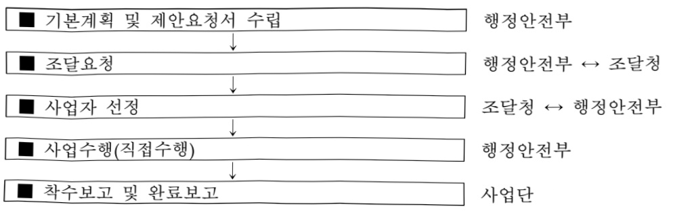

# 행정서비스통합포털운영(정보화)

**해당 페이지**: PDF 5286 ~ 5297 쪽 해당

**부처**: 행정안전부
**분야**: 일반·지방행정
**회계유형**: 일반
**2026 확정예산**: 22524.0 백만원
**전년대비 증감률**: -9.9%
**AI 도메인**: 행정/전자정부

---

<table border=1 style='margin: auto; word-wrap: break-word;'><tr><td style='text-align: center; word-wrap: break-word;'>사 업 명</td></tr><tr><td style='text-align: center; word-wrap: break-word;'>(28) 행정서비스통합포털운영(정보화) (2047-500)</td></tr></table>

## □ 사업 코드 정보

<table border=1 style='margin: auto; word-wrap: break-word;'><tr><td style='text-align: center; word-wrap: break-word;'>구분</td><td style='text-align: center; word-wrap: break-word;'>회계</td><td style='text-align: center; word-wrap: break-word;'>소관</td><td style='text-align: center; word-wrap: break-word;'>실국(기관)</td><td style='text-align: center; word-wrap: break-word;'>계정</td><td style='text-align: center; word-wrap: break-word;'>분야</td><td style='text-align: center; word-wrap: break-word;'>부문</td></tr><tr><td style='text-align: center; word-wrap: break-word;'>코드</td><td rowspan="2">일반</td><td rowspan="2">행정안전부</td><td rowspan="2">인공지능정부실</td><td rowspan="2">-</td><td style='text-align: center; word-wrap: break-word;'>010</td><td style='text-align: center; word-wrap: break-word;'>015</td></tr><tr><td style='text-align: center; word-wrap: break-word;'>명칭</td><td style='text-align: center; word-wrap: break-word;'>일반·지방행정</td><td style='text-align: center; word-wrap: break-word;'>정부자원관리</td></tr></table>

<table border=1 style='margin: auto; word-wrap: break-word;'><tr><td style='text-align: center; word-wrap: break-word;'>구분</td><td style='text-align: center; word-wrap: break-word;'>프로그램</td><td style='text-align: center; word-wrap: break-word;'>단위사업</td><td style='text-align: center; word-wrap: break-word;'>세부사업</td></tr><tr><td style='text-align: center; word-wrap: break-word;'>코드</td><td style='text-align: center; word-wrap: break-word;'>2000</td><td style='text-align: center; word-wrap: break-word;'>2047</td><td style='text-align: center; word-wrap: break-word;'>500</td></tr><tr><td style='text-align: center; word-wrap: break-word;'>명칭</td><td style='text-align: center; word-wrap: break-word;'>전자정부</td><td style='text-align: center; word-wrap: break-word;'>대민서비스기반확충</td><td style='text-align: center; word-wrap: break-word;'>행정서비스통합포털운영(정보화)</td></tr></table>

□ 사업 성격 (공통요구자료 Ⅱ-1 작성유의사항 5. 참조, 해당하는 사항에 “○” 표시)

<table border=1 style='margin: auto; word-wrap: break-word;'><tr><td rowspan="2">신규</td><td rowspan="2">계속</td><td rowspan="2">완료</td><td rowspan="2">예비타당성 실시여부</td><td rowspan="2">총사업비 관리대상</td><td rowspan="2">총액계상 예산사업</td><td style='text-align: center; word-wrap: break-word;'>사업소관 변경정보</td></tr><tr><td style='text-align: center; word-wrap: break-word;'>2025예산 시 소관</td></tr><tr><td style='text-align: center; word-wrap: break-word;'></td><td style='text-align: center; word-wrap: break-word;'>○</td><td style='text-align: center; word-wrap: break-word;'></td><td style='text-align: center; word-wrap: break-word;'></td><td style='text-align: center; word-wrap: break-word;'></td><td style='text-align: center; word-wrap: break-word;'></td><td style='text-align: center; word-wrap: break-word;'></td></tr></table>

□ 사업 지원 형태 및 지원을 (최소한 한 개는 반드시 선택하시오. 해당사항에 0 표시)

<table border=1 style='margin: auto; word-wrap: break-word;'><tr><td style='text-align: center; word-wrap: break-word;'>직접</td><td style='text-align: center; word-wrap: break-word;'>출자</td><td style='text-align: center; word-wrap: break-word;'>출연</td><td style='text-align: center; word-wrap: break-word;'>보조</td><td style='text-align: center; word-wrap: break-word;'>융자</td><td style='text-align: center; word-wrap: break-word;'>국고보조율(%)</td><td style='text-align: center; word-wrap: break-word;'>융자율(%)</td></tr><tr><td style='text-align: center; word-wrap: break-word;'>○</td><td style='text-align: center; word-wrap: break-word;'></td><td style='text-align: center; word-wrap: break-word;'></td><td style='text-align: center; word-wrap: break-word;'></td><td style='text-align: center; word-wrap: break-word;'></td><td style='text-align: center; word-wrap: break-word;'></td><td style='text-align: center; word-wrap: break-word;'></td></tr></table>

## □ 사업 담당자

<table border=1 style='margin: auto; word-wrap: break-word;'><tr><td style='text-align: center; word-wrap: break-word;'>사업명</td><td colspan="2">구분</td></tr><tr><td rowspan="2">행정서비스통합포털운영(정보화)</td><td rowspan="2">소관부처</td><td style='text-align: center; word-wrap: break-word;'>인공지능정부실인공지능정부서비스국</td></tr><tr><td style='text-align: center; word-wrap: break-word;'>통합포털정책과</td></tr></table>

---

### 가.예산 총괄표

(단위: 백만원, %)

<table border=1 style='margin: auto; word-wrap: break-word;'><tr><td rowspan="2">사업명</td><td rowspan="2">2024년 결산</td><td colspan="2">2025년 예산</td><td colspan="2">2026년 예산</td><td rowspan="2">중감 (B-A)</td><td rowspan="2">(B-A)/A</td></tr><tr><td style='text-align: center; word-wrap: break-word;'>본예산</td><td style='text-align: center; word-wrap: break-word;'>추경(A)</td><td style='text-align: center; word-wrap: break-word;'>요구안</td><td style='text-align: center; word-wrap: break-word;'>본예산B)</td></tr><tr><td style='text-align: center; word-wrap: break-word;'>행정서비스통합 포털운영(정보화)(2047-500)</td><td style='text-align: center; word-wrap: break-word;'>15,793</td><td style='text-align: center; word-wrap: break-word;'>24,999</td><td style='text-align: center; word-wrap: break-word;'>24,999</td><td style='text-align: center; word-wrap: break-word;'>21,780</td><td style='text-align: center; word-wrap: break-word;'>22,524</td><td style='text-align: center; word-wrap: break-word;'>△2,475</td><td style='text-align: center; word-wrap: break-word;'>△9.9</td></tr></table>

□ 기능별(내역사업별) 예산 내역

(단위:백만원)

<table border=1 style='margin: auto; word-wrap: break-word;'><tr><td rowspan="2"></td><td colspan="5">2024</td><td colspan="5">2025</td><td rowspan="2">2026 예산</td></tr><tr><td style='text-align: center; word-wrap: break-word;'>예산액(추정)</td><td style='text-align: center; word-wrap: break-word;'>예산현액</td><td style='text-align: center; word-wrap: break-word;'>집행액</td><td style='text-align: center; word-wrap: break-word;'>이월액</td><td style='text-align: center; word-wrap: break-word;'>불용액</td><td style='text-align: center; word-wrap: break-word;'>예산액(추정)</td><td style='text-align: center; word-wrap: break-word;'>예산현액</td><td style='text-align: center; word-wrap: break-word;'>집행액</td><td style='text-align: center; word-wrap: break-word;'>이월액</td><td style='text-align: center; word-wrap: break-word;'>불용액</td></tr><tr><td style='text-align: center; word-wrap: break-word;'>○ 기능별 분류(합계)</td><td style='text-align: center; word-wrap: break-word;'>16,251</td><td style='text-align: center; word-wrap: break-word;'>17,136</td><td style='text-align: center; word-wrap: break-word;'>15,793</td><td style='text-align: center; word-wrap: break-word;'>1,022</td><td style='text-align: center; word-wrap: break-word;'>321</td><td style='text-align: center; word-wrap: break-word;'>24,999</td><td style='text-align: center; word-wrap: break-word;'>26,021</td><td style='text-align: center; word-wrap: break-word;'>25,777</td><td style='text-align: center; word-wrap: break-word;'>-</td><td style='text-align: center; word-wrap: break-word;'>244</td><td style='text-align: center; word-wrap: break-word;'>22,524</td></tr><tr><td style='text-align: center; word-wrap: break-word;'>• 행정서비스통합 플랫폼구축</td><td style='text-align: center; word-wrap: break-word;'>8,270</td><td style='text-align: center; word-wrap: break-word;'>9,155</td><td style='text-align: center; word-wrap: break-word;'>8,040</td><td style='text-align: center; word-wrap: break-word;'>1,022</td><td style='text-align: center; word-wrap: break-word;'>93</td><td style='text-align: center; word-wrap: break-word;'>13,330</td><td style='text-align: center; word-wrap: break-word;'>14,352</td><td style='text-align: center; word-wrap: break-word;'>14,299</td><td style='text-align: center; word-wrap: break-word;'>-</td><td style='text-align: center; word-wrap: break-word;'>53</td><td style='text-align: center; word-wrap: break-word;'>8,683</td></tr><tr><td style='text-align: center; word-wrap: break-word;'>• 통합포털 유지보수 및 운영</td><td style='text-align: center; word-wrap: break-word;'>5,280</td><td style='text-align: center; word-wrap: break-word;'>5,280</td><td style='text-align: center; word-wrap: break-word;'>5,257</td><td style='text-align: center; word-wrap: break-word;'>-</td><td style='text-align: center; word-wrap: break-word;'>23</td><td style='text-align: center; word-wrap: break-word;'>7,664</td><td style='text-align: center; word-wrap: break-word;'>7,664</td><td style='text-align: center; word-wrap: break-word;'>7,656</td><td style='text-align: center; word-wrap: break-word;'>-</td><td style='text-align: center; word-wrap: break-word;'>8</td><td style='text-align: center; word-wrap: break-word;'>8,445</td></tr><tr><td style='text-align: center; word-wrap: break-word;'>• 대국민행정서비스 확산</td><td style='text-align: center; word-wrap: break-word;'>2,104</td><td style='text-align: center; word-wrap: break-word;'>2,104</td><td style='text-align: center; word-wrap: break-word;'>2,095</td><td style='text-align: center; word-wrap: break-word;'>-</td><td style='text-align: center; word-wrap: break-word;'>9</td><td style='text-align: center; word-wrap: break-word;'>3,031</td><td style='text-align: center; word-wrap: break-word;'>3,031</td><td style='text-align: center; word-wrap: break-word;'>3,028</td><td style='text-align: center; word-wrap: break-word;'>-</td><td style='text-align: center; word-wrap: break-word;'>3</td><td style='text-align: center; word-wrap: break-word;'>2,728</td></tr><tr><td style='text-align: center; word-wrap: break-word;'>• 행정서비스 통합 운영지원</td><td style='text-align: center; word-wrap: break-word;'>597</td><td style='text-align: center; word-wrap: break-word;'>597</td><td style='text-align: center; word-wrap: break-word;'>401</td><td style='text-align: center; word-wrap: break-word;'>-</td><td style='text-align: center; word-wrap: break-word;'>196</td><td style='text-align: center; word-wrap: break-word;'>674</td><td style='text-align: center; word-wrap: break-word;'>674</td><td style='text-align: center; word-wrap: break-word;'>495</td><td style='text-align: center; word-wrap: break-word;'>-</td><td style='text-align: center; word-wrap: break-word;'>179</td><td style='text-align: center; word-wrap: break-word;'>607</td></tr><tr><td style='text-align: center; word-wrap: break-word;'>• 통합창구 대상기관 연계지원</td><td style='text-align: center; word-wrap: break-word;'>-</td><td style='text-align: center; word-wrap: break-word;'>-</td><td style='text-align: center; word-wrap: break-word;'>-</td><td style='text-align: center; word-wrap: break-word;'>-</td><td style='text-align: center; word-wrap: break-word;'>-</td><td style='text-align: center; word-wrap: break-word;'>300</td><td style='text-align: center; word-wrap: break-word;'>300</td><td style='text-align: center; word-wrap: break-word;'>299</td><td style='text-align: center; word-wrap: break-word;'>-</td><td style='text-align: center; word-wrap: break-word;'>1</td><td style='text-align: center; word-wrap: break-word;'>270</td></tr></table>

### 나.사업설명자료

## 1 ) 사업목적·내용

- (행정서비스통합포털운영) 선제적·통합적 공공서비스 제공을 위해 국민이 한 곳에서 필요한 서비스를 찾을 수 있도록 통합포털 운영 및 고도화

- (행정서비스통합플랫폼 구축) 국민이 각종 공공서비스를 한 곳에서(국정14) AI를 활용해(국정24) 이용할 수 있도록 범정부 서비스 통합창구 구축

※ BPR/ISP('23년) 결과에 따라, 단계별 서비스 연계기관 확대, 단순링크 감축, 통합검색 등 시스템 고도화 추진('24년 ~ '26년)

- (통합포털 유지보수 및 운영) 정부24 응용프로그램 및 상용SW 유지관리, 서비스·콘텐츠 현행화 및 이용자 의견 등을 반영한 서비스 개선

---

- (대국민 행정서비스 확산) 정부24 안내·상담 헬프데스크(콜센터) 및 교육과정 운영

- (행정서비스통합 운영지원) 정부24 운영 관련 공공요금 납부, 행정서비스통합추진단 운영

- (AI 통합민원플랫폼 구축) 분절되어 관리·제공되는 공공서비스를 한곳에 모아 AI 기반의 통합적·선제적 서비스를 제공할 수 있도록 AI 통합민원플랫폼 프로토타입 구축 및 ISP 추진

※ (국정14)국민과 함께 소통하고 혁신하는 정부:선제적·통합적 공공서비스 제공

(국정24)세계 최고 AI 민주정부 실현:AI 정부 대전환을 위한 30대 과제 추진

## 2 ) 사업개요

□ 사업근거 및 추진경위

① 법령상 근거 및 조항 적시

◇ 전자정부법 제9조의2 (전자정부 포털을 통한 생활정보의 제공)

제9조의2(전자정부 포털을 통한 생활정보의 제공) ① 행정안전부장관은 전자정부서비스이용자에게 중앙행정기관과 그 소속 기관, 지방자치단체 및 공공기관이 보유한 본인의 건강검진일, 예방접종일, 운전면허갱신일 등 생활정보를 열람할 수 있는 전자정부서비스를 제공할 수 있다. 이 경우 행정안전부장관은 다른 중앙행정기관 등의 장과 협의하여 제20조에 따른 전자정부 포털과 다른 중앙행정기관 등의 정보시스템을 연계할 수 있다.

② 제1항에 따라 제공하는 생활정보 열람서비스의 종류는 행정안전부장관이 관계 중앙행정기관 등의 장과 협의를 거쳐 결정 · 고시한다.

◇ 전자정부법 제12조의2~4 (공공서비스 목록관리, 등록시스템의 구축·운영 등)

제12조의2(공공서비스 지정 및 목록 통보 등) ① 중앙행정기관등의 장은 소관 법령(지방자치단체의 조례 및 규칙을 포함한다)에 따라 노인, 장애인, 보훈대상자 등 일정한 요건을 갖춘 사람에게 제공하는 재화, 서비스 등을 공공서비스(이하 "공공서비스"라 한다)로 지정하여 그 목록을 행정안전부장관에게 통보하여야 한다. 공공서비스의 목록이 변경되는 경우에도 또한 같다.

제12조의3(등록시스템의 구축·운영 등) ① 행정안전부장관은 공공서비스 목록을 등록하고 관리·활용하기 위한 시스템을 구축·운영할 수 있다. 이 경우 다른 중앙행정기관등의 정보시스템을 연계할 수 있으며 해당 기관과 협의하여야 한다.

② 행정안전부장관은 등록시스템의 구축·운영 등을 위하여 공공서비스 제공 대상자의 사전동의를 받아 다른 행정기관등이 보유한 주민등록·가족관계등록·국세·지방세·금융·부동산·국민연금·건강보험 등에 관한 자료의 제공을 요청할 수 있다.

제12조의4(공공서비스 목록의 제공 등) ① 지방자치단체의 장은 공공서비스 제공 대상자 등이 공공서비스 목록의 열람을 신청하면 등록시스템을 통하여 해당 신청자에게 필요한 공공서비스 목록을 제공할 수 있다.

② 지방자치단체의 장은 제1항에 따라 공공서비스 목록을 제공받은 자가 공공서비스의 제공을 신청할 때에는 해당 신청서를 해당 중앙행정기관등의 장에게 이송하여야 한다.

---

◇ 전자정부법 제20조(전자정부 포털의 운영)

제20조(전자정부 포털의 운영) ① 국가는 국민에게 전자정부서비스를 효율적으로 제공하기 위하여 인터넷 기반의 통합정보시스템을 구축 · 관리하고 활용을 촉진하여야 한다.

② 전자정부 포털의 구축 · 관리 및 활용촉진에 필요한 사항은 대통령령으로 정한다.

◇ 행정서비스통합추진단 설치 및 운영에 관한 규정(국무총리훈령)

제3조(추진단의 설치 및 기능) ① 행정서비스 연계 및 통합업무를 효율적으로 추진하기 위하여 행정안전부 정부혁신조직실에 행정서비스 통합 추진단을 둔다.
② 추진단은 다음 각 호의 업무를 수행한다.
1. 행정서비스의 개선 및 통합 제공을 위한 정책의 수립·조정 및 법·제도의 정비 등 운영 여건의 조성에 관한 사항
2. 행정서비스의 통합 제공을 위한 인터넷 기반의 통합정보시스템 구축·운영에 관한 사항
3. 법 제2조제2호 및 제3호의 행정기관 및 공공기관이 구축한 포럴 및 사이트의 회원
정보를 묶어 그 회원이 해당 포럴 및 사이트에서 제공하는 행정서비스에 쉽게 접근할 수 있도록 하기 위한 통합 인증 및 각종 행정서비스 연계 확대에 관한 사항
4. 행정서비스의 개선·운영에 관한 사항
5. 그 밖에 행정서비스 통합제공 및 개선에 관한 사항

◇ 민원 처리에 관한 법률 제12조의2(전자민원창구 및 통합전자민원창구의 운영 등)

<table border=1 style='margin: auto; word-wrap: break-word;'><tr><td style='text-align: center; word-wrap: break-word;'>제12조의2(전자민원창구 및 통합전자민원창구의 운영 등) ① 행정기관의 장은 민원인이 해당 기관을 직접 방문하지 아니하고도 민원을 처리할 수 있도록 관계법령등을 개선하고 민원의 전자적 처리를 위한 시설과 정보시스템을 구축하는 등 필요한 조치를 하여야 한다.</td></tr><tr><td style='text-align: center; word-wrap: break-word;'>② 행정기관의 장은 제1항에 따른 조치로서 인터넷을 통하여 민원을 신청·접수받아 처리할 수 있는 정보시스템(이하 &quot;전자민원창구&quot;라 한다)을 구축·운영할 수 있다. 다만, 전자민원창구를 구축하지 아니한 경우에는 제3항에 따른 통합전자민원창구를 통하여 민원을 신청·접수받아 처리할 수 있다.</td></tr><tr><td style='text-align: center; word-wrap: break-word;'>③ 행정안전부장관은 전자민원창구의 구축·운영을 지원하고 각 행정기관의 전자민원창구를 연계하기 위하여 통합전자민원창구를 구축·운영할 수 있다.</td></tr><tr><td style='text-align: center; word-wrap: break-word;'>④ 민원인이 전자민원창구나 통합전자민원창구를 통하여 민원을 신청한 경우에는 관계 법령등에 따라 해당 민원을 소관하는 행정기관에 민원을 신청한 것으로 본다.</td></tr><tr><td style='text-align: center; word-wrap: break-word;'>⑤ 행정기관의 장은 전자민원창구나 통합전자민원창구를 통하여 민원을 처리하는 경우에는 다른 법률에도 불구하고 수수료를 감면할 수 있다.</td></tr><tr><td style='text-align: center; word-wrap: break-word;'>⑥ 행정기관의 장은 전자민원창구나 통합전자민원창구를 통하여 민원을 신청한 민원인이 정보통신망을 이용한 전자화폐·전자결제 등의 방법으로 수수료를 납부하는 경우에는 해당 수수료 외에 별도의 업무처리비용을 함께 청구할 수 있다.</td></tr><tr><td style='text-align: center; word-wrap: break-word;'>⑦ 전자민원창구 및 통합전자민원창구의 구축·운영, 제5항에 따라 수수료를 감면할 수 있는 민원의 범위 및 감면 비율과 제6항에 따른 업무처리비용의 청구 기준 등에 관하여 필요한 사항은 국회규칙, 대법원규칙, 헌법재판소규칙, 중앙선거관리위원회규칙 및 대통령령으로 정한다.</td></tr></table>

---

## ② 추진경위

- '09년 ~ '11년 : 대한민국정부포털 1~3단계 구축사업

- '12년 ~ '13년 : 대한민국정부포털 운영 및 이용활성화 사업

- '15. 10. : 행정서비스 통합 정보화전략계획(BPR/ISP) 수립

- '16. 6.~ '17. 5. :『행정서비스 통합제공시스템 구축 1단계』 사업 추진

- '17. 6 ~ '20. 4. :『행정서비스 통합제공시스템 구축 2단계』사업 추진

- '17. 7. 26 : 행정서비스통합포털『정부24』공식 개통

- '20. 5. ~ '22. 12. : 「정부24」 국가보조금 맞춤형서비스 구축(1, 2, 3차)

- '21. 5 ~ '22. 11. : 「정부24」 생활맞춤형 연계서비스 기반구축(1, 2차)

- '23. 4. ~ '23. 10. : 행정서비스통합플랫폼 구축 BPR/ISP 추진

- '23. 9. ~ '24. 5. : 「정부24」생활맞춤형 연계서비스 기반구축(3차)

- '24. 8. ~ '25. 3. : 범정부서비스 통합창구 구축(1차)

- '25. 4. ~ '25. 12. : 범정부서비스 통합창구 구축(2차)

## □ 주요내용

① 사업규모

- 총사업비(해당되는 경우에만 기재) : 해당없음

- 사업기간 : '12년 ~ 계속

-최근 5년 간 투입된 사업비(예산액기준, 추경편성한 연도에는 추경포함)

<table border=1 style='margin: auto; word-wrap: break-word;'><tr><td style='text-align: center; word-wrap: break-word;'>연도</td><td style='text-align: center; word-wrap: break-word;'>2022</td><td style='text-align: center; word-wrap: break-word;'>2023</td><td style='text-align: center; word-wrap: break-word;'>2024</td><td style='text-align: center; word-wrap: break-word;'>2025</td><td style='text-align: center; word-wrap: break-word;'>2026</td></tr><tr><td style='text-align: center; word-wrap: break-word;'>사업비</td><td style='text-align: center; word-wrap: break-word;'>15,205</td><td style='text-align: center; word-wrap: break-word;'>8,591</td><td style='text-align: center; word-wrap: break-word;'>16,251</td><td style='text-align: center; word-wrap: break-word;'>24,999</td><td style='text-align: center; word-wrap: break-word;'>22,524</td></tr></table>

② 사업추진체계

- 사업시행방법 : 직접수행

- 사업시행주체 : 행정안전부

-사업 수혜자 : 전국민

- 보조, 융자, 출연, 출자 등의 경우 보조·융자 등 지원 비율 및 법적근거 : 해당없음

---

## 3 ) '26년도 예산 산출 근거

☐ 행정서비스통합포털운영(정보화) : (2026 예산) 22,524백만원

① 행정서비스 통합플랫폼 구축 : (2026 예산) 8,683백만원
- (산출) 서비스 기능개발 5,107백, 통합창구 클라우드 이용료 3,576백

② 통합포털운영 및 유지보수 : (2026 예산) 8,445백만원
- (산출)
- 응용SW 유지보수 : (기준) 정부24,237백만원 + (추가) 병정부 통합창구 1차 380백만원 = 4,617백만원
- 상용SW 유지보수 : 정부24 검색엔진, 통합창구 1차 도입 SW 등 1,255백만원
- 범정부 서비스 통합창구 운영(직접인건비+제경비+기술료+부가세) : 1,858백
- 정부24H/W(스토리지) 증설(12TB) : 99백만원
- 정부24 운영감리 : 186백만원
- 정부24 클라우드 전환운영 : 430백만원
* 정부24 클라우드 전용 H/W 및 시스템 S/W 임차비 : 377백
** 클라우드 인프라 매니지드 이용 및 시스템 모니터링SW 구독료 : 53백

③ 대국민 행정서비스 확산 : (2026 예산) 2,728백만원
- (산출)
  - 정부24 헬프데스크 운영 : IT지원기술자 38명 x 4,493,456원 x 12개월 x 1.1(부가세) x 할인율(99.75%) = 2,248백만원
  - 헬프데스크 전용망 이용요금 : 헬프데스크 전용망 이용요금(6.2백) x 12개월 = 74백
  - 헬프데스크 H/W 유지보수 : H/W 도입가(316백)×유지관리 적용 요율(5%), 8식 = 16백
  - 정부24 24시간 관제 운영 : 390백만원

④ 행정서비스 통합운영 지원 : (2026 예산) 607백만원
- (산출)
  - 정부24 운영 지원 : 201백만원
  (일반수용비) 87백, (특근매식비) 10백, (임차료) 21백, (국내여비) 36백, (관서업무추진비) 19백
  (기타운영비) 4백, (직책수행경비) 23백
- 정부24 SMS 이용요금 등 : SMS 서비스 이용요금 : 33.8백 × 12개월 = 406백만원

⑤ 통합창구 대상기관 연계지원 : (2026 예산) 270백만원
- (산출) 연계개발 기술 및 검증 지원 : 270백

⑥ AI 통합민원플랫폼 구축 : (2026 예산) 1,791백만원
- (산출) AI 통합민원플랫폼 프로토타입 개발 및 ISP : 1,791백만원

---

## 4 ) 사업효과

☐ 사업영향, 산출물 성과지표 등

①2022~2026년도 성과계획서 상 성과지표 및 최근 5년간 성과 달성도

<table border=1 style='margin: auto; word-wrap: break-word;'><tr><td style='text-align: center; word-wrap: break-word;'>성과지표</td><td style='text-align: center; word-wrap: break-word;'>구분</td><td style='text-align: center; word-wrap: break-word;'>2022</td><td style='text-align: center; word-wrap: break-word;'>2023</td><td style='text-align: center; word-wrap: break-word;'>2024</td><td style='text-align: center; word-wrap: break-word;'>2025</td><td style='text-align: center; word-wrap: break-word;'>2026</td><td style='text-align: center; word-wrap: break-word;'>2026 목표치산출근거</td><td style='text-align: center; word-wrap: break-word;'>측정산식(또는 측정방법)</td><td style='text-align: center; word-wrap: break-word;'>자료수집방법(또는 자료출처)</td></tr><tr><td rowspan="3">인공지능전자정부서비스이용률(단위: %)</td><td style='text-align: center; word-wrap: break-word;'>목표</td><td style='text-align: center; word-wrap: break-word;'>-</td><td style='text-align: center; word-wrap: break-word;'>-</td><td style='text-align: center; word-wrap: break-word;'>-</td><td style='text-align: center; word-wrap: break-word;'>18</td><td style='text-align: center; word-wrap: break-word;'>19.8</td><td rowspan="3">전년도 실적의 10% 증가율적용</td><td rowspan="3">‘최근 1년간 인공지능(AI)을 활용한 전자정부서비스를 이용한 적이 있다’라고답한 국민 수/전체 표본 국민 수만 16~74세의 일반국민, 4,000명)×100</td><td rowspan="3">국가승인통계</td></tr><tr><td style='text-align: center; word-wrap: break-word;'>실적</td><td style='text-align: center; word-wrap: break-word;'>-</td><td style='text-align: center; word-wrap: break-word;'>-</td><td style='text-align: center; word-wrap: break-word;'>-</td><td style='text-align: center; word-wrap: break-word;'>-</td><td style='text-align: center; word-wrap: break-word;'>-</td></tr><tr><td style='text-align: center; word-wrap: break-word;'>달성도</td><td style='text-align: center; word-wrap: break-word;'>-</td><td style='text-align: center; word-wrap: break-word;'>-</td><td style='text-align: center; word-wrap: break-word;'>-</td><td style='text-align: center; word-wrap: break-word;'>-</td><td style='text-align: center; word-wrap: break-word;'>-</td></tr><tr><td rowspan="3">전자정부서비스만족도(단위: 점)</td><td style='text-align: center; word-wrap: break-word;'>목표</td><td style='text-align: center; word-wrap: break-word;'>-</td><td style='text-align: center; word-wrap: break-word;'>87.9</td><td style='text-align: center; word-wrap: break-word;'>87.9</td><td style='text-align: center; word-wrap: break-word;'>87.9</td><td style='text-align: center; word-wrap: break-word;'>-</td><td rowspan="3">해당없음</td><td rowspan="3">전자정부서비스만족도(점) = ‘최근 1년 간 전자정부서비스에 대해 전반적으로 만족한다는 문항에 대해 7점 리커트 척도 점수를 100점으로 환산하여 평균값산출</td><td rowspan="3">국가승인통계</td></tr><tr><td style='text-align: center; word-wrap: break-word;'>실적</td><td style='text-align: center; word-wrap: break-word;'>- (87.7)</td><td style='text-align: center; word-wrap: break-word;'>86.3</td><td style='text-align: center; word-wrap: break-word;'>89.4</td><td style='text-align: center; word-wrap: break-word;'>-</td><td style='text-align: center; word-wrap: break-word;'>-</td></tr><tr><td style='text-align: center; word-wrap: break-word;'>달성도</td><td style='text-align: center; word-wrap: break-word;'>-</td><td style='text-align: center; word-wrap: break-word;'>98.2</td><td style='text-align: center; word-wrap: break-word;'>102.4</td><td style='text-align: center; word-wrap: break-word;'>-</td><td style='text-align: center; word-wrap: break-word;'>-</td></tr><tr><td rowspan="3">전자정부서비스이용률(고령층)(단위: %)</td><td style='text-align: center; word-wrap: break-word;'>목표</td><td style='text-align: center; word-wrap: break-word;'>59.9</td><td style='text-align: center; word-wrap: break-word;'>68.1</td><td style='text-align: center; word-wrap: break-word;'>-</td><td style='text-align: center; word-wrap: break-word;'>-</td><td style='text-align: center; word-wrap: break-word;'>-</td><td rowspan="3">해당없음</td><td rowspan="3">전자정부서비스이용률(고령층)(%) = ‘최근1년 간 전자정부서비스를 이용해본 적이 있다’라고 답한 만60~74세 국민수/1천세표본(만16~74세 일반국민 4,000명)중 만0~74세 국민수×100</td><td rowspan="3">국가승인통계</td></tr><tr><td style='text-align: center; word-wrap: break-word;'>실적</td><td style='text-align: center; word-wrap: break-word;'>77.2</td><td style='text-align: center; word-wrap: break-word;'>73.4</td><td style='text-align: center; word-wrap: break-word;'>-</td><td style='text-align: center; word-wrap: break-word;'>-</td><td style='text-align: center; word-wrap: break-word;'>-</td></tr><tr><td style='text-align: center; word-wrap: break-word;'>달성도</td><td style='text-align: center; word-wrap: break-word;'>128.9</td><td style='text-align: center; word-wrap: break-word;'>107.8</td><td style='text-align: center; word-wrap: break-word;'>-</td><td style='text-align: center; word-wrap: break-word;'>-</td><td style='text-align: center; word-wrap: break-word;'>-</td></tr><tr><td rowspan="3">전자정부서비스이용률(단위: %)</td><td style='text-align: center; word-wrap: break-word;'>목표</td><td style='text-align: center; word-wrap: break-word;'>89.6</td><td style='text-align: center; word-wrap: break-word;'>-</td><td style='text-align: center; word-wrap: break-word;'>-</td><td style='text-align: center; word-wrap: break-word;'>-</td><td style='text-align: center; word-wrap: break-word;'>-</td><td rowspan="3">해당없음</td><td rowspan="3">전자정부서비스이용률(전체)(%) = ‘최근1년 간 전자정부서비스를 이용해본 적이 있다’라고 답한 국민수/1천세표본 국민수(만16~74세 의 일반국민 4,000명)×100</td><td rowspan="3">국가승인통계</td></tr><tr><td style='text-align: center; word-wrap: break-word;'>실적</td><td style='text-align: center; word-wrap: break-word;'>92.2</td><td style='text-align: center; word-wrap: break-word;'>90.6</td><td style='text-align: center; word-wrap: break-word;'>-</td><td style='text-align: center; word-wrap: break-word;'>-</td><td style='text-align: center; word-wrap: break-word;'>-</td></tr><tr><td style='text-align: center; word-wrap: break-word;'>달성도</td><td style='text-align: center; word-wrap: break-word;'>102.9</td><td style='text-align: center; word-wrap: break-word;'>-</td><td style='text-align: center; word-wrap: break-word;'>-</td><td style='text-align: center; word-wrap: break-word;'>-</td><td style='text-align: center; word-wrap: break-word;'>-</td></tr><tr><td rowspan="3">주요공공서비스의디지털 전환율(단위: %)</td><td style='text-align: center; word-wrap: break-word;'>목표</td><td style='text-align: center; word-wrap: break-word;'>50</td><td style='text-align: center; word-wrap: break-word;'>-</td><td style='text-align: center; word-wrap: break-word;'>-</td><td style='text-align: center; word-wrap: break-word;'>-</td><td style='text-align: center; word-wrap: break-word;'>-</td><td rowspan="3">해당없음</td><td rowspan="3">주요 공공서비스의 디지털 전환율 = ‘개별 공공서비스의 디지털 전환율 전체 평균값 -개별 공공서비스의 디지털 전환율 = ‘해당 서비스의 공동지표와 서비스 유형론 지표에서의 총 획득점수 = ‘적용된 지표의 총 배접’</td><td rowspan="3">외부전문가를 통한 사용자(end user) 관점의 측정 주요 공공서비스(10대 분야 27개 소분류 56개 서비스)</td></tr><tr><td style='text-align: center; word-wrap: break-word;'>실적</td><td style='text-align: center; word-wrap: break-word;'>67.3</td><td style='text-align: center; word-wrap: break-word;'>-</td><td style='text-align: center; word-wrap: break-word;'>-</td><td style='text-align: center; word-wrap: break-word;'>-</td><td style='text-align: center; word-wrap: break-word;'>-</td></tr><tr><td style='text-align: center; word-wrap: break-word;'>달성도</td><td style='text-align: center; word-wrap: break-word;'>134.6</td><td style='text-align: center; word-wrap: break-word;'>-</td><td style='text-align: center; word-wrap: break-word;'>-</td><td style='text-align: center; word-wrap: break-word;'>-</td><td style='text-align: center; word-wrap: break-word;'>-</td></tr></table>

---

<table border=1 style='margin: auto; word-wrap: break-word;'><tr><td style='text-align: center; word-wrap: break-word;'>2022</td><td style='text-align: center; word-wrap: break-word;'>○ 대국민행정서비스통합포털(정부24) 운영 관리 및 유지보수 - 319개 기관(중앙 30, 지자체 245, 공공기관 43, 사법기관 1) 117개 시스템 연계 운영관리 &lt; 정부24 서비스 현황&gt; ※ (정부서비스) 9만여 개의 행정기관 주요서비스 안내 • 분실 주민등록증 조회 등 ‘나의생활정보’ 8개 분야 69종 제공 • 모바일서비스 970개(법정민원 599종, 정부서비스 282종, 생활정보 69종, 진위확인 20종) ※ 전재민원 서비스(1,315종: 발급서비스(171종, 신고서비스(198종, 조회서비스(81종) ※ 정책정보 105개 사이트 연계 연구보고서 등 175만건 원문제공 기관정보공모전지역축제 등 안내 ○ 정부 24를 통한 공공서비스 제공방식 개선 - (생활밀착 서비스 온라인화) 국민이 자주 이용하는 대면서비스 40여 개를 정부 24에서 온라인으로 신청·처리할 수 있도록 개선 - (코로나19 생활지원비 온라인화) 유민동 방문 및 우편 신청했던 코로나 19 생활비를 정부24에서 신청할 수 있도록 개선 ○ 온라인을 통한 공공서비스 제공범위 확대 - (보조금24 확대) 국민이 혜택을 놓치지 않도록 보조금24 서비스 제공 종류를 7천여 개→1만여 개까지 확대 - 서비스 제공범위를 공공기관까지 확장, 서비스 안내 대상을 분리세대 가족까지 넓히는 등 서비스 제공 확대 - (원스톱 서비스 확대) 관계부처 협업을 통해 국민이 여러 서비스를 한 번에 확인·처리할 수 있는 원스톱 서비스 확대(+5종) ○ 정부24 회원 관리 : 1,961만 명</td></tr><tr><td style='text-align: center; word-wrap: break-word;'>2023</td><td style='text-align: center; word-wrap: break-word;'>○ 대국민행정서비스통합포털(정부24) 운영 관리 및 유지보수 - 333개 기관(중앙 30, 지자체 245, 공공기관 57, 사법기관 1) 117개 시스템 연계 운영관리 &lt; 정부24 서비스 현황&gt; ※ (정부서비스) 9만여 개의 행정기관 주요서비스 안내 • 분실 주민등록증 조회 등 ‘나의생활정보’ 8개 분야 69종 제공 • 모바일서비스 999개(법정민원 599종, 정부서비스 282종, 생활정보 69종, 진위확인 19종) ※ 전재민원 서비스(1,340종: 발급서비스(85종, 신청서비스(171종, 신고서비스(89종, 조회서비스(101종) ※ 정책정보 105개 사이트 연계 연구보고서 등 176만건 원문제공 기관정보공모전지역축제 등 안내 ○ 범정부 서비스 통합창구 구축 추진 - 국민이 정부의 서비스를 한 곳에서 이용할 수 있도록 범정부 서비스 통합창구 구축(~’26) - 범정부 통합창구 구축 BPR/ISP 사업 착수(4.10) - 관계기관 등 협의를 거쳐 사업 추진방향 설정(5월) - 중앙부처 대상 통합창구 구축 추진 방향 설명회 개최(6월~9월, 5회) - 범정부 통합창구 구축 BPR/ISP 사업 완료 ○ 온라인 신청 서비스 확대</td></tr></table>

---

<table border=1 style='margin: auto; word-wrap: break-word;'><tr><td style='text-align: center; word-wrap: break-word;'></td><td style='text-align: center; word-wrap: break-word;'>- 정부 24 온라인 신청플랫폼을 통해 대면으로 신청하던 수혜서비스를 정부24에서 직접 신청할 수 있도록 온라인화- 보조금 신청 서비스 온라인 전환 관계기관 설명회 개최* 및 수요조사 *중앙 2.14.~15 / 지자체 3.21.~22 / 공공기관 4.25~26.- 지자체 공공기관 등 담당자 대상 온라인 신청 플랫폼 활용 교육(5~7월) 및 전환 추진○ 원스톱 서비스 구축(11종)- 신규 원스톱 구축(1종, 다문화가족 정착지원), 기존 서비스 기능확대(4종, 온종일 돌봄, 꿈청소년, 노후생활, 전입신고+) 추진○ 정부24 회원 관리: 2,225만 명</td></tr><tr><td style='text-align: center; word-wrap: break-word;'>2024</td><td style='text-align: center; word-wrap: break-word;'>○ 대국민행정서비스통합포털(정부24) 운영 관리 및 유지보수- 325개 기관(중앙 27 지자체 245, 공공기관 52, 사법기관 1) 136개 시스템 연계 운영·관리 &lt; 정부24 서비스 제공 현황&gt;· 전자민원 서비스(1,361종): 발급서비스(914종), 신청서비스(185종), 신고서비스(178종), 조회서비스(84종)· 사실진위확인(20종), 원스톱 서비스(12종), 나의 생활정보 서비스(69종), 전자증명서 제공(288종), 모바일 서비스(1,014종) 등※ 모바일서비스 1,014개법정민원 626종, 정부서비스 299종, 생활정보 69종, 진위확인 20종· 정책정보 105개 사이트 연계 연구보고서 등 192만건 원문제공 기관정보·공모전지역축제 등 안내· 정부24 회원 관리: 2,371만 명- 정부24 주요서비스 관제 강화(일 4회, 점검, 상시모니터링)- 정부24 대국민 편의성 강화를 위한 지속적 기능개선 및 기관협의 추진- 보조금 24 서비스 안정적 운영○ 법정부서비스 통합창구 구축(1차)- 24년 범정부 서비스 통합창구 구축 사업 착수(&#x27;24.8. ~ &#x27;25.3.)- 구축 사업 착수보고회(8.29.) 및 중간보고회 개최(12.19.)- 유연하고 안정적인 인프라 구축을 위한 민간협력형 클라우드 도입(~12월)- &#x27;24년 5개 대상기관 협의를 통한 연계·통합 서비스 확정(약400여종)· 국민이 자주 이용하는 직접제공형 서비스 40종(4개 기관) 연계※ (국세청) 사업자등록상태 조회 등 10종 (고용부) 실업인정 신청 등 10종, (복지부) 보험료 완납증명서 발급 등 8종 (교육부) 학생생활기록부 발급 등 12종· 중복인증 없이 유기적으로 연계하는 기관연계형 서비스 약 300여종(5개 기관) 추진※ (법원행정처) 기족관계등록부 발급 등 5종, (국세청) 부가가치세 예정 신고 등 107종, (고용부) 구인·구직 신청 등 190종, (복지부) 건강보험 요양비 지급청구 등 56종, (교육부) 검정고시 응시 신청 등 18종</td></tr><tr><td style='text-align: center; word-wrap: break-word;'>2025</td><td style='text-align: center; word-wrap: break-word;'>○ 대국민행정서비스통합포털(정부24) 운영 관리 및 유지보수- 324개 기관(중앙 28, 지자체 245, 공공기관 50, 사법기관 1) 137개 시스템 연계 운영·관리 &lt; 정부24 서비스 제공 현황&gt;· 전자민원 서비스(1,366종): 발급서비스(920종), 신청서비스(183종), 신고서비스</td></tr></table>

---

<table border=1 style='margin: auto; word-wrap: break-word;'><tr><td style='text-align: center; word-wrap: break-word;'></td><td style='text-align: center; word-wrap: break-word;'>(179종), 조회서비스(84종) · 사실진위확인(20종), 원스톱 서비스(12종), 나의 생활정보 서비스(69종), 전자증명서 제공(294종), 모바일 서비스(1,023종) 등 ※ 모바일서비스 1,023개(법정민원 631종, 일반민원 303종, 생활정보 69종, 진위확인 20종) · 정책정보 106개 사이트 연계 연구보고서 등 202만 건 원문제공 기관정보·공모전·지역축제 등 안내 · 정부24 회원 관리 : 2,501만 명 - 정부24 주요서비스 관제 강화(일 4회, 점검, 상시모니터링) - 정부24 대국민 편의성 강화를 위한 지속적 기능개선 및 기관협의 추진 - 보조금 24 서비스 안정적 운영 ○ 범정부 서비스 통합창구 구축(1차) - 범정부 서비스 통합창구 구축(1차) 사업 완료 및 완료보고회(4.30.) 개최 - 범정부 서비스 통합창구(정부24+) 정식 개통(7.10.) ※ 5개 기관 400여종 서비스 직접 제공 및 중복인증 없이 연계 ○ 범정부 서비스 통합창구 구축(2차) - 범정부 서비스 통합창구 구축(2차) 추진계획 수립 및 사업 착수(&#x27;25.4.~12.) - 2차 구축사업 착수 및 착수보고회(6.26.) 및 중간보고회(10.31.) 개최 - 2차 구축사업 대상기관 실무협의체 개최(1.16., 3.20., 9.23., 11.27.) - &#x27;25년 8개 대상기관 협의를 통한 연계·통합 서비스 확정(약 400여종) · 국민이 자주 이용하는 직접제공형 서비스 40종 연계 ※ (경찰청)사이버범죄 신고접수, (행안부)지방세 납부확인서, (국토부)부동산 종합증명서 등 · 중복인증 없이 유기적으로 연계하는 기관연계형 서비스 약 400여종(8개 기관) 추진 ※ 경찰청, 관세청, 국토부, 권익위, 식약처, 농식품부, 금융위, 행안부</td></tr></table>

③향후(2026년도 이후)기대효과

- 국민이 AI를 활용하여 편리하게 범정부 서비스 통합창구에서 각종 공공서비스를 조회·

신청하고 확인할 수 있으며, 공공서비스를 하나로 연결함으로써 대국민 서비스 전달체계의 개선

- 정부24를 통해 국민이 편리하게 공공서비스를 이용할 수 있는 기반 마련

- 보조금24를 통해 국민이 정부 수혜서비스를 놓치지 않고 한 번에 확인·신청할 수 있는 환경 조성 및 복지 사각지대 해소

- 분절되어 관리·제공되는 공공서비스를 한곳에 모아 AI 기반의 통합적·선제적

서비스를 제공하는 AI 통합민원플랫폼 프로토타입 구축 및 ISP 추진

5) 타당성조사 및 예비타당성조사 시행여부 및 결과 요지 : 해당 없음

6) 총사업비 대상사업 여부 및 내역 : 해당 없음

---

## 7 ) 사업 집행절차

기본계획 및 제안요청서 수립

행정안전부

조달요청

행정안전부 $\leftrightarrow$ 조달청

사업자 선정

조달청 $\leftrightarrow$ 행정안전부

사업수행(직접수행)

행정안전부

착수보고 및 완료보고

사업단

## 8 ) 각종 평가

1) 국회(예결위, 상임위, 예정처, 국정감사 포함) 지적

- '행정서비스 통합플랫폼 구축'사업의 면밀한 사업계획 수립 및 사업관리 철저 필요

2) 대외공개 평가 : 해당 없음

3) 자체평가

- 효율적인 성과관리에 활용 가능한 성과정보를 도출할 수 있도록 추가적인 성과지표 검토 필요

---

### 다. 최근 4년간 결산내역 : 해당사항 없음

<table border=1 style='margin: auto; word-wrap: break-word;'><tr><td rowspan="2">연도</td><td colspan="3">예산액</td><td rowspan="2">예산현액(A)</td><td rowspan="2">집행액(B)</td><td rowspan="2">집행률(B/A)</td><td rowspan="2">다음연도이월액</td><td rowspan="2">불용액</td></tr><tr><td style='text-align: center; word-wrap: break-word;'>본예산</td><td style='text-align: center; word-wrap: break-word;'>추경증감액</td><td style='text-align: center; word-wrap: break-word;'>추경</td></tr><tr><td style='text-align: center; word-wrap: break-word;'>2022</td><td style='text-align: center; word-wrap: break-word;'>15,205</td><td style='text-align: center; word-wrap: break-word;'>-</td><td style='text-align: center; word-wrap: break-word;'>15,205</td><td style='text-align: center; word-wrap: break-word;'>15,205</td><td style='text-align: center; word-wrap: break-word;'>14,955</td><td style='text-align: center; word-wrap: break-word;'>98.4</td><td style='text-align: center; word-wrap: break-word;'>-</td><td style='text-align: center; word-wrap: break-word;'>250</td></tr><tr><td style='text-align: center; word-wrap: break-word;'>2023</td><td style='text-align: center; word-wrap: break-word;'>8,591</td><td style='text-align: center; word-wrap: break-word;'>-</td><td style='text-align: center; word-wrap: break-word;'>8,591</td><td style='text-align: center; word-wrap: break-word;'>8,591</td><td style='text-align: center; word-wrap: break-word;'>8,532</td><td style='text-align: center; word-wrap: break-word;'>99.3</td><td style='text-align: center; word-wrap: break-word;'>-</td><td style='text-align: center; word-wrap: break-word;'>59</td></tr><tr><td style='text-align: center; word-wrap: break-word;'>2024</td><td style='text-align: center; word-wrap: break-word;'>16,251</td><td style='text-align: center; word-wrap: break-word;'>-</td><td style='text-align: center; word-wrap: break-word;'>16,251</td><td style='text-align: center; word-wrap: break-word;'>17,136</td><td style='text-align: center; word-wrap: break-word;'>15,793</td><td style='text-align: center; word-wrap: break-word;'>92.2</td><td style='text-align: center; word-wrap: break-word;'>1,022</td><td style='text-align: center; word-wrap: break-word;'>321</td></tr><tr><td style='text-align: center; word-wrap: break-word;'>2025</td><td style='text-align: center; word-wrap: break-word;'>24,999</td><td style='text-align: center; word-wrap: break-word;'>-</td><td style='text-align: center; word-wrap: break-word;'>24,999</td><td style='text-align: center; word-wrap: break-word;'>26,021</td><td style='text-align: center; word-wrap: break-word;'>25,777</td><td style='text-align: center; word-wrap: break-word;'>99.1</td><td style='text-align: center; word-wrap: break-word;'>-</td><td style='text-align: center; word-wrap: break-word;'>244</td></tr></table>

## 2 ) 주요 결산사항

□ 2022~2025년 결산 주요 지적사항 및 시정요구사항

<table border=1 style='margin: auto; word-wrap: break-word;'><tr><td style='text-align: center; word-wrap: break-word;'>2022</td><td style='text-align: center; word-wrap: break-word;'>- 조 정 : 복합기, 노트북 등 임차료(20백), 공공요금 및 제세(31백) - 불 용 : 정보화사업 낙찰차액 및 코로나19 재확산에 따른 여비 불용액 등(250백)</td></tr><tr><td style='text-align: center; word-wrap: break-word;'>2023</td><td style='text-align: center; word-wrap: break-word;'>- 조 정 : 정부24 본인확인 등 메시지 발송 비용(24백) - 불 용 : 정보화사업 낙찰차액(34백) 및 특근매식비, 임차료 등 집행잔액(18백)</td></tr><tr><td style='text-align: center; word-wrap: break-word;'>2024</td><td style='text-align: center; word-wrap: break-word;'>- 전 용 : 민간클라우드 사용 부족 재원 마련(885백) - 불 용 : 정보화사업 낙찰 차액, 공공요금 및 제세, 특근매식비 등 집행잔액(321백)</td></tr><tr><td style='text-align: center; word-wrap: break-word;'>2025</td><td style='text-align: center; word-wrap: break-word;'>- 해당없음</td></tr></table>

□2025년 이·전용 등 세부내역

(단위:백만원)

<table border=1 style='margin: auto; word-wrap: break-word;'><tr><td rowspan="2">구분(날짜)</td><td colspan="2">~에서</td><td rowspan="2">금액</td><td colspan="2">~으로</td><td rowspan="2">이·전용 등 사유</td></tr><tr><td style='text-align: center; word-wrap: break-word;'>세부사업 명(사업코드)</td><td style='text-align: center; word-wrap: break-word;'>목-세목 코드</td><td style='text-align: center; word-wrap: break-word;'>세부사업 명(사업코드)</td><td style='text-align: center; word-wrap: break-word;'>목-세목 코드</td></tr><tr><td style='text-align: center; word-wrap: break-word;'>전용(2025328)</td><td style='text-align: center; word-wrap: break-word;'>행정서비스통합포털운영(정보화)(2047-500)</td><td style='text-align: center; word-wrap: break-word;'>210-15</td><td style='text-align: center; word-wrap: break-word;'>40</td><td style='text-align: center; word-wrap: break-word;'>행정서비스통합포털운영(정보화)(2047-500)</td><td style='text-align: center; word-wrap: break-word;'>260-01</td><td style='text-align: center; word-wrap: break-word;'>정부24 보안취약점 분석평가를 위한 부족재원 마련</td></tr></table>

---

### 원본 PDF 크롭 이미지

